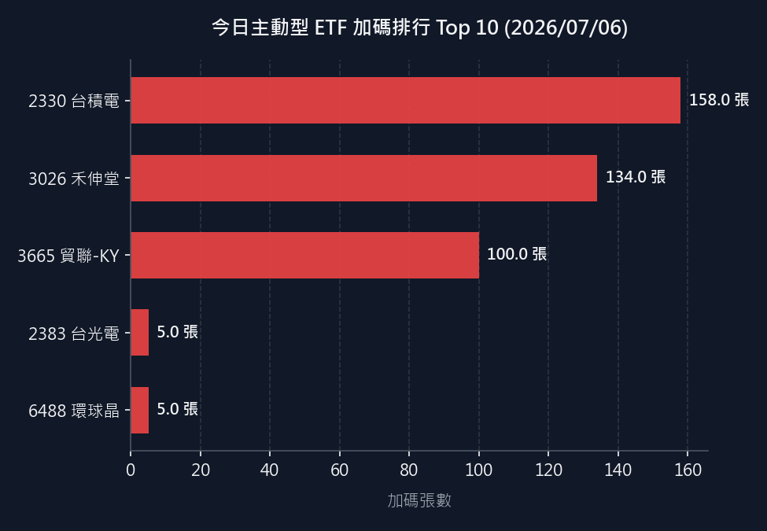
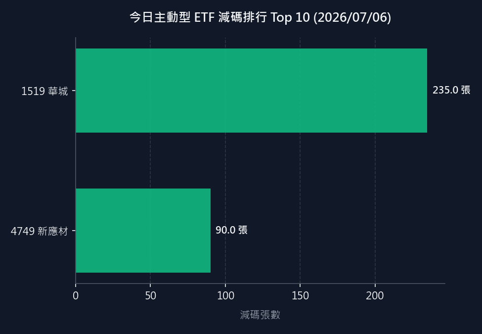

# 主動型 ETF 持股變動

資料來源：`主動型ETF持股明細.xlsx` 最近兩個日期分頁。

比較區間：`20260703` → `20260706`

## 今日加減碼視覺化排行

| 今日加碼 Top 10 | 今日減碼 Top 10 |
| :---: | :---: |
|  |  |

| ETF | 新增 | 刪除 | 比例變動 |
| :-- | --: | --: | --: |
| 00400A | 0 | 2 | 49 |
| 00401A | 0 | 0 | 0 |
| 00402A | 0 | 0 | 0 |
| 00403A | 0 | 0 | 0 |
| 00404A | 1 | 0 | 40 |
| 00405A | 0 | 0 | 0 |
| 00407A | 0 | 0 | 0 |
| 00980A | 1 | 0 | 42 |
| 00980D | 0 | 0 | 0 |
| 00981A | 0 | 0 | 0 |
| 00982A | 0 | 0 | 0 |
| 00983A | 0 | 0 | 0 |
| 00983D | 0 | 0 | 0 |
| 00984A | 0 | 0 | 0 |
| 00985A | 0 | 0 | 44 |
| 00986A | 0 | 0 | 0 |
| 00987A | 0 | 0 | 0 |
| 00988A | 0 | 0 | 0 |
| 00989A | 0 | 0 | 0 |
| 00990A | 0 | 0 | 0 |
| 00991A | 0 | 0 | 0 |
| 00992A | 0 | 0 | 0 |
| 00993A | 0 | 0 | 0 |
| 00994A | 0 | 0 | 0 |
| 00995A | 0 | 0 | 0 |
| 00996A | 0 | 0 | 39 |
| 00997A | 0 | 0 | 0 |
| 00998A | 0 | 0 | 0 |
| 00999A | 0 | 0 | 60 |

## 00400A

### 新增持股

- 無

### 刪除持股

- 1519 華城（0.69%，235 張）
- 4749 新應材（0.31%，90 張）

### 投資比例變動

- 1303 南亞：1.25% → 1.20%（-0.05）
- 1590 亞德客-KY：1.05% → 1.03%（-0.02）
- 2059 川湖：2.35% → 2.33%（-0.02）
- 2303 聯電：1.91% → 1.89%（-0.02）
- 2308 台達電：3.49% → 3.42%（-0.07）
- 2313 華通：0.47% → 0.49%（+0.02）
- 2327 國巨*：3.54% → 3.47%（-0.07）
- 2330 台積電：7.10% → 8.77%（+1.67）
- 2344 華邦電：1.29% → 1.30%（+0.01）
- 2345 智邦：2.34% → 2.31%（-0.03）
- 2357 華碩：1.23% → 1.26%（+0.03）
- 2360 致茂：3.45% → 3.38%（-0.07）
- 2368 金像電：1.88% → 1.80%（-0.08）
- 2376 技嘉：1.17% → 1.19%（+0.02）
- 2382 廣達：0.94% → 0.96%（+0.02）
- 2383 台光電：7.62% → 6.73%（-0.89）
- 2408 南亞科：1.88% → 1.97%（+0.09）
- 2481 強茂：0.44% → 0.49%（+0.05）
- 2881 富邦金：0.37% → 0.38%（+0.01）
- 2885 元大金：1.02% → 1.05%（+0.03）
- 3017 奇鋐：4.15% → 4.08%（-0.07）
- 3036 文曄：1.25% → 1.26%（+0.01）
- 3037 欣興：3.92% → 3.77%（-0.15）
- 3044 健鼎：2.03% → 2.01%（-0.02）
- 3090 日電貿：0.72% → 0.79%（+0.07）
- 3131 弘塑：0.60% → 0.55%（-0.05）
- 3231 緯創：0.84% → 0.85%（+0.01）
- 3293 鈊象：0.40% → 0.41%（+0.01）
- 3374 精材：0.32% → 0.34%（+0.02）
- 3443 創意：0.48% → 0.44%（-0.04）
- 3653 健策：0.81% → 0.80%（-0.01）
- 3665 貿聯-KY：0.81% → 1.55%（+0.74）
- 3711 日月光投控：1.56% → 1.59%（+0.03）
- 5274 信驊：2.22% → 2.12%（-0.10）
- 5347 世界：1.97% → 1.92%（-0.05）
- 6121 新普：0.29% → 0.32%（+0.03）
- 6147 頎邦：1.00% → 1.03%（+0.03）
- 6187 萬潤：0.59% → 0.60%（+0.01）
- 6223 旺矽：4.76% → 4.50%（-0.26）
- 6274 台燿：0.82% → 0.76%（-0.06）
- 6285 啟碁：0.71% → 0.72%（+0.01）
- 6488 環球晶：4.04% → 4.37%（+0.33）
- 6510 精測：0.88% → 0.82%（-0.06）
- 6515 穎崴：0.45% → 0.41%（-0.04）
- 6669 緯穎：2.78% → 2.71%（-0.07）
- 6715 嘉基：0.26% → 0.25%（-0.01）
- 8046 南電：0.30% → 0.27%（-0.03）
- 8150 南茂：0.09% → 0.10%（+0.01）
- 8210 勤誠：1.23% → 1.24%（+0.01）

## 00401A

### 新增持股

- 無

### 刪除持股

- 無

### 投資比例變動

- 無

## 00402A

### 新增持股

- 無

### 刪除持股

- 無

### 投資比例變動

- 無

## 00403A

### 新增持股

- 無

### 刪除持股

- 無

### 投資比例變動

- 無

## 00404A

### 新增持股

- 6488 環球晶（0.18%，5 張）

### 刪除持股

- 無

### 投資比例變動

- 2303 聯電：2.54% → 2.61%（+0.07）
- 2308 台達電：3.76% → 3.95%（+0.19）
- 2327 國巨*：0.67% → 0.66%（-0.01）
- 2330 台積電：22.08% → 21.85%（-0.23）
- 2345 智邦：1.03% → 1.02%（-0.01）
- 2347 聯強：1.76% → 1.79%（+0.03）
- 2360 致茂：1.02% → 1.04%（+0.02）
- 2382 廣達：2.62% → 2.67%（+0.05）
- 2383 台光電：1.96% → 2.10%（+0.14）
- 2454 聯發科：6.59% → 6.35%（-0.24）
- 2618 長榮航：1.90% → 1.89%（-0.01）
- 2883 凱基金：1.96% → 1.99%（+0.03）
- 2885 元大金：2.39% → 2.43%（+0.04）
- 2891 中信金：2.78% → 2.80%（+0.02）
- 3014 聯陽：1.76% → 1.73%（-0.03）
- 3017 奇鋐：0.79% → 0.80%（+0.01）
- 3034 聯詠：2.06% → 2.05%（-0.01）
- 3044 健鼎：1.80% → 1.84%（+0.04）
- 3217 優群：1.26% → 1.25%（-0.01）
- 3264 欣銓：1.10% → 1.09%（-0.01）
- 3265 台星科：1.27% → 1.24%（-0.03）
- 3293 鈊象：1.66% → 1.65%（-0.01）
- 3592 瑞鼎：1.27% → 1.25%（-0.02）
- 3711 日月光投控：3.72% → 3.48%（-0.24）
- 5274 信驊：2.26% → 2.19%（-0.07）
- 5347 世界：0.72% → 0.70%（-0.02）
- 5434 崇越：1.83% → 1.79%（-0.04）
- 5904 寶雅：1.82% → 1.87%（+0.05）
- 6121 新普：1.12% → 1.14%（+0.02）
- 6139 亞翔：0.24% → 0.25%（+0.01）
- 6223 旺矽：0.94% → 0.96%（+0.02）
- 6239 力成：0.15% → 0.16%（+0.01）
- 6257 矽格：1.83% → 1.85%（+0.02）
- 6515 穎崴：0.40% → 0.43%（+0.03）
- 6531 愛普*：0.19% → 0.20%（+0.01）
- 6903 巨漢：0.30% → 0.29%（-0.01）
- 8016 矽創：0.11% → 0.12%（+0.01）
- 8081 致新：1.84% → 1.85%（+0.01）
- 8299 群聯：1.17% → 1.19%（+0.02）
- 臺股期貨07/26：16.70% → 16.80%（+0.10）

## 00405A

### 新增持股

- 無

### 刪除持股

- 無

### 投資比例變動

- 無

## 00407A

### 新增持股

- 無

### 刪除持股

- 無

### 投資比例變動

- 無

## 00980A

### 新增持股

- 3026 禾伸堂（0.75%，134 張）

### 刪除持股

- 無

### 投資比例變動

- 2059 川湖：4.95% → 4.97%（+0.02）
- 2308 台達電：5.55% → 5.50%（-0.05）
- 2317 鴻海：1.74% → 1.81%（+0.07）
- 2327 國巨*：2.03% → 2.01%（-0.02）
- 2330 台積電：8.73% → 9.05%（+0.32）
- 2344 華邦電：1.20% → 1.22%（+0.02）
- 2345 智邦：2.00% → 1.99%（-0.01）
- 2360 致茂：1.82% → 1.81%（-0.01）
- 2368 金像電：2.89% → 2.79%（-0.10）
- 2376 技嘉：0.81% → 0.83%（+0.02）
- 2382 廣達：1.13% → 1.16%（+0.03）
- 2383 台光電：4.59% → 4.80%（+0.21）
- 2408 南亞科：1.31% → 1.39%（+0.08）
- 2454 聯發科：6.35% → 6.44%（+0.09）
- 2884 玉山金：0.73% → 0.77%（+0.04）
- 2891 中信金：1.13% → 1.18%（+0.05）
- 3008 大立光：0.83% → 0.84%（+0.01）
- 3017 奇鋐：2.04% → 2.03%（-0.01）
- 3036 文曄：1.33% → 1.36%（+0.03）
- 3037 欣興：3.07% → 2.99%（-0.08）
- 3081 聯亞：2.55% → 2.51%（-0.04）
- 3189 景碩：0.65% → 0.62%（-0.03）
- 3231 緯創：0.63% → 0.64%（+0.01）
- 3264 欣銓：0.24% → 0.26%（+0.02）
- 3293 鈊象：0.56% → 0.57%（+0.01）
- 3443 創意：1.99% → 1.87%（-0.12）
- 3529 力旺：0.94% → 0.98%（+0.04）
- 3711 日月光投控：1.54% → 1.58%（+0.04）
- 4958 臻鼎-KY：1.50% → 1.46%（-0.04）
- 5274 信驊：1.26% → 1.23%（-0.03）
- 5904 寶雅：1.27% → 1.34%（+0.07）
- 6223 旺矽：3.16% → 3.02%（-0.14）
- 6274 台燿：1.31% → 1.23%（-0.08）
- 6515 穎崴：3.07% → 2.84%（-0.23）
- 6669 緯穎：1.16% → 1.14%（-0.02）
- 6805 富世達：0.50% → 0.49%（-0.01）
- 6831 邁科：0.43% → 0.41%（-0.02）
- 7769 鴻勁：3.59% → 3.67%（+0.08）
- 8046 南電：1.46% → 1.37%（-0.09）
- 8210 勤誠：0.82% → 0.84%（+0.02）
- 8299 群聯：1.02% → 1.05%（+0.03）
- 8996 高力：1.72% → 1.83%（+0.11）

## 00980D

### 新增持股

- 無

### 刪除持股

- 無

### 投資比例變動

- 無

## 00981A

### 新增持股

- 無

### 刪除持股

- 無

### 投資比例變動

- 無

## 00982A

### 新增持股

- 無

### 刪除持股

- 無

### 投資比例變動

- 無

## 00983A

### 新增持股

- 無

### 刪除持股

- 無

### 投資比例變動

- 無

## 00983D

### 新增持股

- 無

### 刪除持股

- 無

### 投資比例變動

- 無

## 00984A

### 新增持股

- 無

### 刪除持股

- 無

### 投資比例變動

- 無

## 00985A

### 新增持股

- 無

### 刪除持股

- 無

### 投資比例變動

- 1216 統一：0.94% → 0.97%（+0.03）
- 2049 上銀：1.00% → 1.06%（+0.06）
- 2059 川湖：2.80% → 2.77%（-0.03）
- 2303 聯電：1.94% → 1.92%（-0.02）
- 2308 台達電：1.33% → 1.30%（-0.03）
- 2330 台積電：25.32% → 25.91%（+0.59）
- 2344 華邦電：1.48% → 1.50%（+0.02）
- 2345 智邦：2.38% → 2.34%（-0.04）
- 2360 致茂：1.93% → 1.89%（-0.04）
- 2368 金像電：1.49% → 1.42%（-0.07）
- 2376 技嘉：3.40% → 3.44%（+0.04）
- 2383 台光電：2.36% → 2.16%（-0.20）
- 2395 研華：2.68% → 2.70%（+0.02）
- 2408 南亞科：1.48% → 1.54%（+0.06）
- 2412 中華電：1.91% → 1.95%（+0.04）
- 2881 富邦金：0.67% → 0.69%（+0.02）
- 2891 中信金：0.51% → 0.53%（+0.02）
- 3008 大立光：2.72% → 2.70%（-0.02）
- 3017 奇鋐：1.77% → 1.75%（-0.02）
- 3036 文曄：2.33% → 2.34%（+0.01）
- 3081 聯亞：1.33% → 1.29%（-0.04）
- 3105 穩懋：0.58% → 0.60%（+0.02）
- 3131 弘塑：2.33% → 2.14%（-0.19）
- 3189 景碩：0.02% → 0.01%（-0.01）
- 3293 鈊象：1.17% → 1.19%（+0.02）
- 3529 力旺：0.65% → 0.67%（+0.02）
- 3533 嘉澤：0.21% → 0.20%（-0.01）
- 3653 健策：1.20% → 1.18%（-0.02）
- 3661 世芯-KY：3.21% → 2.96%（-0.25）
- 3665 貿聯-KY：0.25% → 0.24%（-0.01）
- 3711 日月光投控：0.90% → 0.91%（+0.01）
- 4958 臻鼎-KY：2.39% → 2.30%（-0.09）
- 6147 頎邦：1.86% → 1.90%（+0.04）
- 6187 萬潤：1.88% → 1.92%（+0.04）
- 6223 旺矽：1.53% → 1.45%（-0.08）
- 6415 矽力*-KY：0.56% → 0.58%（+0.02）
- 6442 光聖：3.10% → 3.07%（-0.03）
- 6488 環球晶：0.47% → 0.51%（+0.04）
- 6669 緯穎：0.75% → 0.73%（-0.02）
- 6805 富世達：0.22% → 0.21%（-0.01）
- 7769 鴻勁：0.84% → 0.85%（+0.01）
- 8046 南電：1.32% → 1.22%（-0.10）
- 8299 群聯：1.32% → 1.34%（+0.02）
- 8996 高力：0.77% → 0.81%（+0.04）

## 00986A

### 新增持股

- 無

### 刪除持股

- 無

### 投資比例變動

- 無

## 00987A

### 新增持股

- 無

### 刪除持股

- 無

### 投資比例變動

- 無

## 00988A

### 新增持股

- 無

### 刪除持股

- 無

### 投資比例變動

- 無

## 00989A

### 新增持股

- 無

### 刪除持股

- 無

### 投資比例變動

- 無

## 00990A

### 新增持股

- 無

### 刪除持股

- 無

### 投資比例變動

- 無

## 00991A

### 新增持股

- 無

### 刪除持股

- 無

### 投資比例變動

- 無

## 00992A

### 新增持股

- 無

### 刪除持股

- 無

### 投資比例變動

- 無

## 00993A

### 新增持股

- 無

### 刪除持股

- 無

### 投資比例變動

- 無

## 00994A

### 新增持股

- 無

### 刪除持股

- 無

### 投資比例變動

- 無

## 00995A

### 新增持股

- 無

### 刪除持股

- 無

### 投資比例變動

- 無

## 00996A

### 新增持股

- 無

### 刪除持股

- 無

### 投資比例變動

- 1303 南亞：0.53% → 0.52%（-0.01）
- 2049 上銀：0.39% → 0.42%（+0.03）
- 2308 台達電：4.18% → 4.17%（-0.01）
- 2327 國巨*：7.62% → 7.60%（-0.02）
- 2330 台積電：8.40% → 8.77%（+0.37）
- 2337 旺宏：0.25% → 0.26%（+0.01）
- 2344 華邦電：3.17% → 3.26%（+0.09）
- 2368 金像電：0.35% → 0.34%（-0.01）
- 2382 廣達：0.04% → 0.05%（+0.01）
- 2383 台光電：5.95% → 5.56%（-0.39）
- 2408 南亞科：2.33% → 2.48%（+0.15）
- 2454 聯發科：6.52% → 6.65%（+0.13）
- 2467 志聖：0.29% → 0.33%（+0.04）
- 2472 立隆電：4.90% → 4.85%（-0.05）
- 2882 國泰金：0.04% → 0.05%（+0.01）
- 3037 欣興：2.25% → 2.21%（-0.04）
- 3042 晶技：3.16% → 2.96%（-0.20）
- 3131 弘塑：1.82% → 1.70%（-0.12）
- 3189 景碩：0.89% → 0.85%（-0.04）
- 3443 創意：2.51% → 2.38%（-0.13）
- 3653 健策：1.31% → 1.32%（+0.01）
- 3661 世芯-KY：1.61% → 1.51%（-0.10）
- 3665 貿聯-KY：0.11% → 0.12%（+0.01）
- 3693 營邦：0.29% → 0.30%（+0.01）
- 3711 日月光投控：1.18% → 1.22%（+0.04）
- 4583 台灣精銳：0.36% → 0.37%（+0.01）
- 4958 臻鼎-KY：7.18% → 7.04%（-0.14）
- 5269 祥碩：0.65% → 0.67%（+0.02）
- 6213 聯茂：2.09% → 2.18%（+0.09）
- 6223 旺矽：2.69% → 2.59%（-0.10）
- 6239 力成：0.84% → 0.89%（+0.05）
- 6510 精測：2.48% → 2.38%（-0.10）
- 6526 達發：1.23% → 1.24%（+0.01）
- 6531 愛普*：1.78% → 1.79%（+0.01）
- 6770 力積電：1.18% → 1.21%（+0.03）
- 6831 邁科：3.13% → 3.03%（-0.10）
- 8021 尖點：0.88% → 0.87%（-0.01）
- 8046 南電：3.98% → 3.75%（-0.23）
- 8210 勤誠：1.68% → 1.72%（+0.04）

## 00997A

### 新增持股

- 無

### 刪除持股

- 無

### 投資比例變動

- 無

## 00998A

### 新增持股

- 無

### 刪除持股

- 無

### 投資比例變動

- 無

## 00999A

### 新增持股

- 無

### 刪除持股

- 無

### 投資比例變動

- 1319 東陽：0.94% → 0.97%（+0.03）
- 2059 川湖：4.70% → 4.67%（-0.03）
- 2204 中華：1.08% → 1.11%（+0.03）
- 2308 台達電：4.34% → 4.26%（-0.08）
- 2317 鴻海：0.90% → 0.92%（+0.02）
- 2330 台積電：8.48% → 8.71%（+0.23）
- 2345 智邦：2.02% → 1.99%（-0.03）
- 2347 聯強：1.13% → 1.14%（+0.01）
- 2357 華碩：0.99% → 1.01%（+0.02）
- 2360 致茂：1.98% → 1.95%（-0.03）
- 2368 金像電：2.62% → 2.51%（-0.11）
- 2382 廣達：1.20% → 1.23%（+0.03）
- 2383 台光電：4.31% → 3.97%（-0.34）
- 2393 億光：1.19% → 1.24%（+0.05）
- 2408 南亞科：2.32% → 2.43%（+0.11）
- 2451 創見：0.86% → 0.90%（+0.04）
- 2454 聯發科：4.54% → 4.56%（+0.02）
- 2618 長榮航：2.52% → 2.55%（+0.03）
- 2727 王品：1.14% → 1.16%（+0.02）
- 2884 玉山金：0.77% → 0.80%（+0.03）
- 2886 兆豐金：0.92% → 0.95%（+0.03）
- 2892 第一金：0.91% → 0.95%（+0.04）
- 3017 奇鋐：1.46% → 1.45%（-0.01）
- 3045 台灣大：0.93% → 0.96%（+0.03）
- 3081 聯亞：1.76% → 1.71%（-0.05）
- 3090 日電貿：0.83% → 0.90%（+0.07）
- 3227 原相：0.77% → 0.79%（+0.02）
- 3293 鈊象：0.94% → 0.95%（+0.01）
- 3592 瑞鼎：1.19% → 1.24%（+0.05）
- 3653 健策：2.33% → 2.31%（-0.02）
- 3665 貿聯-KY：1.39% → 1.38%（-0.01）
- 3702 大聯大：0.85% → 0.87%（+0.02）
- 3706 神達：0.55% → 0.56%（+0.01）
- 3711 日月光投控：1.77% → 1.80%（+0.03）
- 4746 台耀：0.89% → 0.92%（+0.03）
- 4915 致伸：1.35% → 1.42%（+0.07）
- 5274 信驊：1.24% → 1.19%（-0.05）
- 5534 長虹：1.19% → 1.22%（+0.03）
- 5904 寶雅：0.91% → 0.95%（+0.04）
- 6121 新普：1.32% → 1.48%（+0.16）
- 6138 茂達：0.79% → 0.89%（+0.10）
- 6223 旺矽：2.22% → 2.11%（-0.11）
- 6274 台燿：1.40% → 1.30%（-0.10）
- 6515 穎崴：2.55% → 2.35%（-0.20）
- 6669 緯穎：1.28% → 1.25%（-0.03）
- 6670 復盛應用：1.16% → 1.18%（+0.02）
- 6768 志強-KY：0.77% → 0.79%（+0.02）
- 6782 視陽：0.46% → 0.47%（+0.01）
- 6805 富世達：1.04% → 1.02%（-0.02）
- 7769 鴻勁：3.05% → 3.08%（+0.03）
- 8112 至上：1.06% → 1.04%（-0.02）
- 8210 勤誠：1.05% → 1.06%（+0.01）
- 8299 群聯：1.32% → 1.34%（+0.02）
- 9802 鈺齊-KY：0.69% → 0.70%（+0.01）
- 9907 統一實：0.96% → 0.97%（+0.01）
- 9938 百和：1.12% → 1.13%（+0.01）
- 9939 宏全：0.77% → 0.80%（+0.03）
- 9941 裕融：1.10% → 1.13%（+0.03）
- 9945 潤泰新：0.75% → 0.77%（+0.02）
- 9958 世紀鋼：0.54% → 0.55%（+0.01）
