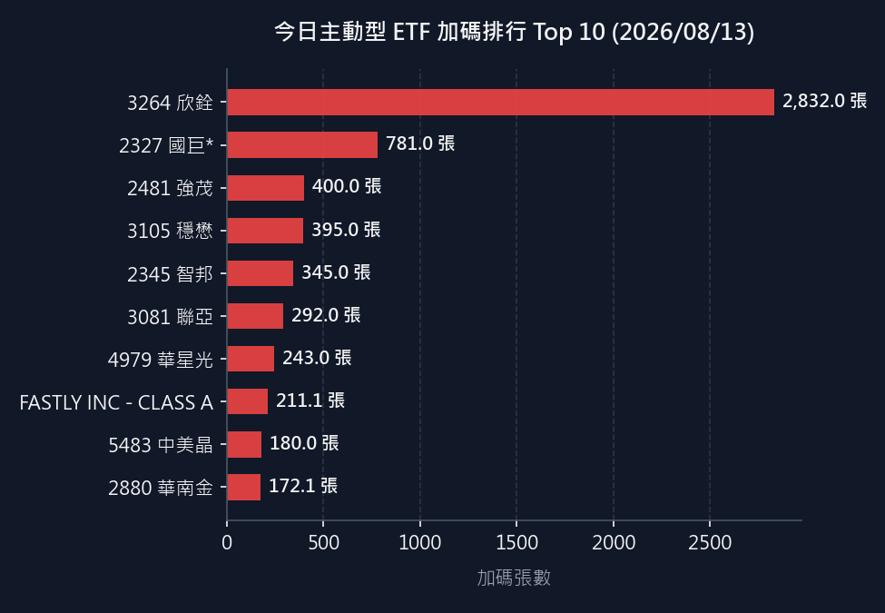
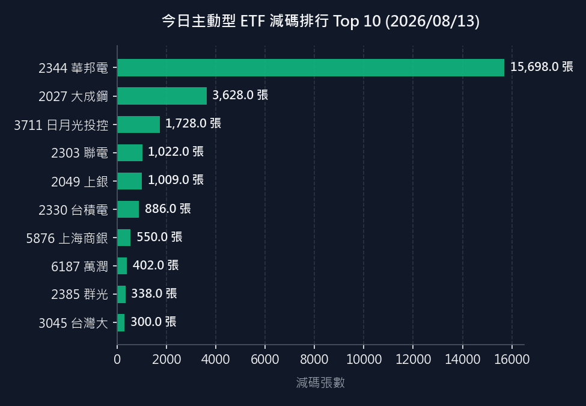

# 主動型 ETF 持股變動

資料來源：`主動型ETF持股明細.xlsx` 最近兩個日期分頁。

比較區間：`20260812` → `20260813`

## 今日加減碼視覺化排行

| 今日加碼 Top 10 | 今日減碼 Top 10 |
| :---: | :---: |
|  |  |

| ETF | 新增 | 刪除 | 比例變動 |
| :-- | --: | --: | --: |
| 00400A | 0 | 2 | 42 |
| 00401A | 0 | 1 | 47 |
| 00402A | 0 | 0 | 48 |
| 00403A | 0 | 0 | 35 |
| 00404A | 3 | 3 | 38 |
| 00405A | 2 | 2 | 36 |
| 00407A | 0 | 0 | 40 |
| 00408A | 1 | 1 | 43 |
| 00980A | 0 | 0 | 43 |
| 00980D | 0 | 0 | 23 |
| 00981A | 0 | 0 | 26 |
| 00982A | 0 | 0 | 34 |
| 00983A | 0 | 0 | 33 |
| 00983D | 0 | 0 | 13 |
| 00984A | 0 | 0 | 74 |
| 00985A | 1 | 1 | 41 |
| 00986A | 0 | 0 | 32 |
| 00987A | 0 | 0 | 24 |
| 00988A | 1 | 1 | 42 |
| 00989A | 0 | 0 | 61 |
| 00990A | 2 | 3 | 44 |
| 00991A | 28 | 0 | 20 |
| 00992A | 0 | 1 | 32 |
| 00993A | 0 | 0 | 44 |
| 00994A | 1 | 1 | 26 |
| 00995A | 0 | 2 | 39 |
| 00996A | 0 | 0 | 44 |
| 00997A | 0 | 0 | 48 |
| 00998A | 2 | 1 | 37 |
| 00999A | 0 | 1 | 47 |

## 00400A

### 新增持股

- 無

### 刪除持股

- 2385 群光（0.12%，338 張）
- 3711 日月光投控（1.26%，608 張）

### 投資比例變動

- 1303 南亞：0.39% → 0.38%（-0.01）
- 2059 川湖：4.55% → 4.56%（+0.01）
- 2308 台達電：2.67% → 2.77%（+0.10）
- 2317 鴻海：0.87% → 0.83%（-0.04）
- 2330 台積電：8.28% → 8.23%（-0.05）
- 2345 智邦：1.68% → 1.70%（+0.02）
- 2360 致茂：3.97% → 4.10%（+0.13）
- 2382 廣達：0.72% → 0.71%（-0.01）
- 2383 台光電：5.58% → 5.46%（-0.12）
- 2408 南亞科：1.81% → 1.90%（+0.09）
- 2449 京元電子：1.42% → 1.37%（-0.05）
- 2454 聯發科：6.31% → 6.55%（+0.24）
- 2885 元大金：1.38% → 1.39%（+0.01）
- 3008 大立光：2.36% → 2.37%（+0.01）
- 3017 奇鋐：4.74% → 5.14%（+0.40）
- 3036 文曄：1.68% → 1.64%（-0.04）
- 3037 欣興：4.95% → 4.88%（-0.07）
- 3044 健鼎：1.68% → 1.69%（+0.01）
- 3211 順達：0.85% → 0.83%（-0.02）
- 3293 鈊象：0.35% → 0.33%（-0.02）
- 3374 精材：0.30% → 0.29%（-0.01）
- 3443 創意：3.26% → 3.47%（+0.21）
- 3653 健策：3.69% → 3.78%（+0.09）
- 3665 貿聯-KY：2.55% → 2.57%（+0.02）
- 4979 華星光：0.09% → 0.54%（+0.45）
- 5274 信驊：3.04% → 3.02%（-0.02）
- 5347 世界：0.72% → 0.73%（+0.01）
- 5434 崇越：0.36% → 0.35%（-0.01）
- 6121 新普：0.26% → 0.25%（-0.01）
- 6187 萬潤：2.30% → 2.50%（+0.20）
- 6223 旺矽：5.25% → 5.10%（-0.15）
- 6239 力成：0.97% → 0.96%（-0.01）
- 6274 台燿：1.11% → 1.10%（-0.01）
- 6442 光聖：0.60% → 0.84%（+0.24）
- 6488 環球晶：2.84% → 3.08%（+0.24）
- 6505 台塑化：0.70% → 0.69%（-0.01）
- 6515 穎崴：0.50% → 0.47%（-0.03）
- 6669 緯穎：3.75% → 3.72%（-0.03）
- 6715 嘉基：0.19% → 0.18%（-0.01）
- 7750 新代：0.98% → 0.95%（-0.03）
- 7769 鴻勁：0.74% → 0.76%（+0.02）
- 8046 南電：1.10% → 1.04%（-0.06）

## 00401A

### 新增持股

- 無

### 刪除持股

- 3529 力旺（0.16%，2 張）

### 投資比例變動

- 1477 聚陽：0.46% → 0.86%（+0.40）
- 2059 川湖：0.93% → 0.94%（+0.01）
- 2308 台達電：3.30% → 3.43%（+0.13）
- 2317 鴻海：0.68% → 0.65%（-0.03）
- 2327 國巨*：0.72% → 0.78%（+0.06）
- 2330 台積電：15.61% → 15.54%（-0.07）
- 2344 華邦電：0.53% → 0.25%（-0.28）
- 2345 智邦：2.32% → 2.34%（+0.02）
- 2357 華碩：1.28% → 1.39%（+0.11）
- 2360 致茂：1.89% → 1.95%（+0.06）
- 2379 瑞昱：1.20% → 1.17%（-0.03）
- 2382 廣達：2.32% → 2.28%（-0.04）
- 2383 台光電：1.88% → 1.84%（-0.04）
- 2412 中華電：0.84% → 0.83%（-0.01）
- 2454 聯發科：6.24% → 6.48%（+0.24）
- 2455 全新：1.88% → 1.85%（-0.03）
- 2603 長榮：1.02% → 1.01%（-0.01）
- 2882 國泰金：1.02% → 1.01%（-0.01）
- 2886 兆豐金：1.43% → 1.33%（-0.10）
- 2891 中信金：1.63% → 1.61%（-0.02）
- 2912 統一超：0.28% → 0.27%（-0.01）
- 3008 大立光：2.25% → 2.26%（+0.01）
- 3037 欣興：2.27% → 2.24%（-0.03）
- 3131 弘塑：0.84% → 0.86%（+0.02）
- 3491 昇達科：1.70% → 1.71%（+0.01）
- 3653 健策：0.36% → 0.37%（+0.01）
- 3711 日月光投控：2.08% → 2.07%（-0.01）
- 4904 遠傳：0.79% → 0.77%（-0.02）
- 4938 和碩：0.33% → 0.34%（+0.01）
- 4991 環宇-KY：1.09% → 1.06%（-0.03）
- 5274 信驊：2.11% → 2.09%（-0.02）
- 5347 世界：1.36% → 1.37%（+0.01）
- 5904 寶雅*：0.68% → 0.67%（-0.01）
- 6187 萬潤：0.68% → 0.74%（+0.06）
- 6223 旺矽：2.24% → 2.18%（-0.06）
- 6285 啟碁：1.57% → 1.52%（-0.05）
- 6415 矽力*-KY：0.61% → 0.62%（+0.01）
- 6510 精測：0.67% → 0.66%（-0.01）
- 6515 穎崴：1.21% → 1.13%（-0.08）
- 6531 愛普*：1.16% → 1.13%（-0.03）
- 6669 緯穎：1.98% → 1.97%（-0.01）
- 7769 鴻勁：1.90% → 1.96%（+0.06）
- 7828 創新服務：1.84% → 1.93%（+0.09）
- 8021 尖點：0.28% → 0.27%（-0.01）
- 8464 億豐：1.18% → 1.09%（-0.09）
- 臺指選擇權08/26 45600 買權：-0.33% → -0.40%（-0.07）
- 臺股期貨08/26：-0.03% → 0.04%（+0.07）

## 00402A

### 新增持股

- 無

### 刪除持股

- 無

### 投資比例變動

- AAPL.US Apple：7.15% → 7.00%（-0.15）
- ADI.US Analog Devices：1.89% → 1.87%（-0.02）
- AMD.US AMD：4.86% → 4.89%（+0.03）
- AMZN.US Amazon：4.50% → 4.37%（-0.13）
- ANET.US Arista Networks：0.85% → 0.89%（+0.04）
- ASML.US ASML Holding：1.74% → 1.73%（-0.01）
- AVGO.US Broadcom：2.70% → 2.66%（-0.04）
- AXON.US Axon Enterprise：1.17% → 1.09%（-0.08）
- BABA.US Alibaba Group：0.61% → 0.59%（-0.02）
- BKNG.US Booking Holdings：0.73% → 0.72%（-0.01）
- CDNS.US Cadence Design Systems：1.78% → 1.73%（-0.05）
- CLS.US Celestica：0.87% → 0.94%（+0.07）
- COHR.US Coherent：2.17% → 2.32%（+0.15）
- CRWD.US CrowdStrike Holdings：1.50% → 1.48%（-0.02）
- FSLY.US Fastly：0.44% → 0.43%（-0.01）
- GOOG.US Alphabet - Class C Capital Stock：3.42% → 3.37%（-0.05）
- GOOGL.US Alphabet - Class A Common Stock：3.36% → 3.32%（-0.04）
- INTC.US Intel：1.29% → 1.32%（+0.03）
- IOT.US Samsara：0.25% → 0.24%（-0.01）
- KLAC.US KLA：2.26% → 2.32%（+0.06）
- LITE.US Lumentum：1.66% → 1.86%（+0.20）
- LRCX.US Lam Research：3.66% → 3.79%（+0.13）
- MCHP.US Microchip Technology：1.24% → 1.20%（-0.04）
- MDB.US MongoDB：0.87% → 0.85%（-0.02）
- META.US Meta：2.89% → 2.76%（-0.13）
- MRVL.US Marvell：1.53% → 1.55%（+0.02）
- MSFT.US Microsoft：4.42% → 4.27%（-0.15）
- MU.US Micron：5.87% → 6.08%（+0.21）
- NFLX.US Netflix：0.83% → 0.81%（-0.02）
- NOW.US ServiceNow：0.28% → 0.27%（-0.01）
- NVDA.US NVIDIA：8.97% → 9.13%（+0.16）
- NXPI.US NXP Semiconductors：1.13% → 1.10%（-0.03）
- PANW.US Palo Alto：3.65% → 3.64%（-0.01）
- PLTR.US Palantir Technologies：1.54% → 1.48%（-0.06）
- SHOP.US Shopify：0.53% → 0.51%（-0.02）
- SIMO.US Silicon Motion：0.68% → 0.72%（+0.04）
- SKHY.US SK hynix：0.90% → 0.97%（+0.07）
- SNOW.US Snowflake：1.01% → 1.00%（-0.01）
- SPCX.US SpaceX：0.69% → 0.75%（+0.06）
- SPOT.US Spotify：0.28% → 0.27%（-0.01）
- STX.US Seagate：1.24% → 1.32%（+0.08）
- TER.US Teradyne：0.89% → 0.93%（+0.04）
- TSM.US TSMC(ADR)：1.45% → 1.46%（+0.01）
- TTWO.US Take-Two：0.59% → 0.56%（-0.03）
- TXN.US Texas Instruments：2.30% → 2.23%（-0.07）
- UBER.US Uber：0.51% → 0.49%（-0.02）
- V.US Visa：1.10% → 1.08%（-0.02）
- WDC.US Western Digital：2.23% → 2.29%（+0.06）

## 00403A

### 新增持股

- 無

### 刪除持股

- 無

### 投資比例變動

- 1560 中砂：0.60% → 0.58%（-0.02）
- 2049 上銀：0.21% → 0.00%（-0.21）
- 2303 聯電：5.37% → 5.40%（+0.03）
- 2308 台達電：3.01% → 3.15%（+0.14）
- 2317 鴻海：0.48% → 0.46%（-0.02）
- 2327 國巨*：3.00% → 3.56%（+0.56）
- 2330 台積電：16.94% → 16.05%（-0.89）
- 2337 旺宏：0.57% → 0.56%（-0.01）
- 2344 華邦電：4.14% → 2.72%（-1.42）
- 2345 智邦：2.83% → 2.88%（+0.05）
- 2360 致茂：1.09% → 1.26%（+0.17）
- 2383 台光電：5.18% → 5.11%（-0.07）
- 2454 聯發科：4.44% → 4.73%（+0.29）
- 2481 強茂：0.08% → 0.12%（+0.04）
- 3008 大立光：1.17% → 1.31%（+0.14）
- 3017 奇鋐：5.66% → 6.18%（+0.52）
- 3037 欣興：4.68% → 4.65%（-0.03）
- 3189 景碩：2.02% → 1.99%（-0.03）
- 3211 順達：0.46% → 0.45%（-0.01）
- 3264 欣銓：0.08% → 0.09%（+0.01）
- 3443 創意：1.45% → 1.55%（+0.10）
- 3450 聯鈞：0.45% → 0.46%（+0.01）
- 3533 嘉澤：1.38% → 1.04%（-0.34）
- 3583 辛耘：0.37% → 0.32%（-0.05）
- 3653 健策：1.98% → 2.04%（+0.06）
- 3665 貿聯-KY：1.43% → 1.45%（+0.02）
- 6223 旺矽：3.87% → 3.78%（-0.09）
- 6274 台燿：1.49% → 1.48%（-0.01）
- 6415 矽力*-KY：0.04% → 0.00%（-0.04）
- 6442 光聖：0.20% → 0.19%（-0.01）
- 6488 環球晶：1.37% → 1.49%（+0.12）
- 6805 富世達：0.71% → 0.70%（-0.01）
- 7769 鴻勁：0.47% → 0.48%（+0.01）
- 8046 南電：1.26% → 1.46%（+0.20）
- 8996 高力：1.04% → 1.13%（+0.09）

## 00404A

### 新增持股

- 台指選擇權09/26 48000 買權（-0.44%，N/A 張）
- 台指選擇權10/26 49200 買權（-0.03%，N/A 張）
- 台股期貨09/26（16.09%，N/A 張）

### 刪除持股

- 臺指選擇權08/26 45400 買權（-0.41%，N/A 張）
- 臺指選擇權09/26 46500 買權（-0.04%，N/A 張）
- 臺股期貨08/26（16.74%，N/A 張）

### 投資比例變動

- 1210 大成：1.82% → 1.79%（-0.03）
- 2301 光寶科：1.67% → 1.72%（+0.05）
- 2303 聯電：2.99% → 3.01%（+0.02）
- 2308 台達電：0.98% → 1.02%（+0.04）
- 2327 國巨*：0.71% → 0.78%（+0.07）
- 2330 台積電：22.49% → 22.53%（+0.04）
- 2360 致茂：1.14% → 1.18%（+0.04）
- 2377 微星：1.79% → 1.77%（-0.02）
- 2383 台光電：2.63% → 2.60%（-0.03）
- 2428 興勤：0.80% → 0.82%（+0.02）
- 2454 聯發科：6.64% → 6.94%（+0.30）
- 2458 義隆：0.41% → 0.40%（-0.01）
- 2618 長榮航：0.14% → 0.13%（-0.01）
- 2880 華南金：2.65% → 2.41%（-0.24）
- 2885 元大金：1.38% → 1.39%（+0.01）
- 2886 兆豐金：3.13% → 2.93%（-0.20）
- 2892 第一金：3.17% → 3.15%（-0.02）
- 3017 奇鋐：1.00% → 1.10%（+0.10）
- 3022 威強電：0.86% → 0.80%（-0.06）
- 3023 信邦：2.22% → 2.18%（-0.04）
- 3037 欣興：1.32% → 1.31%（-0.01）
- 3264 欣銓：1.72% → 1.82%（+0.10）
- 3443 創意：1.18% → 1.27%（+0.09）
- 3702 大聯大：1.84% → 1.85%（+0.01）
- 4763 材料*-KY：1.78% → 1.73%（-0.05）
- 5274 信驊：2.42% → 1.92%（-0.50）
- 5434 崇越：1.59% → 1.57%（-0.02）
- 5904 寶雅*：0.52% → 1.21%（+0.69）
- 6138 茂達：0.39% → 0.40%（+0.01）
- 6139 亞翔：0.26% → 0.25%（-0.01）
- 6196 帆宣：1.75% → 1.78%（+0.03）
- 6223 旺矽：1.23% → 1.21%（-0.02）
- 6488 環球晶：0.13% → 0.15%（+0.02）
- 6491 晶碩：1.80% → 1.75%（-0.05）
- 6515 穎崴：0.31% → 0.29%（-0.02）
- 6691 洋基工程：2.70% → 2.66%（-0.04）
- 8016 矽創：1.19% → 1.20%（+0.01）
- 8271 宇瞻：0.78% → 0.77%（-0.01）

## 00405A

### 新增持股

- 2395 研華（0.01%，5 張）
- 3491 昇達科（0.00%，1 張）

### 刪除持股

- 2344 華邦電（0.81%，1396 張）
- 3583 辛耘（0.06%，24 張）

### 投資比例變動

- 1590 亞德客-KY：0.01% → 0.00%（-0.01）
- 2308 台達電：1.71% → 1.78%（+0.07）
- 2330 台積電：1.41% → 1.40%（-0.01）
- 2345 智邦：3.82% → 3.85%（+0.03）
- 2368 金像電：3.67% → 3.65%（-0.02）
- 2383 台光電：3.96% → 3.87%（-0.09）
- 2449 京元電子：0.70% → 0.68%（-0.02）
- 2454 聯發科：6.28% → 6.51%（+0.23）
- 3017 奇鋐：7.61% → 8.25%（+0.64）
- 3037 欣興：5.12% → 5.04%（-0.08）
- 3081 聯亞：1.41% → 1.35%（-0.06）
- 3131 弘塑：1.85% → 1.88%（+0.03）
- 3264 欣銓：0.02% → 0.03%（+0.01）
- 3443 創意：7.00% → 7.45%（+0.45）
- 3653 健策：6.22% → 6.35%（+0.13）
- 3665 貿聯-KY：6.43% → 6.47%（+0.04）
- 4749 新應材：0.25% → 0.24%（-0.01）
- 4991 環宇-KY：1.42% → 1.38%（-0.04）
- 5274 信驊：2.05% → 3.05%（+1.00）
- 6187 萬潤：0.75% → 0.81%（+0.06）
- 6223 旺矽：5.87% → 5.69%（-0.18）
- 6274 台燿：1.60% → 1.57%（-0.03）
- 6285 啟碁：0.33% → 0.32%（-0.01）
- 6442 光聖：0.36% → 0.35%（-0.01）
- 6488 環球晶：0.33% → 0.36%（+0.03）
- 6510 精測：2.26% → 2.22%（-0.04）
- 6515 穎崴：0.54% → 0.50%（-0.04）
- 6669 緯穎：3.83% → 3.80%（-0.03）
- 6805 富世達：1.20% → 1.18%（-0.02）
- 6831 邁科：0.55% → 0.54%（-0.01）
- 7734 印能科技：2.06% → 1.97%（-0.09）
- 7769 鴻勁：2.53% → 2.61%（+0.08）
- 8028 昇陽半導體：0.77% → 0.76%（-0.01）
- 8046 南電：4.28% → 2.88%（-1.40）
- 8210 勤誠：0.55% → 0.53%（-0.02）
- 8996 高力：1.08% → 1.16%（+0.08）

## 00407A

### 新增持股

- 無

### 刪除持股

- 無

### 投資比例變動

- 1590 亞德客-KY：2.32% → 0.68%（-1.64）
- 2059 川湖：2.91% → 2.95%（+0.04）
- 2303 聯電：2.11% → 2.13%（+0.02）
- 2308 台達電：3.52% → 3.70%（+0.18）
- 2327 國巨*：2.22% → 2.44%（+0.22）
- 2330 台積電：8.25% → 8.31%（+0.06）
- 2345 智邦：2.80% → 2.86%（+0.06）
- 2360 致茂：2.02% → 2.12%（+0.10）
- 2368 金像電：1.86% → 1.87%（+0.01）
- 2376 技嘉：0.74% → 0.78%（+0.04）
- 2379 瑞昱：0.75% → 0.74%（-0.01）
- 2383 台光電：5.32% → 5.27%（-0.05）
- 2395 研華：1.92% → 1.95%（+0.03）
- 2408 南亞科：1.79% → 1.91%（+0.12）
- 2451 創見：0.16% → 0.17%（+0.01）
- 2454 聯發科：6.59% → 6.93%（+0.34）
- 3017 奇鋐：4.26% → 4.67%（+0.41）
- 3037 欣興：4.52% → 4.51%（-0.01）
- 3293 鈊象：0.55% → 0.54%（-0.01）
- 3443 創意：2.07% → 2.73%（+0.66）
- 3491 昇達科：0.42% → 0.43%（+0.01）
- 3529 力旺：1.97% → 2.00%（+0.03）
- 3533 嘉澤：0.39% → 0.35%（-0.04）
- 3665 貿聯-KY：1.91% → 1.95%（+0.04）
- 3711 日月光投控：2.44% → 2.45%（+0.01）
- 4958 臻鼎-KY：1.67% → 1.69%（+0.02）
- 5274 信驊：2.09% → 2.10%（+0.01）
- 5536 聖暉*：0.80% → 0.79%（-0.01）
- 6223 旺矽：2.89% → 2.84%（-0.05）
- 6274 台燿：3.55% → 3.54%（-0.01）
- 6415 矽力*-KY：0.34% → 0.35%（+0.01）
- 6515 穎崴：1.46% → 1.37%（-0.09）
- 6526 達發：0.29% → 0.30%（+0.01）
- 6531 愛普*：1.43% → 1.41%（-0.02）
- 6669 緯穎：4.26% → 4.29%（+0.03）
- 6805 富世達：2.16% → 2.15%（-0.01）
- 8046 南電：2.44% → 2.34%（-0.10）
- 8210 勤誠：0.89% → 0.88%（-0.01）
- 8299 群聯：0.14% → 0.15%（+0.01）
- 8996 高力：0.43% → 0.47%（+0.04）

## 00408A

### 新增持股

- 6187 萬潤（0.77%，10 張）

### 刪除持股

- 5904 寶雅*（1.02%，210 張）

### 投資比例變動

- 1477 聚陽：0.26% → 0.27%（+0.01）
- 2059 川湖：2.14% → 2.22%（+0.08）
- 2303 聯電：1.27% → 1.32%（+0.05）
- 2308 台達電：3.60% → 3.88%（+0.28）
- 2317 鴻海：2.79% → 2.77%（-0.02）
- 2327 國巨*：0.36% → 0.40%（+0.04）
- 2330 台積電：5.84% → 6.06%（+0.22）
- 2344 華邦電：1.47% → 1.50%（+0.03）
- 2345 智邦：0.79% → 0.82%（+0.03）
- 2356 英業達：1.35% → 1.37%（+0.02）
- 2357 華碩：2.17% → 2.44%（+0.27）
- 2360 致茂：2.99% → 3.20%（+0.21）
- 2368 金像電：2.72% → 2.81%（+0.09）
- 2376 技嘉：2.33% → 2.50%（+0.17）
- 2382 廣達：1.25% → 1.28%（+0.03）
- 2383 台光電：4.74% → 4.82%（+0.08）
- 2395 研華：2.23% → 2.32%（+0.09）
- 2404 漢唐：1.68% → 1.71%（+0.03）
- 2408 南亞科：1.14% → 1.24%（+0.10）
- 2454 聯發科：3.56% → 3.83%（+0.27）
- 2481 強茂：0.31% → 0.33%（+0.02）
- 2801 彰銀：0.86% → 0.88%（+0.02）
- 2880 華南金：1.66% → 1.55%（-0.11）
- 2886 兆豐金：2.51% → 2.41%（-0.10）
- 2891 中信金：0.95% → 0.97%（+0.02）
- 3017 奇鋐：3.79% → 5.03%（+1.24）
- 3036 文曄：0.81% → 0.82%（+0.01）
- 3037 欣興：3.67% → 3.75%（+0.08）
- 3045 台灣大：3.18% → 1.25%（-1.93）
- 3231 緯創：1.03% → 1.07%（+0.04）
- 3653 健策：1.32% → 1.40%（+0.08）
- 3665 貿聯-KY：1.53% → 1.60%（+0.07）
- 3702 大聯大：1.88% → 1.94%（+0.06）
- 3711 日月光投控：0.51% → 0.53%（+0.02）
- 5434 崇越：1.83% → 1.85%（+0.02）
- 5483 中美晶：0.66% → 1.13%（+0.47）
- 5876 上海商銀：1.41% → 0.02%（-1.39）
- 6223 旺矽：1.37% → 1.38%（+0.01）
- 6239 力成：1.12% → 1.15%（+0.03）
- 6274 台燿：1.80% → 1.84%（+0.04）
- 6669 緯穎：4.28% → 4.41%（+0.13）
- 7769 鴻勁：1.72% → 1.84%（+0.12）
- 8046 南電：2.69% → 2.65%（-0.04）

## 00980A

### 新增持股

- 無

### 刪除持股

- 無

### 投資比例變動

- 1303 南亞：2.26% → 2.23%（-0.03）
- 2308 台達電：3.58% → 3.71%（+0.13）
- 2317 鴻海：2.10% → 2.00%（-0.10）
- 2327 國巨*：1.03% → 1.11%（+0.08）
- 2330 台積電：7.93% → 7.87%（-0.06）
- 2344 華邦電：1.01% → 0.99%（-0.02）
- 2345 智邦：1.61% → 1.63%（+0.02）
- 2360 致茂：1.61% → 1.66%（+0.05）
- 2368 金像電：1.95% → 1.93%（-0.02）
- 2376 技嘉：1.29% → 1.33%（+0.04）
- 2382 廣達：1.59% → 1.56%（-0.03）
- 2383 台光電：4.31% → 4.22%（-0.09）
- 2408 南亞科：2.48% → 2.60%（+0.12）
- 2454 聯發科：5.55% → 5.75%（+0.20）
- 2891 中信金：1.22% → 1.20%（-0.02）
- 3017 奇鋐：1.93% → 2.09%（+0.16）
- 3036 文曄：1.23% → 1.20%（-0.03）
- 3037 欣興：2.79% → 2.74%（-0.05）
- 3081 聯亞：3.20% → 3.09%（-0.11）
- 3189 景碩：0.79% → 0.77%（-0.02）
- 3264 欣銓：0.70% → 0.73%（+0.03）
- 3293 鈊象：0.97% → 0.94%（-0.03）
- 3443 創意：1.50% → 1.59%（+0.09）
- 3533 嘉澤：0.13% → 0.11%（-0.02）
- 3653 健策：1.53% → 1.56%（+0.03）
- 3665 貿聯-KY：0.34% → 0.35%（+0.01）
- 3711 日月光投控：1.23% → 1.22%（-0.01）
- 5274 信驊：1.57% → 1.56%（-0.01）
- 5904 寶雅*：1.28% → 1.25%（-0.03）
- 6213 聯茂：1.11% → 1.10%（-0.01）
- 6223 旺矽：2.48% → 2.41%（-0.07）
- 6274 台燿：1.48% → 1.46%（-0.02）
- 6442 光聖：0.30% → 0.29%（-0.01）
- 6515 穎崴：1.95% → 1.81%（-0.14）
- 6669 緯穎：1.55% → 1.54%（-0.01）
- 6805 富世達：0.49% → 0.48%（-0.01）
- 6831 邁科：0.61% → 0.60%（-0.01）
- 7769 鴻勁：2.34% → 2.41%（+0.07）
- 8046 南電：1.27% → 1.20%（-0.07）
- 8210 勤誠：0.69% → 0.67%（-0.02）
- 8299 群聯：2.38% → 2.42%（+0.04）
- 8996 高力：1.05% → 1.13%（+0.08）
- 台灣證交所加權股價指數：7.12% → 7.09%（-0.03）

## 00980D

### 新增持股

- 無

### 刪除持股

- 無

### 投資比例變動

- ALLY FINANCIAL INC (REG) 8% 01/11/2031：0.58% → 0.57%（-0.01）
- BANCO SANTANDER SA (REG) 6.607% 07NOV2028：0.66% → 0.65%（-0.01）
- BAT CAPITAL CORP (REG) 7.081% 02AUG2053：0.57% → 0.56%（-0.01）
- BLACKSTONE PRIVATE CRE 7.300000 % 27NOV2028：0.47% → 0.46%（-0.01）
- BOSTON PROPERTIES LP (REG) 6.750000 % 01-DEC-2027：0.46% → 0.45%（-0.01）
- CHARTER COMM OPT 6.484% 23OCT2045 W/I：0.44% → 0.45%（+0.01）
- CHC GROUP LLC SER REGS 11.750000 % 01-SEP-2030：0.42% → 0.41%（-0.01）
- CIMIC FINANCE USA PTY LT SER REGS (REG S) 7% 25MAR2034：0.33% → 0.32%（-0.01）
- COREWEAVE INC SER REGS (REG S) 9.25% 01JUN2030：0.42% → 0.43%（+0.01）
- FIFTH THIRD BANCORP (REG) 8.25% 01MAR2038：0.65% → 0.64%（-0.01）
- GLOBAL ATLANTIC FIN CO SER REGS 6.750000 % 15MAR2054：0.62% → 0.61%（-0.01）
- HERTZ CORP/THE SER REGS (REG S) 12.625% 15JUL2029：0.31% → 0.32%（+0.01）
- LBM ACQUISITION LLC SER REGS 9.500000 % 15JUN2031：0.47% → 0.48%（+0.01）
- LPL HOLDINGS INC (REG) 6.75% 17NOV2028：0.56% → 0.55%（-0.01）
- MOBIUS MERGER SUB SER REGS 9.000000 % 01JUN2030：0.24% → 0.25%（+0.01）
- ORACLE CORP 5.55% 06FEB2053：0.24% → 0.25%（+0.01）
- PHOTO HOLDINGS LLC SER REGS (REG) (REG S) 12% 01JUL2031：0.52% → 0.51%（-0.01）
- TRUIST FINANCIAL CORP SER MTN VAR 30OCT2029：0.64% → 0.63%（-0.01）
- US 10YR NOTE (CBT)SEP26 21-SEP-2026：18.28% → 18.27%（-0.01）
- US 10YR ULTRA FUT SEP26 21-SEP-2026：-1.22% → -1.21%（+0.01）
- US 2YR NOTE (CBT) SEP26 30-SEP-2026：1.95% → 1.94%（-0.01）
- US 5YR NOTE (CBT) SEP26 30-SEP-2026：-15.90% → -15.89%（+0.01）
- VIRGINIA ELEC & POWER CO (REG) 8.875% 15NOV2038：0.57% → 0.58%（+0.01）

## 00981A

### 新增持股

- 無

### 刪除持股

- 無

### 投資比例變動

- 2303 聯電：3.51% → 3.50%（-0.01）
- 2308 台達電：4.12% → 4.28%（+0.16）
- 2327 國巨*：4.99% → 5.40%（+0.41）
- 2330 台積電：9.54% → 9.48%（-0.06）
- 2345 智邦：4.63% → 4.80%（+0.17）
- 2360 致茂：0.44% → 0.46%（+0.02）
- 2383 台光電：9.07% → 8.88%（-0.19）
- 2449 京元電子：0.95% → 0.92%（-0.03）
- 2454 聯發科：7.12% → 7.39%（+0.27）
- 3017 奇鋐：5.59% → 6.06%（+0.47）
- 3037 欣興：6.58% → 6.49%（-0.09）
- 3264 欣銓：0.22% → 0.44%（+0.22）
- 3653 健策：3.46% → 3.53%（+0.07）
- 3665 貿聯-KY：3.24% → 3.27%（+0.03）
- 3711 日月光投控：3.95% → 3.92%（-0.03）
- 5274 信驊：2.74% → 2.72%（-0.02）
- 6187 萬潤：0.50% → 0.54%（+0.04）
- 6223 旺矽：5.25% → 5.09%（-0.16）
- 6274 台燿：2.87% → 2.82%（-0.05）
- 6510 精測：0.44% → 0.43%（-0.01）
- 6515 穎崴：0.05% → 0.03%（-0.02）
- 6669 緯穎：4.90% → 4.86%（-0.04）
- 6805 富世達：1.35% → 1.33%（-0.02）
- 8046 南電：3.97% → 3.76%（-0.21）
- 8210 勤誠：0.82% → 0.79%（-0.03）
- 8996 高力：0.31% → 0.33%（+0.02）

## 00982A

### 新增持股

- 無

### 刪除持股

- 無

### 投資比例變動

- 1785 光洋科：0.90% → 0.91%（+0.01）
- 2059 川湖：4.29% → 4.31%（+0.02）
- 2327 國巨*：0.81% → 0.88%（+0.07）
- 2330 台積電：8.35% → 8.31%（-0.04）
- 2345 智邦：3.49% → 3.53%（+0.04）
- 2351 順德：0.77% → 0.76%（-0.01）
- 2360 致茂：3.54% → 3.66%（+0.12）
- 2376 技嘉：0.32% → 0.33%（+0.01）
- 2377 微星：1.85% → 1.82%（-0.03）
- 2383 台光電：3.61% → 3.54%（-0.07）
- 2454 聯發科：6.75% → 7.01%（+0.26）
- 2467 志聖：1.60% → 1.57%（-0.03）
- 3008 大立光：2.19% → 2.20%（+0.01）
- 3017 奇鋐：2.28% → 2.48%（+0.20）
- 3036 文曄：1.01% → 0.98%（-0.03）
- 3105 穩懋：3.40% → 3.54%（+0.14）
- 3264 欣銓：1.99% → 2.10%（+0.11）
- 3491 昇達科：2.51% → 2.53%（+0.02）
- 3583 辛耘：1.64% → 1.58%（-0.06）
- 3702 大聯大：1.34% → 1.33%（-0.01）
- 3711 日月光投控：1.22% → 1.21%（-0.01）
- 5536 聖暉*：6.51% → 6.32%（-0.19）
- 6139 亞翔：6.29% → 6.17%（-0.12）
- 6187 萬潤：0.20% → 0.22%（+0.02）
- 6223 旺矽：3.90% → 3.79%（-0.11）
- 6239 力成：0.39% → 0.38%（-0.01）
- 6257 矽格：1.96% → 1.95%（-0.01）
- 6274 台燿：1.39% → 1.37%（-0.02）
- 6278 台表科：0.76% → 0.74%（-0.02）
- 6488 環球晶：2.04% → 2.21%（+0.17）
- 6531 愛普*：2.44% → 2.37%（-0.07）
- 6669 緯穎：5.92% → 5.89%（-0.03）
- 7769 鴻勁：1.16% → 1.20%（+0.04）
- 8996 高力：0.86% → 0.93%（+0.07）

## 00983A

### 新增持股

- 無

### 刪除持股

- 無

### 投資比例變動

- ACHR.US Archer：0.41% → 0.38%（-0.03）
- AMD.US AMD：4.60% → 4.67%（+0.07）
- AMZN.US Amazon：3.50% → 3.43%（-0.07）
- BEAM.US Beam Therapeutics：2.32% → 2.30%（-0.02）
- BMNR.US BitMine：1.28% → 1.27%（-0.01）
- CBRS.US Cerebras：0.70% → 0.78%（+0.08）
- CERS.US Cerus：0.44% → 0.46%（+0.02）
- CRCL.US Circle：2.57% → 2.70%（+0.13）
- CRSP.US CRISPR Therapeutics：4.23% → 4.22%（-0.01）
- CRWV.US CoreWeave：0.93% → 1.31%（+0.38）
- FIG.US Figma：0.43% → 0.41%（-0.02）
- GOOGL.US Alphabet - Class A Common Stock：1.64% → 1.29%（-0.35）
- HOOD.US Robinhood Markets：3.75% → 3.76%（+0.01）
- KTOS.US Kratos Defense & Security：1.05% → 1.12%（+0.07）
- META.US Meta：1.15% → 1.11%（-0.04）
- NTLA.US Intellia Therapeutics：1.33% → 1.34%（+0.01）
- NTRA.US Natera：2.18% → 2.19%（+0.01）
- NVDA.US NVIDIA：1.62% → 1.67%（+0.05）
- PLTR.US Palantir Technologies：3.08% → 3.13%（+0.05）
- RBLX.US Roblox：0.99% → 0.78%（-0.21）
- RXRX.US Recursion Pharmaceuticals：0.31% → 0.30%（-0.01）
- SHOP.US Shopify：7.18% → 7.06%（-0.12）
- SNOW.US Snowflake：1.68% → 1.66%（-0.02）
- SPCX.US SpaceX：2.53% → 2.95%（+0.42）
- TEM.US Tempus：3.59% → 3.51%（-0.08）
- TER.US Teradyne：0.62% → 0.66%（+0.04）
- TSLA.US Tesla：7.88% → 7.75%（-0.13）
- TSM.US TSMC(ADR)：3.50% → 3.55%（+0.05）
- TWST.US Twist Bioscience：4.80% → 4.87%（+0.07）
- TXG.US 10x Genomics：4.69% → 4.62%（-0.07）
- VCYT.US Veracyte：1.05% → 1.01%（-0.04）
- WGS.US GeneDx：1.70% → 1.71%（+0.01）
- XYZ.US Block：2.22% → 2.19%（-0.03）

## 00983D

### 新增持股

- 無

### 刪除持股

- 無

### 投資比例變動

- ATH 6 5/8 05/19/55：1.01% → 1.00%（-0.01）
- BATSLN 7.079 08/02/43：1.09% → 1.08%（-0.01）
- BATSLN 7.081 08/02/53：1.33% → 1.32%（-0.01）
- BRITEL 9 5/8 12/15/30：1.37% → 1.36%（-0.01）
- C 8 1/8 07/15/39：1.95% → 1.96%（+0.01）
- CRWV 9 02/01/31：0.83% → 0.85%（+0.02）
- GS 6 1/4 02/01/41：0.33% → 0.32%（-0.01）
- LOW 6.65 09/15/37：0.84% → 0.85%（+0.01）
- MINAU 9 1/4 10/01/28：0.89% → 0.88%（-0.01）
- OXY 6.6 03/15/46：0.76% → 0.75%（-0.01）
- SABHLD 10 3/4 11/15/29：0.62% → 0.61%（-0.01）
- SPCX 6.6 07/15/46：1.13% → 1.14%（+0.01）
- TLTW.US iShares 20+ Year Treasury Bond B：7.21% → 7.19%（-0.02）

## 00984A

### 新增持股

- 無

### 刪除持股

- 無

### 投資比例變動

- 1303 南亞：2.28% → 2.27%（-0.01）
- 1326 台化：1.05% → 1.04%（-0.01）
- 1409 新纖：0.59% → 0.60%（+0.01）
- 1560 中砂：0.69% → 0.67%（-0.02）
- 1714 和桐：0.31% → 0.30%（-0.01）
- 2049 上銀：0.60% → 0.62%（+0.02）
- 2059 川湖：4.85% → 4.96%（+0.11）
- 2105 正新：0.27% → 0.26%（-0.01）
- 2303 聯電：1.39% → 1.41%（+0.02）
- 2317 鴻海：1.47% → 1.42%（-0.05）
- 2324 仁寶：0.60% → 0.59%（-0.01）
- 2330 台積電：3.60% → 3.62%（+0.02）
- 2345 智邦：0.79% → 0.81%（+0.02）
- 2357 華碩：0.86% → 0.94%（+0.08）
- 2360 致茂：0.92% → 0.96%（+0.04）
- 2375 凱美：0.25% → 0.28%（+0.03）
- 2376 技嘉：0.57% → 0.59%（+0.02）
- 2377 微星：0.49% → 0.48%（-0.01）
- 2383 台光電：1.82% → 1.80%（-0.02）
- 2404 漢唐：1.17% → 1.16%（-0.01）
- 2408 南亞科：1.88% → 1.99%（+0.11）
- 2409 友達：0.59% → 0.57%（-0.02）
- 2441 超豐：1.23% → 1.22%（-0.01）
- 2454 聯發科：1.60% → 1.67%（+0.07）
- 2476 鉅祥：0.26% → 0.25%（-0.01）
- 2546 根基：0.18% → 0.19%（+0.01）
- 2801 彰銀：1.54% → 1.52%（-0.02）
- 2834 臺企銀：1.33% → 1.32%（-0.01）
- 2880 華南金：2.09% → 1.90%（-0.19）
- 2882 國泰金：0.77% → 0.76%（-0.01）
- 2886 兆豐金：2.04% → 1.92%（-0.12）
- 2891 中信金：0.77% → 0.76%（-0.01）
- 2892 第一金：1.62% → 1.61%（-0.01）
- 3008 大立光：2.28% → 2.31%（+0.03）
- 3017 奇鋐：0.09% → 0.10%（+0.01）
- 3023 信邦：1.14% → 1.13%（-0.01）
- 3026 禾伸堂：0.89% → 0.90%（+0.01）
- 3037 欣興：0.61% → 0.60%（-0.01）
- 3189 景碩：1.65% → 1.64%（-0.01）
- 3264 欣銓：0.25% → 0.26%（+0.01）
- 3443 創意：0.20% → 0.22%（+0.02）
- 3450 聯鈞：0.67% → 0.69%（+0.02）
- 3533 嘉澤：1.44% → 1.29%（-0.15）
- 4123 晟德：0.22% → 0.21%（-0.01）
- 4764 雙鍵：0.52% → 0.51%（-0.01）
- 4904 遠傳：0.48% → 0.47%（-0.01）
- 4938 和碩：0.66% → 0.69%（+0.03）
- 4958 臻鼎-KY：0.94% → 0.95%（+0.01）
- 4966 譜瑞-KY：0.87% → 0.86%（-0.01）
- 5351 鈺創：0.91% → 0.96%（+0.05）
- 5434 崇越：0.31% → 0.30%（-0.01）
- 5483 中美晶：0.43% → 0.44%（+0.01）
- 5536 聖暉*：0.48% → 0.47%（-0.01）
- 5880 合庫金：1.51% → 1.52%（+0.01）
- 5904 寶雅*：1.18% → 1.17%（-0.01）
- 6005 群益證：1.17% → 1.16%（-0.01）
- 6139 亞翔：2.89% → 2.86%（-0.03）
- 6196 帆宣：1.10% → 1.12%（+0.02）
- 6197 佳必琪：0.55% → 0.56%（+0.01）
- 6202 盛群：0.28% → 0.27%（-0.01）
- 6213 聯茂：1.77% → 1.78%（+0.01）
- 6223 旺矽：1.31% → 1.29%（-0.02）
- 6274 台燿：0.72% → 0.71%（-0.01）
- 6285 啟碁：0.56% → 0.55%（-0.01）
- 6491 晶碩：0.27% → 0.26%（-0.01）
- 6531 愛普*：1.10% → 1.08%（-0.02）
- 6548 長科*：1.16% → 1.14%（-0.02）
- 6944 兆聯實業：1.06% → 1.07%（+0.01）
- 7734 印能科技：0.50% → 0.48%（-0.02）
- 7769 鴻勁：1.29% → 1.34%（+0.05）
- 8039 台虹：0.71% → 0.77%（+0.06）
- 8046 南電：0.68% → 0.65%（-0.03）
- 8271 宇瞻：0.56% → 0.55%（-0.01）
- 9914 美利達：0.28% → 0.26%（-0.02）

## 00985A

### 新增持股

- 台積電期貨（5.16%，N/A 張）

### 刪除持股

- 台灣證交所加權股價指數（5.34%，N/A 張）

### 投資比例變動

- 1216 統一：0.97% → 0.96%（-0.01）
- 1802 台玻：0.22% → 0.21%（-0.01）
- 2027 大成鋼：4.95% → 3.48%（-1.47）
- 2059 川湖：1.89% → 1.29%（-0.60）
- 2303 聯電：0.50% → 0.49%（-0.01）
- 2308 台達電：1.30% → 1.49%（+0.19）
- 2317 鴻海：0.17% → 0.16%（-0.01）
- 2327 國巨*：0.52% → 0.57%（+0.05）
- 2330 台積電：13.89% → 13.77%（-0.12）
- 2344 華邦電：1.06% → 1.04%（-0.02）
- 2345 智邦：2.69% → 2.71%（+0.02）
- 2368 金像電：0.96% → 0.95%（-0.01）
- 2376 技嘉：3.97% → 4.45%（+0.48）
- 2383 台光電：2.92% → 2.84%（-0.08）
- 2408 南亞科：2.11% → 2.21%（+0.10）
- 2412 中華電：3.44% → 3.38%（-0.06）
- 2454 聯發科：1.96% → 2.03%（+0.07）
- 2603 長榮：2.82% → 2.78%（-0.04）
- 2610 華航：1.35% → 1.32%（-0.03）
- 3008 大立光：2.83% → 3.23%（+0.40）
- 3017 奇鋐：1.94% → 2.09%（+0.15）
- 3036 文曄：1.68% → 1.63%（-0.05）
- 3037 欣興：1.57% → 1.54%（-0.03）
- 3081 聯亞：2.21% → 2.13%（-0.08）
- 3105 穩懋：2.57% → 2.44%（-0.13）
- 3131 弘塑：1.22% → 1.24%（+0.02）
- 3653 健策：1.40% → 1.43%（+0.03）
- 3711 日月光投控：0.99% → 1.49%（+0.50）
- 4904 遠傳：3.43% → 3.32%（-0.11）
- 4958 臻鼎-KY：2.04% → 2.03%（-0.01）
- 6147 頎邦：1.56% → 1.61%（+0.05）
- 6187 萬潤：1.71% → 1.42%（-0.29）
- 6223 旺矽：0.32% → 0.31%（-0.01）
- 6442 光聖：2.31% → 2.23%（-0.08）
- 6446 藥華藥：2.75% → 2.71%（-0.04）
- 6488 環球晶：0.09% → 0.10%（+0.01）
- 6669 緯穎：2.89% → 2.86%（-0.03）
- 7769 鴻勁：1.14% → 1.17%（+0.03）
- 8046 南電：0.59% → 0.56%（-0.03）
- 8299 群聯：1.15% → 1.16%（+0.01）
- 8996 高力：2.14% → 1.40%（-0.74）

## 00986A

### 新增持股

- 無

### 刪除持股

- 無

### 投資比例變動

- 2330 台積電：8.59% → 8.53%（-0.06）
- 2454 聯發科：0.66% → 0.64%（-0.02）
- AAPL.US Apple：0.96% → 0.94%（-0.02）
- AMAT.US Applied Materials：1.94% → 1.99%（+0.05）
- AMD.US AMD：2.99% → 3.00%（+0.01）
- AMZN.US Amazon：4.01% → 3.87%（-0.14）
- AVGO.US Broadcom：5.25% → 5.17%（-0.08）
- COHR.US Coherent：2.25% → 2.39%（+0.14）
- CRDO.US Credo：0.39% → 0.42%（+0.03）
- CRWD.US CrowdStrike Holdings：4.38% → 4.31%（-0.07）
- DDOG.US Datadog：0.39% → 0.37%（-0.02）
- ETN.US Eaton：2.42% → 2.38%（-0.04）
- GEV.US GE Vernova：2.66% → 2.69%（+0.03）
- GOOGL.US Alphabet - Class A Common Stock：6.33% → 6.22%（-0.11）
- GS.US Goldman Sachs：2.99% → 2.95%（-0.04）
- HWM.US Howmet Aerospace：2.52% → 2.48%（-0.04）
- JPM.US JPMorgan Chase：1.52% → 1.51%（-0.01）
- LITE.US Lumentum：3.37% → 3.76%（+0.39）
- LLY.US Eli Lilly：2.88% → 2.84%（-0.04）
- LRCX.US Lam Research：2.79% → 2.87%（+0.08）
- MA.US Mastercard：1.03% → 1.01%（-0.02）
- MSFT.US Microsoft：2.65% → 2.55%（-0.10）
- MU.US Micron：3.66% → 3.77%（+0.11）
- MUFG(8306.JP)：1.39% → 1.40%（+0.01）
- Murata Mfg.(6981.JP)：1.69% → 1.71%（+0.02）
- NET.US Cloudflare：1.94% → 1.93%（-0.01）
- NVDA.US NVIDIA：5.95% → 6.03%（+0.08）
- SNDK.US Sandisk：1.34% → 1.39%（+0.05）
- SNOW.US Snowflake：1.93% → 1.89%（-0.04）
- TSEM.US Tower Semiconductor：0.98% → 1.01%（+0.03）
- 嘉能可公司：1.63% → 1.60%（-0.03）
- 英飛凌科技股份有限公司：3.05% → 3.01%（-0.04）

## 00987A

### 新增持股

- 無

### 刪除持股

- 無

### 投資比例變動

- 2308 台達電：0.92% → 1.91%（+0.99）
- 2330 台積電：7.97% → 7.93%（-0.04）
- 2345 智邦：2.27% → 2.30%（+0.03）
- 2383 台光電：7.15% → 7.00%（-0.15）
- 2408 南亞科：4.25% → 4.46%（+0.21）
- 2454 聯發科：4.71% → 4.89%（+0.18）
- 2455 全新：2.89% → 2.85%（-0.04）
- 3017 奇鋐：6.19% → 6.71%（+0.52）
- 3037 欣興：6.97% → 6.87%（-0.10）
- 3081 聯亞：3.78% → 3.64%（-0.14）
- 3231 緯創：2.32% → 2.33%（+0.01）
- 3363 上詮：2.14% → 2.01%（-0.13）
- 3443 創意：7.15% → 7.61%（+0.46）
- 3653 健策：2.95% → 3.02%（+0.07）
- 3665 貿聯-KY：3.95% → 3.99%（+0.04）
- 6223 旺矽：6.54% → 6.34%（-0.20）
- 6274 台燿：4.40% → 4.34%（-0.06）
- 6515 穎崴：2.10% → 1.95%（-0.15）
- 6683 雍智科技：2.42% → 2.62%（+0.20）
- 6805 富世達：3.30% → 3.44%（+0.14）
- 7769 鴻勁：2.38% → 2.94%（+0.56）
- 8046 南電：4.22% → 4.00%（-0.22）
- 8358 金居：1.75% → 1.74%（-0.01）
- 8996 高力：1.50% → 1.63%（+0.13）

## 00988A

### 新增持股

- TWLO.US Twilio（0.75%，55 張）

### 刪除持股

- VECO.US Veeco Instruments Inc.（0.02%，7.952 張）

### 投資比例變動

- 2308 台達電：1.49% → 1.43%（-0.06）
- 2327 國巨*：1.69% → 1.60%（-0.09）
- 2330 台積電：3.17% → 3.10%（-0.07）
- 2383 台光電：4.35% → 4.36%（+0.01）
- 2454 聯發科：3.16% → 3.06%（-0.10）
- 3017 奇鋐：1.05% → 1.07%（+0.02）
- 3037 欣興：4.55% → 4.45%（-0.10）
- 3711 日月光投控：2.00% → 1.91%（-0.09）
- 6223 旺矽：2.70% → 2.73%（+0.03）
- AEHR.US Aehr Test Systems：0.94% → 1.00%（+0.06）
- AMAT.US Applied Materials：2.54% → 2.05%（-0.49）
- AMD.US AMD：4.98% → 3.46%（-1.52）
- BE.US Bloom Energy：2.53% → 2.75%（+0.22）
- COHR.US Coherent：1.78% → 1.86%（+0.08）
- CRDO.US Credo：3.17% → 3.33%（+0.16）
- FORMFACTOR INC：1.04% → 1.07%（+0.03）
- INFINEON TECHNOLOGIES AG：1.76% → 1.71%（-0.05）
- Kioxia Holdings(285A.JP)：3.09% → 3.11%（+0.02）
- LITE.US Lumentum：4.77% → 6.01%（+1.24）
- LMT.US Lockheed Martin：1.29% → 1.27%（-0.02）
- MICRONICS(6871.JP)：1.84% → 1.79%（-0.05）
- MPWR.US Monolithic Power Systems：1.44% → 1.41%（-0.03）
- MRVL.US Marvell：2.48% → 2.45%（-0.03）
- MU.US Micron：4.95% → 3.52%（-1.43）
- Meiko Electronics(6787.JP)：0.97% → 0.99%（+0.02）
- Murata Mfg.(6981.JP)：3.53% → 3.52%（-0.01）
- NET.US Cloudflare：0.79% → 0.77%（-0.02）
- NOW.US ServiceNow：1.96% → 1.86%（-0.10）
- Nippon Chemi-Con(6997.JP)：1.32% → 1.30%（-0.02）
- PANW.US Palo Alto：3.28% → 3.20%（-0.08）
- PLTR.US Palantir Technologies：0.80% → 1.23%（+0.43）
- SNDK.US Sandisk：1.52% → 1.56%（+0.04）
- SNOW.US Snowflake：2.19% → 2.38%（+0.19）
- Samsung Elec Mech(009150.KS)：3.59% → 3.67%（+0.08）
- TAIYO YUDEN(6976.JP)：1.54% → 1.60%（+0.06）
- TER.US Teradyne：1.19% → 1.22%（+0.03）
- TSEM.US Tower Semiconductor：2.66% → 3.11%（+0.45）
- WDC.US Western Digital：2.62% → 2.63%（+0.01）
- 三環集團(300408.SZ)：1.92% → 1.83%（-0.09）
- 中際旭創(3308.HK)：0.81% → 0.86%（+0.05）
- 阿里巴巴－Ｗ(9988.HK)：0.92% → 0.86%（-0.06）
- 鼎泰高科(301377.SZ)：1.06% → 1.07%（+0.01）

## 00989A

### 新增持股

- 無

### 刪除持股

- 無

### 投資比例變動

- ADBE.US Adobe：0.96% → 0.93%（-0.03）
- ADI.US Analog Devices：1.08% → 1.06%（-0.02）
- ALGM.US Allegro MicroSystems：0.60% → 0.59%（-0.01）
- AMAT.US Applied Materials：0.72% → 0.74%（+0.02）
- AMD.US AMD：2.49% → 2.51%（+0.02）
- AMKR.US Amkor：0.71% → 0.72%（+0.01）
- AMZN.US Amazon：1.06% → 1.03%（-0.03）
- APP.US Applovin：0.77% → 0.73%（-0.04）
- ASML.US ASML Holding：1.75% → 1.74%（-0.01）
- AVGO.US Broadcom：4.06% → 4.01%（-0.05）
- BE.US Bloom Energy：0.98% → 1.09%（+0.11）
- CBRS.US Cerebras：0.21% → 0.24%（+0.03）
- CDNS.US Cadence Design Systems：0.90% → 0.88%（-0.02）
- CIEN.US Ciena：1.84% → 2.02%（+0.18）
- CRCL.US Circle：0.34% → 0.33%（-0.01）
- CRM.US Salesforce：2.47% → 2.39%（-0.08）
- CRWD.US CrowdStrike Holdings：3.30% → 3.25%（-0.05）
- CRWV.US CoreWeave：0.55% → 0.65%（+0.10）
- DOCN.US DigitalOcean：1.40% → 1.53%（+0.13）
- ENPH.US Enphase Energy：0.20% → 0.19%（-0.01）
- ENTG.US Entegris：0.80% → 0.85%（+0.05）
- FIGR.US Figure：0.69% → 0.75%（+0.06）
- FN.US Fabrinet：0.70% → 0.75%（+0.05）
- GFS.US GlobalFoundries：1.06% → 1.09%（+0.03）
- GLW.US Corning：1.84% → 1.91%（+0.07）
- GOOG.US Alphabet - Class C Capital Stock：4.13% → 4.07%（-0.06）
- HOOD.US Robinhood Markets：2.17% → 2.16%（-0.01）
- HUBS.US HubSpot：1.47% → 1.38%（-0.09）
- INTC.US Intel：2.82% → 2.88%（+0.06）
- LITE.US Lumentum：1.55% → 1.74%（+0.19）
- LMND.US Lemonade：0.80% → 0.77%（-0.03）
- LRCX.US Lam Research：2.10% → 2.18%（+0.08）
- META.US Meta：2.65% → 2.53%（-0.12）
- MSFT.US Microsoft：3.20% → 3.09%（-0.11）
- MTSI.US MACOM Technology Solutions：1.05% → 1.07%（+0.02）
- MU.US Micron：0.74% → 0.77%（+0.03）
- NET.US Cloudflare：2.81% → 2.82%（+0.01）
- NOW.US ServiceNow：1.60% → 1.55%（-0.05）
- NU.US Nu：0.84% → 0.82%（-0.02）
- NVDA.US NVIDIA：3.87% → 3.94%（+0.07）
- ON.US ON Semiconductor：1.53% → 1.55%（+0.02）
- ORCL.US Oracle：1.30% → 1.36%（+0.06）
- PANW.US Palo Alto：4.45% → 4.43%（-0.02）
- PLTR.US Palantir Technologies：0.55% → 0.53%（-0.02）
- RIVN.US Rivian：1.37% → 1.31%（-0.06）
- SHOP.US Shopify：2.12% → 2.06%（-0.06）
- SNDK.US Sandisk：0.48% → 0.50%（+0.02）
- SNOW.US Snowflake：3.21% → 3.16%（-0.05）
- SPCX.US SpaceX：0.70% → 0.76%（+0.06）
- SYM.US Symbotic：0.46% → 0.45%（-0.01）
- TEM.US Tempus：0.90% → 0.87%（-0.03）
- TSLA.US Tesla：2.67% → 2.59%（-0.08）
- TSM.US TSMC(ADR)：1.12% → 1.13%（+0.01）
- TTMI.US TTM Technologies：0.55% → 0.58%（+0.03）
- TTWO.US Take-Two：3.81% → 3.65%（-0.16）
- TWLO.US Twilio：2.55% → 2.43%（-0.12）
- TXN.US Texas Instruments：1.49% → 1.45%（-0.04）
- U.US Unity Software：0.50% → 0.51%（+0.01）
- VICR.US Vicor Corporation：0.75% → 0.80%（+0.05）
- XYZ.US Block：0.73% → 0.72%（-0.01）
- ZM.US Zoom：2.14% → 2.09%（-0.05）

## 00990A

### 新增持股

- 2345 智邦（0.94%，172 張）
- CIEN.US Ciena（0.54%，15.837 張）

### 刪除持股

- 3665 貿聯-KY（0.90%，160 張）
- CLOUDFLARE INC - CLASS A（1.04%，41.3 張）
- DDOG.US Datadog（1.84%，90.8 張）

### 投資比例變動

- 2303 聯電：0.82% → 0.49%（-0.33）
- 2308 台達電：2.03% → 1.95%（-0.08）
- 2330 台積電：3.52% → 3.43%（-0.09）
- 2383 台光電：2.55% → 2.56%（+0.01）
- 2449 京元電子：0.63% → 0.64%（+0.01）
- 2454 聯發科：2.51% → 2.43%（-0.08）
- 3037 欣興：2.90% → 2.83%（-0.07）
- 3711 日月光投控：1.03% → 0.98%（-0.05）
- 6223 旺矽：1.21% → 1.22%（+0.01）
- 6274 台燿：1.04% → 1.01%（-0.03）
- AEHR TEST SYSTEMS：0.90% → 1.28%（+0.38）
- AMAT.US Applied Materials：4.10% → 4.13%（+0.03）
- AMD.US AMD：2.35% → 2.31%（-0.04）
- AVGO.US Broadcom：1.00% → 0.97%（-0.03）
- AXT INC：1.12% → 1.67%（+0.55）
- Advantest(6857.JP)：1.56% → 1.52%（-0.04）
- BE.US Bloom Energy：2.52% → 2.73%（+0.21）
- COHR.US Coherent：2.08% → 3.23%（+1.15）
- CRDO.US Credo：2.31% → 2.95%（+0.64）
- DELL.US Dell：2.73% → 2.90%（+0.17）
- FASTLY INC - CLASS A：0.52% → 0.97%（+0.45）
- FURUKAWA ELECTRIC CO LTD：1.66% → 1.71%（+0.05）
- INFINEON TECHNOLOGIES AG：1.98% → 1.93%（-0.05）
- Kioxia Holdings(285A.JP)：2.23% → 2.24%（+0.01）
- LITE.US Lumentum：6.84% → 7.52%（+0.68）
- LRCX.US Lam Research：0.95% → 0.97%（+0.02）
- MRVL.US Marvell：2.29% → 2.76%（+0.47）
- MSFT.US Microsoft：4.72% → 2.57%（-2.15）
- MU.US Micron：3.32% → 4.89%（+1.57）
- PANW.US Palo Alto：2.67% → 1.63%（-1.04）
- PLTR.US Palantir Technologies：0.80% → 0.76%（-0.04）
- RBRK.US Rubrik：0.98% → 0.94%（-0.04）
- Renesas Electronics(6723.JP)：1.65% → 1.59%（-0.06）
- SERVICENOW INC：1.03% → 0.98%（-0.05）
- SHOP.US Shopify：2.12% → 2.02%（-0.10）
- SMTC.US Semtech：1.28% → 1.32%（+0.04）
- SNDK.US Sandisk：1.78% → 1.83%（+0.05）
- SNOW.US Snowflake：3.17% → 2.09%（-1.08）
- Samsung Elec Mech(009150.KS)：2.65% → 2.71%（+0.06）
- TEAM.US Atlassian：0.50% → 0.49%（-0.01）
- TER.US Teradyne：0.95% → 1.49%（+0.54）
- TSEM.US Tower Semiconductor：2.37% → 2.39%（+0.02）
- U.US Unity Software：1.03% → 1.01%（-0.02）
- WDAY.US Workday：1.02% → 0.95%（-0.07）

## 00991A

### 新增持股

- 1216 統一（0.00%，1 張）
- 2308 台達電（0.00%，1 張）
- 2313 華通（0.00%，1.253 張）
- 2317 鴻海（0.00%，9 張）
- 2357 華碩（0.00%，1 張）
- 2360 致茂（0.00%，1 張）
- 2379 瑞昱（0.00%，1 張）
- 2382 廣達（0.00%，9 張）
- 2404 漢唐（0.00%，1 張）
- 2412 中華電（0.00%，1 張）
- 2449 京元電子（0.00%，1.45 張）
- 2603 長榮（0.00%，9 張）
- 2880 華南金（0.00%，9.09 張）
- 2881 富邦金（0.00%，9 張）
- 2882 國泰金（0.00%，9 張）
- 2883 凱基金（0.00%，9 張）
- 2884 玉山金（0.00%，9 張）
- 2885 元大金（0.00%，9 張）
- 2886 兆豐金（0.00%，9 張）
- 2887 台新新光金（0.00%，9 張）
- 2890 永豐金（0.00%，9 張）
- 2891 中信金（0.00%，9 張）
- 2912 統一超（0.00%，1 張）
- 3008 大立光（0.01%，1 張）
- 3036 文曄（0.00%，1 張）
- 3044 健鼎（0.00%，1 張）
- 3665 貿聯-KY（0.00%，1 張）
- 5347 世界（0.00%，9 張）

### 刪除持股

- 無

### 投資比例變動

- 2327 國巨*：5.11% → 5.53%（+0.42）
- 2330 台積電：13.84% → 13.21%（-0.63）
- 2345 智邦：4.39% → 4.43%（+0.04）
- 2383 台光電：9.03% → 8.83%（-0.20）
- 2408 南亞科：7.45% → 7.81%（+0.36）
- 2454 聯發科：5.09% → 5.27%（+0.18）
- 3017 奇鋐：3.85% → 4.17%（+0.32）
- 3026 禾伸堂：2.04% → 2.03%（-0.01）
- 3037 欣興：5.51% → 5.43%（-0.08）
- 3081 聯亞：0.63% → 1.45%（+0.82）
- 3189 景碩：3.40% → 3.33%（-0.07）
- 3653 健策：1.13% → 1.16%（+0.03）
- 3711 日月光投控：3.15% → 2.31%（-0.84）
- 5274 信驊：2.31% → 2.29%（-0.02）
- 6223 旺矽：5.24% → 5.08%（-0.16）
- 6274 台燿：4.06% → 3.99%（-0.07）
- 6669 緯穎：3.79% → 3.76%（-0.03）
- 7769 鴻勁：2.86% → 2.94%（+0.08）
- 8046 南電：4.18% → 3.96%（-0.22）
- 8299 群聯：3.17% → 3.22%（+0.05）

## 00992A

### 新增持股

- 無

### 刪除持股

- 6187 萬潤（1.09%，401 張）

### 投資比例變動

- 1303 南亞：2.41% → 2.36%（-0.05）
- 1815 富喬：2.29% → 2.24%（-0.05）
- 2059 川湖：8.27% → 8.21%（-0.06）
- 2308 台達電：2.65% → 2.73%（+0.08）
- 2330 台積電：7.96% → 7.84%（-0.12）
- 2337 旺宏：0.43% → 0.42%（-0.01）
- 2383 台光電：6.26% → 6.07%（-0.19）
- 2454 聯發科：3.82% → 3.93%（+0.11）
- 2455 全新：2.48% → 2.42%（-0.06）
- 3008 大立光：4.51% → 4.48%（-0.03）
- 3017 奇鋐：6.83% → 7.34%（+0.51）
- 3037 欣興：5.85% → 5.72%（-0.13）
- 3189 景碩：1.69% → 1.64%（-0.05）
- 3231 緯創：3.47% → 3.46%（-0.01）
- 3443 創意：1.92% → 2.03%（+0.11）
- 3583 辛耘：0.25% → 0.24%（-0.01）
- 3661 世芯-KY：2.04% → 2.06%（+0.02）
- 3711 日月光投控：2.37% → 2.34%（-0.03）
- 4958 臻鼎-KY：1.10% → 1.09%（-0.01）
- 5289 宜鼎：0.35% → 0.34%（-0.01）
- 5347 世界：0.24% → 0.23%（-0.01）
- 6139 亞翔：0.48% → 0.46%（-0.02）
- 6223 旺矽：4.07% → 3.91%（-0.16）
- 6515 穎崴：0.71% → 0.65%（-0.06）
- 6584 南俊國際：2.84% → 3.05%（+0.21）
- 6669 緯穎：1.09% → 1.07%（-0.02）
- 6805 富世達：0.47% → 0.46%（-0.01）
- 7734 印能科技：0.44% → 0.42%（-0.02）
- 7751 竑騰：0.56% → 0.45%（-0.11）
- 8021 尖點：2.68% → 2.64%（-0.04）
- 8046 南電：0.89% → 0.83%（-0.06）
- 8996 高力：4.47% → 4.80%（+0.33）

## 00993A

### 新增持股

- 無

### 刪除持股

- 無

### 投資比例變動

- 1303 南亞：0.47% → 0.46%（-0.01）
- 1590 亞德客-KY：0.27% → 0.23%（-0.04）
- 2027 大成鋼：0.41% → 0.43%（+0.02）
- 2059 川湖：3.91% → 3.94%（+0.03）
- 2303 聯電：1.94% → 1.93%（-0.01）
- 2308 台達電：3.00% → 3.09%（+0.09）
- 2327 國巨*：2.00% → 2.15%（+0.15）
- 2330 台積電：12.09% → 11.94%（-0.15）
- 2344 華邦電：2.11% → 2.07%（-0.04）
- 2347 聯強：0.64% → 0.63%（-0.01）
- 2360 致茂：1.84% → 1.89%（+0.05）
- 2383 台光電：4.85% → 4.72%（-0.13）
- 2395 研華：0.47% → 0.46%（-0.01）
- 2408 南亞科：3.04% → 3.18%（+0.14）
- 2412 中華電：0.39% → 0.38%（-0.01）
- 2454 聯發科：4.66% → 4.79%（+0.13）
- 2610 華航：0.29% → 0.28%（-0.01）
- 2618 長榮航：0.51% → 0.48%（-0.03）
- 2882 國泰金：0.43% → 0.42%（-0.01）
- 2883 凱基金：1.11% → 1.10%（-0.01）
- 2885 元大金：1.80% → 1.79%（-0.01）
- 2890 永豐金：1.19% → 1.18%（-0.01）
- 2891 中信金：0.57% → 0.56%（-0.01）
- 3008 大立光：1.17% → 1.14%（-0.03）
- 3017 奇鋐：2.43% → 2.63%（+0.20）
- 3037 欣興：3.80% → 3.77%（-0.03）
- 3081 聯亞：1.42% → 1.38%（-0.04）
- 3189 景碩：2.81% → 2.77%（-0.04）
- 3264 欣銓：1.29% → 1.34%（+0.05）
- 3293 鈊象：0.29% → 0.28%（-0.01）
- 3443 創意：1.72% → 1.79%（+0.07）
- 3481 群創：0.27% → 0.26%（-0.01）
- 3653 健策：1.45% → 1.49%（+0.04）
- 3702 大聯大：0.47% → 0.46%（-0.01）
- 3711 日月光投控：2.52% → 2.49%（-0.03）
- 4904 遠傳：0.40% → 0.39%（-0.01）
- 5274 信驊：3.86% → 3.69%（-0.17）
- 5289 宜鼎：0.58% → 0.57%（-0.01）
- 6223 旺矽：6.89% → 6.60%（-0.29）
- 6274 台燿：3.76% → 3.74%（-0.02）
- 6446 藥華藥：0.50% → 0.48%（-0.02）
- 6515 穎崴：2.82% → 2.57%（-0.25）
- 6669 緯穎：2.91% → 2.85%（-0.06）
- 8046 南電：2.30% → 2.17%（-0.13）

## 00994A

### 新增持股

- 6187 萬潤（0.58%，24 張）

### 刪除持股

- 6515 穎崴（1.10%，8 張）

### 投資比例變動

- 2059 川湖：4.85% → 4.86%（+0.01）
- 2308 台達電：2.56% → 2.66%（+0.10）
- 2317 鴻海：0.21% → 0.20%（-0.01）
- 2327 國巨*：1.92% → 2.08%（+0.16）
- 2330 台積電：13.56% → 13.47%（-0.09）
- 2344 華邦電：0.85% → 0.84%（-0.01）
- 2345 智邦：2.84% → 2.88%（+0.04）
- 2360 致茂：2.23% → 2.31%（+0.08）
- 2382 廣達：0.44% → 0.43%（-0.01）
- 2383 台光電：8.35% → 8.18%（-0.17）
- 2408 南亞科：2.90% → 3.05%（+0.15）
- 2454 聯發科：6.08% → 6.32%（+0.24）
- 3017 奇鋐：5.61% → 6.39%（+0.78）
- 3036 文曄：0.75% → 0.73%（-0.02）
- 3037 欣興：6.40% → 6.32%（-0.08）
- 3443 創意：1.87% → 2.00%（+0.13）
- 3653 健策：1.11% → 1.14%（+0.03）
- 3665 貿聯-KY：1.03% → 1.04%（+0.01）
- 3711 日月光投控：3.12% → 3.10%（-0.02）
- 5274 信驊：2.64% → 2.62%（-0.02）
- 5483 中美晶：0.32% → 0.82%（+0.50）
- 6223 旺矽：5.30% → 5.15%（-0.15）
- 6274 台燿：4.85% → 4.78%（-0.07）
- 6669 緯穎：2.43% → 2.41%（-0.02）
- 7769 鴻勁：1.37% → 1.41%（+0.04）
- 8046 南電：5.72% → 5.43%（-0.29）

## 00995A

### 新增持股

- 無

### 刪除持股

- 2404 漢唐（0.11%，5 張）
- 5536 聖暉*（0.11%，6 張）

### 投資比例變動

- 2308 台達電：3.82% → 3.98%（+0.16）
- 2327 國巨*：2.10% → 2.29%（+0.19）
- 2330 台積電：8.86% → 8.82%（-0.04）
- 2344 華邦電：0.93% → 1.13%（+0.20）
- 2345 智邦：4.73% → 4.79%（+0.06）
- 2360 致茂：1.11% → 1.15%（+0.04）
- 2368 金像電：1.44% → 1.43%（-0.01）
- 2383 台光電：8.86% → 8.74%（-0.12）
- 2449 京元電子：0.41% → 0.39%（-0.02）
- 2454 聯發科：5.77% → 6.00%（+0.23）
- 2455 全新：0.75% → 0.74%（-0.01）
- 2467 志聖：0.29% → 0.28%（-0.01）
- 3017 奇鋐：4.52% → 4.92%（+0.40）
- 3023 信邦：0.69% → 0.68%（-0.01）
- 3037 欣興：4.50% → 4.45%（-0.05）
- 3131 弘塑：0.30% → 0.46%（+0.16）
- 3189 景碩：0.52% → 0.51%（-0.01）
- 3211 順達：0.24% → 0.23%（-0.01）
- 3264 欣銓：0.45% → 0.47%（+0.02）
- 3443 創意：0.50% → 0.53%（+0.03）
- 3450 聯鈞：0.39% → 0.40%（+0.01）
- 3583 辛耘：1.62% → 0.75%（-0.87）
- 3653 健策：2.60% → 2.67%（+0.07）
- 3665 貿聯-KY：3.39% → 3.43%（+0.04）
- 3711 日月光投控：2.50% → 2.49%（-0.01）
- 5274 信驊：2.97% → 2.96%（-0.01）
- 6139 亞翔：0.30% → 0.29%（-0.01）
- 6187 萬潤：0.61% → 0.66%（+0.05）
- 6223 旺矽：4.61% → 4.49%（-0.12）
- 6274 台燿：2.11% → 2.09%（-0.02）
- 6438 迅得：0.41% → 0.40%（-0.01）
- 6515 穎崴：1.95% → 1.81%（-0.14）
- 6669 緯穎：5.03% → 5.01%（-0.02）
- 7750 新代：0.56% → 0.54%（-0.02）
- 7769 鴻勁：2.77% → 2.86%（+0.09）
- 8046 南電：4.17% → 3.97%（-0.20）
- 8210 勤誠：0.84% → 0.82%（-0.02）
- 8358 金居：0.16% → 0.28%（+0.12）
- 8996 高力：0.73% → 0.79%（+0.06）

## 00996A

### 新增持股

- 無

### 刪除持股

- 無

### 投資比例變動

- 1303 南亞：1.44% → 1.42%（-0.02）
- 1802 台玻：0.12% → 0.11%（-0.01）
- 2308 台達電：4.60% → 4.77%（+0.17）
- 2327 國巨*：6.05% → 6.55%（+0.50）
- 2330 台積電：9.66% → 9.58%（-0.08）
- 2344 華邦電：3.54% → 3.48%（-0.06）
- 2345 智邦：1.34% → 1.35%（+0.01）
- 2360 致茂：1.23% → 1.26%（+0.03）
- 2383 台光電：6.53% → 6.38%（-0.15）
- 2408 南亞科：3.19% → 3.34%（+0.15）
- 2454 聯發科：7.27% → 7.52%（+0.25）
- 2467 志聖：0.31% → 0.30%（-0.01）
- 2472 立隆電：3.54% → 3.52%（-0.02）
- 2882 國泰金：0.06% → 0.05%（-0.01）
- 3017 奇鋐：0.72% → 0.77%（+0.05）
- 3037 欣興：2.70% → 2.66%（-0.04）
- 3042 晶技：1.50% → 1.52%（+0.02）
- 3189 景碩：1.61% → 1.57%（-0.04）
- 3363 上詮：1.27% → 1.36%（+0.09）
- 3443 創意：2.98% → 3.17%（+0.19）
- 3533 嘉澤：0.09% → 0.08%（-0.01）
- 3653 健策：2.00% → 2.04%（+0.04）
- 3661 世芯-KY：1.63% → 1.66%（+0.03）
- 3665 貿聯-KY：0.14% → 0.15%（+0.01）
- 3693 營邦：1.05% → 1.14%（+0.09）
- 3711 日月光投控：0.49% → 0.48%（-0.01）
- 4583 台灣精銳：0.33% → 0.34%（+0.01）
- 4958 臻鼎-KY：5.92% → 5.90%（-0.02）
- 5269 祥碩：0.71% → 0.69%（-0.02）
- 6182 合晶：0.36% → 0.39%（+0.03）
- 6223 旺矽：2.80% → 2.71%（-0.09）
- 6239 力成：2.08% → 2.06%（-0.02）
- 6274 台燿：0.86% → 0.85%（-0.01）
- 6278 台表科：2.09% → 2.25%（+0.16）
- 6415 矽力*-KY：1.56% → 1.59%（+0.03）
- 6526 達發：0.17% → 0.16%（-0.01）
- 6531 愛普*：1.33% → 0.97%（-0.36）
- 6770 力積電：1.58% → 1.76%（+0.18）
- 6831 邁科：3.07% → 3.03%（-0.04）
- 8021 尖點：1.37% → 1.36%（-0.01）
- 8046 南電：3.22% → 3.05%（-0.17）
- 8210 勤誠：1.01% → 0.98%（-0.03）
- 8996 高力：0.39% → 0.42%（+0.03）
- 小型臺指期貨：1.28% → 1.27%（-0.01）

## 00997A

### 新增持股

- 無

### 刪除持股

- 無

### 投資比例變動

- 2330 台積電：2.22% → 2.23%（+0.01）
- 2345 智邦：1.59% → 1.64%（+0.05）
- 2383 台光電：1.59% → 1.64%（+0.05）
- 3037 欣興：1.67% → 1.68%（+0.01）
- AAPL.US Apple：2.74% → 2.70%（-0.04）
- ADBE.US Adobe：0.50% → 0.49%（-0.01）
- AMAT.US Applied Materials：4.16% → 4.31%（+0.15）
- AMD.US AMD：5.55% → 5.62%（+0.07）
- AMZN.US Amazon：1.70% → 1.66%（-0.04）
- ANET.US Arista Networks：1.74% → 1.85%（+0.11）
- APH.US Amphenol：1.38% → 1.39%（+0.01）
- APP.US Applovin：0.23% → 0.22%（-0.01）
- AVGO.US Broadcom：2.52% → 2.51%（-0.01）
- CIEN.US Ciena：1.04% → 1.15%（+0.11）
- COHR.US Coherent：0.68% → 0.73%（+0.05）
- CRDO.US Credo：1.65% → 1.78%（+0.13）
- CRWD.US CrowdStrike Holdings：2.82% → 2.80%（-0.02）
- CSCO.US Cisco：0.88% → 0.90%（+0.02）
- DT.US Dynatrace：1.98% → 1.96%（-0.02）
- FTNT.US Fortinet：2.55% → 2.52%（-0.03）
- GE.US GE Aerospace：1.94% → 1.91%（-0.03）
- GEV.US GE Vernova：0.48% → 0.49%（+0.01）
- GOOGL.US Alphabet - Class A Common Stock：3.04% → 3.03%（-0.01）
- HWM.US Howmet Aerospace：2.32% → 2.31%（-0.01）
- IBIDEN(4062.JP)：2.57% → 2.63%（+0.06）
- INTC.US Intel：1.95% → 2.00%（+0.05）
- IOT.US Samsara：1.22% → 1.19%（-0.03）
- KEYS.US Keysight Technologies：0.64% → 0.66%（+0.02）
- KLAC.US KLA：1.20% → 1.24%（+0.04）
- Kioxia Holdings(285A.JP)：0.63% → 0.66%（+0.03）
- LITE.US Lumentum：2.89% → 3.26%（+0.37）
- LRCX.US Lam Research：2.63% → 2.74%（+0.11）
- META.US Meta：2.32% → 2.23%（-0.09）
- MRVL.US Marvell：3.31% → 3.37%（+0.06）
- MSFT.US Microsoft：0.81% → 0.78%（-0.03）
- MU.US Micron：4.00% → 4.17%（+0.17）
- NVDA.US NVIDIA：2.53% → 2.60%（+0.07）
- OKTA.US Okta：1.65% → 1.61%（-0.04）
- PANW.US Palo Alto：2.25% → 2.26%（+0.01）
- PLTR.US Palantir Technologies：1.11% → 1.08%（-0.03）
- RTX.US RTX：1.84% → 1.82%（-0.02）
- SNDK.US Sandisk：1.49% → 1.56%（+0.07）
- SNOW.US Snowflake：2.14% → 2.12%（-0.02）
- STX.US Seagate：1.91% → 2.03%（+0.12）
- Samsung Elec Mech(009150.KS)：2.12% → 2.23%（+0.11）
- TER.US Teradyne：2.45% → 2.58%（+0.13）
- TXN.US Texas Instruments：0.32% → 0.31%（-0.01）
- WDC.US Western Digital：1.85% → 1.91%（+0.06）

## 00998A

### 新增持股

- BLK.US BlackRock（0.79%，0.83 張）
- BX.US Blackstone（0.99%，8.2 張）

### 刪除持股

- JAPAN POST BANK(7182.JP)（0.98%，60 張）

### 投資比例變動

- AJG.US Arthur J. Gallagher：1.06% → 1.05%（-0.01）
- Admiral集團公開有限公司：2.44% → 2.47%（+0.03）
- BAC.US Bank of America：3.49% → 3.47%（-0.02）
- BNY.US Bank of New York Mellon：2.29% → 2.28%（-0.01）
- BPM銀行股份公司：3.28% → 3.22%（-0.06）
- CHYM.US Chime：1.12% → 1.82%（+0.70）
- Chiba Bank(8331.JP)：1.76% → 1.77%（+0.01）
- Hokuhoku FG(8377.JP)：1.43% → 1.47%（+0.04）
- JPM.US JPMorgan Chase：2.73% → 2.71%（-0.02）
- Kyushu Financial(7180.JP)：0.78% → 0.77%（-0.01）
- MRX.US Marex：1.26% → 1.46%（+0.20）
- Mebuki Financial Group(7167.JP)：2.45% → 2.47%（+0.02）
- Mizuho Financial(8411.JP)：0.93% → 0.94%（+0.01）
- PFG.US Principal Financial：1.90% → 1.50%（-0.40）
- Piraeus Bank SA：4.82% → 4.74%（-0.08）
- RELY.US Remitly：1.43% → 1.44%（+0.01）
- Resona(8308.JP)：1.20% → 1.21%（+0.01）
- UBS.US UBS Group：2.61% → 2.22%（-0.39）
- USB.US U.S. Bancorp：1.89% → 1.45%（-0.44）
- V.US Visa：1.89% → 1.48%（-0.41）
- 勞埃德銀行集團：4.77% → 4.74%（-0.03）
- 匯豐控股有限公司：1.90% → 1.88%（-0.02）
- 國民西敏集團公開有限公司：4.96% → 4.93%（-0.03）
- 巴克萊集團：4.67% → 4.62%（-0.05）
- 希臘國家銀行：1.88% → 1.85%（-0.03）
- 德意志銀行：2.66% → 2.63%（-0.03）
- 東方匯理資產管理有限責任公司：2.31% → 2.26%（-0.05）
- 標準人壽公開有限公司：2.25% → 1.52%（-0.73）
- 法國巴黎銀行股份有限公司：2.49% → 2.45%（-0.04）
- 法國興業銀行股份有限公司：3.48% → 3.39%（-0.09）
- 法通保險集團公開有限公司：1.71% → 1.68%（-0.03）
- 渣打集團有限公司：3.51% → 3.46%（-0.05）
- 義大利西恩那銀行股份公司：3.47% → 3.39%（-0.08）
- 英傑華保險：1.46% → 1.45%（-0.01）
- 荷蘭國際集團：1.78% → 1.76%（-0.02）
- 荷蘭銀行公眾有限公司：5.91% → 6.09%（+0.18）
- 裕信銀行：2.87% → 2.82%（-0.05）

## 00999A

### 新增持股

- 無

### 刪除持股

- 9938 百和（0.09%，269 張）

### 投資比例變動

- 2059 川湖：3.43% → 3.49%（+0.06）
- 2308 台達電：3.35% → 3.54%（+0.19）
- 2330 台積電：5.06% → 5.12%（+0.06）
- 2345 智邦：1.80% → 1.85%（+0.05）
- 2357 華碩：1.63% → 1.80%（+0.17）
- 2360 致茂：1.21% → 1.28%（+0.07）
- 2368 金像電：1.73% → 1.75%（+0.02）
- 2383 台光電：4.49% → 4.47%（-0.02）
- 2393 億光：1.21% → 1.25%（+0.04）
- 2395 研華：1.36% → 1.39%（+0.03）
- 2408 南亞科：1.86% → 1.99%（+0.13）
- 2451 創見：1.06% → 1.09%（+0.03）
- 2454 聯發科：3.40% → 3.59%（+0.19）
- 2618 長榮航：0.32% → 0.31%（-0.01）
- 2727 王品：1.20% → 1.18%（-0.02）
- 2880 華南金：2.96% → 2.71%（-0.25）
- 2884 玉山金：0.93% → 0.94%（+0.01）
- 2885 元大金：1.59% → 1.62%（+0.03）
- 2886 兆豐金：3.99% → 3.77%（-0.22）
- 2887 台新新光金：1.66% → 1.69%（+0.03）
- 2892 第一金：3.27% → 3.28%（+0.01）
- 3017 奇鋐：1.29% → 1.42%（+0.13）
- 3026 禾伸堂：1.15% → 1.17%（+0.02）
- 3081 聯亞：1.82% → 1.79%（-0.03）
- 3090 日電貿：0.49% → 0.50%（+0.01）
- 3293 鈊象：1.01% → 0.99%（-0.02）
- 3653 健策：2.65% → 2.76%（+0.11）
- 3665 貿聯-KY：1.11% → 1.14%（+0.03）
- 3702 大聯大：1.21% → 1.22%（+0.01）
- 3711 日月光投控：3.50% → 3.54%（+0.04）
- 4551 智伸科：0.54% → 0.55%（+0.01）
- 4746 台耀：0.97% → 0.96%（-0.01）
- 4904 遠傳：0.98% → 0.97%（-0.01）
- 5274 信驊：1.24% → 1.25%（+0.01）
- 5439 高技：1.09% → 1.11%（+0.02）
- 5534 長虹：1.28% → 1.29%（+0.01）
- 6138 茂達：0.85% → 0.88%（+0.03）
- 6223 旺矽：1.77% → 1.75%（-0.02）
- 6435 大中：0.90% → 0.96%（+0.06）
- 6515 穎崴：1.59% → 1.50%（-0.09）
- 6669 緯穎：1.62% → 1.64%（+0.02）
- 6782 視陽：0.36% → 0.25%（-0.11）
- 7769 鴻勁：2.61% → 2.74%（+0.13）
- 8210 勤誠：0.89% → 0.88%（-0.01）
- 9939 宏全：0.94% → 0.95%（+0.01）
- 9941 裕融：1.54% → 1.55%（+0.01）
- 9958 世紀鋼：0.75% → 0.73%（-0.02）
