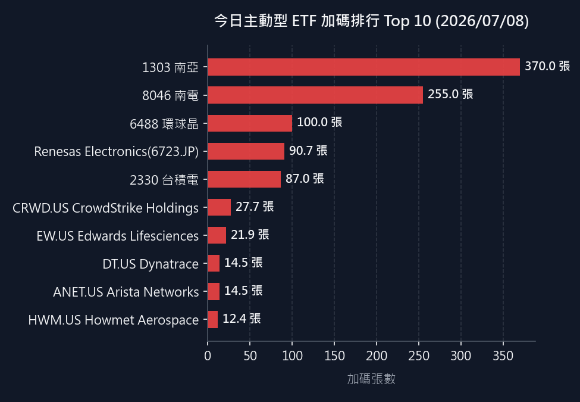
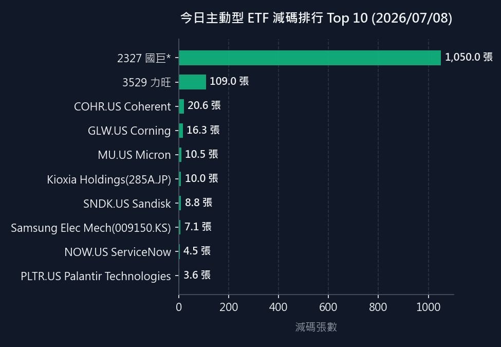

# 主動型 ETF 持股變動

資料來源：`主動型ETF持股明細.xlsx` 最近兩個日期分頁。

比較區間：`20260707` → `20260708`

## 今日加減碼視覺化排行

| 今日加碼 Top 10 | 今日減碼 Top 10 |
| :---: | :---: |
|  |  |

| ETF | 新增 | 刪除 | 比例變動 |
| :-- | --: | --: | --: |
| 00400A | 0 | 0 | 46 |
| 00401A | 0 | 0 | 0 |
| 00402A | 0 | 0 | 48 |
| 00403A | 0 | 0 | 38 |
| 00404A | 0 | 0 | 0 |
| 00405A | 0 | 0 | 0 |
| 00407A | 0 | 0 | 0 |
| 00980A | 0 | 0 | 42 |
| 00980D | 0 | 0 | 0 |
| 00981A | 0 | 0 | 0 |
| 00982A | 0 | 0 | 0 |
| 00983A | 0 | 1 | 33 |
| 00983D | 0 | 0 | 21 |
| 00984A | 1 | 1 | 0 |
| 00985A | 0 | 0 | 41 |
| 00986A | 0 | 0 | 0 |
| 00987A | 0 | 0 | 0 |
| 00988A | 0 | 0 | 0 |
| 00989A | 0 | 0 | 53 |
| 00990A | 0 | 0 | 43 |
| 00991A | 0 | 0 | 0 |
| 00992A | 0 | 0 | 0 |
| 00993A | 0 | 0 | 0 |
| 00994A | 0 | 0 | 0 |
| 00995A | 0 | 0 | 0 |
| 00996A | 0 | 0 | 0 |
| 00997A | 4 | 1 | 51 |
| 00998A | 0 | 0 | 35 |
| 00999A | 0 | 0 | 0 |

## 00400A

### 新增持股

- 無

### 刪除持股

- 無

### 投資比例變動

- 1303 南亞：0.41% → 0.43%（+0.02）
- 1590 亞德客-KY：1.05% → 1.01%（-0.04）
- 2059 川湖：2.55% → 2.45%（-0.10）
- 2303 聯電：1.82% → 1.87%（+0.05）
- 2308 台達電：3.33% → 3.26%（-0.07）
- 2327 國巨*：3.22% → 3.10%（-0.12）
- 2330 台積電：8.96% → 8.88%（-0.08）
- 2345 智邦：2.20% → 2.13%（-0.07）
- 2357 華碩：1.26% → 1.28%（+0.02）
- 2360 致茂：3.14% → 2.91%（-0.23）
- 2368 金像電：1.72% → 1.70%（-0.02）
- 2382 廣達：0.98% → 0.97%（-0.01）
- 2383 台光電：5.80% → 5.79%（-0.01）
- 2404 漢唐：0.63% → 0.59%（-0.04）
- 2408 南亞科：1.94% → 1.87%（-0.07）
- 2454 聯發科：7.02% → 6.82%（-0.20）
- 2472 立隆電：0.16% → 0.15%（-0.01）
- 2481 強茂：0.48% → 0.46%（-0.02）
- 3017 奇鋐：3.86% → 3.59%（-0.27）
- 3036 文曄：1.27% → 1.22%（-0.05）
- 3037 欣興：3.56% → 3.59%（+0.03）
- 3044 健鼎：1.95% → 1.89%（-0.06）
- 3090 日電貿：0.73% → 0.71%（-0.02）
- 3131 弘塑：0.32% → 0.30%（-0.02）
- 3231 緯創：0.86% → 0.80%（-0.06）
- 3293 鈊象：0.41% → 0.39%（-0.02）
- 3374 精材：0.32% → 0.34%（+0.02）
- 3443 創意：1.40% → 1.35%（-0.05）
- 3653 健策：0.80% → 0.78%（-0.02）
- 3665 貿聯-KY：2.59% → 2.44%（-0.15）
- 3711 日月光投控：1.57% → 1.47%（-0.10）
- 5274 信驊：2.13% → 2.03%（-0.10）
- 5347 世界：1.87% → 1.85%（-0.02）
- 5434 崇越：0.41% → 0.39%（-0.02）
- 6147 頎邦：0.98% → 0.96%（-0.02）
- 6187 萬潤：0.59% → 0.56%（-0.03）
- 6223 旺矽：4.27% → 4.29%（+0.02）
- 6274 台燿：0.76% → 0.78%（+0.02）
- 6285 啟碁：0.70% → 0.71%（+0.01）
- 6442 光聖：0.47% → 0.44%（-0.03）
- 6510 精測：0.79% → 0.77%（-0.02）
- 6515 穎崴：0.86% → 0.81%（-0.05）
- 6669 緯穎：4.03% → 3.98%（-0.05）
- 6715 嘉基：0.25% → 0.24%（-0.01）
- 7769 鴻勁：0.32% → 0.31%（-0.01）
- 8046 南電：0.27% → 0.28%（+0.01）

## 00401A

### 新增持股

- 無

### 刪除持股

- 無

### 投資比例變動

- 無

## 00402A

### 新增持股

- 無

### 刪除持股

- 無

### 投資比例變動

- AAPL.US Apple：6.94% → 7.15%（+0.21）
- ADI.US Analog Devices：1.71% → 1.73%（+0.02）
- AMD.US AMD：5.59% → 5.42%（-0.17）
- AMZN.US Amazon：4.20% → 4.18%（-0.02）
- ANET.US Arista Networks：0.76% → 0.75%（-0.01）
- ARM.US Arm：1.13% → 1.09%（-0.04）
- ASML.US ASML Holding：1.58% → 1.57%（-0.01）
- AVGO.US Broadcom：2.36% → 2.42%（+0.06）
- AXON.US Axon Enterprise：1.26% → 1.34%（+0.08）
- BABA.US Alibaba Group：0.42% → 0.44%（+0.02）
- BKNG.US Booking Holdings：0.76% → 0.79%（+0.03）
- CDNS.US Cadence Design Systems：1.83% → 1.87%（+0.04）
- CLS.US Celestica：0.88% → 0.90%（+0.02）
- COHR.US Coherent：1.58% → 1.53%（-0.05）
- CRWD.US CrowdStrike Holdings：1.41% → 1.22%（-0.19）
- DASH.US DoorDash：0.67% → 0.72%（+0.05）
- FSLY.US Fastly：0.25% → 0.26%（+0.01）
- GOOG.US Alphabet - Class C Capital Stock：3.46% → 3.57%（+0.11）
- GOOGL.US Alphabet - Class A Common Stock：3.41% → 3.54%（+0.13）
- INTC.US Intel：1.44% → 1.35%（-0.09）
- KLAC.US KLA：2.21% → 2.12%（-0.09）
- LITE.US Lumentum：1.17% → 1.16%（-0.01）
- LRCX.US Lam Research：3.69% → 3.56%（-0.13）
- MCHP.US Microchip Technology：1.65% → 1.64%（-0.01）
- MDB.US MongoDB：0.63% → 0.66%（+0.03）
- META.US Meta：2.72% → 2.89%（+0.17）
- MRVL.US Marvell：1.61% → 1.55%（-0.06）
- MSFT.US Microsoft：3.33% → 3.47%（+0.14）
- MU.US Micron：6.41% → 6.33%（-0.08）
- NFLX.US Netflix：1.24% → 1.28%（+0.04）
- NOW.US ServiceNow：0.56% → 0.38%（-0.18）
- NVDA.US NVIDIA：7.94% → 8.32%（+0.38）
- NXPI.US NXP Semiconductors：1.20% → 1.21%（+0.01）
- PANW.US Palo Alto：3.20% → 2.98%（-0.22）
- PLTR.US Palantir Technologies：1.43% → 1.30%（-0.13）
- SHOP.US Shopify：0.65% → 0.68%（+0.03）
- SIMO.US Silicon Motion：0.87% → 0.83%（-0.04）
- SNOW.US Snowflake：0.71% → 0.74%（+0.03）
- SPCX.US SpaceX：0.75% → 0.72%（-0.03）
- SPOT.US Spotify：0.36% → 0.38%（+0.02）
- STX.US Seagate：1.36% → 1.34%（-0.02）
- TER.US Teradyne：0.66% → 0.62%（-0.04）
- TSM.US TSMC(ADR)：1.64% → 1.62%（-0.02）
- TTWO.US Take-Two：0.76% → 0.78%（+0.02）
- UBER.US Uber：0.61% → 0.65%（+0.04）
- V.US Visa：1.19% → 1.22%（+0.03）
- WDC.US Western Digital：2.90% → 2.77%（-0.13）
- ZS.US Zscaler：0.24% → 0.15%（-0.09）

## 00403A

### 新增持股

- 無

### 刪除持股

- 無

### 投資比例變動

- 1303 南亞：0.78% → 0.89%（+0.11）
- 1560 中砂：0.44% → 0.43%（-0.01）
- 2049 上銀：0.22% → 0.21%（-0.01）
- 2303 聯電：7.23% → 7.55%（+0.32）
- 2308 台達電：2.86% → 2.83%（-0.03）
- 2327 國巨*：5.66% → 4.95%（-0.71）
- 2330 台積電：19.44% → 19.48%（+0.04）
- 2337 旺宏：0.87% → 0.86%（-0.01）
- 2344 華邦電：4.29% → 4.12%（-0.17）
- 2345 智邦：3.21% → 3.13%（-0.08）
- 2360 致茂：0.55% → 0.52%（-0.03）
- 2368 金像電：1.94% → 1.95%（+0.01）
- 2383 台光電：3.70% → 3.74%（+0.04）
- 2454 聯發科：4.01% → 3.95%（-0.06）
- 3017 奇鋐：5.26% → 4.95%（-0.31）
- 3037 欣興：3.69% → 3.76%（+0.07）
- 3189 景碩：1.38% → 1.50%（+0.12）
- 3211 順達：0.44% → 0.48%（+0.04）
- 3443 創意：1.34% → 1.30%（-0.04）
- 3529 力旺：0.46% → 0.26%（-0.20）
- 3583 辛耘：0.45% → 0.44%（-0.01）
- 3653 健策：1.55% → 1.54%（-0.01）
- 3665 貿聯-KY：0.20% → 0.19%（-0.01）
- 3711 日月光投控：2.39% → 2.28%（-0.11）
- 4958 臻鼎-KY：2.20% → 2.25%（+0.05）
- 4966 譜瑞-KY：0.32% → 0.33%（+0.01）
- 5274 信驊：0.44% → 0.43%（-0.01）
- 6196 帆宣：0.35% → 0.34%（-0.01）
- 6223 旺矽：3.93% → 3.99%（+0.06）
- 6274 台燿：1.67% → 1.73%（+0.06）
- 6442 光聖：0.29% → 0.28%（-0.01）
- 6488 環球晶：1.50% → 1.60%（+0.10）
- 6515 穎崴：1.00% → 0.95%（-0.05）
- 6669 緯穎：2.47% → 2.46%（-0.01）
- 6805 富世達：0.53% → 0.49%（-0.04）
- 7769 鴻勁：1.07% → 1.04%（-0.03）
- 8046 南電：0.51% → 0.72%（+0.21）
- 8996 高力：1.30% → 1.27%（-0.03）

## 00404A

### 新增持股

- 無

### 刪除持股

- 無

### 投資比例變動

- 無

## 00405A

### 新增持股

- 無

### 刪除持股

- 無

### 投資比例變動

- 無

## 00407A

### 新增持股

- 無

### 刪除持股

- 無

### 投資比例變動

- 無

## 00980A

### 新增持股

- 無

### 刪除持股

- 無

### 投資比例變動

- 2059 川湖：5.49% → 5.38%（-0.11）
- 2308 台達電：5.43% → 5.41%（-0.02）
- 2327 國巨*：1.89% → 1.86%（-0.03）
- 2330 台積電：9.35% → 9.44%（+0.09）
- 2344 華邦電：1.21% → 1.17%（-0.04）
- 2345 智邦：1.93% → 1.90%（-0.03）
- 2360 致茂：1.70% → 1.60%（-0.10）
- 2368 金像電：2.70% → 2.73%（+0.03）
- 2376 技嘉：0.84% → 0.86%（+0.02）
- 2382 廣達：1.19% → 1.21%（+0.02）
- 2383 台光電：4.76% → 4.85%（+0.09）
- 2408 南亞科：1.38% → 1.36%（-0.02）
- 2454 聯發科：6.55% → 6.49%（-0.06）
- 2891 中信金：1.21% → 1.23%（+0.02）
- 3008 大立光：0.82% → 0.83%（+0.01）
- 3017 奇鋐：1.94% → 1.84%（-0.10）
- 3026 禾伸堂：0.70% → 0.77%（+0.07）
- 3036 文曄：1.38% → 1.36%（-0.02）
- 3037 欣興：2.85% → 2.93%（+0.08）
- 3081 聯亞：2.49% → 2.73%（+0.24）
- 3189 景碩：0.58% → 0.63%（+0.05）
- 3231 緯創：0.66% → 0.62%（-0.04）
- 3293 鈊象：0.58% → 0.56%（-0.02）
- 3443 創意：1.90% → 1.86%（-0.04）
- 3529 力旺：0.99% → 0.97%（-0.02）
- 3533 嘉澤：0.15% → 0.16%（+0.01）
- 3665 貿聯-KY：0.64% → 0.61%（-0.03）
- 3711 日月光投控：1.57% → 1.51%（-0.06）
- 4958 臻鼎-KY：1.44% → 1.49%（+0.05）
- 5274 信驊：1.25% → 1.21%（-0.04）
- 5904 寶雅：1.37% → 1.35%（-0.02）
- 6223 旺矽：2.90% → 2.96%（+0.06）
- 6274 台燿：1.24% → 1.29%（+0.05）
- 6442 光聖：0.34% → 0.33%（-0.01）
- 6515 穎崴：2.67% → 2.56%（-0.11）
- 6669 緯穎：1.18% → 1.19%（+0.01）
- 6805 富世達：0.49% → 0.45%（-0.04）
- 6831 邁科：0.39% → 0.41%（+0.02）
- 7769 鴻勁：3.47% → 3.40%（-0.07）
- 8046 南電：1.36% → 1.46%（+0.10）
- 8210 勤誠：0.80% → 0.81%（+0.01）
- 8996 高力：1.78% → 1.76%（-0.02）

## 00980D

### 新增持股

- 無

### 刪除持股

- 無

### 投資比例變動

- 無

## 00981A

### 新增持股

- 無

### 刪除持股

- 無

### 投資比例變動

- 無

## 00982A

### 新增持股

- 無

### 刪除持股

- 無

### 投資比例變動

- 無

## 00983A

### 新增持股

- 無

### 刪除持股

- CCJ.US Cameco（0.10%，0.458 張）

### 投資比例變動

- AMD.US AMD：6.16% → 6.06%（-0.10）
- AMZN.US Amazon：2.64% → 2.80%（+0.16）
- AVGO.US Broadcom：0.26% → 0.28%（+0.02）
- BEAM.US Beam Therapeutics：3.87% → 4.37%（+0.50）
- CBRS.US Cerebras：0.50% → 0.49%（-0.01）
- COIN.US Coinbase：1.14% → 1.16%（+0.02）
- CRCL.US Circle：1.08% → 1.07%（-0.01）
- CRSP.US CRISPR Therapeutics：5.00% → 5.16%（+0.16）
- CRWV.US CoreWeave：1.04% → 1.05%（+0.01）
- GOOG.US Alphabet - Class C Capital Stock：1.11% → 1.16%（+0.05）
- GOOGL.US Alphabet - Class A Common Stock：1.47% → 1.54%（+0.07）
- HOOD.US Robinhood Markets：7.01% → 7.07%（+0.06）
- ILMN.US Illumina：3.09% → 3.21%（+0.12）
- LLY.US Eli Lilly：1.84% → 1.99%（+0.15）
- META.US Meta：0.21% → 0.23%（+0.02）
- NTLA.US Intellia Therapeutics：3.91% → 4.02%（+0.11）
- NTRA.US Natera：3.50% → 3.65%（+0.15）
- NVDA.US NVIDIA：1.42% → 1.06%（-0.36）
- PLTR.US Palantir Technologies：0.53% → 0.56%（+0.03）
- RBLX.US Roblox：1.56% → 2.10%（+0.54）
- ROKU.US Roku：0.29% → 0.30%（+0.01）
- SHOP.US Shopify：4.78% → 5.10%（+0.32）
- SNOW.US Snowflake：0.39% → 0.41%（+0.02）
- SPCX.US SpaceX：4.60% → 4.51%（-0.09）
- TEM.US Tempus：6.03% → 6.28%（+0.25）
- TER.US Teradyne：1.75% → 0.83%（-0.92）
- TSLA.US Tesla：8.32% → 8.40%（+0.08）
- TSM.US TSMC(ADR)：3.37% → 3.17%（-0.20）
- TWST.US Twist Bioscience：4.90% → 4.69%（-0.21）
- TXG.US 10x Genomics：5.29% → 5.26%（-0.03）
- VCYT.US Veracyte：2.31% → 1.99%（-0.32）
- WGS.US GeneDx：1.21% → 1.20%（-0.01）
- XYZ.US Block：2.17% → 1.93%（-0.24）

## 00983D

### 新增持股

- 無

### 刪除持股

- 無

### 投資比例變動

- AMCX 10 1/2 07/15/32：1.58% → 1.59%（+0.01）
- BHCCN 11 09/30/28：1.78% → 1.79%（+0.01）
- CEG 6 1/2 10/01/53：0.79% → 0.78%（-0.01）
- CMCSA 6.95 08/15/37：1.00% → 1.01%（+0.01）
- CYH 10 7/8 01/15/32：1.49% → 1.50%（+0.01）
- DELL 8.35 07/15/46：1.63% → 1.62%（-0.01）
- DT 9 1/4 06/01/32：0.93% → 0.94%（+0.01）
- DTV 8 7/8 02/01/30：1.56% → 1.57%（+0.01）
- ENBCN 6.7 11/15/53：1.14% → 1.13%（-0.01）
- FFHCN 6.35 03/22/54：0.72% → 0.71%（-0.01）
- GTN 10 1/2 07/15/29：1.65% → 1.66%（+0.01）
- HAL 7.45 09/15/39：1.83% → 1.82%（-0.01）
- HPE 6.35 10/15/45：1.01% → 1.00%（-0.01）
- MINAU 9 1/4 10/01/28：0.86% → 0.87%（+0.01）
- MOHEGN 11 7/8 04/15/31：1.33% → 1.34%（+0.01）
- ORCL 6.9 11/09/52：1.40% → 1.39%（-0.01）
- PDM 9 1/4 07/20/28：0.82% → 0.83%（+0.01）
- RAKUTN 11 1/4 02/15/27：1.77% → 1.78%（+0.01）
- SABHLD 10 3/4 11/15/29：0.59% → 0.60%（+0.01）
- SPCX 6.6 07/15/46：0.60% → 0.59%（-0.01）
- TLTW.US iShares 20+ Year Treasury Bond B：7.29% → 7.26%（-0.03）

## 00984A

### 新增持股

- 6023 元大期（0.27%，229 張）

### 刪除持股

- 元大期貨（0.27%，229 張）

### 投資比例變動

- 無

## 00985A

### 新增持股

- 無

### 刪除持股

- 無

### 投資比例變動

- 1802 台玻：1.00% → 1.01%（+0.01）
- 2049 上銀：1.03% → 1.01%（-0.02）
- 2059 川湖：3.03% → 2.96%（-0.07）
- 2303 聯電：1.85% → 1.94%（+0.09）
- 2308 台達電：1.28% → 1.27%（-0.01）
- 2330 台積電：26.53% → 26.67%（+0.14）
- 2344 華邦電：1.47% → 1.42%（-0.05）
- 2345 智邦：2.24% → 2.19%（-0.05）
- 2360 致茂：1.75% → 1.65%（-0.10）
- 2368 金像電：1.36% → 1.37%（+0.01）
- 2376 技嘉：3.45% → 3.52%（+0.07）
- 2383 台光電：2.12% → 2.15%（+0.03）
- 2395 研華：2.68% → 2.94%（+0.26）
- 2408 南亞科：1.53% → 1.49%（-0.04）
- 2412 中華電：2.00% → 1.97%（-0.03）
- 2454 聯發科：1.52% → 1.50%（-0.02）
- 2881 富邦金：0.72% → 0.73%（+0.01）
- 3008 大立光：2.62% → 2.65%（+0.03）
- 3017 奇鋐：1.65% → 1.56%（-0.09）
- 3036 文曄：2.36% → 2.31%（-0.05）
- 3081 聯亞：1.27% → 1.39%（+0.12）
- 3131 弘塑：2.05% → 2.00%（-0.05）
- 3293 鈊象：1.19% → 1.15%（-0.04）
- 3529 力旺：0.68% → 0.66%（-0.02）
- 3533 嘉澤：0.19% → 0.20%（+0.01）
- 3661 世芯-KY：2.92% → 2.93%（+0.01）
- 3665 貿聯-KY：0.26% → 0.24%（-0.02）
- 3711 日月光投控：0.90% → 0.86%（-0.04）
- 4904 遠傳：0.60% → 0.54%（-0.06）
- 4958 臻鼎-KY：2.25% → 2.30%（+0.05）
- 6147 頎邦：1.81% → 1.79%（-0.02）
- 6187 萬潤：1.86% → 1.82%（-0.04）
- 6223 旺矽：1.38% → 1.40%（+0.02）
- 6415 矽力*-KY：0.54% → 0.53%（-0.01）
- 6442 光聖：3.06% → 2.93%（-0.13）
- 6488 環球晶：0.48% → 0.49%（+0.01）
- 6805 富世達：0.21% → 0.19%（-0.02）
- 7769 鴻勁：0.80% → 0.78%（-0.02）
- 8046 南電：1.21% → 1.29%（+0.08）
- 8299 群聯：1.30% → 1.29%（-0.01）
- 8996 高力：0.78% → 0.77%（-0.01）

## 00986A

### 新增持股

- 無

### 刪除持股

- 無

### 投資比例變動

- 無

## 00987A

### 新增持股

- 無

### 刪除持股

- 無

### 投資比例變動

- 無

## 00988A

### 新增持股

- 無

### 刪除持股

- 無

### 投資比例變動

- 無

## 00989A

### 新增持股

- 無

### 刪除持股

- 無

### 投資比例變動

- ADI.US Analog Devices：1.06% → 1.07%（+0.01）
- ALGM.US Allegro MicroSystems：0.79% → 0.75%（-0.04）
- AMAT.US Applied Materials：0.64% → 0.62%（-0.02）
- AMD.US AMD：3.67% → 3.56%（-0.11）
- AMKR.US Amkor：1.02% → 0.99%（-0.03）
- AMZN.US Amazon：0.65% → 0.68%（+0.03）
- ASML.US ASML Holding：3.06% → 3.03%（-0.03）
- AVGO.US Broadcom：3.65% → 3.74%（+0.09）
- BE.US Bloom Energy：1.78% → 1.69%（-0.09）
- CBRS.US Cerebras：0.16% → 0.15%（-0.01）
- CDNS.US Cadence Design Systems：1.03% → 1.05%（+0.02）
- CRM.US Salesforce：0.80% → 0.85%（+0.05）
- CRWD.US CrowdStrike Holdings：2.81% → 2.85%（+0.04）
- DOCN.US DigitalOcean：1.40% → 1.51%（+0.11）
- ENTG.US Entegris：1.17% → 1.13%（-0.04）
- FIGR.US Figure：0.78% → 0.73%（-0.05）
- FN.US Fabrinet：0.67% → 0.65%（-0.02）
- GFS.US GlobalFoundries：1.42% → 1.40%（-0.02）
- GLW.US Corning：2.07% → 2.04%（-0.03）
- GOOG.US Alphabet - Class C Capital Stock：4.39% → 4.53%（+0.14）
- HOOD.US Robinhood Markets：2.71% → 2.70%（-0.01）
- INTC.US Intel：4.61% → 4.32%（-0.29）
- LITE.US Lumentum：1.35% → 1.34%（-0.01）
- LMND.US Lemonade：1.20% → 1.22%（+0.02）
- LRCX.US Lam Research：4.31% → 4.15%（-0.16）
- META.US Meta：1.73% → 1.83%（+0.10）
- MSFT.US Microsoft：1.02% → 1.07%（+0.05）
- MTSI.US MACOM Technology Solutions：1.12% → 1.08%（-0.04）
- MU.US Micron：2.42% → 2.39%（-0.03）
- MXL.US MaxLinear：0.49% → 0.45%（-0.04）
- NET.US Cloudflare：2.15% → 2.42%（+0.27）
- NVDA.US NVIDIA：3.55% → 3.70%（+0.15）
- ON.US ON Semiconductor：1.73% → 1.72%（-0.01）
- ORCL.US Oracle：1.34% → 1.37%（+0.03）
- PANW.US Palo Alto：4.15% → 4.05%（-0.10）
- PLTR.US Palantir Technologies：0.41% → 0.43%（+0.02）
- RIVN.US Rivian：1.37% → 1.16%（-0.21）
- ROK.US Rockwell Automation：0.93% → 0.94%（+0.01）
- SHOP.US Shopify：1.21% → 1.27%（+0.06）
- SNDK.US Sandisk：2.66% → 2.55%（-0.11）
- SNOW.US Snowflake：2.30% → 2.38%（+0.08）
- SPCX.US SpaceX：0.59% → 0.57%（-0.02）
- SYM.US Symbotic：0.35% → 0.33%（-0.02）
- TEM.US Tempus：0.96% → 0.99%（+0.03）
- TSLA.US Tesla：3.22% → 3.20%（-0.02）
- TSM.US TSMC(ADR)：1.87% → 1.86%（-0.01）
- TTWO.US Take-Two：3.77% → 3.90%（+0.13）
- TWLO.US Twilio：1.99% → 2.09%（+0.10）
- VICR.US Vicor Corporation：1.13% → 1.05%（-0.08）
- WOLF.US Wolfspeed：0.14% → 0.13%（-0.01）
- WRBY.US Warby Parker：0.69% → 0.68%（-0.01）
- XYZ.US Block：0.74% → 0.75%（+0.01）
- ZM.US Zoom：1.53% → 1.60%（+0.07）

## 00990A

### 新增持股

- 無

### 刪除持股

- 無

### 投資比例變動

- 2303 聯電：1.22% → 1.20%（-0.02）
- 2330 台積電：2.01% → 2.61%（+0.60）
- 2383 台光電：1.78% → 1.79%（+0.01）
- 2449 京元電子：0.66% → 0.63%（-0.03）
- 2454 聯發科：2.73% → 2.82%（+0.09）
- 3037 欣興：1.60% → 1.54%（-0.06）
- 3443 創意：0.72% → 0.74%（+0.02）
- 3665 貿聯-KY：0.63% → 0.68%（+0.05）
- 6223 旺矽：1.16% → 1.13%（-0.03）
- 6274 台燿：0.98% → 1.00%（+0.02）
- AMAT.US Applied Materials：3.57% → 3.54%（-0.03）
- AMD.US AMD：6.50% → 6.44%（-0.06）
- ASML.US ASML Holding：0.83% → 0.85%（+0.02）
- BE.US Bloom Energy：2.94% → 2.85%（-0.09）
- COHR.US Coherent：1.64% → 1.14%（-0.50）
- GLW.US Corning：0.32% → 0.33%（+0.01）
- IBIDEN(4062.JP)：2.24% → 2.21%（-0.03）
- INFINEON TECHNOLOGIES AG：2.71% → 2.65%（-0.06）
- INTC.US Intel：0.87% → 0.83%（-0.04）
- KOKUSAI ELECTRIC(6525.JP)：1.44% → 1.39%（-0.05）
- Kioxia Holdings(285A.JP)：5.53% → 5.21%（-0.32）
- LITE.US Lumentum：2.71% → 2.75%（+0.04）
- LRCX.US Lam Research：2.03% → 2.01%（-0.02）
- MKSI.US MKS：1.76% → 1.77%（+0.01）
- MRVL.US Marvell：2.43% → 2.39%（-0.04）
- MU.US Micron：5.89% → 5.20%（-0.69）
- Murata Mfg.(6981.JP)：3.14% → 3.00%（-0.14）
- Nippon Chemi-Con(6997.JP)：1.07% → 0.96%（-0.11）
- ON SEMICONDUCTOR：0.51% → 0.52%（+0.01）
- ONTO.US Onto Innovation：0.98% → 0.95%（-0.03）
- PENG.US Penguin Solutions：0.81% → 0.80%（-0.01）
- Renesas Electronics(6723.JP)：1.57% → 1.88%（+0.31）
- SCREEN Holdings(7735.JP)：1.17% → 1.19%（+0.02）
- SK hynix(000660.KS)：2.20% → 2.21%（+0.01）
- SNDK.US Sandisk：5.76% → 4.94%（-0.82）
- SUMCO(3436.JP)：2.19% → 2.06%（-0.13）
- Samsung Elec Mech(009150.KS)：4.85% → 4.67%（-0.18）
- TAIYO YUDEN(6976.JP)：4.79% → 4.52%（-0.27）
- Tokyo Electron(8035.JP)：1.49% → 1.52%（+0.03）
- UCTT.US Ultra Clean Holdings：0.88% → 0.81%（-0.07）
- VECO.US Veeco Instruments Inc.：0.68% → 0.71%（+0.03）
- VICR.US Vicor Corporation：0.89% → 0.85%（-0.04）
- WDC.US Western Digital：2.64% → 2.58%（-0.06）

## 00991A

### 新增持股

- 無

### 刪除持股

- 無

### 投資比例變動

- 無

## 00992A

### 新增持股

- 無

### 刪除持股

- 無

### 投資比例變動

- 無

## 00993A

### 新增持股

- 無

### 刪除持股

- 無

### 投資比例變動

- 無

## 00994A

### 新增持股

- 無

### 刪除持股

- 無

### 投資比例變動

- 無

## 00995A

### 新增持股

- 無

### 刪除持股

- 無

### 投資比例變動

- 無

## 00996A

### 新增持股

- 無

### 刪除持股

- 無

### 投資比例變動

- 無

## 00997A

### 新增持股

- CRWD.US CrowdStrike Holdings（1.23%，30.241 張）
- IOT.US Samsara（1.02%，133.951 張）
- OKTA.US Okta（1.05%，33.812 張）
- RTX.US RTX（1.05%，24.952 張）

### 刪除持股

- Kioxia Holdings(285A.JP)（1.04%，10 張）

### 投資比例變動

- 2327 國巨*：1.88% → 1.71%（-0.17）
- 2330 台積電：2.15% → 2.14%（-0.01）
- 2345 智邦：1.85% → 1.72%（-0.13）
- 2383 台光電：1.49% → 1.42%（-0.07）
- 2454 聯發科：0.67% → 0.65%（-0.02）
- AAPL.US Apple：0.76% → 1.29%（+0.53）
- ADBE.US Adobe：0.38% → 0.39%（+0.01）
- ALAB.US Astera Labs：1.60% → 1.43%（-0.17）
- AMAT.US Applied Materials：4.49% → 4.24%（-0.25）
- AMD.US AMD：5.51% → 5.20%（-0.31）
- AMZN.US Amazon：0.49% → 0.50%（+0.01）
- ANET.US Arista Networks：0.59% → 1.08%（+0.49）
- APH.US Amphenol：0.94% → 0.90%（-0.04）
- APP.US Applovin：0.37% → 0.36%（-0.01）
- ARM.US Arm：1.07% → 1.00%（-0.07）
- BE.US Bloom Energy：2.79% → 2.58%（-0.21）
- CIEN.US Ciena：1.09% → 1.06%（-0.03）
- COHR.US Coherent：0.98% → 0.93%（-0.05）
- CSCO.US Cisco：0.57% → 0.56%（-0.01）
- DT.US Dynatrace：1.32% → 1.46%（+0.14）
- EW.US Edwards Lifesciences：1.02% → 1.46%（+0.44）
- FTNT.US Fortinet：2.06% → 2.03%（-0.03）
- GE.US GE Aerospace：0.72% → 1.31%（+0.59）
- GEV.US GE Vernova：1.07% → 1.57%（+0.50）
- GLW.US Corning：1.70% → 1.00%（-0.70）
- GOOGL.US Alphabet - Class A Common Stock：2.36% → 2.39%（+0.03）
- HWM.US Howmet Aerospace：0.85% → 1.56%（+0.71）
- IBIDEN(4062.JP)：2.48% → 2.33%（-0.15）
- INTC.US Intel：2.62% → 2.39%（-0.23）
- KEYS.US Keysight Technologies：0.56% → 0.54%（-0.02）
- KLAC.US KLA：1.31% → 1.22%（-0.09）
- LITE.US Lumentum：1.12% → 1.08%（-0.04）
- LRCX.US Lam Research：2.76% → 2.60%（-0.16）
- META.US Meta：0.50% → 0.52%（+0.02）
- MPWR.US Monolithic Power Systems：0.52% → 0.49%（-0.03）
- MRVL.US Marvell：3.10% → 2.90%（-0.20）
- MSFT.US Microsoft：0.39% → 0.40%（+0.01）
- MU.US Micron：5.89% → 5.66%（-0.23）
- Murata Mfg.(6981.JP)：2.92% → 2.65%（-0.27）
- NBIS.US Nebius Group：0.71% → 0.65%（-0.06）
- NOK.US Nokia：0.57% → 0.54%（-0.03）
- NVDA.US NVIDIA：1.69% → 1.72%（+0.03）
- PANW.US Palo Alto：1.33% → 1.27%（-0.06）
- PLTR.US Palantir Technologies：0.78% → 0.80%（+0.02）
- SNDK.US Sandisk：5.43% → 4.10%（-1.33）
- STX.US Seagate：3.47% → 2.83%（-0.64）
- Samsung Elec Mech(009150.KS)：3.50% → 1.60%（-1.90）
- TER.US Teradyne：1.83% → 1.67%（-0.16）
- TXN.US Texas Instruments：0.32% → 0.31%（-0.01）
- WDC.US Western Digital：5.13% → 4.77%（-0.36）
- 意法半導體公司：0.37% → 0.35%（-0.02）

## 00998A

### 新增持股

- 無

### 刪除持股

- 無

### 投資比例變動

- BAC.US Bank of America：2.92% → 2.94%（+0.02）
- BNY.US Bank of New York Mellon：2.26% → 2.32%（+0.06）
- BPM銀行股份公司：1.74% → 1.75%（+0.01）
- C.US Citigroup：3.82% → 3.77%（-0.05）
- Chiba Bank(8331.JP)：1.85% → 1.90%（+0.05）
- GS.US Goldman Sachs：1.87% → 1.86%（-0.01）
- IBKR.US Interactive Brokers：2.04% → 2.02%（-0.02）
- JAPAN POST BANK(7182.JP)：2.14% → 2.19%（+0.05）
- JPM.US JPMorgan Chase：1.79% → 1.82%（+0.03）
- MFG.US Mizuho Financial Group：0.92% → 0.91%（-0.01）
- MRX.US Marex：2.05% → 2.10%（+0.05）
- MS.US Morgan Stanley：2.75% → 2.77%（+0.02）
- Mebuki Financial Group(7167.JP)：2.50% → 2.52%（+0.02）
- Mizuho Financial(8411.JP)：0.96% → 0.97%（+0.01）
- Piraeus Bank SA：3.82% → 3.78%（-0.04）
- Resona(8308.JP)：1.25% → 1.28%（+0.03）
- SKSQUARE(402340.KS)：0.60% → 0.56%（-0.04）
- Samsung Life Insurance(032830.KS)：1.50% → 1.45%（-0.05）
- Sumitomo Mitsui Trust Group(8309.JP)：1.93% → 1.95%（+0.02）
- UBS.US UBS Group：1.98% → 1.97%（-0.01）
- USB.US U.S. Bancorp：1.95% → 1.96%（+0.01）
- Unipol保險股份公司：4.58% → 4.48%（-0.10）
- 勞埃德銀行集團：1.28% → 1.27%（-0.01）
- 巴克萊集團：3.13% → 3.08%（-0.05）
- 希臘國家銀行：3.06% → 3.04%（-0.02）
- 德國商業銀行：2.62% → 2.65%（+0.03）
- 東方匯理資產管理有限責任公司：3.17% → 3.15%（-0.02）
- 標準人壽公開有限公司：2.23% → 2.27%（+0.04）
- 法國巴黎銀行有限責任公司：3.25% → 3.21%（-0.04）
- 法國興業銀行股份有限公司：3.38% → 3.32%（-0.06）
- 法通保險集團公開有限公司：1.73% → 1.75%（+0.02）
- 渣打集團有限公司：3.05% → 3.04%（-0.01）
- 聯合聖保羅銀行：2.08% → 2.09%（+0.01）
- 荷蘭銀行公眾有限公司：3.91% → 3.92%（+0.01）
- 裕信銀行：2.90% → 2.93%（+0.03）

## 00999A

### 新增持股

- 無

### 刪除持股

- 無

### 投資比例變動

- 無
