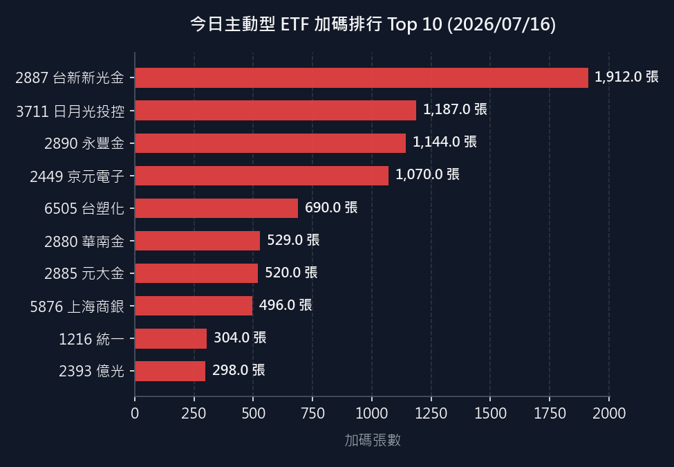
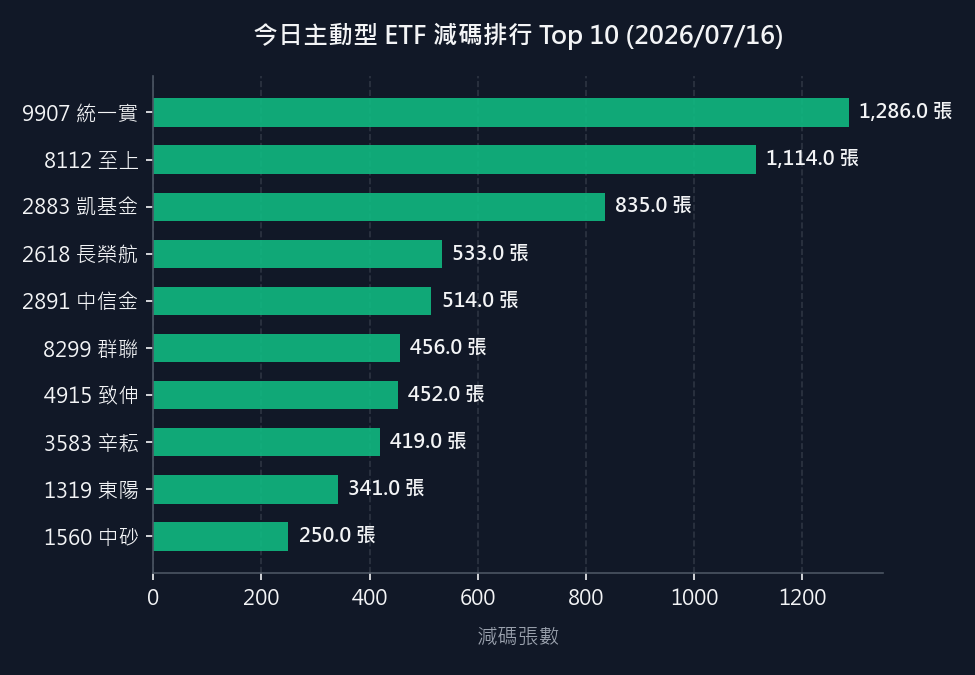

# 主動型 ETF 持股變動

資料來源：`主動型ETF持股明細.xlsx` 最近兩個日期分頁。

比較區間：`20260715` → `20260716`

## 今日加減碼視覺化排行

| 今日加碼 Top 10 | 今日減碼 Top 10 |
| :---: | :---: |
|  |  |

| ETF | 新增 | 刪除 | 比例變動 |
| :-- | --: | --: | --: |
| 00400A | 1 | 2 | 47 |
| 00401A | 0 | 2 | 49 |
| 00402A | 0 | 0 | 46 |
| 00403A | 0 | 0 | 39 |
| 00404A | 16 | 0 | 49 |
| 00405A | 0 | 0 | 36 |
| 00407A | 0 | 0 | 44 |
| 00408A | 0 | 0 | 39 |
| 00980A | 0 | 0 | 47 |
| 00980D | 0 | 0 | 16 |
| 00981A | 0 | 1 | 26 |
| 00982A | 0 | 0 | 39 |
| 00983A | 0 | 0 | 33 |
| 00983D | 0 | 0 | 8 |
| 00984A | 0 | 0 | 102 |
| 00985A | 0 | 0 | 41 |
| 00986A | 1 | 0 | 29 |
| 00987A | 0 | 0 | 26 |
| 00988A | 1 | 1 | 38 |
| 00989A | 0 | 0 | 54 |
| 00990A | 3 | 1 | 46 |
| 00991A | 0 | 0 | 24 |
| 00992A | 0 | 0 | 33 |
| 00993A | 0 | 0 | 40 |
| 00994A | 0 | 0 | 32 |
| 00995A | 0 | 0 | 45 |
| 00996A | 1 | 1 | 41 |
| 00997A | 0 | 0 | 49 |
| 00998A | 2 | 2 | 31 |
| 00999A | 11 | 0 | 56 |

## 00400A

### 新增持股

- 6505 台塑化（0.21%，690 張）

### 刪除持股

- 2472 立隆電（0.14%，108 張）
- 6274 台燿（0.66%，122 張）

### 投資比例變動

- 2059 川湖：3.44% → 3.55%（+0.11）
- 2303 聯電：1.84% → 1.80%（-0.04）
- 2308 台達電：3.16% → 3.23%（+0.07）
- 2313 華通：1.03% → 0.99%（-0.04）
- 2327 國巨*：1.74% → 1.71%（-0.03）
- 2330 台積電：8.77% → 8.98%（+0.21）
- 2345 智邦：1.99% → 2.00%（+0.01）
- 2357 華碩：1.28% → 1.31%（+0.03）
- 2360 致茂：2.89% → 4.11%（+1.22）
- 2368 金像電：1.00% → 0.99%（-0.01）
- 2376 技嘉：1.19% → 1.18%（-0.01）
- 2382 廣達：0.95% → 0.89%（-0.06）
- 2383 台光電：5.36% → 5.32%（-0.04）
- 2385 群光：0.13% → 0.14%（+0.01）
- 2404 漢唐：0.61% → 0.60%（-0.01）
- 2408 南亞科：2.20% → 2.03%（-0.17）
- 2454 聯發科：6.17% → 6.18%（+0.01）
- 2481 強茂：0.37% → 0.36%（-0.01）
- 2885 元大金：1.01% → 1.02%（+0.01）
- 3017 奇鋐：3.23% → 3.86%（+0.63）
- 3036 文曄：1.12% → 1.11%（-0.01）
- 3037 欣興：3.76% → 3.59%（-0.17）
- 3044 健鼎：1.65% → 1.66%（+0.01）
- 3090 日電貿：0.50% → 0.47%（-0.03）
- 3211 順達：0.88% → 0.89%（+0.01）
- 3231 緯創：0.76% → 0.78%（+0.02）
- 3293 鈊象：0.35% → 0.36%（+0.01）
- 3443 創意：2.10% → 2.16%（+0.06）
- 3653 健策：0.78% → 0.81%（+0.03）
- 3665 貿聯-KY：2.37% → 2.46%（+0.09）
- 3711 日月光投控：1.56% → 1.57%（+0.01）
- 4958 臻鼎-KY：0.92% → 0.87%（-0.05）
- 5274 信驊：1.95% → 1.97%（+0.02）
- 5347 世界：1.89% → 1.92%（+0.03）
- 5434 崇越：0.42% → 0.45%（+0.03）
- 6147 頎邦：0.95% → 0.93%（-0.02）
- 6187 萬潤：1.41% → 1.42%（+0.01）
- 6223 旺矽：4.06% → 4.04%（-0.02）
- 6442 光聖：0.41% → 0.39%（-0.02）
- 6488 環球晶：4.74% → 4.44%（-0.30）
- 6510 精測：1.20% → 1.16%（-0.04）
- 6515 穎崴：0.73% → 0.69%（-0.04）
- 6669 緯穎：3.88% → 3.94%（+0.06）
- 6715 嘉基：0.20% → 0.22%（+0.02）
- 8046 南電：1.37% → 1.25%（-0.12）
- 8150 南茂：0.10% → 0.11%（+0.01）
- 8210 勤誠：1.07% → 1.12%（+0.05）

## 00401A

### 新增持股

- 無

### 刪除持股

- 2609 陽明（0.02%，13 張）
- 3665 貿聯-KY（0.06%，1 張）

### 投資比例變動

- 2303 聯電：1.39% → 1.34%（-0.05）
- 2308 台達電：4.34% → 4.42%（+0.08）
- 2313 華通：1.40% → 1.34%（-0.06）
- 2317 鴻海：0.70% → 0.71%（+0.01）
- 2330 台積電：9.17% → 9.31%（+0.14）
- 2344 華邦電：1.43% → 1.37%（-0.06）
- 2345 智邦：2.18% → 2.17%（-0.01）
- 2357 華碩：1.35% → 1.36%（+0.01）
- 2360 致茂：1.89% → 1.99%（+0.10）
- 2368 金像電：0.41% → 0.42%（+0.01）
- 2379 瑞昱：2.13% → 2.02%（-0.11）
- 2382 廣達：2.50% → 2.31%（-0.19）
- 2383 台光電：2.07% → 2.04%（-0.03）
- 2412 中華電：0.95% → 0.98%（+0.03）
- 2449 京元電子：1.30% → 1.35%（+0.05）
- 2454 聯發科：6.23% → 6.15%（-0.08）
- 2881 富邦金：1.89% → 1.85%（-0.04）
- 2882 國泰金：1.18% → 1.19%（+0.01）
- 2883 凱基金：2.13% → 2.17%（+0.04）
- 2884 玉山金：1.88% → 1.91%（+0.03）
- 2886 兆豐金：1.12% → 1.18%（+0.06）
- 2891 中信金：2.00% → 1.99%（-0.01）
- 2912 統一超：0.33% → 0.34%（+0.01）
- 3008 大立光：1.13% → 1.23%（+0.10）
- 3034 聯詠：0.75% → 0.74%（-0.01）
- 3037 欣興：0.73% → 0.68%（-0.05）
- 3131 弘塑：0.60% → 0.61%（+0.01）
- 3167 大量：0.66% → 0.63%（-0.03）
- 3231 緯創：0.32% → 0.33%（+0.01）
- 3491 昇達科：1.22% → 1.39%（+0.17）
- 3529 力旺：0.63% → 0.65%（+0.02）
- 3653 健策：1.12% → 1.16%（+0.04）
- 3711 日月光投控：2.84% → 2.86%（+0.02）
- 4904 遠傳：0.87% → 0.92%（+0.05）
- 4958 臻鼎-KY：2.84% → 2.66%（-0.18）
- 4991 環宇-KY：0.60% → 0.57%（-0.03）
- 5347 世界：1.14% → 1.15%（+0.01）
- 5904 寶雅：0.63% → 0.58%（-0.05）
- 6223 旺矽：2.65% → 2.62%（-0.03）
- 6285 啟碁：2.26% → 2.18%（-0.08）
- 6415 矽力*-KY：0.80% → 0.75%（-0.05）
- 6510 精測：0.70% → 0.67%（-0.03）
- 6515 穎崴：0.68% → 0.63%（-0.05）
- 6531 愛普*：1.46% → 1.41%（-0.05）
- 6669 緯穎：2.53% → 2.47%（-0.06）
- 6944 兆聯實業：0.58% → 0.57%（-0.01）
- 7769 鴻勁：2.92% → 3.02%（+0.10）
- 7828 創新服務：1.44% → 1.60%（+0.16）
- 8464 億豐：1.24% → 1.26%（+0.02）

## 00402A

### 新增持股

- 無

### 刪除持股

- 無

### 投資比例變動

- AAPL.US Apple：7.23% → 7.71%（+0.48）
- ADI.US Analog Devices：1.79% → 1.83%（+0.04）
- AMD.US AMD：5.74% → 5.69%（-0.05）
- AMZN.US Amazon：3.94% → 4.01%（+0.07）
- ANET.US Arista Networks：0.72% → 0.70%（-0.02）
- ARM.US Arm：1.02% → 1.03%（+0.01）
- ASML.US ASML Holding：1.59% → 1.67%（+0.08）
- AVGO.US Broadcom：2.34% → 2.43%（+0.09）
- AXON.US Axon Enterprise：1.14% → 1.16%（+0.02）
- BABA.US Alibaba Group：0.50% → 0.53%（+0.03）
- BKNG.US Booking Holdings：0.76% → 0.60%（-0.16）
- CDNS.US Cadence Design Systems：1.89% → 1.91%（+0.02）
- CIEN.US Ciena：1.28% → 1.22%（-0.06）
- CLS.US Celestica：0.90% → 0.89%（-0.01）
- COHR.US Coherent：1.51% → 1.49%（-0.02）
- CRWD.US CrowdStrike Holdings：1.32% → 1.33%（+0.01）
- DASH.US DoorDash：0.39% → 0.25%（-0.14）
- GOOG.US Alphabet - Class C Capital Stock：3.30% → 3.51%（+0.21）
- GOOGL.US Alphabet - Class A Common Stock：3.26% → 3.45%（+0.19）
- INTC.US Intel：1.32% → 1.29%（-0.03）
- LITE.US Lumentum：1.35% → 1.28%（-0.07）
- LRCX.US Lam Research：3.77% → 3.75%（-0.02）
- MCHP.US Microchip Technology：1.69% → 1.72%（+0.03）
- META.US Meta：3.10% → 3.12%（+0.02）
- MRVL.US Marvell：1.49% → 1.41%（-0.08）
- MSFT.US Microsoft：3.13% → 3.30%（+0.17）
- MU.US Micron：6.62% → 6.24%（-0.38）
- NFLX.US Netflix：0.97% → 1.00%（+0.03）
- NOW.US ServiceNow：0.36% → 0.22%（-0.14）
- NVDA.US NVIDIA：8.30% → 8.57%（+0.27）
- NXPI.US NXP Semiconductors：1.26% → 1.27%（+0.01）
- PANW.US Palo Alto：3.11% → 3.20%（+0.09）
- PLTR.US Palantir Technologies：1.29% → 1.12%（-0.17）
- SHOP.US Shopify：0.55% → 0.40%（-0.15）
- SIMO.US Silicon Motion：0.87% → 0.85%（-0.02）
- SKHY.US SK hynix：0.94% → 1.07%（+0.13）
- SPCX.US SpaceX：0.66% → 0.67%（+0.01）
- SPOT.US Spotify：0.37% → 0.25%（-0.12）
- STX.US Seagate：1.42% → 1.37%（-0.05）
- TER.US Teradyne：0.77% → 0.76%（-0.01）
- TSM.US TSMC(ADR)：1.58% → 1.61%（+0.03）
- TTWO.US Take-Two：0.72% → 0.54%（-0.18）
- TXN.US Texas Instruments：3.10% → 3.13%（+0.03）
- UBER.US Uber：0.44% → 0.45%（+0.01）
- V.US Visa：1.00% → 1.02%（+0.02）
- WDC.US Western Digital：2.93% → 2.74%（-0.19）

## 00403A

### 新增持股

- 無

### 刪除持股

- 無

### 投資比例變動

- 1303 南亞：1.37% → 1.35%（-0.02）
- 1560 中砂：0.45% → 0.34%（-0.11）
- 2049 上銀：0.20% → 0.21%（+0.01）
- 2303 聯電：7.57% → 7.41%（-0.16）
- 2308 台達電：2.91% → 3.06%（+0.15）
- 2317 鴻海：0.46% → 0.48%（+0.02）
- 2327 國巨*：3.78% → 3.74%（-0.04）
- 2330 台積電：18.98% → 19.52%（+0.54）
- 2337 旺宏：0.90% → 0.84%（-0.06）
- 2344 華邦電：4.39% → 4.25%（-0.14）
- 2345 智邦：2.99% → 3.01%（+0.02）
- 2360 致茂：0.63% → 0.84%（+0.21）
- 2383 台光電：3.52% → 3.51%（-0.01）
- 2454 聯發科：3.64% → 3.66%（+0.02）
- 3008 大立光：0.07% → 0.16%（+0.09）
- 3017 奇鋐：4.54% → 4.74%（+0.20）
- 3037 欣興：4.02% → 3.85%（-0.17）
- 3189 景碩：1.65% → 1.53%（-0.12）
- 3264 欣銓：0.08% → 0.09%（+0.01）
- 3443 創意：1.20% → 1.24%（+0.04）
- 3533 嘉澤：1.53% → 1.55%（+0.02）
- 3653 健策：1.55% → 1.64%（+0.09）
- 3665 貿聯-KY：0.29% → 0.36%（+0.07）
- 3711 日月光投控：2.45% → 2.59%（+0.14）
- 4958 臻鼎-KY：2.61% → 2.48%（-0.13）
- 5274 信驊：0.67% → 0.81%（+0.14）
- 6223 旺矽：3.85% → 3.84%（-0.01）
- 6239 力成：0.17% → 0.18%（+0.01）
- 6274 台燿：1.48% → 1.36%（-0.12）
- 6415 矽力*-KY：0.28% → 0.26%（-0.02）
- 6442 光聖：0.26% → 0.25%（-0.01）
- 6488 環球晶：2.02% → 1.90%（-0.12）
- 6515 穎崴：0.88% → 0.83%（-0.05）
- 6669 緯穎：2.45% → 2.50%（+0.05）
- 6805 富世達：0.48% → 0.50%（+0.02）
- 7769 鴻勁：1.14% → 1.15%（+0.01）
- 8046 南電：1.50% → 1.38%（-0.12）
- 8358 金居：0.49% → 0.47%（-0.02）
- 8996 高力：1.15% → 1.11%（-0.04）

## 00404A

### 新增持股

- 1216 統一（0.70%，308 張）
- 2376 技嘉（0.63%，65 張）
- 2393 億光（0.60%，298 張）
- 2402 毅嘉（0.03%，19 張）
- 2887 台新新光金（1.14%，1087 張）
- 2912 統一超（0.04%，5 張）
- 3131 弘塑（0.28%，3 張）
- 3702 大聯大（0.58%，176 張）
- 4763 材料*-KY（0.60%，436 張）
- 5269 祥碩（0.61%，14 張）
- 5871 中租-KY（0.65%，187 張）
- 5876 上海商銀（0.65%，496 張）
- 6138 茂達（0.58%，61 張）
- 6206 飛捷（0.54%，149 張）
- 6691 洋基工程（0.26%，12 張）
- 8069 元太（0.13%，24 張）

### 刪除持股

- 無

### 投資比例變動

- 1303 南亞：0.45% → 0.29%（-0.16）
- 2303 聯電：2.82% → 2.67%（-0.15）
- 2308 台達電：3.76% → 3.81%（+0.05）
- 2317 鴻海：0.42% → 0.29%（-0.13）
- 2327 國巨*：0.71% → 0.70%（-0.01）
- 2330 台積電：22.26% → 22.61%（+0.35）
- 2345 智邦：0.95% → 0.94%（-0.01）
- 2347 聯強：1.88% → 1.26%（-0.62）
- 2356 英業達：0.21% → 0.14%（-0.07）
- 2360 致茂：1.05% → 1.10%（+0.05）
- 2382 廣達：2.64% → 1.76%（-0.88）
- 2383 台光電：1.91% → 1.88%（-0.03）
- 2454 聯發科：6.42% → 6.38%（-0.04）
- 2618 長榮航：1.94% → 1.29%（-0.65）
- 2883 凱基金：1.99% → 1.35%（-0.64）
- 2885 元大金：2.33% → 2.56%（+0.23）
- 2890 永豐金：0.24% → 0.89%（+0.65）
- 2891 中信金：2.65% → 1.76%（-0.89）
- 3014 聯陽：1.73% → 1.49%（-0.24）
- 3017 奇鋐：0.69% → 0.71%（+0.02）
- 3034 聯詠：2.04% → 1.57%（-0.47）
- 3037 欣興：0.54% → 0.51%（-0.03）
- 3044 健鼎：1.72% → 1.14%（-0.58）
- 3189 景碩：0.34% → 0.31%（-0.03）
- 3217 優群：1.20% → 0.79%（-0.41）
- 3227 原相：1.74% → 1.13%（-0.61）
- 3260 威剛：0.40% → 0.39%（-0.01）
- 3264 欣銓：1.00% → 1.06%（+0.06）
- 3265 台星科：1.25% → 1.00%（-0.25）
- 3293 鈊象：1.63% → 1.08%（-0.55）
- 3592 瑞鼎：1.19% → 0.78%（-0.41）
- 3711 日月光投控：3.83% → 3.75%（-0.08）
- 5274 信驊：1.94% → 1.95%（+0.01）
- 5347 世界：0.77% → 0.66%（-0.11）
- 5434 崇越：1.77% → 1.90%（+0.13）
- 5904 寶雅：1.80% → 1.10%（-0.70）
- 6121 新普：1.04% → 0.71%（-0.33）
- 6139 亞翔：0.26% → 0.25%（-0.01）
- 6223 旺矽：0.82% → 0.81%（-0.01）
- 6239 力成：0.16% → 0.62%（+0.46）
- 6257 矽格：1.80% → 1.81%（+0.01）
- 6488 環球晶：0.17% → 0.16%（-0.01）
- 6515 穎崴：0.31% → 0.29%（-0.02）
- 6531 愛普*：0.22% → 0.21%（-0.01）
- 6903 巨漢：0.29% → 0.19%（-0.10）
- 8081 致新：1.67% → 1.10%（-0.57）
- 8299 群聯：1.09% → 1.03%（-0.06）
- 臺指選擇權08/26 49100 買權：-0.32% → -0.26%（+0.06）
- 臺股期貨08/26：16.23% → 16.15%（-0.08）

## 00405A

### 新增持股

- 無

### 刪除持股

- 無

### 投資比例變動

- 2059 川湖：1.33% → 1.38%（+0.05）
- 2308 台達電：1.02% → 1.04%（+0.02）
- 2327 國巨*：3.78% → 3.75%（-0.03）
- 2330 台積電：2.17% → 2.25%（+0.08）
- 2337 旺宏：1.55% → 1.46%（-0.09）
- 2344 華邦電：3.97% → 3.86%（-0.11）
- 2345 智邦：4.62% → 4.67%（+0.05）
- 2383 台光電：2.97% → 2.98%（+0.01）
- 2408 南亞科：1.52% → 1.42%（-0.10）
- 2449 京元電子：0.91% → 0.96%（+0.05）
- 2454 聯發科：6.70% → 6.76%（+0.06）
- 3017 奇鋐：5.60% → 5.87%（+0.27）
- 3026 禾伸堂：1.81% → 1.69%（-0.12）
- 3037 欣興：5.48% → 5.27%（-0.21）
- 3081 聯亞：1.04% → 0.98%（-0.06）
- 3105 穩懋：1.74% → 1.70%（-0.04）
- 3131 弘塑：3.91% → 4.05%（+0.14）
- 3443 創意：5.13% → 5.32%（+0.19）
- 3583 辛耘：1.90% → 1.91%（+0.01）
- 3653 健策：2.20% → 2.33%（+0.13）
- 3711 日月光投控：0.82% → 0.84%（+0.02）
- 5274 信驊：1.88% → 1.92%（+0.04）
- 6187 萬潤：2.23% → 2.26%（+0.03）
- 6223 旺矽：5.38% → 5.40%（+0.02）
- 6274 台燿：0.36% → 0.33%（-0.03）
- 6442 光聖：0.37% → 0.36%（-0.01）
- 6488 環球晶：6.40% → 6.05%（-0.35）
- 6510 精測：1.41% → 1.38%（-0.03）
- 6515 穎崴：0.62% → 0.59%（-0.03）
- 6526 達發：0.35% → 0.34%（-0.01）
- 7734 印能科技：1.81% → 1.91%（+0.10）
- 7769 鴻勁：2.51% → 2.55%（+0.04）
- 8028 昇陽半導體：1.06% → 1.18%（+0.12）
- 8046 南電：5.48% → 5.05%（-0.43）
- 8210 勤誠：0.93% → 0.98%（+0.05）
- 8996 高力：1.25% → 1.21%（-0.04）

## 00407A

### 新增持股

- 無

### 刪除持股

- 無

### 投資比例變動

- 1303 南亞：0.71% → 0.69%（-0.02）
- 2059 川湖：2.14% → 2.21%（+0.07）
- 2303 聯電：1.78% → 1.74%（-0.04）
- 2308 台達電：4.04% → 4.12%（+0.08）
- 2327 國巨*：3.05% → 3.00%（-0.05）
- 2330 台積電：9.21% → 9.43%（+0.22）
- 2344 華邦電：1.84% → 1.77%（-0.07）
- 2345 智邦：3.21% → 3.22%（+0.01）
- 2360 致茂：1.73% → 1.83%（+0.10）
- 2368 金像電：1.97% → 1.95%（-0.02）
- 2379 瑞昱：0.80% → 0.76%（-0.04）
- 2383 台光電：3.78% → 3.76%（-0.02）
- 2395 研華：1.62% → 1.63%（+0.01）
- 2408 南亞科：1.94% → 1.79%（-0.15）
- 2412 中華電：1.63% → 1.69%（+0.06）
- 2451 創見：0.15% → 0.14%（-0.01）
- 3017 奇鋐：3.10% → 3.22%（+0.12）
- 3037 欣興：4.05% → 3.86%（-0.19）
- 3293 鈊象：0.54% → 0.55%（+0.01）
- 3443 創意：1.73% → 1.77%（+0.04）
- 3491 昇達科：0.39% → 0.44%（+0.05）
- 3529 力旺：1.94% → 1.96%（+0.02）
- 3533 嘉澤：0.85% → 1.04%（+0.19）
- 3665 貿聯-KY：1.95% → 2.32%（+0.37）
- 3711 日月光投控：2.06% → 2.54%（+0.48）
- 4904 遠傳：0.29% → 0.31%（+0.02）
- 4958 臻鼎-KY：2.38% → 2.25%（-0.13）
- 5274 信驊：1.85% → 1.87%（+0.02）
- 5289 宜鼎：0.18% → 0.17%（-0.01）
- 5434 崇越：0.21% → 0.22%（+0.01）
- 5536 聖暉*：1.98% → 2.02%（+0.04）
- 6223 旺矽：2.46% → 2.45%（-0.01）
- 6274 台燿：2.68% → 2.45%（-0.23）
- 6415 矽力*-KY：0.42% → 0.40%（-0.02）
- 6446 藥華藥：2.54% → 2.46%（-0.08）
- 6515 穎崴：1.53% → 1.44%（-0.09）
- 6526 達發：0.33% → 0.32%（-0.01）
- 6531 愛普*：1.59% → 1.55%（-0.04）
- 6669 緯穎：3.28% → 3.34%（+0.06）
- 6805 富世達：1.78% → 1.82%（+0.04）
- 8046 南電：2.83% → 2.58%（-0.25）
- 8210 勤誠：1.71% → 1.77%（+0.06）
- 8299 群聯：0.14% → 0.13%（-0.01）
- 8996 高力：0.45% → 0.43%（-0.02）

## 00408A

### 新增持股

- 無

### 刪除持股

- 無

### 投資比例變動

- 1216 統一：1.98% → 2.12%（+0.14）
- 1477 聚陽：1.46% → 1.57%（+0.11）
- 2059 川湖：1.43% → 1.55%（+0.12）
- 2308 台達電：3.70% → 3.97%（+0.27）
- 2317 鴻海：2.01% → 2.17%（+0.16）
- 2330 台積電：6.28% → 6.75%（+0.47）
- 2345 智邦：2.10% → 2.21%（+0.11）
- 2356 英業達：1.13% → 1.19%（+0.06）
- 2357 華碩：1.71% → 1.83%（+0.12）
- 2368 金像電：2.18% → 2.27%（+0.09）
- 2376 技嘉：2.02% → 2.11%（+0.09）
- 2382 廣達：3.24% → 3.19%（-0.05）
- 2383 台光電：1.99% → 2.08%（+0.09）
- 2395 研華：1.64% → 1.74%（+0.10）
- 2404 漢唐：1.80% → 1.86%（+0.06）
- 2408 南亞科：0.54% → 0.52%（-0.02）
- 2412 中華電：2.98% → 3.24%（+0.26）
- 2454 聯發科：2.09% → 2.20%（+0.11）
- 2603 長榮：1.67% → 1.79%（+0.12）
- 2880 華南金：1.41% → 1.52%（+0.11）
- 2885 元大金：1.95% → 2.07%（+0.12）
- 2886 兆豐金：1.93% → 2.08%（+0.15）
- 2891 中信金：1.42% → 1.50%（+0.08）
- 2912 統一超：2.05% → 2.19%（+0.14）
- 3037 欣興：2.72% → 2.73%（+0.01）
- 3045 台灣大：2.99% → 3.22%（+0.23）
- 3231 緯創：1.95% → 2.09%（+0.14）
- 3702 大聯大：1.70% → 1.76%（+0.06）
- 4904 遠傳：1.78% → 1.98%（+0.20）
- 4958 臻鼎-KY：1.63% → 1.62%（-0.01）
- 5347 世界：0.52% → 0.56%（+0.04）
- 5434 崇越：2.43% → 2.77%（+0.34）
- 5876 上海商銀：1.75% → 1.87%（+0.12）
- 5904 寶雅：1.97% → 1.93%（-0.04）
- 6257 矽格：1.06% → 1.13%（+0.07）
- 6274 台燿：1.53% → 1.47%（-0.06）
- 6669 緯穎：2.28% → 2.44%（+0.16）
- 7769 鴻勁：0.94% → 1.00%（+0.06）
- 8046 南電：2.22% → 2.13%（-0.09）

## 00980A

### 新增持股

- 無

### 刪除持股

- 無

### 投資比例變動

- 2059 川湖：5.68% → 5.86%（+0.18）
- 2308 台達電：5.46% → 5.57%（+0.11）
- 2317 鴻海：1.87% → 1.92%（+0.05）
- 2327 國巨*：1.67% → 1.65%（-0.02）
- 2330 台積電：9.40% → 9.64%（+0.24）
- 2344 華邦電：1.26% → 1.22%（-0.04）
- 2345 智邦：1.85% → 1.86%（+0.01）
- 2360 致茂：1.66% → 1.75%（+0.09）
- 2368 金像電：2.45% → 2.43%（-0.02）
- 2376 技嘉：0.89% → 0.88%（-0.01）
- 2382 廣達：1.23% → 1.15%（-0.08）
- 2383 台光電：4.66% → 4.64%（-0.02）
- 2408 南亞科：1.66% → 1.54%（-0.12）
- 2454 聯發科：6.11% → 6.13%（+0.02）
- 2884 玉山金：0.81% → 0.83%（+0.02）
- 2891 中信金：1.10% → 1.11%（+0.01）
- 3008 大立光：0.86% → 0.92%（+0.06）
- 3017 奇鋐：1.72% → 1.79%（+0.07）
- 3026 禾伸堂：0.68% → 0.63%（-0.05）
- 3036 文曄：1.30% → 1.29%（-0.01）
- 3037 欣興：3.20% → 3.05%（-0.15）
- 3044 健鼎：0.42% → 0.43%（+0.01）
- 3081 聯亞：2.53% → 2.37%（-0.16）
- 3189 景碩：0.71% → 0.66%（-0.05）
- 3231 緯創：0.62% → 0.63%（+0.01）
- 3264 欣銓：0.23% → 0.25%（+0.02）
- 3293 鈊象：0.53% → 0.54%（+0.01）
- 3443 創意：1.75% → 1.80%（+0.05）
- 3529 力旺：0.92% → 0.93%（+0.01）
- 3653 健策：3.01% → 3.16%（+0.15）
- 3665 貿聯-KY：0.62% → 0.64%（+0.02）
- 3711 日月光投控：1.66% → 1.68%（+0.02）
- 4958 臻鼎-KY：1.64% → 1.55%（-0.09）
- 5274 信驊：1.21% → 1.22%（+0.01）
- 5904 寶雅：1.29% → 1.20%（-0.09）
- 6223 旺矽：2.92% → 2.91%（-0.01）
- 6274 台燿：1.13% → 1.04%（-0.09）
- 6442 光聖：0.32% → 0.31%（-0.01）
- 6515 穎崴：2.42% → 2.28%（-0.14）
- 6669 緯穎：1.21% → 1.23%（+0.02）
- 6805 富世達：0.46% → 0.47%（+0.01）
- 6831 邁科：0.36% → 0.35%（-0.01）
- 7769 鴻勁：3.80% → 3.83%（+0.03）
- 8046 南電：1.88% → 1.72%（-0.16）
- 8210 勤誠：0.78% → 0.81%（+0.03）
- 8299 群聯：1.01% → 0.96%（-0.05）
- 8996 高力：1.59% → 1.53%（-0.06）

## 00980D

### 新增持股

- 無

### 刪除持股

- 無

### 投資比例變動

- ALLY FINANCIAL INC (REG) 7.1% 15NOV2027：0.44% → 0.43%（-0.01）
- ARCELORMITTAL SA 6.55% 29NOV2027：0.55% → 0.54%（-0.01）
- CARNIVAL CORP SER REGS (REG S) 7% 15AUG2029：0.56% → 0.55%（-0.01）
- CIVITAS RESOURCES INC SER REGS (REG) (REG S) 9.625% 15JUN2033：0.56% → 0.55%（-0.01）
- DEUTSCHE TELEKOM INT FIN (REG) 8.75% 15JUN2030：0.42% → 0.41%（-0.01）
- FREEDOM MORTGAGE CORP SER REGS (REG S) 12.25% 01OCT2030：0.48% → 0.47%（-0.01）
- GETTY IMAGES INC SER REGS 11.250000 % 21FEB2030：0.53% → 0.54%（+0.01）
- MOBIUS MERGER SUB SER REGS 9.000000 % 01JUN2030：0.25% → 0.24%（-0.01）
- MOHEGAN TRIBAL / MS DIG SER REGS 11.875000 % 15APR2031：0.68% → 0.67%（-0.01）
- SABRE GLBL INC SER REGS 11.125000 % 15JUL2030：0.43% → 0.44%（+0.01）
- SALESFORCE INC (REG) 6.55% 15MAR2056：0.53% → 0.54%（+0.01）
- SES GLOBAL AMERICAS HLDG SER REGS (REG) 5.300000 % 25MAR2044：0.34% → 0.35%（+0.01）
- US 10YR NOTE (CBT)SEP26 21-SEP-2026：18.56% → 18.58%（+0.02）
- US ACUTE CARE SOLUTIONS SER REGS (REG S) 9.75% 15MAY2029：0.32% → 0.31%（-0.01）
- VIACOM INC (REG) 5.85% 01SEP2043：0.57% → 0.56%（-0.01）
- ZIONS BANCORP NA VAR 19NOV2035：0.41% → 0.42%（+0.01）

## 00981A

### 新增持股

- 無

### 刪除持股

- 6488 環球晶（0.03%，50 張）

### 投資比例變動

- 2303 聯電：5.24% → 5.12%（-0.12）
- 2308 台達電：3.57% → 3.65%（+0.08）
- 2327 國巨*：7.30% → 7.20%（-0.10）
- 2330 台積電：10.64% → 10.92%（+0.28）
- 2345 智邦：5.40% → 5.43%（+0.03）
- 2368 金像電：3.11% → 3.09%（-0.02）
- 2383 台光電：8.62% → 8.59%（-0.03）
- 2449 京元電子：0.46% → 0.61%（+0.15）
- 2454 聯發科：7.00% → 7.02%（+0.02）
- 3017 奇鋐：4.10% → 4.27%（+0.17）
- 3037 欣興：5.67% → 5.42%（-0.25）
- 3264 欣銓：0.12% → 0.13%（+0.01）
- 3653 健策：2.71% → 2.85%（+0.14）
- 3665 貿聯-KY：3.37% → 3.49%（+0.12）
- 3711 日月光投控：3.93% → 4.07%（+0.14）
- 5274 信驊：2.28% → 2.31%（+0.03）
- 6147 頎邦：0.47% → 0.46%（-0.01）
- 6223 旺矽：5.64% → 5.62%（-0.02）
- 6271 同欣電：0.24% → 0.25%（+0.01）
- 6274 台燿：2.70% → 2.47%（-0.23）
- 6510 精測：0.36% → 0.35%（-0.01）
- 6515 穎崴：0.54% → 0.32%（-0.22）
- 6669 緯穎：4.49% → 4.57%（+0.08）
- 6805 富世達：0.92% → 0.95%（+0.03）
- 8046 南電：4.91% → 4.49%（-0.42）
- 8210 勤誠：0.95% → 0.98%（+0.03）

## 00982A

### 新增持股

- 無

### 刪除持股

- 無

### 投資比例變動

- 1785 光洋科：1.03% → 0.98%（-0.05）
- 2059 川湖：3.05% → 3.13%（+0.08）
- 2303 聯電：2.91% → 2.83%（-0.08）
- 2327 國巨*：1.32% → 1.29%（-0.03）
- 2330 台積電：9.40% → 9.59%（+0.19）
- 2345 智邦：3.66% → 3.65%（-0.01）
- 2351 順德：0.67% → 0.64%（-0.03）
- 2360 致茂：3.07% → 3.23%（+0.16）
- 2368 金像電：0.78% → 0.77%（-0.01）
- 2376 技嘉：0.71% → 0.70%（-0.01）
- 2377 微星：1.64% → 1.62%（-0.02）
- 2383 台光電：3.25% → 3.22%（-0.03）
- 2451 創見：0.26% → 0.25%（-0.01）
- 2454 聯發科：6.31% → 6.29%（-0.02）
- 2467 志聖：1.67% → 1.77%（+0.10）
- 2472 立隆電：1.56% → 1.48%（-0.08）
- 3008 大立光：1.71% → 2.03%（+0.32）
- 3017 奇鋐：1.73% → 1.79%（+0.06）
- 3036 文曄：0.89% → 0.88%（-0.01）
- 3105 穩懋：3.13% → 3.02%（-0.11）
- 3264 欣銓：2.03% → 2.17%（+0.14）
- 3491 昇達科：2.26% → 2.50%（+0.24）
- 3583 辛耘：1.83% → 1.82%（-0.01）
- 3702 大聯大：1.25% → 1.23%（-0.02）
- 3711 日月光投控：1.34% → 1.35%（+0.01）
- 4958 臻鼎-KY：3.81% → 3.59%（-0.22）
- 5274 信驊：0.27% → 0.35%（+0.08）
- 5536 聖暉*：9.13% → 9.31%（+0.18）
- 6139 亞翔：5.38% → 5.25%（-0.13）
- 6147 頎邦：0.92% → 0.90%（-0.02）
- 6223 旺矽：3.81% → 3.77%（-0.04）
- 6239 力成：0.43% → 0.44%（+0.01）
- 6257 矽格：2.16% → 2.18%（+0.02）
- 6274 台燿：1.23% → 1.12%（-0.11）
- 6488 環球晶：3.30% → 3.07%（-0.23）
- 6531 愛普*：1.37% → 1.55%（+0.18）
- 6669 緯穎：2.97% → 3.01%（+0.04）
- 8016 矽創：1.30% → 1.28%（-0.02）
- 8996 高力：0.87% → 0.83%（-0.04）

## 00983A

### 新增持股

- 無

### 刪除持股

- 無

### 投資比例變動

- AMD.US AMD：6.58% → 6.47%（-0.11）
- AMZN.US Amazon：2.94% → 3.08%（+0.14）
- AVGO.US Broadcom：1.73% → 1.78%（+0.05）
- BEAM.US Beam Therapeutics：2.97% → 3.02%（+0.05）
- CBRS.US Cerebras：0.59% → 0.54%（-0.05）
- CERS.US Cerus：0.15% → 0.16%（+0.01）
- COIN.US Coinbase：1.19% → 1.25%（+0.06）
- CRCL.US Circle：0.88% → 0.93%（+0.05）
- CRSP.US CRISPR Therapeutics：4.35% → 4.51%（+0.16）
- CRWV.US CoreWeave：0.54% → 0.53%（-0.01）
- DE.US Deere：0.91% → 0.93%（+0.02）
- GOOG.US Alphabet - Class C Capital Stock：1.19% → 1.26%（+0.07）
- GOOGL.US Alphabet - Class A Common Stock：1.58% → 1.66%（+0.08）
- HOOD.US Robinhood Markets：6.27% → 6.50%（+0.23）
- ILMN.US Illumina：3.33% → 3.32%（-0.01）
- LLY.US Eli Lilly：1.94% → 1.76%（-0.18）
- META.US Meta：1.33% → 1.39%（+0.06）
- NTLA.US Intellia Therapeutics：2.19% → 2.18%（-0.01）
- NTRA.US Natera：3.68% → 2.91%（-0.77）
- NVDA.US NVIDIA：0.78% → 0.80%（+0.02）
- PLTR.US Palantir Technologies：0.59% → 0.60%（+0.01）
- RBLX.US Roblox：3.10% → 3.31%（+0.21）
- SHOP.US Shopify：5.48% → 5.49%（+0.01）
- SOFI.US SoFi Technologies：0.65% → 0.63%（-0.02）
- SPCX.US SpaceX：4.28% → 4.33%（+0.05）
- TEM.US Tempus：6.39% → 6.35%（-0.04）
- TSLA.US Tesla：8.20% → 8.32%（+0.12）
- TSM.US TSMC(ADR)：3.21% → 3.26%（+0.05）
- TWST.US Twist Bioscience：3.97% → 4.05%（+0.08）
- TXG.US 10x Genomics：5.19% → 5.03%（-0.16）
- VCYT.US Veracyte：1.47% → 1.58%（+0.11）
- WGS.US GeneDx：1.20% → 1.29%（+0.09）
- XYZ.US Block：2.07% → 2.16%（+0.09）

## 00983D

### 新增持股

- 無

### 刪除持股

- 無

### 投資比例變動

- BHCCN 11 09/30/28：1.81% → 1.80%（-0.01）
- BRITEL 9 5/8 12/15/30：1.35% → 1.34%（-0.01）
- DTV 8 7/8 02/01/30：1.58% → 1.57%（-0.01）
- GM 6 3/4 04/01/46：1.18% → 1.19%（+0.01）
- IEP 10 11/15/29：1.51% → 1.50%（-0.01）
- TLTW.US iShares 20+ Year Treasury Bond B：7.26% → 7.25%（-0.01）
- TRPCN 7 5/8 01/15/39：1.69% → 1.70%（+0.01）
- VZ 7 3/4 12/01/30：1.14% → 1.13%（-0.01）

## 00984A

### 新增持股

- 無

### 刪除持股

- 無

### 投資比例變動

- 1102 亞泥：1.24% → 1.22%（-0.02）
- 1216 統一：1.90% → 1.97%（+0.07）
- 1229 聯華：0.26% → 0.28%（+0.02）
- 1303 南亞：0.76% → 0.77%（+0.01）
- 1326 台化：0.72% → 0.73%（+0.01）
- 1402 遠東新：1.02% → 1.07%（+0.05）
- 1409 新纖：0.55% → 0.58%（+0.03）
- 1785 光洋科：0.47% → 0.45%（-0.02）
- 1795 美時：0.39% → 0.40%（+0.01）
- 2006 東和鋼鐵：0.40% → 0.41%（+0.01）
- 2049 上銀：0.55% → 0.59%（+0.04）
- 2059 川湖：0.59% → 0.63%（+0.04）
- 2105 正新：0.41% → 0.43%（+0.02）
- 2204 中華：0.27% → 0.28%（+0.01）
- 2206 三陽工業：0.39% → 0.41%（+0.02）
- 2303 聯電：2.27% → 2.26%（-0.01）
- 2327 國巨*：1.11% → 1.12%（+0.01）
- 2330 台積電：2.88% → 3.02%（+0.14）
- 2337 旺宏：0.53% → 0.51%（-0.02）
- 2345 智邦：0.35% → 0.36%（+0.01）
- 2347 聯強：0.93% → 0.97%（+0.04）
- 2357 華碩：2.56% → 2.65%（+0.09）
- 2360 致茂：0.59% → 0.64%（+0.05）
- 2371 大同：0.37% → 0.38%（+0.01）
- 2377 微星：0.94% → 0.95%（+0.01）
- 2382 廣達：2.41% → 2.30%（-0.11）
- 2383 台光電：1.78% → 1.81%（+0.03）
- 2385 群光：0.38% → 0.39%（+0.01）
- 2404 漢唐：1.89% → 1.90%（+0.01）
- 2412 中華電：2.42% → 2.56%（+0.14）
- 2454 聯發科：1.35% → 1.38%（+0.03）
- 2458 義隆：0.35% → 0.36%（+0.01）
- 2467 志聖：0.52% → 0.57%（+0.05）
- 2472 立隆電：0.42% → 0.40%（-0.02）
- 2474 可成：0.76% → 0.78%（+0.02）
- 2478 大毅：0.43% → 0.41%（-0.02）
- 2501 國建：0.25% → 0.26%（+0.01）
- 2606 裕民：0.40% → 0.41%（+0.01）
- 2618 長榮航：1.40% → 1.44%（+0.04）
- 2633 台灣高鐵：1.34% → 1.40%（+0.06）
- 2634 漢翔：0.45% → 0.44%（-0.01）
- 2645 長榮航太：0.35% → 0.34%（-0.01）
- 2646 星宇航空：0.38% → 0.39%（+0.01）
- 2855 統一證：0.52% → 0.53%（+0.01）
- 2881 富邦金：2.51% → 2.52%（+0.01）
- 2882 國泰金：0.27% → 0.28%（+0.01）
- 2885 元大金：0.39% → 0.40%（+0.01）
- 2891 中信金：2.25% → 2.31%（+0.06）
- 2897 王道銀行：0.26% → 0.27%（+0.01）
- 2912 統一超：1.46% → 1.52%（+0.06）
- 3005 神基：0.42% → 0.43%（+0.01）
- 3008 大立光：0.65% → 0.70%（+0.05）
- 3026 禾伸堂：1.10% → 1.04%（-0.06）
- 3034 聯詠：1.83% → 1.89%（+0.06）
- 3037 欣興：1.67% → 1.62%（-0.05）
- 3044 健鼎：0.31% → 0.32%（+0.01）
- 3045 台灣大：1.85% → 1.94%（+0.09）
- 3090 日電貿：0.39% → 0.38%（-0.01）
- 3167 大量：0.58% → 0.57%（-0.01）
- 3189 景碩：1.15% → 1.08%（-0.07）
- 3264 欣銓：0.24% → 0.27%（+0.03）
- 3293 鈊象：1.16% → 1.20%（+0.04）
- 3443 創意：0.58% → 0.61%（+0.03）
- 3481 群創：0.47% → 0.48%（+0.01）
- 3532 台勝科：0.79% → 0.74%（-0.05）
- 3592 瑞鼎：0.24% → 0.25%（+0.01）
- 3596 智易：0.37% → 0.38%（+0.01）
- 3702 大聯大：1.01% → 1.02%（+0.01）
- 3711 日月光投控：1.16% → 1.20%（+0.04）
- 4904 遠傳：1.62% → 1.76%（+0.14）
- 4919 新唐：0.54% → 0.52%（-0.02）
- 4938 和碩：0.37% → 0.38%（+0.01）
- 4958 臻鼎-KY：2.00% → 1.94%（-0.06）
- 5274 信驊：0.31% → 0.32%（+0.01）
- 5434 崇越：1.12% → 1.24%（+0.12）
- 5483 中美晶：0.57% → 0.55%（-0.02）
- 5536 聖暉*：0.54% → 0.56%（+0.02）
- 5871 中租-KY：1.11% → 1.16%（+0.05）
- 5876 上海商銀：1.22% → 1.28%（+0.06）
- 5903 全家：0.05% → 0.06%（+0.01）
- 5904 寶雅：0.26% → 0.24%（-0.02）
- 6023 元大期：0.28% → 0.29%（+0.01）
- 6121 新普：0.60% → 0.62%（+0.02）
- 6176 瑞儀：0.38% → 0.39%（+0.01）
- 6182 合晶：0.81% → 0.78%（-0.03）
- 6196 帆宣：1.17% → 1.22%（+0.05）
- 6197 佳必琪：0.25% → 0.26%（+0.01）
- 6213 聯茂：1.01% → 1.02%（+0.01）
- 6223 旺矽：1.08% → 1.09%（+0.01）
- 6274 台燿：1.79% → 1.67%（-0.12）
- 6446 藥華藥：2.16% → 2.13%（-0.03）
- 6831 邁科：0.45% → 0.44%（-0.01）
- 6890 來億-KY：0.24% → 0.25%（+0.01）
- 7769 鴻勁：0.60% → 0.62%（+0.02）
- 8021 尖點：1.39% → 1.37%（-0.02）
- 8046 南電：1.30% → 1.21%（-0.09）
- 8210 勤誠：0.27% → 0.29%（+0.02）
- 8261 富鼎：0.84% → 0.79%（-0.05）
- 8358 金居：1.10% → 1.08%（-0.02）
- 9914 美利達：0.26% → 0.29%（+0.03）
- 9939 宏全：0.27% → 0.28%（+0.01）
- 9958 世紀鋼：0.26% → 0.27%（+0.01）

## 00985A

### 新增持股

- 無

### 刪除持股

- 無

### 投資比例變動

- 1216 統一：1.01% → 1.02%（+0.01）
- 1802 台玻：0.85% → 0.83%（-0.02）
- 2049 上銀：0.84% → 0.87%（+0.03）
- 2059 川湖：3.43% → 3.51%（+0.08）
- 2303 聯電：1.97% → 1.91%（-0.06）
- 2308 台達電：1.10% → 1.11%（+0.01）
- 2330 台積電：21.73% → 22.11%（+0.38）
- 2344 華邦電：1.51% → 1.45%（-0.06）
- 2345 智邦：2.12% → 2.11%（-0.01）
- 2360 致茂：1.48% → 1.55%（+0.07）
- 2368 金像電：0.99% → 0.97%（-0.02）
- 2376 技嘉：3.60% → 3.55%（-0.05）
- 2383 台光電：2.40% → 2.37%（-0.03）
- 2408 南亞科：2.22% → 2.04%（-0.18）
- 2412 中華電：1.87% → 1.92%（+0.05）
- 2881 富邦金：0.65% → 0.63%（-0.02）
- 3008 大立光：2.70% → 2.87%（+0.17）
- 3017 奇鋐：1.32% → 1.36%（+0.04）
- 3036 文曄：2.44% → 2.41%（-0.03）
- 3037 欣興：0.37% → 0.35%（-0.02）
- 3081 聯亞：1.27% → 1.18%（-0.09）
- 3105 穩懋：0.57% → 0.54%（-0.03）
- 3131 弘塑：1.64% → 1.67%（+0.03）
- 3293 鈊象：1.01% → 1.02%（+0.01）
- 3529 力旺：0.62% → 0.63%（+0.01）
- 3653 健策：1.03% → 1.07%（+0.04）
- 3661 世芯-KY：2.68% → 2.72%（+0.04）
- 3665 貿聯-KY：0.24% → 0.25%（+0.01）
- 4904 遠傳：1.91% → 2.02%（+0.11）
- 4958 臻鼎-KY：2.69% → 2.53%（-0.16）
- 6147 頎邦：2.31% → 2.25%（-0.06）
- 6223 旺矽：1.12% → 1.11%（-0.01）
- 6415 矽力*-KY：0.49% → 0.46%（-0.03）
- 6442 光聖：3.28% → 3.11%（-0.17）
- 6488 環球晶：0.58% → 0.54%（-0.04）
- 6505 台塑化：2.06% → 2.28%（+0.22）
- 6669 緯穎：0.75% → 0.76%（+0.01）
- 6805 富世達：0.19% → 0.20%（+0.01）
- 8046 南電：1.11% → 1.01%（-0.10）
- 8299 群聯：2.05% → 1.94%（-0.11）
- 8996 高力：0.69% → 0.66%（-0.03）

## 00986A

### 新增持股

- JPM.US JPMorgan Chase（0.59%，0.327 張）

### 刪除持股

- 無

### 投資比例變動

- 2330 台積電：8.53% → 8.68%（+0.15）
- AMD.US AMD：2.69% → 2.75%（+0.06）
- AMZN.US Amazon：3.58% → 3.72%（+0.14）
- AVGO.US Broadcom：4.82% → 4.93%（+0.11）
- CAT.US Caterpillar：2.65% → 2.62%（-0.03）
- COHR.US Coherent：2.08% → 2.03%（-0.05）
- CRWD.US CrowdStrike Holdings：4.08% → 4.04%（-0.04）
- ETN.US Eaton：2.14% → 2.15%（+0.01）
- GOOGL.US Alphabet - Class A Common Stock：7.42% → 7.72%（+0.30）
- GS.US Goldman Sachs：3.23% → 3.30%（+0.07）
- HWM.US Howmet Aerospace：2.43% → 2.47%（+0.04）
- IBIDEN(4062.JP)：2.00% → 2.17%（+0.17）
- LITE.US Lumentum：3.28% → 3.05%（-0.23）
- LLY.US Eli Lilly：2.68% → 2.71%（+0.03）
- LRCX.US Lam Research：3.61% → 3.53%（-0.08）
- MRVL.US Marvell：1.26% → 1.40%（+0.14）
- MSFT.US Microsoft：1.99% → 2.06%（+0.07）
- MU.US Micron：5.07% → 4.71%（-0.36）
- MUFG(8306.JP)：1.37% → 1.42%（+0.05）
- Murata Mfg.(6981.JP)：2.02% → 2.04%（+0.02）
- NET.US Cloudflare：1.74% → 1.71%（-0.03）
- NVDA.US NVIDIA：5.79% → 5.86%（+0.07）
- SNDK.US Sandisk：2.00% → 2.10%（+0.10）
- SNOW.US Snowflake：1.21% → 1.20%（-0.01）
- TSLA.US Tesla：1.12% → 1.13%（+0.01）
- Yaskawa Electric(6506.JP)：1.73% → 1.76%（+0.03）
- 嘉能可公司：1.46% → 1.45%（-0.01）
- 施奈德電機公司：1.52% → 1.53%（+0.01）
- 英飛凌科技股份有限公司：3.37% → 3.20%（-0.17）

## 00987A

### 新增持股

- 無

### 刪除持股

- 無

### 投資比例變動

- 2330 台積電：8.26% → 8.60%（+0.34）
- 2345 智邦：2.46% → 2.51%（+0.05）
- 2383 台光電：6.49% → 6.56%（+0.07）
- 2408 南亞科：4.34% → 4.08%（-0.26）
- 2454 聯發科：2.39% → 2.43%（+0.04）
- 2455 全新：2.43% → 2.48%（+0.05）
- 3017 奇鋐：7.00% → 7.40%（+0.40）
- 3037 欣興：6.69% → 6.48%（-0.21）
- 3081 聯亞：3.48% → 3.31%（-0.17）
- 3167 大量：2.95% → 2.90%（-0.05）
- 3363 上詮：2.08% → 1.99%（-0.09）
- 3443 創意：3.72% → 3.89%（+0.17）
- 3653 健策：2.22% → 2.36%（+0.14）
- 3665 貿聯-KY：3.59% → 3.78%（+0.19）
- 4764 雙鍵：2.34% → 2.17%（-0.17）
- 6139 亞翔：3.23% → 3.22%（-0.01）
- 6223 旺矽：6.43% → 6.50%（+0.07）
- 6271 同欣電：1.79% → 1.85%（+0.06）
- 6274 台燿：4.05% → 3.76%（-0.29）
- 6488 環球晶：3.06% → 2.92%（-0.14）
- 6515 穎崴：1.36% → 1.30%（-0.06）
- 6683 雍智科技：2.87% → 2.72%（-0.15）
- 8028 昇陽半導體：2.11% → 2.38%（+0.27）
- 8046 南電：3.35% → 3.75%（+0.40）
- 8155 博智：3.33% → 3.32%（-0.01）
- 8358 金居：1.98% → 1.94%（-0.04）

## 00988A

### 新增持股

- TSEM.US Tower Semiconductor（0.90%，68 張）

### 刪除持股

- VSH.US Vishay（0.55%，250 張）

### 投資比例變動

- 2303 聯電：1.50% → 1.64%（+0.14）
- 2327 國巨*：3.08% → 3.15%（+0.07）
- 2330 台積電：2.48% → 2.49%（+0.01）
- 2383 台光電：2.71% → 3.10%（+0.39）
- 2454 聯發科：2.69% → 2.74%（+0.05）
- 3017 奇鋐：0.75% → 0.41%（-0.34）
- 3037 欣興：3.46% → 3.70%（+0.24）
- 3711 日月光投控：1.48% → 2.02%（+0.54）
- 6223 旺矽：1.52% → 1.51%（-0.01）
- 6274 台燿：0.86% → 0.89%（+0.03）
- AIXTRON SE：1.01% → 0.97%（-0.04）
- AMAT.US Applied Materials：4.27% → 4.15%（-0.12）
- AMD.US AMD：5.97% → 5.75%（-0.22）
- BE.US Bloom Energy：3.62% → 3.93%（+0.31）
- COHR.US Coherent：0.45% → 0.44%（-0.01）
- CRDO.US Credo：2.01% → 1.92%（-0.09）
- FTNT.US Fortinet：1.42% → 1.40%（-0.02）
- IBIDEN(4062.JP)：1.62% → 1.74%（+0.12）
- INFINEON TECHNOLOGIES AG：2.72% → 2.55%（-0.17）
- KLAC.US KLA：1.59% → 1.90%（+0.31）
- Kioxia Holdings(285A.JP)：5.09% → 5.38%（+0.29）
- LITE.US Lumentum：1.91% → 1.75%（-0.16）
- Lasertec Corporation(6920.JP)：1.29% → 2.11%（+0.82）
- MICRONICS(6871.JP)：1.62% → 1.66%（+0.04）
- MRVL.US Marvell：2.72% → 2.52%（-0.20）
- MU.US Micron：5.54% → 5.08%（-0.46）
- Nippon Chemi-Con(6997.JP)：1.53% → 1.54%（+0.01）
- SK hynix(000660.KS)：0.69% → 0.72%（+0.03）
- SNDK.US Sandisk：4.48% → 4.11%（-0.37）
- STM.US STMicroelectronics：1.77% → 1.71%（-0.06）
- SUMCO(3436.JP)：2.73% → 2.61%（-0.12）
- Samsung Elec Mech(009150.KS)：3.77% → 4.07%（+0.30）
- TAIYO YUDEN(6976.JP)：2.95% → 3.13%（+0.18）
- Tokyo Electron(8035.JP)：2.56% → 2.67%（+0.11）
- Union Tool(6278.JP)：0.61% → 0.60%（-0.01）
- VECO.US Veeco Instruments Inc.：1.23% → 1.51%（+0.28）
- WDC.US Western Digital：2.69% → 2.45%（-0.24）
- 三環集團(300408.SZ)：0.57% → 0.54%（-0.03）

## 00989A

### 新增持股

- 無

### 刪除持股

- 無

### 投資比例變動

- ADI.US Analog Devices：1.10% → 1.12%（+0.02）
- ALGM.US Allegro MicroSystems：0.75% → 0.74%（-0.01）
- AMD.US AMD：3.76% → 3.73%（-0.03）
- AMKR.US Amkor：1.06% → 1.05%（-0.01）
- AMZN.US Amazon：0.68% → 0.72%（+0.04）
- APP.US Applovin：1.06% → 1.10%（+0.04）
- ASML.US ASML Holding：3.07% → 3.22%（+0.15）
- AVGO.US Broadcom：3.91% → 4.07%（+0.16）
- BE.US Bloom Energy：1.52% → 1.53%（+0.01）
- CBRS.US Cerebras：0.17% → 0.16%（-0.01）
- CDNS.US Cadence Design Systems：1.06% → 1.07%（+0.01）
- CIEN.US Ciena：2.07% → 1.99%（-0.08）
- CRCL.US Circle：0.28% → 0.29%（+0.01）
- CRM.US Salesforce：0.83% → 0.85%（+0.02）
- CRWD.US CrowdStrike Holdings：3.07% → 3.09%（+0.02）
- DOCN.US DigitalOcean：1.39% → 1.35%（-0.04）
- ENTG.US Entegris：1.17% → 1.13%（-0.04）
- FIGR.US Figure：0.70% → 0.75%（+0.05）
- FN.US Fabrinet：0.66% → 0.69%（+0.03）
- GLW.US Corning：2.06% → 1.96%（-0.10）
- GOOG.US Alphabet - Class C Capital Stock：4.43% → 4.50%（+0.07）
- HOOD.US Robinhood Markets：2.40% → 2.51%（+0.11）
- INTC.US Intel：3.70% → 3.53%（-0.17）
- LITE.US Lumentum：1.55% → 1.47%（-0.08）
- LMND.US Lemonade：1.10% → 1.06%（-0.04）
- LRCX.US Lam Research：3.39% → 3.27%（-0.12）
- META.US Meta：2.62% → 2.76%（+0.14）
- MSFT.US Microsoft：1.05% → 1.06%（+0.01）
- MTSI.US MACOM Technology Solutions：1.07% → 1.06%（-0.01）
- MU.US Micron：2.03% → 1.92%（-0.11）
- MXL.US MaxLinear：0.49% → 0.48%（-0.01）
- NET.US Cloudflare：2.53% → 2.51%（-0.02）
- NU.US Nu：0.91% → 0.92%（+0.01）
- NVDA.US NVIDIA：3.73% → 3.84%（+0.11）
- ON.US ON Semiconductor：1.76% → 1.79%（+0.03）
- ORCL.US Oracle：1.24% → 1.21%（-0.03）
- PANW.US Palo Alto：4.05% → 4.16%（+0.11）
- PLTR.US Palantir Technologies：0.43% → 0.44%（+0.01）
- RIVN.US Rivian：1.39% → 1.45%（+0.06）
- SHOP.US Shopify：1.31% → 1.32%（+0.01）
- SNDK.US Sandisk：2.18% → 1.96%（-0.22）
- SNOW.US Snowflake：2.49% → 2.52%（+0.03）
- SPCX.US SpaceX：0.66% → 0.67%（+0.01）
- TSLA.US Tesla：3.14% → 3.20%（+0.06）
- TSM.US TSMC(ADR)：1.80% → 1.84%（+0.04）
- TTMI.US TTM Technologies：0.60% → 0.63%（+0.03）
- TTWO.US Take-Two：3.57% → 3.77%（+0.20）
- TWLO.US Twilio：2.14% → 2.13%（-0.01）
- TXN.US Texas Instruments：1.62% → 1.63%（+0.01）
- VICR.US Vicor Corporation：1.08% → 1.09%（+0.01）
- WOLF.US Wolfspeed：0.12% → 0.13%（+0.01）
- WRBY.US Warby Parker：0.67% → 0.69%（+0.02）
- XYZ.US Block：0.77% → 0.81%（+0.04）
- ZM.US Zoom：1.70% → 1.77%（+0.07）

## 00990A

### 新增持股

- ON.US ON Semiconductor（0.52%，74.8 張）
- SMTC.US Semtech（0.67%，65.6 張）
- TSEM.US Tower Semiconductor（0.79%，41.5 張）

### 刪除持股

- ON SEMICONDUCTOR（0.53%，74.8 張）

### 投資比例變動

- 2303 聯電：1.15% → 1.28%（+0.13）
- 2308 台達電：2.45% → 2.51%（+0.06）
- 2330 台積電：2.55% → 2.58%（+0.03）
- 2383 台光電：1.68% → 1.72%（+0.04）
- 2449 京元電子：0.57% → 0.60%（+0.03）
- 2454 聯發科：2.52% → 2.07%（-0.45）
- 3037 欣興：1.58% → 2.20%（+0.62）
- 3711 日月光投控：0.96% → 1.03%（+0.07）
- 4958 臻鼎-KY：0.69% → 1.01%（+0.32）
- 5347 世界：1.02% → 1.10%（+0.08）
- 6223 旺矽：1.11% → 1.12%（+0.01）
- 6274 台燿：0.88% → 0.91%（+0.03）
- AMAT.US Applied Materials：3.74% → 3.66%（-0.08）
- AMD.US AMD：6.74% → 6.55%（-0.19）
- ANET.US Arista Networks：1.71% → 1.62%（-0.09）
- ASML.US ASML Holding：1.36% → 1.39%（+0.03）
- AVGO.US Broadcom：0.80% → 0.82%（+0.02）
- BE.US Bloom Energy：2.53% → 2.51%（-0.02）
- DDOG.US Datadog：0.82% → 0.81%（-0.01）
- DELL.US Dell：2.10% → 2.17%（+0.07）
- GLW.US Corning：0.33% → 0.31%（-0.02）
- IBIDEN(4062.JP)：1.96% → 1.60%（-0.36）
- INFINEON TECHNOLOGIES AG：2.60% → 2.50%（-0.10）
- KOKUSAI ELECTRIC(6525.JP)：1.38% → 1.45%（+0.07）
- Kioxia Holdings(285A.JP)：4.37% → 4.66%（+0.29）
- LITE.US Lumentum：5.10% → 4.73%（-0.37）
- LRCX.US Lam Research：2.10% → 2.05%（-0.05）
- MKSI.US MKS：1.79% → 1.78%（-0.01）
- MRVL.US Marvell：2.27% → 2.12%（-0.15）
- MU.US Micron：4.85% → 4.03%（-0.82）
- Murata Mfg.(6981.JP)：2.91% → 2.93%（+0.02）
- NVDA.US NVIDIA：1.57% → 1.58%（+0.01）
- Nippon Chemi-Con(6997.JP)：0.51% → 0.27%（-0.24）
- ONTO.US Onto Innovation：1.23% → 1.18%（-0.05）
- PENG.US Penguin Solutions：1.47% → 1.38%（-0.09）
- Renesas Electronics(6723.JP)：1.70% → 1.75%（+0.05）
- SCREEN Holdings(7735.JP)：1.24% → 1.30%（+0.06）
- SK hynix(000660.KS)：1.39% → 1.52%（+0.13）
- SNDK.US Sandisk：4.81% → 3.99%（-0.82）
- SNOW.US Snowflake：1.01% → 1.00%（-0.01）
- SUMCO(3436.JP)：2.35% → 2.26%（-0.09）
- Samsung Elec Mech(009150.KS)：3.58% → 4.05%（+0.47）
- TAIYO YUDEN(6976.JP)：2.71% → 2.90%（+0.19）
- Tokyo Electron(8035.JP)：1.53% → 1.61%（+0.08）
- UCTT.US Ultra Clean Holdings：1.05% → 1.23%（+0.18）
- WDC.US Western Digital：2.69% → 2.47%（-0.22）

## 00991A

### 新增持股

- 無

### 刪除持股

- 無

### 投資比例變動

- 2059 川湖：4.11% → 4.40%（+0.29）
- 2303 聯電：2.96% → 2.92%（-0.04）
- 2327 國巨*：7.32% → 7.28%（-0.04）
- 2330 台積電：13.05% → 13.51%（+0.46）
- 2344 華邦電：1.10% → 1.08%（-0.02）
- 2345 智邦：3.87% → 3.93%（+0.06）
- 2383 台光電：8.09% → 8.12%（+0.03）
- 2408 南亞科：6.19% → 5.77%（-0.42）
- 2454 聯發科：4.76% → 4.82%（+0.06）
- 2492 華新科：1.74% → 1.60%（-0.14）
- 3017 奇鋐：2.01% → 2.12%（+0.11）
- 3026 禾伸堂：2.35% → 2.19%（-0.16）
- 3037 欣興：5.07% → 4.88%（-0.19）
- 3189 景碩：3.01% → 2.81%（-0.20）
- 3665 貿聯-KY：1.12% → 1.17%（+0.05）
- 3711 日月光投控：2.96% → 3.02%（+0.06）
- 5274 信驊：1.11% → 1.13%（+0.02）
- 6223 旺矽：4.68% → 4.70%（+0.02）
- 6274 台燿：3.84% → 3.54%（-0.30）
- 6515 穎崴：2.03% → 1.93%（-0.10）
- 6669 緯穎：2.27% → 2.33%（+0.06）
- 7769 鴻勁：2.91% → 2.96%（+0.05）
- 8046 南電：5.05% → 4.65%（-0.40）
- 8299 群聯：4.02% → 2.84%（-1.18）

## 00992A

### 新增持股

- 無

### 刪除持股

- 無

### 投資比例變動

- 2059 川湖：6.00% → 6.35%（+0.35）
- 2327 國巨*：3.97% → 4.01%（+0.04）
- 2330 台積電：8.27% → 8.69%（+0.42）
- 2337 旺宏：0.48% → 0.46%（-0.02）
- 2345 智邦：5.51% → 5.67%（+0.16）
- 2383 台光電：6.89% → 7.03%（+0.14）
- 2454 聯發科：3.66% → 3.76%（+0.10）
- 2455 全新：2.09% → 2.16%（+0.07）
- 3008 大立光：4.09% → 4.48%（+0.39）
- 3017 奇鋐：5.23% → 5.58%（+0.35）
- 3026 禾伸堂：1.84% → 1.74%（-0.10）
- 3037 欣興：4.73% → 4.63%（-0.10）
- 3189 景碩：0.90% → 0.85%（-0.05）
- 3260 威剛：0.35% → 0.36%（+0.01）
- 3363 上詮：0.43% → 0.42%（-0.01）
- 3443 創意：2.09% → 2.21%（+0.12）
- 3583 辛耘：1.15% → 0.31%（-0.84）
- 3661 世芯-KY：1.94% → 2.03%（+0.09）
- 3665 貿聯-KY：4.40% → 4.67%（+0.27）
- 3711 日月光投控：2.68% → 2.78%（+0.10）
- 5289 宜鼎：0.35% → 0.34%（-0.01）
- 6182 合晶：1.95% → 1.87%（-0.08）
- 6187 萬潤：3.18% → 3.28%（+0.10）
- 6223 旺矽：4.97% → 5.08%（+0.11）
- 6488 環球晶：1.41% → 1.35%（-0.06）
- 6515 穎崴：1.73% → 1.67%（-0.06）
- 6584 南俊國際：3.58% → 3.59%（+0.01）
- 6805 富世達：0.37% → 0.39%（+0.02）
- 7734 印能科技：0.41% → 0.44%（+0.03）
- 7751 竑騰：0.93% → 0.99%（+0.06）
- 8021 尖點：1.92% → 1.90%（-0.02）
- 8299 群聯：2.26% → 2.21%（-0.05）
- 8996 高力：4.65% → 4.59%（-0.06）

## 00993A

### 新增持股

- 無

### 刪除持股

- 無

### 投資比例變動

- 1303 南亞：0.30% → 0.29%（-0.01）
- 2059 川湖：2.95% → 3.05%（+0.10）
- 2303 聯電：3.55% → 3.49%（-0.06）
- 2308 台達電：3.00% → 3.08%（+0.08）
- 2327 國巨*：4.55% → 4.50%（-0.05）
- 2330 台積電：11.17% → 11.51%（+0.34）
- 2344 華邦電：2.70% → 2.62%（-0.08）
- 2345 智邦：4.75% → 4.80%（+0.05）
- 2347 聯強：0.51% → 0.52%（+0.01）
- 2368 金像電：1.85% → 1.84%（-0.01）
- 2408 南亞科：1.45% → 1.35%（-0.10）
- 2454 聯發科：5.91% → 5.95%（+0.04）
- 2472 立隆電：0.36% → 0.35%（-0.01）
- 2618 長榮航：0.40% → 0.41%（+0.01）
- 2881 富邦金：0.52% → 0.51%（-0.01）
- 2883 凱基金：0.84% → 0.87%（+0.03）
- 2885 元大金：0.93% → 0.95%（+0.02）
- 2890 永豐金：0.70% → 0.71%（+0.01）
- 3017 奇鋐：3.84% → 4.01%（+0.17）
- 3037 欣興：4.52% → 4.34%（-0.18）
- 3189 景碩：2.29% → 2.13%（-0.16）
- 3264 欣銓：0.31% → 0.34%（+0.03）
- 3481 群創：0.34% → 0.33%（-0.01）
- 3665 貿聯-KY：2.35% → 2.45%（+0.10）
- 3711 日月光投控：3.22% → 3.28%（+0.06）
- 4904 遠傳：0.37% → 0.39%（+0.02）
- 4958 臻鼎-KY：0.48% → 0.45%（-0.03）
- 5274 信驊：1.95% → 1.99%（+0.04）
- 5289 宜鼎：0.41% → 0.40%（-0.01）
- 5536 聖暉*：2.83% → 2.91%（+0.08）
- 5904 寶雅：0.64% → 0.60%（-0.04）
- 6196 帆宣：0.55% → 0.57%（+0.02）
- 6274 台燿：2.83% → 2.60%（-0.23）
- 6446 藥華藥：0.80% → 0.78%（-0.02）
- 6515 穎崴：2.38% → 2.24%（-0.14）
- 6669 緯穎：3.24% → 3.31%（+0.07）
- 7769 鴻勁：0.19% → 0.20%（+0.01）
- 8021 尖點：0.44% → 0.43%（-0.01）
- 8046 南電：2.64% → 2.42%（-0.22）
- 8150 南茂：0.36% → 0.39%（+0.03）

## 00994A

### 新增持股

- 無

### 刪除持股

- 無

### 投資比例變動

- 2059 川湖：3.58% → 3.73%（+0.15）
- 2303 聯電：1.07% → 1.05%（-0.02）
- 2308 台達電：3.20% → 3.30%（+0.10）
- 2327 國巨*：4.82% → 4.79%（-0.03）
- 2330 台積電：16.98% → 17.57%（+0.59）
- 2344 華邦電：0.72% → 0.71%（-0.01）
- 2345 智邦：4.74% → 4.81%（+0.07）
- 2360 致茂：0.23% → 0.25%（+0.02）
- 2383 台光電：7.14% → 7.17%（+0.03）
- 2408 南亞科：2.74% → 2.56%（-0.18）
- 2449 京元電子：0.49% → 0.52%（+0.03）
- 2454 聯發科：6.45% → 6.53%（+0.08）
- 3017 奇鋐：2.89% → 3.04%（+0.15）
- 3026 禾伸堂：0.30% → 0.28%（-0.02）
- 3037 欣興：5.88% → 5.67%（-0.21）
- 3081 聯亞：0.39% → 0.37%（-0.02）
- 3131 弘塑：0.39% → 0.40%（+0.01）
- 3231 緯創：0.32% → 0.33%（+0.01）
- 3443 創意：1.57% → 1.64%（+0.07）
- 3711 日月光投控：3.58% → 3.65%（+0.07）
- 4958 臻鼎-KY：2.93% → 2.80%（-0.13）
- 5274 信驊：2.21% → 2.26%（+0.05）
- 5347 世界：0.79% → 0.81%（+0.02）
- 6223 旺矽：4.56% → 4.58%（+0.02）
- 6257 矽格：0.86% → 0.88%（+0.02）
- 6274 台燿：4.55% → 4.20%（-0.35）
- 6488 環球晶：1.13% → 1.07%（-0.06）
- 6515 穎崴：1.16% → 1.11%（-0.05）
- 6669 緯穎：1.02% → 1.05%（+0.03）
- 7769 鴻勁：1.21% → 1.24%（+0.03）
- 8046 南電：6.67% → 6.15%（-0.52）
- 8299 群聯：0.34% → 0.33%（-0.01）

## 00995A

### 新增持股

- 無

### 刪除持股

- 無

### 投資比例變動

- 2303 聯電：2.30% → 2.25%（-0.05）
- 2308 台達電：3.66% → 3.75%（+0.09）
- 2313 華通：0.44% → 0.43%（-0.01）
- 2327 國巨*：4.78% → 4.73%（-0.05）
- 2330 台積電：9.05% → 9.30%（+0.25）
- 2344 華邦電：0.93% → 0.90%（-0.03）
- 2345 智邦：5.09% → 5.13%（+0.04）
- 2360 致茂：0.98% → 1.04%（+0.06）
- 2368 金像電：2.74% → 2.73%（-0.01）
- 2383 台光電：7.74% → 7.72%（-0.02）
- 2449 京元電子：0.47% → 0.49%（+0.02）
- 2454 聯發科：5.47% → 5.50%（+0.03）
- 2455 全新：0.63% → 0.64%（+0.01）
- 2467 志聖：0.31% → 0.34%（+0.03）
- 2472 立隆電：1.09% → 1.04%（-0.05）
- 2885 元大金：0.65% → 0.66%（+0.01）
- 3017 奇鋐：3.43% → 3.58%（+0.15）
- 3026 禾伸堂：0.13% → 0.12%（-0.01）
- 3037 欣興：4.30% → 4.11%（-0.19）
- 3105 穩懋：0.46% → 0.44%（-0.02）
- 3189 景碩：0.52% → 0.48%（-0.04）
- 3211 順達：0.25% → 0.26%（+0.01）
- 3264 欣銓：0.48% → 0.51%（+0.03）
- 3443 創意：0.41% → 0.42%（+0.01）
- 3653 健策：1.95% → 2.05%（+0.10）
- 3665 貿聯-KY：2.68% → 2.79%（+0.11）
- 3711 日月光投控：2.80% → 2.84%（+0.04）
- 4958 臻鼎-KY：1.31% → 1.24%（-0.07）
- 5274 信驊：2.42% → 2.46%（+0.04）
- 5289 宜鼎：0.64% → 0.62%（-0.02）
- 5536 聖暉*：0.30% → 0.31%（+0.01）
- 6147 頎邦：0.49% → 0.48%（-0.01）
- 6187 萬潤：0.51% → 0.52%（+0.01）
- 6223 旺矽：4.51% → 4.50%（-0.01）
- 6274 台燿：1.93% → 1.77%（-0.16）
- 6510 精測：0.28% → 0.27%（-0.01）
- 6515 穎崴：1.87% → 1.76%（-0.11）
- 6531 愛普*：0.50% → 0.49%（-0.01）
- 6669 緯穎：4.33% → 4.42%（+0.09）
- 6805 富世達：0.25% → 0.26%（+0.01）
- 7769 鴻勁：2.13% → 2.15%（+0.02）
- 8046 南電：4.76% → 4.36%（-0.40）
- 8150 南茂：0.41% → 0.44%（+0.03）
- 8210 勤誠：0.86% → 0.90%（+0.04）
- 8996 高力：0.75% → 0.72%（-0.03）

## 00996A

### 新增持股

- 6770 力積電（0.28%，171 張）

### 刪除持股

- 6805 富世達（0.09%，3 張）

### 投資比例變動

- 1303 南亞：1.15% → 1.42%（+0.27）
- 2049 上銀：0.39% → 0.42%（+0.03）
- 2308 台達電：4.17% → 4.31%（+0.14）
- 2317 鴻海：0.04% → 0.05%（+0.01）
- 2327 國巨*：6.82% → 6.81%（-0.01）
- 2330 台積電：9.17% → 9.54%（+0.37）
- 2337 旺宏：0.29% → 0.27%（-0.02）
- 2344 華邦電：3.39% → 3.32%（-0.07）
- 2345 智邦：1.33% → 1.35%（+0.02）
- 2360 致茂：1.00% → 1.07%（+0.07）
- 2383 台光電：5.44% → 5.49%（+0.05）
- 2408 南亞科：2.99% → 2.80%（-0.19）
- 2454 聯發科：6.36% → 6.46%（+0.10）
- 2467 志聖：0.31% → 0.33%（+0.02）
- 2472 立隆電：4.30% → 4.15%（-0.15）
- 3017 奇鋐：0.50% → 0.53%（+0.03）
- 3026 禾伸堂：1.04% → 0.98%（-0.06）
- 3037 欣興：2.38% → 2.30%（-0.08）
- 3042 晶技：3.04% → 3.08%（+0.04）
- 3131 弘塑：1.68% → 1.76%（+0.08）
- 3189 景碩：0.99% → 0.93%（-0.06）
- 3443 創意：2.25% → 2.35%（+0.10）
- 3533 嘉澤：0.08% → 0.09%（+0.01）
- 3653 健策：1.38% → 1.46%（+0.08）
- 3661 世芯-KY：1.41% → 1.46%（+0.05）
- 3665 貿聯-KY：0.12% → 0.13%（+0.01）
- 3711 日月光投控：1.29% → 1.32%（+0.03）
- 4583 台灣精銳：0.38% → 0.39%（+0.01）
- 4958 臻鼎-KY：7.93% → 7.62%（-0.31）
- 5269 祥碩：0.70% → 0.72%（+0.02）
- 6182 合晶：1.15% → 1.35%（+0.20）
- 6213 聯茂：1.95% → 1.94%（-0.01）
- 6223 旺矽：2.52% → 2.55%（+0.03）
- 6239 力成：1.31% → 1.36%（+0.05）
- 6510 精測：1.24% → 0.64%（-0.60）
- 6526 達發：1.23% → 1.22%（-0.01）
- 6531 愛普*：1.86% → 1.84%（-0.02）
- 6831 邁科：2.64% → 2.60%（-0.04）
- 8021 尖點：0.92% → 0.89%（-0.03）
- 8046 南電：5.20% → 4.81%（-0.39）
- 8210 勤誠：1.08% → 1.14%（+0.06）

## 00997A

### 新增持股

- 無

### 刪除持股

- 無

### 投資比例變動

- 2327 國巨*：1.47% → 1.54%（+0.07）
- 2330 台積電：2.12% → 2.19%（+0.07）
- 2345 智邦：1.60% → 1.68%（+0.08）
- 2383 台光電：1.36% → 1.42%（+0.06）
- 2454 聯發科：0.59% → 0.62%（+0.03）
- AAPL.US Apple：1.31% → 1.39%（+0.08）
- ADBE.US Adobe：0.39% → 0.41%（+0.02）
- ALAB.US Astera Labs：1.35% → 1.34%（-0.01）
- AMAT.US Applied Materials：4.56% → 4.89%（+0.33）
- AMD.US AMD：5.83% → 5.75%（-0.08）
- AMZN.US Amazon：0.50% → 0.53%（+0.03）
- ANET.US Arista Networks：1.51% → 1.46%（-0.05）
- APH.US Amphenol：0.90% → 0.91%（+0.01）
- APP.US Applovin：0.31% → 0.32%（+0.01）
- AVGO.US Broadcom：1.79% → 1.85%（+0.06）
- CIEN.US Ciena：1.13% → 1.08%（-0.05）
- COHR.US Coherent：0.92% → 0.90%（-0.02）
- CRDO.US Credo：0.91% → 0.90%（-0.01）
- CRWD.US CrowdStrike Holdings：1.33% → 1.51%（+0.18）
- CSCO.US Cisco：0.59% → 0.57%（-0.02）
- DT.US Dynatrace：1.46% → 1.49%（+0.03）
- EW.US Edwards Lifesciences：1.39% → 1.38%（-0.01）
- FTNT.US Fortinet：2.14% → 2.16%（+0.02）
- GE.US GE Aerospace：1.27% → 1.32%（+0.05）
- GEV.US GE Vernova：1.56% → 1.57%（+0.01）
- GLW.US Corning：0.51% → 0.48%（-0.03）
- GOOGL.US Alphabet - Class A Common Stock：2.34% → 2.47%（+0.13）
- HWM.US Howmet Aerospace：1.57% → 1.62%（+0.05）
- IBIDEN(4062.JP)：2.10% → 2.31%（+0.21）
- INTC.US Intel：2.34% → 2.28%（-0.06）
- IOT.US Samsara：1.03% → 1.04%（+0.01）
- KEYS.US Keysight Technologies：0.57% → 0.58%（+0.01）
- LITE.US Lumentum：1.26% → 1.19%（-0.07）
- LRCX.US Lam Research：2.76% → 2.73%（-0.03）
- META.US Meta：1.48% → 1.56%（+0.08）
- MRVL.US Marvell：3.57% → 3.38%（-0.19）
- MSFT.US Microsoft：0.40% → 0.42%（+0.02）
- MU.US Micron：5.41% → 5.09%（-0.32）
- Murata Mfg.(6981.JP)：2.61% → 2.67%（+0.06）
- NBIS.US Nebius Group：0.65% → 0.68%（+0.03）
- NOK.US Nokia：0.54% → 0.53%（-0.01）
- NVDA.US NVIDIA：1.85% → 2.37%（+0.52）
- PANW.US Palo Alto：1.33% → 1.36%（+0.03）
- PLTR.US Palantir Technologies：0.80% → 0.82%（+0.02）
- RTX.US RTX：1.01% → 1.04%（+0.03）
- SNDK.US Sandisk：4.26% → 4.00%（-0.26）
- STX.US Seagate：3.01% → 2.90%（-0.11）
- TER.US Teradyne：1.72% → 1.70%（-0.02）
- WDC.US Western Digital：5.56% → 5.19%（-0.37）

## 00998A

### 新增持股

- HOOD.US Robinhood Markets（1.19%，11.6 張）
- 法國巴黎銀行股份有限公司（3.21%，31 張）

### 刪除持股

- 法國巴黎銀行有限責任公司（3.21%，31 張）
- 羅賓漢市場公司（1.17%，11.6 張）

### 投資比例變動

- AJG.US Arthur J. Gallagher：1.44% → 1.40%（-0.04）
- BAC.US Bank of America：2.96% → 3.54%（+0.58）
- BNY.US Bank of New York Mellon：2.33% → 2.44%（+0.11）
- BPER銀行有限公司：1.13% → 1.12%（-0.01）
- C.US Citigroup：3.55% → 2.38%（-1.17）
- GS.US Goldman Sachs：2.02% → 2.04%（+0.02）
- Hokuhoku FG(8377.JP)：2.50% → 2.53%（+0.03）
- IBKR.US Interactive Brokers：2.04% → 2.07%（+0.03）
- JAPAN POST BANK(7182.JP)：2.17% → 2.19%（+0.02）
- JPM.US JPMorgan Chase：2.74% → 2.76%（+0.02）
- Kyushu Financial(7180.JP)：0.84% → 0.86%（+0.02）
- MRX.US Marex：2.04% → 2.01%（-0.03）
- Mizuho Financial(8411.JP)：1.00% → 1.01%（+0.01）
- Piraeus Bank SA：3.80% → 3.73%（-0.07）
- Sumitomo Mitsui Trust Group(8309.JP)：1.97% → 1.99%（+0.02）
- UBS.US UBS Group：2.05% → 2.09%（+0.04）
- USB.US U.S. Bancorp：1.93% → 1.95%（+0.02）
- 勞埃德銀行集團：1.24% → 1.25%（+0.01）
- 匯豐控股有限公司：3.89% → 3.86%（-0.03）
- 國民西敏集團公開有限公司：1.22% → 1.24%（+0.02）
- 巴克萊集團：3.08% → 3.11%（+0.03）
- 希臘國家銀行：2.94% → 2.86%（-0.08）
- 德國商業銀行：2.69% → 2.61%（-0.08）
- 東方匯理資產管理有限責任公司：3.16% → 3.15%（-0.01）
- 標準人壽公開有限公司：2.32% → 2.33%（+0.01）
- 法國興業銀行股份有限公司：3.28% → 3.32%（+0.04）
- 法通保險集團公開有限公司：1.74% → 1.75%（+0.01）
- 渣打集團有限公司：3.04% → 3.54%（+0.50）
- 義大利西恩那銀行股份公司：4.65% → 4.63%（-0.02）
- 聯合聖保羅銀行：2.12% → 2.11%（-0.01）
- 裕信銀行：2.91% → 2.87%（-0.04）

## 00999A

### 新增持股

- 2395 研華（1.04%，251 張）
- 2441 超豐（0.11%，102 張）
- 2880 華南金（0.16%，529 張）
- 2885 元大金（0.22%，419 張）
- 2887 台新新光金（0.24%，858 張）
- 2890 永豐金（0.18%，586 張）
- 3026 禾伸堂（0.20%，34 張）
- 3037 欣興（0.33%，47 張）
- 4551 智伸科（0.08%，53 張）
- 5439 高技（0.14%，61 張）
- 6435 大中（0.10%，43 張）

### 刪除持股

- 無

### 投資比例變動

- 1319 東陽：1.00% → 0.81%（-0.19）
- 2059 川湖：5.39% → 5.56%（+0.17）
- 2204 中華：1.18% → 1.20%（+0.02）
- 2308 台達電：4.27% → 4.36%（+0.09）
- 2317 鴻海：0.96% → 0.99%（+0.03）
- 2330 台積電：7.02% → 7.20%（+0.18）
- 2345 智邦：1.86% → 1.87%（+0.01）
- 2347 聯強：1.12% → 1.14%（+0.02）
- 2357 華碩：1.12% → 1.14%（+0.02）
- 2360 致茂：1.80% → 1.90%（+0.10）
- 2368 金像電：2.22% → 2.21%（-0.01）
- 2382 廣達：1.31% → 1.22%（-0.09）
- 2383 台光電：3.89% → 3.87%（-0.02）
- 2393 億光：1.29% → 1.32%（+0.03）
- 2408 南亞科：2.93% → 2.72%（-0.21）
- 2454 聯發科：4.37% → 4.38%（+0.01）
- 2618 長榮航：1.82% → 1.83%（+0.01）
- 2727 王品：1.17% → 1.09%（-0.08）
- 2884 玉山金：0.85% → 0.87%（+0.02）
- 2886 兆豐金：1.00% → 1.03%（+0.03）
- 2892 第一金：1.01% → 1.05%（+0.04）
- 3017 奇鋐：1.24% → 1.29%（+0.05）
- 3045 台灣大：0.94% → 0.97%（+0.03）
- 3081 聯亞：1.75% → 1.63%（-0.12）
- 3090 日電貿：0.63% → 0.59%（-0.04）
- 3227 原相：0.70% → 0.69%（-0.01）
- 3293 鈊象：0.89% → 0.91%（+0.02）
- 3592 瑞鼎：1.19% → 0.98%（-0.21）
- 3653 健策：2.41% → 2.53%（+0.12）
- 3665 貿聯-KY：1.43% → 1.49%（+0.06）
- 3702 大聯大：0.97% → 0.96%（-0.01）
- 3706 神達：0.60% → 0.65%（+0.05）
- 3711 日月光投控：1.91% → 1.94%（+0.03）
- 4904 遠傳：0.91% → 0.97%（+0.06）
- 4915 致伸：1.31% → 1.08%（-0.23）
- 5274 信驊：1.18% → 1.20%（+0.02）
- 5534 長虹：1.28% → 1.33%（+0.05）
- 5904 寶雅：0.93% → 0.86%（-0.07）
- 6121 新普：1.29% → 1.11%（-0.18）
- 6223 旺矽：2.06% → 2.05%（-0.01）
- 6274 台燿：1.21% → 1.11%（-0.10）
- 6515 穎崴：2.02% → 1.90%（-0.12）
- 6669 緯穎：1.34% → 1.36%（+0.02）
- 6670 復盛應用：1.27% → 1.29%（+0.02）
- 6768 志強-KY：0.81% → 0.70%（-0.11）
- 6805 富世達：0.96% → 0.99%（+0.03）
- 7769 鴻勁：3.22% → 3.25%（+0.03）
- 8112 至上：1.08% → 0.32%（-0.76）
- 8210 勤誠：0.99% → 1.03%（+0.04）
- 8299 群聯：1.30% → 0.37%（-0.93）
- 9802 鈺齊-KY：0.74% → 0.70%（-0.04）
- 9907 統一實：1.01% → 0.87%（-0.14）
- 9938 百和：1.22% → 1.25%（+0.03）
- 9939 宏全：0.86% → 0.87%（+0.01）
- 9941 裕融：1.19% → 1.23%（+0.04）
- 9945 潤泰新：0.81% → 0.83%（+0.02）
