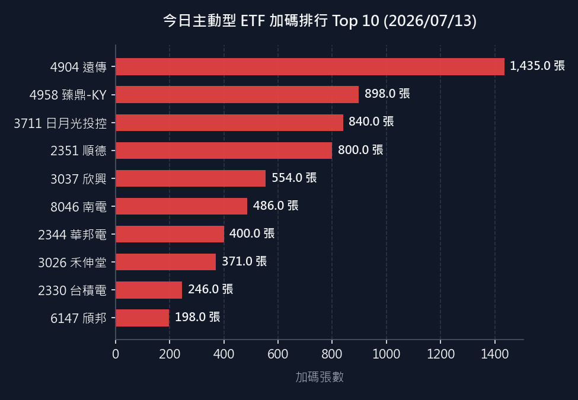
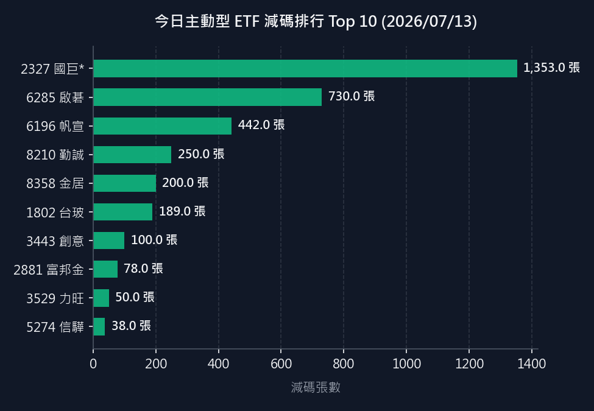

# 主動型 ETF 持股變動

資料來源：`主動型ETF持股明細.xlsx` 最近兩個日期分頁。

比較區間：`20260709` → `20260713`

## 今日加減碼視覺化排行

| 今日加碼 Top 10 | 今日減碼 Top 10 |
| :---: | :---: |
|  |  |

| ETF | 新增 | 刪除 | 比例變動 |
| :-- | --: | --: | --: |
| 00400A | 2 | 1 | 45 |
| 00401A | 0 | 0 | 45 |
| 00402A | 0 | 0 | 42 |
| 00403A | 0 | 2 | 34 |
| 00404A | 0 | 1 | 42 |
| 00405A | 0 | 0 | 32 |
| 00407A | 0 | 0 | 42 |
| 00980A | 0 | 0 | 37 |
| 00980D | 0 | 0 | 28 |
| 00981A | 0 | 0 | 31 |
| 00982A | 0 | 0 | 38 |
| 00983A | 0 | 1 | 33 |
| 00983D | 0 | 0 | 18 |
| 00984A | 0 | 0 | 0 |
| 00985A | 2 | 2 | 41 |
| 00986A | 0 | 0 | 31 |
| 00987A | 1 | 0 | 28 |
| 00988A | 4 | 3 | 35 |
| 00989A | 0 | 0 | 53 |
| 00990A | 2 | 0 | 41 |
| 00991A | 0 | 0 | 23 |
| 00992A | 0 | 0 | 29 |
| 00993A | 0 | 0 | 0 |
| 00994A | 2 | 1 | 25 |
| 00995A | 1 | 0 | 46 |
| 00996A | 0 | 1 | 37 |
| 00997A | 1 | 0 | 50 |
| 00998A | 1 | 1 | 34 |
| 00999A | 0 | 0 | 56 |

## 00400A

### 新增持股

- 3167 大量（0.20%，61 張）
- 4958 臻鼎-KY（1.00%，398 張）

### 刪除持股

- 6285 啟碁（0.74%，730 張）

### 投資比例變動

- 1303 南亞：0.43% → 0.48%（+0.05）
- 1590 亞德客-KY：0.96% → 1.00%（+0.04）
- 2059 川湖：3.46% → 3.41%（-0.05）
- 2303 聯電：1.79% → 1.78%（-0.01）
- 2308 台達電：3.26% → 3.29%（+0.03）
- 2313 華通：0.95% → 1.02%（+0.07）
- 2327 國巨*：3.14% → 1.85%（-1.29）
- 2330 台積電：8.99% → 9.14%（+0.15）
- 2345 智邦：2.18% → 2.13%（-0.05）
- 2357 華碩：1.28% → 1.32%（+0.04）
- 2360 致茂：2.86% → 2.92%（+0.06）
- 2368 金像電：1.09% → 1.06%（-0.03）
- 2376 技嘉：1.20% → 1.21%（+0.01）
- 2382 廣達：0.96% → 0.98%（+0.02）
- 2383 台光電：5.78% → 5.63%（-0.15）
- 2404 漢唐：0.59% → 0.61%（+0.02）
- 2408 南亞科：2.06% → 2.01%（-0.05）
- 2454 聯發科：6.71% → 6.58%（-0.13）
- 2472 立隆電：0.16% → 0.14%（-0.02）
- 2481 強茂：0.47% → 0.42%（-0.05）
- 2881 富邦金：0.40% → 0.41%（+0.01）
- 2885 元大金：1.06% → 1.07%（+0.01）
- 3017 奇鋐：3.63% → 3.46%（-0.17）
- 3037 欣興：3.64% → 3.78%（+0.14）
- 3044 健鼎：1.80% → 1.77%（-0.03）
- 3090 日電貿：0.67% → 0.60%（-0.07）
- 3211 順達：0.97% → 0.98%（+0.01）
- 3443 創意：2.29% → 2.27%（-0.02）
- 3653 健策：0.78% → 0.79%（+0.01）
- 3665 貿聯-KY：2.40% → 2.41%（+0.01）
- 3711 日月光投控：1.60% → 1.59%（-0.01）
- 5347 世界：1.81% → 1.88%（+0.07）
- 5434 崇越：0.40% → 0.44%（+0.04）
- 6121 新普：0.29% → 0.28%（-0.01）
- 6147 頎邦：1.04% → 0.95%（-0.09）
- 6187 萬潤：1.42% → 1.41%（-0.01）
- 6223 旺矽：4.70% → 4.44%（-0.26）
- 6442 光聖：0.44% → 0.41%（-0.03）
- 6488 環球晶：4.47% → 4.95%（+0.48）
- 6510 精測：1.26% → 1.24%（-0.02）
- 6515 穎崴：0.81% → 0.78%（-0.03）
- 6669 緯穎：3.97% → 3.94%（-0.03）
- 6715 嘉基：0.21% → 0.20%（-0.01）
- 8046 南電：0.31% → 1.28%（+0.97）
- 8210 勤誠：1.14% → 1.11%（-0.03）

## 00401A

### 新增持股

- 無

### 刪除持股

- 無

### 投資比例變動

- 1301 台塑：0.07% → 0.08%（+0.01）
- 2303 聯電：1.30% → 1.29%（-0.01）
- 2308 台達電：4.31% → 4.35%（+0.04）
- 2313 華通：1.22% → 1.33%（+0.11）
- 2330 台積電：9.05% → 9.19%（+0.14）
- 2344 華邦電：1.39% → 1.33%（-0.06）
- 2345 智邦：2.29% → 2.25%（-0.04）
- 2357 華碩：1.29% → 1.34%（+0.05）
- 2360 致茂：1.80% → 1.84%（+0.04）
- 2368 金像電：0.43% → 0.42%（-0.01）
- 2379 瑞昱：2.37% → 2.14%（-0.23）
- 2382 廣達：2.44% → 2.48%（+0.04）
- 2383 台光電：2.15% → 2.09%（-0.06）
- 2412 中華電：0.95% → 0.96%（+0.01）
- 2454 聯發科：6.32% → 6.19%（-0.13）
- 2603 長榮：1.08% → 1.09%（+0.01）
- 2881 富邦金：1.83% → 1.87%（+0.04）
- 2882 國泰金：1.17% → 1.18%（+0.01）
- 2883 凱基金：2.12% → 2.11%（-0.01）
- 2885 元大金：1.49% → 1.50%（+0.01）
- 2887 台新新光金：1.20% → 1.17%（-0.03）
- 2891 中信金：2.43% → 2.33%（-0.10）
- 3005 神基：0.21% → 0.22%（+0.01）
- 3034 聯詠：0.86% → 0.74%（-0.12）
- 3037 欣興：0.68% → 0.70%（+0.02）
- 3044 健鼎：1.19% → 1.18%（-0.01）
- 3131 弘塑：0.61% → 0.60%（-0.01）
- 3167 大量：0.58% → 0.62%（+0.04）
- 3491 昇達科：1.30% → 1.29%（-0.01）
- 3529 力旺：0.65% → 0.63%（-0.02）
- 3711 日月光投控：2.62% → 2.61%（-0.01）
- 4904 遠傳：0.86% → 0.87%（+0.01）
- 4958 臻鼎-KY：2.69% → 2.98%（+0.29）
- 4991 環宇-KY：0.64% → 0.63%（-0.01）
- 5347 世界：1.05% → 1.09%（+0.04）
- 5904 寶雅：0.67% → 0.62%（-0.05）
- 6223 旺矽：2.85% → 2.69%（-0.16）
- 6510 精測：0.71% → 0.69%（-0.02）
- 6515 穎崴：0.72% → 0.69%（-0.03）
- 6531 愛普*：1.43% → 1.39%（-0.04）
- 6669 緯穎：2.50% → 2.47%（-0.03）
- 6944 兆聯實業：0.56% → 0.59%（+0.03）
- 7769 鴻勁：2.89% → 2.92%（+0.03）
- 7828 創新服務：1.51% → 1.41%（-0.10）
- 8464 億豐：1.26% → 1.29%（+0.03）

## 00402A

### 新增持股

- 無

### 刪除持股

- 無

### 投資比例變動

- AAPL.US Apple：7.16% → 7.12%（-0.04）
- ADI.US Analog Devices：1.75% → 1.76%（+0.01）
- AMD.US AMD：5.39% → 5.62%（+0.23）
- ANET.US Arista Networks：0.81% → 0.82%（+0.01）
- ARM.US Arm：1.08% → 1.16%（+0.08）
- ASML.US ASML Holding：1.57% → 1.58%（+0.01）
- AVGO.US Broadcom：2.52% → 2.56%（+0.04）
- AXON.US Axon Enterprise：1.25% → 1.19%（-0.06）
- CDNS.US Cadence Design Systems：1.87% → 1.90%（+0.03）
- CIEN.US Ciena：1.25% → 1.29%（+0.04）
- CLS.US Celestica：0.93% → 0.90%（-0.03）
- COHR.US Coherent：1.53% → 1.56%（+0.03）
- CRWD.US CrowdStrike Holdings：1.19% → 1.22%（+0.03）
- GOOG.US Alphabet - Class C Capital Stock：3.50% → 3.42%（-0.08）
- GOOGL.US Alphabet - Class A Common Stock：3.47% → 3.39%（-0.08）
- INTC.US Intel：1.34% → 1.35%（+0.01）
- KLAC.US KLA：2.16% → 2.20%（+0.04）
- LITE.US Lumentum：1.17% → 1.28%（+0.11）
- LRCX.US Lam Research：3.61% → 3.78%（+0.17）
- MCHP.US Microchip Technology：1.65% → 1.68%（+0.03）
- META.US Meta：2.81% → 2.90%（+0.09）
- MRVL.US Marvell：1.54% → 1.59%（+0.05）
- MSFT.US Microsoft：3.39% → 3.35%（-0.04）
- MU.US Micron：6.35% → 6.54%（+0.19）
- NFLX.US Netflix：1.27% → 1.24%（-0.03）
- NOW.US ServiceNow：0.37% → 0.36%（-0.01）
- NVDA.US NVIDIA：8.56% → 8.39%（-0.17）
- NXPI.US NXP Semiconductors：1.25% → 1.26%（+0.01）
- ON.US ON Semiconductor：0.14% → 0.15%（+0.01）
- PANW.US Palo Alto：2.81% → 2.92%（+0.11）
- PLTR.US Palantir Technologies：1.27% → 1.22%（-0.05）
- SHOP.US Shopify：0.66% → 0.67%（+0.01）
- SIMO.US Silicon Motion：0.88% → 0.89%（+0.01）
- SNOW.US Snowflake：0.73% → 0.74%（+0.01）
- SPCX.US SpaceX：0.71% → 0.72%（+0.01）
- STX.US Seagate：1.38% → 1.41%（+0.03）
- TER.US Teradyne：0.63% → 0.64%（+0.01）
- TSM.US TSMC(ADR)：1.63% → 1.61%（-0.02）
- TTWO.US Take-Two：0.76% → 0.73%（-0.03）
- TXN.US Texas Instruments：3.04% → 3.07%（+0.03）
- V.US Visa：1.19% → 1.18%（-0.01）
- WDC.US Western Digital：2.84% → 2.94%（+0.10）

## 00403A

### 新增持股

- 無

### 刪除持股

- 3529 力旺（0.08%，50 張）
- 6196 帆宣（0.15%，442 張）

### 投資比例變動

- 1303 南亞：0.95% → 1.05%（+0.10）
- 1560 中砂：0.44% → 0.43%（-0.01）
- 2303 聯電：7.19% → 7.15%（-0.04）
- 2308 台達電：2.81% → 2.85%（+0.04）
- 2327 國巨*：4.98% → 3.96%（-1.02）
- 2330 台積電：19.01% → 19.41%（+0.40）
- 2337 旺宏：0.88% → 0.86%（-0.02）
- 2344 華邦電：4.30% → 4.15%（-0.15）
- 2345 智邦：3.19% → 3.14%（-0.05）
- 2360 致茂：0.50% → 0.52%（+0.02）
- 2368 金像電：1.82% → 1.79%（-0.03）
- 2383 台光電：3.71% → 3.63%（-0.08）
- 2454 聯發科：3.86% → 3.80%（-0.06）
- 3017 奇鋐：4.99% → 4.77%（-0.22）
- 3037 欣興：3.80% → 3.96%（+0.16）
- 3189 景碩：1.57% → 1.64%（+0.07）
- 3211 順達：0.50% → 0.51%（+0.01）
- 3264 欣銓：0.09% → 0.08%（-0.01）
- 3443 創意：1.28% → 1.27%（-0.01）
- 3533 嘉澤：1.49% → 1.53%（+0.04）
- 3583 辛耘：0.45% → 0.44%（-0.01）
- 3653 健策：1.54% → 1.55%（+0.01）
- 4958 臻鼎-KY：2.33% → 2.79%（+0.46）
- 6223 旺矽：4.35% → 4.13%（-0.22）
- 6239 力成：0.18% → 0.17%（-0.01）
- 6442 光聖：0.27% → 0.26%（-0.01）
- 6488 環球晶：1.79% → 1.99%（+0.20）
- 6515 穎崴：0.95% → 0.92%（-0.03）
- 6669 緯穎：2.45% → 2.43%（-0.02）
- 6805 富世達：0.51% → 0.50%（-0.01）
- 7769 鴻勁：1.14% → 1.16%（+0.02）
- 8046 南電：0.92% → 1.14%（+0.22）
- 8358 金居：0.64% → 0.54%（-0.10）
- 8996 高力：1.21% → 1.23%（+0.02）

## 00404A

### 新增持股

- 無

### 刪除持股

- 臺股期貨07/26（9.24%，N/A 張）

### 投資比例變動

- 1303 南亞：0.41% → 0.45%（+0.04）
- 2303 聯電：2.47% → 2.45%（-0.02）
- 2308 台達電：3.86% → 3.92%（+0.06）
- 2327 國巨*：0.75% → 0.69%（-0.06）
- 2330 台積電：22.28% → 22.71%（+0.43）
- 2345 智邦：0.96% → 0.94%（-0.02）
- 2347 聯強：1.73% → 1.62%（-0.11）
- 2356 英業達：0.23% → 0.22%（-0.01）
- 2360 致茂：1.03% → 1.06%（+0.03）
- 2382 廣達：2.73% → 2.79%（+0.06）
- 2383 台光電：1.89% → 1.85%（-0.04）
- 2454 聯發科：6.60% → 6.49%（-0.11）
- 2618 長榮航：1.90% → 1.98%（+0.08）
- 2885 元大金：2.31% → 2.33%（+0.02）
- 2891 中信金：2.86% → 2.74%（-0.12）
- 3014 聯陽：1.56% → 1.55%（-0.01）
- 3017 奇鋐：0.70% → 0.67%（-0.03）
- 3034 聯詠：2.13% → 1.85%（-0.28）
- 3037 欣興：0.42% → 0.43%（+0.01）
- 3044 健鼎：1.78% → 1.75%（-0.03）
- 3189 景碩：0.31% → 0.32%（+0.01）
- 3217 優群：1.25% → 1.17%（-0.08）
- 3227 原相：1.78% → 1.63%（-0.15）
- 3264 欣銓：1.07% → 1.03%（-0.04）
- 3265 台星科：1.20% → 1.18%（-0.02）
- 3293 鈊象：1.59% → 1.58%（-0.01）
- 3592 瑞鼎：1.30% → 1.23%（-0.07）
- 3711 日月光投控：3.91% → 3.90%（-0.01）
- 5347 世界：0.65% → 0.68%（+0.03）
- 5434 崇越：1.77% → 1.96%（+0.19）
- 5904 寶雅：1.93% → 1.81%（-0.12）
- 6121 新普：1.16% → 1.12%（-0.04）
- 6139 亞翔：0.23% → 0.24%（+0.01）
- 6223 旺矽：0.95% → 0.90%（-0.05）
- 6257 矽格：1.83% → 1.77%（-0.06）
- 6488 環球晶：0.20% → 0.22%（+0.02）
- 6515 穎崴：0.35% → 0.33%（-0.02）
- 8016 矽創：0.13% → 0.12%（-0.01）
- 8081 致新：1.69% → 1.67%（-0.02）
- 8299 群聯：1.19% → 1.17%（-0.02）
- 臺指選擇權08/26 49100 買權：-0.42% → -0.37%（+0.05）
- 臺股期貨08/26：7.39% → 16.83%（+9.44）

## 00405A

### 新增持股

- 無

### 刪除持股

- 無

### 投資比例變動

- 2059 川湖：1.34% → 1.33%（-0.01）
- 2308 台達電：1.05% → 1.06%（+0.01）
- 2327 國巨*：4.43% → 4.05%（-0.38）
- 2330 台積電：2.24% → 2.28%（+0.04）
- 2337 旺宏：1.56% → 1.51%（-0.05）
- 2344 華邦電：4.03% → 3.85%（-0.18）
- 2345 智邦：5.06% → 4.97%（-0.09）
- 2368 金像電：1.26% → 1.24%（-0.02）
- 2383 台光電：3.22% → 3.15%（-0.07）
- 2454 聯發科：6.54% → 6.43%（-0.11）
- 3017 奇鋐：6.31% → 6.03%（-0.28）
- 3026 禾伸堂：0.90% → 2.05%（+1.15）
- 3037 欣興：4.37% → 4.55%（+0.18）
- 3131 弘塑：4.19% → 4.10%（-0.09）
- 3443 創意：5.61% → 5.58%（-0.03）
- 3583 辛耘：1.91% → 1.88%（-0.03）
- 3653 健策：2.23% → 2.25%（+0.02）
- 5347 世界：0.14% → 0.15%（+0.01）
- 6187 萬潤：2.25% → 2.24%（-0.01）
- 6223 旺矽：6.25% → 5.92%（-0.33）
- 6442 光聖：0.40% → 0.38%（-0.02）
- 6488 環球晶：5.23% → 5.81%（+0.58）
- 6510 精測：1.49% → 1.46%（-0.03）
- 6515 穎崴：0.69% → 0.66%（-0.03）
- 6526 達發：0.37% → 0.39%（+0.02）
- 7734 印能科技：1.75% → 1.72%（-0.03）
- 7769 鴻勁：2.58% → 2.62%（+0.04）
- 8028 昇陽半導體：1.08% → 1.05%（-0.03）
- 8046 南電：2.68% → 2.83%（+0.15）
- 8210 勤誠：2.13% → 0.97%（-1.16）
- 8299 群聯：1.50% → 1.48%（-0.02）
- 8996 高力：1.34% → 1.37%（+0.03）

## 00407A

### 新增持股

- 無

### 刪除持股

- 無

### 投資比例變動

- 1303 南亞：0.56% → 0.62%（+0.06）
- 1590 亞德客-KY：1.67% → 1.74%（+0.07）
- 2059 川湖：2.08% → 2.06%（-0.02）
- 2303 聯電：1.78% → 1.77%（-0.01）
- 2308 台達電：3.99% → 4.05%（+0.06）
- 2327 國巨*：3.42% → 3.13%（-0.29）
- 2330 台積電：9.06% → 9.23%（+0.17）
- 2344 華邦電：1.79% → 1.71%（-0.08）
- 2345 智邦：3.37% → 3.31%（-0.06）
- 2360 致茂：1.64% → 1.68%（+0.04）
- 2368 金像電：2.05% → 2.01%（-0.04）
- 2376 技嘉：0.72% → 0.73%（+0.01）
- 2379 瑞昱：0.88% → 0.80%（-0.08）
- 2383 台光電：3.92% → 3.83%（-0.09）
- 2408 南亞科：1.75% → 1.71%（-0.04）
- 2412 中華電：1.63% → 1.64%（+0.01）
- 2451 創見：0.14% → 0.15%（+0.01）
- 2454 聯發科：6.64% → 6.52%（-0.12）
- 3017 奇鋐：3.34% → 3.19%（-0.15）
- 3034 聯詠：0.73% → 0.63%（-0.10）
- 3037 欣興：3.76% → 3.91%（+0.15）
- 3293 鈊象：0.57% → 0.56%（-0.01）
- 3443 創意：1.81% → 1.80%（-0.01）
- 3529 力旺：1.69% → 1.67%（-0.02）
- 3533 嘉澤：0.82% → 0.83%（+0.01）
- 3665 貿聯-KY：1.90% → 1.91%（+0.01）
- 3711 日月光投控：2.03% → 2.02%（-0.01）
- 4958 臻鼎-KY：2.25% → 2.50%（+0.25）
- 5274 信驊：1.83% → 1.82%（-0.01）
- 5434 崇越：0.19% → 0.21%（+0.02）
- 5536 聖暉*：1.91% → 1.87%（-0.04）
- 6223 旺矽：2.73% → 2.59%（-0.14）
- 6274 台燿：2.91% → 2.90%（-0.01）
- 6446 藥華藥：2.48% → 2.43%（-0.05）
- 6515 穎崴：1.62% → 1.55%（-0.07）
- 6526 達發：0.34% → 0.36%（+0.02）
- 6531 愛普*：1.54% → 1.51%（-0.03）
- 6669 緯穎：3.24% → 3.21%（-0.03）
- 6805 富世達：1.55% → 1.51%（-0.04）
- 8046 南電：2.42% → 2.55%（+0.13）
- 8210 勤誠：1.74% → 1.70%（-0.04）
- 8996 高力：0.46% → 0.47%（+0.01）

## 00980A

### 新增持股

- 無

### 刪除持股

- 無

### 投資比例變動

- 2059 川湖：5.45% → 5.40%（-0.05）
- 2308 台達電：5.36% → 5.45%（+0.09）
- 2317 鴻海：1.83% → 1.85%（+0.02）
- 2327 國巨*：1.86% → 1.71%（-0.15）
- 2330 台積電：9.20% → 9.40%（+0.20）
- 2344 華邦電：1.22% → 1.17%（-0.05）
- 2345 智邦：1.93% → 1.90%（-0.03）
- 2360 致茂：1.56% → 1.61%（+0.05）
- 2368 金像電：2.54% → 2.50%（-0.04）
- 2382 廣達：1.19% → 1.22%（+0.03）
- 2383 台光電：4.80% → 4.70%（-0.10）
- 2408 南亞科：1.49% → 1.46%（-0.03）
- 2454 聯發科：6.34% → 6.25%（-0.09）
- 2891 中信金：1.20% → 1.15%（-0.05）
- 3008 大立光：0.83% → 0.92%（+0.09）
- 3017 奇鋐：1.85% → 1.77%（-0.08）
- 3026 禾伸堂：0.81% → 0.74%（-0.07）
- 3036 文曄：1.36% → 1.37%（+0.01）
- 3037 欣興：2.95% → 3.08%（+0.13）
- 3081 聯亞：2.60% → 2.61%（+0.01）
- 3189 景碩：0.66% → 0.69%（+0.03）
- 3529 力旺：0.94% → 0.93%（-0.01）
- 3533 嘉澤：0.15% → 0.16%（+0.01）
- 3653 健策：2.91% → 2.93%（+0.02）
- 4958 臻鼎-KY：1.54% → 1.71%（+0.17）
- 5904 寶雅：1.35% → 1.27%（-0.08）
- 6223 旺矽：3.23% → 3.07%（-0.16）
- 6274 台燿：1.23% → 1.22%（-0.01）
- 6442 光聖：0.33% → 0.31%（-0.02）
- 6515 穎崴：2.56% → 2.46%（-0.10）
- 6805 富世達：0.47% → 0.46%（-0.01）
- 6831 邁科：0.39% → 0.37%（-0.02）
- 7769 鴻勁：3.72% → 3.79%（+0.07）
- 8046 南電：1.60% → 1.69%（+0.09）
- 8210 勤誠：0.79% → 0.77%（-0.02）
- 8299 群聯：1.05% → 1.04%（-0.01）
- 8996 高力：1.63% → 1.67%（+0.04）

## 00980D

### 新增持股

- 無

### 刪除持股

- 無

### 投資比例變動

- AMC GLOBAL MEDIA INC SER REGS (REG) (REG S) 10.5% 15JUL2032：0.70% → 0.71%（+0.01）
- ATHENE HOLDING LTD 6.625000 % 19MAY2055：0.57% → 0.58%（+0.01）
- BARCLAYS PLC (REG) VAR 27JUN2034：0.34% → 0.35%（+0.01）
- BAT CAPITAL CORP (REG) 7.081% 02AUG2053：0.58% → 0.59%（+0.01）
- CHARTER COMM OPT LLC/CAP 6.700000 % 01-DEC-2055：0.48% → 0.47%（-0.01）
- CHC GROUP LLC SER REGS 11.750000 % 01-SEP-2030：0.42% → 0.41%（-0.01）
- CITIGROUP INC 8.125% 15JUL2039：0.63% → 0.64%（+0.01）
- CONCENTRIX CORP (REG) 6.85% 02AUG2033：0.66% → 0.67%（+0.01）
- COREWEAVE INC SER REGS (REG S) 9.25% 01JUN2030：0.44% → 0.45%（+0.01）
- DELL INT LLC / EMC CORP (REG) 8.1% 15JUL2036：0.59% → 0.60%（+0.01）
- ENEL FINANCE INTL NV SER REGS (REG S) 7.75% 14OCT2052：0.37% → 0.38%（+0.01）
- HERTZ CORP/THE SER REGS (REG S) 12.625% 15JUL2029：0.34% → 0.33%（-0.01）
- ICAHN ENTERPRISES/FIN SER REGS 10.000000 % 15NOV2029：0.31% → 0.32%（+0.01）
- MOBIUS MERGER SUB SER REGS 9.000000 % 01JUN2030：0.24% → 0.25%（+0.01）
- MYLAN INC SER WI (REG) 5.2% 15APR2048WI：0.49% → 0.50%（+0.01）
- ORACLE CORP 5.55% 06FEB2053：0.26% → 0.25%（-0.01）
- ORACLE CORP 6.000000 % 03AUG2055：0.32% → 0.31%（-0.01）
- ORACLE CORP 6.125000 % 03AUG2065：0.54% → 0.53%（-0.01）
- ORACLE CORP 6.9% 09NOV2052：0.54% → 0.53%（-0.01）
- SABRE FINANCIAL BORROWER SER REGS 11.125 % 15-JUN-2029：0.53% → 0.52%（-0.01）
- SABRE GLBL INC SER REGS 11.125000 % 15JUL2030：0.45% → 0.44%（-0.01）
- SBL HOLDINGS INC SER REGS 7.200000 % 30OCT2034：0.52% → 0.53%（+0.01）
- TELEFONICA EUROPE BV (REG) 8.25% 15SEP2030：0.41% → 0.42%（+0.01）
- TOUCAN FINCO LTD/CAN/US SER REGS 9.500000 % 15MAY2030：0.26% → 0.25%（-0.01）
- US 10YR NOTE (CBT)SEP26 21-SEP-2026：18.49% → 18.54%（+0.05）
- US 10YR ULTRA FUT SEP26 21-SEP-2026：-2.82% → -2.83%（-0.01）
- US 5YR NOTE (CBT) SEP26 30-SEP-2026：-16.05% → -16.08%（-0.03）
- US LONG BOND(CBT) SEP26 21-SEP-2026：5.47% → 5.48%（+0.01）

## 00981A

### 新增持股

- 無

### 刪除持股

- 無

### 投資比例變動

- 1590 亞德客-KY：0.25% → 0.26%（+0.01）
- 2002 中鋼：0.03% → 0.04%（+0.01）
- 2303 聯電：4.91% → 4.94%（+0.03）
- 2308 台達電：3.46% → 3.55%（+0.09）
- 2327 國巨*：8.22% → 7.61%（-0.61）
- 2330 台積電：10.51% → 10.85%（+0.34）
- 2345 智邦：5.69% → 5.66%（-0.03）
- 2368 金像電：3.25% → 3.23%（-0.02）
- 2383 台光電：8.97% → 8.87%（-0.10）
- 2449 京元電子：0.21% → 0.22%（+0.01）
- 2454 聯發科：7.33% → 7.30%（-0.03）
- 3017 奇鋐：4.44% → 4.29%（-0.15）
- 3037 欣興：5.03% → 5.48%（+0.45）
- 3376 新日興：0.12% → 0.13%（+0.01）
- 3653 健策：2.64% → 2.69%（+0.05）
- 3665 貿聯-KY：3.28% → 3.35%（+0.07）
- 3711 日月光投控：3.64% → 3.77%（+0.13）
- 5274 信驊：2.07% → 2.10%（+0.03）
- 5439 高技：0.42% → 0.41%（-0.01）
- 6147 頎邦：0.50% → 0.46%（-0.04）
- 6223 旺矽：6.30% → 6.03%（-0.27）
- 6271 同欣電：0.27% → 0.26%（-0.01）
- 6274 台燿：2.95% → 2.97%（+0.02）
- 6278 台表科：0.31% → 0.29%（-0.02）
- 6488 環球晶：0.02% → 0.03%（+0.01）
- 6510 精測：0.43% → 0.42%（-0.01）
- 6515 穎崴：0.58% → 0.56%（-0.02）
- 6669 緯穎：4.43% → 4.46%（+0.03）
- 6805 富世達：0.96% → 0.95%（-0.01）
- 8046 南電：4.05% → 4.36%（+0.31）
- 8210 勤誠：0.97% → 0.96%（-0.01）

## 00982A

### 新增持股

- 無

### 刪除持股

- 無

### 投資比例變動

- 1785 光洋科：1.51% → 1.38%（-0.13）
- 2059 川湖：2.93% → 2.90%（-0.03）
- 2303 聯電：2.70% → 2.69%（-0.01）
- 2316 楠梓電：1.36% → 1.23%（-0.13）
- 2327 國巨*：1.47% → 1.35%（-0.12）
- 2330 台積電：9.22% → 9.42%（+0.20）
- 2345 智邦：3.80% → 3.75%（-0.05）
- 2351 順德：0.35% → 0.70%（+0.35）
- 2360 致茂：2.91% → 2.99%（+0.08）
- 2368 金像電：0.81% → 0.79%（-0.02）
- 2376 技嘉：0.69% → 0.70%（+0.01）
- 2377 微星：1.59% → 1.65%（+0.06）
- 2383 台光電：3.35% → 3.28%（-0.07）
- 2454 聯發科：6.53% → 6.43%（-0.10）
- 2467 志聖：1.55% → 1.68%（+0.13）
- 2472 立隆電：1.71% → 1.58%（-0.13）
- 3008 大立光：1.53% → 1.70%（+0.17）
- 3017 奇鋐：1.86% → 1.78%（-0.08）
- 3036 文曄：0.93% → 0.94%（+0.01）
- 3105 穩懋：3.26% → 3.28%（+0.02）
- 3264 欣銓：2.11% → 2.04%（-0.07）
- 3491 昇達科：2.38% → 2.39%（+0.01）
- 3583 辛耘：1.75% → 1.72%（-0.03）
- 3702 大聯大：1.10% → 1.23%（+0.13）
- 4958 臻鼎-KY：3.59% → 3.99%（+0.40）
- 5536 聖暉*：8.76% → 8.60%（-0.16）
- 6139 亞翔：5.21% → 5.31%（+0.10）
- 6147 頎邦：0.97% → 0.89%（-0.08）
- 6187 萬潤：0.19% → 0.18%（-0.01）
- 6223 旺矽：4.22% → 4.00%（-0.22）
- 6257 矽格：2.19% → 2.13%（-0.06）
- 6278 台表科：0.84% → 0.77%（-0.07）
- 6488 環球晶：2.97% → 3.30%（+0.33）
- 6531 愛普*：1.24% → 1.22%（-0.02）
- 6669 緯穎：2.90% → 2.89%（-0.01）
- 7769 鴻勁：1.18% → 1.20%（+0.02）
- 8016 矽創：1.54% → 1.40%（-0.14）
- 8996 高力：0.90% → 0.91%（+0.01）

## 00983A

### 新增持股

- 無

### 刪除持股

- ROKU.US Roku（0.30%，0.872 張）

### 投資比例變動

- AMD.US AMD：6.10% → 6.31%（+0.21）
- AMZN.US Amazon：2.84% → 2.82%（-0.02）
- BEAM.US Beam Therapeutics：4.35% → 4.13%（-0.22）
- BWXT.US BWX Technologies：0.50% → 0.26%（-0.24）
- CBRS.US Cerebras：0.51% → 0.55%（+0.04）
- COIN.US Coinbase：1.15% → 1.12%（-0.03）
- CRCL.US Circle：0.88% → 0.85%（-0.03）
- CRSP.US CRISPR Therapeutics：5.15% → 4.79%（-0.36）
- CRWV.US CoreWeave：0.83% → 0.58%（-0.25）
- DE.US Deere：0.91% → 0.89%（-0.02）
- GOOG.US Alphabet - Class C Capital Stock：1.17% → 1.14%（-0.03）
- GOOGL.US Alphabet - Class A Common Stock：1.56% → 1.51%（-0.05）
- HOOD.US Robinhood Markets：7.28% → 7.23%（-0.05）
- ILMN.US Illumina：3.21% → 3.25%（+0.04）
- LLY.US Eli Lilly：2.01% → 1.97%（-0.04）
- META.US Meta：0.23% → 0.24%（+0.01）
- NTLA.US Intellia Therapeutics：3.98% → 3.57%（-0.41）
- NTRA.US Natera：3.64% → 3.66%（+0.02）
- NVDA.US NVIDIA：0.74% → 0.72%（-0.02）
- PLTR.US Palantir Technologies：0.57% → 0.54%（-0.03）
- RBLX.US Roblox：2.43% → 2.70%（+0.27）
- SHOP.US Shopify：5.11% → 5.17%（+0.06）
- SOFI.US SoFi Technologies：0.61% → 0.62%（+0.01）
- SPCX.US SpaceX：4.58% → 4.60%（+0.02）
- TEM.US Tempus：6.12% → 6.44%（+0.32）
- TER.US Teradyne：0.52% → 0.53%（+0.01）
- TSLA.US Tesla：8.04% → 8.07%（+0.03）
- TSM.US TSMC(ADR)：3.28% → 3.21%（-0.07）
- TWST.US Twist Bioscience：4.02% → 3.87%（-0.15）
- TXG.US 10x Genomics：4.83% → 5.03%（+0.20）
- VCYT.US Veracyte：1.44% → 1.48%（+0.04）
- WGS.US GeneDx：1.24% → 1.28%（+0.04）
- XYZ.US Block：1.95% → 1.93%（-0.02）

## 00983D

### 新增持股

- 無

### 刪除持股

- 無

### 投資比例變動

- AMCX 10 1/2 07/15/32：1.59% → 1.60%（+0.01）
- ATH 6 5/8 05/19/55：0.85% → 0.86%（+0.01）
- BATSLN 7.081 08/02/53：1.33% → 1.34%（+0.01）
- BNCN 7 3/8 03/01/33：1.11% → 1.10%（-0.01）
- CRWV 9 02/01/31：1.32% → 1.33%（+0.01）
- CYH 10 7/8 01/15/32：1.50% → 1.49%（-0.01）
- DELL 8.35 07/15/46：1.62% → 1.63%（+0.01）
- DIS 7 3/4 12/01/45：0.79% → 0.80%（+0.01）
- DOW 6.9 05/15/53：0.73% → 0.74%（+0.01）
- DOW 9.4 05/15/39：1.90% → 1.91%（+0.01）
- GE 6 3/4 03/15/32：0.57% → 0.58%（+0.01）
- GTN 10 1/2 07/15/29：1.67% → 1.66%（-0.01）
- HSBC 6.332 03/09/44：1.07% → 1.08%（+0.01）
- HTZ 12 5/8 07/15/29：0.61% → 0.60%（-0.01）
- NVDA 5.55 06/15/46：0.90% → 0.89%（-0.01）
- ORCL 6.9 11/09/52：1.39% → 1.37%（-0.02）
- SABHLD 10 3/4 11/15/29：0.60% → 0.59%（-0.01）
- SPCX 6.6 07/15/46：0.88% → 0.86%（-0.02）

## 00984A

### 新增持股

- 無

### 刪除持股

- 無

### 投資比例變動

- 無

## 00985A

### 新增持股

- 2027 大成鋼（0.55%，1404 張）
- 6505 台塑化（0.54%，867 張）

### 刪除持股

- 3533 嘉澤（0.19%，10 張）
- 6239 力成（0.04%，12 張）

### 投資比例變動

- 1216 統一：1.00% → 1.01%（+0.01）
- 1802 台玻：0.99% → 0.86%（-0.13）
- 2049 上銀：0.98% → 0.87%（-0.11）
- 2059 川湖：3.00% → 2.95%（-0.05）
- 2303 聯電：1.85% → 1.82%（-0.03）
- 2308 台達電：1.26% → 1.10%（-0.16）
- 2330 台積電：26.00% → 23.35%（-2.65）
- 2344 華邦電：1.48% → 1.40%（-0.08）
- 2345 智邦：2.23% → 2.18%（-0.05）
- 2360 致茂：1.61% → 1.64%（+0.03）
- 2368 金像電：1.28% → 1.11%（-0.17）
- 2383 台光電：2.13% → 2.07%（-0.06）
- 2395 研華：2.89% → 3.06%（+0.17）
- 2408 南亞科：1.63% → 1.59%（-0.04）
- 2454 聯發科：1.47% → 1.24%（-0.23）
- 2881 富邦金：0.72% → 0.64%（-0.08）
- 2891 中信金：0.53% → 0.51%（-0.02）
- 3008 大立光：2.64% → 2.91%（+0.27）
- 3017 奇鋐：1.57% → 1.36%（-0.21）
- 3036 文曄：2.31% → 2.58%（+0.27）
- 3081 聯亞：1.32% → 1.31%（-0.01）
- 3131 弘塑：2.11% → 1.84%（-0.27）
- 3293 鈊象：1.14% → 1.12%（-0.02）
- 3529 力旺：0.64% → 0.63%（-0.01）
- 3653 健策：1.16% → 1.01%（-0.15）
- 3661 世芯-KY：3.02% → 2.98%（-0.04）
- 3711 日月光投控：0.93% → 0.83%（-0.10）
- 4904 遠傳：0.55% → 1.91%（+1.36）
- 4958 臻鼎-KY：2.39% → 2.63%（+0.24）
- 6147 頎邦：1.94% → 2.24%（+0.30）
- 6187 萬潤：1.99% → 2.30%（+0.31）
- 6223 旺矽：1.53% → 1.31%（-0.22）
- 6415 矽力*-KY：0.50% → 0.51%（+0.01）
- 6442 光聖：2.91% → 3.05%（+0.14）
- 6488 環球晶：0.53% → 0.59%（+0.06）
- 6669 緯穎：0.74% → 0.73%（-0.01）
- 6805 富世達：0.20% → 0.19%（-0.01）
- 7769 鴻勁：0.85% → 0.73%（-0.12）
- 8046 南電：1.41% → 1.19%（-0.22）
- 8299 群聯：1.33% → 1.30%（-0.03）
- 8996 高力：0.71% → 0.72%（+0.01）

## 00986A

### 新增持股

- 無

### 刪除持股

- 無

### 投資比例變動

- 2330 台積電：8.84% → 8.47%（-0.37）
- AMD.US AMD：2.43% → 2.52%（+0.09）
- AMZN.US Amazon：3.57% → 3.55%（-0.02）
- AVGO.US Broadcom：4.88% → 4.94%（+0.06）
- CAT.US Caterpillar：2.73% → 2.65%（-0.08）
- COHR.US Coherent：2.16% → 2.18%（+0.02）
- CRWD.US CrowdStrike Holdings：3.75% → 3.82%（+0.07）
- ETN.US Eaton：2.09% → 2.08%（-0.01）
- GEV.US GE Vernova：3.64% → 3.59%（-0.05）
- GOOGL.US Alphabet - Class A Common Stock：7.57% → 7.37%（-0.20）
- GS.US Goldman Sachs：2.96% → 2.98%（+0.02）
- HWM.US Howmet Aerospace：2.42% → 2.39%（-0.03）
- LITE.US Lumentum：2.89% → 3.15%（+0.26）
- LLY.US Eli Lilly：2.86% → 2.81%（-0.05）
- LRCX.US Lam Research：3.52% → 3.66%（+0.14）
- MRVL.US Marvell：1.33% → 1.37%（+0.04）
- MSFT.US Microsoft：2.01% → 1.97%（-0.04）
- MU.US Micron：5.46% → 5.60%（+0.14）
- MUFG(8306.JP)：1.33% → 1.30%（-0.03）
- Murata Mfg.(6981.JP)：2.04% → 2.10%（+0.06）
- NET.US Cloudflare：1.72% → 1.70%（-0.02）
- NVDA.US NVIDIA：5.66% → 5.52%（-0.14）
- SNDK.US Sandisk：1.99% → 2.10%（+0.11）
- SNOW.US Snowflake：1.16% → 1.17%（+0.01）
- Siemens Energy AG：2.00% → 2.02%（+0.02）
- TSLA.US Tesla：1.13% → 1.15%（+0.02）
- WMT.US Walmart：1.07% → 1.04%（-0.03）
- Yaskawa Electric(6506.JP)：2.14% → 2.16%（+0.02）
- 嘉能可公司：1.37% → 1.41%（+0.04）
- 施奈德電機公司：1.50% → 1.51%（+0.01）
- 英飛凌科技股份有限公司：3.36% → 3.45%（+0.09）

## 00987A

### 新增持股

- 8046 南電（1.00%，21 張）

### 刪除持股

- 無

### 投資比例變動

- 2327 國巨*：3.67% → 3.40%（-0.27）
- 2330 台積電：7.98% → 8.23%（+0.25）
- 2345 智邦：2.54% → 2.52%（-0.02）
- 2383 台光電：6.61% → 6.53%（-0.08）
- 2408 南亞科：2.57% → 3.81%（+1.24）
- 2454 聯發科：2.45% → 2.44%（-0.01）
- 2455 全新：2.49% → 2.53%（+0.04）
- 3017 奇鋐：7.42% → 7.17%（-0.25）
- 3037 欣興：6.10% → 6.43%（+0.33）
- 3081 聯亞：3.38% → 3.43%（+0.05）
- 3131 弘塑：1.46% → 1.44%（-0.02）
- 3167 大量：1.93% → 2.11%（+0.18）
- 3363 上詮：2.07% → 2.09%（+0.02）
- 3443 創意：3.82% → 3.84%（+0.02）
- 3653 健策：2.12% → 2.16%（+0.04）
- 3665 貿聯-KY：3.42% → 3.50%（+0.08）
- 4764 雙鍵：2.11% → 1.94%（-0.17）
- 5274 信驊：1.65% → 1.67%（+0.02）
- 6139 亞翔：3.08% → 3.18%（+0.10）
- 6223 旺矽：7.01% → 6.72%（-0.29）
- 6271 同欣電：1.97% → 1.88%（-0.09）
- 6274 台燿：4.32% → 4.36%（+0.04）
- 6488 環球晶：1.73% → 1.95%（+0.22）
- 6515 穎崴：1.42% → 1.38%（-0.04）
- 6683 雍智科技：3.29% → 3.26%（-0.03）
- 8028 昇陽半導體：2.02% → 2.00%（-0.02）
- 8155 博智：3.37% → 3.36%（-0.01）
- 8358 金居：2.23% → 2.13%（-0.10）

## 00988A

### 新增持股

- FTNT.US Fortinet（0.84%，100 張）
- NOW.US ServiceNow（0.56%，100 張）
- 三環集團(300408.SZ)（0.61%，599.909 張）
- 中船特氣(688146.SH)（0.66%，240 張）

### 刪除持股

- CHAOZHOU THREE-CIRCLE GROU-A（0.62%，599.909 張）
- PERIC SPECIAL GASES CO LTD-A（0.63%，240 張）
- samsung electronics co ltd(005930 KS)（1.91%，200 張）

### 投資比例變動

- 2303 聯電：1.63% → 1.49%（-0.14）
- 2308 台達電：0.55% → 0.52%（-0.03）
- 2327 國巨*：3.27% → 3.44%（+0.17）
- 2330 台積電：2.27% → 2.39%（+0.12）
- 2383 台光電：2.93% → 2.78%（-0.15）
- 2454 聯發科：2.97% → 2.78%（-0.19）
- 3017 奇鋐：0.84% → 0.81%（-0.03）
- 3037 欣興：3.17% → 3.07%（-0.10）
- 3711 日月光投控：1.15% → 1.51%（+0.36）
- 6223 旺矽：1.56% → 1.64%（+0.08）
- 6274 台燿：1.03% → 0.94%（-0.09）
- AIXTRON SE：1.00% → 1.01%（+0.01）
- AMAT.US Applied Materials：3.52% → 3.78%（+0.26）
- AMD.US AMD：5.69% → 5.75%（+0.06）
- BE.US Bloom Energy：3.41% → 3.30%（-0.11）
- COHR.US Coherent：0.47% → 0.46%（-0.01）
- CRDO.US Credo：1.67% → 2.18%（+0.51）
- IBIDEN(4062.JP)：1.74% → 1.70%（-0.04）
- KLAC.US KLA：1.54% → 1.53%（-0.01）
- Kioxia Holdings(285A.JP)：4.87% → 5.54%（+0.67）
- LITE.US Lumentum：1.67% → 1.77%（+0.10）
- Lasertec Corporation(6920.JP)：1.22% → 1.19%（-0.03）
- MICRONICS(6871.JP)：0.69% → 1.55%（+0.86）
- MRVL.US Marvell：2.86% → 2.87%（+0.01）
- Murata Mfg.(6981.JP)：3.18% → 3.74%（+0.56）
- Nippon Chemi-Con(6997.JP)：1.65% → 1.58%（-0.07）
- SK hynix(000660.KS)：1.45% → 1.53%（+0.08）
- SNDK.US Sandisk：4.17% → 4.58%（+0.41）
- STM.US STMicroelectronics：1.75% → 1.74%（-0.01）
- SUMCO(3436.JP)：1.92% → 1.86%（-0.06）
- Samsung Elec Mech(009150.KS)：4.11% → 4.27%（+0.16）
- TAIYO YUDEN(6976.JP)：3.76% → 3.53%（-0.23）
- Tokyo Electron(8035.JP)：1.96% → 2.47%（+0.51）
- Union Tool(6278.JP)：0.56% → 0.55%（-0.01）
- WDC.US Western Digital：2.66% → 2.67%（+0.01）

## 00989A

### 新增持股

- 無

### 刪除持股

- 無

### 投資比例變動

- ADI.US Analog Devices：1.08% → 1.09%（+0.01）
- ALGM.US Allegro MicroSystems：0.74% → 0.81%（+0.07）
- AMAT.US Applied Materials：0.64% → 0.65%（+0.01）
- AMD.US AMD：3.56% → 3.70%（+0.14）
- AMKR.US Amkor：1.01% → 1.07%（+0.06）
- APP.US Applovin：1.23% → 1.21%（-0.02）
- ASML.US ASML Holding：3.06% → 3.07%（+0.01）
- AVGO.US Broadcom：3.91% → 3.97%（+0.06）
- BE.US Bloom Energy：1.59% → 1.58%（-0.01）
- CBRS.US Cerebras：0.15% → 0.16%（+0.01）
- CDNS.US Cadence Design Systems：1.06% → 1.07%（+0.01）
- CIEN.US Ciena：2.05% → 2.11%（+0.06）
- CRCL.US Circle：0.28% → 0.27%（-0.01）
- CRM.US Salesforce：0.83% → 0.80%（-0.03）
- CRWD.US CrowdStrike Holdings：2.79% → 2.85%（+0.06）
- DOCN.US DigitalOcean：1.54% → 1.52%（-0.02）
- ENTG.US Entegris：1.15% → 1.19%（+0.04）
- FIGR.US Figure：0.72% → 0.76%（+0.04）
- FN.US Fabrinet：0.66% → 0.65%（-0.01）
- GFS.US GlobalFoundries：1.44% → 1.46%（+0.02）
- GLW.US Corning：2.02% → 2.08%（+0.06）
- GOOG.US Alphabet - Class C Capital Stock：4.45% → 4.35%（-0.10）
- INTC.US Intel：4.30% → 4.32%（+0.02）
- LITE.US Lumentum：1.35% → 1.47%（+0.12）
- LMND.US Lemonade：1.12% → 1.09%（-0.03）
- LRCX.US Lam Research：4.23% → 3.91%（-0.32）
- META.US Meta：1.79% → 1.84%（+0.05）
- MSFT.US Microsoft：1.05% → 1.03%（-0.02）
- MTSI.US MACOM Technology Solutions：1.08% → 1.11%（+0.03）
- MU.US Micron：2.41% → 2.02%（-0.39）
- MXL.US MaxLinear：0.45% → 0.50%（+0.05）
- NET.US Cloudflare：2.46% → 2.44%（-0.02）
- NVDA.US NVIDIA：3.60% → 3.52%（-0.08）
- ON.US ON Semiconductor：1.77% → 1.81%（+0.04）
- ORCL.US Oracle：1.36% → 1.37%（+0.01）
- PANW.US Palo Alto：3.68% → 3.82%（+0.14）
- PLTR.US Palantir Technologies：0.42% → 0.40%（-0.02）
- RIVN.US Rivian：1.32% → 1.41%（+0.09）
- SHOP.US Shopify：1.24% → 1.26%（+0.02）
- SNDK.US Sandisk：2.72% → 2.41%（-0.31）
- SNOW.US Snowflake：2.36% → 2.38%（+0.02）
- SPCX.US SpaceX：0.56% → 0.57%（+0.01）
- SYM.US Symbotic：0.33% → 0.34%（+0.01）
- TEM.US Tempus：0.94% → 0.99%（+0.05）
- TSLA.US Tesla：3.12% → 3.17%（+0.05）
- TSM.US TSMC(ADR)：1.87% → 1.84%（-0.03）
- TTMI.US TTM Technologies：0.62% → 0.63%（+0.01）
- TTWO.US Take-Two：3.79% → 3.65%（-0.14）
- TXN.US Texas Instruments：1.60% → 1.61%（+0.01）
- VICR.US Vicor Corporation：1.07% → 1.11%（+0.04）
- WRBY.US Warby Parker：0.67% → 0.70%（+0.03）
- XYZ.US Block：0.74% → 0.73%（-0.01）
- ZM.US Zoom：1.63% → 1.65%（+0.02）

## 00990A

### 新增持股

- ANET.US Arista Networks（1.17%，87.2 張）
- DELL.US Dell（1.98%，60.9 張）

### 刪除持股

- 無

### 投資比例變動

- 2303 聯電：1.26% → 1.15%（-0.11）
- 2308 台達電：2.51% → 2.39%（-0.12）
- 2330 台積電：2.62% → 2.44%（-0.18）
- 2383 台光電：1.81% → 1.71%（-0.10）
- 2449 京元電子：0.60% → 0.58%（-0.02）
- 2454 聯發科：2.77% → 2.60%（-0.17）
- 3037 欣興：1.57% → 1.52%（-0.05）
- 3443 創意：0.72% → 0.67%（-0.05）
- 3711 日月光投控：0.67% → 0.98%（+0.31）
- 5347 世界：1.04% → 0.97%（-0.07）
- 6223 旺矽：1.14% → 1.19%（+0.05）
- 6274 台燿：1.04% → 0.95%（-0.09）
- AMAT.US Applied Materials：3.60% → 3.55%（-0.05）
- AMD.US AMD：6.38% → 6.46%（+0.08）
- ASML.US ASML Holding：0.85% → 0.83%（-0.02）
- BE.US Bloom Energy：2.66% → 2.57%（-0.09）
- COHR.US Coherent：1.13% → 1.12%（-0.01）
- IBIDEN(4062.JP)：2.09% → 2.05%（-0.04）
- INFINEON TECHNOLOGIES AG：2.62% → 2.60%（-0.02）
- INTC.US Intel：0.82% → 0.80%（-0.02）
- KOKUSAI ELECTRIC(6525.JP)：1.31% → 1.38%（+0.07）
- Kioxia Holdings(285A.JP)：5.10% → 5.29%（+0.19）
- LITE.US Lumentum：2.75% → 2.97%（+0.22）
- LRCX.US Lam Research：2.03% → 2.06%（+0.03）
- MKSI.US MKS：1.75% → 1.77%（+0.02）
- MRVL.US Marvell：2.37% → 2.38%（+0.01）
- Murata Mfg.(6981.JP)：2.90% → 2.91%（+0.01）
- Nippon Chemi-Con(6997.JP)：0.88% → 0.84%（-0.04）
- ONTO.US Onto Innovation：0.98% → 1.18%（+0.20）
- PENG.US Penguin Solutions：0.99% → 1.48%（+0.49）
- Renesas Electronics(6723.JP)：1.82% → 1.80%（-0.02）
- SCREEN Holdings(7735.JP)：1.16% → 1.17%（+0.01）
- SNDK.US Sandisk：5.21% → 5.37%（+0.16）
- SUMCO(3436.JP)：2.00% → 1.93%（-0.07）
- Samsung Elec Mech(009150.KS)：4.19% → 4.03%（-0.16）
- TAIYO YUDEN(6976.JP)：4.08% → 3.83%（-0.25）
- Tokyo Electron(8035.JP)：1.45% → 1.47%（+0.02）
- UCTT.US Ultra Clean Holdings：0.89% → 1.03%（+0.14）
- VECO.US Veeco Instruments Inc.：0.71% → 0.72%（+0.01）
- VICR.US Vicor Corporation：0.86% → 0.87%（+0.01）
- WDC.US Western Digital：2.64% → 2.65%（+0.01）

## 00991A

### 新增持股

- 無

### 刪除持股

- 無

### 投資比例變動

- 2059 川湖：3.61% → 3.91%（+0.30）
- 2303 聯電：2.90% → 2.89%（-0.01）
- 2327 國巨*：8.24% → 7.57%（-0.67）
- 2330 台積電：12.50% → 13.78%（+1.28）
- 2344 華邦電：1.12% → 1.08%（-0.04）
- 2345 智邦：3.80% → 3.88%（+0.08）
- 2383 台光電：8.15% → 8.27%（+0.12）
- 2404 漢唐：1.05% → 1.08%（+0.03）
- 2408 南亞科：5.49% → 5.40%（-0.09）
- 2454 聯發科：4.95% → 4.89%（-0.06）
- 2492 華新科：2.22% → 2.03%（-0.19）
- 3017 奇鋐：2.06% → 1.97%（-0.09）
- 3026 禾伸堂：2.67% → 2.43%（-0.24）
- 3037 欣興：4.65% → 4.86%（+0.21）
- 3189 景碩：2.95% → 3.08%（+0.13）
- 3665 貿聯-KY：0.64% → 0.65%（+0.01）
- 5274 信驊：1.82% → 1.14%（-0.68）
- 6223 旺矽：4.98% → 4.91%（-0.07）
- 6515 穎崴：2.27% → 2.18%（-0.09）
- 6669 緯穎：2.34% → 2.33%（-0.01）
- 7769 鴻勁：2.65% → 2.70%（+0.05）
- 8046 南電：4.19% → 4.44%（+0.25）
- 8299 群聯：4.42% → 4.38%（-0.04）

## 00992A

### 新增持股

- 無

### 刪除持股

- 無

### 投資比例變動

- 2059 川湖：5.78% → 5.72%（-0.06）
- 2303 聯電：2.61% → 2.60%（-0.01）
- 2327 國巨*：4.45% → 4.08%（-0.37）
- 2330 台積電：8.12% → 8.29%（+0.17）
- 2337 旺宏：0.46% → 0.45%（-0.01）
- 2345 智邦：5.77% → 5.68%（-0.09）
- 2383 台光電：7.13% → 6.98%（-0.15）
- 2454 聯發科：3.81% → 3.75%（-0.06）
- 2455 全新：2.18% → 2.19%（+0.01）
- 3008 大立光：3.97% → 4.41%（+0.44）
- 3017 奇鋐：5.67% → 5.43%（-0.24）
- 3037 欣興：4.39% → 4.58%（+0.19）
- 3189 景碩：0.84% → 0.87%（+0.03）
- 3443 創意：3.23% → 2.18%（-1.05）
- 3583 辛耘：1.11% → 1.09%（-0.02）
- 3661 世芯-KY：2.16% → 2.15%（-0.01）
- 3665 貿聯-KY：4.26% → 4.31%（+0.05）
- 6139 亞翔：0.52% → 0.53%（+0.01）
- 6182 合晶：1.86% → 2.06%（+0.20）
- 6187 萬潤：3.06% → 3.05%（-0.01）
- 6223 旺矽：5.52% → 5.23%（-0.29）
- 6488 環球晶：1.27% → 1.41%（+0.14）
- 6515 穎崴：2.23% → 2.14%（-0.09）
- 6584 南俊國際：3.54% → 3.59%（+0.05）
- 6805 富世達：0.38% → 0.37%（-0.01）
- 7751 竑騰：1.15% → 1.13%（-0.02）
- 8021 尖點：1.87% → 1.84%（-0.03）
- 8299 群聯：2.36% → 2.33%（-0.03）
- 8996 高力：4.79% → 4.89%（+0.10）

## 00993A

### 新增持股

- 無

### 刪除持股

- 無

### 投資比例變動

- 無

## 00994A

### 新增持股

- 2382 廣達（0.01%，1 張）
- 2404 漢唐（0.02%，1 張）

### 刪除持股

- 6147 頎邦（0.16%，38 張）

### 投資比例變動

- 2059 川湖：3.42% → 3.39%（-0.03）
- 2303 聯電：0.99% → 0.98%（-0.01）
- 2308 台達電：2.88% → 3.19%（+0.31）
- 2327 國巨*：5.99% → 4.91%（-1.08）
- 2330 台積電：16.48% → 16.90%（+0.42）
- 2344 華邦電：0.70% → 0.67%（-0.03）
- 2345 智邦：4.88% → 4.81%（-0.07）
- 2368 金像電：2.46% → 2.42%（-0.04）
- 2383 台光電：7.32% → 7.17%（-0.15）
- 2408 南亞科：2.24% → 2.20%（-0.04）
- 2454 聯發科：6.67% → 6.58%（-0.09）
- 3017 奇鋐：3.09% → 2.96%（-0.13）
- 3026 禾伸堂：0.36% → 0.33%（-0.03）
- 3037 欣興：5.41% → 5.65%（+0.24）
- 3711 日月光投控：3.49% → 3.50%（+0.01）
- 4958 臻鼎-KY：2.49% → 2.76%（+0.27）
- 5347 世界：0.72% → 0.75%（+0.03）
- 6223 旺矽：5.02% → 4.77%（-0.25）
- 6257 矽格：0.87% → 0.84%（-0.03）
- 6274 台燿：4.87% → 4.86%（-0.01）
- 6488 環球晶：1.01% → 1.13%（+0.12）
- 6515 穎崴：1.23% → 1.18%（-0.05）
- 6669 緯穎：1.00% → 0.99%（-0.01）
- 7769 鴻勁：1.18% → 1.21%（+0.03）
- 8046 南電：5.64% → 5.97%（+0.33）

## 00995A

### 新增持股

- 3026 禾伸堂（0.14%，8 張）

### 刪除持股

- 無

### 投資比例變動

- 2303 聯電：2.12% → 2.13%（+0.01）
- 2308 台達電：3.58% → 3.67%（+0.09）
- 2313 華通：0.39% → 0.42%（+0.03）
- 2327 國巨*：5.29% → 4.90%（-0.39）
- 2330 台積電：8.81% → 9.07%（+0.26）
- 2344 華邦電：0.89% → 0.86%（-0.03）
- 2345 智邦：5.27% → 5.24%（-0.03）
- 2360 致茂：0.92% → 0.95%（+0.03）
- 2368 金像電：2.82% → 2.79%（-0.03）
- 2383 台光電：7.91% → 7.81%（-0.10）
- 2449 京元電子：0.46% → 0.47%（+0.01）
- 2454 聯發科：5.64% → 5.61%（-0.03）
- 2455 全新：0.65% → 0.66%（+0.01）
- 2467 志聖：0.29% → 0.32%（+0.03）
- 2472 立隆電：1.18% → 1.10%（-0.08）
- 2885 元大金：0.65% → 0.67%（+0.02）
- 3017 奇鋐：3.65% → 3.52%（-0.13）
- 3023 信邦：0.71% → 0.72%（+0.01）
- 3037 欣興：3.94% → 4.15%（+0.21）
- 3105 穩懋：0.47% → 0.48%（+0.01）
- 3167 大量：0.23% → 0.25%（+0.02）
- 3189 景碩：0.48% → 0.50%（+0.02）
- 3211 順達：0.26% → 0.27%（+0.01）
- 3264 欣銓：0.49% → 0.48%（-0.01）
- 3653 健策：1.87% → 1.90%（+0.03）
- 3665 貿聯-KY：2.57% → 2.62%（+0.05）
- 3711 日月光投控：2.72% → 2.75%（+0.03）
- 4958 臻鼎-KY：1.22% → 1.37%（+0.15）
- 5274 信驊：2.33% → 2.36%（+0.03）
- 5289 宜鼎：0.65% → 0.66%（+0.01）
- 5439 高技：0.41% → 0.40%（-0.01）
- 6139 亞翔：0.29% → 0.30%（+0.01）
- 6147 頎邦：0.51% → 0.47%（-0.04）
- 6213 聯茂：0.37% → 0.36%（-0.01）
- 6223 旺矽：4.95% → 4.73%（-0.22）
- 6274 台燿：2.07% → 2.09%（+0.02）
- 6438 迅得：0.41% → 0.43%（+0.02）
- 6510 精測：0.44% → 0.27%（-0.17）
- 6515 穎崴：1.96% → 1.90%（-0.06）
- 6669 緯穎：4.21% → 4.22%（+0.01）
- 6805 富世達：0.26% → 0.25%（-0.01）
- 7769 鴻勁：2.07% → 2.12%（+0.05）
- 8046 南電：4.01% → 4.28%（+0.27）
- 8210 勤誠：0.87% → 0.85%（-0.02）
- 8358 金居：0.21% → 0.20%（-0.01）
- 8996 高力：0.76% → 0.79%（+0.03）

## 00996A

### 新增持股

- 無

### 刪除持股

- 6770 力積電（0.68%，463 張）

### 投資比例變動

- 1303 南亞：0.52% → 0.59%（+0.07）
- 2308 台達電：4.07% → 4.16%（+0.09）
- 2317 鴻海：0.04% → 0.05%（+0.01）
- 2327 國巨*：7.05% → 6.50%（-0.55）
- 2330 台積電：8.92% → 9.16%（+0.24）
- 2344 華邦電：3.26% → 3.14%（-0.12）
- 2345 智邦：1.38% → 1.36%（-0.02）
- 2360 致茂：0.94% → 0.97%（+0.03）
- 2383 台光電：5.57% → 5.48%（-0.09）
- 2408 南亞科：2.66% → 2.63%（-0.03）
- 2454 聯發科：6.56% → 6.50%（-0.06）
- 2467 志聖：0.29% → 0.31%（+0.02）
- 2472 立隆電：4.66% → 4.32%（-0.34）
- 3017 奇鋐：0.53% → 0.51%（-0.02）
- 3026 禾伸堂：0.66% → 0.85%（+0.19）
- 3037 欣興：2.18% → 2.29%（+0.11）
- 3042 晶技：3.16% → 3.11%（-0.05）
- 3131 弘塑：1.70% → 1.68%（-0.02）
- 3189 景碩：0.92% → 0.96%（+0.04）
- 3653 健策：1.32% → 1.34%（+0.02）
- 3693 營邦：0.32% → 0.31%（-0.01）
- 3711 日月光投控：1.26% → 1.27%（+0.01）
- 4583 台灣精銳：0.37% → 0.38%（+0.01）
- 4958 臻鼎-KY：7.41% → 8.28%（+0.87）
- 5269 祥碩：0.67% → 0.70%（+0.03）
- 6182 合晶：0.68% → 0.75%（+0.07）
- 6213 聯茂：2.20% → 2.09%（-0.11）
- 6223 旺矽：2.77% → 2.65%（-0.12）
- 6239 力成：0.86% → 0.85%（-0.01）
- 6510 精測：1.24% → 1.22%（-0.02）
- 6526 達發：1.22% → 1.30%（+0.08）
- 6531 愛普*：1.79% → 1.76%（-0.03）
- 6830 汎銓：1.70% → 1.64%（-0.06）
- 6831 邁科：2.85% → 2.69%（-0.16）
- 8021 尖點：0.88% → 0.87%（-0.01）
- 8046 南電：4.38% → 4.66%（+0.28）
- 8210 勤誠：1.09% → 1.07%（-0.02）

## 00997A

### 新增持股

- CRDO.US Credo（1.00%，18.489 張）

### 刪除持股

- 無

### 投資比例變動

- 2327 國巨*：1.67% → 1.64%（-0.03）
- 2330 台積電：2.15% → 2.05%（-0.10）
- 2345 智邦：1.69% → 1.68%（-0.01）
- 2383 台光電：1.44% → 1.40%（-0.04）
- 2454 聯發科：0.65% → 0.62%（-0.03）
- AAPL.US Apple：1.29% → 1.27%（-0.02）
- ADBE.US Adobe：0.39% → 0.38%（-0.01）
- ALAB.US Astera Labs：1.46% → 1.51%（+0.05）
- AMAT.US Applied Materials：4.33% → 4.37%（+0.04）
- AMD.US AMD：5.18% → 5.64%（+0.46）
- ANET.US Arista Networks：1.17% → 1.49%（+0.32）
- APH.US Amphenol：0.89% → 0.90%（+0.01）
- APP.US Applovin：0.36% → 0.35%（-0.01）
- AVGO.US Broadcom：0.70% → 1.20%（+0.50）
- BE.US Bloom Energy：2.42% → 2.38%（-0.04）
- CIEN.US Ciena：1.11% → 1.14%（+0.03）
- COHR.US Coherent：0.93% → 0.94%（+0.01）
- CRWD.US CrowdStrike Holdings：1.20% → 1.22%（+0.02）
- CSCO.US Cisco：0.57% → 0.58%（+0.01）
- DT.US Dynatrace：1.41% → 1.42%（+0.01）
- EW.US Edwards Lifesciences：1.44% → 1.37%（-0.07）
- FTNT.US Fortinet：2.00% → 2.04%（+0.04）
- GE.US GE Aerospace：1.27% → 1.25%（-0.02）
- GEV.US GE Vernova：1.55% → 1.52%（-0.03）
- GLW.US Corning：0.99% → 1.01%（+0.02）
- GOOGL.US Alphabet - Class A Common Stock：2.34% → 2.27%（-0.07）
- HWM.US Howmet Aerospace：1.53% → 1.51%（-0.02）
- IBIDEN(4062.JP)：2.22% → 2.21%（-0.01）
- KLAC.US KLA：1.24% → 1.26%（+0.02）
- LITE.US Lumentum：1.09% → 1.18%（+0.09）
- LRCX.US Lam Research：2.64% → 2.73%（+0.09）
- META.US Meta：0.51% → 0.52%（+0.01）
- MPWR.US Monolithic Power Systems：0.51% → 0.52%（+0.01）
- MRVL.US Marvell：2.89% → 3.78%（+0.89）
- MSFT.US Microsoft：0.39% → 0.38%（-0.01）
- MU.US Micron：5.19% → 5.30%（+0.11）
- Murata Mfg.(6981.JP)：2.58% → 2.64%（+0.06）
- NBIS.US Nebius Group：0.72% → 0.70%（-0.02）
- NOK.US Nokia：0.55% → 0.58%（+0.03）
- NVDA.US NVIDIA：1.77% → 1.72%（-0.05）
- OKTA.US Okta：1.03% → 1.02%（-0.01）
- PANW.US Palo Alto：1.20% → 1.24%（+0.04）
- PLTR.US Palantir Technologies：0.79% → 0.75%（-0.04）
- RTX.US RTX：1.01% → 0.99%（-0.02）
- SNDK.US Sandisk：4.35% → 4.57%（+0.22）
- STX.US Seagate：2.93% → 2.96%（+0.03）
- Samsung Elec Mech(009150.KS)：1.45% → 1.42%（-0.03）
- TER.US Teradyne：1.70% → 1.72%（+0.02）
- WDC.US Western Digital：4.91% → 5.54%（+0.63）
- 意法半導體公司：0.34% → 0.36%（+0.02）

## 00998A

### 新增持股

- 羅賓漢市場公司（1.19%，11.6 張）

### 刪除持股

- Samsung Life Insurance(032830.KS)（0.69%，3.3 張）

### 投資比例變動

- BAC.US Bank of America：2.91% → 2.92%（+0.01）
- BPER銀行有限公司：1.15% → 1.14%（-0.01）
- BPM銀行股份公司：1.75% → 1.74%（-0.01）
- Chiba Bank(8331.JP)：1.93% → 1.88%（-0.05）
- GS.US Goldman Sachs：1.87% → 1.89%（+0.02）
- Hokuhoku FG(8377.JP)：2.50% → 2.48%（-0.02）
- IBKR.US Interactive Brokers：2.04% → 2.05%（+0.01）
- JAPAN POST BANK(7182.JP)：2.22% → 2.17%（-0.05）
- Kyushu Financial(7180.JP)：0.86% → 0.84%（-0.02）
- MFG.US Mizuho Financial Group：0.93% → 0.92%（-0.01）
- MRX.US Marex：2.14% → 2.20%（+0.06）
- MS.US Morgan Stanley：2.77% → 2.78%（+0.01）
- Mebuki Financial Group(7167.JP)：2.63% → 2.57%（-0.06）
- Mizuho Financial(8411.JP)：0.99% → 0.97%（-0.02）
- Resona(8308.JP)：1.32% → 1.30%（-0.02）
- SKSQUARE(402340.KS)：0.54% → 0.55%（+0.01）
- SNEX.US StoneX Group：1.40% → 0.77%（-0.63）
- Sumitomo Mitsui Trust Group(8309.JP)：1.99% → 1.96%（-0.03）
- UBS.US UBS Group：2.00% → 1.99%（-0.01）
- Unipol保險股份公司：4.50% → 4.54%（+0.04）
- 勞埃德銀行集團：1.26% → 1.25%（-0.01）
- 匯豐控股有限公司：3.80% → 3.84%（+0.04）
- 國民西敏集團公開有限公司：1.25% → 1.26%（+0.01）
- 巴克萊集團：3.02% → 3.04%（+0.02）
- 希臘國家銀行：3.00% → 3.02%（+0.02）
- 東方匯理資產管理有限責任公司：3.15% → 3.12%（-0.03）
- 標準人壽公開有限公司：2.28% → 2.29%（+0.01）
- 法國巴黎銀行有限責任公司：3.16% → 3.17%（+0.01）
- 法國興業銀行股份有限公司：3.18% → 3.22%（+0.04）
- 渣打集團有限公司：2.97% → 3.03%（+0.06）
- 義大利西恩那銀行股份公司：4.56% → 4.59%（+0.03）
- 聯合聖保羅銀行：2.08% → 2.09%（+0.01）
- 荷蘭銀行公眾有限公司：3.93% → 3.91%（-0.02）
- 裕信銀行：2.90% → 2.93%（+0.03）

## 00999A

### 新增持股

- 無

### 刪除持股

- 無

### 投資比例變動

- 1319 東陽：0.98% → 0.99%（+0.01）
- 2204 中華：1.14% → 1.17%（+0.03）
- 2308 台達電：4.17% → 4.28%（+0.11）
- 2317 鴻海：0.94% → 0.96%（+0.02）
- 2330 台積電：6.83% → 7.04%（+0.21）
- 2345 智邦：1.93% → 1.92%（-0.01）
- 2347 聯強：1.12% → 1.07%（-0.05）
- 2357 華碩：1.06% → 1.11%（+0.05）
- 2360 致茂：1.69% → 1.75%（+0.06）
- 2368 金像電：2.29% → 2.27%（-0.02）
- 2382 廣達：1.26% → 1.30%（+0.04）
- 2383 台光電：3.98% → 3.93%（-0.05）
- 2393 億光：1.31% → 1.30%（-0.01）
- 2408 南亞科：2.61% → 2.59%（-0.02）
- 2451 創見：0.88% → 0.89%（+0.01）
- 2454 聯發科：4.50% → 4.48%（-0.02）
- 2618 長榮航：1.68% → 1.76%（+0.08）
- 2727 王品：1.18% → 1.20%（+0.02）
- 2884 玉山金：0.84% → 0.85%（+0.01）
- 2886 兆豐金：1.00% → 1.03%（+0.03）
- 2892 第一金：1.01% → 1.03%（+0.02）
- 3017 奇鋐：1.32% → 1.28%（-0.04）
- 3045 台灣大：0.92% → 0.95%（+0.03）
- 3081 聯亞：1.78% → 1.80%（+0.02）
- 3090 日電貿：0.79% → 0.73%（-0.06）
- 3227 原相：0.77% → 0.72%（-0.05）
- 3592 瑞鼎：1.28% → 1.22%（-0.06）
- 3653 健策：2.31% → 2.35%（+0.04）
- 3665 貿聯-KY：1.37% → 1.40%（+0.03）
- 3702 大聯大：0.87% → 0.98%（+0.11）
- 3706 神達：0.57% → 0.60%（+0.03）
- 3711 日月光投控：1.86% → 1.88%（+0.02）
- 4904 遠傳：0.89% → 0.91%（+0.02）
- 4915 致伸：1.31% → 1.32%（+0.01）
- 5274 信驊：1.14% → 1.15%（+0.01）
- 5534 長虹：1.25% → 1.27%（+0.02）
- 5904 寶雅：0.97% → 0.92%（-0.05）
- 6121 新普：1.38% → 1.34%（-0.04）
- 6138 茂達：0.79% → 0.74%（-0.05）
- 6223 旺矽：2.26% → 2.16%（-0.10）
- 6274 台燿：1.30% → 1.31%（+0.01）
- 6515 穎崴：2.12% → 2.06%（-0.06）
- 6669 緯穎：1.30% → 1.31%（+0.01）
- 6670 復盛應用：1.24% → 1.26%（+0.02）
- 6768 志強-KY：0.80% → 0.81%（+0.01）
- 6782 視陽：0.49% → 0.48%（-0.01）
- 6805 富世達：0.99% → 0.97%（-0.02）
- 7769 鴻勁：3.14% → 3.22%（+0.08）
- 8112 至上：1.03% → 1.08%（+0.05）
- 8210 勤誠：1.00% → 0.99%（-0.01）
- 9802 鈺齊-KY：0.73% → 0.74%（+0.01）
- 9907 統一實：0.98% → 1.01%（+0.03）
- 9938 百和：1.20% → 1.22%（+0.02）
- 9939 宏全：0.82% → 0.85%（+0.03）
- 9941 裕融：1.15% → 1.18%（+0.03）
- 9958 世紀鋼：0.56% → 0.57%（+0.01）
