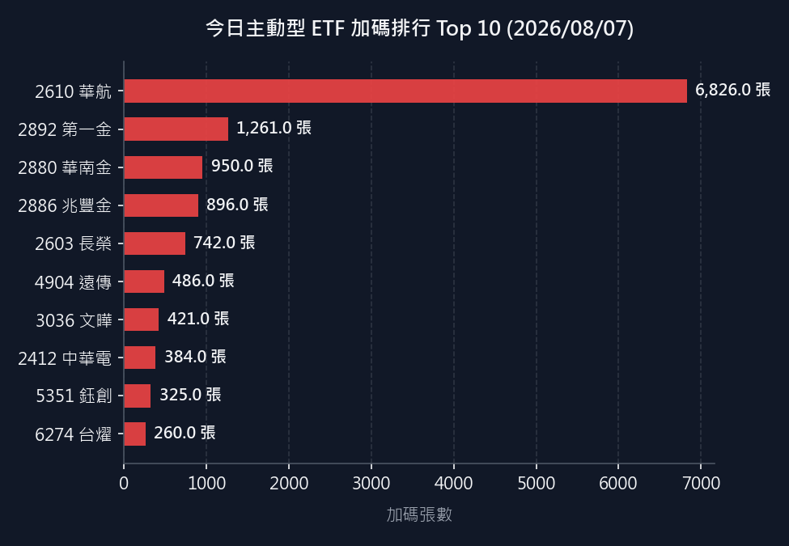
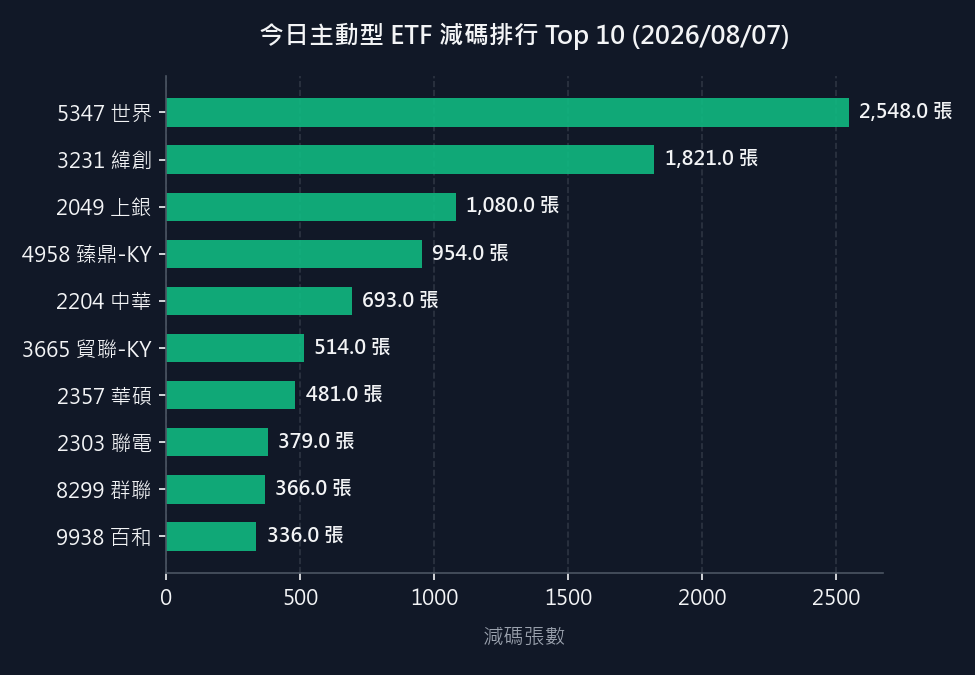

# 主動型 ETF 持股變動

資料來源：`主動型ETF持股明細.xlsx` 最近兩個日期分頁。

比較區間：`20260806` → `20260807`

## 今日加減碼視覺化排行

| 今日加碼 Top 10 | 今日減碼 Top 10 |
| :---: | :---: |
|  |  |

| ETF | 新增 | 刪除 | 比例變動 |
| :-- | --: | --: | --: |
| 00400A | 0 | 3 | 38 |
| 00401A | 0 | 0 | 53 |
| 00402A | 0 | 0 | 42 |
| 00403A | 0 | 0 | 38 |
| 00404A | 1 | 0 | 44 |
| 00405A | 0 | 0 | 35 |
| 00407A | 0 | 0 | 42 |
| 00408A | 0 | 1 | 37 |
| 00980A | 0 | 0 | 47 |
| 00980D | 1 | 0 | 29 |
| 00981A | 0 | 1 | 27 |
| 00982A | 0 | 0 | 0 |
| 00983A | 0 | 0 | 37 |
| 00983D | 0 | 0 | 19 |
| 00984A | 0 | 4 | 86 |
| 00985A | 2 | 2 | 35 |
| 00986A | 0 | 0 | 33 |
| 00987A | 0 | 0 | 26 |
| 00988A | 0 | 1 | 42 |
| 00989A | 0 | 1 | 52 |
| 00990A | 2 | 4 | 43 |
| 00991A | 0 | 0 | 20 |
| 00992A | 0 | 1 | 29 |
| 00993A | 0 | 0 | 41 |
| 00994A | 0 | 0 | 23 |
| 00995A | 0 | 1 | 42 |
| 00996A | 0 | 0 | 0 |
| 00997A | 0 | 0 | 41 |
| 00998A | 0 | 0 | 30 |
| 00999A | 0 | 1 | 58 |

## 00400A

### 新增持股

- 無

### 刪除持股

- 2357 華碩（1.33%，481 張）
- 3231 緯創（0.90%，1401 張）
- 6510 精測（0.31%，32 張）

### 投資比例變動

- 1303 南亞：0.37% → 0.40%（+0.03）
- 2059 川湖：3.86% → 4.30%（+0.44）
- 2308 台達電：2.53% → 2.52%（-0.01）
- 2313 華通：0.82% → 0.79%（-0.03）
- 2330 台積電：8.19% → 8.33%（+0.14）
- 2345 智邦：1.85% → 1.72%（-0.13）
- 2360 致茂：3.61% → 3.76%（+0.15）
- 2383 台光電：5.22% → 5.23%（+0.01）
- 2408 南亞科：1.74% → 1.75%（+0.01）
- 2449 京元電子：1.38% → 1.36%（-0.02）
- 2454 聯發科：6.22% → 6.28%（+0.06）
- 2881 富邦金：0.72% → 0.74%（+0.02）
- 2885 元大金：1.37% → 1.40%（+0.03）
- 2891 中信金：0.85% → 0.87%（+0.02）
- 3008 大立光：2.41% → 2.31%（-0.10）
- 3017 奇鋐：4.84% → 4.65%（-0.19）
- 3036 文曄：1.49% → 1.67%（+0.18）
- 3037 欣興：4.86% → 4.84%（-0.02）
- 3044 健鼎：1.39% → 1.40%（+0.01）
- 3211 順達：0.66% → 0.64%（-0.02）
- 3293 鈊象：0.35% → 0.36%（+0.01）
- 3374 精材：0.29% → 0.28%（-0.01）
- 3443 創意：2.88% → 2.96%（+0.08）
- 3529 力旺：1.10% → 1.14%（+0.04）
- 3665 貿聯-KY：2.83% → 2.67%（-0.16）
- 5274 信驊：2.97% → 2.94%（-0.03）
- 5347 世界：0.69% → 0.66%（-0.03）
- 6187 萬潤：2.37% → 2.31%（-0.06）
- 6223 旺矽：5.07% → 4.98%（-0.09）
- 6239 力成：0.94% → 0.93%（-0.01）
- 6274 台燿：1.08% → 1.03%（-0.05）
- 6442 光聖：0.54% → 0.51%（-0.03）
- 6488 環球晶：2.68% → 2.72%（+0.04）
- 6505 台塑化：0.68% → 0.73%（+0.05）
- 6515 穎崴：0.48% → 0.49%（+0.01）
- 6669 緯穎：4.30% → 3.89%（-0.41）
- 6715 嘉基：0.17% → 0.16%（-0.01）
- 8046 南電：0.97% → 0.96%（-0.01）

## 00401A

### 新增持股

- 無

### 刪除持股

- 無

### 投資比例變動

- 1216 統一：0.31% → 0.33%（+0.02）
- 1301 台塑：0.07% → 0.08%（+0.01）
- 2303 聯電：0.94% → 0.91%（-0.03）
- 2308 台達電：3.33% → 3.31%（-0.02）
- 2313 華通：1.53% → 1.47%（-0.06）
- 2317 鴻海：0.72% → 0.71%（-0.01）
- 2327 國巨*：0.45% → 0.43%（-0.02）
- 2330 台積電：13.90% → 14.10%（+0.20）
- 2344 華邦電：1.21% → 1.17%（-0.04）
- 2345 智邦：2.71% → 2.52%（-0.19）
- 2357 華碩：1.32% → 1.34%（+0.02）
- 2360 致茂：1.83% → 1.90%（+0.07）
- 2368 金像電：0.29% → 0.30%（+0.01）
- 2379 瑞昱：1.25% → 1.28%（+0.03）
- 2382 廣達：1.84% → 1.83%（-0.01）
- 2412 中華電：0.91% → 0.92%（+0.01）
- 2454 聯發科：6.55% → 6.59%（+0.04）
- 2455 全新：1.38% → 1.36%（-0.02）
- 2603 長榮：1.04% → 1.07%（+0.03）
- 2881 富邦金：1.97% → 2.01%（+0.04）
- 2882 國泰金：1.08% → 1.11%（+0.03）
- 2883 凱基金：1.57% → 1.61%（+0.04）
- 2884 玉山金：1.92% → 1.95%（+0.03）
- 2885 元大金：0.56% → 0.57%（+0.01）
- 2886 兆豐金：1.59% → 1.63%（+0.04）
- 2887 台新新光金：1.05% → 1.08%（+0.03）
- 2891 中信金：1.70% → 1.75%（+0.05）
- 3008 大立光：2.14% → 2.05%（-0.09）
- 3037 欣興：2.38% → 2.36%（-0.02）
- 3131 弘塑：0.37% → 0.38%（+0.01）
- 3167 大量：0.54% → 0.53%（-0.01）
- 3231 緯創：0.41% → 0.40%（-0.01）
- 3491 昇達科：1.87% → 1.73%（-0.14）
- 3529 力旺：0.70% → 0.73%（+0.03）
- 3711 日月光投控：2.14% → 2.13%（-0.01）
- 4904 遠傳：0.86% → 0.87%（+0.01）
- 4958 臻鼎-KY：2.05% → 2.04%（-0.01）
- 4991 環宇-KY：0.64% → 0.68%（+0.04）
- 5274 信驊：1.18% → 1.16%（-0.02）
- 5347 世界：1.39% → 1.33%（-0.06）
- 5904 寶雅*：0.64% → 0.65%（+0.01）
- 6187 萬潤：0.75% → 0.73%（-0.02）
- 6223 旺矽：2.30% → 2.26%（-0.04）
- 6285 啟碁：1.66% → 1.58%（-0.08）
- 6510 精測：0.73% → 0.70%（-0.03）
- 6515 穎崴：1.23% → 1.25%（+0.02）
- 6531 愛普*：1.28% → 1.37%（+0.09）
- 6669 緯穎：2.22% → 2.18%（-0.04）
- 6944 兆聯實業：0.52% → 0.51%（-0.01）
- 7769 鴻勁：2.57% → 2.53%（-0.04）
- 7828 創新服務：1.97% → 1.94%（-0.03）
- 8021 尖點：0.29% → 0.28%（-0.01）
- 8464 億豐：1.24% → 1.25%（+0.01）

## 00402A

### 新增持股

- 無

### 刪除持股

- 無

### 投資比例變動

- AAPL.US Apple：7.57% → 7.67%（+0.10）
- ADI.US Analog Devices：1.82% → 1.84%（+0.02）
- AMD.US AMD：5.35% → 5.48%（+0.13）
- AMZN.US Amazon：4.43% → 4.46%（+0.03）
- ANET.US Arista Networks：0.83% → 0.81%（-0.02）
- ARM.US Arm：1.05% → 1.11%（+0.06）
- ASML.US ASML Holding：1.59% → 1.63%（+0.04）
- AVGO.US Broadcom：2.66% → 2.70%（+0.04）
- AXON.US Axon Enterprise：1.10% → 0.95%（-0.15）
- BKNG.US Booking Holdings：0.70% → 0.71%（+0.01）
- CDNS.US Cadence Design Systems：1.80% → 1.82%（+0.02）
- CLS.US Celestica：1.00% → 0.87%（-0.13）
- COHR.US Coherent：2.13% → 2.19%（+0.06）
- DASH.US DoorDash：0.28% → 0.29%（+0.01）
- FSLY.US Fastly：0.39% → 0.34%（-0.05）
- GOOG.US Alphabet - Class C Capital Stock：3.53% → 3.52%（-0.01）
- GOOGL.US Alphabet - Class A Common Stock：3.48% → 3.47%（-0.01）
- INTC.US Intel：1.31% → 1.30%（-0.01）
- KLAC.US KLA：2.13% → 2.16%（+0.03）
- LITE.US Lumentum：1.64% → 1.68%（+0.04）
- LRCX.US Lam Research：3.55% → 3.56%（+0.01）
- MCHP.US Microchip Technology：1.17% → 1.12%（-0.05）
- MDB.US MongoDB：0.73% → 0.72%（-0.01）
- META.US Meta：2.79% → 2.82%（+0.03）
- MRVL.US Marvell：1.50% → 1.51%（+0.01）
- MSFT.US Microsoft：4.20% → 4.35%（+0.15）
- MU.US Micron：6.37% → 6.34%（-0.03）
- NVDA.US NVIDIA：8.90% → 8.96%（+0.06）
- NXPI.US NXP Semiconductors：1.09% → 1.10%（+0.01）
- PLTR.US Palantir Technologies：1.37% → 1.36%（-0.01）
- SHOP.US Shopify：0.49% → 0.50%（+0.01）
- SIMO.US Silicon Motion：0.73% → 0.80%（+0.07）
- SKHY.US SK hynix：0.95% → 0.91%（-0.04）
- SNOW.US Snowflake：0.94% → 0.96%（+0.02）
- SPCX.US SpaceX：0.55% → 0.59%（+0.04）
- STX.US Seagate：1.44% → 1.48%（+0.04）
- TER.US Teradyne：0.90% → 0.89%（-0.01）
- TSM.US TSMC(ADR)：1.40% → 1.43%（+0.03）
- TXN.US Texas Instruments：2.23% → 2.26%（+0.03）
- UBER.US Uber：0.44% → 0.46%（+0.02）
- V.US Visa：1.10% → 1.11%（+0.01）
- WDC.US Western Digital：2.86% → 2.51%（-0.35）

## 00403A

### 新增持股

- 無

### 刪除持股

- 無

### 投資比例變動

- 1303 南亞：0.10% → 0.11%（+0.01）
- 1560 中砂：0.58% → 0.57%（-0.01）
- 1717 長興：0.05% → 0.06%（+0.01）
- 2049 上銀：0.20% → 0.22%（+0.02）
- 2303 聯電：5.34% → 5.23%（-0.11）
- 2308 台達電：2.84% → 2.86%（+0.02）
- 2327 國巨*：2.54% → 2.46%（-0.08）
- 2330 台積電：16.69% → 17.14%（+0.45）
- 2337 旺宏：0.54% → 0.52%（-0.02）
- 2344 華邦電：4.03% → 3.94%（-0.09）
- 2345 智邦：3.09% → 2.91%（-0.18）
- 2360 致茂：0.99% → 1.04%（+0.05）
- 2383 台光電：4.41% → 4.47%（+0.06）
- 2454 聯發科：4.36% → 4.45%（+0.09）
- 2481 強茂：0.09% → 0.08%（-0.01）
- 3008 大立光：0.67% → 0.65%（-0.02）
- 3017 奇鋐：5.65% → 5.48%（-0.17）
- 3037 欣興：4.58% → 4.61%（+0.03）
- 3189 景碩：2.02% → 1.99%（-0.03）
- 3211 順達：0.40% → 0.39%（-0.01）
- 3443 創意：1.27% → 1.32%（+0.05）
- 3450 聯鈞：0.33% → 0.38%（+0.05）
- 3533 嘉澤：1.36% → 1.35%（-0.01）
- 3583 辛耘：0.37% → 0.36%（-0.01）
- 3653 健策：2.55% → 2.57%（+0.02）
- 3665 貿聯-KY：1.58% → 1.51%（-0.07）
- 3711 日月光投控：2.48% → 2.50%（+0.02）
- 4958 臻鼎-KY：1.65% → 1.40%（-0.25）
- 4966 譜瑞-KY：0.20% → 0.17%（-0.03）
- 6223 旺矽：3.68% → 3.65%（-0.03）
- 6274 台燿：1.43% → 1.38%（-0.05）
- 6415 矽力*-KY：0.07% → 0.08%（+0.01）
- 6442 光聖：0.18% → 0.17%（-0.01）
- 6488 環球晶：1.28% → 1.32%（+0.04）
- 6805 富世達：0.69% → 0.67%（-0.02）
- 7769 鴻勁：0.94% → 0.72%（-0.22）
- 8358 金居：0.28% → 0.26%（-0.02）
- 8996 高力：1.01% → 0.95%（-0.06）

## 00404A

### 新增持股

- 5289 宜鼎（0.30%，7 張）

### 刪除持股

- 無

### 投資比例變動

- 1210 大成：1.49% → 1.74%（+0.25）
- 1303 南亞：0.16% → 0.17%（+0.01）
- 2059 川湖：0.29% → 0.32%（+0.03）
- 2301 光寶科：1.74% → 1.72%（-0.02）
- 2303 聯電：2.94% → 2.82%（-0.12）
- 2308 台達電：0.96% → 0.95%（-0.01）
- 2327 國巨*：0.72% → 0.68%（-0.04）
- 2330 台積電：21.88% → 22.05%（+0.17）
- 2345 智邦：0.48% → 0.45%（-0.03）
- 2360 致茂：1.24% → 1.28%（+0.04）
- 2377 微星：1.82% → 1.81%（-0.01）
- 2383 台光電：2.58% → 2.56%（-0.02）
- 2428 興勤：0.81% → 0.79%（-0.02）
- 2441 超豐：0.46% → 0.44%（-0.02）
- 2458 義隆：0.41% → 0.39%（-0.02）
- 2880 華南金：2.68% → 2.72%（+0.04）
- 2885 元大金：1.34% → 1.36%（+0.02）
- 2886 兆豐金：3.06% → 3.11%（+0.05）
- 2892 第一金：3.08% → 3.10%（+0.02）
- 3017 奇鋐：1.09% → 1.04%（-0.05）
- 3022 威強電：0.98% → 1.01%（+0.03）
- 3023 信邦：2.26% → 2.24%（-0.02）
- 3034 聯詠：0.57% → 0.58%（+0.01）
- 3037 欣興：1.28% → 1.26%（-0.02）
- 3264 欣銓：1.87% → 1.84%（-0.03）
- 3443 創意：1.15% → 1.17%（+0.02）
- 3529 力旺：0.15% → 0.16%（+0.01）
- 3702 大聯大：1.88% → 1.84%（-0.04）
- 3711 日月光投控：3.50% → 3.46%（-0.04）
- 4763 材料*-KY：1.82% → 1.84%（+0.02）
- 5274 信驊：2.31% → 2.27%（-0.04）
- 5434 崇越：1.57% → 1.55%（-0.02）
- 6138 茂達：0.38% → 0.36%（-0.02）
- 6139 亞翔：0.26% → 0.25%（-0.01）
- 6196 帆宣：1.77% → 1.73%（-0.04）
- 6223 旺矽：1.17% → 1.14%（-0.03）
- 6257 矽格：0.39% → 0.38%（-0.01）
- 6488 環球晶：0.12% → 0.13%（+0.01）
- 6491 晶碩：1.77% → 1.76%（-0.01）
- 6691 洋基工程：2.76% → 2.83%（+0.07）
- 8016 矽創：1.22% → 1.24%（+0.02）
- 8271 宇瞻：0.83% → 0.79%（-0.04）
- 臺指選擇權08/26 45400 買權：-0.32% → -0.29%（+0.03）
- 臺股期貨08/26：16.18% → 16.28%（+0.10）

## 00405A

### 新增持股

- 無

### 刪除持股

- 無

### 投資比例變動

- 2059 川湖：1.38% → 1.56%（+0.18）
- 2308 台達電：1.60% → 1.62%（+0.02）
- 2330 台積電：1.37% → 1.42%（+0.05）
- 2344 華邦電：3.27% → 3.22%（-0.05）
- 2345 智邦：4.14% → 3.92%（-0.22）
- 2368 金像電：3.61% → 3.70%（+0.09）
- 2383 台光電：3.65% → 3.71%（+0.06）
- 2408 南亞科：1.27% → 1.30%（+0.03）
- 2454 聯發科：6.11% → 6.25%（+0.14）
- 3008 大立光：1.52% → 1.48%（-0.04）
- 3017 奇鋐：7.67% → 7.47%（-0.20）
- 3026 禾伸堂：1.12% → 1.04%（-0.08）
- 3037 欣興：4.96% → 5.01%（+0.05）
- 3131 弘塑：1.72% → 1.77%（+0.05）
- 3443 創意：4.86% → 5.07%（+0.21）
- 3583 辛耘：0.66% → 0.63%（-0.03）
- 3653 健策：6.17% → 6.25%（+0.08）
- 3665 貿聯-KY：6.66% → 6.36%（-0.30）
- 3711 日月光投控：0.62% → 0.63%（+0.01）
- 4749 新應材：0.25% → 0.26%（+0.01）
- 5274 信驊：1.97% → 1.98%（+0.01）
- 6187 萬潤：0.76% → 0.75%（-0.01）
- 6223 旺矽：5.59% → 5.56%（-0.03）
- 6274 台燿：1.52% → 1.47%（-0.05）
- 6442 光聖：0.32% → 0.31%（-0.01）
- 6488 環球晶：0.31% → 0.32%（+0.01）
- 6510 精測：2.26% → 2.21%（-0.05）
- 6515 穎崴：0.51% → 0.52%（+0.01）
- 6805 富世達：0.58% → 0.56%（-0.02）
- 7734 印能科技：2.08% → 2.13%（+0.05）
- 7769 鴻勁：2.52% → 2.53%（+0.01）
- 8028 昇陽半導體：0.79% → 0.75%（-0.04）
- 8046 南電：3.73% → 3.75%（+0.02）
- 8210 勤誠：0.67% → 0.63%（-0.04）
- 8996 高力：1.04% → 0.98%（-0.06）

## 00407A

### 新增持股

- 無

### 刪除持股

- 無

### 投資比例變動

- 1303 南亞：0.50% → 0.54%（+0.04）
- 1590 亞德客-KY：2.24% → 2.27%（+0.03）
- 2059 川湖：2.41% → 2.71%（+0.30）
- 2303 聯電：2.06% → 2.01%（-0.05）
- 2308 台達電：3.26% → 3.28%（+0.02）
- 2327 國巨*：2.08% → 2.01%（-0.07）
- 2330 台積電：7.98% → 8.18%（+0.20）
- 2344 華邦電：1.66% → 1.63%（-0.03）
- 2345 智邦：3.37% → 3.17%（-0.20）
- 2360 致茂：1.80% → 1.89%（+0.09）
- 2368 金像電：1.80% → 1.84%（+0.04）
- 2376 技嘉：0.67% → 0.69%（+0.02）
- 2379 瑞昱：0.71% → 0.74%（+0.03）
- 2383 台光電：4.86% → 4.91%（+0.05）
- 2395 研華：1.72% → 1.79%（+0.07）
- 2408 南亞科：1.68% → 1.71%（+0.03）
- 2412 中華電：1.53% → 1.57%（+0.04）
- 2451 創見：0.16% → 0.17%（+0.01）
- 2454 聯發科：6.35% → 6.47%（+0.12）
- 3017 奇鋐：4.24% → 4.11%（-0.13）
- 3034 聯詠：0.67% → 0.68%（+0.01）
- 3037 欣興：4.34% → 4.36%（+0.02）
- 3260 威剛：0.16% → 0.17%（+0.01）
- 3293 鈊象：0.55% → 0.57%（+0.02）
- 3443 創意：1.78% → 1.85%（+0.07）
- 3491 昇達科：0.42% → 0.40%（-0.02）
- 3529 力旺：1.95% → 2.04%（+0.09）
- 3665 貿聯-KY：3.02% → 2.87%（-0.15）
- 3711 日月光投控：2.31% → 2.32%（+0.01）
- 4904 遠傳：0.28% → 0.29%（+0.01）
- 5289 宜鼎：0.18% → 0.17%（-0.01）
- 5536 聖暉*：1.54% → 1.56%（+0.02）
- 6223 旺矽：2.72% → 2.70%（-0.02）
- 6274 台燿：3.35% → 3.23%（-0.12）
- 6415 矽力*-KY：0.33% → 0.34%（+0.01）
- 6446 藥華藥：2.36% → 2.32%（-0.04）
- 6515 穎崴：1.36% → 1.39%（+0.03）
- 6531 愛普*：1.45% → 1.56%（+0.11）
- 6669 緯穎：4.37% → 4.36%（-0.01）
- 6805 富世達：2.04% → 1.98%（-0.06）
- 8210 勤誠：1.75% → 1.62%（-0.13）
- 8996 高力：0.41% → 0.39%（-0.02）

## 00408A

### 新增持股

- 無

### 刪除持股

- 5347 世界（0.45%，50 張）

### 投資比例變動

- 2059 川湖：1.81% → 2.02%（+0.21）
- 2303 聯電：0.94% → 0.91%（-0.03）
- 2308 台達電：3.41% → 3.39%（-0.02）
- 2317 鴻海：2.76% → 2.75%（-0.01）
- 2330 台積電：6.46% → 6.59%（+0.13）
- 2344 華邦電：1.43% → 1.38%（-0.05）
- 2345 智邦：3.88% → 1.61%（-2.27）
- 2356 英業達：1.29% → 1.28%（-0.01）
- 2357 華碩：2.10% → 2.12%（+0.02）
- 2360 致茂：2.71% → 2.82%（+0.11）
- 2368 金像電：2.23% → 2.26%（+0.03）
- 2376 技嘉：2.15% → 2.18%（+0.03）
- 2383 台光電：4.43% → 4.44%（+0.01）
- 2395 研華：2.04% → 2.11%（+0.07）
- 2408 南亞科：1.09% → 1.11%（+0.02）
- 2454 聯發科：4.44% → 4.48%（+0.04）
- 2801 彰銀：0.85% → 0.86%（+0.01）
- 2880 華南金：1.71% → 1.75%（+0.04）
- 2886 兆豐金：2.61% → 2.68%（+0.07）
- 2891 中信金：0.92% → 0.95%（+0.03）
- 3017 奇鋐：3.86% → 3.71%（-0.15）
- 3036 文曄：0.88% → 0.81%（-0.07）
- 3037 欣興：3.60% → 3.58%（-0.02）
- 3045 台灣大：3.23% → 3.31%（+0.08）
- 3231 緯創：3.50% → 1.00%（-2.50）
- 3653 健策：1.33% → 1.32%（-0.01）
- 3665 貿聯-KY：2.83% → 2.66%（-0.17）
- 3702 大聯大：1.95% → 1.93%（-0.02）
- 5434 崇越：1.76% → 1.75%（-0.01）
- 5876 上海商銀：1.45% → 1.47%（+0.02）
- 5904 寶雅*：1.76% → 1.79%（+0.03）
- 6223 旺矽：1.31% → 1.29%（-0.02）
- 6239 力成：1.08% → 1.06%（-0.02）
- 6274 台燿：1.73% → 1.65%（-0.08）
- 6669 緯穎：4.48% → 4.43%（-0.05）
- 7769 鴻勁：1.74% → 1.72%（-0.02）
- 8046 南電：2.37% → 2.35%（-0.02）

## 00980A

### 新增持股

- 無

### 刪除持股

- 無

### 投資比例變動

- 1303 南亞：2.24% → 2.38%（+0.14）
- 2059 川湖：4.78% → 5.30%（+0.52）
- 2308 台達電：3.53% → 3.49%（-0.04）
- 2317 鴻海：2.16% → 2.14%（-0.02）
- 2327 國巨*：1.02% → 0.98%（-0.04）
- 2330 台積電：8.15% → 8.23%（+0.08）
- 2344 華邦電：1.02% → 0.99%（-0.03）
- 2345 智邦：1.84% → 1.71%（-0.13）
- 2360 致茂：1.52% → 1.57%（+0.05）
- 2368 金像電：2.01% → 2.02%（+0.01）
- 2376 技嘉：1.24% → 1.25%（+0.01）
- 2382 廣達：1.55% → 1.54%（-0.01）
- 2383 台光電：4.19% → 4.17%（-0.02）
- 2408 南亞科：2.48% → 2.49%（+0.01）
- 2454 聯發科：5.68% → 5.70%（+0.02）
- 2884 玉山金：0.86% → 0.87%（+0.01）
- 2891 中信金：1.25% → 1.28%（+0.03）
- 3008 大立光：0.87% → 0.83%（-0.04）
- 3017 奇鋐：2.05% → 1.95%（-0.10）
- 3026 禾伸堂：0.41% → 0.38%（-0.03）
- 3036 文曄：1.39% → 1.27%（-0.12）
- 3037 欣興：2.85% → 2.82%（-0.03）
- 3081 聯亞：2.93% → 2.87%（-0.06）
- 3189 景碩：0.82% → 0.80%（-0.02）
- 3231 緯創：1.03% → 1.00%（-0.03）
- 3293 鈊象：1.03% → 1.05%（+0.02）
- 3443 創意：1.37% → 1.40%（+0.03）
- 3529 力旺：0.90% → 0.93%（+0.03）
- 3653 健策：1.60% → 1.58%（-0.02）
- 3665 貿聯-KY：0.40% → 0.37%（-0.03）
- 3711 日月光投控：1.24% → 1.23%（-0.01）
- 4958 臻鼎-KY：0.84% → 0.83%（-0.01）
- 5274 信驊：1.59% → 1.57%（-0.02）
- 5904 寶雅*：1.17% → 1.18%（+0.01）
- 6213 聯茂：0.94% → 0.98%（+0.04）
- 6223 旺矽：2.49% → 2.43%（-0.06）
- 6274 台燿：1.49% → 1.41%（-0.08）
- 6442 光聖：0.28% → 0.26%（-0.02）
- 6515 穎崴：1.94% → 1.95%（+0.01）
- 6669 緯穎：1.69% → 1.66%（-0.03）
- 6805 富世達：0.49% → 0.47%（-0.02）
- 6831 邁科：0.62% → 0.61%（-0.01）
- 7769 鴻勁：2.46% → 2.42%（-0.04）
- 8046 南電：1.17% → 1.15%（-0.02）
- 8210 勤誠：0.89% → 0.81%（-0.08）
- 8299 群聯：2.29% → 2.31%（+0.02）
- 8996 高力：1.07% → 0.99%（-0.08）

## 00980D

### 新增持股

- US ULTRA BOND CBT SEP26 21-SEP-2026（0.35%，N/A 張）

### 刪除持股

- 無

### 投資比例變動

- ALLY FINANCIAL INC (REG) 8% 01/11/2031：0.58% → 0.57%（-0.01）
- APA CORP 6.750000 % 15-FEB-2055：0.35% → 0.36%（+0.01）
- CHARTER COMM OPT LLC/CAP (REG) 5.5% 01APR2063：0.49% → 0.48%（-0.01）
- CHARTER COMM OPT LLC/CAP (REG) 6.834000 % 23OCT2055：0.45% → 0.44%（-0.01）
- CONCENTRIX CORP (REG) 6.6% 02AUG2028：0.50% → 0.51%（+0.01）
- CONCENTRIX CORP (REG) 6.85% 02AUG2033：0.68% → 0.69%（+0.01）
- CONOCOPHILLIPS COMPANY (REG) 6.95% 15APR2029：0.50% → 0.51%（+0.01）
- DOW CHEMICAL CO/THE 6.9% 15MAY2053：0.60% → 0.59%（-0.01）
- ENEL FINANCE INTL NV SER REGS (REG S) 7.75% 14OCT2052：0.37% → 0.36%（-0.01）
- F&G ANNUITIES & LIFE INC 6.250000 % 04OCT2034：0.51% → 0.50%（-0.01）
- HERTZ CORP/THE SER REGS (REG S) 12.625% 15JUL2029：0.28% → 0.30%（+0.02）
- JETBLUE AIRWAYS/LOYALTY SER REGS (REG S) 9.875% 20SEP2031：0.51% → 0.50%（-0.01）
- LBM ACQUISITION LLC SER REGS 9.500000 % 15JUN2031：0.49% → 0.48%（-0.01）
- META PLATFORMS INC 5.750000 % 15-NOV-2065：0.43% → 0.42%（-0.01）
- MOBIUS MERGER SUB SER REGS 9.000000 % 01JUN2030：0.23% → 0.24%（+0.01）
- ORACLE CORP (REG) 5.500000 % 27SEP2064：0.55% → 0.54%（-0.01）
- ORACLE CORP 5.55% 06FEB2053：0.25% → 0.24%（-0.01）
- ORACLE CORP 6.000000 % 03AUG2055：0.31% → 0.30%（-0.01）
- ORACLE CORP 6.9% 09NOV2052：0.52% → 0.51%（-0.01）
- SALESFORCE INC (REG) 6.55% 15MAR2056：0.53% → 0.52%（-0.01）
- SALESFORCE INC (REG) 6.7% 15MAR2066：0.52% → 0.51%（-0.01）
- SES GLOBAL AMERICAS HLDG SER REGS (REG) 5.300000 % 25MAR2044：0.34% → 0.33%（-0.01）
- TIME WARNER CABLE LLC (REG) 6.75% 15JUN2039：0.31% → 0.30%（-0.01）
- US 10YR NOTE (CBT)SEP26 21-SEP-2026：18.26% → 18.24%（-0.02）
- US 10YR ULTRA FUT SEP26 21-SEP-2026：-2.78% → -2.77%（+0.01）
- US LONG BOND(CBT) SEP26 21-SEP-2026：5.34% → 5.33%（-0.01）
- VAR ENERGI ASA SER REGS (REG S) 7.5% 15JAN2028：0.32% → 0.33%（+0.01）
- VIACOMCBS INC 6.875% 30APR2036：0.28% → 0.29%（+0.01）
- WESTLAKE CORP 6.375000 % 15-NOV-2055：0.52% → 0.51%（-0.01）

## 00981A

### 新增持股

- 無

### 刪除持股

- 2049 上銀（0.13%，1080 張）

### 投資比例變動

- 2303 聯電：3.45% → 3.41%（-0.04）
- 2308 台達電：3.53% → 3.70%（+0.17）
- 2327 國巨*：4.69% → 4.60%（-0.09）
- 2330 台積電：9.28% → 9.63%（+0.35）
- 2345 智邦：5.00% → 4.76%（-0.24）
- 2360 致茂：0.30% → 0.39%（+0.09）
- 2368 金像電：1.59% → 1.64%（+0.05）
- 2383 台光電：8.34% → 8.53%（+0.19）
- 2449 京元電子：0.91% → 0.92%（+0.01）
- 2454 聯發科：6.90% → 7.11%（+0.21）
- 3017 奇鋐：5.51% → 5.41%（-0.10）
- 3037 欣興：6.36% → 6.46%（+0.10）
- 3653 健策：3.42% → 3.48%（+0.06）
- 3665 貿聯-KY：3.93% → 3.40%（-0.53）
- 3711 日月光投控：3.35% → 3.42%（+0.07）
- 4958 臻鼎-KY：0.26% → 0.27%（+0.01）
- 4979 華星光：0.30% → 0.31%（+0.01）
- 5274 信驊：2.46% → 2.49%（+0.03）
- 6187 萬潤：0.51% → 0.50%（-0.01）
- 6223 旺矽：4.98% → 4.99%（+0.01）
- 6274 台燿：2.72% → 2.65%（-0.07）
- 6669 緯穎：5.49% → 5.53%（+0.04）
- 6805 富世達：1.17% → 1.15%（-0.02）
- 8046 南電：3.40% → 3.44%（+0.04）
- 8210 勤誠：1.00% → 0.93%（-0.07）
- 8996 高力：0.26% → 0.25%（-0.01）
- 台指期貨(B)：5.55% → 5.75%（+0.20）

## 00982A

### 新增持股

- 無

### 刪除持股

- 無

### 投資比例變動

- 無

## 00983A

### 新增持股

- 無

### 刪除持股

- 無

### 投資比例變動

- ACHR.US Archer：0.32% → 0.33%（+0.01）
- AMD.US AMD：5.87% → 5.43%（-0.44）
- AMZN.US Amazon：3.62% → 3.64%（+0.02）
- AVGO.US Broadcom：2.08% → 2.11%（+0.03）
- BEAM.US Beam Therapeutics：2.41% → 2.45%（+0.04）
- BLSH.US Bullish：1.03% → 1.00%（-0.03）
- BMNR.US BitMine：1.00% → 1.18%（+0.18）
- CERS.US Cerus：0.40% → 0.41%（+0.01）
- COIN.US Coinbase：2.07% → 2.02%（-0.05）
- CRCL.US Circle：2.02% → 2.04%（+0.02）
- CRSP.US CRISPR Therapeutics：4.23% → 4.20%（-0.03）
- CRWV.US CoreWeave：0.95% → 0.91%（-0.04）
- DE.US Deere：1.43% → 1.45%（+0.02）
- FIG.US Figma：0.50% → 0.43%（-0.07）
- GOOGL.US Alphabet - Class A Common Stock：1.78% → 1.77%（-0.01）
- HOOD.US Robinhood Markets：3.80% → 3.75%（-0.05）
- ILMN.US Illumina：3.90% → 3.81%（-0.09）
- KTOS.US Kratos Defense & Security：0.34% → 0.63%（+0.29）
- LLY.US Eli Lilly：1.96% → 2.02%（+0.06）
- META.US Meta：1.17% → 1.18%（+0.01）
- NTLA.US Intellia Therapeutics：1.26% → 1.30%（+0.04）
- NTRA.US Natera：2.19% → 2.14%（-0.05）
- NVDA.US NVIDIA：1.69% → 1.70%（+0.01）
- PLTR.US Palantir Technologies：1.82% → 1.80%（-0.02）
- RXRX.US Recursion Pharmaceuticals：0.30% → 0.31%（+0.01）
- SHOP.US Shopify：7.39% → 7.21%（-0.18）
- SNOW.US Snowflake：1.56% → 1.58%（+0.02）
- SPCX.US SpaceX：1.64% → 1.82%（+0.18）
- TEM.US Tempus：3.10% → 3.09%（-0.01）
- TSLA.US Tesla：7.85% → 7.84%（-0.01）
- TSM.US TSMC(ADR)：3.54% → 3.61%（+0.07）
- TWST.US Twist Bioscience：5.17% → 4.70%（-0.47）
- TXG.US 10x Genomics：4.30% → 4.17%（-0.13）
- VCYT.US Veracyte：1.08% → 1.09%（+0.01）
- WGS.US GeneDx：1.50% → 1.51%（+0.01）
- XE.US X-Energy：0.13% → 0.14%（+0.01）
- XYZ.US Block：2.44% → 2.31%（-0.13）

## 00983D

### 新增持股

- 無

### 刪除持股

- 無

### 投資比例變動

- ATH 6 5/8 05/19/55：1.02% → 1.01%（-0.01）
- BATSLN 7.081 08/02/53：1.34% → 1.33%（-0.01）
- CRWV 9 02/01/31：0.83% → 0.84%（+0.01）
- CYH 10 7/8 01/15/32：1.49% → 1.50%（+0.01）
- DOW 9.4 05/15/39：1.95% → 1.94%（-0.01）
- DTV 8 7/8 02/01/30：1.60% → 1.61%（+0.01）
- ED 6 3/4 04/01/38：0.63% → 0.62%（-0.01）
- GM 6 3/4 04/01/46：1.20% → 1.19%（-0.01）
- IEP 10 11/15/29：1.53% → 1.51%（-0.02）
- MPC 6 1/2 03/01/41：0.17% → 0.16%（-0.01）
- NVDA 5.55 06/15/46：1.18% → 1.17%（-0.01）
- ORCL 6.9 11/09/52：0.86% → 0.85%（-0.01）
- PCG 6.7 04/01/53：1.12% → 1.11%（-0.01）
- SABHLD 10 3/4 11/15/29：0.61% → 0.62%（+0.01）
- SPCX 6.6 07/15/46：1.12% → 1.13%（+0.01）
- TLTW.US iShares 20+ Year Treasury Bond B：7.23% → 7.22%（-0.01）
- TRPCN 7 5/8 01/15/39：1.71% → 1.70%（-0.01）
- UNITEDHEALTH GROUP INC 6.875 02/15/38：0.88% → 0.87%（-0.01）
- VENLNG 9 1/2 02/01/29：1.41% → 1.42%（+0.01）

## 00984A

### 新增持股

- 無

### 刪除持股

- 1229 聯華（0.00%，10.626 張）
- 2337 旺宏（0.24%，181 張）
- 8021 尖點（0.71%，166 張）
- 8358 金居（0.47%，120 張）

### 投資比例變動

- 1303 南亞：2.21% → 2.34%（+0.13）
- 1326 台化：1.05% → 1.07%（+0.02）
- 1560 中砂：0.67% → 0.65%（-0.02）
- 1714 和桐：0.28% → 0.27%（-0.01）
- 1736 喬山：0.75% → 0.73%（-0.02）
- 1795 美時：0.08% → 0.09%（+0.01）
- 1907 永豐餘：0.52% → 0.53%（+0.01）
- 2015 豐興：0.07% → 0.08%（+0.01）
- 2049 上銀：0.60% → 0.65%（+0.05）
- 2059 川湖：4.22% → 4.69%（+0.47）
- 2303 聯電：1.41% → 1.36%（-0.05）
- 2317 鴻海：1.47% → 1.46%（-0.01）
- 2330 台積電：3.62% → 3.66%（+0.04）
- 2345 智邦：0.81% → 0.75%（-0.06）
- 2357 華碩：0.84% → 0.85%（+0.01）
- 2360 致茂：0.85% → 0.88%（+0.03）
- 2371 大同：0.08% → 0.09%（+0.01）
- 2375 凱美：0.25% → 0.24%（-0.01）
- 2376 技嘉：0.53% → 0.54%（+0.01）
- 2383 台光電：1.73% → 1.72%（-0.01）
- 2404 漢唐：1.24% → 1.23%（-0.01）
- 2408 南亞科：1.83% → 1.84%（+0.01）
- 2412 中華電：0.88% → 0.89%（+0.01）
- 2441 超豐：1.05% → 1.19%（+0.14）
- 2464 盟立：0.74% → 0.72%（-0.02）
- 2472 立隆電：0.26% → 0.25%（-0.01）
- 2535 達欣工：0.23% → 0.22%（-0.01）
- 2603 長榮：0.72% → 0.74%（+0.02）
- 2606 裕民：0.08% → 0.09%（+0.01）
- 2801 彰銀：1.54% → 1.55%（+0.01）
- 2812 台中銀：1.26% → 1.29%（+0.03）
- 2834 臺企銀：1.37% → 1.38%（+0.01）
- 2880 華南金：2.07% → 2.10%（+0.03）
- 2882 國泰金：0.77% → 0.79%（+0.02）
- 2885 元大金：0.77% → 0.78%（+0.01）
- 2886 兆豐金：2.05% → 2.09%（+0.04）
- 2891 中信金：0.76% → 0.78%（+0.02）
- 2892 第一金：1.77% → 1.79%（+0.02）
- 3008 大立光：2.12% → 2.03%（-0.09）
- 3023 信邦：1.20% → 1.19%（-0.01）
- 3026 禾伸堂：0.79% → 0.72%（-0.07）
- 3034 聯詠：0.75% → 0.76%（+0.01）
- 3036 文曄：0.57% → 0.52%（-0.05）
- 3037 欣興：0.61% → 0.60%（-0.01）
- 3189 景碩：1.43% → 1.64%（+0.21）
- 3443 創意：0.18% → 0.19%（+0.01）
- 3450 聯鈞：0.67% → 0.65%（-0.02）
- 3533 嘉澤：1.45% → 1.41%（-0.04）
- 3702 大聯大：0.57% → 0.56%（-0.01）
- 3711 日月光投控：1.15% → 1.14%（-0.01）
- 4123 晟德：0.23% → 0.24%（+0.01）
- 4764 雙鍵：0.52% → 0.48%（-0.04）
- 4904 遠傳：0.49% → 0.50%（+0.01）
- 4958 臻鼎-KY：0.98% → 0.97%（-0.01）
- 5274 信驊：0.89% → 0.87%（-0.02）
- 5289 宜鼎：1.05% → 0.99%（-0.06）
- 5351 鈺創：0.45% → 0.80%（+0.35）
- 5483 中美晶：0.43% → 0.41%（-0.02）
- 5880 合庫金：1.64% → 1.66%（+0.02）
- 5904 寶雅*：0.29% → 0.30%（+0.01）
- 6005 群益證：1.20% → 1.18%（-0.02）
- 6023 元大期：0.03% → 0.04%（+0.01）
- 6121 新普：0.09% → 0.08%（-0.01）
- 6139 亞翔：2.68% → 2.96%（+0.28）
- 6182 合晶：0.51% → 0.48%（-0.03）
- 6196 帆宣：1.14% → 1.12%（-0.02）
- 6197 佳必琪：0.58% → 0.55%（-0.03）
- 6202 盛群：0.23% → 0.27%（+0.04）
- 6213 聯茂：1.46% → 1.53%（+0.07）
- 6223 旺矽：1.28% → 1.25%（-0.03）
- 6257 矽格：0.66% → 0.64%（-0.02）
- 6274 台燿：0.70% → 0.67%（-0.03）
- 6282 康舒：0.26% → 0.25%（-0.01）
- 6285 啟碁：0.57% → 0.54%（-0.03）
- 6446 藥華藥：2.41% → 2.34%（-0.07）
- 6469 大樹：0.23% → 0.24%（+0.01）
- 6531 愛普*：1.16% → 1.23%（+0.07）
- 6548 長科*：1.17% → 1.15%（-0.02）
- 6669 緯穎：0.64% → 0.63%（-0.01）
- 6944 兆聯實業：1.09% → 1.07%（-0.02）
- 7734 印能科技：0.48% → 0.49%（+0.01）
- 7769 鴻勁：1.25% → 1.24%（-0.01）
- 8039 台虹：0.59% → 0.65%（+0.06）
- 8046 南電：1.05% → 1.03%（-0.02）
- 8210 勤誠：0.28% → 0.25%（-0.03）
- 8271 宇瞻：0.57% → 0.55%（-0.02）

## 00985A

### 新增持股

- 2603 長榮（1.53%，742 張）
- 2610 華航（1.53%，6826 張）

### 刪除持股

- 3293 鈊象（0.10%，13 張）
- 3661 世芯-KY（0.29%，8 張）

### 投資比例變動

- 1216 統一：0.93% → 0.98%（+0.05）
- 2027 大成鋼：4.67% → 4.80%（+0.13）
- 2049 上銀：0.62% → 0.67%（+0.05）
- 2059 川湖：3.07% → 2.76%（-0.31）
- 2303 聯電：1.49% → 1.01%（-0.48）
- 2327 國巨*：1.87% → 0.99%（-0.88）
- 2330 台積電：13.64% → 13.87%（+0.23）
- 2344 華邦電：1.02% → 0.99%（-0.03）
- 2345 智邦：2.93% → 2.73%（-0.20）
- 2368 金像電：0.95% → 0.96%（+0.01）
- 2376 技嘉：3.95% → 3.48%（-0.47）
- 2395 研華：0.30% → 0.32%（+0.02）
- 2408 南亞科：2.01% → 2.03%（+0.02）
- 2412 中華電：2.96% → 3.54%（+0.58）
- 2454 聯發科：1.92% → 1.94%（+0.02）
- 2891 中信金：0.19% → 0.20%（+0.01）
- 3008 大立光：2.49% → 2.40%（-0.09）
- 3017 奇鋐：1.96% → 1.89%（-0.07）
- 3036 文曄：1.80% → 1.66%（-0.14）
- 3037 欣興：1.53% → 1.52%（-0.01）
- 3081 聯亞：1.93% → 1.90%（-0.03）
- 3105 穩懋：0.56% → 0.54%（-0.02）
- 3131 弘塑：1.15% → 1.16%（+0.01）
- 3529 力旺：0.26% → 0.27%（+0.01）
- 3665 貿聯-KY：1.00% → 0.94%（-0.06）
- 4904 遠傳：2.99% → 3.56%（+0.57）
- 6147 頎邦：1.51% → 1.49%（-0.02）
- 6187 萬潤：3.68% → 2.94%（-0.74）
- 6223 旺矽：0.31% → 0.30%（-0.01）
- 6442 光聖：3.54% → 1.95%（-1.59）
- 6446 藥華藥：2.43% → 2.37%（-0.06）
- 6669 緯穎：2.64% → 2.61%（-0.03）
- 7769 鴻勁：1.14% → 1.13%（-0.01）
- 8299 群聯：1.05% → 1.07%（+0.02）
- 8996 高力：1.25% → 1.17%（-0.08）

## 00986A

### 新增持股

- 無

### 刪除持股

- 無

### 投資比例變動

- 2330 台積電：8.60% → 8.52%（-0.08）
- 2454 聯發科：0.65% → 0.64%（-0.01）
- AAPL.US Apple：0.98% → 0.99%（+0.01）
- AMAT.US Applied Materials：1.68% → 1.67%（-0.01）
- AMD.US AMD：3.04% → 3.10%（+0.06）
- AMZN.US Amazon：4.01% → 4.03%（+0.02）
- AVGO.US Broadcom：5.27% → 5.33%（+0.06）
- CAT.US Caterpillar：1.37% → 1.36%（-0.01）
- COHR.US Coherent：2.24% → 2.30%（+0.06）
- CRDO.US Credo：0.12% → 0.13%（+0.01）
- CRWD.US CrowdStrike Holdings：4.14% → 4.11%（-0.03）
- DDOG.US Datadog：0.45% → 0.36%（-0.09）
- ETN.US Eaton：2.35% → 2.37%（+0.02）
- GEV.US GE Vernova：2.67% → 2.64%（-0.03）
- GOOGL.US Alphabet - Class A Common Stock：7.04% → 6.99%（-0.05）
- GS.US Goldman Sachs：3.06% → 3.00%（-0.06）
- LITE.US Lumentum：3.39% → 3.45%（+0.06）
- LLY.US Eli Lilly：2.77% → 2.83%（+0.06）
- MA.US Mastercard：0.90% → 0.91%（+0.01）
- MSFT.US Microsoft：2.56% → 2.64%（+0.08）
- MU.US Micron：3.75% → 3.72%（-0.03）
- MUFG(8306.JP)：1.42% → 1.44%（+0.02）
- Murata Mfg.(6981.JP)：1.83% → 1.74%（-0.09）
- NET.US Cloudflare：1.85% → 1.80%（-0.05）
- NVDA.US NVIDIA：5.99% → 6.02%（+0.03）
- SNDK.US Sandisk：1.42% → 1.33%（-0.09）
- SNOW.US Snowflake：1.83% → 1.85%（+0.02）
- Siemens Energy AG：2.01% → 2.06%（+0.05）
- TSEM.US Tower Semiconductor：0.67% → 0.71%（+0.04）
- Yaskawa Electric(6506.JP)：1.97% → 1.93%（-0.04）
- 嘉能可公司：1.62% → 1.61%（-0.01）
- 施奈德電機公司：1.64% → 1.65%（+0.01）
- 英飛凌科技股份有限公司：2.92% → 2.94%（+0.02）

## 00987A

### 新增持股

- 無

### 刪除持股

- 無

### 投資比例變動

- 2330 台積電：7.78% → 8.34%（+0.56）
- 2345 智邦：2.47% → 2.43%（-0.04）
- 2383 台光電：6.59% → 6.97%（+0.38）
- 2408 南亞科：4.02% → 4.29%（+0.27）
- 2454 聯發科：4.58% → 4.88%（+0.30）
- 2455 全新：2.79% → 2.92%（+0.13）
- 3017 奇鋐：9.24% → 6.32%（-2.92）
- 3037 欣興：6.75% → 7.10%（+0.35）
- 3081 聯亞：0.42% → 3.41%（+2.99）
- 3231 緯創：2.26% → 2.35%（+0.09）
- 3363 上詮：2.05% → 2.11%（+0.06）
- 3443 創意：6.22% → 6.76%（+0.54）
- 3653 健策：2.93% → 3.08%（+0.15）
- 3665 貿聯-KY：4.33% → 4.30%（-0.03）
- 4764 雙鍵：1.64% → 1.34%（-0.30）
- 5274 信驊：0.18% → 0.19%（+0.01）
- 6223 旺矽：6.21% → 6.44%（+0.23）
- 6274 台燿：4.19% → 4.22%（+0.03）
- 6515 穎崴：1.98% → 2.12%（+0.14）
- 6683 雍智科技：2.25% → 2.28%（+0.03）
- 6739 竹陞科技：2.04% → 1.97%（-0.07）
- 6805 富世達：3.15% → 3.20%（+0.05）
- 7769 鴻勁：2.37% → 2.47%（+0.10）
- 8028 昇陽半導體：2.19% → 2.17%（-0.02）
- 8046 南電：3.67% → 3.84%（+0.17）
- 8358 金居：1.60% → 1.57%（-0.03）

## 00988A

### 新增持股

- 無

### 刪除持股

- Tokyo Electron(8035.JP)（1.13%，55 張）

### 投資比例變動

- 2303 聯電：0.52% → 0.53%（+0.01）
- 2308 台達電：0.91% → 0.94%（+0.03）
- 2330 台積電：3.09% → 3.10%（+0.01）
- 2383 台光電：4.00% → 4.12%（+0.12）
- 2454 聯發科：3.05% → 3.04%（-0.01）
- 3017 奇鋐：0.54% → 1.10%（+0.56）
- 3037 欣興：4.32% → 4.41%（+0.09）
- 3665 貿聯-KY：2.10% → 2.15%（+0.05）
- 3711 日月光投控：1.83% → 1.87%（+0.04）
- 6223 旺矽：2.46% → 2.53%（+0.07）
- AEHR.US Aehr Test Systems：0.77% → 0.79%（+0.02）
- AIXTRON SE：0.49% → 0.51%（+0.02）
- AMAT.US Applied Materials：4.00% → 4.01%（+0.01）
- AMD.US AMD：4.93% → 5.08%（+0.15）
- BE.US Bloom Energy：2.73% → 2.70%（-0.03）
- CRDO.US Credo：2.80% → 2.92%（+0.12）
- FORMFACTOR INC：0.48% → 0.97%（+0.49）
- FTNT.US Fortinet：0.91% → 0.90%（-0.01）
- IBIDEN(4062.JP)：0.43% → 0.41%（-0.02）
- INFINEON TECHNOLOGIES AG：1.63% → 1.66%（+0.03）
- Kioxia Holdings(285A.JP)：3.44% → 3.13%（-0.31）
- LITE.US Lumentum：4.21% → 4.34%（+0.13）
- LMT.US Lockheed Martin：1.22% → 1.25%（+0.03）
- Lasertec Corporation(6920.JP)：1.07% → 1.00%（-0.07）
- MICRONICS(6871.JP)：2.07% → 1.93%（-0.14）
- MPWR.US Monolithic Power Systems：1.34% → 1.38%（+0.04）
- MRVL.US Marvell：2.40% → 2.43%（+0.03）
- MU.US Micron：6.12% → 6.13%（+0.01）
- Meiko Electronics(6787.JP)：0.70% → 0.68%（-0.02）
- Murata Mfg.(6981.JP)：3.72% → 3.57%（-0.15）
- NOW.US ServiceNow：1.75% → 1.78%（+0.03）
- Nippon Chemi-Con(6997.JP)：1.59% → 1.47%（-0.12）
- PANW.US Palo Alto：2.51% → 2.53%（+0.02）
- SNDK.US Sandisk：2.10% → 1.98%（-0.12）
- SNOW.US Snowflake：2.02% → 2.06%（+0.04）
- Samsung Elec Mech(009150.KS)：3.59% → 3.39%（-0.20）
- TAIYO YUDEN(6976.JP)：1.77% → 1.59%（-0.18）
- TER.US Teradyne：0.76% → 1.19%（+0.43）
- TSEM.US Tower Semiconductor：2.19% → 2.36%（+0.17）
- VECO.US Veeco Instruments Inc.：0.91% → 0.90%（-0.01）
- WDC.US Western Digital：3.02% → 2.67%（-0.35）
- 鼎泰高科(301377.SZ)：0.84% → 1.04%（+0.20）

## 00989A

### 新增持股

- 無

### 刪除持股

- WOLF.US Wolfspeed（0.09%，1.522 張）

### 投資比例變動

- ADBE.US Adobe：0.96% → 0.97%（+0.01）
- ALGM.US Allegro MicroSystems：0.60% → 0.62%（+0.02）
- AMD.US AMD：2.58% → 2.64%（+0.06）
- AMKR.US Amkor：0.72% → 0.73%（+0.01）
- AMZN.US Amazon：1.08% → 1.09%（+0.01）
- APP.US Applovin：1.03% → 0.84%（-0.19）
- ASML.US ASML Holding：1.67% → 1.71%（+0.04）
- AVGO.US Broadcom：4.16% → 4.22%（+0.06）
- BE.US Bloom Energy：1.11% → 1.09%（-0.02）
- CDNS.US Cadence Design Systems：0.94% → 0.96%（+0.02）
- CIEN.US Ciena：1.98% → 1.97%（-0.01）
- CRM.US Salesforce：2.46% → 2.40%（-0.06）
- CRWD.US CrowdStrike Holdings：3.18% → 3.16%（-0.02）
- CRWV.US CoreWeave：0.51% → 0.49%（-0.02）
- DOCN.US DigitalOcean：1.47% → 1.45%（-0.02）
- ENTG.US Entegris：0.79% → 0.78%（-0.01）
- FIGR.US Figure：0.72% → 0.73%（+0.01）
- FN.US Fabrinet：0.71% → 0.74%（+0.03）
- GFS.US GlobalFoundries：1.05% → 1.08%（+0.03）
- GLW.US Corning：1.84% → 1.86%（+0.02）
- GOOG.US Alphabet - Class C Capital Stock：4.42% → 4.41%（-0.01）
- HOOD.US Robinhood Markets：2.18% → 2.15%（-0.03）
- HUBS.US HubSpot：1.70% → 1.39%（-0.31）
- INTC.US Intel：2.97% → 2.96%（-0.01）
- LITE.US Lumentum：1.59% → 1.62%（+0.03）
- LMND.US Lemonade：0.80% → 0.81%（+0.01）
- META.US Meta：2.66% → 2.68%（+0.02）
- MSFT.US Microsoft：3.16% → 3.26%（+0.10）
- MTSI.US MACOM Technology Solutions：0.94% → 1.08%（+0.14）
- MU.US Micron：0.78% → 0.77%（-0.01）
- NET.US Cloudflare：2.73% → 2.68%（-0.05）
- NOW.US ServiceNow：1.50% → 1.51%（+0.01）
- NU.US Nu：0.91% → 0.89%（-0.02）
- NVDA.US NVIDIA：3.98% → 4.00%（+0.02）
- ON.US ON Semiconductor：1.48% → 1.52%（+0.04）
- PANW.US Palo Alto：4.29% → 4.28%（-0.01）
- PLTR.US Palantir Technologies：0.51% → 0.50%（-0.01）
- ROK.US Rockwell Automation：0.87% → 0.86%（-0.01）
- SHOP.US Shopify：2.04% → 2.10%（+0.06）
- SNDK.US Sandisk：0.52% → 0.49%（-0.03）
- SNOW.US Snowflake：3.11% → 3.14%（+0.03）
- SPCX.US SpaceX：0.58% → 0.62%（+0.04）
- SYM.US Symbotic：0.52% → 0.45%（-0.07）
- TSM.US TSMC(ADR)：1.12% → 1.14%（+0.02）
- TTMI.US TTM Technologies：0.60% → 0.63%（+0.03）
- TTWO.US Take-Two：3.64% → 3.63%（-0.01）
- TWLO.US Twilio：1.96% → 1.98%（+0.02）
- TXN.US Texas Instruments：1.50% → 1.52%（+0.02）
- U.US Unity Software：0.42% → 0.48%（+0.06）
- WRBY.US Warby Parker：0.76% → 0.71%（-0.05）
- XYZ.US Block：0.80% → 0.75%（-0.05）
- ZM.US Zoom：2.07% → 2.10%（+0.03）

## 00990A

### 新增持股

- 6274 台燿（1.00%，255 張）
- AVGO.US Broadcom（1.02%，29.32 張）

### 刪除持股

- 5347 世界（0.99%，2498 張）
- AMZN.US Amazon（1.28%，57.7 張）
- GOOGL.US Alphabet - Class A Common Stock（1.14%，38.44 張）
- SERVICENOW INC（1.49%，155.8 張）

### 投資比例變動

- 2303 聯電：0.80% → 0.82%（+0.02）
- 2308 台達電：2.35% → 1.90%（-0.45）
- 2383 台光電：1.91% → 2.47%（+0.56）
- 2449 京元電子：0.63% → 0.65%（+0.02）
- 3037 欣興：2.45% → 2.87%（+0.42）
- 3665 貿聯-KY：0.95% → 0.97%（+0.02）
- 3711 日月光投控：0.96% → 0.98%（+0.02）
- 6223 旺矽：1.18% → 1.21%（+0.03）
- ALAB.US Astera Labs：0.88% → 0.93%（+0.05）
- AMAT.US Applied Materials：4.13% → 4.14%（+0.01）
- AMD.US AMD：2.87% → 2.96%（+0.09）
- ANET.US Arista Networks：1.38% → 1.37%（-0.01）
- AXT INC：0.96% → 1.07%（+0.11）
- Advantest(6857.JP)：1.54% → 1.52%（-0.02）
- BE.US Bloom Energy：3.32% → 3.29%（-0.03）
- CLOUDFLARE INC - CLASS A：0.49% → 0.97%（+0.48）
- COHR.US Coherent：1.03% → 2.10%（+1.07）
- CRDO.US Credo：2.08% → 2.17%（+0.09）
- DDOG.US Datadog：2.10% → 1.73%（-0.37）
- DELL.US Dell：2.84% → 2.73%（-0.11）
- FURUKAWA ELECTRIC CO LTD：1.65% → 1.67%（+0.02）
- INFINEON TECHNOLOGIES AG：1.90% → 1.91%（+0.01）
- Kioxia Holdings(285A.JP)：2.53% → 2.31%（-0.22）
- LITE.US Lumentum：6.54% → 6.74%（+0.20）
- LRCX.US Lam Research：0.93% → 0.94%（+0.01）
- MRVL.US Marvell：1.76% → 2.29%（+0.53）
- MSFT.US Microsoft：4.53% → 4.71%（+0.18）
- MU.US Micron：3.38% → 3.39%（+0.01）
- Mitsui Kinzoku(5706.JP)：1.55% → 1.42%（-0.13）
- Murata Mfg.(6981.JP)：1.73% → 1.67%（-0.06）
- NVDA.US NVIDIA：1.57% → 1.60%（+0.03）
- PANW.US Palo Alto：2.50% → 2.51%（+0.01）
- Renesas Electronics(6723.JP)：1.65% → 1.62%（-0.03）
- SHOP.US Shopify：1.98% → 2.06%（+0.08）
- SMTC.US Semtech：1.02% → 1.15%（+0.13）
- SNDK.US Sandisk：1.88% → 1.78%（-0.10）
- SNOW.US Snowflake：2.98% → 3.04%（+0.06）
- Samsung Elec Mech(009150.KS)：2.47% → 2.58%（+0.11）
- TAIYO YUDEN(6976.JP)：1.02% → 0.82%（-0.20）
- TER.US Teradyne：0.96% → 0.97%（+0.01）
- TSEM.US Tower Semiconductor：1.86% → 2.01%（+0.15）
- Tokyo Electron(8035.JP)：0.78% → 0.93%（+0.15）
- WDC.US Western Digital：2.68% → 2.37%（-0.31）

## 00991A

### 新增持股

- 無

### 刪除持股

- 無

### 投資比例變動

- 2059 川湖：5.65% → 6.36%（+0.71）
- 2327 國巨*：4.91% → 4.76%（-0.15）
- 2330 台積電：14.28% → 14.12%（-0.16）
- 2345 智邦：4.85% → 4.57%（-0.28）
- 2383 台光電：8.48% → 8.58%（+0.10）
- 2408 南亞科：7.18% → 7.33%（+0.15）
- 2454 聯發科：5.04% → 5.14%（+0.10）
- 2885 元大金：0.46% → 0.47%（+0.01）
- 3017 奇鋐：3.94% → 3.83%（-0.11）
- 3026 禾伸堂：1.79% → 1.65%（-0.14）
- 3037 欣興：5.44% → 5.47%（+0.03）
- 3189 景碩：3.43% → 3.39%（-0.04）
- 3231 緯創：1.91% → 1.89%（-0.02）
- 3653 健策：1.62% → 1.63%（+0.01）
- 3665 貿聯-KY：2.01% → 1.92%（-0.09）
- 3711 日月光投控：3.06% → 3.08%（+0.02）
- 6223 旺矽：5.07% → 5.03%（-0.04）
- 6274 台燿：3.93% → 3.79%（-0.14）
- 6669 緯穎：3.99% → 3.98%（-0.01）
- 8299 群聯：2.94% → 3.01%（+0.07）

## 00992A

### 新增持股

- 無

### 刪除持股

- 8299 群聯（1.72%，366 張）

### 投資比例變動

- 1303 南亞：2.25% → 2.42%（+0.17）
- 1815 富喬：1.26% → 1.27%（+0.01）
- 2059 川湖：6.86% → 7.69%（+0.83）
- 2330 台積電：7.71% → 7.87%（+0.16）
- 2337 旺宏：0.40% → 0.39%（-0.01）
- 2345 智邦：6.04% → 5.65%（-0.39）
- 2383 台光電：5.73% → 5.77%（+0.04）
- 2454 聯發科：3.69% → 3.74%（+0.05）
- 2455 全新：2.38% → 2.37%（-0.01）
- 3008 大立光：5.58% → 5.39%（-0.19）
- 3017 奇鋐：6.83% → 6.59%（-0.24）
- 3189 景碩：1.66% → 1.63%（-0.03）
- 3231 緯創：3.37% → 3.32%（-0.05）
- 3443 創意：2.19% → 2.27%（+0.08）
- 3583 辛耘：0.25% → 0.24%（-0.01）
- 3661 世芯-KY：1.82% → 1.89%（+0.07）
- 3665 貿聯-KY：6.38% → 6.03%（-0.35）
- 5289 宜鼎：0.37% → 0.35%（-0.02）
- 5347 世界：0.22% → 0.21%（-0.01）
- 6139 亞翔：0.48% → 0.47%（-0.01）
- 6187 萬潤：2.18% → 2.14%（-0.04）
- 6223 旺矽：4.76% → 4.65%（-0.11）
- 6515 穎崴：0.66% → 0.67%（+0.01）
- 6584 南俊國際：2.59% → 2.90%（+0.31）
- 6669 緯穎：1.12% → 1.11%（-0.01）
- 6805 富世達：0.44% → 0.43%（-0.01）
- 7734 印能科技：0.44% → 0.45%（+0.01）
- 8021 尖點：2.42% → 2.33%（-0.09）
- 8996 高力：4.29% → 4.02%（-0.27）

## 00993A

### 新增持股

- 無

### 刪除持股

- 無

### 投資比例變動

- 1303 南亞：0.46% → 0.49%（+0.03）
- 2027 大成鋼：0.42% → 0.43%（+0.01）
- 2059 川湖：3.33% → 3.72%（+0.39）
- 2303 聯電：1.99% → 1.93%（-0.06）
- 2327 國巨*：1.96% → 1.89%（-0.07）
- 2330 台積電：12.26% → 12.46%（+0.20）
- 2344 華邦電：2.11% → 2.05%（-0.06）
- 2345 智邦：3.16% → 2.95%（-0.21）
- 2360 致茂：1.72% → 1.79%（+0.07）
- 2383 台光電：4.67% → 4.68%（+0.01）
- 2395 研華：0.44% → 0.46%（+0.02）
- 2408 南亞科：3.00% → 3.04%（+0.04）
- 2412 中華電：0.40% → 0.41%（+0.01）
- 2454 聯發科：4.75% → 4.79%（+0.04）
- 2610 華航：0.32% → 0.33%（+0.01）
- 2618 長榮航：0.54% → 0.56%（+0.02）
- 2881 富邦金：0.72% → 0.74%（+0.02）
- 2882 國泰金：0.44% → 0.45%（+0.01）
- 2883 凱基金：1.13% → 1.16%（+0.03）
- 2885 元大金：1.82% → 1.86%（+0.04）
- 2890 永豐金：1.20% → 1.23%（+0.03）
- 2891 中信金：0.57% → 0.59%（+0.02）
- 3017 奇鋐：2.56% → 2.46%（-0.10）
- 3037 欣興：3.71% → 3.74%（+0.03）
- 3081 聯亞：0.67% → 1.24%（+0.57）
- 3189 景碩：2.76% → 2.78%（+0.02）
- 3231 緯創：0.38% → 0.37%（-0.01）
- 3293 鈊象：0.31% → 0.32%（+0.01）
- 3443 創意：1.57% → 1.62%（+0.05）
- 3481 群創：0.28% → 0.27%（-0.01）
- 3702 大聯大：0.50% → 0.49%（-0.01）
- 4904 遠傳：0.42% → 0.43%（+0.01）
- 5274 信驊：3.96% → 3.92%（-0.04）
- 5289 宜鼎：0.64% → 0.61%（-0.03）
- 6223 旺矽：6.87% → 6.75%（-0.12）
- 6274 台燿：3.58% → 3.50%（-0.08）
- 6446 藥華藥：0.47% → 0.46%（-0.01）
- 6515 穎崴：2.78% → 2.82%（+0.04）
- 6669 緯穎：3.13% → 3.10%（-0.03）
- 7769 鴻勁：1.94% → 1.93%（-0.01）
- 8046 南電：2.05% → 2.03%（-0.02）

## 00994A

### 新增持股

- 無

### 刪除持股

- 無

### 投資比例變動

- 2059 川湖：4.18% → 4.68%（+0.50）
- 2303 聯電：0.60% → 0.58%（-0.02）
- 2327 國巨*：1.56% → 1.51%（-0.05）
- 2330 台積電：14.70% → 14.97%（+0.27）
- 2344 華邦電：0.84% → 0.82%（-0.02）
- 2345 智邦：5.08% → 3.64%（-1.44）
- 2360 致茂：2.06% → 2.16%（+0.10）
- 2383 台光電：7.95% → 7.99%（+0.04）
- 2408 南亞科：2.84% → 2.88%（+0.04）
- 2454 聯發科：7.18% → 7.27%（+0.09）
- 3017 奇鋐：5.82% → 5.61%（-0.21）
- 3036 文曄：0.83% → 0.76%（-0.07）
- 3231 緯創：0.94% → 0.19%（-0.75）
- 3443 創意：1.68% → 1.74%（+0.06）
- 3665 貿聯-KY：2.29% → 2.16%（-0.13）
- 5274 信驊：2.61% → 2.60%（-0.01）
- 6223 旺矽：5.20% → 5.13%（-0.07）
- 6239 力成：0.93% → 0.92%（-0.01）
- 6274 台燿：4.76% → 4.56%（-0.20）
- 6515 穎崴：1.07% → 1.08%（+0.01）
- 6669 緯穎：2.59% → 2.57%（-0.02）
- 7769 鴻勁：1.40% → 1.39%（-0.01）
- 8046 南電：5.14% → 5.11%（-0.03）

## 00995A

### 新增持股

- 無

### 刪除持股

- 5439 高技（0.05%，10 張）

### 投資比例變動

- 1326 台化：0.46% → 0.48%（+0.02）
- 2303 聯電：2.16% → 2.11%（-0.05）
- 2308 台達電：3.64% → 3.67%（+0.03）
- 2313 華通：0.39% → 0.38%（-0.01）
- 2327 國巨*：2.14% → 1.97%（-0.17）
- 2330 台積電：8.63% → 9.06%（+0.43）
- 2344 華邦電：0.91% → 0.89%（-0.02）
- 2345 智邦：5.23% → 4.93%（-0.30）
- 2360 致茂：1.01% → 1.07%（+0.06）
- 2368 金像電：1.65% → 1.47%（-0.18）
- 2383 台光電：8.37% → 8.49%（+0.12）
- 2454 聯發科：5.72% → 5.84%（+0.12）
- 2467 志聖：0.28% → 0.27%（-0.01）
- 2472 立隆電：0.76% → 0.75%（-0.01）
- 2486 一詮：0.68% → 0.70%（+0.02）
- 2885 元大金：0.65% → 0.68%（+0.03）
- 3017 奇鋐：4.64% → 4.51%（-0.13）
- 3023 信邦：0.72% → 0.73%（+0.01）
- 3037 欣興：4.45% → 4.49%（+0.04）
- 3044 健鼎：0.61% → 0.62%（+0.01）
- 3131 弘塑：0.28% → 0.29%（+0.01）
- 3443 創意：0.44% → 0.46%（+0.02）
- 3583 辛耘：1.22% → 1.60%（+0.38）
- 3653 健策：2.63% → 2.66%（+0.03）
- 3665 貿聯-KY：3.78% → 3.61%（-0.17）
- 3711 日月光投控：2.43% → 2.45%（+0.02）
- 5289 宜鼎：0.70% → 0.67%（-0.03）
- 5536 聖暉*：0.25% → 0.26%（+0.01）
- 6187 萬潤：0.63% → 0.62%（-0.01）
- 6213 聯茂：0.37% → 0.39%（+0.02）
- 6223 旺矽：4.47% → 4.45%（-0.02）
- 6274 台燿：2.05% → 1.98%（-0.07）
- 6515 穎崴：1.74% → 1.78%（+0.04）
- 6531 愛普*：0.23% → 0.25%（+0.02）
- 6805 富世達：0.31% → 0.30%（-0.01）
- 7750 新代：0.56% → 0.57%（+0.01）
- 7769 鴻勁：2.81% → 2.82%（+0.01）
- 8046 南電：3.70% → 3.72%（+0.02）
- 8150 南茂：0.48% → 0.49%（+0.01）
- 8210 勤誠：1.05% → 0.97%（-0.08）
- 8358 金居：0.15% → 0.14%（-0.01）
- 8996 高力：0.72% → 0.68%（-0.04）

## 00996A

### 新增持股

- 無

### 刪除持股

- 無

### 投資比例變動

- 無

## 00997A

### 新增持股

- 無

### 刪除持股

- 無

### 投資比例變動

- 2345 智邦：1.75% → 1.79%（+0.04）
- 2383 台光電：1.50% → 1.53%（+0.03）
- 3037 欣興：1.58% → 1.61%（+0.03）
- AAPL.US Apple：2.75% → 2.79%（+0.04）
- ADBE.US Adobe：0.48% → 0.49%（+0.01）
- ALAB.US Astera Labs：0.50% → 0.53%（+0.03）
- AMD.US AMD：5.59% → 5.74%（+0.15）
- AMZN.US Amazon：1.68% → 1.70%（+0.02）
- ANET.US Arista Networks：1.72% → 1.69%（-0.03）
- APH.US Amphenol：1.03% → 1.41%（+0.38）
- APP.US Applovin：0.30% → 0.25%（-0.05）
- AVGO.US Broadcom：2.02% → 2.55%（+0.53）
- CIEN.US Ciena：1.09% → 1.08%（-0.01）
- COHR.US Coherent：0.68% → 0.70%（+0.02）
- CRDO.US Credo：1.48% → 1.54%（+0.06）
- CSCO.US Cisco：0.87% → 0.88%（+0.01）
- DT.US Dynatrace：1.72% → 1.95%（+0.23）
- FTNT.US Fortinet：2.56% → 2.53%（-0.03）
- GE.US GE Aerospace：1.99% → 1.97%（-0.02）
- HWM.US Howmet Aerospace：2.38% → 2.40%（+0.02）
- IBIDEN(4062.JP)：2.57% → 2.43%（-0.14）
- INTC.US Intel：1.99% → 1.98%（-0.01）
- KEYS.US Keysight Technologies：0.62% → 0.63%（+0.01）
- KLAC.US KLA：1.14% → 1.16%（+0.02）
- Kioxia Holdings(285A.JP)：0.70% → 0.64%（-0.06）
- LITE.US Lumentum：2.87% → 2.94%（+0.07）
- LRCX.US Lam Research：2.57% → 2.59%（+0.02）
- META.US Meta：2.26% → 2.30%（+0.04）
- MPWR.US Monolithic Power Systems：0.55% → 0.56%（+0.01）
- MRVL.US Marvell：3.26% → 3.30%（+0.04）
- MSFT.US Microsoft：0.76% → 0.79%（+0.03）
- NVDA.US NVIDIA：2.51% → 2.53%（+0.02）
- OKTA.US Okta：1.56% → 1.54%（-0.02）
- PANW.US Palo Alto：1.81% → 2.11%（+0.30）
- RTX.US RTX：1.22% → 1.83%（+0.61）
- SNDK.US Sandisk：2.07% → 1.48%（-0.59）
- SNOW.US Snowflake：1.49% → 2.04%（+0.55）
- STX.US Seagate：1.93% → 1.98%（+0.05）
- Samsung Elec Mech(009150.KS)：2.23% → 2.05%（-0.18）
- TXN.US Texas Instruments：0.31% → 0.32%（+0.01）
- WDC.US Western Digital：3.18% → 1.92%（-1.26）

## 00998A

### 新增持股

- 無

### 刪除持股

- 無

### 投資比例變動

- Admiral集團公開有限公司：1.41% → 2.56%（+1.15）
- BAC.US Bank of America：3.47% → 3.44%（-0.03）
- BNY.US Bank of New York Mellon：2.28% → 2.27%（-0.01）
- BPM銀行股份公司：3.22% → 3.33%（+0.11）
- Chiba Bank(8331.JP)：1.76% → 1.77%（+0.01）
- Hokuhoku FG(8377.JP)：1.48% → 1.50%（+0.02）
- IBKR.US Interactive Brokers：1.05% → 1.01%（-0.04）
- JPM.US JPMorgan Chase：2.73% → 2.70%（-0.03）
- MRX.US Marex：1.36% → 1.31%（-0.05）
- Mebuki Financial Group(7167.JP)：2.44% → 2.60%（+0.16）
- Piraeus Bank SA：5.38% → 5.32%（-0.06）
- RELY.US Remitly：0.98% → 1.05%（+0.07）
- Resona(8308.JP)：1.22% → 1.25%（+0.03）
- Sumitomo Mitsui Trust Group(8309.JP)：1.44% → 1.45%（+0.01）
- UBS.US UBS Group：2.62% → 2.58%（-0.04）
- USB.US U.S. Bancorp：1.90% → 1.88%（-0.02）
- Unipol保險股份公司：3.09% → 3.05%（-0.04）
- 勞埃德銀行集團：4.93% → 4.80%（-0.13）
- 國民西敏集團公開有限公司：4.06% → 4.03%（-0.03）
- 巴克萊集團：4.80% → 4.71%（-0.09）
- 希臘國家銀行：1.89% → 1.90%（+0.01）
- 德意志銀行：2.65% → 2.64%（-0.01）
- 標準人壽公開有限公司：2.32% → 2.33%（+0.01）
- 法通保險集團公開有限公司：1.73% → 1.77%（+0.04）
- 渣打集團有限公司：3.52% → 3.48%（-0.04）
- 義大利西恩那銀行股份公司：3.47% → 3.46%（-0.01）
- 聯合聖保羅銀行：1.32% → 0.66%（-0.66）
- 英傑華保險：1.47% → 1.49%（+0.02）
- 荷蘭銀行公眾有限公司：5.06% → 5.02%（-0.04）
- 裕信銀行：2.89% → 2.88%（-0.01）

## 00999A

### 新增持股

- 無

### 刪除持股

- 6670 復盛應用（0.13%，61 張）

### 投資比例變動

- 2059 川湖：4.49% → 4.38%（-0.11）
- 2204 中華：0.39% → 0.12%（-0.27）
- 2308 台達電：3.10% → 3.08%（-0.02）
- 2330 台積電：5.09% → 4.95%（-0.14）
- 2345 智邦：1.93% → 1.80%（-0.13）
- 2357 華碩：1.54% → 1.56%（+0.02）
- 2360 致茂：1.35% → 1.41%（+0.06）
- 2368 金像電：2.15% → 2.17%（+0.02）
- 2395 研華：1.22% → 1.25%（+0.03）
- 2408 南亞科：1.74% → 1.75%（+0.01）
- 2441 超豐：1.17% → 1.13%（-0.04）
- 2451 創見：1.04% → 1.07%（+0.03）
- 2454 聯發科：3.94% → 3.96%（+0.02）
- 2618 長榮航：0.32% → 0.33%（+0.01）
- 2727 王品：1.13% → 1.20%（+0.07）
- 2880 華南金：2.33% → 2.70%（+0.37）
- 2884 玉山金：0.94% → 0.96%（+0.02）
- 2885 元大金：1.53% → 1.56%（+0.03）
- 2886 兆豐金：3.26% → 3.70%（+0.44）
- 2887 台新新光金：1.58% → 1.63%（+0.05）
- 2890 永豐金：1.21% → 1.23%（+0.02）
- 2892 第一金：2.65% → 3.04%（+0.39）
- 3017 奇鋐：1.28% → 1.23%（-0.05）
- 3026 禾伸堂：0.98% → 0.90%（-0.08）
- 3037 欣興：1.48% → 1.47%（-0.01）
- 3081 聯亞：1.86% → 1.83%（-0.03）
- 3090 日電貿：0.44% → 0.43%（-0.01）
- 3227 原相：0.73% → 0.74%（+0.01）
- 3293 鈊象：1.00% → 1.03%（+0.03）
- 3653 健策：2.60% → 2.59%（-0.01）
- 3665 貿聯-KY：1.20% → 1.13%（-0.07）
- 3702 大聯大：1.06% → 1.20%（+0.14）
- 3711 日月光投控：3.30% → 3.28%（-0.02）
- 4746 台耀：0.94% → 0.97%（+0.03）
- 4904 遠傳：0.97% → 0.99%（+0.02）
- 5274 信驊：1.44% → 1.42%（-0.02）
- 5434 崇越：0.79% → 0.78%（-0.01）
- 5439 高技：1.03% → 1.06%（+0.03）
- 5534 長虹：1.25% → 1.28%（+0.03）
- 5904 寶雅*：0.99% → 1.00%（+0.01）
- 6121 新普：1.09% → 1.08%（-0.01）
- 6138 茂達：0.83% → 0.80%（-0.03）
- 6223 旺矽：1.67% → 1.63%（-0.04）
- 6274 台燿：1.30% → 1.24%（-0.06）
- 6435 大中：0.88% → 0.87%（-0.01）
- 6515 穎崴：1.90% → 1.92%（+0.02）
- 6669 緯穎：1.66% → 1.63%（-0.03）
- 6768 志強-KY：0.18% → 0.13%（-0.05）
- 6782 視陽：0.44% → 0.48%（+0.04）
- 6805 富世達：1.44% → 1.51%（+0.07）
- 7769 鴻勁：2.57% → 2.54%（-0.03）
- 8210 勤誠：1.08% → 0.98%（-0.10）
- 9802 鈺齊-KY：0.28% → 0.20%（-0.08）
- 9938 百和：0.55% → 0.45%（-0.10）
- 9939 宏全：0.98% → 1.01%（+0.03）
- 9941 裕融：1.38% → 1.51%（+0.13）
- 9945 潤泰新：0.81% → 0.84%（+0.03）
- 9958 世紀鋼：0.76% → 0.79%（+0.03）
