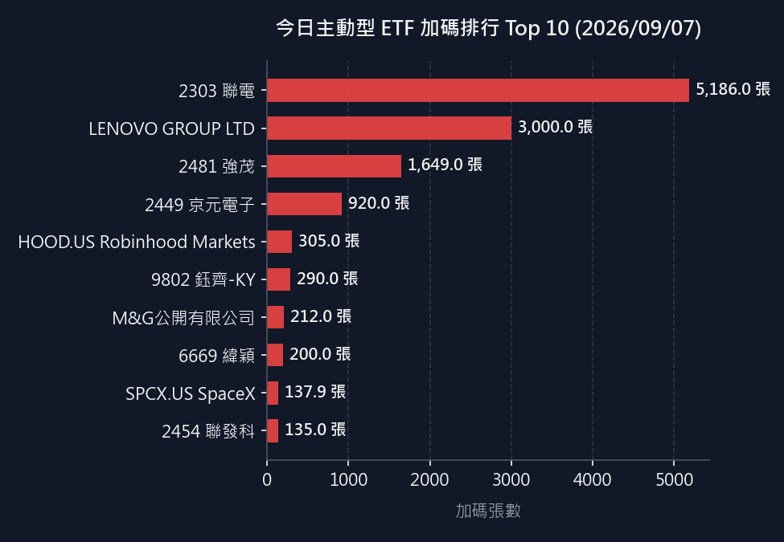
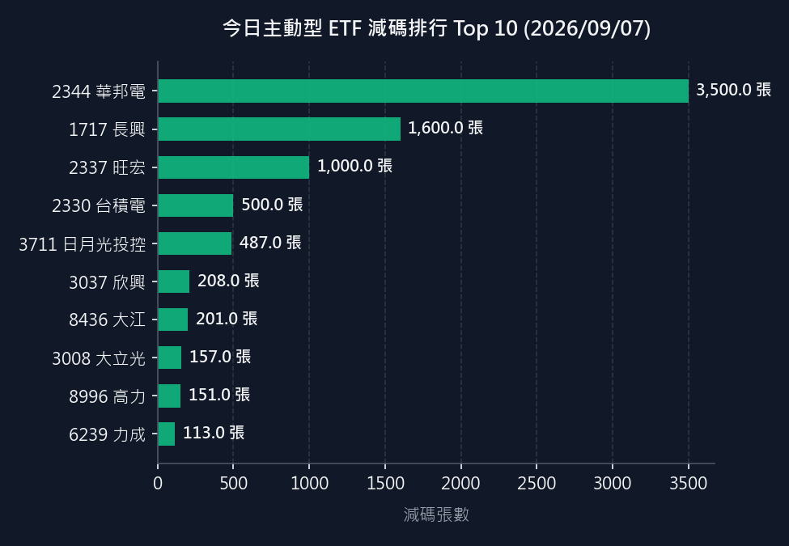

# 主動型 ETF 持股變動

資料來源：`主動型ETF持股明細.xlsx` 最近兩個日期分頁。

比較區間：`20260904` → `20260907`

## 今日加減碼視覺化排行

| 今日加碼 Top 10 | 今日減碼 Top 10 |
| :---: | :---: |
|  |  |

| ETF | 新增 | 刪除 | 比例變動 |
| :-- | --: | --: | --: |
| 00400A | 0 | 0 | 40 |
| 00401A | 0 | 0 | 52 |
| 00402A | 0 | 0 | 44 |
| 00403A | 0 | 1 | 41 |
| 00404A | 2 | 2 | 43 |
| 00405A | 0 | 0 | 35 |
| 00407A | 0 | 0 | 0 |
| 00408A | 1 | 0 | 47 |
| 00980A | 0 | 0 | 0 |
| 00980D | 0 | 7 | 204 |
| 00981A | 0 | 0 | 0 |
| 00982A | 0 | 0 | 42 |
| 00983A | 0 | 0 | 39 |
| 00983D | 0 | 0 | 8 |
| 00984A | 0 | 0 | 0 |
| 00985A | 0 | 0 | 44 |
| 00986A | 0 | 0 | 34 |
| 00987A | 0 | 0 | 27 |
| 00988A | 0 | 3 | 38 |
| 00989A | 0 | 1 | 61 |
| 00990A | 1 | 0 | 42 |
| 00991A | 0 | 0 | 0 |
| 00992A | 0 | 0 | 32 |
| 00993A | 0 | 0 | 41 |
| 00994A | 0 | 0 | 34 |
| 00995A | 0 | 0 | 43 |
| 00996A | 2 | 0 | 41 |
| 00997A | 3 | 0 | 46 |
| 00998A | 2 | 0 | 43 |
| 00999A | 0 | 0 | 50 |

## 00400A

### 新增持股

- 無

### 刪除持股

- 無

### 投資比例變動

- 1303 南亞：1.44% → 1.47%（+0.03）
- 2059 川湖：5.86% → 5.87%（+0.01）
- 2303 聯電：0.94% → 1.03%（+0.09）
- 2308 台達電：2.80% → 2.83%（+0.03）
- 2313 華通：0.95% → 0.91%（-0.04）
- 2317 鴻海：0.85% → 0.84%（-0.01）
- 2330 台積電：8.57% → 8.73%（+0.16）
- 2360 致茂：3.28% → 3.60%（+0.32）
- 2368 金像電：1.27% → 1.36%（+0.09）
- 2383 台光電：2.29% → 3.30%（+1.01）
- 2449 京元電子：0.90% → 0.94%（+0.04）
- 2454 聯發科：7.14% → 7.68%（+0.54）
- 2881 富邦金：1.61% → 1.59%（-0.02）
- 2885 元大金：1.50% → 1.51%（+0.01）
- 3008 大立光：3.92% → 2.77%（-1.15）
- 3017 奇鋐：4.13% → 4.42%（+0.29）
- 3026 禾伸堂：0.97% → 1.07%（+0.10）
- 3037 欣興：2.81% → 3.94%（+1.13）
- 3044 健鼎：1.74% → 1.75%（+0.01）
- 3081 聯亞：0.89% → 0.86%（-0.03）
- 3090 日電貿：0.36% → 0.35%（-0.01）
- 3167 大量：0.32% → 0.35%（+0.03）
- 3374 精材：0.50% → 0.55%（+0.05）
- 3443 創意：3.80% → 3.87%（+0.07）
- 3529 力旺：1.00% → 1.08%（+0.08）
- 3653 健策：4.47% → 4.29%（-0.18）
- 3665 貿聯-KY：1.68% → 1.62%（-0.06）
- 3711 日月光投控：0.94% → 0.99%（+0.05）
- 4979 華星光：0.63% → 0.59%（-0.04）
- 5274 信驊：3.15% → 3.45%（+0.30）
- 5347 世界：0.70% → 0.72%（+0.02）
- 6187 萬潤：2.67% → 2.80%（+0.13）
- 6223 旺矽：4.22% → 4.48%（+0.26）
- 6274 台燿：1.85% → 1.86%（+0.01）
- 6442 光聖：0.98% → 0.95%（-0.03）
- 6488 環球晶：3.16% → 3.13%（-0.03）
- 6515 穎崴：0.51% → 0.50%（-0.01）
- 6669 緯穎：5.82% → 5.63%（-0.19）
- 7750 新代：1.01% → 0.99%（-0.02）
- 7769 鴻勁：0.41% → 0.45%（+0.04）

## 00401A

### 新增持股

- 無

### 刪除持股

- 無

### 投資比例變動

- 1216 統一：0.30% → 0.28%（-0.02）
- 1477 聚陽：0.95% → 0.91%（-0.04）
- 2059 川湖：1.22% → 1.20%（-0.02）
- 2303 聯電：0.90% → 1.79%（+0.89）
- 2308 台達電：3.26% → 3.27%（+0.01）
- 2313 華通：1.82% → 1.76%（-0.06）
- 2327 國巨*：0.62% → 0.68%（+0.06）
- 2330 台積電：15.47% → 15.18%（-0.29）
- 2345 智邦：2.21% → 2.11%（-0.10）
- 2357 華碩：1.74% → 1.98%（+0.24）
- 2360 致茂：1.74% → 1.83%（+0.09）
- 2368 金像電：0.31% → 0.30%（-0.01）
- 2379 瑞昱：1.11% → 1.09%（-0.02）
- 2382 廣達：2.40% → 2.37%（-0.03）
- 2383 台光電：1.74% → 1.72%（-0.02）
- 2412 中華電：0.86% → 0.82%（-0.04）
- 2454 聯發科：6.74% → 7.05%（+0.31）
- 2455 全新：2.67% → 2.42%（-0.25）
- 2603 長榮：1.14% → 1.06%（-0.08）
- 2881 富邦金：2.15% → 2.08%（-0.07）
- 2882 國泰金：1.16% → 1.12%（-0.04）
- 2883 凱基金：1.72% → 1.69%（-0.03）
- 2884 玉山金：2.04% → 1.96%（-0.08）
- 2886 兆豐金：1.49% → 1.41%（-0.08）
- 2887 台新新光金：1.18% → 1.11%（-0.07）
- 2890 永豐金：0.31% → 0.30%（-0.01）
- 2891 中信金：1.66% → 1.58%（-0.08）
- 2912 統一超：0.28% → 0.26%（-0.02）
- 3008 大立光：2.88% → 2.55%（-0.33）
- 3034 聯詠：0.22% → 0.21%（-0.01）
- 3037 欣興：2.09% → 2.05%（-0.04）
- 3131 弘塑：0.78% → 0.80%（+0.02）
- 3231 緯創：0.53% → 0.80%（+0.27）
- 3491 昇達科：1.80% → 1.84%（+0.04）
- 3711 日月光投控：1.98% → 1.99%（+0.01）
- 4904 遠傳：0.81% → 0.76%（-0.05）
- 4958 臻鼎-KY：1.84% → 1.89%（+0.05）
- 4991 環宇-KY：1.08% → 1.05%（-0.03）
- 5274 信驊：2.17% → 2.23%（+0.06）
- 5347 世界：1.25% → 1.27%（+0.02）
- 5904 寶雅*：0.59% → 0.57%（-0.02）
- 6223 旺矽：1.72% → 1.78%（+0.06）
- 6285 啟碁：1.46% → 1.43%（-0.03）
- 6510 精測：0.80% → 0.79%（-0.01）
- 6515 穎崴：1.19% → 1.13%（-0.06）
- 6531 愛普*：1.19% → 1.20%（+0.01）
- 6669 緯穎：2.44% → 2.34%（-0.10）
- 7769 鴻勁：1.73% → 1.84%（+0.11）
- 7828 創新服務：1.85% → 1.88%（+0.03）
- 8464 億豐：1.10% → 1.03%（-0.07）
- 台股期貨09/26(FITXN*1.TF)：-0.05% → 0.19%（+0.24）
- 臺指選擇權09/26 44500 買權：-0.84% → -1.47%（-0.63）

## 00402A

### 新增持股

- 無

### 刪除持股

- 無

### 投資比例變動

- AAPL.US Apple：7.77% → 7.49%（-0.28）
- ADI.US Analog Devices：1.80% → 1.81%（+0.01）
- AMD.US AMD：4.66% → 4.82%（+0.16）
- AMZN.US Amazon：4.65% → 4.59%（-0.06）
- ARM.US Arm：0.97% → 1.00%（+0.03）
- ASML.US ASML Holding：1.63% → 1.68%（+0.05）
- AVGO.US Broadcom：2.19% → 2.17%（-0.02）
- AXON.US Axon Enterprise：1.02% → 0.96%（-0.06）
- BKNG.US Booking Holdings：0.92% → 0.90%（-0.02）
- CDNS.US Cadence Design Systems：1.38% → 1.31%（-0.07）
- COHR.US Coherent：1.80% → 1.90%（+0.10）
- CRWD.US CrowdStrike Holdings：1.49% → 1.46%（-0.03）
- DASH.US DoorDash：0.58% → 0.54%（-0.04）
- FSLY.US Fastly：0.33% → 0.32%（-0.01）
- GOOG.US Alphabet - Class C Capital Stock：3.17% → 3.10%（-0.07）
- GOOGL.US Alphabet - Class A Common Stock：3.61% → 3.53%（-0.08）
- INTC.US Intel：1.24% → 1.28%（+0.04）
- IOT.US Samsara：0.36% → 0.37%（+0.01）
- KLAC.US KLA：1.51% → 1.60%（+0.09）
- LITE.US Lumentum：1.76% → 1.81%（+0.05）
- LRCX.US Lam Research：2.66% → 2.76%（+0.10）
- MDB.US MongoDB：0.69% → 0.65%（-0.04）
- MRVL.US Marvell：1.14% → 1.21%（+0.07）
- MSFT.US Microsoft：5.40% → 5.23%（-0.17）
- MU.US Micron：6.48% → 6.79%（+0.31）
- NFLX.US Netflix：0.94% → 0.88%（-0.06）
- NOW.US ServiceNow：0.89% → 0.85%（-0.04）
- NVDA.US NVIDIA：8.95% → 8.99%（+0.04）
- PANW.US Palo Alto：2.45% → 2.43%（-0.02）
- PLTR.US Palantir Technologies：1.85% → 1.75%（-0.10）
- SHOP.US Shopify：0.92% → 0.90%（-0.02）
- SIMO.US Silicon Motion：0.74% → 0.79%（+0.05）
- SKHY.US SK hynix：1.08% → 1.15%（+0.07）
- SNOW.US Snowflake：1.40% → 1.31%（-0.09）
- SPCX.US SpaceX：0.80% → 0.78%（-0.02）
- SPOT.US Spotify：0.56% → 0.53%（-0.03）
- STX.US Seagate：1.02% → 1.07%（+0.05）
- TER.US Teradyne：0.82% → 0.85%（+0.03）
- TSM.US TSMC(ADR)：1.48% → 1.50%（+0.02）
- TTWO.US Take-Two：0.69% → 0.68%（-0.01）
- TXN.US Texas Instruments：2.14% → 2.15%（+0.01）
- UBER.US Uber：0.51% → 0.50%（-0.01）
- V.US Visa：1.31% → 1.28%（-0.03）
- WDC.US Western Digital：2.21% → 2.32%（+0.11）

## 00403A

### 新增持股

- 無

### 刪除持股

- 4966 譜瑞-KY（0.01%，16 張）

### 投資比例變動

- 1303 南亞：1.90% → 1.94%（+0.04）
- 1560 中砂：0.14% → 0.09%（-0.05）
- 1717 長興：0.15% → 0.07%（-0.08）
- 2303 聯電：3.98% → 4.90%（+0.92）
- 2308 台達電：3.08% → 3.17%（+0.09）
- 2317 鴻海：0.50% → 0.51%（+0.01）
- 2327 國巨*：2.61% → 2.93%（+0.32）
- 2330 台積電：15.99% → 15.47%（-0.52）
- 2337 旺宏：0.15% → 0.08%（-0.07）
- 2344 華邦電：0.54% → 0.17%（-0.37）
- 2345 智邦：3.07% → 3.02%（-0.05）
- 2360 致茂：1.28% → 1.39%（+0.11）
- 2383 台光電：5.39% → 5.47%（+0.08）
- 2404 漢唐：0.16% → 0.17%（+0.01）
- 2449 京元電子：0.28% → 0.44%（+0.16）
- 2454 聯發科：5.84% → 6.55%（+0.71）
- 2455 全新：0.13% → 0.12%（-0.01）
- 2481 強茂：0.13% → 0.30%（+0.17）
- 3008 大立光：3.69% → 2.84%（-0.85）
- 3017 奇鋐：6.62% → 6.71%（+0.09）
- 3037 欣興：4.98% → 5.00%（+0.02）
- 3189 景碩：1.68% → 1.72%（+0.04）
- 3443 創意：2.40% → 2.14%（-0.26）
- 3450 聯鈞：0.39% → 0.40%（+0.01）
- 3533 嘉澤：0.27% → 0.26%（-0.01）
- 3583 辛耘：0.38% → 0.36%（-0.02）
- 3653 健策：3.99% → 3.93%（-0.06）
- 3665 貿聯-KY：1.73% → 1.67%（-0.06）
- 3711 日月光投控：1.69% → 1.55%（-0.14）
- 5274 信驊：2.39% → 2.52%（+0.13）
- 6223 旺矽：3.54% → 3.76%（+0.22）
- 6239 力成：0.94% → 0.93%（-0.01）
- 6274 台燿：1.63% → 1.62%（-0.01）
- 6442 光聖：0.39% → 0.37%（-0.02）
- 6488 環球晶：1.65% → 1.69%（+0.04）
- 6669 緯穎：3.29% → 3.24%（-0.05）
- 6805 富世達：0.87% → 0.92%（+0.05）
- 7769 鴻勁：0.49% → 0.53%（+0.04）
- 8046 南電：1.82% → 1.73%（-0.09）
- 8358 金居：0.12% → 0.13%（+0.01）
- 8996 高力：1.31% → 1.22%（-0.09）

## 00404A

### 新增持股

- TWSE 09/16/2026 C47500 Index（-0.29%，-0.301 張）
- TWSE 10/21/2026 C48800 Index（-0.09%，-0.056 張）

### 刪除持股

- 台指選擇權09/26 47500 買權（-0.17%，-0.301 張）
- 台指選擇權10/26 48800 買權（-0.06%，-0.056 張）

### 投資比例變動

- 1303 南亞：0.74% → 0.75%（+0.01）
- 2027 大成鋼：0.45% → 0.44%（-0.01）
- 2059 川湖：1.63% → 1.62%（-0.01）
- 2301 光寶科：1.67% → 1.60%（-0.07）
- 2303 聯電：2.77% → 3.01%（+0.24）
- 2317 鴻海：0.72% → 0.71%（-0.01）
- 2330 台積電：21.87% → 22.07%（+0.20）
- 2345 智邦：0.74% → 0.73%（-0.01）
- 2351 順德：0.57% → 0.55%（-0.02）
- 2360 致茂：0.66% → 0.71%（+0.05）
- 2379 瑞昱：2.06% → 2.08%（+0.02）
- 2382 廣達：2.27% → 2.26%（-0.01）
- 2383 台光電：2.87% → 2.88%（+0.01）
- 2395 研華：1.59% → 1.51%（-0.08）
- 2428 興勤：1.20% → 1.18%（-0.02）
- 2439 美律：0.98% → 0.95%（-0.03）
- 2441 超豐：1.80% → 1.81%（+0.01）
- 2454 聯發科：6.70% → 5.75%（-0.95）
- 2458 義隆：1.60% → 1.55%（-0.05）
- 2637 慧洋-KY：1.21% → 1.18%（-0.03）
- 2845 遠東銀：1.78% → 1.77%（-0.01）
- 2885 元大金：2.21% → 2.20%（-0.01）
- 2887 台新新光金：0.69% → 0.67%（-0.02）
- 2890 永豐金：1.05% → 1.03%（-0.02）
- 3017 奇鋐：1.16% → 1.10%（-0.06）
- 3034 聯詠：1.98% → 2.01%（+0.03）
- 3037 欣興：0.61% → 0.64%（+0.03）
- 3135 凌航：1.54% → 1.52%（-0.02）
- 3260 威剛：1.27% → 1.30%（+0.03）
- 3264 欣銓：1.26% → 1.24%（-0.02）
- 3443 創意：0.51% → 0.52%（+0.01）
- 3711 日月光投控：3.40% → 3.54%（+0.14）
- 4763 材料*-KY：1.74% → 1.73%（-0.01）
- 4904 遠傳：0.48% → 0.46%（-0.02）
- 5274 信驊：2.49% → 2.71%（+0.22）
- 5434 崇越：1.65% → 1.64%（-0.01）
- 5904 寶雅*：0.49% → 0.48%（-0.01）
- 6139 亞翔：1.69% → 1.68%（-0.01）
- 6196 帆宣：1.81% → 1.78%（-0.03）
- 6223 旺矽：0.99% → 1.04%（+0.05）
- 6491 晶碩：0.52% → 0.51%（-0.01）
- 8081 致新：0.85% → 0.84%（-0.01）
- 台股期貨09/26(FITXN*1.TF)：16.79% → 16.86%（+0.07）

## 00405A

### 新增持股

- 無

### 刪除持股

- 無

### 投資比例變動

- 1590 亞德客-KY：0.01% → 0.00%（-0.01）
- 2059 川湖：2.07% → 2.08%（+0.01）
- 2308 台達電：0.61% → 0.62%（+0.01）
- 2345 智邦：4.06% → 3.96%（-0.10）
- 2368 金像電：4.55% → 4.50%（-0.05）
- 2383 台光電：4.12% → 4.15%（+0.03）
- 2454 聯發科：7.65% → 8.14%（+0.49）
- 3017 奇鋐：6.76% → 6.80%（+0.04）
- 3037 欣興：5.32% → 5.31%（-0.01）
- 3081 聯亞：1.81% → 1.73%（-0.08）
- 3131 弘塑：1.32% → 1.38%（+0.06）
- 3443 創意：7.75% → 7.70%（-0.05）
- 3450 聯鈞：1.32% → 1.36%（+0.04）
- 3653 健策：6.39% → 6.25%（-0.14）
- 3665 貿聯-KY：5.13% → 4.91%（-0.22）
- 4749 新應材：0.26% → 0.27%（+0.01）
- 4991 環宇-KY：2.13% → 2.11%（-0.02）
- 5274 信驊：3.56% → 3.72%（+0.16）
- 5347 世界：0.11% → 0.12%（+0.01）
- 6187 萬潤：0.94% → 0.97%（+0.03）
- 6223 旺矽：5.06% → 5.34%（+0.28）
- 6274 台燿：1.51% → 1.49%（-0.02）
- 6278 台表科：0.98% → 0.97%（-0.01）
- 6488 環球晶：0.37% → 0.38%（+0.01）
- 6510 精測：3.01% → 3.03%（+0.02）
- 6515 穎崴：0.59% → 0.57%（-0.02）
- 6531 愛普*：2.51% → 2.57%（+0.06）
- 6669 緯穎：1.36% → 1.32%（-0.04）
- 6805 富世達：2.08% → 2.19%（+0.11）
- 6831 邁科：0.54% → 0.51%（-0.03）
- 7734 印能科技：1.49% → 1.56%（+0.07）
- 7769 鴻勁：2.59% → 2.81%（+0.22）
- 8046 南電：2.93% → 2.77%（-0.16）
- 8210 勤誠：0.58% → 0.56%（-0.02）
- 8996 高力：1.23% → 1.25%（+0.02）

## 00407A

### 新增持股

- 無

### 刪除持股

- 無

### 投資比例變動

- 無

## 00408A

### 新增持股

- 3711 日月光投控（0.52%，13 張）

### 刪除持股

- 無

### 投資比例變動

- 1303 南亞：2.89% → 2.95%（+0.06）
- 2059 川湖：2.64% → 0.89%（-1.75）
- 2303 聯電：0.57% → 0.64%（+0.07）
- 2308 台達電：2.19% → 2.25%（+0.06）
- 2317 鴻海：1.95% → 1.97%（+0.02）
- 2330 台積電：4.85% → 4.88%（+0.03）
- 2344 華邦電：0.44% → 0.46%（+0.02）
- 2345 智邦：1.10% → 1.07%（-0.03）
- 2357 華碩：2.73% → 2.75%（+0.02）
- 2368 金像電：3.31% → 3.30%（-0.01）
- 2376 技嘉：1.26% → 1.28%（+0.02）
- 2382 廣達：0.88% → 0.89%（+0.01）
- 2383 台光電：3.46% → 3.52%（+0.06）
- 2395 研華：1.94% → 1.48%（-0.46）
- 2408 南亞科：0.94% → 0.99%（+0.05）
- 2449 京元電子：0.51% → 0.87%（+0.36）
- 2454 聯發科：2.84% → 4.26%（+1.42）
- 2481 強茂：0.98% → 0.97%（-0.01）
- 2801 彰銀：1.45% → 1.42%（-0.03）
- 2880 華南金：1.87% → 1.86%（-0.01）
- 2886 兆豐金：2.87% → 2.79%（-0.08）
- 2891 中信金：1.06% → 1.04%（-0.02）
- 3017 奇鋐：5.62% → 5.69%（+0.07）
- 3037 欣興：2.06% → 1.70%（-0.36）
- 3045 台灣大：3.01% → 2.92%（-0.09）
- 3081 聯亞：1.02% → 0.98%（-0.04）
- 3189 景碩：1.37% → 1.40%（+0.03）
- 3231 緯創：1.60% → 1.64%（+0.04）
- 3491 昇達科：0.64% → 0.68%（+0.04）
- 3653 健策：2.21% → 2.17%（-0.04）
- 3661 世芯-KY：0.27% → 0.26%（-0.01）
- 3665 貿聯-KY：0.14% → 0.13%（-0.01）
- 5434 崇越：2.00% → 2.01%（+0.01）
- 6187 萬潤：1.28% → 1.31%（+0.03）
- 6223 旺矽：1.32% → 2.11%（+0.79）
- 6239 力成：1.21% → 1.20%（-0.01）
- 6274 台燿：2.29% → 2.28%（-0.01）
- 6488 環球晶：0.91% → 0.93%（+0.02）
- 6515 穎崴：0.46% → 0.45%（-0.01）
- 6669 緯穎：6.56% → 6.42%（-0.14）
- 6805 富世達：1.23% → 1.30%（+0.07）
- 7769 鴻勁：1.73% → 1.89%（+0.16）
- 8046 南電：1.13% → 0.94%（-0.19）
- 8436 大江：2.67% → 1.15%（-1.52）
- 8996 高力：1.01% → 1.03%（+0.02）
- 9802 鈺齊-KY：1.09% → 2.40%（+1.31）
- 9941 裕融：3.57% → 3.00%（-0.57）

## 00980A

### 新增持股

- 無

### 刪除持股

- 無

### 投資比例變動

- 無

## 00980D

### 新增持股

- 無

### 刪除持股

- COTY/HFC PRESTIGE/INT US SER REGS (REG S) 6.625% 15JUL2030（0.55%，N/A 張）
- DOW CHEMICAL CO/THE 5.950000 % 15MAR2055（0.49%，N/A 張）
- FMC CORP (REG) 4.5% 01OCT2049（0.49%，N/A 張）
- GETTY IMAGES INC SER REGS 11.250000 % 21FEB2030（0.46%，N/A 張）
- ORACLE CORP 5.55% 06FEB2053（0.24%，N/A 張）
- ORACLE CORP 5.950000 % 26-SEP-2055（0.39%，N/A 張）
- TIME WARNER CABLE LLC (REG) 6.75% 15JUN2039（0.30%，N/A 張）

### 投資比例變動

- AHOLD FINANCE USA LLC 6.88% 01MAY2029：0.47% → 0.48%（+0.01）
- ALLY FINANCIAL INC (REG) 7.1% 15NOV2027：0.42% → 0.44%（+0.02）
- ALLY FINANCIAL INC (REG) 8% 01/11/2031：0.56% → 0.58%（+0.02）
- ALLY FINANCIAL INC (REG) 8% 01NOV2031：0.51% → 0.53%（+0.02）
- ALLY FINANCIAL INC (REG) VAR 03JAN2030：0.61% → 0.63%（+0.02）
- ALLY FINANCIAL INC (REG) VAR 13JUN2029：0.54% → 0.55%（+0.01）
- AMC GLOBAL MEDIA INC SER REGS (REG) (REG S) 10.5% 15JUL2032：0.70% → 0.72%（+0.02）
- ANHEUSER-BUSCH INBEV WOR (REG) 8.2% 15JAN2039：0.50% → 0.52%（+0.02）
- APA CORP 6.750000 % 15-FEB-2055：0.36% → 0.37%（+0.01）
- APOLLO DEBT SOLUTIONS BD 6.700000 % 29JUL2031：0.33% → 0.34%（+0.01）
- APOLLO DEBT SOLUTIONS BD 6.900000 % 13APR2029：0.54% → 0.55%（+0.01）
- ARCELORMITTAL SA 6.55% 29NOV2027：0.53% → 0.55%（+0.02）
- ARIS WATER HOLDINGS LLC SER REGS 7.250000 % 01APR2030：0.46% → 0.47%（+0.01）
- ARSENAL AIC PARENT LLC SER REGS 11.5 % 01-OCT-2031：0.31% → 0.32%（+0.01）
- ATHENE HOLDING LTD (REG) 6.25% 01APR2054：0.74% → 0.77%（+0.03）
- ATHENE HOLDING LTD 6.625000 % 19MAY2055：0.55% → 0.57%（+0.02）
- AVIANCA MIDCO 2 PLC SER REGS 10.25 % 07-JAN-2032：0.30% → 0.31%（+0.01）
- AVIANCA MIDCO 2 PLC SER REGS 9.625000 % 14FEB2030：0.29% → 0.30%（+0.01）
- BANCO SANTANDER SA (REG) 6.607% 07NOV2028：0.64% → 0.66%（+0.02）
- BANCO SANTANDER SA 6.921% 08AUG2033：0.33% → 0.34%（+0.01）
- BANK OF AMERICA CORP (REG) 7.75% 14MAY2038：0.50% → 0.52%（+0.02）
- BARCLAYS PLC (REG) VAR 27JUN2034：0.33% → 0.34%（+0.01）
- BAT CAPITAL CORP (REG) 7.079% 02AUG2043：0.31% → 0.32%（+0.01）
- BAT CAPITAL CORP (REG) 7.081% 02AUG2053：0.56% → 0.57%（+0.01）
- BAT CAPITAL CORP (REG) 7.75% 19OCT2032：0.44% → 0.45%（+0.01）
- BAYER US FINANCE LLC SER REGS 6.875000 % 21NOV2053：0.34% → 0.35%（+0.01）
- BLACKSTONE PRIVATE CRE 7.300000 % 27NOV2028：0.46% → 0.47%（+0.01）
- BLUE OWL CREDIT INCOME (REG) 6.6% 15SEP2029：0.38% → 0.39%（+0.01）
- BLUE OWL CREDIT INCOME (REG) 6.65% 15MAR2031：0.52% → 0.53%（+0.01）
- BLUE OWL CREDIT INCOME 7.750000 % 15JAN2029：0.52% → 0.54%（+0.02）
- BLUE OWL CREDIT INCOME 7.950000 % 13JUN2028：0.52% → 0.53%（+0.01）
- BLUE OWL CREDIT INCOME SER WI (REG) 7.75% 16SEP2027：0.54% → 0.55%（+0.01）
- BLUE OWL TECHNOLOGY FIN CORP II 6.75 % 04APR2029：0.54% → 0.56%（+0.02）
- BOSTON PROPERTIES LP (REG) 6.750000 % 01-DEC-2027：0.45% → 0.46%（+0.01）
- BPCE SA SER REGS VAR 14JAN2046：0.39% → 0.40%（+0.01）
- BPCE SA SER REGS VAR 19OCT2034：0.41% → 0.42%（+0.01）
- BRIGHTHOUSE FINANCIAL IN (REG) 4.7% 22JUN2047：0.45% → 0.47%（+0.02）
- BRITISH TELECOMMUNICATIO (BR) 9.625% 15DEC2030：0.56% → 0.57%（+0.01）
- CALDERYS FINANCING LLC SER REGS (REG S) 11.25% 01JUN2028：0.32% → 0.33%（+0.01）
- CANTOR FITZGERALD LP SER REGS 7.200000 % 12DEC2028：0.31% → 0.32%（+0.01）
- CAPITAL ONE FINANCIAL CO SER . (REG) VAR 30OCT2031：0.57% → 0.58%（+0.01）
- CHARTER COMM OPT 6.484% 23OCT2045 W/I：0.44% → 0.46%（+0.02）
- CHARTER COMM OPT LLC/CAP (REG) 6.834000 % 23OCT2055：0.44% → 0.46%（+0.02）
- CHARTER COMM OPT LLC/CAP 6.700000 % 01-DEC-2055：0.45% → 0.46%（+0.01）
- CHC GROUP LLC SER REGS 11.750000 % 01-SEP-2030：0.42% → 0.44%（+0.02）
- CHS/COMMUNITY HEALTH SYS SER REGS 10.875000 % 15JAN2032：0.42% → 0.43%（+0.01）
- CHS/COMMUNITY HEALTH SYS SER REGS 9.750000 % 15JAN2034：0.32% → 0.33%（+0.01）
- CIMIC FINANCE USA PTY LT SER REGS (REG S) 7% 25MAR2034：0.32% → 0.33%（+0.01）
- CITIGROUP INC 8.125% 15JUL2039：0.61% → 0.62%（+0.01）
- CIVITAS RESOURCES INC SER REGS (REG) (REG S) 9.625% 15JUN2033：0.54% → 0.56%（+0.02）
- CONCENTRIX CORP (REG) 6.6% 02AUG2028：0.50% → 0.52%（+0.02）
- CONCENTRIX CORP (REG) 6.85% 02AUG2033：0.69% → 0.72%（+0.03）
- CONOCOPHILLIPS COMPANY (REG) 6.95% 15APR2029：0.50% → 0.51%（+0.01）
- CONSOLIDATED ENERGY FIN SER REGS 12.000000 % 15FEB2031：0.55% → 0.57%（+0.02）
- COREWEAVE INC SER REGS (REG S) 9.25% 01JUN2030：0.41% → 0.42%（+0.01）
- COX COMMUNICATIONS INC SER REGS 5.800000 % 15DEC2053：0.38% → 0.39%（+0.01）
- COX COMMUNICATIONS INC SER REGS 5.950000 % 01SEP2054：0.52% → 0.54%（+0.02）
- DAIMLER FINANCE NA LLC REG 8.5% 18JAN2031：0.62% → 0.64%（+0.02）
- DELL INT LLC / EMC CORP (REG) 8.1% 15JUL2036：0.57% → 0.59%（+0.02）
- DELL INT LLC / EMC CORP (REG) 8.35% 15JUL2046：0.54% → 0.56%（+0.02）
- DEUTSCHE BANK NY VAR 10FEB2034：0.33% → 0.34%（+0.01）
- DEUTSCHE BANK NY VAR 20NOV2029：0.45% → 0.47%（+0.02）
- DEUTSCHE TELEKOM INT FIN (REG) 8.75% 15JUN2030：0.40% → 0.41%（+0.01）
- DEUTSCHE TELEKOM INT FIN (REG) 9.25% 01JUN2032：0.41% → 0.42%（+0.01）
- DEVON ENERGY CORPORATION (REG) 7.875% 30SEP2031：0.46% → 0.47%（+0.01）
- DIRECTV FIN LLC/COINC SER REGS 10.000000 % 15FEB2031：0.40% → 0.41%（+0.01）
- DISCOVER FINANCIAL SVS (REG) VAR 02NOV2034：0.62% → 0.64%（+0.02）
- DOW CHEMICAL CO/THE (REG) 5.55% 30NOV2048：0.54% → 0.46%（-0.08）
- DOW CHEMICAL CO/THE (REG) 5.6% 15FEB2054：0.58% → 0.60%（+0.02）
- DOW CHEMICAL CO/THE 6.9% 15MAY2053：0.59% → 0.61%（+0.02）
- DOW CHEMICAL CO/THE 7.375% 01NOV2029：0.60% → 0.61%（+0.01）
- DOW CHEMICAL CO/THE 9.4% 15MAY2039：0.53% → 0.55%（+0.02）
- EDISON INTERNATIONAL (REG) 6.95% 15NOV2029：0.56% → 0.58%（+0.02）
- ENBRIDGE ENERGY PARTNERS (REG) 7.375% 15OCT2045：0.50% → 0.51%（+0.01）
- ENEL FINANCE INTL NV SER REGS (REG S) 7.5% 14OCT2032：0.34% → 0.35%（+0.01）
- ENEL FINANCE INTL NV SER REGS (REG S) 7.75% 14OCT2052：0.36% → 0.37%（+0.01）
- ENERGY TRANSFER LP (REG) 7.5% 01JUL2038：0.32% → 0.33%（+0.01）
- F&G ANNUITIES & LIFE INC 6.250000 % 04OCT2034：0.48% → 0.50%（+0.02）
- FIFTH THIRD BANCORP (REG) 8.25% 01MAR2038：0.63% → 0.65%（+0.02）
- FMC CORP (REG) 6.375000 % 18MAY2053：0.46% → 0.48%（+0.02）
- FORD MOTOR COMPANY (REG) 7.45% 16JUL2031：0.46% → 0.47%（+0.01）
- FORD MOTOR CREDIT CO LLC (REG) 7.35% 04NOV2027：0.32% → 0.33%（+0.01）
- FORD MOTOR CREDIT CO LLC (REG) 7.35% 06MAR2030：0.33% → 0.34%（+0.01）
- FORD MOTOR CREDIT CO LLC 6.500000 % 07FEB2035：0.31% → 0.32%（+0.01）
- FORD MOTOR CREDIT CO LLC 6.798% 07NOV2028：0.32% → 0.33%（+0.01）
- FORD MOTOR CREDIT CO LLC 7.122% 07NOV2033：0.33% → 0.34%（+0.01）
- FREEDOM MORTGAGE CORP SER REGS (REG S) 12.25% 01OCT2030：0.46% → 0.47%（+0.01）
- GENERAL MOTORS CO (REG) 6.75% 01APR2046：0.55% → 0.56%（+0.01）
- GENERAL MOTORS CO (REG) 6.8% 01OCT2027：0.54% → 0.56%（+0.02）
- GEORGIA-PACIFIC LLC (REG) 7.75% 15NOV2029：0.56% → 0.57%（+0.01）
- GLENCORE FINANCE CANADA SER REGS 6.900000 % 15-NOV-2037：0.38% → 0.39%（+0.01）
- GLOBAL ATLANTIC FIN CO SER REGS 6.750000 % 15MAR2054：0.61% → 0.62%（+0.01）
- GLOBAL ATLANTIC FIN CO SER REGS 7.950000 % 15JUN2033：0.64% → 0.66%（+0.02）
- GLOBAL AUTO HO/AAG FH UK SER REGS (REG S) 11.5% 15AUG2029：0.36% → 0.37%（+0.01）
- GLOBAL AUTO HO/AAG FH UK SER REGS (REG S) 8.75% 15JAN2032：0.42% → 0.43%（+0.01）
- GRAY TELEVISION INC SER REGS (REG) (REG S) 10.5% 15JUL2029：0.19% → 0.20%（+0.01）
- HA SUSTAINABLE INF CAP (REG) 6.375% 01JUL2034：0.34% → 0.35%（+0.01）
- HAH GROUP HOLDING CO LLC SER REGS (REG S) 9.75% 01OCT2031：0.30% → 0.31%（+0.01）
- HERTZ CORP/THE SER REGS (REG S) 12.625% 15JUL2029：0.28% → 0.29%（+0.01）
- HESS CORP (REG) 7.3% 15AUG2031：0.51% → 0.53%（+0.02）
- HISCOX LTD VAR 11JUN2036：0.42% → 0.43%（+0.01）
- HPS CORPORATE LENDING FU 6.750000 % 30JAN2029：0.52% → 0.54%（+0.02）
- HSBC HOLDINGS PLC (REG) VAR 13NOV2034：0.34% → 0.35%（+0.01）
- HSBC HOLDINGS PLC VAR 03NOV2028：0.32% → 0.33%（+0.01）
- HSBC HOLDINGS PLC VAR 03NOV2033：0.35% → 0.36%（+0.01）
- HUTCHISON WHAM INT 03/33 SER REGS (REG S) 7.45% 24NOV2033：0.39% → 0.41%（+0.02）
- ICAHN ENTERPRISES/FIN SER REGS 10.000000 % 15NOV2029：0.30% → 0.31%（+0.01）
- INTESA SANPAOLO SPA SER REGS (REG S) 7.8% 28NOV2053：0.36% → 0.37%（+0.01）
- INTESA SANPAOLO SPA SER REGS (REG) 7.200000 % 28NOV2033：0.34% → 0.35%（+0.01）
- JBS USA HOLD/FOOD/LUX CO 7.250000 % 15NOV2053：0.46% → 0.47%（+0.01）
- JBS USA/FOOD/FINANCE (REG) 6.5% 01DEC2052：0.45% → 0.46%（+0.01）
- JETBLUE AIRWAYS/LOYALTY SER REGS (REG S) 9.875% 20SEP2031：0.46% → 0.48%（+0.02）
- JH NORTH AMERICA HOLDING SER REGS 6.125000 % 31JUL2032：0.39% → 0.40%（+0.01）
- KELLANOVA SER B (REG) 7.450000 % 01APR2031：0.55% → 0.57%（+0.02）
- KONINKLIJKE KPN NV (REG) 8.375% 01OCT2030：0.42% → 0.43%（+0.01）
- LADDER CAP FIN LLLP/CORP SER REGS 7.000000 % 15JUL2031：0.32% → 0.33%（+0.01）
- LBM ACQUISITION LLC SER REGS 9.500000 % 15JUN2031：0.47% → 0.48%（+0.01）
- LINCOLN NATIONAL CORP (REG) 7.000000 % 15JUN2040：0.45% → 0.46%（+0.01）
- LPL HOLDINGS INC (REG) 6.75% 17NOV2028：0.55% → 0.56%（+0.01）
- M&T BANK CORPORATION (REG) VAR 30OCT2029：0.52% → 0.54%（+0.02）
- MACQUARIE BANK LTD SER REGS (REG S) 6.798% 18JAN2033：0.33% → 0.34%（+0.01）
- MDC HOLDINGS INC (REG) 6% 15JAN2043：0.32% → 0.33%（+0.01）
- META PLATFORMS INC 5.750000 % 15-NOV-2065：0.41% → 0.42%（+0.01）
- METLIFE INC (REG) 10.75% 01AUG2039：0.45% → 0.46%（+0.01）
- MOBIUS MERGER SUB SER REGS 9.000000 % 01JUN2030：0.25% → 0.26%（+0.01）
- MOHEGAN TRIBAL / MS DIG SER REGS 11.875000 % 15APR2031：0.66% → 0.68%（+0.02）
- MPLX LP 6.200000 % 15SEP2055：0.33% → 0.34%（+0.01）
- MYLAN INC (REG) 5.4% 29/11/2043：0.32% → 0.33%（+0.01）
- MYLAN INC SER WI (REG) 5.2% 15APR2048WI：0.47% → 0.49%（+0.02）
- MYLAN NV 5.25% 15JUN2046 WI：0.51% → 0.52%（+0.01）
- NATIONWIDE MUTUAL INSUR 9.375% 15AUG2039：0.51% → 0.52%（+0.01）
- NAVIENT CORP (REG) 11.5% 15MAR2031：0.31% → 0.32%（+0.01）
- NEPTUNE BIDCO US INC SER REGS (REG S) 9.29% 15APR2029：0.34% → 0.35%（+0.01）
- NISSAN MOTOR CO SER REGS 8.125000 % 17JUL2035：0.51% → 0.53%（+0.02）
- OCCIDENTAL PETROLEUM COR (REG) 7.5% 01MAY2031：0.32% → 0.33%（+0.01）
- OCCIDENTAL PETROLEUM COR 8.875% 15JUL2030：0.54% → 0.56%（+0.02）
- ONEOK INC 6.625% 01SEP2053：0.57% → 0.59%（+0.02）
- OPEN TEXT CORP SER REGS (REG) (REG S) 6.9% 01DEC2027：0.64% → 0.66%（+0.02）
- ORACLE CORP (REG) 5.500000 % 27SEP2064：0.53% → 0.20%（-0.33）
- ORACLE CORP 6.100000 % 26-SEP-2065：0.47% → 0.48%（+0.01）
- ORACLE CORP 6.125000 % 03AUG2065：0.54% → 0.56%（+0.02）
- ORACLE CORP 6.7 % 04-FEB-2056：0.20% → 0.21%（+0.01）
- ORACLE CORP 6.85 % 04-FEB-2066：0.54% → 0.56%（+0.02）
- ORACLE CORP 6.9% 09NOV2052：0.50% → 0.52%（+0.02）
- ORANGE SA (REG) 9% 01MAR2031：0.64% → 0.66%（+0.02）
- OVINTIV INC 7.375% 01NOV2031：0.32% → 0.33%（+0.01）
- PACIFIC GAS & ELECTRIC (REG) 6.7% 01APR2053：0.32% → 0.33%（+0.01）
- PACIFIC GAS & ELECTRIC (REG) 6.75% 15JAN2053：0.32% → 0.33%（+0.01）
- PACIFIC GAS & ELECTRIC 6.95% 15MAR2034：0.32% → 0.33%（+0.01）
- PBF HOLDING CO LLC SER REGS 9.875000 % 15MAR2030：0.35% → 0.36%（+0.01）
- PHOTO HOLDINGS LLC SER REGS (REG) (REG S) 12% 01JUL2031：0.50% → 0.52%（+0.02）
- PLANET FINANCIAL GROUP SER REGS 10.500000 % 15DEC2029：0.49% → 0.50%（+0.01）
- POLARIS INC 6.950000 % 15MAR2029：0.46% → 0.47%（+0.01）
- PROGRESS ENERGY INC (REG) 7.75% 01MAR2031：0.56% → 0.57%（+0.01）
- RIO TINTO FIN USA LTD (REG) 7.125% 15JUL2028：0.55% → 0.57%（+0.02）
- RR DONNELLEY & SONS CO SER REGS (REG S) 9.5% 01AUG2029：0.41% → 0.42%（+0.01）
- SABRE FINANCIAL BORROWER SER REGS 11.125 % 15-JUN-2029：0.52% → 0.53%（+0.01）
- SABRE GLBL INC SER REGS 10.75 % 15-MAR-2030：0.17% → 0.18%（+0.01）
- SABRE GLBL INC SER REGS 11.125000 % 15JUL2030：0.50% → 0.51%（+0.01）
- SALESFORCE INC (REG) 6.55% 15MAR2056：0.52% → 0.54%（+0.02）
- SALESFORCE INC (REG) 6.7% 15MAR2066：0.51% → 0.53%（+0.02）
- SANTANDER HOLDINGS USA VAR 09MAR2029：0.46% → 0.47%（+0.01）
- SANTANDER HOLDINGS USA VAR 09NOV2031：0.57% → 0.59%（+0.02）
- SANTANDER HOLDINGS USA VAR 12JUN2029：0.56% → 0.58%（+0.02）
- SANTANDER UK GROUP HLDGS (REG) VAR 10JAN2029：0.32% → 0.33%（+0.01）
- SANTOS FINANCE LTD SER REGS (REG S) 6.875% 19SEP2033：0.28% → 0.29%（+0.01）
- SBL HOLDINGS INC SER REGS 7.200000 % 30OCT2034：0.50% → 0.52%（+0.02）
- SEAGATE DATA STOR SER * 9.625 % 01-DEC-2032：0.55% → 0.56%（+0.01）
- SES GLOBAL AMERICAS HLDG SER REGS (REG) 5.300000 % 25MAR2044：0.31% → 0.32%（+0.01）
- SOCIETE GENERALE SER REGS (REG) (REG S) 7.367% 10JAN2053：0.32% → 0.33%（+0.01）
- SPACE EXPLORATION TECH SER 144A (REG) 6.65% 15JUL2056：0.30% → 0.31%（+0.01）
- SPRINT CAPITAL CORP (REG) 6.875% 15NOV2028：0.31% → 0.32%（+0.01）
- SPRINT CAPITAL CORP (REG) 8.75% 15MAR2032：0.40% → 0.41%（+0.01）
- STAPLES INC SER REGS (REG S) 10.75% 01SEP2029：0.47% → 0.49%（+0.02）
- STELLANTIS FIN US INC SER REGS 6.450000 % 18MAR2035：0.31% → 0.32%（+0.01）
- SUNCOR ENERGY INC (REG) 6.8% 15MAY2038：0.41% → 0.42%（+0.01）
- SUNCOR ENERGY INC (REG) 6.85% 01JUN2039：0.32% → 0.33%（+0.01）
- SUNCOR ENERGY INC (REG) 7.15% 01FEB2032：0.31% → 0.32%（+0.01）
- SYMETRA LIFE INSURANCE SER REGS 6.550000 % 01OCT2055：0.31% → 0.32%（+0.01）
- TELEFONICA EUROPE BV (REG) 8.25% 15SEP2030：0.40% → 0.41%（+0.01）
- TIME WARNER CABLE INC REG 7.3% 01JUL2038：0.30% → 0.31%（+0.01）
- TIME WARNER ENTERTAINMEN 8.375% 15JUL2033：0.62% → 0.64%（+0.02）
- TRANSCANADA PIPELINES LTD 7.625PCT 15/01/2039：0.51% → 0.53%（+0.02）
- TRUIST FINANCIAL CORP SER MTN VAR 30OCT2029：0.62% → 0.64%（+0.02）
- UBS GROUP AG SER REGS (REG S) VAR 15NOV2033：0.46% → 0.47%（+0.01）
- UNISYS CORP SER REGS 10.625000 % 15JAN2031：0.58% → 0.59%（+0.01）
- US 10YR NOTE (CBT)DEC26 21-DEC-2026：17.38% → 17.86%（+0.48）
- US 10YR ULTRA FUT DEC26 21-DEC-2026：-0.68% → -0.70%（-0.02）
- US 2YR NOTE (CBT) DEC26 31-DEC-2026：1.59% → 1.64%（+0.05）
- US 5YR NOTE (CBT) DEC26 31-DEC-2026：-13.95% → -14.34%（-0.39）
- US ACUTE CARE SOLUTIONS SER REGS (REG S) 9.75% 15MAY2029：0.32% → 0.33%（+0.01）
- US LONG BOND(CBT) DEC26 21-DEC-2026：5.23% → 5.38%（+0.15）
- US ULTRA BOND CBT DEC26 21-DEC-2026：-0.85% → -0.88%（-0.03）
- VALERO ENERGY CORP (REG) 7.5% 15APR2032：0.47% → 0.48%（+0.01）
- VAR ENERGI ASA SER REGS (REG S) 7.5% 15JAN2028：0.32% → 0.33%（+0.01）
- VAR ENERGI ASA SER REGS (REG S) 8% 15NOV2032：0.35% → 0.36%（+0.01）
- VERIZON COMMUNICAT 7.750000 % 01DEC2030：0.43% → 0.44%（+0.01）
- VIACOM INC (REG) 5.85% 01SEP2043：0.56% → 0.57%（+0.01）
- VIACOMCBS INC (REG) 4.95% 19MAY2050：0.48% → 0.50%（+0.02）
- VIACOMCBS INC 6.875% 30APR2036：0.28% → 0.29%（+0.01）
- VIRGINIA ELEC & POWER CO (REG) 8.875% 15NOV2038：0.56% → 0.58%（+0.02）
- VISTRA OPERATIONS CO LLC SER REGS (REG S) 6.95% 15OCT2033：0.40% → 0.41%（+0.01）
- WESTLAKE CORP 6.375000 % 15-NOV-2055：0.51% → 0.52%（+0.01）
- ZIONS BANCORP NA VAR 19NOV2035：0.40% → 0.41%（+0.01）

## 00981A

### 新增持股

- 無

### 刪除持股

- 無

### 投資比例變動

- 無

## 00982A

### 新增持股

- 無

### 刪除持股

- 無

### 投資比例變動

- 2059 川湖：4.89% → 4.91%（+0.02）
- 2301 光寶科：1.93% → 1.94%（+0.01）
- 2303 聯電：1.29% → 1.31%（+0.02）
- 2330 台積電：8.51% → 8.37%（-0.14）
- 2345 智邦：2.58% → 2.52%（-0.06）
- 2360 致茂：3.32% → 3.26%（-0.06）
- 2376 技嘉：1.23% → 1.24%（+0.01）
- 2377 微星：1.29% → 1.35%（+0.06）
- 2383 台光電：3.31% → 3.30%（-0.01）
- 2395 研華：1.96% → 2.02%（+0.06）
- 2428 興勤：1.13% → 1.17%（+0.04）
- 2454 聯發科：6.34% → 6.29%（-0.05）
- 2455 全新：1.62% → 1.59%（-0.03）
- 2467 志聖：1.18% → 1.17%（-0.01）
- 2476 鉅祥：0.31% → 0.30%（-0.01）
- 2478 大毅：1.00% → 1.07%（+0.07）
- 2486 一詮：0.83% → 0.80%（-0.03）
- 3008 大立光：3.61% → 3.64%（+0.03）
- 3017 奇鋐：2.45% → 2.58%（+0.13）
- 3090 日電貿：1.08% → 1.14%（+0.06）
- 3105 穩懋：5.06% → 4.97%（-0.09）
- 3231 緯創：1.39% → 1.42%（+0.03）
- 3491 昇達科：3.29% → 3.44%（+0.15）
- 3583 辛耘：1.71% → 1.58%（-0.13）
- 3711 日月光投控：1.10% → 1.07%（-0.03）
- 4958 臻鼎-KY：2.91% → 2.83%（-0.08）
- 5274 信驊：1.27% → 1.21%（-0.06）
- 5425 台半：1.17% → 1.16%（-0.01）
- 5483 中美晶：1.22% → 1.24%（+0.02）
- 5536 聖暉*：0.74% → 0.75%（+0.01）
- 6139 亞翔：5.33% → 5.37%（+0.04）
- 6214 精誠：1.27% → 1.25%（-0.02）
- 6223 旺矽：3.08% → 3.06%（-0.02）
- 6239 力成：1.04% → 1.02%（-0.02）
- 6274 台燿：1.14% → 1.13%（-0.01）
- 6472 保瑞：0.84% → 0.83%（-0.01）
- 6488 環球晶：2.02% → 2.09%（+0.07）
- 6531 愛普*：3.01% → 2.93%（-0.08）
- 6640 均華：0.24% → 0.28%（+0.04）
- 6669 緯穎：6.84% → 6.91%（+0.07）
- 6672 騰輝電子-KY：0.28% → 0.30%（+0.02）
- 8996 高力：0.90% → 0.96%（+0.06）

## 00983A

### 新增持股

- 無

### 刪除持股

- 無

### 投資比例變動

- ACHR.US Archer：0.70% → 0.72%（+0.02）
- AMD.US AMD：2.96% → 3.07%（+0.11）
- AMZN.US Amazon：2.39% → 2.47%（+0.08）
- AVGO.US Broadcom：0.55% → 0.57%（+0.02）
- BEAM.US Beam Therapeutics：2.04% → 2.12%（+0.08）
- BLSH.US Bullish：2.09% → 2.14%（+0.05）
- BMNR.US BitMine：2.16% → 2.10%（-0.06）
- CBRS.US Cerebras：0.90% → 1.02%（+0.12）
- CERS.US Cerus：0.32% → 0.21%（-0.11）
- COIN.US Coinbase：4.25% → 4.21%（-0.04）
- CRCL.US Circle：5.36% → 5.47%（+0.11）
- CRSP.US CRISPR Therapeutics：4.18% → 4.08%（-0.10）
- CRWV.US CoreWeave：1.11% → 1.21%（+0.10）
- DE.US Deere：1.35% → 0.96%（-0.39）
- GOOG.US Alphabet - Class C Capital Stock：1.34% → 1.37%（+0.03）
- GOOGL.US Alphabet - Class A Common Stock：0.75% → 0.76%（+0.01）
- HOOD.US Robinhood Markets：5.12% → 5.18%（+0.06）
- ILMN.US Illumina：1.67% → 1.70%（+0.03）
- KTOS.US Kratos Defense & Security：0.87% → 0.72%（-0.15）
- LLY.US Eli Lilly：1.00% → 1.03%（+0.03）
- META.US Meta：0.58% → 0.61%（+0.03）
- NTLA.US Intellia Therapeutics：1.15% → 1.11%（-0.04）
- NTRA.US Natera：1.89% → 1.95%（+0.06）
- NVDA.US NVIDIA：1.86% → 1.94%（+0.08）
- PLTR.US Palantir Technologies：3.83% → 3.77%（-0.06）
- RXRX.US Recursion Pharmaceuticals：0.35% → 0.38%（+0.03）
- SHOP.US Shopify：6.27% → 6.44%（+0.17）
- SNOW.US Snowflake：1.84% → 1.80%（-0.04）
- SOFI.US SoFi Technologies：0.52% → 0.53%（+0.01）
- SPCX.US SpaceX：5.24% → 5.35%（+0.11）
- TEM.US Tempus：5.71% → 5.89%（+0.18）
- TER.US Teradyne：0.50% → 0.54%（+0.04）
- TSLA.US Tesla：9.34% → 8.66%（-0.68）
- TSM.US TSMC(ADR)：2.20% → 2.33%（+0.13）
- TXG.US 10x Genomics：4.20% → 4.30%（+0.10）
- VCYT.US Veracyte：0.27% → 0.20%（-0.07）
- WGS.US GeneDx：1.30% → 1.32%（+0.02）
- XE.US X-Energy：0.81% → 0.83%（+0.02）
- XYZ.US Block：2.03% → 2.08%（+0.05）

## 00983D

### 新增持股

- 無

### 刪除持股

- 無

### 投資比例變動

- CP 7 1/8 10/15/31：0.81% → 0.80%（-0.01）
- IEP 10 11/15/29：1.46% → 1.45%（-0.01）
- LQDW.US iShares Investment Grade Corpora：7.16% → 7.15%（-0.01）
- MS 7 1/4 04/01/32：1.61% → 1.60%（-0.01）
- T 6.55 02/15/39：0.20% → 0.19%（-0.01）
- TELEFONICA EMISIONES SAU 7.045 06/20/36：1.53% → 1.52%（-0.01）
- TLTW.US iShares 20+ Year Treasury Bond B：7.84% → 7.86%（+0.02）
- VENLNG 9 1/2 02/01/29：1.40% → 1.39%（-0.01）

## 00984A

### 新增持股

- 無

### 刪除持股

- 無

### 投資比例變動

- 無

## 00985A

### 新增持股

- 無

### 刪除持股

- 無

### 投資比例變動

- 1216 統一：1.19% → 1.18%（-0.01）
- 1504 東元：1.99% → 1.96%（-0.03）
- 2027 大成鋼：1.00% → 0.97%（-0.03）
- 2303 聯電：0.99% → 1.08%（+0.09）
- 2308 台達電：1.82% → 1.83%（+0.01）
- 2317 鴻海：2.48% → 2.47%（-0.01）
- 2327 國巨*：1.58% → 1.64%（+0.06）
- 2330 台積電：13.47% → 13.65%（+0.18）
- 2344 華邦電：0.40% → 0.41%（+0.01）
- 2345 智邦：1.94% → 1.92%（-0.02）
- 2360 致茂：0.83% → 0.90%（+0.07）
- 2376 技嘉：4.17% → 4.18%（+0.01）
- 2377 微星：1.86% → 1.81%（-0.05）
- 2383 台光電：2.68% → 2.70%（+0.02）
- 2395 研華：3.00% → 2.85%（-0.15）
- 2408 南亞科：0.49% → 0.51%（+0.02）
- 2412 中華電：3.70% → 3.68%（-0.02）
- 2454 聯發科：2.81% → 3.01%（+0.20）
- 2603 長榮：1.61% → 1.60%（-0.01）
- 2610 華航：1.71% → 1.69%（-0.02）
- 2881 富邦金：1.44% → 1.42%（-0.02）
- 2891 中信金：1.42% → 1.38%（-0.04）
- 3008 大立光：0.07% → 0.06%（-0.01）
- 3017 奇鋐：1.76% → 1.68%（-0.08）
- 3037 欣興：2.16% → 2.26%（+0.10）
- 3081 聯亞：0.66% → 0.64%（-0.02）
- 3131 弘塑：0.27% → 0.29%（+0.02）
- 3491 昇達科：1.53% → 1.52%（-0.01）
- 3653 健策：1.00% → 0.96%（-0.04）
- 3661 世芯-KY：2.13% → 2.02%（-0.11）
- 3665 貿聯-KY：1.92% → 1.84%（-0.08）
- 3711 日月光投控：3.95% → 4.14%（+0.19）
- 4904 遠傳：3.79% → 3.69%（-0.10）
- 6147 頎邦：0.90% → 0.93%（+0.03）
- 6187 萬潤：0.95% → 1.00%（+0.05）
- 6442 光聖：2.33% → 2.25%（-0.08）
- 6446 藥華藥：1.72% → 1.73%（+0.01）
- 6488 環球晶：1.33% → 1.31%（-0.02）
- 6669 緯穎：2.78% → 2.68%（-0.10）
- 7750 新代：2.11% → 2.06%（-0.05）
- 7769 鴻勁：1.02% → 1.11%（+0.09）
- 8046 南電：1.25% → 1.24%（-0.01）
- 8996 高力：0.94% → 0.89%（-0.05）
- 台積電期貨(FICDFN*1.TF)：5.04% → 5.11%（+0.07）

## 00986A

### 新增持股

- 無

### 刪除持股

- 無

### 投資比例變動

- 2454 聯發科：1.55% → 1.56%（+0.01）
- AAPL.US Apple：1.12% → 1.08%（-0.04）
- AMAT.US Applied Materials：1.73% → 1.79%（+0.06）
- AMD.US AMD：3.63% → 3.75%（+0.12）
- AMZN.US Amazon：4.12% → 4.06%（-0.06）
- AVGO.US Broadcom：3.65% → 3.61%（-0.04）
- COHR.US Coherent：1.95% → 2.06%（+0.11）
- CRDO.US Credo：0.47% → 0.48%（+0.01）
- CRWD.US CrowdStrike Holdings：3.66% → 3.59%（-0.07）
- DDOG.US Datadog：0.61% → 0.60%（-0.01）
- ETN.US Eaton：2.26% → 2.30%（+0.04）
- GEV.US GE Vernova：2.68% → 2.64%（-0.04）
- GOOGL.US Alphabet - Class A Common Stock：5.84% → 5.69%（-0.15）
- GS.US Goldman Sachs：3.24% → 3.20%（-0.04）
- HOOD.US Robinhood Markets：0.53% → 0.51%（-0.02）
- HWM.US Howmet Aerospace：2.52% → 2.47%（-0.05）
- JPM.US JPMorgan Chase：1.95% → 1.91%（-0.04）
- LITE.US Lumentum：3.76% → 3.86%（+0.10）
- LLY.US Eli Lilly：2.96% → 2.90%（-0.06）
- LRCX.US Lam Research：2.49% → 2.59%（+0.10）
- MA.US Mastercard：1.16% → 1.14%（-0.02）
- MSFT.US Microsoft：2.90% → 2.80%（-0.10）
- MU.US Micron：4.36% → 4.56%（+0.20）
- Murata Mfg.(6981.JP)：1.75% → 1.81%（+0.06）
- NET.US Cloudflare：1.94% → 1.88%（-0.06）
- NVDA.US NVIDIA：6.49% → 6.46%（-0.03）
- SNDK.US Sandisk：1.77% → 1.95%（+0.18）
- SNOW.US Snowflake：2.23% → 2.08%（-0.15）
- Siemens Energy AG：2.11% → 2.10%（-0.01）
- TSEM.US Tower Semiconductor：0.88% → 0.94%（+0.06）
- 嘉能可公司：1.86% → 1.83%（-0.03）
- 施奈德電機公司：1.71% → 1.69%（-0.02）
- 艾司摩爾控股公司：0.94% → 0.96%（+0.02）
- 英飛凌科技股份有限公司：2.93% → 2.97%（+0.04）

## 00987A

### 新增持股

- 無

### 刪除持股

- 無

### 投資比例變動

- 2308 台達電：1.96% → 2.01%（+0.05）
- 2330 台積電：8.55% → 8.60%（+0.05）
- 2345 智邦：2.33% → 2.28%（-0.05）
- 2383 台光電：6.10% → 6.19%（+0.09）
- 2408 南亞科：2.41% → 2.55%（+0.14）
- 2454 聯發科：5.52% → 5.92%（+0.40）
- 2455 全新：4.28% → 3.98%（-0.30）
- 3017 奇鋐：7.61% → 7.71%（+0.10）
- 3037 欣興：6.09% → 6.12%（+0.03）
- 3081 聯亞：3.70% → 3.55%（-0.15）
- 3363 上詮：2.85% → 2.60%（-0.25）
- 3653 健策：4.02% → 3.95%（-0.07）
- 3661 世芯-KY：2.09% → 2.04%（-0.05）
- 3665 貿聯-KY：4.34% → 4.18%（-0.16）
- 4991 環宇-KY：1.37% → 1.36%（-0.01）
- 5274 信驊：0.21% → 0.22%（+0.01）
- 6187 萬潤：2.43% → 2.50%（+0.07）
- 6223 旺矽：4.01% → 4.27%（+0.26）
- 6274 台燿：4.01% → 3.99%（-0.02）
- 6510 精測：2.00% → 2.97%（+0.97）
- 6515 穎崴：2.23% → 2.18%（-0.05）
- 6683 雍智科技：2.86% → 2.85%（-0.01）
- 6739 竹陞科技：2.14% → 2.16%（+0.02）
- 6805 富世達：3.00% → 3.17%（+0.17）
- 8046 南電：2.75% → 2.61%（-0.14）
- 8358 金居：2.50% → 2.68%（+0.18）
- 8996 高力：1.65% → 1.69%（+0.04）

## 00988A

### 新增持股

- 無

### 刪除持股

- COHR.US Coherent（0.82%，50 張）
- CRDO.US Credo（1.02%，100 張）
- 三環集團(300408.SZ)（1.02%，1000 張）

### 投資比例變動

- 2308 台達電：2.47% → 2.52%（+0.05）
- 2330 台積電：2.56% → 2.08%（-0.48）
- 2383 台光電：4.33% → 4.35%（+0.02）
- 3017 奇鋐：2.35% → 3.01%（+0.66）
- 3037 欣興：4.68% → 4.49%（-0.19）
- 4979 華星光：1.38% → 1.60%（+0.22）
- 6515 穎崴：0.85% → 1.35%（+0.50）
- AEM.US Agnico Eagle Mines：0.77% → 0.74%（-0.03）
- AMD.US AMD：3.11% → 2.17%（-0.94）
- Appier(4180.JP)：0.53% → 0.56%（+0.03）
- BE.US Bloom Energy：3.65% → 3.83%（+0.18）
- CRCL.US Circle：3.07% → 2.97%（-0.10）
- DASH.US DoorDash：0.69% → 0.64%（-0.05）
- Furukawa Electric(5801.JP)：0.71% → 0.75%（+0.04）
- HOOD.US Robinhood Markets：1.55% → 2.22%（+0.67）
- Kioxia Holdings(285A.JP)：2.25% → 2.32%（+0.07）
- LENOVO GROUP LTD：0.72% → 1.50%（+0.78）
- LITE.US Lumentum：6.15% → 6.25%（+0.10）
- MSFT.US Microsoft：2.59% → 2.79%（+0.20）
- MU.US Micron：3.57% → 3.70%（+0.13）
- Murata Mfg.(6981.JP)：3.68% → 3.76%（+0.08）
- NET.US Cloudflare：1.24% → 1.18%（-0.06）
- NOW.US ServiceNow：2.08% → 1.97%（-0.11）
- NTRA.US Natera：0.51% → 0.50%（-0.01）
- NVDA.US NVIDIA：2.13% → 2.44%（+0.31）
- Nippon Chemi-Con(6997.JP)：1.33% → 1.36%（+0.03）
- PANW.US Palo Alto：3.09% → 3.03%（-0.06）
- PLTR.US Palantir Technologies：2.55% → 2.38%（-0.17）
- SK hynix(000660.KS)：1.08% → 1.12%（+0.04）
- SNDK.US Sandisk：1.25% → 1.37%（+0.12）
- SNOW.US Snowflake：2.87% → 2.66%（-0.21）
- SPCX.US SpaceX：2.79% → 3.59%（+0.80）
- STX.US Seagate：2.97% → 3.09%（+0.12）
- Samsung Elec Mech(009150.KS)：4.28% → 4.41%（+0.13）
- TER.US Teradyne：1.15% → 1.19%（+0.04）
- TSEM.US Tower Semiconductor：2.77% → 2.92%（+0.15）
- TWLO.US Twilio：0.82% → 0.78%（-0.04）
- 中際旭創(3308.HK)：1.34% → 1.32%（-0.02）

## 00989A

### 新增持股

- 無

### 刪除持股

- AMAT.US Applied Materials（0.29%，0.24 張）

### 投資比例變動

- ADBE.US Adobe：1.36% → 1.50%（+0.14）
- ADI.US Analog Devices：1.00% → 1.02%（+0.02）
- ALGM.US Allegro MicroSystems：0.54% → 0.56%（+0.02）
- AMD.US AMD：2.39% → 2.50%（+0.11）
- APP.US Applovin：0.65% → 0.66%（+0.01）
- ASML.US ASML Holding：1.57% → 1.64%（+0.07）
- AVGO.US Broadcom：3.47% → 3.48%（+0.01）
- BE.US Bloom Energy：1.13% → 1.21%（+0.08）
- CBRS.US Cerebras：0.19% → 0.21%（+0.02）
- CDNS.US Cadence Design Systems：0.87% → 0.83%（-0.04）
- CIEN.US Ciena：1.18% → 0.94%（-0.24）
- CRM.US Salesforce：3.44% → 3.86%（+0.42）
- CRWD.US CrowdStrike Holdings：3.10% → 3.07%（-0.03）
- CRWV.US CoreWeave：0.73% → 0.77%（+0.04）
- DOCN.US DigitalOcean：1.24% → 1.28%（+0.04）
- ENTG.US Entegris：0.59% → 0.62%（+0.03）
- ESTC.US Elastic：0.77% → 0.74%（-0.03）
- FIGR.US Figure：0.93% → 0.92%（-0.01）
- GLW.US Corning：1.31% → 1.07%（-0.24）
- GOOG.US Alphabet - Class C Capital Stock：2.80% → 2.77%（-0.03）
- HOOD.US Robinhood Markets：2.23% → 2.18%（-0.05）
- HUBS.US HubSpot：2.03% → 1.97%（-0.06）
- ILMN.US Illumina：0.30% → 0.40%（+0.10）
- INTC.US Intel：2.63% → 2.75%（+0.12）
- INTU.US Intuit：0.80% → 0.77%（-0.03）
- LITE.US Lumentum：1.57% → 1.63%（+0.06）
- LMND.US Lemonade：0.86% → 0.84%（-0.02）
- LRCX.US Lam Research：1.94% → 2.04%（+0.10）
- MDB.US MongoDB：0.61% → 0.68%（+0.07）
- META.US Meta：1.57% → 1.58%（+0.01）
- MSFT.US Microsoft：3.26% → 3.19%（-0.07）
- MTSI.US MACOM Technology Solutions：0.79% → 0.82%（+0.03）
- MU.US Micron：0.85% → 0.90%（+0.05）
- NET.US Cloudflare：2.60% → 2.54%（-0.06）
- NOW.US ServiceNow：2.32% → 2.25%（-0.07）
- NU.US Nu：0.69% → 0.68%（-0.01）
- NVDA.US NVIDIA：3.94% → 3.97%（+0.03）
- ON.US ON Semiconductor：1.36% → 1.37%（+0.01）
- ORCL.US Oracle：1.15% → 1.19%（+0.04）
- PANW.US Palo Alto：3.66% → 3.67%（+0.01）
- PLTR.US Palantir Technologies：1.06% → 1.01%（-0.05）
- RIVN.US Rivian：1.35% → 1.34%（-0.01）
- ROK.US Rockwell Automation：0.84% → 0.85%（+0.01）
- SHOP.US Shopify：2.02% → 2.01%（-0.01）
- SNDK.US Sandisk：0.63% → 0.70%（+0.07）
- SNOW.US Snowflake：3.50% → 3.31%（-0.19）
- SPCX.US SpaceX：0.82% → 0.81%（-0.01）
- SYM.US Symbotic：0.49% → 0.51%（+0.02）
- TEAM.US Atlassian：1.28% → 1.24%（-0.04）
- TSLA.US Tesla：3.00% → 2.82%（-0.18）
- TSM.US TSMC(ADR)：1.00% → 1.03%（+0.03）
- TTMI.US TTM Technologies：0.52% → 0.57%（+0.05）
- TTWO.US Take-Two：3.02% → 3.03%（+0.01）
- TWLO.US Twilio：2.39% → 2.31%（-0.08）
- TWST.US Twist Bioscience：0.19% → 0.18%（-0.01）
- TXN.US Texas Instruments：1.32% → 1.34%（+0.02）
- VEEV.US Veeva Systems：0.57% → 0.70%（+0.13）
- VICR.US Vicor Corporation：0.40% → 0.42%（+0.02）
- WRBY.US Warby Parker：0.64% → 0.67%（+0.03）
- XYZ.US Block：0.80% → 0.79%（-0.01）
- ZM.US Zoom：1.99% → 2.05%（+0.06）

## 00990A

### 新增持股

- KGC.US Kinross Gold（1.45%，539.2 張）

### 刪除持股

- 無

### 投資比例變動

- 2308 台達電：2.15% → 2.21%（+0.06）
- 2345 智邦：1.00% → 0.99%（-0.01）
- 2383 台光電：3.11% → 3.16%（+0.05）
- 2454 聯發科：1.71% → 2.22%（+0.51）
- 3017 奇鋐：1.44% → 1.55%（+0.11）
- 3037 欣興：2.93% → 1.77%（-1.16）
- 3711 日月光投控：1.05% → 1.04%（-0.01）
- 6223 旺矽：1.26% → 1.28%（+0.02）
- 6274 台燿：1.40% → 1.41%（+0.01）
- 8046 南電：0.90% → 0.88%（-0.02）
- AMD.US AMD：2.41% → 1.98%（-0.43）
- AMZN.US Amazon：2.97% → 2.93%（-0.04）
- Advantest(6857.JP)：1.59% → 1.62%（+0.03）
- BE.US Bloom Energy：3.00% → 3.18%（+0.18）
- DELL.US Dell：1.16% → 1.65%（+0.49）
- GOOGL.US Alphabet - Class A Common Stock：2.34% → 2.29%（-0.05）
- HOOD.US Robinhood Markets：0.04% → 1.97%（+1.93）
- IBIDEN(4062.JP)：0.99% → 1.02%（+0.03）
- INTC.US Intel：1.47% → 1.52%（+0.05）
- Kioxia Holdings(285A.JP)：2.00% → 2.09%（+0.09）
- LITE.US Lumentum：5.62% → 5.77%（+0.15）
- META.US Meta：3.18% → 3.17%（-0.01）
- MRVL.US Marvell：1.89% → 2.00%（+0.11）
- MSFT.US Microsoft：3.19% → 3.09%（-0.10）
- MU.US Micron：2.53% → 2.65%（+0.12）
- Murata Mfg.(6981.JP)：2.61% → 2.70%（+0.09）
- NOW.US ServiceNow：2.84% → 2.72%（-0.12）
- NTRA.US Natera：1.77% → 1.75%（-0.02）
- NVDA.US NVIDIA：5.01% → 4.99%（-0.02）
- PANW.US Palo Alto：1.91% → 1.89%（-0.02）
- PLTR.US Palantir Technologies：2.11% → 2.84%（+0.73）
- RVMD.US Revolution Medicines：0.51% → 0.50%（-0.01）
- SMTC.US Semtech：2.46% → 2.66%（+0.20）
- SNDK.US Sandisk：1.31% → 1.44%（+0.13）
- SNOW.US Snowflake：3.45% → 3.22%（-0.23）
- SPCX.US SpaceX：1.77% → 2.22%（+0.45）
- SPOT.US Spotify：1.49% → 1.43%（-0.06）
- Samsung Elec Mech(009150.KS)：1.63% → 1.68%（+0.05）
- TEAM.US Atlassian：2.46% → 2.36%（-0.10）
- TSEM.US Tower Semiconductor：2.02% → 2.15%（+0.13）
- TWST.US Twist Bioscience：0.63% → 0.60%（-0.03）
- WDC.US Western Digital：1.43% → 0.97%（-0.46）

## 00991A

### 新增持股

- 無

### 刪除持股

- 無

### 投資比例變動

- 無

## 00992A

### 新增持股

- 無

### 刪除持股

- 無

### 投資比例變動

- 1303 南亞：2.92% → 2.91%（-0.01）
- 1815 富喬：3.17% → 3.05%（-0.12）
- 2059 川湖：6.69% → 6.73%（+0.04）
- 2308 台達電：1.63% → 1.65%（+0.02）
- 2330 台積電：6.48% → 6.37%（-0.11）
- 2345 智邦：5.45% → 5.34%（-0.11）
- 2357 華碩：0.46% → 0.48%（+0.02）
- 2383 台光電：5.97% → 5.96%（-0.01）
- 2454 聯發科：1.53% → 1.52%（-0.01）
- 2455 全新：3.51% → 3.44%（-0.07）
- 3008 大立光：5.09% → 5.14%（+0.05）
- 3017 奇鋐：8.02% → 8.46%（+0.44）
- 3026 禾伸堂：0.40% → 0.43%（+0.03）
- 3037 欣興：5.56% → 5.30%（-0.26）
- 3081 聯亞：0.48% → 0.47%（-0.01）
- 3189 景碩：1.59% → 1.64%（+0.05）
- 3231 緯創：3.32% → 3.40%（+0.08）
- 3443 創意：2.31% → 2.26%（-0.05）
- 3653 健策：0.45% → 0.46%（+0.01）
- 3661 世芯-KY：2.11% → 2.15%（+0.04）
- 3665 貿聯-KY：5.92% → 5.90%（-0.02）
- 4958 臻鼎-KY：1.13% → 1.10%（-0.03）
- 5274 信驊：0.48% → 0.46%（-0.02）
- 5289 宜鼎：0.33% → 0.32%（-0.01）
- 6139 亞翔：0.43% → 0.44%（+0.01）
- 6187 萬潤：0.42% → 0.41%（-0.01）
- 6223 旺矽：3.28% → 3.27%（-0.01）
- 6584 南俊國際：3.41% → 3.35%（-0.06）
- 6669 緯穎：1.38% → 2.61%（+1.23）
- 8021 尖點：2.69% → 2.67%（-0.02）
- 8046 南電：2.54% → 2.42%（-0.12）
- 8996 高力：4.69% → 5.02%（+0.33）

## 00993A

### 新增持股

- 無

### 刪除持股

- 無

### 投資比例變動

- 2059 川湖：3.80% → 3.84%（+0.04）
- 2303 聯電：1.57% → 1.60%（+0.03）
- 2308 台達電：2.03% → 2.06%（+0.03）
- 2313 華通：0.39% → 0.41%（+0.02）
- 2327 國巨*：0.85% → 0.92%（+0.07）
- 2330 台積電：8.24% → 8.14%（-0.10）
- 2337 旺宏：0.75% → 0.77%（+0.02）
- 2344 華邦電：2.15% → 2.17%（+0.02）
- 2345 智邦：2.91% → 2.87%（-0.04）
- 2368 金像電：2.22% → 2.07%（-0.15）
- 2383 台光電：5.29% → 5.30%（+0.01）
- 2408 南亞科：3.30% → 3.36%（+0.06）
- 2454 聯發科：5.83% → 5.81%（-0.02）
- 2455 全新：1.73% → 1.71%（-0.02）
- 3008 大立光：1.80% → 1.83%（+0.03）
- 3017 奇鋐：3.50% → 3.71%（+0.21）
- 3036 文曄：0.60% → 0.59%（-0.01）
- 3037 欣興：3.01% → 2.88%（-0.13）
- 3081 聯亞：1.48% → 1.47%（-0.01）
- 3131 弘塑：0.53% → 0.52%（-0.01）
- 3189 景碩：2.14% → 2.21%（+0.07）
- 3231 緯創：1.81% → 1.87%（+0.06）
- 3264 欣銓：1.29% → 1.27%（-0.02）
- 3443 創意：2.93% → 2.87%（-0.06）
- 3653 健策：1.25% → 1.28%（+0.03）
- 4958 臻鼎-KY：1.88% → 1.84%（-0.04）
- 5274 信驊：2.81% → 2.70%（-0.11）
- 5289 宜鼎：0.72% → 0.71%（-0.01）
- 6139 亞翔：1.19% → 1.20%（+0.01）
- 6147 頎邦：0.70% → 0.66%（-0.04）
- 6223 旺矽：4.07% → 4.08%（+0.01）
- 6239 力成：0.46% → 0.45%（-0.01）
- 6274 台燿：2.59% → 2.58%（-0.01）
- 6510 精測：0.54% → 0.53%（-0.01）
- 6515 穎崴：2.26% → 2.24%（-0.02）
- 6669 緯穎：3.35% → 3.41%（+0.06）
- 6805 富世達：0.76% → 0.78%（+0.02）
- 8046 南電：2.02% → 1.93%（-0.09）
- 8210 勤誠：0.65% → 0.66%（+0.01）
- 8358 金居：0.51% → 0.53%（+0.02）
- 8996 高力：1.53% → 1.65%（+0.12）

## 00994A

### 新增持股

- 無

### 刪除持股

- 無

### 投資比例變動

- 2059 川湖：6.12% → 5.30%（-0.82）
- 2303 聯電：0.70% → 0.72%（+0.02）
- 2308 台達電：2.23% → 2.27%（+0.04）
- 2330 台積電：14.10% → 13.96%（-0.14）
- 2345 智邦：2.22% → 2.19%（-0.03）
- 2360 致茂：0.31% → 0.30%（-0.01）
- 2368 金像電：0.38% → 0.36%（-0.02）
- 2383 台光電：6.77% → 6.79%（+0.02）
- 2408 南亞科：1.81% → 1.84%（+0.03）
- 2449 京元電子：0.57% → 0.56%（-0.01）
- 2454 聯發科：6.02% → 6.01%（-0.01）
- 2481 強茂：0.98% → 0.96%（-0.02）
- 3017 奇鋐：7.55% → 8.00%（+0.45）
- 3037 欣興：4.82% → 3.95%（-0.87）
- 3045 台灣大：0.39% → 0.38%（-0.01）
- 3081 聯亞：1.56% → 1.55%（-0.01）
- 3189 景碩：1.60% → 1.65%（+0.05）
- 3231 緯創：0.45% → 0.47%（+0.02）
- 3443 創意：2.40% → 2.35%（-0.05）
- 3491 昇達科：0.61% → 0.64%（+0.03）
- 3653 健策：3.04% → 3.12%（+0.08）
- 3661 世芯-KY：0.35% → 0.36%（+0.01）
- 3711 日月光投控：1.05% → 1.02%（-0.03）
- 5274 信驊：2.48% → 2.38%（-0.10）
- 6187 萬潤：1.10% → 1.08%（-0.02）
- 6239 力成：1.04% → 1.03%（-0.01）
- 6274 台燿：4.61% → 4.58%（-0.03）
- 6488 環球晶：0.82% → 0.85%（+0.03）
- 6515 穎崴：0.46% → 0.45%（-0.01）
- 6669 緯穎：4.48% → 4.55%（+0.07）
- 6805 富世達：1.36% → 1.40%（+0.04）
- 8046 南電：3.14% → 2.47%（-0.67）
- 8436 大江：0.01% → 0.00%（-0.01）
- 8996 高力：0.93% → 0.99%（+0.06）

## 00995A

### 新增持股

- 無

### 刪除持股

- 無

### 投資比例變動

- 1326 台化：0.59% → 0.60%（+0.01）
- 2059 川湖：0.59% → 0.58%（-0.01）
- 2303 聯電：0.61% → 0.65%（+0.04）
- 2308 台達電：4.25% → 4.23%（-0.02）
- 2313 華通：0.01% → 0.00%（-0.01）
- 2327 國巨*：2.14% → 2.20%（+0.06）
- 2330 台積電：9.61% → 9.67%（+0.06）
- 2344 華邦電：1.22% → 1.24%（+0.02）
- 2345 智邦：3.78% → 3.71%（-0.07）
- 2360 致茂：1.12% → 1.20%（+0.08）
- 2368 金像電：1.64% → 1.72%（+0.08）
- 2383 台光電：8.25% → 8.22%（-0.03）
- 2449 京元電子：0.95% → 0.97%（+0.02）
- 2454 聯發科：6.91% → 7.32%（+0.41）
- 2455 全新：1.13% → 1.05%（-0.08）
- 2467 志聖：0.34% → 0.35%（+0.01）
- 2486 一詮：0.81% → 0.79%（-0.02）
- 2885 元大金：0.17% → 0.16%（-0.01）
- 3017 奇鋐：6.04% → 5.68%（-0.36）
- 3037 欣興：2.10% → 2.17%（+0.07）
- 3131 弘塑：0.45% → 0.48%（+0.03）
- 3189 景碩：0.54% → 0.52%（-0.02）
- 3211 順達：0.25% → 0.24%（-0.01）
- 3264 欣銓：0.51% → 0.50%（-0.01）
- 3443 創意：0.98% → 0.99%（+0.01）
- 3653 健策：3.73% → 3.52%（-0.21）
- 3665 貿聯-KY：3.68% → 3.48%（-0.20）
- 3711 日月光投控：2.58% → 2.67%（+0.09）
- 4958 臻鼎-KY：0.58% → 0.61%（+0.03）
- 5274 信驊：3.25% → 3.51%（+0.26）
- 6187 萬潤：0.55% → 0.57%（+0.02）
- 6213 聯茂：0.55% → 0.53%（-0.02）
- 6223 旺矽：4.15% → 4.33%（+0.18）
- 6274 台燿：1.96% → 1.94%（-0.02）
- 6510 精測：1.42% → 1.44%（+0.02）
- 6515 穎崴：2.10% → 2.04%（-0.06）
- 6531 愛普*：0.25% → 0.26%（+0.01）
- 6669 緯穎：6.96% → 6.63%（-0.33）
- 7750 新代：0.61% → 0.59%（-0.02）
- 7769 鴻勁：2.78% → 3.00%（+0.22）
- 8046 南電：3.80% → 3.71%（-0.09）
- 8210 勤誠：0.90% → 0.84%（-0.06）
- 8996 高力：0.55% → 0.52%（-0.03）

## 00996A

### 新增持股

- 6510 精測（1.17%，14 張）
- 6683 雍智科技（0.92%，27 張）

### 刪除持股

- 無

### 投資比例變動

- 2308 台達電：5.05% → 5.14%（+0.09）
- 2327 國巨*：4.69% → 5.23%（+0.54）
- 2330 台積電：10.67% → 10.63%（-0.04）
- 2344 華邦電：1.39% → 1.43%（+0.04）
- 2345 智邦：1.41% → 1.37%（-0.04）
- 2360 致茂：1.26% → 1.35%（+0.09）
- 2383 台光電：6.73% → 6.76%（+0.03）
- 2408 南亞科：1.16% → 1.21%（+0.05）
- 2454 聯發科：6.82% → 7.24%（+0.42）
- 2472 立隆電：2.19% → 2.32%（+0.13）
- 3017 奇鋐：2.14% → 2.15%（+0.01）
- 3037 欣興：2.65% → 1.74%（-0.91）
- 3042 晶技：1.61% → 1.58%（-0.03）
- 3131 弘塑：0.29% → 0.31%（+0.02）
- 3189 景碩：2.05% → 2.08%（+0.03）
- 3363 上詮：1.99% → 1.80%（-0.19）
- 3443 創意：3.18% → 3.15%（-0.03）
- 3653 健策：2.80% → 2.73%（-0.07）
- 3661 世芯-KY：1.82% → 1.76%（-0.06）
- 3665 貿聯-KY：0.16% → 0.15%（-0.01）
- 3693 營邦：1.52% → 1.55%（+0.03）
- 3711 日月光投控：0.07% → 0.08%（+0.01）
- 4583 台灣精銳：0.35% → 0.33%（-0.02）
- 4958 臻鼎-KY：6.50% → 6.80%（+0.30）
- 5269 祥碩：0.79% → 0.77%（-0.02）
- 6213 聯茂：0.08% → 0.07%（-0.01）
- 6223 旺矽：2.39% → 2.52%（+0.13）
- 6239 力成：1.47% → 0.69%（-0.78）
- 6274 台燿：1.24% → 1.22%（-0.02）
- 6278 台表科：3.18% → 3.13%（-0.05）
- 6415 矽力*-KY：1.60% → 1.57%（-0.03）
- 6531 愛普*：0.11% → 0.12%（+0.01）
- 6770 力積電：0.21% → 0.22%（+0.01）
- 6830 汎銓：0.99% → 1.11%（+0.12）
- 6831 邁科：2.49% → 2.34%（-0.15）
- 7751 竑騰：1.39% → 1.84%（+0.45）
- 8021 尖點：1.49% → 1.61%（+0.12）
- 8046 南電：2.56% → 1.37%（-1.19）
- 8210 勤誠：1.54% → 1.47%（-0.07）
- 8996 高力：2.45% → 2.66%（+0.21）
- 小型臺指期貨(FIMTXN*1.TF)：2.57% → 2.58%（+0.01）

## 00997A

### 新增持股

- BE.US Bloom Energy（0.85%，13.41 張）
- TWLO.US Twilio（0.87%，15 張）
- 太空探索科技公司（0.78%，21.093 張）

### 刪除持股

- 無

### 投資比例變動

- 2330 台積電：2.52% → 2.51%（-0.01）
- 2383 台光電：1.73% → 1.75%（+0.02）
- 3037 欣興：2.65% → 2.56%（-0.09）
- AAPL.US Apple：3.04% → 2.91%（-0.13）
- ADBE.US Adobe：0.60% → 0.55%（-0.05）
- ALAB.US Astera Labs：0.47% → 0.51%（+0.04）
- AMAT.US Applied Materials：0.97% → 1.00%（+0.03）
- AMD.US AMD：2.01% → 2.07%（+0.06）
- AMZN.US Amazon：1.79% → 1.76%（-0.03）
- APH.US Amphenol：1.50% → 1.49%（-0.01）
- AVGO.US Broadcom：1.26% → 1.24%（-0.02）
- AXON.US Axon Enterprise：0.42% → 0.39%（-0.03）
- CDNS.US Cadence Design Systems：0.30% → 0.29%（-0.01）
- CIEN.US Ciena：1.64% → 1.63%（-0.01）
- COHR.US Coherent：0.61% → 0.63%（+0.02）
- CRDO.US Credo：1.64% → 1.67%（+0.03）
- CRWD.US CrowdStrike Holdings：3.03% → 2.96%（-0.07）
- CSCO.US Cisco：0.88% → 0.87%（-0.01）
- DT.US Dynatrace：2.33% → 2.25%（-0.08）
- FTNT.US Fortinet：1.03% → 1.02%（-0.01）
- GOOGL.US Alphabet - Class A Common Stock：3.36% → 3.27%（-0.09）
- HOOD.US Robinhood Markets：0.94% → 1.45%（+0.51）
- HWM.US Howmet Aerospace：1.81% → 1.77%（-0.04）
- IBIDEN(4062.JP)：2.89% → 2.96%（+0.07）
- IOT.US Samsara：1.32% → 1.34%（+0.02）
- KLAC.US KLA：0.49% → 0.52%（+0.03）
- Kioxia Holdings(285A.JP)：0.77% → 0.80%（+0.03）
- LITE.US Lumentum：3.18% → 3.25%（+0.07）
- LRCX.US Lam Research：2.00% → 2.07%（+0.07）
- MRK.US Merck：2.55% → 2.47%（-0.08）
- MRVL.US Marvell：2.99% → 3.14%（+0.15）
- MSFT.US Microsoft：1.02% → 0.99%（-0.03）
- MU.US Micron：4.89% → 5.10%（+0.21）
- NOW.US ServiceNow：2.04% → 1.95%（-0.09）
- NVDA.US NVIDIA：2.96% → 2.94%（-0.02）
- OKTA.US Okta：1.59% → 1.57%（-0.02）
- PANW.US Palo Alto：2.16% → 2.14%（-0.02）
- PLTR.US Palantir Technologies：1.29% → 1.21%（-0.08）
- RTX.US RTX：1.84% → 1.80%（-0.04）
- SNDK.US Sandisk：3.48% → 3.83%（+0.35）
- SNOW.US Snowflake：2.53% → 2.36%（-0.17）
- STX.US Seagate：2.48% → 2.60%（+0.12）
- Samsung Elec Mech(009150.KS)：2.32% → 2.39%（+0.07）
- TER.US Teradyne：1.91% → 1.98%（+0.07）
- WDC.US Western Digital：1.01% → 1.05%（+0.04）
- 迪爾：1.25% → 1.22%（-0.03）

## 00998A

### 新增持股

- 凱克薩銀行有限責任公司（1.01%，88 張）
- 富國銀行（0.98%，15 張）

### 刪除持股

- 無

### 投資比例變動

- ARES.US Ares Management：2.44% → 2.35%（-0.09）
- ASR荷蘭公眾有限公司：2.93% → 2.83%（-0.10）
- Admiral集團公開有限公司：4.29% → 3.95%（-0.34）
- BAC.US Bank of America：0.96% → 0.91%（-0.05）
- BLK.US BlackRock：2.30% → 2.21%（-0.09）
- BNY.US Bank of New York Mellon：1.12% → 1.08%（-0.04）
- BPM銀行股份公司：2.86% → 2.72%（-0.14）
- BX.US Blackstone：1.58% → 1.49%（-0.09）
- CHYM.US Chime：2.83% → 2.70%（-0.13）
- Chiba Bank(8331.JP)：1.69% → 1.67%（-0.02）
- GPN.US Global Payments：2.43% → 2.69%（+0.26）
- HOOD.US Robinhood Markets：0.99% → 1.51%（+0.52）
- Hokuhoku FG(8377.JP)：1.00% → 0.97%（-0.03）
- JPM.US JPMorgan Chase：1.51% → 1.44%（-0.07）
- M&G公開有限公司：0.78% → 1.51%（+0.73）
- MRX.US Marex：1.82% → 1.88%（+0.06）
- Mebuki Financial Group(7167.JP)：2.42% → 2.38%（-0.04）
- Piraeus Bank SA：4.33% → 4.26%（-0.07）
- RELY.US Remitly：1.48% → 1.37%（-0.11）
- Resona(8308.JP)：0.97% → 0.95%（-0.02）
- SHOP.US Shopify：0.74% → 0.72%（-0.02）
- Sumitomo Mitsui Trust Group(8309.JP)：0.94% → 0.92%（-0.02）
- UBS.US UBS Group：2.11% → 2.02%（-0.09）
- Unipol保險股份公司：2.12% → 2.04%（-0.08）
- V.US Visa：1.45% → 1.37%（-0.08）
- 勞埃德銀行集團：3.44% → 3.33%（-0.11）
- 匯豐控股有限公司：1.77% → 1.71%（-0.06）
- 國民西敏集團公開有限公司：3.85% → 3.72%（-0.13）
- 巴克萊集團：2.41% → 2.35%（-0.06）
- 希臘國家銀行：1.81% → 1.78%（-0.03）
- 德意志銀行：3.41% → 3.31%（-0.10）
- 忠意保險股份公司：0.98% → 0.95%（-0.03）
- 東方匯理資產管理有限責任公司：2.10% → 2.06%（-0.04）
- 法國巴黎銀行股份有限公司：1.47% → 1.42%（-0.05）
- 法國興業銀行股份有限公司：1.29% → 1.26%（-0.03）
- 法通保險集團公開有限公司：2.69% → 2.62%（-0.07）
- 渣打集團有限公司：2.75% → 2.65%（-0.10）
- 義大利西恩那銀行股份公司：2.54% → 2.46%（-0.08）
- 英傑華保險：4.79% → 4.53%（-0.26）
- 荷蘭保險公司：4.73% → 4.59%（-0.14）
- 荷蘭國際集團：1.67% → 1.62%（-0.05）
- 荷蘭銀行公眾有限公司：5.27% → 5.11%（-0.16）
- 裕信銀行：2.24% → 2.12%（-0.12）

## 00999A

### 新增持股

- 無

### 刪除持股

- 無

### 投資比例變動

- 2059 川湖：3.84% → 3.81%（-0.03）
- 2308 台達電：2.74% → 2.77%（+0.03）
- 2330 台積電：5.94% → 5.87%（-0.07）
- 2345 智邦：1.88% → 1.82%（-0.06）
- 2357 華碩：2.06% → 2.04%（-0.02）
- 2360 致茂：1.26% → 1.34%（+0.08）
- 2368 金像電：2.15% → 2.10%（-0.05）
- 2382 廣達：2.10% → 2.09%（-0.01）
- 2383 台光電：4.20% → 4.19%（-0.01）
- 2393 億光：0.83% → 0.78%（-0.05）
- 2395 研華：1.51% → 1.46%（-0.05）
- 2408 南亞科：2.04% → 2.12%（+0.08）
- 2451 創見：1.00% → 0.97%（-0.03）
- 2454 聯發科：3.71% → 3.91%（+0.20）
- 2618 長榮航：0.36% → 0.34%（-0.02）
- 2727 王品：0.66% → 0.63%（-0.03）
- 2880 華南金：1.14% → 1.11%（-0.03）
- 2884 玉山金：1.23% → 1.19%（-0.04）
- 2885 元大金：1.60% → 1.57%（-0.03）
- 2886 兆豐金：1.21% → 1.16%（-0.05）
- 2887 台新新光金：1.76% → 1.67%（-0.09）
- 2890 永豐金：1.04% → 1.00%（-0.04）
- 2892 第一金：1.20% → 1.17%（-0.03）
- 3008 大立光：1.53% → 1.37%（-0.16）
- 3017 奇鋐：1.65% → 1.64%（-0.01）
- 3026 禾伸堂：1.40% → 1.62%（+0.22）
- 3037 欣興：2.16% → 2.13%（-0.03）
- 3081 聯亞：2.35% → 2.23%（-0.12）
- 3227 原相：0.62% → 0.59%（-0.03）
- 3293 鈊象：0.90% → 0.88%（-0.02）
- 3653 健策：3.85% → 3.73%（-0.12）
- 3665 貿聯-KY：1.22% → 1.15%（-0.07）
- 3702 大聯大：4.79% → 4.73%（-0.06）
- 3706 神達：3.96% → 3.85%（-0.11）
- 4746 台耀：0.93% → 0.90%（-0.03）
- 4904 遠傳：0.60% → 0.57%（-0.03）
- 5274 信驊：1.43% → 1.48%（+0.05）
- 5434 崇越：0.75% → 0.74%（-0.01）
- 5439 高技：0.37% → 0.36%（-0.01）
- 5534 長虹：1.63% → 1.54%（-0.09）
- 5904 寶雅*：0.68% → 0.66%（-0.02）
- 6121 新普：0.51% → 0.48%（-0.03）
- 6138 茂達：0.71% → 0.70%（-0.01）
- 6223 旺矽：1.80% → 1.88%（+0.08）
- 6274 台燿：0.90% → 0.88%（-0.02）
- 6515 穎崴：2.06% → 1.98%（-0.08）
- 6669 緯穎：2.96% → 2.86%（-0.10）
- 6805 富世達：0.95% → 0.99%（+0.04）
- 7769 鴻勁：2.62% → 2.81%（+0.19）
- 9941 裕融：1.97% → 1.88%（-0.09）
