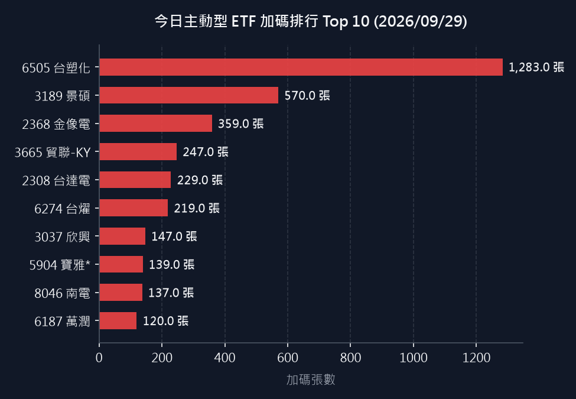
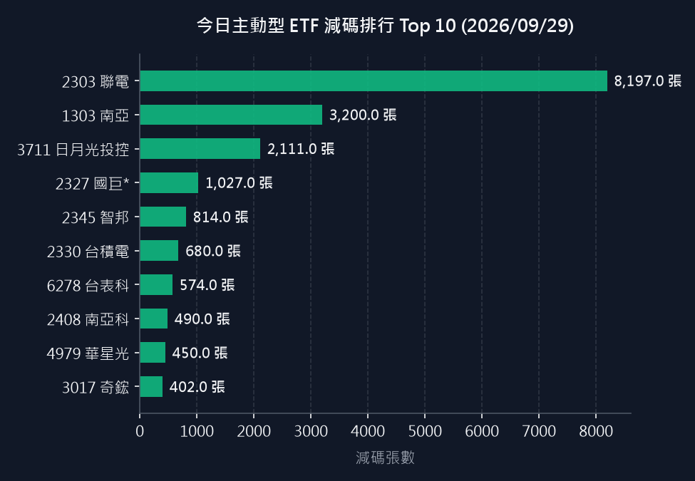

# 主動型 ETF 持股變動

資料來源：`主動型ETF持股明細.xlsx` 最近兩個日期分頁。

比較區間：`20260924` → `20260929`

## 今日加減碼視覺化排行

| 今日加碼 Top 10 | 今日減碼 Top 10 |
| :---: | :---: |
|  |  |

| ETF | 新增 | 刪除 | 比例變動 |
| :-- | --: | --: | --: |
| 00400A | 0 | 0 | 41 |
| 00401A | 0 | 0 | 49 |
| 00402A | 0 | 0 | 50 |
| 00403A | 0 | 0 | 36 |
| 00404A | 0 | 1 | 46 |
| 00405A | 0 | 0 | 34 |
| 00406A | 1 | 1 | 62 |
| 00407A | 0 | 0 | 42 |
| 00408A | 1 | 1 | 39 |
| 00980A | 0 | 0 | 44 |
| 00980D | 0 | 0 | 44 |
| 00981A | 0 | 0 | 29 |
| 00982A | 0 | 0 | 41 |
| 00983A | 1 | 1 | 34 |
| 00983D | 0 | 1 | 28 |
| 00984A | 0 | 0 | 64 |
| 00985A | 0 | 0 | 44 |
| 00986A | 0 | 0 | 34 |
| 00987A | 1 | 0 | 27 |
| 00988A | 0 | 1 | 36 |
| 00989A | 0 | 0 | 62 |
| 00990A | 0 | 0 | 42 |
| 00991A | 0 | 0 | 21 |
| 00992A | 0 | 0 | 34 |
| 00993A | 0 | 0 | 48 |
| 00994A | 0 | 1 | 29 |
| 00995A | 0 | 0 | 42 |
| 00996A | 0 | 0 | 38 |
| 00997A | 1 | 0 | 48 |
| 00998A | 1 | 1 | 50 |
| 00999A | 0 | 0 | 49 |

## 00400A

### 新增持股

- 無

### 刪除持股

- 無

### 投資比例變動

- 1303 南亞：2.80% → 3.12%（+0.32）
- 2059 川湖：5.17% → 5.19%（+0.02）
- 2303 聯電：1.14% → 1.12%（-0.02）
- 2308 台達電：3.86% → 3.82%（-0.04）
- 2313 華通：0.84% → 0.87%（+0.03）
- 2317 鴻海：0.83% → 0.84%（+0.01）
- 2330 台積電：8.77% → 8.91%（+0.14）
- 2345 智邦：1.46% → 1.43%（-0.03）
- 2360 致茂：3.71% → 3.57%（-0.14）
- 2368 金像電：1.46% → 1.47%（+0.01）
- 2383 台光電：3.87% → 3.89%（+0.02）
- 2449 京元電子：1.03% → 1.02%（-0.01）
- 2454 聯發科：7.78% → 7.06%（-0.72）
- 2603 長榮：0.96% → 0.97%（+0.01）
- 2881 富邦金：1.61% → 1.64%（+0.03）
- 2885 元大金：0.53% → 0.06%（-0.47）
- 3017 奇鋐：4.44% → 4.46%（+0.02）
- 3026 禾伸堂：1.05% → 1.12%（+0.07）
- 3036 文曄：1.54% → 1.59%（+0.05）
- 3037 欣興：4.76% → 4.90%（+0.14）
- 3044 健鼎：1.91% → 1.87%（-0.04）
- 3081 聯亞：0.75% → 0.76%（+0.01）
- 3167 大量：0.35% → 0.36%（+0.01）
- 3293 鈊象：0.33% → 0.36%（+0.03）
- 3443 創意：5.41% → 4.27%（-1.14）
- 3529 力旺：1.48% → 1.52%（+0.04）
- 3653 健策：4.81% → 5.30%（+0.49）
- 3665 貿聯-KY：1.91% → 2.05%（+0.14）
- 3711 日月光投控：1.09% → 1.11%（+0.02）
- 5274 信驊：3.26% → 3.20%（-0.06）
- 5434 崇越：0.37% → 0.38%（+0.01）
- 6121 新普：0.23% → 0.24%（+0.01）
- 6187 萬潤：2.44% → 2.72%（+0.28）
- 6223 旺矽：4.54% → 4.29%（-0.25）
- 6271 同欣電：0.26% → 0.27%（+0.01）
- 6442 光聖：0.84% → 0.30%（-0.54）
- 6488 環球晶：2.01% → 2.05%（+0.04）
- 6505 台塑化：1.45% → 2.02%（+0.57）
- 6669 緯穎：3.13% → 3.20%（+0.07）
- 7750 新代：0.81% → 0.83%（+0.02）
- 台指選擇權 2026/10：0.06% → 0.00%（-0.06）

## 00401A

### 新增持股

- 無

### 刪除持股

- 無

### 投資比例變動

- 1303 南亞：0.88% → 0.97%（+0.09）
- 2059 川湖：0.97% → 0.96%（-0.01）
- 2303 聯電：2.57% → 2.50%（-0.07）
- 2308 台達電：2.52% → 2.47%（-0.05）
- 2313 華通：1.32% → 1.35%（+0.03）
- 2317 鴻海：0.56% → 0.55%（-0.01）
- 2327 國巨*：0.61% → 0.59%（-0.02）
- 2330 台積電：19.98% → 20.08%（+0.10）
- 2345 智邦：0.82% → 0.80%（-0.02）
- 2357 華碩：1.73% → 1.76%（+0.03）
- 2360 致茂：1.43% → 1.36%（-0.07）
- 2379 瑞昱：1.03% → 1.04%（+0.01）
- 2383 台光電：0.74% → 0.73%（-0.01）
- 2454 聯發科：6.97% → 6.70%（-0.27）
- 2603 長榮：1.00% → 0.99%（-0.01）
- 2881 富邦金：1.93% → 1.94%（+0.01）
- 2882 國泰金：0.99% → 1.01%（+0.02）
- 2883 凱基金：1.63% → 1.64%（+0.01）
- 2886 兆豐金：1.28% → 1.27%（-0.01）
- 2887 台新新光金：1.06% → 1.04%（-0.02）
- 2890 永豐金：0.29% → 0.28%（-0.01）
- 2891 中信金：1.47% → 1.48%（+0.01）
- 3008 大立光：2.15% → 2.13%（-0.02）
- 3037 欣興：2.28% → 2.32%（+0.04）
- 3131 弘塑：0.68% → 0.72%（+0.04）
- 3231 緯創：1.55% → 1.62%（+0.07）
- 3491 昇達科：1.73% → 1.70%（-0.03）
- 3711 日月光投控：2.48% → 2.50%（+0.02）
- 4904 遠傳：0.71% → 0.72%（+0.01）
- 4958 臻鼎-KY：1.18% → 1.26%（+0.08）
- 4991 環宇-KY：0.87% → 0.93%（+0.06）
- 5274 信驊：2.14% → 2.07%（-0.07）
- 5347 世界：1.28% → 1.34%（+0.06）
- 5904 寶雅*：0.51% → 0.50%（-0.01）
- 6147 頎邦：1.32% → 1.30%（-0.02）
- 6187 萬潤：0.61% → 0.67%（+0.06）
- 6223 旺矽：1.66% → 1.55%（-0.11）
- 6285 啟碁：1.25% → 1.28%（+0.03）
- 6515 穎崴：1.71% → 1.64%（-0.07）
- 6531 愛普*：1.68% → 1.60%（-0.08）
- 6669 緯穎：1.79% → 1.82%（+0.03）
- 7769 鴻勁：1.36% → 1.29%（-0.07）
- 7828 創新服務：1.80% → 1.76%（-0.04）
- 7856 漢測：0.50% → 0.47%（-0.03）
- 8464 億豐：0.97% → 0.98%（+0.01）
- 台股期貨10/26(FITXN*1.TF)：0.33% → 0.26%（-0.07）
- 臺指選擇權10/26 46000 買權：-0.07% → -0.06%（+0.01）
- 臺指選擇權10/26 46400 買權：-1.00% → -0.82%（+0.18）
- 臺指選擇權10/26 46800 買權：-0.05% → -0.04%（+0.01）

## 00402A

### 新增持股

- 無

### 刪除持股

- 無

### 投資比例變動

- AAPL.US Apple：7.59% → 7.58%（-0.01）
- ADI.US Analog Devices：1.74% → 1.69%（-0.05）
- AMD.US AMD：6.25% → 6.36%（+0.11）
- AMZN.US Amazon：4.10% → 4.01%（-0.09）
- ANET.US Arista Networks：0.89% → 0.96%（+0.07）
- ARM.US Arm：0.93% → 0.92%（-0.01）
- ASML.US ASML Holding：1.14% → 1.21%（+0.07）
- AVGO.US Broadcom：2.20% → 2.29%（+0.09）
- AXON.US Axon Enterprise：0.72% → 0.54%（-0.18）
- BABA.US Alibaba Group：0.56% → 0.58%（+0.02）
- BKNG.US Booking Holdings：0.57% → 0.44%（-0.13）
- CDNS.US Cadence Design Systems：1.35% → 1.55%（+0.20）
- CIEN.US Ciena：1.25% → 1.17%（-0.08）
- CLS.US Celestica：1.01% → 1.15%（+0.14）
- COHR.US Coherent：1.69% → 1.50%（-0.19）
- CRWD.US CrowdStrike Holdings：1.60% → 1.67%（+0.07）
- DASH.US DoorDash：0.49% → 0.41%（-0.08）
- FSLY.US Fastly：0.40% → 0.44%（+0.04）
- GOOG.US Alphabet - Class C Capital Stock：3.06% → 2.91%（-0.15）
- GOOGL.US Alphabet - Class A Common Stock：3.49% → 3.25%（-0.24）
- INTC.US Intel：1.51% → 1.68%（+0.17）
- IOT.US Samsara：0.51% → 0.57%（+0.06）
- KLAC.US KLA：1.62% → 1.74%（+0.12）
- LITE.US Lumentum：1.71% → 1.59%（-0.12）
- LRCX.US Lam Research：2.77% → 2.73%（-0.04）
- MCHP.US Microchip Technology：1.17% → 1.25%（+0.08）
- MDB.US MongoDB：0.50% → 0.53%（+0.03）
- META.US Meta：3.59% → 4.11%（+0.52）
- MRVL.US Marvell：1.41% → 1.51%（+0.10）
- MSFT.US Microsoft：4.67% → 5.06%（+0.39）
- MU.US Micron：7.07% → 7.06%（-0.01）
- NFLX.US Netflix：0.81% → 0.87%（+0.06）
- NOW.US ServiceNow：0.82% → 0.89%（+0.07）
- NVDA.US NVIDIA：8.62% → 8.67%（+0.05）
- PANW.US Palo Alto：2.57% → 2.90%（+0.33）
- PLTR.US Palantir Technologies：1.85% → 1.92%（+0.07）
- SHOP.US Shopify：0.91% → 0.86%（-0.05）
- SIMO.US Silicon Motion：0.87% → 0.62%（-0.25）
- SKHY.US SK hynix：1.16% → 1.20%（+0.04）
- SNOW.US Snowflake：1.08% → 1.16%（+0.08）
- SPCX.US SpaceX：0.81% → 0.84%（+0.03）
- SPOT.US Spotify：0.49% → 0.54%（+0.05）
- STX.US Seagate：1.45% → 1.55%（+0.10）
- TER.US Teradyne：0.94% → 0.84%（-0.10）
- TSM.US TSMC(ADR)：1.57% → 1.70%（+0.13）
- TTWO.US Take-Two：0.65% → 0.69%（+0.04）
- TXN.US Texas Instruments：2.24% → 2.26%（+0.02）
- UBER.US Uber：0.46% → 0.27%（-0.19）
- V.US Visa：1.01% → 1.11%（+0.10）
- WDC.US Western Digital：2.29% → 2.40%（+0.11）

## 00403A

### 新增持股

- 無

### 刪除持股

- 無

### 投資比例變動

- 1303 南亞：2.01% → 1.70%（-0.31）
- 1560 中砂：0.12% → 0.13%（+0.01）
- 2059 川湖：0.61% → 0.62%（+0.01）
- 2303 聯電：6.28% → 5.48%（-0.80）
- 2308 台達電：3.60% → 3.66%（+0.06）
- 2317 鴻海：0.54% → 0.55%（+0.01）
- 2327 國巨*：3.00% → 3.01%（+0.01）
- 2330 台積電：13.73% → 13.09%（-0.64）
- 2345 智邦：2.35% → 2.24%（-0.11）
- 2360 致茂：0.71% → 0.21%（-0.50）
- 2383 台光電：5.25% → 4.73%（-0.52）
- 2408 南亞科：0.94% → 0.97%（+0.03）
- 2449 京元電子：0.80% → 0.81%（+0.01）
- 2454 聯發科：7.49% → 7.45%（-0.04）
- 2481 強茂：0.34% → 0.36%（+0.02）
- 2882 國泰金：0.29% → 0.31%（+0.02）
- 3008 大立光：1.13% → 1.16%（+0.03）
- 3017 奇鋐：6.47% → 5.84%（-0.63）
- 3037 欣興：6.42% → 6.77%（+0.35）
- 3189 景碩：2.37% → 2.83%（+0.46）
- 3211 順達：0.50% → 0.53%（+0.03）
- 3443 創意：3.54% → 3.32%（-0.22）
- 3450 聯鈞：0.51% → 0.54%（+0.03）
- 3583 辛耘：0.36% → 0.39%（+0.03）
- 3653 健策：4.67% → 5.28%（+0.61）
- 3665 貿聯-KY：1.98% → 2.17%（+0.19）
- 6223 旺矽：4.04% → 3.92%（-0.12）
- 6274 台燿：1.81% → 1.94%（+0.13）
- 6285 啟碁：0.05% → 0.06%（+0.01）
- 6442 光聖：0.35% → 0.36%（+0.01）
- 6488 環球晶：1.74% → 1.82%（+0.08）
- 6669 緯穎：2.52% → 2.55%（+0.03）
- 6805 富世達：1.43% → 1.45%（+0.02）
- 7769 鴻勁：0.31% → 0.00%（-0.31）
- 8046 南電：2.19% → 2.53%（+0.34）
- 8996 高力：1.64% → 1.85%（+0.21）

## 00404A

### 新增持股

- 無

### 刪除持股

- 6691 洋基工程（0.19%，12.6 張）

### 投資比例變動

- 1303 南亞：0.73% → 0.80%（+0.07）
- 2027 大成鋼：1.54% → 1.58%（+0.04）
- 2059 川湖：1.15% → 1.14%（-0.01）
- 2303 聯電：2.16% → 2.11%（-0.05）
- 2308 台達電：1.85% → 1.81%（-0.04）
- 2330 台積電：22.93% → 23.07%（+0.14）
- 2345 智邦：0.83% → 0.81%（-0.02）
- 2347 聯強：1.89% → 1.92%（+0.03）
- 2351 順德：0.38% → 0.37%（-0.01）
- 2357 華碩：0.89% → 0.91%（+0.02）
- 2360 致茂：0.70% → 0.67%（-0.03）
- 2379 瑞昱：1.09% → 1.11%（+0.02）
- 2382 廣達：2.10% → 2.11%（+0.01）
- 2383 台光電：3.02% → 3.01%（-0.01）
- 2395 研華：1.25% → 1.32%（+0.07）
- 2436 偉詮電：1.11% → 1.23%（+0.12）
- 2454 聯發科：6.91% → 6.65%（-0.26）
- 2542 興富發：1.53% → 1.52%（-0.01）
- 2637 慧洋-KY：1.14% → 1.10%（-0.04）
- 2883 凱基金：1.18% → 1.19%（+0.01）
- 2885 元大金：2.43% → 2.44%（+0.01）
- 2887 台新新光金：1.40% → 1.39%（-0.01）
- 2890 永豐金：1.45% → 1.43%（-0.02）
- 2892 第一金：1.88% → 1.85%（-0.03）
- 3017 奇鋐：1.37% → 1.36%（-0.01）
- 3034 聯詠：2.02% → 2.03%（+0.01）
- 3264 欣銓：0.40% → 0.39%（-0.01）
- 3293 鈊象：0.47% → 0.51%（+0.04）
- 3443 創意：0.78% → 0.75%（-0.03）
- 3680 家登：0.46% → 0.49%（+0.03）
- 3711 日月光投控：3.47% → 3.49%（+0.02）
- 4763 材料*-KY：1.59% → 1.63%（+0.04）
- 5274 信驊：2.56% → 2.48%（-0.08）
- 5434 崇越：1.78% → 1.81%（+0.03）
- 5904 寶雅*：0.46% → 0.45%（-0.01）
- 6196 帆宣：1.87% → 1.88%（+0.01）
- 6206 飛捷：1.01% → 1.06%（+0.05）
- 6223 旺矽：1.24% → 1.16%（-0.08）
- 6257 矽格：1.75% → 1.70%（-0.05）
- 6515 穎崴：0.14% → 0.13%（-0.01）
- 7769 鴻勁：1.25% → 1.18%（-0.07）
- 8016 矽創：1.17% → 1.20%（+0.03）
- 8081 致新：0.81% → 0.84%（+0.03）
- 8299 群聯：1.18% → 1.15%（-0.03）
- 台指選擇權10/26 49500 買權：-0.23% → -0.16%（+0.07）
- 台股期貨10/26(FITXN*1.TF)：15.44% → 15.52%（+0.08）

## 00405A

### 新增持股

- 無

### 刪除持股

- 無

### 投資比例變動

- 2059 川湖：1.88% → 1.97%（+0.09）
- 2303 聯電：1.03% → 1.06%（+0.03）
- 2308 台達電：0.65% → 0.67%（+0.02）
- 2330 台積電：1.62% → 1.71%（+0.09）
- 2345 智邦：3.61% → 3.71%（+0.10）
- 2368 金像電：4.64% → 4.88%（+0.24）
- 2383 台光電：3.84% → 4.04%（+0.20）
- 2454 聯發科：8.99% → 6.54%（-2.45）
- 3017 奇鋐：4.74% → 4.97%（+0.23）
- 3037 欣興：7.21% → 7.75%（+0.54）
- 3443 創意：9.21% → 6.53%（-2.68）
- 3450 聯鈞：1.22% → 1.32%（+0.10）
- 3653 健策：6.02% → 6.94%（+0.92）
- 3665 貿聯-KY：5.62% → 6.29%（+0.67）
- 4576 大銀微系統：0.06% → 0.07%（+0.01）
- 4749 新應材：0.25% → 0.28%（+0.03）
- 5274 信驊：3.98% → 4.08%（+0.10）
- 5347 世界：0.13% → 0.15%（+0.02）
- 6187 萬潤：0.64% → 0.75%（+0.11）
- 6223 旺矽：6.56% → 6.48%（-0.08）
- 6274 台燿：1.61% → 1.76%（+0.15）
- 6278 台表科：1.06% → 1.17%（+0.11）
- 6285 啟碁：0.33% → 0.36%（+0.03）
- 6488 環球晶：0.38% → 0.40%（+0.02）
- 6510 精測：3.08% → 2.98%（-0.10）
- 6515 穎崴：0.50% → 0.51%（+0.01）
- 6526 達發：0.44% → 0.46%（+0.02）
- 6531 愛普*：3.67% → 3.70%（+0.03）
- 6669 緯穎：0.75% → 0.81%（+0.06）
- 6805 富世達：4.14% → 4.29%（+0.15）
- 6831 邁科：0.47% → 0.48%（+0.01）
- 7734 印能科技：1.03% → 1.14%（+0.11）
- 8046 南電：3.23% → 3.63%（+0.40）
- 8996 高力：1.57% → 1.73%（+0.16）

## 00406A

### 新增持股

- 臺指選擇權第一週週五到期契約（-3.81%，-1.5 張）

### 刪除持股

- 臺指選擇權第四週週五到期契約（-14.07%，-3.5 張）

### 投資比例變動

- 1326 台化：0.33% → 0.31%（-0.02）
- 1560 中砂：0.82% → 0.74%（-0.08）
- 2059 川湖：2.00% → 1.77%（-0.23）
- 2303 聯電：1.43% → 1.69%（+0.26）
- 2308 台達電：2.89% → 3.39%（+0.50）
- 2317 鴻海：0.72% → 0.64%（-0.08）
- 2327 國巨*：1.90% → 1.64%（-0.26）
- 2330 台積電：9.42% → 9.39%（-0.03）
- 2344 華邦電：0.41% → 0.37%（-0.04）
- 2345 智邦：3.60% → 3.11%（-0.49）
- 2360 致茂：0.77% → 0.69%（-0.08）
- 2368 金像電：0.41% → 0.37%（-0.04）
- 2383 台光電：5.45% → 5.25%（-0.20）
- 2395 研華：0.17% → 0.16%（-0.01）
- 2449 京元電子：0.81% → 0.70%（-0.11）
- 2454 聯發科：6.47% → 5.52%（-0.95）
- 2455 全新：0.17% → 0.15%（-0.02）
- 2481 強茂：0.37% → 0.34%（-0.03）
- 2486 一詮：0.39% → 0.36%（-0.03）
- 2885 元大金：0.93% → 1.08%（+0.15）
- 2886 兆豐金：0.25% → 0.22%（-0.03）
- 3008 大立光：0.50% → 0.44%（-0.06）
- 3017 奇鋐：5.82% → 5.33%（-0.49）
- 3037 欣興：5.05% → 5.04%（-0.01）
- 3081 聯亞：0.53% → 0.47%（-0.06）
- 3105 穩懋：0.22% → 0.19%（-0.03）
- 3167 大量：0.81% → 0.74%（-0.07）
- 3189 景碩：1.01% → 0.96%（-0.05）
- 3260 威剛：0.14% → 0.12%（-0.02）
- 3264 欣銓：0.31% → 0.26%（-0.05）
- 3363 上詮：0.51% → 0.46%（-0.05）
- 3443 創意：2.31% → 1.97%（-0.34）
- 3450 聯鈞：0.33% → 0.30%（-0.03）
- 3491 昇達科：0.92% → 0.80%（-0.12）
- 3583 辛耘：0.11% → 0.10%（-0.01）
- 3653 健策：3.51% → 3.66%（+0.15）
- 3665 貿聯-KY：2.13% → 3.35%（+1.22）
- 3711 日月光投控：1.56% → 2.27%（+0.71）
- 4958 臻鼎-KY：0.55% → 0.53%（-0.02）
- 5274 信驊：2.79% → 3.29%（+0.50）
- 5289 宜鼎：0.07% → 0.06%（-0.01）
- 6139 亞翔：0.11% → 0.10%（-0.01）
- 6147 頎邦：0.46% → 0.40%（-0.06）
- 6187 萬潤：0.39% → 0.38%（-0.01）
- 6213 聯茂：0.55% → 0.57%（+0.02）
- 6223 旺矽：3.97% → 3.79%（-0.18）
- 6274 台燿：1.50% → 1.38%（-0.12）
- 6285 啟碁：0.15% → 0.14%（-0.01）
- 6488 環球晶：0.71% → 0.64%（-0.07）
- 6510 精測：1.55% → 1.26%（-0.29）
- 6515 穎崴：0.65% → 0.56%（-0.09）
- 6531 愛普*：0.33% → 0.28%（-0.05）
- 6669 緯穎：3.03% → 2.73%（-0.30）
- 6805 富世達：0.23% → 0.20%（-0.03）
- 7769 鴻勁：0.93% → 0.42%（-0.51）
- 8046 南電：2.65% → 2.51%（-0.14）
- 8150 南茂：0.10% → 0.09%（-0.01）
- 8210 勤誠：0.13% → 0.11%（-0.02）
- 8358 金居：0.24% → 0.21%（-0.03）
- 8996 高力：0.47% → 0.44%（-0.03）
- 臺指選擇權第五週週三到期契約：-5.88% → -13.16%（-7.28）
- 臺股期貨 202610(FITXN*1.TF)：22.86% → 20.39%（-2.47）

## 00407A

### 新增持股

- 無

### 刪除持股

- 無

### 投資比例變動

- 1303 南亞：0.72% → 0.77%（+0.05）
- 1560 中砂：1.03% → 1.04%（+0.01）
- 2059 川湖：2.67% → 2.68%（+0.01）
- 2303 聯電：0.59% → 0.60%（+0.01）
- 2308 台達電：2.69% → 2.65%（-0.04）
- 2327 國巨*：2.26% → 2.19%（-0.07）
- 2330 台積電：8.95% → 9.16%（+0.21）
- 2344 華邦電：0.13% → 0.14%（+0.01）
- 2345 智邦：2.54% → 2.48%（-0.06）
- 2360 致茂：1.81% → 1.77%（-0.04）
- 2368 金像電：0.55% → 0.57%（+0.02）
- 2379 瑞昱：0.22% → 0.23%（+0.01）
- 2383 台光電：4.95% → 4.94%（-0.01）
- 2408 南亞科：0.93% → 0.96%（+0.03）
- 2451 創見：0.31% → 0.32%（+0.01）
- 2454 聯發科：6.19% → 5.89%（-0.30）
- 2615 萬海：0.68% → 0.67%（-0.01）
- 3008 大立光：1.43% → 1.41%（-0.02）
- 3017 奇鋐：5.80% → 5.69%（-0.11）
- 3034 聯詠：0.72% → 0.73%（+0.01）
- 3037 欣興：5.66% → 5.70%（+0.04）
- 3081 聯亞：1.33% → 1.34%（+0.01）
- 3131 弘塑：0.84% → 0.88%（+0.04）
- 3231 緯創：0.71% → 0.73%（+0.02）
- 3293 鈊象：0.57% → 0.59%（+0.02）
- 3443 創意：5.07% → 4.82%（-0.25）
- 3491 昇達科：0.92% → 0.91%（-0.01）
- 3529 力旺：0.67% → 0.70%（+0.03）
- 3653 健策：3.51% → 3.58%（+0.07）
- 3665 貿聯-KY：2.20% → 2.35%（+0.15）
- 3711 日月光投控：2.90% → 2.92%（+0.02）
- 4958 臻鼎-KY：0.87% → 0.93%（+0.06）
- 6187 萬潤：1.33% → 1.49%（+0.16）
- 6223 旺矽：2.70% → 2.65%（-0.05）
- 6274 台燿：3.51% → 3.57%（+0.06）
- 6446 藥華藥：0.30% → 0.32%（+0.02）
- 6510 精測：1.38% → 1.34%（-0.04）
- 6531 愛普*：0.33% → 0.32%（-0.01）
- 6669 緯穎：3.68% → 3.74%（+0.06）
- 6805 富世達：2.18% → 2.22%（+0.04）
- 8046 南電：1.83% → 1.92%（+0.09）
- 8996 高力：2.06% → 2.19%（+0.13）

## 00408A

### 新增持股

- 3026 禾伸堂（0.33%，6 張）

### 刪除持股

- 2317 鴻海（1.73%，100 張）

### 投資比例變動

- 1303 南亞：1.24% → 1.36%（+0.12）
- 2059 川湖：0.42% → 0.41%（-0.01）
- 2303 聯電：3.49% → 3.38%（-0.11）
- 2308 台達電：2.94% → 2.87%（-0.07）
- 2345 智邦：0.89% → 0.74%（-0.15）
- 2357 華碩：1.94% → 1.97%（+0.03）
- 2360 致茂：1.26% → 1.19%（-0.07）
- 2368 金像電：3.54% → 3.51%（-0.03）
- 2383 台光電：2.71% → 2.52%（-0.19）
- 2395 研華：1.61% → 1.69%（+0.08）
- 2408 南亞科：2.54% → 2.28%（-0.26）
- 2449 京元電子：1.54% → 1.51%（-0.03）
- 2454 聯發科：6.44% → 6.21%（-0.23）
- 2481 強茂：1.12% → 1.15%（+0.03）
- 2542 興富發：3.60% → 3.56%（-0.04）
- 3008 大立光：0.84% → 0.82%（-0.02）
- 3017 奇鋐：5.39% → 3.48%（-1.91）
- 3037 欣興：4.15% → 4.21%（+0.06）
- 3045 台灣大：2.08% → 1.03%（-1.05）
- 3189 景碩：1.65% → 2.22%（+0.57）
- 3231 緯創：0.36% → 0.38%（+0.02）
- 3264 欣銓：0.75% → 0.72%（-0.03）
- 3443 創意：0.57% → 0.54%（-0.03）
- 3491 昇達科：1.06% → 1.03%（-0.03）
- 3653 健策：2.60% → 2.82%（+0.22）
- 3665 貿聯-KY：0.16% → 0.67%（+0.51）
- 3711 日月光投控：1.54% → 1.55%（+0.01）
- 5434 崇越：2.12% → 2.14%（+0.02）
- 6187 萬潤：0.89% → 0.98%（+0.09）
- 6223 旺矽：2.28% → 2.05%（-0.23）
- 6239 力成：1.30% → 1.28%（-0.02）
- 6274 台燿：2.37% → 2.84%（+0.47）
- 6669 緯穎：3.80% → 3.84%（+0.04）
- 6805 富世達：1.58% → 1.54%（-0.04）
- 7769 鴻勁：1.01% → 0.57%（-0.44）
- 8046 南電：1.72% → 1.82%（+0.10）
- 8996 高力：1.87% → 1.95%（+0.08）
- 9802 鈺齊-KY：1.35% → 1.11%（-0.24）
- 9941 裕融：0.82% → 0.28%（-0.54）

## 00980A

### 新增持股

- 無

### 刪除持股

- 無

### 投資比例變動

- 1303 南亞：2.85% → 3.00%（+0.15）
- 2059 川湖：4.10% → 4.08%（-0.02）
- 2308 台達電：3.82% → 3.72%（-0.10）
- 2317 鴻海：2.38% → 2.42%（+0.04）
- 2327 國巨*：1.39% → 1.33%（-0.06）
- 2330 台積電：9.23% → 9.36%（+0.13）
- 2344 華邦電：1.95% → 2.00%（+0.05）
- 2345 智邦：1.63% → 1.58%（-0.05）
- 2360 致茂：1.68% → 1.62%（-0.06）
- 2368 金像電：2.15% → 2.21%（+0.06）
- 2376 技嘉：1.24% → 1.26%（+0.02）
- 2382 廣達：1.65% → 1.67%（+0.02）
- 2383 台光電：3.40% → 3.36%（-0.04）
- 2408 南亞科：2.73% → 2.79%（+0.06）
- 2454 聯發科：6.52% → 6.14%（-0.38）
- 2891 中信金：1.25% → 1.28%（+0.03）
- 3008 大立光：0.80% → 0.79%（-0.01）
- 3017 奇鋐：2.36% → 2.29%（-0.07）
- 3026 禾伸堂：1.15% → 1.14%（-0.01）
- 3036 文曄：1.18% → 1.20%（+0.02）
- 3037 欣興：3.47% → 3.46%（-0.01）
- 3044 健鼎：0.92% → 0.90%（-0.02）
- 3081 聯亞：1.72% → 1.71%（-0.01）
- 3189 景碩：1.54% → 1.55%（+0.01）
- 3231 緯創：1.19% → 1.21%（+0.02）
- 3293 鈊象：0.95% → 0.99%（+0.04）
- 3443 創意：2.49% → 2.35%（-0.14）
- 3529 力旺：0.70% → 0.73%（+0.03）
- 3533 嘉澤：0.29% → 0.30%（+0.01）
- 3653 健策：2.36% → 2.39%（+0.03）
- 3665 貿聯-KY：0.56% → 0.59%（+0.03）
- 3711 日月光投控：2.15% → 2.14%（-0.01）
- 4958 臻鼎-KY：0.71% → 0.76%（+0.05）
- 5274 信驊：1.99% → 1.98%（-0.01）
- 5904 寶雅*：1.07% → 1.08%（+0.01）
- 6213 聯茂：1.42% → 1.50%（+0.08）
- 6223 旺矽：1.77% → 1.72%（-0.05）
- 6274 台燿：1.78% → 1.79%（+0.01）
- 6515 穎崴：1.59% → 1.57%（-0.02）
- 6669 緯穎：1.62% → 1.64%（+0.02）
- 8046 南電：1.54% → 1.60%（+0.06）
- 8299 群聯：1.77% → 1.78%（+0.01）
- 8996 高力：1.37% → 1.44%（+0.07）
- 台灣證交所加權股價指數(FITXN*1.TF)：2.96% → 2.98%（+0.02）

## 00980D

### 新增持股

- 無

### 刪除持股

- 無

### 投資比例變動

- ALLY FINANCIAL INC (REG) 7.1% 15NOV2027：0.44% → 0.45%（+0.01）
- ARCELORMITTAL SA 6.55% 29NOV2027：0.55% → 0.56%（+0.01）
- ARSENAL AIC PARENT LLC SER REGS 11.5 % 01-OCT-2031：0.32% → 0.33%（+0.01）
- ATHENE HOLDING LTD (REG) 6.25% 01APR2054：0.77% → 0.76%（-0.01）
- ATHENE HOLDING LTD 6.625000 % 19MAY2055：0.57% → 0.56%（-0.01）
- BAT CAPITAL CORP (REG) 7.081% 02AUG2053：0.58% → 0.57%（-0.01）
- BAYER US FINANCE LLC SER REGS 6.875000 % 21NOV2053：0.36% → 0.35%（-0.01）
- BLACKSTONE PRIVATE CRE 7.300000 % 27NOV2028：0.47% → 0.48%（+0.01）
- BLUE OWL TECHNOLOGY FIN CORP II 6.75 % 04APR2029：0.56% → 0.57%（+0.01）
- BPCE SA SER REGS VAR 14JAN2046：0.40% → 0.39%（-0.01）
- CONCENTRIX CORP (REG) 6.85% 02AUG2033：0.72% → 0.71%（-0.01）
- COX COMMUNICATIONS INC SER REGS 5.950000 % 01SEP2054：0.54% → 0.53%（-0.01）
- DEUTSCHE TELEKOM INT FIN (REG) 8.75% 15JUN2030：0.41% → 0.42%（+0.01）
- DIRECTV FIN LLC/COINC SER REGS 10.000000 % 15FEB2031：0.41% → 0.42%（+0.01）
- DOW CHEMICAL CO/THE (REG) 5.6% 15FEB2054：0.61% → 0.60%（-0.01）
- EDISON INTERNATIONAL (REG) 6.95% 15NOV2029：0.58% → 0.59%（+0.01）
- ENBRIDGE ENERGY PARTNERS (REG) 7.375% 15OCT2045：0.52% → 0.51%（-0.01）
- FMC CORP (REG) 6.375000 % 18MAY2053：0.46% → 0.45%（-0.01）
- FORD MOTOR COMPANY 5.291% 08DEC2046：0.29% → 0.28%（-0.01）
- HSBC HOLDINGS PLC VAR 03NOV2028：0.33% → 0.34%（+0.01）
- ICAHN ENTERPRISES/FIN (REG) 9.75% 15JAN2029：0.32% → 0.33%（+0.01）
- ICAHN ENTERPRISES/FIN SER REGS 10.000000 % 15NOV2029：0.32% → 0.33%（+0.01）
- LADDER CAP FIN LLLP/CORP SER REGS 7.000000 % 15JUL2031：0.33% → 0.34%（+0.01）
- MOHEGAN TRIBAL / MS DIG SER REGS 11.875000 % 15APR2031：0.68% → 0.69%（+0.01）
- MYLAN NV 5.25% 15JUN2046 WI：0.54% → 0.53%（-0.01）
- NAVIENT CORP (REG) 11.5% 15MAR2031：0.32% → 0.33%（+0.01）
- OPEN TEXT CORP SER REGS (REG) (REG S) 6.9% 01DEC2027：0.67% → 0.68%（+0.01）
- ORACLE CORP 6.000000 % 03AUG2055：0.31% → 0.30%（-0.01）
- ORACLE CORP 6.7 % 04-FEB-2056：0.21% → 0.20%（-0.01）
- ORACLE CORP 6.85 % 04-FEB-2066：0.56% → 0.55%（-0.01）
- PHOTO HOLDINGS LLC SER REGS (REG) (REG S) 12% 01JUL2031：0.52% → 0.53%（+0.01）
- RIO TINTO FIN USA LTD (REG) 7.125% 15JUL2028：0.57% → 0.58%（+0.01）
- SABRE FINANCIAL BORROWER SER REGS 11.125 % 15-JUN-2029：0.56% → 0.57%（+0.01）
- SALESFORCE INC (REG) 6.55% 15MAR2056：0.55% → 0.54%（-0.01）
- SALESFORCE INC (REG) 6.7% 15MAR2066：0.54% → 0.53%（-0.01）
- SANTANDER HOLDINGS USA VAR 09NOV2031：0.59% → 0.60%（+0.01）
- SES GLOBAL AMERICAS HLDG SER REGS (REG) 5.300000 % 25MAR2044：0.32% → 0.31%（-0.01）
- SOCIETE GENERALE SER REGS (REG) (REG S) 7.367% 10JAN2053：0.33% → 0.32%（-0.01）
- STAPLES INC SER REGS (REG S) 10.75% 01SEP2029：0.50% → 0.51%（+0.01）
- UNISYS CORP SER REGS 10.625000 % 15JAN2031：0.60% → 0.59%（-0.01）
- US 10YR NOTE (CBT)DEC26 21-DEC-2026：17.82% → 17.91%（+0.09）
- US 2YR NOTE (CBT) DEC26 31-DEC-2026：1.66% → 1.67%（+0.01）
- US 5YR NOTE (CBT) DEC26 31-DEC-2026：-13.69% → -13.77%（-0.08）
- VAR ENERGI ASA SER REGS (REG S) 7.5% 15JAN2028：0.33% → 0.34%（+0.01）

## 00981A

### 新增持股

- 無

### 刪除持股

- 無

### 投資比例變動

- 2303 聯電：4.87% → 4.71%（-0.16）
- 2308 台達電：4.81% → 4.78%（-0.03）
- 2327 國巨*：4.91% → 4.78%（-0.13）
- 2330 台積電：10.12% → 10.00%（-0.12）
- 2345 智邦：4.17% → 4.00%（-0.17）
- 2368 金像電：0.65% → 0.80%（+0.15）
- 2383 台光電：8.14% → 8.06%（-0.08）
- 2449 京元電子：1.36% → 1.34%（-0.02）
- 2454 聯發科：9.18% → 8.80%（-0.38）
- 3017 奇鋐：7.05% → 7.06%（+0.01）
- 3037 欣興：8.04% → 8.25%（+0.21）
- 3264 欣銓：0.45% → 0.42%（-0.03）
- 3376 新日興：0.10% → 0.11%（+0.01）
- 3443 創意：1.18% → 1.08%（-0.10）
- 3653 健策：5.50% → 6.08%（+0.58）
- 3665 貿聯-KY：3.15% → 3.34%（+0.19）
- 3711 日月光投控：3.66% → 3.14%（-0.52）
- 4958 臻鼎-KY：0.57% → 0.61%（+0.04）
- 5274 信驊：1.44% → 1.15%（-0.29）
- 6187 萬潤：0.00% → 0.06%（+0.06）
- 6223 旺矽：4.88% → 4.57%（-0.31）
- 6274 台燿：2.96% → 3.22%（+0.26）
- 6278 台表科：0.23% → 0.20%（-0.03）
- 6510 精測：0.30% → 0.28%（-0.02）
- 6669 緯穎：3.69% → 3.56%（-0.13）
- 6805 富世達：1.57% → 1.48%（-0.09）
- 8046 南電：3.73% → 4.00%（+0.27）
- 8996 高力：0.25% → 0.27%（+0.02）
- 台指期貨 2026/10(FITXN*1.TF)：2.24% → 2.29%（+0.05）

## 00982A

### 新增持股

- 無

### 刪除持股

- 無

### 投資比例變動

- 2303 聯電：1.56% → 1.58%（+0.02）
- 2330 台積電：8.77% → 8.94%（+0.17）
- 2345 智邦：2.03% → 1.48%（-0.55）
- 2360 致茂：3.69% → 3.59%（-0.10）
- 2376 技嘉：1.24% → 1.27%（+0.03）
- 2377 微星：1.00% → 1.02%（+0.02）
- 2383 台光電：3.08% → 3.06%（-0.02）
- 2395 研華：1.37% → 1.42%（+0.05）
- 2428 興勤：1.14% → 1.15%（+0.01）
- 2454 聯發科：7.68% → 7.28%（-0.40）
- 2467 志聖：1.04% → 1.10%（+0.06）
- 2476 鉅祥：0.31% → 0.32%（+0.01）
- 2486 一詮：0.74% → 0.77%（+0.03）
- 2885 元大金：0.30% → 0.31%（+0.01）
- 3008 大立光：3.10% → 3.04%（-0.06）
- 3017 奇鋐：2.61% → 2.55%（-0.06）
- 3090 日電貿：1.07% → 1.06%（-0.01）
- 3105 穩懋：5.66% → 5.67%（+0.01）
- 3231 緯創：1.33% → 1.36%（+0.03）
- 3265 台星科：1.21% → 1.22%（+0.01）
- 3491 昇達科：3.62% → 3.59%（-0.03）
- 3529 力旺：0.59% → 0.62%（+0.03）
- 3583 辛耘：1.09% → 1.13%（+0.04）
- 4958 臻鼎-KY：2.97% → 3.17%（+0.20）
- 5274 信驊：1.41% → 1.40%（-0.01）
- 5425 台半：1.19% → 1.23%（+0.04）
- 5483 中美晶：1.27% → 1.30%（+0.03）
- 5536 聖暉*：0.81% → 0.83%（+0.02）
- 6139 亞翔：5.50% → 5.45%（-0.05）
- 6196 帆宣：0.34% → 0.33%（-0.01）
- 6213 聯茂：0.45% → 0.47%（+0.02）
- 6214 精誠：1.29% → 1.31%（+0.02）
- 6223 旺矽：3.22% → 3.14%（-0.08）
- 6274 台燿：1.23% → 1.25%（+0.02）
- 6472 保瑞：0.86% → 0.88%（+0.02）
- 6488 環球晶：2.03% → 2.06%（+0.03）
- 6531 愛普*：4.00% → 3.82%（-0.18）
- 6640 均華：0.29% → 0.30%（+0.01）
- 6669 緯穎：4.25% → 4.30%（+0.05）
- 6672 騰輝電子-KY：0.35% → 0.36%（+0.01）
- 8996 高力：1.15% → 1.22%（+0.07）

## 00983A

### 新增持股

- RKLB.US Rocket Lab（0.55%，2.41 張）

### 刪除持股

- 火箭實驗室美國公司（0.54%，2.41 張）

### 投資比例變動

- ACHR.US Archer：0.74% → 0.72%（-0.02）
- AMD.US AMD：3.28% → 3.29%（+0.01）
- AMZN.US Amazon：2.45% → 2.40%（-0.05）
- AVGO.US Broadcom：0.91% → 0.88%（-0.03）
- BEAM.US Beam Therapeutics：1.40% → 1.39%（-0.01）
- BLSH.US Bullish：2.46% → 2.38%（-0.08）
- CBRS.US Cerebras：1.08% → 1.06%（-0.02）
- COIN.US Coinbase：4.65% → 4.57%（-0.08）
- CRCL.US Circle：5.06% → 5.02%（-0.04）
- CRSP.US CRISPR Therapeutics：3.85% → 3.76%（-0.09）
- CRWV.US CoreWeave：1.21% → 1.23%（+0.02）
- DE.US Deere：0.51% → 0.49%（-0.02）
- GOOG.US Alphabet - Class C Capital Stock：1.41% → 1.39%（-0.02）
- HOOD.US Robinhood Markets：4.63% → 4.46%（-0.17）
- ILMN.US Illumina：1.73% → 1.82%（+0.09）
- LLY.US Eli Lilly：0.78% → 0.79%（+0.01）
- META.US Meta：0.75% → 0.77%（+0.02）
- NTLA.US Intellia Therapeutics：0.56% → 0.54%（-0.02）
- NTRA.US Natera：1.65% → 1.69%（+0.04）
- NVDA.US NVIDIA：2.35% → 2.29%（-0.06）
- PLTR.US Palantir Technologies：3.23% → 3.17%（-0.06）
- RXRX.US Recursion Pharmaceuticals：0.77% → 0.80%（+0.03）
- SNOW.US Snowflake：0.51% → 0.49%（-0.02）
- SPCX.US SpaceX：5.97% → 5.83%（-0.14）
- TEM.US Tempus：5.61% → 5.89%（+0.28）
- TER.US Teradyne：0.61% → 0.59%（-0.02）
- TSLA.US Tesla：8.90% → 8.65%（-0.25）
- TSM.US TSMC(ADR)：2.50% → 2.47%（-0.03）
- TWST.US Twist Bioscience：4.30% → 4.89%（+0.59）
- TXG.US 10x Genomics：3.89% → 4.24%（+0.35）
- VCYT.US Veracyte：0.11% → 0.12%（+0.01）
- WGS.US GeneDx：1.14% → 1.16%（+0.02）
- XE.US X-Energy：0.79% → 0.74%（-0.05）
- XYZ.US Block：1.23% → 1.24%（+0.01）

## 00983D

### 新增持股

- 無

### 刪除持股

- PDM 9 1/4 07/20/28（1.17%，N/A 張）

### 投資比例變動

- ALLY 8 11/01/31：1.18% → 1.19%（+0.01）
- AMCX 10 1/2 07/15/32：1.63% → 1.62%（-0.01）
- BATSLN 7.079 08/02/43：1.07% → 1.06%（-0.01）
- BATSLN 7.081 08/02/53：1.31% → 1.30%（-0.01）
- BHCCN 11 09/30/28：1.89% → 1.90%（+0.01）
- BRITEL 9 5/8 12/15/30：1.33% → 1.34%（+0.01）
- CMCSA 6.95 08/15/37：0.66% → 0.65%（-0.01）
- CP 7 1/8 10/15/31：0.80% → 0.81%（+0.01）
- CRWV 9 02/01/31：1.23% → 1.24%（+0.01）
- DOW 6.9 05/15/53：0.75% → 0.74%（-0.01）
- DTV 8 7/8 02/01/30：1.59% → 1.60%（+0.01）
- DUK 7 3/4 03/01/31：1.53% → 1.54%（+0.01）
- IEP 10 11/15/29：1.51% → 1.53%（+0.02）
- LQDW.US iShares Investment Grade Corpora：7.24% → 7.25%（+0.01）
- MINAU 9 1/4 10/01/28：0.88% → 0.89%（+0.01）
- MOHEGN 11 7/8 04/15/31：1.35% → 1.36%（+0.01）
- MS 7 1/4 04/01/32：1.60% → 1.61%（+0.01）
- OXY 6.6 03/15/46：0.74% → 0.73%（-0.01）
- PCG 6 3/4 01/15/53：1.12% → 1.11%（-0.01）
- PCG 6.7 04/01/53：1.08% → 1.07%（-0.01）
- PFE 7.2 03/15/39：1.40% → 1.39%（-0.01）
- RAKUTN 11 1/4 02/15/27：1.80% → 1.81%（+0.01）
- RIOLN 7 1/4 03/15/31：0.50% → 0.51%（+0.01）
- SABHLD 10 3/4 11/15/29：0.62% → 0.63%（+0.01）
- SPCX 6.6 07/15/46：1.12% → 1.11%（-0.01）
- TELEFO 8 1/4 09/15/30：0.99% → 1.00%（+0.01）
- TLTW.US iShares 20+ Year Treasury Bond B：7.88% → 7.84%（-0.04）
- VENLNG 9 1/2 02/01/29：1.40% → 1.41%（+0.01）

## 00984A

### 新增持股

- 無

### 刪除持股

- 無

### 投資比例變動

- 1102 亞泥：1.75% → 1.73%（-0.02）
- 1229 聯華：0.63% → 0.62%（-0.01）
- 1303 南亞：2.46% → 2.68%（+0.22）
- 1326 台化：0.62% → 0.64%（+0.02）
- 1409 新纖：0.67% → 0.68%（+0.01）
- 1560 中砂：0.53% → 0.54%（+0.01）
- 2059 川湖：2.52% → 2.47%（-0.05）
- 2303 聯電：0.92% → 0.88%（-0.04）
- 2330 台積電：3.61% → 3.59%（-0.02）
- 2344 華邦電：1.40% → 1.42%（+0.02）
- 2351 順德：0.64% → 0.61%（-0.03）
- 2357 華碩：0.66% → 0.67%（+0.01）
- 2379 瑞昱：2.80% → 2.81%（+0.01）
- 2383 台光電：1.84% → 1.81%（-0.03）
- 2395 研華：1.42% → 1.48%（+0.06）
- 2408 南亞科：2.31% → 2.28%（-0.03）
- 2454 聯發科：0.21% → 0.20%（-0.01）
- 2464 盟立：1.13% → 1.12%（-0.01）
- 2467 志聖：1.17% → 1.23%（+0.06）
- 2542 興富發：1.44% → 1.41%（-0.03）
- 2603 長榮：3.79% → 3.76%（-0.03）
- 2615 萬海：0.68% → 0.67%（-0.01）
- 2618 長榮航：2.35% → 2.28%（-0.07）
- 2633 台灣高鐵：0.80% → 0.79%（-0.01）
- 2845 遠東銀：1.38% → 1.36%（-0.02）
- 2850 新產：0.36% → 0.37%（+0.01）
- 2851 中再保：1.09% → 1.07%（-0.02）
- 2855 統一證：0.81% → 0.78%（-0.03）
- 2881 富邦金：0.74% → 0.73%（-0.01）
- 2883 凱基金：0.81% → 0.80%（-0.01）
- 2885 元大金：1.56% → 1.54%（-0.02）
- 2887 台新新光金：0.77% → 0.76%（-0.01）
- 2890 永豐金：0.76% → 0.74%（-0.02）
- 3006 晶豪科：0.65% → 0.68%（+0.03）
- 3008 大立光：1.51% → 1.48%（-0.03）
- 3017 奇鋐：1.55% → 1.53%（-0.02）
- 3037 欣興：1.93% → 1.95%（+0.02）
- 3044 健鼎：0.74% → 0.72%（-0.02）
- 3045 台灣大：2.74% → 2.71%（-0.03）
- 3189 景碩：1.52% → 1.61%（+0.09）
- 3264 欣銓：1.10% → 1.06%（-0.04）
- 3443 創意：1.19% → 1.13%（-0.06）
- 3450 聯鈞：1.35% → 1.37%（+0.02）
- 3532 台勝科：0.70% → 0.72%（+0.02）
- 3653 健策：1.24% → 1.34%（+0.10）
- 3665 貿聯-KY：0.59% → 0.62%（+0.03）
- 4763 材料*-KY：0.93% → 0.94%（+0.01）
- 4958 臻鼎-KY：0.44% → 0.47%（+0.03）
- 5274 信驊：0.25% → 0.24%（-0.01）
- 5876 上海商銀：2.49% → 2.48%（-0.01）
- 5904 寶雅*：0.65% → 0.63%（-0.02）
- 6173 信昌電：1.10% → 1.09%（-0.01）
- 6187 萬潤：2.02% → 2.21%（+0.19）
- 6213 聯茂：1.36% → 1.57%（+0.21）
- 6223 旺矽：0.06% → 0.05%（-0.01）
- 6426 統新：0.47% → 0.43%（-0.04）
- 6446 藥華藥：2.15% → 2.20%（+0.05）
- 6669 緯穎：1.51% → 1.52%（+0.01）
- 7750 新代：0.61% → 0.62%（+0.01）
- 8021 尖點：0.75% → 0.76%（+0.01）
- 8039 台虹：0.55% → 0.59%（+0.04）
- 8046 南電：0.74% → 0.78%（+0.04）
- 9933 中鼎：0.36% → 0.35%（-0.01）
- 9941 裕融：0.89% → 0.88%（-0.01）

## 00985A

### 新增持股

- 無

### 刪除持股

- 無

### 投資比例變動

- 1301 台塑：0.66% → 0.68%（+0.02）
- 1504 東元：1.40% → 1.41%（+0.01）
- 2059 川湖：0.12% → 0.11%（-0.01）
- 2308 台達電：2.15% → 2.09%（-0.06）
- 2317 鴻海：2.00% → 2.03%（+0.03）
- 2327 國巨*：1.78% → 1.70%（-0.08）
- 2330 台積電：14.78% → 14.95%（+0.17）
- 2344 華邦電：0.39% → 0.40%（+0.01）
- 2345 智邦：1.42% → 1.37%（-0.05）
- 2360 致茂：0.93% → 0.89%（-0.04）
- 2376 技嘉：3.49% → 3.54%（+0.05）
- 2377 微星：1.72% → 1.74%（+0.02）
- 2383 台光電：2.94% → 2.89%（-0.05）
- 2395 研華：3.26% → 3.34%（+0.08）
- 2408 南亞科：0.37% → 0.38%（+0.01）
- 2412 中華電：4.05% → 4.07%（+0.02）
- 2454 聯發科：3.32% → 3.12%（-0.20）
- 2603 長榮：1.65% → 1.64%（-0.01）
- 3008 大立光：1.00% → 0.97%（-0.03）
- 3017 奇鋐：2.37% → 2.29%（-0.08）
- 3037 欣興：1.70% → 1.69%（-0.01）
- 3081 聯亞：0.96% → 0.95%（-0.01）
- 3105 穩懋：1.02% → 1.01%（-0.01）
- 3131 弘塑：0.27% → 0.28%（+0.01）
- 3189 景碩：1.06% → 1.07%（+0.01）
- 3324 雙鴻：0.29% → 0.28%（-0.01）
- 3491 昇達科：3.06% → 3.01%（-0.05）
- 3653 健策：0.84% → 0.85%（+0.01）
- 3661 世芯-KY：1.03% → 1.01%（-0.02）
- 3665 貿聯-KY：1.62% → 1.72%（+0.10）
- 3711 日月光投控：4.63% → 4.60%（-0.03）
- 4904 遠傳：3.91% → 3.92%（+0.01）
- 6187 萬潤：0.67% → 0.75%（+0.08）
- 6442 光聖：0.96% → 0.95%（-0.01）
- 6446 藥華藥：1.49% → 1.56%（+0.07）
- 6488 環球晶：1.27% → 1.28%（+0.01）
- 6526 達發：0.80% → 0.79%（-0.01）
- 6531 愛普*：0.71% → 0.67%（-0.04）
- 6669 緯穎：2.26% → 2.27%（+0.01）
- 7750 新代：1.48% → 1.49%（+0.01）
- 7769 鴻勁：0.96% → 0.95%（-0.01）
- 8046 南電：1.49% → 1.54%（+0.05）
- 8996 高力：0.79% → 0.83%（+0.04）
- 台積電期貨(FICDFN*1.TF)：2.57% → 2.60%（+0.03）

## 00986A

### 新增持股

- 無

### 刪除持股

- 無

### 投資比例變動

- 2330 台積電：8.42% → 7.67%（-0.75）
- 2454 聯發科：1.77% → 1.82%（+0.05）
- AMAT.US Applied Materials：1.79% → 1.82%（+0.03）
- AMD.US AMD：4.73% → 4.83%（+0.10）
- AMZN.US Amazon：3.87% → 3.83%（-0.04）
- AVGO.US Broadcom：3.56% → 3.45%（-0.11）
- COHR.US Coherent：2.19% → 2.07%（-0.12）
- CRWD.US CrowdStrike Holdings：4.07% → 4.27%（+0.20）
- DDOG.US Datadog：0.94% → 0.99%（+0.05）
- ETN.US Eaton：2.40% → 2.41%（+0.01）
- GEV.US GE Vernova：2.58% → 2.62%（+0.04）
- GOOGL.US Alphabet - Class A Common Stock：5.71% → 5.63%（-0.08）
- GS.US Goldman Sachs：2.83% → 2.78%（-0.05）
- HOOD.US Robinhood Markets：0.67% → 0.66%（-0.01）
- HWM.US Howmet Aerospace：1.95% → 2.01%（+0.06）
- JPM.US JPMorgan Chase：2.03% → 2.04%（+0.01）
- LITE.US Lumentum：4.00% → 3.97%（-0.03）
- LLY.US Eli Lilly：2.85% → 2.91%（+0.06）
- MA.US Mastercard：1.05% → 1.09%（+0.04）
- MSFT.US Microsoft：2.70% → 2.73%（+0.03）
- MU.US Micron：4.75% → 4.74%（-0.01）
- MUFG(8306.JP)：1.49% → 0.99%（-0.50）
- Murata Mfg.(6981.JP)：1.87% → 1.89%（+0.02）
- NET.US Cloudflare：2.30% → 2.36%（+0.06）
- NVDA.US NVIDIA：6.20% → 6.15%（-0.05）
- SNDK.US Sandisk：2.05% → 1.92%（-0.13）
- Siemens Energy AG：1.99% → 1.95%（-0.04）
- TSEM.US Tower Semiconductor：1.09% → 1.01%（-0.08）
- 伊魯米納公司：0.49% → 0.54%（+0.05）
- 嘉能可公司：1.58% → 1.59%（+0.01）
- 尼比厄斯集團公眾有限公司：0.74% → 0.77%（+0.03）
- 施奈德電機公司：1.65% → 1.63%（-0.02）
- 艾司摩爾控股公司：1.12% → 1.13%（+0.01）
- 英飛凌科技股份有限公司：2.99% → 2.81%（-0.18）

## 00987A

### 新增持股

- 3529 力旺（2.09%，16 張）

### 刪除持股

- 無

### 投資比例變動

- 2330 台積電：8.72% → 8.82%（+0.10）
- 2345 智邦：2.05% → 2.01%（-0.04）
- 2383 台光電：5.64% → 5.65%（+0.01）
- 2454 聯發科：6.43% → 6.22%（-0.21）
- 2455 全新：4.39% → 4.41%（+0.02）
- 3017 奇鋐：6.99% → 7.00%（+0.01）
- 3037 欣興：7.46% → 7.66%（+0.20）
- 3081 聯亞：3.10% → 3.13%（+0.03）
- 3363 上詮：2.31% → 2.39%（+0.08）
- 3443 創意：5.53% → 4.71%（-0.82）
- 3491 昇達科：3.15% → 3.11%（-0.04）
- 3653 健策：4.47% → 4.91%（+0.44）
- 3665 貿聯-KY：3.54% → 4.26%（+0.72）
- 4958 臻鼎-KY：1.83% → 1.97%（+0.14）
- 4991 環宇-KY：1.23% → 1.33%（+0.10）
- 5274 信驊：0.24% → 0.23%（-0.01）
- 6187 萬潤：2.20% → 2.44%（+0.24）
- 6223 旺矽：1.74% → 1.03%（-0.71）
- 6274 台燿：4.24% → 4.41%（+0.17）
- 6510 精測：2.96% → 2.73%（-0.23）
- 6515 穎崴：1.86% → 1.80%（-0.06）
- 6683 雍智科技：2.05% → 1.52%（-0.53）
- 6739 竹陞科技：2.05% → 2.23%（+0.18）
- 6805 富世達：3.63% → 3.58%（-0.05）
- 8046 南電：2.16% → 2.31%（+0.15）
- 8358 金居：2.58% → 2.64%（+0.06）
- 8996 高力：2.09% → 2.20%（+0.11）

## 00988A

### 新增持股

- 無

### 刪除持股

- 4979 華星光（0.50%，450 張）

### 投資比例變動

- 2303 聯電：2.90% → 2.81%（-0.09）
- 2383 台光電：2.34% → 2.37%（+0.03）
- 2454 聯發科：3.68% → 3.77%（+0.09）
- 3017 奇鋐：3.31% → 3.41%（+0.10）
- 3037 欣興：5.64% → 5.79%（+0.15）
- 3081 聯亞：0.75% → 0.76%（+0.01）
- AMD.US AMD：1.82% → 1.88%（+0.06）
- Appier(4180.JP)：0.54% → 0.53%（-0.01）
- BE.US Bloom Energy：5.95% → 6.22%（+0.27）
- COIN.US Coinbase：0.82% → 0.83%（+0.01）
- Furukawa Electric(5801.JP)：0.73% → 0.72%（-0.01）
- HOOD.US Robinhood Markets：2.91% → 2.89%（-0.02）
- INFINEON TECHNOLOGIES AG：1.19% → 1.15%（-0.04）
- INTC.US Intel：4.00% → 4.19%（+0.19）
- IREN.US IREN：0.91% → 0.90%（-0.01）
- LENOVO GROUP LTD：1.67% → 1.65%（-0.02）
- LITE.US Lumentum：6.49% → 6.50%（+0.01）
- MU.US Micron：3.81% → 3.36%（-0.45）
- Murata Mfg.(6981.JP)：3.93% → 3.99%（+0.06）
- NET.US Cloudflare：1.71% → 1.76%（+0.05）
- NOW.US ServiceNow：1.92% → 1.90%（-0.02）
- NTRA.US Natera：0.58% → 0.61%（+0.03）
- NVDA.US NVIDIA：2.34% → 2.35%（+0.01）
- Nippon Chemi-Con(6997.JP)：1.11% → 0.99%（-0.12）
- OKTA.US Okta：1.46% → 1.48%（+0.02）
- PANW.US Palo Alto：3.49% → 3.50%（+0.01）
- PLTR.US Palantir Technologies：3.12% → 3.17%（+0.05）
- ROBOTECHNIK INTELLIGENT TE-A：1.77% → 1.69%（-0.08）
- SNDK.US Sandisk：0.75% → 0.73%（-0.02）
- SNOW.US Snowflake：2.58% → 2.60%（+0.02）
- SPCX.US SpaceX：4.83% → 4.87%（+0.04）
- STX.US Seagate：1.09% → 1.08%（-0.01）
- Samsung Elec Mech(009150.KS)：4.59% → 4.61%（+0.02）
- TER.US Teradyne：1.61% → 1.62%（+0.01）
- TWLO.US Twilio：1.72% → 1.79%（+0.07）
- 中際旭創(3308.HK)：1.98% → 1.97%（-0.01）

## 00989A

### 新增持股

- 無

### 刪除持股

- 無

### 投資比例變動

- ADBE.US Adobe：1.46% → 1.17%（-0.29）
- ADI.US Analog Devices：1.06% → 1.04%（-0.02）
- ADSK.US Autodesk：0.45% → 0.16%（-0.29）
- ALAB.US Astera Labs：0.57% → 0.58%（+0.01）
- ALGM.US Allegro MicroSystems：0.52% → 0.48%（-0.04）
- AMZN.US Amazon：0.99% → 1.00%（+0.01）
- ASML.US ASML Holding：2.12% → 2.16%（+0.04）
- AVGO.US Broadcom：3.63% → 3.46%（-0.17）
- BE.US Bloom Energy：1.26% → 1.19%（-0.07）
- CDNS.US Cadence Design Systems：0.83% → 0.86%（+0.03）
- CIEN.US Ciena：1.04% → 1.00%（-0.04）
- CRDO.US Credo：0.84% → 0.89%（+0.05）
- CRM.US Salesforce：3.05% → 3.06%（+0.01）
- CRWD.US CrowdStrike Holdings：3.41% → 3.56%（+0.15）
- CRWV.US CoreWeave：0.72% → 0.77%（+0.05）
- DOCN.US DigitalOcean：1.64% → 1.60%（-0.04）
- ENTG.US Entegris：0.66% → 0.67%（+0.01）
- ESTC.US Elastic：0.69% → 0.73%（+0.04）
- FIGR.US Figure：0.87% → 0.74%（-0.13）
- GENB.US Generate Biomedicines：0.11% → 0.10%（-0.01）
- GLW.US Corning：1.07% → 1.02%（-0.05）
- GOOG.US Alphabet - Class C Capital Stock：2.33% → 2.23%（-0.10）
- HOOD.US Robinhood Markets：2.10% → 2.00%（-0.10）
- HUBS.US HubSpot：1.69% → 1.68%（-0.01）
- ILMN.US Illumina：0.43% → 0.50%（+0.07）
- INTC.US Intel：3.36% → 3.46%（+0.10）
- LITE.US Lumentum：1.69% → 1.63%（-0.06）
- LMND.US Lemonade：0.72% → 0.66%（-0.06）
- LRCX.US Lam Research：2.41% → 2.34%（-0.07）
- MDB.US MongoDB：0.76% → 0.77%（+0.01）
- META.US Meta：3.53% → 3.65%（+0.12）
- MSFT.US Microsoft：2.65% → 2.60%（-0.05）
- MTSI.US MACOM Technology Solutions：0.77% → 0.76%（-0.01）
- MU.US Micron：1.19% → 1.22%（+0.03）
- NET.US Cloudflare：2.85% → 2.84%（-0.01）
- NOW.US ServiceNow：1.82% → 1.80%（-0.02）
- NU.US Nu：0.56% → 0.55%（-0.01）
- NVDA.US NVIDIA：4.59% → 4.42%（-0.17）
- OKTA.US Okta：0.55% → 0.60%（+0.05）
- PANW.US Palo Alto：3.34% → 3.42%（+0.08）
- PLTR.US Palantir Technologies：1.03% → 1.08%（+0.05）
- RIVN.US Rivian：1.27% → 1.26%（-0.01）
- ROK.US Rockwell Automation：0.81% → 0.80%（-0.01）
- SHOP.US Shopify：2.41% → 2.46%（+0.05）
- SMCI.US Super Micro Computer：0.45% → 0.47%（+0.02）
- SNDK.US Sandisk：0.99% → 0.95%（-0.04）
- SNOW.US Snowflake：2.89% → 2.81%（-0.08）
- SYM.US Symbotic：0.52% → 0.47%（-0.05）
- TEM.US Tempus：1.21% → 1.26%（+0.05）
- TSLA.US Tesla：2.89% → 2.85%（-0.04）
- TSM.US TSMC(ADR)：1.04% → 1.05%（+0.01）
- TTMI.US TTM Technologies：0.51% → 0.53%（+0.02）
- TTWO.US Take-Two：2.82% → 2.73%（-0.09）
- TWLO.US Twilio：2.41% → 2.49%（+0.08）
- TWST.US Twist Bioscience：0.23% → 0.26%（+0.03）
- TXG.US 10x Genomics：0.48% → 0.52%（+0.04）
- TXN.US Texas Instruments：1.40% → 1.37%（-0.03）
- VEEV.US Veeva Systems：0.64% → 0.70%（+0.06）
- VICR.US Vicor Corporation：0.51% → 0.55%（+0.04）
- WRBY.US Warby Parker：0.56% → 0.67%（+0.11）
- XYZ.US Block：0.72% → 0.69%（-0.03）
- ZM.US Zoom：1.54% → 1.50%（-0.04）

## 00990A

### 新增持股

- 無

### 刪除持股

- 無

### 投資比例變動

- 2308 台達電：3.20% → 3.19%（-0.01）
- 2330 台積電：2.70% → 2.65%（-0.05）
- 2360 致茂：0.80% → 0.79%（-0.01）
- 2449 京元電子：1.35% → 1.37%（+0.02）
- 2454 聯發科：3.35% → 3.39%（+0.04）
- 3017 奇鋐：1.46% → 1.48%（+0.02）
- 3037 欣興：1.60% → 1.62%（+0.02）
- 3529 力旺：0.93% → 0.90%（-0.03）
- 6223 旺矽：0.90% → 0.86%（-0.04）
- 7769 鴻勁：0.65% → 0.61%（-0.04）
- 8046 南電：1.12% → 1.14%（+0.02）
- AEHR.US Aehr Test Systems：0.96% → 0.95%（-0.01）
- AMD.US AMD：4.72% → 4.82%（+0.10）
- Advantest(6857.JP)：1.51% → 1.55%（+0.04）
- BE.US Bloom Energy：4.84% → 4.67%（-0.17）
- CRWD.US CrowdStrike Holdings：1.64% → 1.62%（-0.02）
- DELL.US Dell：3.05% → 2.97%（-0.08）
- FIVN.US Five9：0.30% → 0.29%（-0.01）
- FORM.US FormFactor：1.04% → 1.02%（-0.02）
- FSLY.US Fastly：1.90% → 1.71%（-0.19）
- HOOD.US Robinhood Markets：1.94% → 1.91%（-0.03）
- IBIDEN(4062.JP)：0.87% → 0.99%（+0.12）
- INTC.US Intel：3.83% → 3.97%（+0.14）
- Kioxia Holdings(285A.JP)：1.07% → 1.06%（-0.01）
- LITE.US Lumentum：6.44% → 6.36%（-0.08）
- LRCX.US Lam Research：1.52% → 1.51%（-0.01）
- Lasertec Corporation(6920.JP)：0.47% → 0.48%（+0.01）
- META.US Meta：4.59% → 4.78%（+0.19）
- MRVL.US Marvell：3.21% → 3.17%（-0.04）
- MSFT.US Microsoft：1.07% → 1.06%（-0.01）
- MU.US Micron：4.68% → 4.71%（+0.03）
- NET.US Cloudflare：2.16% → 2.20%（+0.04）
- NTRA.US Natera：1.13% → 1.18%（+0.05）
- NVDA.US NVIDIA：2.96% → 2.94%（-0.02）
- OKTA.US Okta：0.99% → 1.00%（+0.01）
- PANW.US Palo Alto：1.59% → 1.57%（-0.02）
- SHOP.US Shopify：0.63% → 0.64%（+0.01）
- SMTC.US Semtech：2.04% → 2.09%（+0.05）
- SNDK.US Sandisk：2.81% → 2.70%（-0.11）
- SNOW.US Snowflake：3.10% → 3.08%（-0.02）
- SPCX.US SpaceX：2.45% → 2.43%（-0.02）
- TWST.US Twist Bioscience：0.95% → 1.10%（+0.15）

## 00991A

### 新增持股

- 無

### 刪除持股

- 無

### 投資比例變動

- 1303 南亞：1.92% → 2.23%（+0.31）
- 2059 川湖：7.66% → 7.51%（-0.15）
- 2303 聯電：2.10% → 2.06%（-0.04）
- 2308 台達電：2.09% → 2.06%（-0.03）
- 2327 國巨*：4.84% → 4.25%（-0.59）
- 2330 台積電：11.99% → 12.78%（+0.79）
- 2345 智邦：1.91% → 1.01%（-0.90）
- 2383 台光電：8.74% → 8.58%（-0.16）
- 2408 南亞科：8.77% → 8.49%（-0.28）
- 2454 聯發科：7.07% → 7.16%（+0.09）
- 3017 奇鋐：5.47% → 5.49%（+0.02）
- 3026 禾伸堂：2.62% → 2.78%（+0.16）
- 3037 欣興：7.47% → 7.82%（+0.35）
- 3081 聯亞：3.04% → 3.08%（+0.04）
- 3189 景碩：4.86% → 5.55%（+0.69）
- 3653 健策：2.35% → 2.58%（+0.23）
- 3711 日月光投控：2.06% → 1.80%（-0.26）
- 5274 信驊：3.60% → 3.52%（-0.08）
- 6223 旺矽：1.99% → 1.00%（-0.99）
- 6669 緯穎：3.05% → 3.12%（+0.07）
- 8046 南電：5.04% → 5.57%（+0.53）

## 00992A

### 新增持股

- 無

### 刪除持股

- 無

### 投資比例變動

- 1303 南亞：2.06% → 2.16%（+0.10）
- 1815 富喬：3.15% → 3.18%（+0.03）
- 2059 川湖：6.01% → 5.97%（-0.04）
- 2308 台達電：0.91% → 0.88%（-0.03）
- 2330 台積電：6.56% → 6.64%（+0.08）
- 2345 智邦：4.97% → 4.80%（-0.17）
- 2357 華碩：0.44% → 0.45%（+0.01）
- 2360 致茂：0.41% → 0.40%（-0.01）
- 2383 台光電：5.58% → 5.50%（-0.08）
- 2404 漢唐：0.47% → 0.45%（-0.02）
- 2454 聯發科：2.25% → 2.11%（-0.14）
- 2455 全新：2.24% → 2.22%（-0.02）
- 3008 大立光：4.35% → 4.24%（-0.11）
- 3017 奇鋐：8.45% → 8.18%（-0.27）
- 3037 欣興：6.98% → 6.95%（-0.03）
- 3189 景碩：1.93% → 1.94%（+0.01）
- 3231 緯創：3.17% → 3.23%（+0.06）
- 3443 創意：3.32% → 3.12%（-0.20）
- 3653 健策：0.54% → 0.55%（+0.01）
- 3665 貿聯-KY：6.45% → 6.82%（+0.37）
- 4958 臻鼎-KY：1.13% → 1.20%（+0.07）
- 5274 信驊：0.52% → 0.51%（-0.01）
- 5347 世界：0.25% → 0.27%（+0.02）
- 6139 亞翔：0.45% → 0.44%（-0.01）
- 6187 萬潤：0.38% → 0.42%（+0.04）
- 6213 聯茂：0.53% → 0.56%（+0.03）
- 6223 旺矽：4.42% → 4.29%（-0.13）
- 6515 穎崴：0.71% → 0.70%（-0.01）
- 6584 南俊國際：2.86% → 2.89%（+0.03）
- 6669 緯穎：2.16% → 2.17%（+0.01）
- 8021 尖點：3.06% → 3.09%（+0.03）
- 8046 南電：2.85% → 2.96%（+0.11）
- 8150 南茂：0.52% → 0.49%（-0.03）
- 8996 高力：5.92% → 6.21%（+0.29）

## 00993A

### 新增持股

- 無

### 刪除持股

- 無

### 投資比例變動

- 1303 南亞：1.26% → 1.39%（+0.13）
- 1560 中砂：0.86% → 1.00%（+0.14）
- 2006 東和鋼鐵：0.52% → 0.59%（+0.07）
- 2027 大成鋼：0.19% → 0.21%（+0.02）
- 2059 川湖：2.41% → 2.39%（-0.02）
- 2301 光寶科：0.22% → 0.25%（+0.03）
- 2303 聯電：2.85% → 2.94%（+0.09）
- 2308 台達電：1.99% → 1.96%（-0.03）
- 2313 華通：0.24% → 0.25%（+0.01）
- 2327 國巨*：2.03% → 2.10%（+0.07）
- 2330 台積電：8.42% → 8.50%（+0.08）
- 2344 華邦電：2.06% → 2.13%（+0.07）
- 2345 智邦：2.37% → 2.31%（-0.06）
- 2347 聯強：0.43% → 0.44%（+0.01）
- 2383 台光電：4.88% → 4.91%（+0.03）
- 2395 研華：0.52% → 0.61%（+0.09）
- 2408 南亞科：3.07% → 3.15%（+0.08）
- 2412 中華電：0.45% → 0.51%（+0.06）
- 2454 聯發科：6.60% → 6.35%（-0.25）
- 2603 長榮：0.29% → 0.32%（+0.03）
- 2606 裕民：0.33% → 0.36%（+0.03）
- 2618 長榮航：0.18% → 0.20%（+0.02）
- 3008 大立光：1.56% → 1.55%（-0.01）
- 3017 奇鋐：5.33% → 5.51%（+0.18）
- 3037 欣興：5.54% → 5.97%（+0.43）
- 3081 聯亞：0.49% → 0.50%（+0.01）
- 3189 景碩：3.77% → 4.07%（+0.30）
- 3324 雙鴻：0.54% → 0.61%（+0.07）
- 3406 玉晶光：0.25% → 0.29%（+0.04）
- 3443 創意：5.29% → 5.17%（-0.12）
- 3491 昇達科：0.15% → 0.16%（+0.01）
- 3532 台勝科：0.30% → 0.36%（+0.06）
- 3653 健策：1.37% → 2.32%（+0.95）
- 3665 貿聯-KY：1.89% → 2.00%（+0.11）
- 3711 日月光投控：0.51% → 0.58%（+0.07）
- 4904 遠傳：0.24% → 0.27%（+0.03）
- 4958 臻鼎-KY：1.17% → 1.26%（+0.09）
- 5274 信驊：4.06% → 3.95%（-0.11）
- 6147 頎邦：0.24% → 0.23%（-0.01）
- 6213 聯茂：0.50% → 0.58%（+0.08）
- 6223 旺矽：4.37% → 4.20%（-0.17）
- 6274 台燿：2.25% → 2.33%（+0.08）
- 6505 台塑化：0.29% → 0.35%（+0.06）
- 6669 緯穎：4.40% → 4.46%（+0.06）
- 6805 富世達：0.56% → 0.55%（-0.01）
- 8046 南電：2.90% → 3.19%（+0.29）
- 8299 群聯：0.22% → 0.21%（-0.01）
- 8358 金居：0.58% → 0.60%（+0.02）

## 00994A

### 新增持股

- 無

### 刪除持股

- 9941 裕融（0.00%，0.26 張）

### 投資比例變動

- 1303 南亞：0.49% → 0.52%（+0.03）
- 2059 川湖：3.86% → 3.87%（+0.01）
- 2303 聯電：2.66% → 2.70%（+0.04）
- 2308 台達電：1.92% → 1.88%（-0.04）
- 2330 台積電：14.18% → 14.50%（+0.32）
- 2345 智邦：1.59% → 1.24%（-0.35）
- 2360 致茂：1.24% → 1.20%（-0.04）
- 2368 金像電：0.38% → 0.39%（+0.01）
- 2383 台光電：5.45% → 4.98%（-0.47）
- 2408 南亞科：1.84% → 1.89%（+0.05）
- 2449 京元電子：1.21% → 1.17%（-0.04）
- 2454 聯發科：7.99% → 7.58%（-0.41）
- 2481 強茂：1.09% → 1.12%（+0.03）
- 3017 奇鋐：7.93% → 6.25%（-1.68）
- 3037 欣興：6.29% → 6.31%（+0.02）
- 3189 景碩：2.12% → 2.15%（+0.03）
- 3443 創意：4.05% → 3.85%（-0.20）
- 3491 昇達科：1.01% → 1.00%（-0.01）
- 3653 健策：3.73% → 3.80%（+0.07）
- 3665 貿聯-KY：0.66% → 1.02%（+0.36）
- 3711 日月光投控：2.20% → 2.21%（+0.01）
- 5274 信驊：2.75% → 2.74%（-0.01）
- 6187 萬潤：0.70% → 0.78%（+0.08）
- 6223 旺矽：4.66% → 3.64%（-1.02）
- 6274 台燿：4.45% → 4.51%（+0.06）
- 6669 緯穎：2.53% → 2.57%（+0.04）
- 6805 富世達：2.02% → 2.05%（+0.03）
- 8046 南電：3.34% → 3.50%（+0.16）
- 8996 高力：1.22% → 1.29%（+0.07）

## 00995A

### 新增持股

- 無

### 刪除持股

- 無

### 投資比例變動

- 1326 台化：0.54% → 0.57%（+0.03）
- 1560 中砂：0.29% → 0.30%（+0.01）
- 2303 聯電：0.72% → 1.03%（+0.31）
- 2308 台達電：4.28% → 4.25%（-0.03）
- 2327 國巨*：2.11% → 2.07%（-0.04）
- 2330 台積電：8.95% → 9.08%（+0.13）
- 2344 華邦電：1.17% → 1.22%（+0.05）
- 2345 智邦：3.29% → 3.24%（-0.05）
- 2360 致茂：1.24% → 1.19%（-0.05）
- 2368 金像電：0.89% → 0.90%（+0.01）
- 2383 台光電：7.41% → 7.45%（+0.04）
- 2454 聯發科：7.86% → 7.64%（-0.22）
- 2455 全新：1.14% → 1.15%（+0.01）
- 2467 志聖：0.29% → 0.31%（+0.02）
- 2486 一詮：0.71% → 0.75%（+0.04）
- 3017 奇鋐：5.69% → 5.72%（+0.03）
- 3037 欣興：2.62% → 2.70%（+0.08）
- 3131 弘塑：0.44% → 0.47%（+0.03）
- 3189 景碩：0.58% → 0.62%（+0.04）
- 3211 順達：0.23% → 0.24%（+0.01）
- 3264 欣銓：0.79% → 0.77%（-0.02）
- 3443 創意：1.37% → 1.33%（-0.04）
- 3450 聯鈞：0.43% → 0.44%（+0.01）
- 3653 健策：3.94% → 4.79%（+0.85）
- 3665 貿聯-KY：3.88% → 4.17%（+0.29）
- 3711 日月光投控：2.94% → 2.99%（+0.05）
- 4958 臻鼎-KY：0.57% → 0.62%（+0.05）
- 5274 信驊：3.66% → 3.59%（-0.07）
- 6187 萬潤：0.49% → 0.55%（+0.06）
- 6213 聯茂：0.55% → 0.65%（+0.10）
- 6223 旺矽：4.38% → 4.14%（-0.24）
- 6274 台燿：2.03% → 2.12%（+0.09）
- 6510 精測：1.42% → 1.32%（-0.10）
- 6515 穎崴：1.72% → 1.67%（-0.05）
- 6531 愛普*：0.26% → 0.25%（-0.01）
- 6669 緯穎：5.53% → 5.66%（+0.13）
- 7750 新代：0.48% → 0.49%（+0.01）
- 7769 鴻勁：2.69% → 1.29%（-1.40）
- 8046 南電：4.22% → 4.54%（+0.32）
- 8150 南茂：0.61% → 0.62%（+0.01）
- 8358 金居：0.36% → 0.37%（+0.01）
- 8996 高力：0.63% → 0.67%（+0.04）

## 00996A

### 新增持股

- 無

### 刪除持股

- 無

### 投資比例變動

- 1303 南亞：0.51% → 0.54%（+0.03）
- 2303 聯電：2.34% → 2.37%（+0.03）
- 2308 台達電：5.44% → 5.32%（-0.12）
- 2327 國巨*：5.06% → 4.87%（-0.19）
- 2330 台積電：9.32% → 9.49%（+0.17）
- 2344 華邦電：0.97% → 1.00%（+0.03）
- 2360 致茂：0.34% → 0.33%（-0.01）
- 2368 金像電：0.38% → 0.40%（+0.02）
- 2383 台光電：4.25% → 3.97%（-0.28）
- 2408 南亞科：0.79% → 0.81%（+0.02）
- 2454 聯發科：7.33% → 6.94%（-0.39）
- 2467 志聖：0.33% → 0.34%（+0.01）
- 2472 立隆電：2.30% → 2.28%（-0.02）
- 2881 富邦金：0.07% → 0.08%（+0.01）
- 3017 奇鋐：2.55% → 2.49%（-0.06）
- 3042 晶技：0.40% → 0.42%（+0.02）
- 3131 弘塑：0.30% → 0.31%（+0.01）
- 3189 景碩：2.53% → 2.55%（+0.02）
- 3363 上詮：1.66% → 1.69%（+0.03）
- 3443 創意：4.65% → 4.40%（-0.25）
- 3653 健策：3.43% → 3.48%（+0.05）
- 3665 貿聯-KY：0.17% → 0.19%（+0.02）
- 3693 營邦：1.70% → 1.66%（-0.04）
- 4749 新應材：0.09% → 0.10%（+0.01）
- 4958 臻鼎-KY：5.44% → 5.81%（+0.37）
- 5269 祥碩：0.81% → 0.82%（+0.01）
- 6223 旺矽：2.55% → 2.49%（-0.06）
- 6274 台燿：1.37% → 1.39%（+0.02）
- 6278 台表科：3.49% → 3.62%（+0.13）
- 6415 矽力*-KY：1.64% → 1.28%（-0.36）
- 6510 精測：4.59% → 4.44%（-0.15）
- 6683 雍智科技：3.32% → 3.27%（-0.05）
- 6831 邁科：2.11% → 2.12%（+0.01）
- 7751 竑騰：1.99% → 2.08%（+0.09）
- 8021 尖點：1.71% → 1.74%（+0.03）
- 8046 南電：1.66% → 1.73%（+0.07）
- 8210 勤誠：1.45% → 1.44%（-0.01）
- 8996 高力：2.73% → 2.52%（-0.21）

## 00997A

### 新增持股

- 那提拉公司（0.91%，9 張）

### 刪除持股

- 無

### 投資比例變動

- 2330 台積電：2.51% → 2.53%（+0.02）
- 2383 台光電：1.54% → 1.61%（+0.07）
- 2454 聯發科：1.00% → 1.02%（+0.02）
- 3037 欣興：3.11% → 3.31%（+0.20）
- 6640 均華：0.84% → 0.82%（-0.02）
- AMAT.US Applied Materials：2.04% → 2.07%（+0.03）
- AMD.US AMD：3.23% → 3.29%（+0.06）
- ANET.US Arista Networks：1.49% → 1.51%（+0.02）
- APH.US Amphenol：1.06% → 1.08%（+0.02）
- ARM.US Arm：1.33% → 1.24%（-0.09）
- AVGO.US Broadcom：0.98% → 0.95%（-0.03）
- BE.US Bloom Energy：1.40% → 1.36%（-0.04）
- CDNS.US Cadence Design Systems：0.33% → 0.35%（+0.02）
- COHR.US Coherent：0.68% → 0.65%（-0.03）
- CRWD.US CrowdStrike Holdings：3.89% → 4.07%（+0.18）
- CSCO.US Cisco：0.83% → 0.84%（+0.01）
- DT.US Dynatrace：2.44% → 2.52%（+0.08）
- FTNT.US Fortinet：2.07% → 2.15%（+0.08）
- GE.US GE Aerospace：0.85% → 0.86%（+0.01）
- GOOGL.US Alphabet - Class A Common Stock：1.75% → 1.72%（-0.03）
- HOOD.US Robinhood Markets：0.84% → 0.82%（-0.02）
- HWM.US Howmet Aerospace：0.83% → 0.86%（+0.03）
- IBIDEN(4062.JP)：3.51% → 4.04%（+0.53）
- INTC.US Intel：3.03% → 3.15%（+0.12）
- LITE.US Lumentum：3.42% → 3.39%（-0.03）
- LRCX.US Lam Research：2.05% → 2.04%（-0.01）
- MRK.US Merck：2.43% → 2.41%（-0.02）
- MRVL.US Marvell：3.62% → 3.61%（-0.01）
- MSFT.US Microsoft：1.29% → 1.30%（+0.01）
- MU.US Micron：4.80% → 4.78%（-0.02）
- NOW.US ServiceNow：1.85% → 1.88%（+0.03）
- NVDA.US NVIDIA：3.28% → 3.25%（-0.03）
- OKTA.US Okta：1.77% → 1.88%（+0.11）
- PANW.US Palo Alto：2.35% → 2.47%（+0.12）
- PLTR.US Palantir Technologies：1.07% → 1.12%（+0.05）
- SNDK.US Sandisk：4.50% → 4.23%（-0.27）
- SNOW.US Snowflake：2.30% → 2.31%（+0.01）
- STX.US Seagate：3.35% → 3.33%（-0.02）
- Samsung Elec Mech(009150.KS)：2.47% → 2.51%（+0.04）
- TXN.US Texas Instruments：0.66% → 0.67%（+0.01）
- VRT.US Vertiv：0.75% → 0.74%（-0.01）
- WDC.US Western Digital：2.16% → 2.11%（-0.05）
- 亞德諾公司：0.84% → 0.83%（-0.01）
- 太空探索科技公司：0.80% → 0.77%（-0.03）
- 戴爾科技公司：2.28% → 2.25%（-0.03）
- 數據狗公司：0.72% → 0.75%（+0.03）
- 洛克希德馬丁：0.62% → 0.63%（+0.01）
- 迪爾：1.22% → 1.21%（-0.01）

## 00998A

### 新增持股

- 泛歐交易所（1.06%，10 張）

### 刪除持股

- RELY.US Remitly（0.44%，35 張）

### 投資比例變動

- ARES.US Ares Management：0.66% → 0.63%（-0.03）
- ASR荷蘭公眾有限公司：2.22% → 2.18%（-0.04）
- Admiral集團公開有限公司：3.06% → 2.95%（-0.11）
- BLK.US BlackRock：1.89% → 1.88%（-0.01）
- BNY.US Bank of New York Mellon：0.80% → 0.79%（-0.01）
- BPM銀行股份公司：2.17% → 2.16%（-0.01）
- BX.US Blackstone：0.55% → 0.51%（-0.04）
- C.US Citigroup：1.33% → 1.31%（-0.02）
- CHYM.US Chime：2.19% → 2.05%（-0.14）
- Chiba Bank(8331.JP)：1.28% → 1.26%（-0.02）
- GPN.US Global Payments：2.00% → 1.99%（-0.01）
- HOOD.US Robinhood Markets：1.25% → 1.20%（-0.05）
- Hokuhoku FG(8377.JP)：0.80% → 0.77%（-0.03）
- IBKR.US Interactive Brokers：1.03% → 1.00%（-0.03）
- JPM.US JPMorgan Chase：2.20% → 2.17%（-0.03）
- M&G公開有限公司：2.60% → 2.52%（-0.08）
- MRX.US Marex：1.41% → 1.40%（-0.01）
- Mebuki Financial Group(7167.JP)：1.89% → 1.84%（-0.05）
- Mizuho Financial(8411.JP)：1.90% → 1.83%（-0.07）
- Piraeus Bank SA：3.32% → 3.22%（-0.10）
- Resona(8308.JP)：0.73% → 0.71%（-0.02）
- SHINHAN FINANCIAL GROUP(055550.KS)：1.96% → 1.87%（-0.09）
- Sumitomo Mitsui Trust Group(8309.JP)：0.73% → 0.71%（-0.02）
- UBS.US UBS Group：1.45% → 0.99%（-0.46）
- Unipol保險股份公司：1.59% → 1.52%（-0.07）
- V.US Visa：1.49% → 1.50%（+0.01）
- WFC.US Wells Fargo：1.96% → 1.92%（-0.04）
- 凱克薩銀行有限責任公司：1.75% → 1.71%（-0.04）
- 勞埃德銀行集團：2.56% → 2.48%（-0.08）
- 匯豐控股有限公司：1.31% → 1.28%（-0.03）
- 國民西敏集團公開有限公司：2.95% → 2.86%（-0.09）
- 安盛有限責任公司：1.13% → 1.11%（-0.02）
- 巴克萊集團：0.73% → 0.71%（-0.02）
- 希臘國家銀行：1.41% → 1.36%（-0.05）
- 德意志銀行：2.86% → 2.67%（-0.19）
- 忠意保險股份公司：1.94% → 1.87%（-0.07）
- 東方匯理資產管理有限責任公司：1.56% → 1.50%（-0.06）
- 標準人壽公開有限公司：4.78% → 4.45%（-0.33）
- 比利時聯合金融集團：1.08% → 1.04%（-0.04）
- 法國巴黎銀行股份有限公司：1.64% → 1.57%（-0.07）
- 法國興業銀行股份有限公司：0.97% → 0.93%（-0.04）
- 法通保險集團公開有限公司：1.63% → 1.60%（-0.03）
- 渣打集團有限公司：2.14% → 2.09%（-0.05）
- 義大利西恩那銀行股份公司：2.00% → 1.96%（-0.04）
- 英傑華保險：3.50% → 3.40%（-0.10）
- 荷蘭保險公司：3.59% → 3.51%（-0.08）
- 荷蘭國際集團：1.92% → 1.89%（-0.03）
- 荷蘭銀行公眾有限公司：4.09% → 3.99%（-0.10）
- 裕信銀行：1.69% → 1.97%（+0.28）
- 賽普勒斯銀行控股公開有限公司：3.88% → 3.81%（-0.07）

## 00999A

### 新增持股

- 無

### 刪除持股

- 無

### 投資比例變動

- 2059 川湖：4.14% → 4.12%（-0.02）
- 2308 台達電：3.04% → 2.96%（-0.08）
- 2330 台積電：5.94% → 6.02%（+0.08）
- 2345 智邦：1.65% → 1.59%（-0.06）
- 2357 華碩：1.95% → 2.00%（+0.05）
- 2360 致茂：1.38% → 1.33%（-0.05）
- 2368 金像電：2.22% → 2.29%（+0.07）
- 2382 廣達：2.04% → 2.06%（+0.02）
- 2383 台光電：4.04% → 3.99%（-0.05）
- 2393 億光：0.40% → 0.28%（-0.12）
- 2395 研華：0.19% → 0.20%（+0.01）
- 2408 南亞科：2.07% → 2.11%（+0.04）
- 2451 創見：1.11% → 1.13%（+0.02）
- 2454 聯發科：4.68% → 4.41%（-0.27）
- 2618 長榮航：1.19% → 1.20%（+0.01）
- 2727 王品：0.39% → 0.20%（-0.19）
- 2885 元大金：1.16% → 1.17%（+0.01）
- 2886 兆豐金：1.15% → 1.16%（+0.01）
- 2890 永豐金：1.06% → 1.05%（-0.01）
- 2892 第一金：1.24% → 1.23%（-0.01）
- 3008 大立光：1.66% → 1.63%（-0.03）
- 3017 奇鋐：2.05% → 1.99%（-0.06）
- 3037 欣興：3.40% → 3.39%（-0.01）
- 3081 聯亞：2.36% → 2.35%（-0.01）
- 3090 日電貿：0.85% → 0.84%（-0.01）
- 3227 原相：0.95% → 0.97%（+0.02）
- 3293 鈊象：1.35% → 1.40%（+0.05）
- 3529 力旺：1.14% → 1.41%（+0.27）
- 3653 健策：4.58% → 4.63%（+0.05）
- 3665 貿聯-KY：1.31% → 1.39%（+0.08）
- 3702 大聯大：1.51% → 1.50%（-0.01）
- 3706 神達：1.25% → 1.28%（+0.03）
- 4551 智伸科：0.57% → 0.63%（+0.06）
- 4746 台耀：0.79% → 0.75%（-0.04）
- 4904 遠傳：0.91% → 0.92%（+0.01）
- 5274 信驊：1.53% → 1.52%（-0.01）
- 5439 高技：0.79% → 0.80%（+0.01）
- 5534 長虹：1.31% → 1.27%（-0.04）
- 5904 寶雅*：0.81% → 0.90%（+0.09）
- 6121 新普：1.02% → 1.05%（+0.03）
- 6138 茂達：0.84% → 0.85%（+0.01）
- 6223 旺矽：2.23% → 2.17%（-0.06）
- 6274 台燿：1.34% → 1.35%（+0.01）
- 6515 穎崴：2.06% → 2.03%（-0.03）
- 6669 緯穎：3.44% → 3.47%（+0.03）
- 6805 富世達：0.91% → 0.92%（+0.01）
- 9941 裕融：1.52% → 1.38%（-0.14）
- 9958 世紀鋼：0.85% → 0.86%（+0.01）
- 台灣證交所加權股價指數(FITXN*1.TF)：2.48% → 2.50%（+0.02）
