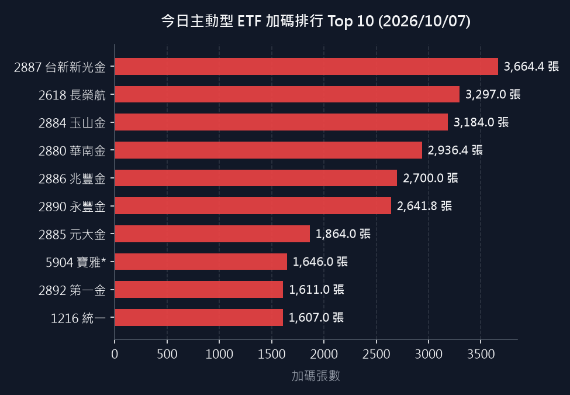
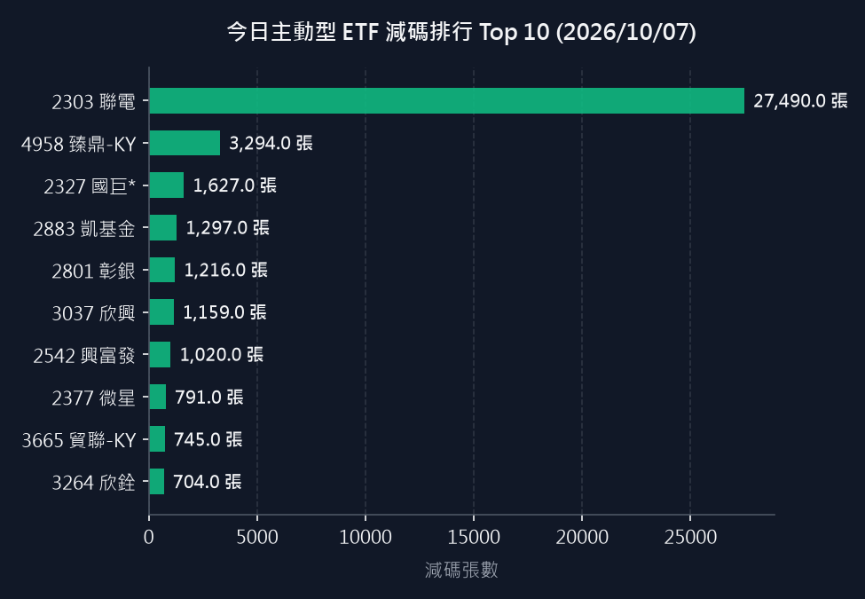

# 主動型 ETF 持股變動

資料來源：`主動型ETF持股明細.xlsx` 最近兩個日期分頁。

比較區間：`20261006` → `20261007`

## 今日加減碼視覺化排行

| 今日加碼 Top 10 | 今日減碼 Top 10 |
| :---: | :---: |
|  |  |

| ETF | 新增 | 刪除 | 比例變動 |
| :-- | --: | --: | --: |
| 00400A | 0 | 0 | 34 |
| 00401A | 0 | 0 | 51 |
| 00402A | 0 | 0 | 45 |
| 00403A | 1 | 0 | 28 |
| 00404A | 7 | 3 | 44 |
| 00405A | 0 | 0 | 28 |
| 00406A | 0 | 0 | 50 |
| 00407A | 0 | 0 | 36 |
| 00408A | 0 | 1 | 47 |
| 00980A | 0 | 0 | 46 |
| 00980D | 0 | 0 | 35 |
| 00981A | 0 | 0 | 30 |
| 00982A | 0 | 1 | 43 |
| 00983A | 0 | 0 | 35 |
| 00983D | 0 | 0 | 0 |
| 00984A | 1 | 1 | 58 |
| 00985A | 0 | 0 | 51 |
| 00986A | 4 | 1 | 33 |
| 00987A | 1 | 1 | 25 |
| 00988A | 1 | 2 | 36 |
| 00989A | 1 | 2 | 57 |
| 00990A | 4 | 3 | 40 |
| 00991A | 0 | 0 | 19 |
| 00992A | 0 | 0 | 36 |
| 00993A | 0 | 0 | 41 |
| 00994A | 0 | 1 | 38 |
| 00995A | 0 | 0 | 39 |
| 00996A | 1 | 0 | 38 |
| 00997A | 1 | 2 | 39 |
| 00998A | 1 | 0 | 50 |
| 00999A | 53 | 0 | 0 |

## 00400A

### 新增持股

- 無

### 刪除持股

- 無

### 投資比例變動

- 1303 南亞：3.88% → 3.94%（+0.06）
- 2059 川湖：5.35% → 5.20%（-0.15）
- 2303 聯電：1.04% → 1.00%（-0.04）
- 2308 台達電：4.37% → 4.43%（+0.06）
- 2330 台積電：8.67% → 8.63%（-0.04）
- 2360 致茂：3.56% → 3.57%（+0.01）
- 2368 金像電：1.50% → 1.54%（+0.04）
- 2383 台光電：5.23% → 5.46%（+0.23）
- 2454 聯發科：6.95% → 6.56%（-0.39）
- 2881 富邦金：1.54% → 1.55%（+0.01）
- 3008 大立光：0.85% → 0.86%（+0.01）
- 3017 奇鋐：4.40% → 4.49%（+0.09）
- 3037 欣興：5.22% → 5.11%（-0.11）
- 3044 健鼎：1.88% → 1.93%（+0.05）
- 3081 聯亞：0.80% → 0.77%（-0.03）
- 3167 大量：0.37% → 0.38%（+0.01）
- 3293 鈊象：0.34% → 0.33%（-0.01）
- 3374 精材：0.55% → 0.54%（-0.01）
- 3443 創意：4.34% → 4.19%（-0.15）
- 3529 力旺：1.36% → 1.33%（-0.03）
- 3653 健策：5.18% → 5.05%（-0.13）
- 3661 世芯-KY：0.46% → 0.49%（+0.03）
- 3665 貿聯-KY：2.39% → 2.21%（-0.18）
- 3711 日月光投控：1.12% → 1.11%（-0.01）
- 5274 信驊：3.01% → 2.91%（-0.10）
- 6121 新普：0.22% → 0.21%（-0.01）
- 6187 萬潤：2.89% → 2.95%（+0.06）
- 6223 旺矽：3.25% → 3.31%（+0.06）
- 6278 台表科：0.48% → 0.51%（+0.03）
- 6488 環球晶：3.40% → 3.44%（+0.04）
- 6505 台塑化：1.97% → 2.01%（+0.04）
- 6669 緯穎：3.07% → 3.24%（+0.17）
- 7750 新代：0.82% → 0.78%（-0.04）
- ＸＡＧＸ金兌(3533.HK)：0.47% → 0.46%（-0.01）

## 00401A

### 新增持股

- 無

### 刪除持股

- 無

### 投資比例變動

- 1216 統一：0.24% → 0.25%（+0.01）
- 1303 南亞：1.08% → 1.12%（+0.04）
- 1477 聚陽：0.82% → 0.85%（+0.03）
- 2059 川湖：1.02% → 1.01%（-0.01）
- 2303 聯電：2.39% → 2.33%（-0.06）
- 2308 台達電：2.60% → 2.68%（+0.08）
- 2313 華通：1.43% → 1.46%（+0.03）
- 2317 鴻海：0.54% → 0.55%（+0.01）
- 2330 台積電：20.13% → 20.38%（+0.25）
- 2345 智邦：0.35% → 0.34%（-0.01）
- 2357 華碩：1.76% → 1.78%（+0.02）
- 2360 致茂：1.40% → 1.42%（+0.02）
- 2379 瑞昱：1.00% → 1.01%（+0.01）
- 2382 廣達：2.00% → 2.04%（+0.04）
- 2383 台光電：1.11% → 1.18%（+0.07）
- 2412 中華電：0.76% → 0.77%（+0.01）
- 2454 聯發科：6.79% → 6.52%（-0.27）
- 2455 全新：2.41% → 2.27%（-0.14）
- 2603 長榮：0.94% → 0.96%（+0.02）
- 2881 富邦金：1.88% → 1.93%（+0.05）
- 2882 國泰金：0.97% → 0.98%（+0.01）
- 2883 凱基金：1.51% → 1.54%（+0.03）
- 2884 玉山金：1.79% → 1.83%（+0.04）
- 2886 兆豐金：1.21% → 1.24%（+0.03）
- 2887 台新新光金：0.98% → 1.01%（+0.03）
- 2890 永豐金：0.27% → 0.29%（+0.02）
- 2891 中信金：1.40% → 1.44%（+0.04）
- 3008 大立光：2.29% → 2.35%（+0.06）
- 3037 欣興：2.55% → 2.54%（-0.01）
- 3231 緯創：1.59% → 1.61%（+0.02）
- 3491 昇達科：1.76% → 1.87%（+0.11）
- 3711 日月光投控：2.60% → 2.63%（+0.03）
- 4938 和碩：0.27% → 0.28%（+0.01）
- 4991 環宇-KY：0.99% → 0.69%（-0.30）
- 5274 信驊：2.01% → 1.97%（-0.04）
- 5347 世界：1.33% → 1.39%（+0.06）
- 5904 寶雅*：0.48% → 0.49%（+0.01）
- 6147 頎邦：1.30% → 1.32%（+0.02）
- 6187 萬潤：0.74% → 0.77%（+0.03）
- 6223 旺矽：1.59% → 1.65%（+0.06）
- 6285 啟碁：1.32% → 1.37%（+0.05）
- 6515 穎崴：1.44% → 1.16%（-0.28）
- 6669 緯穎：1.79% → 1.92%（+0.13）
- 7769 鴻勁：1.30% → 1.08%（-0.22）
- 7828 創新服務：1.64% → 1.66%（+0.02）
- 7856 漢測：0.85% → 0.84%（-0.01）
- 8464 億豐：0.92% → 0.93%（+0.01）
- 台股期貨10/26(FITXN*1.TF)：0.55% → 0.58%（+0.03）
- 臺指選擇權10/26 46000 買權：-0.10% → -0.11%（-0.01）
- 臺指選擇權10/26 46400 買權：-1.51% → -1.57%（-0.06）
- 臺指選擇權10/26 46800 買權：-0.08% → -0.09%（-0.01）

## 00402A

### 新增持股

- 無

### 刪除持股

- 無

### 投資比例變動

- AAPL.US Apple：7.36% → 7.28%（-0.08）
- ADI.US Analog Devices：1.84% → 1.87%（+0.03）
- AMD.US AMD：6.07% → 6.13%（+0.06）
- AMZN.US Amazon：3.93% → 3.98%（+0.05）
- ANET.US Arista Networks：0.92% → 0.93%（+0.01）
- ASML.US ASML Holding：1.19% → 1.20%（+0.01）
- AVGO.US Broadcom：2.45% → 2.13%（-0.32）
- BABA.US Alibaba Group：0.43% → 0.46%（+0.03）
- BKNG.US Booking Holdings：0.47% → 0.48%（+0.01）
- CDNS.US Cadence Design Systems：1.57% → 1.49%（-0.08）
- CIEN.US Ciena：1.35% → 1.36%（+0.01）
- CRWD.US CrowdStrike Holdings：1.71% → 1.75%（+0.04）
- DASH.US DoorDash：0.43% → 0.44%（+0.01）
- FSLY.US Fastly：0.45% → 0.35%（-0.10）
- GOOG.US Alphabet - Class C Capital Stock：3.09% → 3.17%（+0.08）
- GOOGL.US Alphabet - Class A Common Stock：3.45% → 3.34%（-0.11）
- INTC.US Intel：1.66% → 1.64%（-0.02）
- IOT.US Samsara：0.49% → 0.52%（+0.03）
- KLAC.US KLA：1.68% → 1.70%（+0.02）
- LITE.US Lumentum：1.96% → 2.00%（+0.04）
- LRCX.US Lam Research：2.94% → 2.96%（+0.02）
- MCHP.US Microchip Technology：1.44% → 1.34%（-0.10）
- MDB.US MongoDB：0.34% → 0.35%（+0.01）
- META.US Meta：3.52% → 3.64%（+0.12）
- MRVL.US Marvell：1.68% → 1.69%（+0.01）
- MSFT.US Microsoft：4.95% → 5.09%（+0.14）
- MU.US Micron：6.29% → 6.13%（-0.16）
- NFLX.US Netflix：0.86% → 0.88%（+0.02）
- NOW.US ServiceNow：0.92% → 0.80%（-0.12）
- NVDA.US NVIDIA：8.75% → 8.82%（+0.07）
- PANW.US Palo Alto：2.83% → 2.76%（-0.07）
- PLTR.US Palantir Technologies：1.79% → 1.82%（+0.03）
- SHOP.US Shopify：0.95% → 0.91%（-0.04）
- SIMO.US Silicon Motion：0.57% → 0.58%（+0.01）
- SKHY.US SK hynix：1.33% → 1.34%（+0.01）
- SNOW.US Snowflake：1.14% → 1.04%（-0.10）
- SPCX.US SpaceX：0.72% → 0.78%（+0.06）
- SPOT.US Spotify：0.30% → 0.31%（+0.01）
- STX.US Seagate：1.53% → 1.24%（-0.29）
- TSM.US TSMC(ADR)：1.51% → 1.57%（+0.06）
- TTWO.US Take-Two：0.63% → 0.54%（-0.09）
- TXN.US Texas Instruments：2.42% → 2.32%（-0.10）
- UBER.US Uber：0.28% → 0.29%（+0.01）
- V.US Visa：1.00% → 1.04%（+0.04）
- WDC.US Western Digital：1.94% → 2.09%（+0.15）

## 00403A

### 新增持股

- 2368 金像電（0.17%，200 張）

### 刪除持股

- 無

### 投資比例變動

- 1303 南亞：1.92% → 2.21%（+0.29）
- 2303 聯電：3.89% → 2.43%（-1.46）
- 2308 台達電：3.90% → 4.07%（+0.17）
- 2317 鴻海：0.55% → 0.56%（+0.01）
- 2327 國巨*：3.53% → 3.60%（+0.07）
- 2330 台積電：13.31% → 13.64%（+0.33）
- 2345 智邦：2.23% → 2.25%（+0.02）
- 2383 台光電：5.36% → 5.75%（+0.39）
- 2408 南亞科：1.00% → 1.01%（+0.01）
- 2449 京元電子：0.79% → 0.82%（+0.03）
- 2454 聯發科：7.66% → 6.57%（-1.09）
- 2455 全新：0.12% → 0.08%（-0.04）
- 2882 國泰金：0.30% → 0.31%（+0.01）
- 3008 大立光：0.90% → 0.94%（+0.04）
- 3017 奇鋐：5.06% → 5.30%（+0.24）
- 3037 欣興：7.53% → 7.00%（-0.53）
- 3189 景碩：3.27% → 3.26%（-0.01）
- 3443 創意：3.29% → 3.56%（+0.27）
- 3583 辛耘：0.40% → 0.42%（+0.02）
- 3653 健策：5.39% → 5.41%（+0.02）
- 3665 貿聯-KY：2.44% → 2.33%（-0.11）
- 5274 信驊：1.25% → 1.24%（-0.01）
- 6223 旺矽：3.45% → 3.61%（+0.16）
- 6274 台燿：2.27% → 2.28%（+0.01）
- 6488 環球晶：2.24% → 2.33%（+0.09）
- 6669 緯穎：2.45% → 2.66%（+0.21）
- 8046 南電：3.02% → 3.10%（+0.08）
- 8996 高力：1.93% → 1.97%（+0.04）

## 00404A

### 新增持股

- 2882 國泰金（2.64%，1001 張）
- 3653 健策（0.33%，2 張）
- 5876 上海商銀（0.73%，638 張）
- 6491 晶碩（0.45%，48 張）
- 6505 台塑化（0.45%，187 張）
- 6669 緯穎（1.03%，19 張）
- 6691 洋基工程（0.91%，49 張）

### 刪除持股

- 2883 凱基金（1.13%，1297 張）
- 2892 第一金（1.81%，2040 張）
- 6515 穎崴（0.14%，1 張）

### 投資比例變動

- 1303 南亞：0.76% → 0.73%（-0.03）
- 2027 大成鋼：1.59% → 0.84%（-0.75）
- 2059 川湖：0.93% → 0.62%（-0.31）
- 2301 光寶科：0.27% → 0.58%（+0.31）
- 2303 聯電：2.07% → 2.74%（+0.67）
- 2308 台達電：1.96% → 1.93%（-0.03）
- 2317 鴻海：0.67% → 0.65%（-0.02）
- 2330 台積電：22.73% → 22.60%（-0.13）
- 2345 智邦：0.92% → 0.87%（-0.05）
- 2357 華碩：0.93% → 1.18%（+0.25）
- 2360 致茂：0.70% → 0.50%（-0.20）
- 2379 瑞昱：1.09% → 1.05%（-0.04）
- 2382 廣達：2.05% → 0.95%（-1.10）
- 2383 台光電：2.92% → 3.11%（+0.19）
- 2395 研華：1.33% → 1.29%（-0.04）
- 2436 偉詮電：1.18% → 1.13%（-0.05）
- 2454 聯發科：7.16% → 6.90%（-0.26）
- 2542 興富發：1.81% → 0.92%（-0.89）
- 2637 慧洋-KY：1.11% → 1.07%（-0.04）
- 2885 元大金：2.39% → 2.31%（-0.08）
- 2887 台新新光金：1.34% → 1.38%（+0.04）
- 2890 永豐金：1.42% → 1.38%（-0.04）
- 3017 奇鋐：1.42% → 1.39%（-0.03）
- 3034 聯詠：2.02% → 1.94%（-0.08）
- 3260 威剛：1.21% → 0.06%（-1.15）
- 3264 欣銓：0.39% → 0.61%（+0.22）
- 3293 鈊象：0.52% → 1.10%（+0.58）
- 3374 精材：0.12% → 0.11%（-0.01）
- 3443 創意：0.60% → 0.59%（-0.01）
- 3711 日月光投控：3.49% → 3.40%（-0.09）
- 4763 材料*-KY：1.60% → 0.86%（-0.74）
- 5274 信驊：2.93% → 2.88%（-0.05）
- 5434 崇越：1.82% → 1.78%（-0.04）
- 6196 帆宣：1.80% → 1.78%（-0.02）
- 6206 飛捷：1.01% → 0.71%（-0.30）
- 6223 旺矽：1.22% → 1.14%（-0.08）
- 6257 矽格：1.85% → 1.86%（+0.01）
- 7769 鴻勁：1.22% → 1.11%（-0.11）
- 8016 矽創：1.22% → 1.19%（-0.03）
- 8081 致新：0.84% → 0.82%（-0.02）
- 8299 群聯：1.12% → 1.13%（+0.01）
- iShares MSCI Japan SRI ETF(2851.JP)：0.10% → 0.45%（+0.35）
- 台指選擇權10/26 49100 買權：-0.66% → -0.70%（-0.04）
- 台股期貨10/26(FITXN*1.TF)：16.98% → 17.23%（+0.25）

## 00405A

### 新增持股

- 無

### 刪除持股

- 無

### 投資比例變動

- 1303 南亞：0.76% → 0.80%（+0.04）
- 2059 川湖：2.13% → 2.16%（+0.03）
- 2308 台達電：0.72% → 0.76%（+0.04）
- 2330 台積電：1.75% → 1.81%（+0.06）
- 2345 智邦：4.18% → 4.25%（+0.07）
- 2368 金像電：5.21% → 5.57%（+0.36）
- 2383 台光電：4.60% → 4.98%（+0.38）
- 2454 聯發科：6.76% → 5.67%（-1.09）
- 3017 奇鋐：3.79% → 4.01%（+0.22）
- 3037 欣興：7.71% → 7.86%（+0.15）
- 3443 創意：6.97% → 6.01%（-0.96）
- 3653 健策：7.13% → 7.21%（+0.08）
- 3665 貿聯-KY：6.29% → 6.06%（-0.23）
- 5274 信驊：4.03% → 4.04%（+0.01）
- 5347 世界：0.15% → 0.16%（+0.01）
- 6187 萬潤：0.84% → 0.89%（+0.05）
- 6223 旺矽：6.78% → 7.18%（+0.40）
- 6274 台燿：2.07% → 2.10%（+0.03）
- 6285 啟碁：0.09% → 0.10%（+0.01）
- 6510 精測：0.59% → 0.60%（+0.01）
- 6515 穎崴：0.54% → 0.55%（+0.01）
- 6526 達發：0.47% → 0.48%（+0.01）
- 6531 愛普*：4.13% → 4.22%（+0.09）
- 6669 緯穎：0.81% → 0.89%（+0.08）
- 6805 富世達：3.46% → 3.23%（-0.23）
- 7769 鴻勁：2.65% → 2.78%（+0.13）
- 8046 南電：7.39% → 7.66%（+0.27）
- 8996 高力：1.71% → 1.77%（+0.06）

## 00406A

### 新增持股

- 無

### 刪除持股

- 無

### 投資比例變動

- 1560 中砂：0.69% → 0.68%（-0.01）
- 2059 川湖：1.66% → 1.63%（-0.03）
- 2303 聯電：2.31% → 2.24%（-0.07）
- 2308 台達電：3.50% → 3.58%（+0.08）
- 2317 鴻海：0.55% → 0.56%（+0.01）
- 2330 台積電：9.43% → 9.48%（+0.05）
- 2344 華邦電：0.33% → 0.32%（-0.01）
- 2345 智邦：3.31% → 3.27%（-0.04）
- 2360 致茂：0.74% → 1.13%（+0.39）
- 2368 金像電：0.58% → 0.61%（+0.03）
- 2383 台光電：5.99% → 6.30%（+0.31）
- 2449 京元電子：0.60% → 0.61%（+0.01）
- 2454 聯發科：6.39% → 6.09%（-0.30）
- 2455 全新：0.15% → 0.14%（-0.01）
- 2481 強茂：0.30% → 0.29%（-0.01）
- 2486 一詮：0.32% → 0.31%（-0.01）
- 2885 元大金：0.91% → 0.93%（+0.02）
- 3008 大立光：0.42% → 0.43%（+0.01）
- 3017 奇鋐：5.82% → 5.99%（+0.17）
- 3037 欣興：5.95% → 5.89%（-0.06）
- 3081 聯亞：0.46% → 0.44%（-0.02）
- 3105 穩懋：0.21% → 0.20%（-0.01）
- 3167 大量：0.70% → 0.71%（+0.01）
- 3189 景碩：1.39% → 1.36%（-0.03）
- 3264 欣銓：0.22% → 0.23%（+0.01）
- 3363 上詮：0.40% → 0.39%（-0.01）
- 3443 創意：1.82% → 1.77%（-0.05）
- 3450 聯鈞：0.27% → 0.26%（-0.01）
- 3491 昇達科：0.84% → 0.88%（+0.04）
- 3529 力旺：0.37% → 0.36%（-0.01）
- 3653 健策：4.00% → 3.94%（-0.06）
- 3665 貿聯-KY：2.97% → 2.78%（-0.19）
- 3711 日月光投控：2.53% → 2.54%（+0.01）
- 5274 信驊：2.82% → 2.74%（-0.08）
- 6147 頎邦：0.61% → 0.62%（+0.01）
- 6187 萬潤：0.37% → 0.38%（+0.01）
- 6213 聯茂：0.58% → 0.61%（+0.03）
- 6223 旺矽：3.44% → 3.53%（+0.09）
- 6274 台燿：1.90% → 1.88%（-0.02）
- 6488 環球晶：0.68% → 0.70%（+0.02）
- 6510 精測：1.18% → 1.16%（-0.02）
- 6515 穎崴：0.52% → 0.51%（-0.01）
- 6669 緯穎：2.38% → 2.53%（+0.15）
- 6715 嘉基：0.06% → 0.08%（+0.02）
- 7769 鴻勁：0.37% → 0.38%（+0.01）
- 8046 南電：2.51% → 2.53%（+0.02）
- 8358 金居：0.21% → 0.20%（-0.01）
- 臺指選擇權第一週週三到期契約：-19.20% → -20.45%（-1.25）
- 臺指選擇權第二週週五到期契約：-3.25% → -3.35%（-0.10）
- 臺股期貨 202610(FITXN*1.TF)：23.57% → 23.64%（+0.07）

## 00407A

### 新增持股

- 無

### 刪除持股

- 無

### 投資比例變動

- 1303 南亞：0.82% → 0.85%（+0.03）
- 1590 亞德客-KY：0.06% → 0.07%（+0.01）
- 2059 川湖：2.77% → 2.74%（-0.03）
- 2301 光寶科：1.43% → 1.45%（+0.02）
- 2303 聯電：0.55% → 0.54%（-0.01）
- 2308 台達電：2.68% → 2.77%（+0.09）
- 2327 國巨*：2.32% → 2.34%（+0.02）
- 2330 台積電：8.86% → 8.98%（+0.12）
- 2360 致茂：1.01% → 1.03%（+0.02）
- 2368 金像電：0.57% → 0.60%（+0.03）
- 2383 台光電：5.32% → 5.64%（+0.32）
- 2451 創見：0.30% → 0.29%（-0.01）
- 2454 聯發科：5.76% → 5.54%（-0.22）
- 2615 萬海：0.62% → 0.63%（+0.01）
- 3008 大立光：1.45% → 1.49%（+0.04）
- 3017 奇鋐：5.57% → 5.78%（+0.21）
- 3037 欣興：6.02% → 6.01%（-0.01）
- 3081 聯亞：1.40% → 1.38%（-0.02）
- 3131 弘塑：0.84% → 0.85%（+0.01）
- 3231 緯創：0.69% → 0.70%（+0.01）
- 3260 威剛：0.28% → 0.27%（-0.01）
- 3443 創意：5.10% → 5.01%（-0.09）
- 3491 昇達科：0.91% → 0.97%（+0.06）
- 3653 健策：3.46% → 3.44%（-0.02）
- 3665 貿聯-KY：2.86% → 2.70%（-0.16）
- 3711 日月光投控：2.93% → 2.96%（+0.03）
- 5274 信驊：1.77% → 1.74%（-0.03）
- 5289 宜鼎：0.30% → 0.29%（-0.01）
- 6187 萬潤：1.57% → 1.64%（+0.07）
- 6223 旺矽：2.61% → 2.70%（+0.09）
- 6274 台燿：3.98% → 3.96%（-0.02）
- 6510 精測：1.22% → 1.21%（-0.01）
- 6669 緯穎：3.72% → 4.00%（+0.28）
- 6805 富世達：1.14% → 1.13%（-0.01）
- 8046 南電：2.99% → 3.04%（+0.05）
- 8996 高力：2.14% → 2.17%（+0.03）

## 00408A

### 新增持股

- 無

### 刪除持股

- 2801 彰銀（2.05%，1165 張）

### 投資比例變動

- 1216 統一：0.09% → 0.10%（+0.01）
- 1303 南亞：2.61% → 3.47%（+0.86）
- 2059 川湖：0.43% → 0.38%（-0.05）
- 2303 聯電：3.18% → 1.76%（-1.42）
- 2308 台達電：3.36% → 3.72%（+0.36）
- 2327 國巨*：1.50% → 1.55%（+0.05）
- 2330 台積電：5.66% → 5.68%（+0.02）
- 2344 華邦電：0.47% → 0.46%（-0.01）
- 2345 智邦：0.80% → 0.78%（-0.02）
- 2357 華碩：1.93% → 1.92%（-0.01）
- 2360 致茂：1.20% → 1.24%（+0.04）
- 2368 金像電：3.61% → 4.43%（+0.82）
- 2376 技嘉：1.38% → 1.30%（-0.08）
- 2382 廣達：0.21% → 0.22%（+0.01）
- 2383 台光電：3.87% → 5.19%（+1.32）
- 2395 研華：1.63% → 1.61%（-0.02）
- 2408 南亞科：2.26% → 1.73%（-0.53）
- 2449 京元電子：1.42% → 1.43%（+0.01）
- 2454 聯發科：4.84% → 4.22%（-0.62）
- 2481 強茂：1.12% → 0.99%（-0.13）
- 2542 興富發：3.32% → 3.39%（+0.07）
- 3008 大立光：0.87% → 0.89%（+0.02）
- 3017 奇鋐：3.45% → 3.19%（-0.26）
- 3026 禾伸堂：0.32% → 0.33%（+0.01）
- 3037 欣興：4.54% → 4.47%（-0.07）
- 3081 聯亞：1.26% → 1.93%（+0.67）
- 3105 穩懋：0.56% → 0.53%（-0.03）
- 3189 景碩：2.90% → 2.92%（+0.02）
- 3231 緯創：0.37% → 0.36%（-0.01）
- 3264 欣銓：0.69% → 0.70%（+0.01）
- 3443 創意：0.56% → 0.55%（-0.01）
- 3491 昇達科：1.05% → 1.10%（+0.05）
- 3653 健策：2.79% → 2.55%（-0.24）
- 3665 貿聯-KY：1.28% → 1.20%（-0.08）
- 3711 日月光投控：1.58% → 1.51%（-0.07）
- 5434 崇越：2.32% → 2.27%（-0.05）
- 6187 萬潤：0.67% → 0.69%（+0.02）
- 6239 力成：1.29% → 1.33%（+0.04）
- 6274 台燿：3.22% → 3.11%（-0.11）
- 6488 環球晶：1.07% → 1.10%（+0.03）
- 6669 緯穎：3.72% → 3.88%（+0.16）
- 6691 洋基工程：0.36% → 0.35%（-0.01）
- 6805 富世達：1.42% → 1.43%（+0.01）
- 7769 鴻勁：0.56% → 0.57%（+0.01）
- 8046 南電：2.03% → 2.01%（-0.02）
- 8996 高力：1.86% → 1.91%（+0.05）
- 9802 鈺齊-KY：0.80% → 0.82%（+0.02）

## 00980A

### 新增持股

- 無

### 刪除持股

- 無

### 投資比例變動

- 1303 南亞：3.30% → 3.41%（+0.11）
- 2059 川湖：5.04% → 4.99%（-0.05）
- 2303 聯電：1.07% → 1.05%（-0.02）
- 2308 台達電：3.87% → 3.99%（+0.12）
- 2317 鴻海：1.96% → 2.00%（+0.04）
- 2327 國巨*：1.45% → 1.46%（+0.01）
- 2330 台積電：9.26% → 9.39%（+0.13）
- 2344 華邦電：1.98% → 1.96%（-0.02）
- 2345 智邦：1.41% → 1.40%（-0.01）
- 2360 致茂：1.64% → 1.68%（+0.04）
- 2368 金像電：1.96% → 2.05%（+0.09）
- 2376 技嘉：0.90% → 0.89%（-0.01）
- 2382 廣達：1.13% → 1.15%（+0.02）
- 2383 台光電：4.52% → 4.80%（+0.28）
- 2408 南亞科：2.77% → 2.78%（+0.01）
- 2454 聯發科：6.14% → 5.91%（-0.23）
- 2884 玉山金：0.63% → 0.65%（+0.02）
- 2891 中信金：0.90% → 0.92%（+0.02）
- 3008 大立光：1.22% → 1.26%（+0.04）
- 3017 奇鋐：2.29% → 2.38%（+0.09）
- 3026 禾伸堂：1.12% → 1.10%（-0.02）
- 3036 文曄：0.92% → 0.94%（+0.02）
- 3044 健鼎：0.52% → 0.54%（+0.02）
- 3081 聯亞：2.32% → 2.28%（-0.04）
- 3189 景碩：1.39% → 1.37%（-0.02）
- 3231 緯創：0.86% → 0.87%（+0.01）
- 3264 欣銓：0.75% → 0.77%（+0.02）
- 3443 創意：2.42% → 2.38%（-0.04）
- 3653 健策：3.58% → 3.55%（-0.03）
- 3665 貿聯-KY：0.57% → 0.54%（-0.03）
- 3711 日月光投控：2.20% → 2.23%（+0.03）
- 5274 信驊：1.89% → 1.86%（-0.03）
- 5904 寶雅*：0.74% → 0.75%（+0.01）
- 6213 聯茂：0.90% → 0.96%（+0.06）
- 6223 旺矽：1.95% → 2.02%（+0.07）
- 6274 台燿：1.22% → 1.21%（-0.01）
- 6442 光聖：0.31% → 0.30%（-0.01）
- 6515 穎崴：1.81% → 1.80%（-0.01）
- 6669 緯穎：1.59% → 1.71%（+0.12）
- 6831 邁科：0.42% → 0.44%（+0.02）
- 7769 鴻勁：2.86% → 2.93%（+0.07）
- 8046 南電：1.79% → 1.82%（+0.03）
- 8210 勤誠：0.40% → 0.41%（+0.01）
- 8299 群聯：1.68% → 1.69%（+0.01）
- 8996 高力：0.44% → 0.45%（+0.01）
- 台灣證交所加權股價指數(FITXN*1.TF)：2.96% → 3.00%（+0.04）

## 00980D

### 新增持股

- 無

### 刪除持股

- 無

### 投資比例變動

- ASURION LLC/ASURION CO 8.375% 01FEB2034：0.46% → 0.47%（+0.01）
- AVIANCA MIDCO 2 PLC SER REGS 10.25 % 07-JAN-2032：0.28% → 0.27%（-0.01）
- AVIANCA MIDCO 2 PLC SER REGS 9.625000 % 14FEB2030：0.28% → 0.27%（-0.01）
- BRITISH TELECOMMUNICATIO (BR) 9.625% 15DEC2030：0.58% → 0.57%（-0.01）
- CHC GROUP LLC SER REGS 11.750000 % 01-SEP-2030：0.45% → 0.44%（-0.01）
- CIMIC FINANCE USA PTY LT SER REGS (REG S) 7% 25MAR2034：0.33% → 0.32%（-0.01）
- COX COMMUNICATIONS INC SER REGS 5.950000 % 01SEP2054：0.52% → 0.51%（-0.01）
- DEUTSCHE BANK NY VAR 10FEB2034：0.33% → 0.34%（+0.01）
- FORD MOTOR COMPANY 5.291% 08DEC2046：0.27% → 0.28%（+0.01）
- GLOBAL ATLANTIC FIN CO SER REGS 7.950000 % 15JUN2033：0.66% → 0.65%（-0.01）
- GLOBAL AUTO HO/AAG FH UK SER REGS (REG S) 11.5% 15AUG2029：0.38% → 0.37%（-0.01）
- HERTZ CORP/THE SER REGS (REG S) 12.625% 15JUL2029：0.30% → 0.31%（+0.01）
- HSBC HOLDINGS PLC VAR 03NOV2028：0.34% → 0.33%（-0.01）
- JETBLUE AIRWAYS/LOYALTY SER REGS (REG S) 9.875% 20SEP2031：0.46% → 0.45%（-0.01）
- KONINKLIJKE KPN NV (REG) 8.375% 01OCT2030：0.44% → 0.43%（-0.01）
- LBM ACQUISITION LLC SER REGS 9.500000 % 15JUN2031：0.43% → 0.42%（-0.01）
- META PLATFORMS INC 5.750000 % 15-NOV-2065：0.42% → 0.41%（-0.01）
- MOBIUS MERGER SUB SER REGS 9.000000 % 01JUN2030：0.26% → 0.27%（+0.01）
- ORACLE CORP 6.000000 % 03AUG2055：0.30% → 0.29%（-0.01）
- ORACLE CORP 6.85 % 04-FEB-2066：0.54% → 0.53%（-0.01）
- PBF HOLDING CO LLC SER REGS 9.875000 % 15MAR2030：0.37% → 0.36%（-0.01）
- RR DONNELLEY & SONS CO SER REGS (REG S) 9.5% 01AUG2029：0.42% → 0.43%（+0.01）
- SES GLOBAL AMERICAS HLDG SER REGS (REG) 5.300000 % 25MAR2044：0.30% → 0.29%（-0.01）
- TELEFONICA EUROPE BV (REG) 8.25% 15SEP2030：0.42% → 0.41%（-0.01）
- TOUCAN FINCO LTD/CAN/US SER REGS 9.500000 % 15MAY2030：0.25% → 0.26%（+0.01）
- UNISYS CORP SER REGS 10.625000 % 15JAN2031：0.59% → 0.60%（+0.01）
- US 10YR NOTE (CBT)DEC26 21-DEC-2026：17.77% → 17.75%（-0.02）
- US 10YR ULTRA FUT DEC26 21-DEC-2026：-0.86% → -1.55%（-0.69）
- US 2YR NOTE (CBT) DEC26 31-DEC-2026：1.67% → 1.66%（-0.01）
- US 5YR NOTE (CBT) DEC26 31-DEC-2026：-13.55% → -13.53%（+0.02）
- US ACUTE CARE SOLUTIONS SER REGS (REG S) 9.75% 15MAY2029：0.33% → 0.34%（+0.01）
- US LONG BOND(CBT) DEC26 21-DEC-2026：5.21% → 5.19%（-0.02）
- VAR ENERGI ASA SER REGS (REG S) 7.5% 15JAN2028：0.34% → 0.33%（-0.01）
- VIACOM INC (REG) 5.85% 01SEP2043：0.50% → 0.49%（-0.01）
- VIACOMCBS INC (REG) 4.95% 19MAY2050：0.44% → 0.43%（-0.01）

## 00981A

### 新增持股

- 無

### 刪除持股

- 無

### 投資比例變動

- 2303 聯電：4.30% → 4.04%（-0.26）
- 2308 台達電：4.93% → 5.03%（+0.10）
- 2327 國巨*：5.16% → 5.20%（+0.04）
- 2330 台積電：9.83% → 10.13%（+0.30）
- 2345 智邦：4.33% → 4.32%（-0.01）
- 2368 金像電：1.00% → 1.46%（+0.46）
- 2383 台光電：8.82% → 9.46%（+0.64）
- 2449 京元電子：1.27% → 1.32%（+0.05）
- 2454 聯發科：8.75% → 8.41%（-0.34）
- 3017 奇鋐：7.24% → 7.35%（+0.11）
- 3037 欣興：8.87% → 8.61%（-0.26）
- 3264 欣銓：0.06% → 0.00%（-0.06）
- 3443 創意：1.11% → 1.78%（+0.67）
- 3653 健策：6.00% → 5.82%（-0.18）
- 3665 貿聯-KY：3.21% → 2.41%（-0.80）
- 3711 日月光投控：2.29% → 2.32%（+0.03）
- 4958 臻鼎-KY：0.67% → 0.00%（-0.67）
- 5274 信驊：1.10% → 0.96%（-0.14）
- 6191 精成科：0.11% → 0.12%（+0.01）
- 6223 旺矽：4.59% → 4.73%（+0.14）
- 6271 同欣電：0.17% → 0.18%（+0.01）
- 6274 台燿：3.65% → 3.80%（+0.15）
- 6278 台表科：0.03% → 0.00%（-0.03）
- 6515 穎崴：0.19% → 0.18%（-0.01）
- 6669 緯穎：3.09% → 3.31%（+0.22）
- 6805 富世達：0.98% → 0.58%（-0.40）
- 8046 南電：4.45% → 4.52%（+0.07）
- 8210 勤誠：0.20% → 0.14%（-0.06）
- 8996 高力：0.25% → 0.27%（+0.02）
- 台指期貨 2026/10(FITXN*1.TF)：2.26% → 2.32%（+0.06）

## 00982A

### 新增持股

- 無

### 刪除持股

- 2345 智邦（0.43%，111 張）

### 投資比例變動

- 2059 川湖：4.46% → 4.43%（-0.03）
- 2301 光寶科：1.79% → 1.82%（+0.03）
- 2303 聯電：1.45% → 1.43%（-0.02）
- 2330 台積電：8.61% → 7.54%（-1.07）
- 2360 致茂：3.66% → 3.75%（+0.09）
- 2376 技嘉：1.26% → 1.25%（-0.01）
- 2377 微星：0.97% → 0.98%（+0.01）
- 2383 台光電：3.28% → 3.50%（+0.22）
- 2395 研華：1.33% → 1.34%（+0.01）
- 2428 興勤：1.11% → 1.12%（+0.01）
- 2454 聯發科：7.09% → 6.84%（-0.25）
- 2455 全新：1.73% → 1.64%（-0.09）
- 2467 志聖：1.08% → 1.09%（+0.01）
- 2476 鉅祥：0.31% → 0.32%（+0.01）
- 2478 大毅：1.02% → 1.05%（+0.03）
- 2486 一詮：0.74% → 0.73%（-0.01）
- 2885 元大金：0.28% → 0.29%（+0.01）
- 3008 大立光：3.15% → 3.25%（+0.10）
- 3017 奇鋐：2.49% → 2.59%（+0.10）
- 3090 日電貿：1.06% → 1.07%（+0.01）
- 3105 穩懋：6.55% → 6.38%（-0.17）
- 3231 緯創：1.29% → 1.30%（+0.01）
- 3265 台星科：1.17% → 1.25%（+0.08）
- 3491 昇達科：3.59% → 3.82%（+0.23）
- 3529 力旺：0.55% → 0.30%（-0.25）
- 3583 辛耘：1.10% → 1.14%（+0.04）
- 3617 碩天：0.28% → 0.29%（+0.01）
- 3711 日月光投控：1.21% → 1.23%（+0.02）
- 4958 臻鼎-KY：3.39% → 3.42%（+0.03）
- 5274 信驊：1.31% → 1.29%（-0.02）
- 5425 台半：1.26% → 1.21%（-0.05）
- 5483 中美晶：1.37% → 1.39%（+0.02）
- 5536 聖暉*：0.81% → 0.85%（+0.04）
- 6139 亞翔：5.52% → 5.62%（+0.10）
- 6213 聯茂：1.32% → 1.40%（+0.08）
- 6214 精誠：1.21% → 1.22%（+0.01）
- 6223 旺矽：3.10% → 3.22%（+0.12）
- 6239 力成：1.06% → 1.12%（+0.06）
- 6488 環球晶：2.38% → 2.46%（+0.08）
- 6531 愛普*：4.01% → 4.15%（+0.14）
- 6669 緯穎：4.07% → 4.40%（+0.33）
- 6672 騰輝電子-KY：0.44% → 0.46%（+0.02）
- 8996 高力：1.14% → 1.15%（+0.01）

## 00983A

### 新增持股

- 無

### 刪除持股

- 無

### 投資比例變動

- ACHR.US Archer：0.65% → 0.62%（-0.03）
- AMD.US AMD：3.48% → 3.40%（-0.08）
- AMZN.US Amazon：2.54% → 2.49%（-0.05）
- BEAM.US Beam Therapeutics：1.45% → 1.49%（+0.04）
- BLSH.US Bullish：2.16% → 2.13%（-0.03）
- CBRS.US Cerebras：0.90% → 0.96%（+0.06）
- COIN.US Coinbase：4.42% → 4.46%（+0.04）
- CRCL.US Circle：4.61% → 4.64%（+0.03）
- CRSP.US CRISPR Therapeutics：3.94% → 4.00%（+0.06）
- CRWV.US CoreWeave：1.28% → 1.23%（-0.05）
- DE.US Deere：0.51% → 0.50%（-0.01）
- GOOG.US Alphabet - Class C Capital Stock：1.47% → 1.46%（-0.01）
- HOOD.US Robinhood Markets：4.38% → 4.35%（-0.03）
- ILMN.US Illumina：1.90% → 2.01%（+0.11）
- KTOS.US Kratos Defense & Security：0.69% → 0.66%（-0.03）
- LLY.US Eli Lilly：0.80% → 0.79%（-0.01）
- NET.US Cloudflare：1.28% → 1.29%（+0.01）
- NTLA.US Intellia Therapeutics：0.57% → 0.59%（+0.02）
- NTRA.US Natera：1.78% → 1.81%（+0.03）
- NVDA.US NVIDIA：2.51% → 2.73%（+0.22）
- PLTR.US Palantir Technologies：3.27% → 3.22%（-0.05）
- RKLB.US Rocket Lab：0.58% → 1.40%（+0.82）
- RXRX.US Recursion Pharmaceuticals：0.89% → 1.01%（+0.12）
- SHOP.US Shopify：4.08% → 4.23%（+0.15）
- SNOW.US Snowflake：0.53% → 0.52%（-0.01）
- SPCX.US SpaceX：6.58% → 6.95%（+0.37）
- TEM.US Tempus：5.77% → 6.17%（+0.40）
- TER.US Teradyne：0.72% → 0.70%（-0.02）
- TSLA.US Tesla：8.95% → 8.87%（-0.08）
- TSM.US TSMC(ADR)：2.72% → 2.74%（+0.02）
- TWST.US Twist Bioscience：5.27% → 5.62%（+0.35）
- TXG.US 10x Genomics：4.95% → 5.08%（+0.13）
- WGS.US GeneDx：1.01% → 0.68%（-0.33）
- XE.US X-Energy：0.71% → 0.69%（-0.02）
- XYZ.US Block：1.26% → 1.27%（+0.01）

## 00983D

### 新增持股

- 無

### 刪除持股

- 無

### 投資比例變動

- 無

## 00984A

### 新增持股

- 1709 和益（0.84%，1355 張）

### 刪除持股

- 1795 美時（0.00%，0.572 張）

### 投資比例變動

- 1303 南亞：2.80% → 2.86%（+0.06）
- 1326 台化：0.96% → 0.97%（+0.01）
- 1560 中砂：1.40% → 1.38%（-0.02）
- 2059 川湖：2.64% → 2.58%（-0.06）
- 2303 聯電：0.85% → 0.82%（-0.03）
- 2330 台積電：4.48% → 4.47%（-0.01）
- 2344 華邦電：0.75% → 0.73%（-0.02）
- 2351 順德：0.66% → 0.64%（-0.02）
- 2383 台光電：1.46% → 1.53%（+0.07）
- 2395 研華：2.64% → 2.62%（-0.02）
- 2404 漢唐：0.44% → 0.45%（+0.01）
- 2408 南亞科：2.31% → 2.28%（-0.03）
- 2409 友達：1.28% → 1.22%（-0.06）
- 2454 聯發科：0.97% → 0.92%（-0.05）
- 2464 盟立：1.23% → 1.17%（-0.06）
- 2603 長榮：1.68% → 1.69%（+0.01）
- 2615 萬海：0.90% → 0.91%（+0.01）
- 2634 漢翔：0.31% → 0.30%（-0.01）
- 2851 中再保：0.63% → 0.64%（+0.01）
- 2880 華南金：1.46% → 1.48%（+0.02）
- 2881 富邦金：4.01% → 4.05%（+0.04）
- 2882 國泰金：3.14% → 3.13%（-0.01）
- 2883 凱基金：2.31% → 2.32%（+0.01）
- 2884 玉山金：2.13% → 2.15%（+0.02）
- 2885 元大金：3.15% → 3.18%（+0.03）
- 2886 兆豐金：1.94% → 1.96%（+0.02）
- 2887 台新新光金：3.26% → 3.29%（+0.03）
- 2890 永豐金：2.27% → 2.33%（+0.06）
- 2892 第一金：1.18% → 1.19%（+0.01）
- 3006 晶豪科：0.66% → 0.63%（-0.03）
- 3008 大立光：1.66% → 1.69%（+0.03）
- 3017 奇鋐：4.60% → 4.71%（+0.11）
- 3037 欣興：2.02% → 1.98%（-0.04）
- 3189 景碩：1.69% → 1.64%（-0.05）
- 3231 緯創：0.64% → 0.63%（-0.01）
- 3264 欣銓：1.71% → 1.73%（+0.02）
- 3443 創意：1.19% → 1.15%（-0.04）
- 3450 聯鈞：0.78% → 0.75%（-0.03）
- 3605 宏致：0.67% → 0.68%（+0.01）
- 3653 健策：1.92% → 1.88%（-0.04）
- 3661 世芯-KY：0.23% → 0.25%（+0.02）
- 3665 貿聯-KY：0.69% → 0.64%（-0.05）
- 3714 富采：0.61% → 0.59%（-0.02）
- 4958 臻鼎-KY：0.61% → 0.60%（-0.01）
- 5274 信驊：1.00% → 0.97%（-0.03）
- 5351 鈺創：0.66% → 0.65%（-0.01）
- 5871 中租-KY：0.31% → 0.30%（-0.01）
- 5904 寶雅*：0.92% → 0.91%（-0.01）
- 6187 萬潤：2.31% → 2.37%（+0.06）
- 6197 佳必琪：0.65% → 0.69%（+0.04）
- 6213 聯茂：1.55% → 1.62%（+0.07）
- 6223 旺矽：0.05% → 0.06%（+0.01）
- 6446 藥華藥：1.50% → 1.47%（-0.03）
- 6505 台塑化：3.00% → 3.07%（+0.07）
- 6669 緯穎：0.87% → 0.92%（+0.05）
- 6691 洋基工程：0.68% → 0.67%（-0.01）
- 7750 新代：0.65% → 0.62%（-0.03）
- 8039 台虹：0.63% → 0.61%（-0.02）

## 00985A

### 新增持股

- 無

### 刪除持股

- 無

### 投資比例變動

- 1101 台泥：0.82% → 0.77%（-0.05）
- 1216 統一：0.81% → 1.51%（+0.70）
- 1301 台塑：0.74% → 0.68%（-0.06）
- 1504 東元：1.02% → 0.97%（-0.05）
- 1605 華新：0.94% → 0.88%（-0.06）
- 2027 大成鋼：0.68% → 0.63%（-0.05）
- 2059 川湖：1.17% → 2.30%（+1.13）
- 2303 聯電：2.25% → 2.02%（-0.23）
- 2308 台達電：1.63% → 1.54%（-0.09）
- 2317 鴻海：1.56% → 1.46%（-0.10）
- 2327 國巨*：2.94% → 2.72%（-0.22）
- 2330 台積電：16.01% → 14.89%（-1.12）
- 2344 華邦電：0.30% → 0.27%（-0.03）
- 2345 智邦：4.57% → 2.98%（-1.59）
- 2368 金像電：0.01% → 0.99%（+0.98）
- 2376 技嘉：4.15% → 3.49%（-0.66）
- 2377 微星：1.36% → 0.50%（-0.86）
- 2383 台光電：2.39% → 3.00%（+0.61）
- 2395 研華：2.99% → 2.76%（-0.23）
- 2408 南亞科：1.11% → 1.02%（-0.09）
- 2412 中華電：1.86% → 1.72%（-0.14）
- 2454 聯發科：2.34% → 2.06%（-0.28）
- 2603 長榮：1.25% → 1.17%（-0.08）
- 2610 華航：1.19% → 1.11%（-0.08）
- 2881 富邦金：0.14% → 0.13%（-0.01）
- 3008 大立光：2.27% → 2.15%（-0.12）
- 3017 奇鋐：2.40% → 3.05%（+0.65）
- 3037 欣興：2.40% → 2.20%（-0.20）
- 3081 聯亞：1.09% → 2.49%（+1.40）
- 3105 穩懋：1.48% → 1.32%（-0.16）
- 3189 景碩：1.40% → 1.27%（-0.13）
- 3324 雙鴻：0.19% → 0.17%（-0.02）
- 3491 昇達科：3.32% → 4.01%（+0.69）
- 3653 健策：2.73% → 2.48%（-0.25）
- 3661 世芯-KY：0.77% → 0.76%（-0.01）
- 3665 貿聯-KY：1.24% → 1.51%（+0.27）
- 3711 日月光投控：3.68% → 2.82%（-0.86）
- 4904 遠傳：2.80% → 2.57%（-0.23）
- 6147 頎邦：0.21% → 0.19%（-0.02）
- 6187 萬潤：0.60% → 1.58%（+0.98）
- 6442 光聖：1.56% → 1.39%（-0.17）
- 6446 藥華藥：1.11% → 1.02%（-0.09）
- 6488 環球晶：1.49% → 1.41%（-0.08）
- 6526 達發：0.58% → 0.54%（-0.04）
- 6531 愛普*：2.40% → 2.20%（-0.20）
- 6669 緯穎：1.66% → 1.64%（-0.02）
- 7750 新代：1.36% → 1.20%（-0.16）
- 7769 鴻勁：0.98% → 2.00%（+1.02）
- 8046 南電：1.29% → 1.21%（-0.08）
- 8996 高力：0.59% → 0.55%（-0.04）
- 台積電期貨(FICDFN*1.TF)：1.93% → 3.11%（+1.18）

## 00986A

### 新增持股

- PLTR.US Palantir Technologies（0.41%，0.4 張）
- TER.US Teradyne（0.92%，0.4 張）
- 布魯姆能源公司（0.47%，0.3 張）
- 那提拉公司（0.35%，0.165 張）

### 刪除持股

- HWM.US Howmet Aerospace（2.00%，1.6 張）

### 投資比例變動

- 2330 台積電：7.64% → 7.82%（+0.18）
- 2454 聯發科：1.68% → 1.65%（-0.03）
- AAPL.US Apple：1.81% → 1.96%（+0.15）
- AMAT.US Applied Materials：2.05% → 1.98%（-0.07）
- AMD.US AMD：4.80% → 4.86%（+0.06）
- AMZN.US Amazon：3.81% → 3.84%（+0.03）
- AVGO.US Broadcom：3.46% → 3.62%（+0.16）
- COHR.US Coherent：2.37% → 2.35%（-0.02）
- CRWD.US CrowdStrike Holdings：4.39% → 4.47%（+0.08）
- DDOG.US Datadog：1.05% → 1.04%（-0.01）
- ETN.US Eaton：2.36% → 2.38%（+0.02）
- GEV.US GE Vernova：2.68% → 2.75%（+0.07）
- GS.US Goldman Sachs：2.69% → 0.96%（-1.73）
- HOOD.US Robinhood Markets：0.61% → 0.72%（+0.11）
- JPM.US JPMorgan Chase：1.98% → 1.95%（-0.03）
- LITE.US Lumentum：4.58% → 4.73%（+0.15）
- MA.US Mastercard：1.05% → 1.06%（+0.01）
- MSFT.US Microsoft：2.80% → 2.83%（+0.03）
- MU.US Micron：4.65% → 4.47%（-0.18）
- MUFG(8306.JP)：0.97% → 0.99%（+0.02）
- Murata Mfg.(6981.JP)：2.03% → 2.09%（+0.06）
- NET.US Cloudflare：2.27% → 2.28%（+0.01）
- NVDA.US NVIDIA：6.33% → 6.39%（+0.06）
- SNDK.US Sandisk：1.86% → 0.98%（-0.88）
- SNOW.US Snowflake：2.03% → 1.98%（-0.05）
- Siemens Energy AG：1.95% → 1.94%（-0.01）
- TSEM.US Tower Semiconductor：1.11% → 1.17%（+0.06）
- 伊魯米納公司：0.54% → 0.59%（+0.05）
- 嘉能可公司：1.61% → 1.62%（+0.01）
- 尼比厄斯集團公眾有限公司：0.76% → 1.00%（+0.24）
- 施奈德電機公司：1.66% → 1.41%（-0.25）
- 艾司摩爾控股公司：1.21% → 1.18%（-0.03）
- 英飛凌科技股份有限公司：3.15% → 2.71%（-0.44）

## 00987A

### 新增持股

- 2368 金像電（2.13%，43 張）

### 刪除持股

- 2345 智邦（2.19%，28 張）

### 投資比例變動

- 2330 台積電：8.75% → 9.16%（+0.41）
- 2383 台光電：6.24% → 6.84%（+0.60）
- 2408 南亞科：2.00% → 2.07%（+0.07）
- 2454 聯發科：6.24% → 6.20%（-0.04）
- 2455 全新：3.66% → 3.57%（-0.09）
- 3017 奇鋐：7.04% → 7.54%（+0.50）
- 3037 欣興：8.30% → 7.53%（-0.77）
- 3081 聯亞：3.37% → 3.43%（+0.06）
- 3363 上詮：2.32% → 2.37%（+0.05）
- 3443 創意：4.22% → 4.29%（+0.07）
- 3455 由田：1.96% → 2.00%（+0.04）
- 3491 昇達科：3.20% → 3.51%（+0.31）
- 3529 力旺：1.91% → 1.96%（+0.05）
- 3653 健策：4.90% → 5.02%（+0.12）
- 3665 貿聯-KY：4.13% → 4.03%（-0.10）
- 4958 臻鼎-KY：2.17% → 2.26%（+0.09）
- 4991 環宇-KY：2.41% → 2.43%（+0.02）
- 6223 旺矽：1.04% → 1.12%（+0.08）
- 6274 台燿：5.04% → 5.18%（+0.14）
- 6510 精測：2.58% → 2.65%（+0.07）
- 6515 穎崴：1.87% → 1.93%（+0.06）
- 6805 富世達：3.33% → 3.42%（+0.09）
- 8046 南電：2.60% → 2.73%（+0.13）
- 8358 金居：2.88% → 2.91%（+0.03）
- 8996 高力：2.11% → 2.20%（+0.09）

## 00988A

### 新增持股

- 2308 台達電（0.37%，100 張）

### 刪除持股

- Nippon Chemi-Con(6997.JP)（0.17%，200 張）
- STX.US Seagate（1.00%，20 張）

### 投資比例變動

- 1303 南亞：0.24% → 0.26%（+0.02）
- 2303 聯電：2.89% → 2.71%（-0.18）
- 2330 台積電：0.92% → 0.94%（+0.02）
- 2383 台光電：2.39% → 2.61%（+0.22）
- 2454 聯發科：3.47% → 3.60%（+0.13）
- 3017 奇鋐：3.23% → 3.35%（+0.12）
- 3037 欣興：6.26% → 6.32%（+0.06）
- 3081 聯亞：0.81% → 0.83%（+0.02）
- AMD.US AMD：1.86% → 1.84%（-0.02）
- Appier(4180.JP)：0.42% → 0.25%（-0.17）
- BE.US Bloom Energy：6.63% → 6.51%（-0.12）
- COIN.US Coinbase：0.75% → 0.77%（+0.02）
- Furukawa Electric(5801.JP)：1.32% → 1.29%（-0.03）
- HOOD.US Robinhood Markets：2.65% → 2.66%（+0.01）
- INFINEON TECHNOLOGIES AG：1.28% → 1.24%（-0.04）
- INTC.US Intel：3.86% → 3.72%（-0.14）
- IREN.US IREN：0.80% → 0.77%（-0.03）
- Kioxia Holdings(285A.JP)：0.80% → 0.78%（-0.02）
- LENOVO GROUP LTD：1.54% → 1.60%（+0.06）
- LITE.US Lumentum：7.47% → 7.44%（-0.03）
- MRVL.US Marvell：1.44% → 1.42%（-0.02）
- MU.US Micron：3.29% → 2.91%（-0.38）
- Murata Mfg.(6981.JP)：4.26% → 4.36%（+0.10）
- NET.US Cloudflare：1.68% → 1.72%（+0.04）
- NVDA.US NVIDIA：2.89% → 3.48%（+0.59）
- OKTA.US Okta：1.99% → 2.03%（+0.04）
- PANW.US Palo Alto：3.56% → 3.55%（-0.01）
- PLTR.US Palantir Technologies：3.05% → 3.03%（-0.02）
- ROBOTECHNIK INTELLIGENT TE-A：1.57% → 1.55%（-0.02）
- SK hynix(000660.KS)：2.00% → 1.99%（-0.01）
- SNDK.US Sandisk：0.51% → 0.50%（-0.01）
- SNOW.US Snowflake：2.61% → 1.97%（-0.64）
- SPCX.US SpaceX：5.14% → 5.48%（+0.34）
- Samsung Elec Mech(009150.KS)：4.81% → 4.79%（-0.02）
- TER.US Teradyne：1.85% → 1.81%（-0.04）
- TWLO.US Twilio：2.08% → 2.10%（+0.02）

## 00989A

### 新增持股

- GWRE.US Guidewire Software（0.58%，1.315 張）

### 刪除持股

- ADSK.US Autodesk（0.16%，0.275 張）
- FIGR.US Figure（0.31%，3.968 張）

### 投資比例變動

- ADBE.US Adobe：1.15% → 1.14%（-0.01）
- ALAB.US Astera Labs：0.75% → 0.77%（+0.02）
- ALGM.US Allegro MicroSystems：0.54% → 0.52%（-0.02）
- AMD.US AMD：3.15% → 3.10%（-0.05）
- AMZN.US Amazon：0.99% → 0.98%（-0.01）
- ASML.US ASML Holding：2.31% → 2.28%（-0.03）
- AVGO.US Broadcom：3.46% → 3.49%（+0.03）
- BE.US Bloom Energy：1.28% → 1.25%（-0.03）
- CBRS.US Cerebras：0.14% → 0.15%（+0.01）
- CDNS.US Cadence Design Systems：0.93% → 0.92%（-0.01）
- CIEN.US Ciena：1.08% → 1.06%（-0.02）
- CRDO.US Credo：0.98% → 0.94%（-0.04）
- CRM.US Salesforce：2.97% → 2.87%（-0.10）
- CRWV.US CoreWeave：0.76% → 0.73%（-0.03）
- DOCN.US DigitalOcean：1.56% → 1.52%（-0.04）
- ENTG.US Entegris：0.74% → 0.73%（-0.01）
- GENB.US Generate Biomedicines：0.08% → 0.09%（+0.01）
- GLW.US Corning：1.07% → 1.03%（-0.04）
- HUBS.US HubSpot：1.60% → 1.63%（+0.03）
- ILMN.US Illumina：0.49% → 0.52%（+0.03）
- INTC.US Intel：3.19% → 3.07%（-0.12）
- LITE.US Lumentum：1.88% → 1.87%（-0.01）
- LMND.US Lemonade：0.67% → 0.66%（-0.01）
- LRCX.US Lam Research：2.60% → 2.56%（-0.04）
- MDB.US MongoDB：0.65% → 0.64%（-0.01）
- META.US Meta：4.11% → 4.14%（+0.03）
- MPWR.US Monolithic Power Systems：1.03% → 1.05%（+0.02）
- MSFT.US Microsoft：2.67% → 2.68%（+0.01）
- MTSI.US MACOM Technology Solutions：0.85% → 0.86%（+0.01）
- MU.US Micron：1.19% → 1.17%（-0.02）
- NET.US Cloudflare：2.72% → 2.77%（+0.05）
- NU.US Nu：0.28% → 0.31%（+0.03）
- NVDA.US NVIDIA：4.54% → 4.58%（+0.04）
- OKTA.US Okta：0.61% → 0.62%（+0.01）
- PANW.US Palo Alto：3.48% → 3.47%（-0.01）
- PLTR.US Palantir Technologies：1.05% → 1.04%（-0.01）
- RIVN.US Rivian：1.16% → 1.18%（+0.02）
- SHOP.US Shopify：2.52% → 2.64%（+0.12）
- SMCI.US Super Micro Computer：0.49% → 0.48%（-0.01）
- SNDK.US Sandisk：0.92% → 0.90%（-0.02）
- SNOW.US Snowflake：2.83% → 2.78%（-0.05）
- SPCX.US SpaceX：0.85% → 0.91%（+0.06）
- SYM.US Symbotic：0.46% → 0.45%（-0.01）
- TEAM.US Atlassian：1.18% → 1.22%（+0.04）
- TEM.US Tempus：1.16% → 1.25%（+0.09）
- TSLA.US Tesla：2.75% → 2.78%（+0.03）
- TSM.US TSMC(ADR)：1.08% → 1.10%（+0.02）
- TTWO.US Take-Two：2.68% → 2.66%（-0.02）
- TWLO.US Twilio：2.41% → 2.43%（+0.02）
- TWST.US Twist Bioscience：0.27% → 0.29%（+0.02）
- TXG.US 10x Genomics：0.57% → 0.59%（+0.02）
- TXN.US Texas Instruments：1.46% → 1.45%（-0.01）
- U.US Unity Software：0.89% → 0.92%（+0.03）
- VEEV.US Veeva Systems：0.69% → 0.70%（+0.01）
- VICR.US Vicor Corporation：0.60% → 0.59%（-0.01）
- WRBY.US Warby Parker：0.68% → 0.66%（-0.02）
- XYZ.US Block：0.65% → 0.66%（+0.01）

## 00990A

### 新增持股

- AXTI.US AXT（1.00%，141.5 張）
- MXL.US MaxLinear（0.69%，80.3 張）
- TTMI.US TTM Technologies（1.00%，92.1 張）
- VSH.US Vishay（0.62%，206.9 張）

### 刪除持股

- Kioxia Holdings(285A.JP)（1.10%，109.5 張）
- MRNA.US Moderna（0.91%，58.1 張）
- NTRA.US Natera（1.15%，34.2 張）

### 投資比例變動

- 2308 台達電：3.08% → 3.25%（+0.17）
- 2330 台積電：2.62% → 2.68%（+0.06）
- 2345 智邦：0.98% → 1.03%（+0.05）
- 2360 致茂：0.74% → 0.77%（+0.03）
- 2383 台光電：1.79% → 1.96%（+0.17）
- 2449 京元電子：1.27% → 1.25%（-0.02）
- 2454 聯發科：2.11% → 2.18%（+0.07）
- 3017 奇鋐：1.40% → 1.45%（+0.05）
- 3037 欣興：2.25% → 2.26%（+0.01）
- 4958 臻鼎-KY：0.25% → 0.54%（+0.29）
- 8046 南電：1.31% → 1.33%（+0.02）
- AEHR.US Aehr Test Systems：1.03% → 0.99%（-0.04）
- AMD.US AMD：4.24% → 4.18%（-0.06）
- Advantest(6857.JP)：2.08% → 2.15%（+0.07）
- BE.US Bloom Energy：5.93% → 5.81%（-0.12）
- CLS.US Celestica：1.44% → 1.41%（-0.03）
- DDOG.US Datadog：1.51% → 1.49%（-0.02）
- DELL.US Dell：1.01% → 0.98%（-0.03）
- FORM.US FormFactor：0.86% → 0.84%（-0.02）
- HPE.US HP Enterprise：1.58% → 1.54%（-0.04）
- INTC.US Intel：2.13% → 1.09%（-1.04）
- LITE.US Lumentum：7.81% → 8.11%（+0.30）
- LRCX.US Lam Research：3.23% → 3.18%（-0.05）
- Lasertec Corporation(6920.JP)：1.50% → 1.48%（-0.02）
- META.US Meta：4.38% → 4.42%（+0.04）
- MRVL.US Marvell：3.26% → 3.71%（+0.45）
- MU.US Micron：3.90% → 2.35%（-1.55）
- Murata Mfg.(6981.JP)：1.85% → 1.89%（+0.04）
- NET.US Cloudflare：2.09% → 2.13%（+0.04）
- NVDA.US NVIDIA：3.99% → 4.03%（+0.04）
- OKTA.US Okta：1.00% → 1.02%（+0.02）
- PLTR.US Palantir Technologies：2.91% → 2.89%（-0.02）
- SHOP.US Shopify：1.16% → 1.21%（+0.05）
- SMTC.US Semtech：2.29% → 2.24%（-0.05）
- SNDK.US Sandisk：1.93% → 1.01%（-0.92）
- SNOW.US Snowflake：2.08% → 2.04%（-0.04）
- SPCX.US SpaceX：2.56% → 3.07%（+0.51）
- Samsung Elec Mech(009150.KS)：0.70% → 0.69%（-0.01）
- TWST.US Twist Bioscience：1.50% → 1.73%（+0.23）
- WOLF.US Wolfspeed：0.17% → 0.49%（+0.32）

## 00991A

### 新增持股

- 無

### 刪除持股

- 無

### 投資比例變動

- 1303 南亞：2.95% → 3.09%（+0.14）
- 2059 川湖：7.78% → 7.64%（-0.14）
- 2303 聯電：1.48% → 0.00%（-1.48）
- 2308 台達電：1.58% → 1.65%（+0.07）
- 2327 國巨*：4.56% → 4.50%（-0.06）
- 2330 台積電：13.12% → 13.47%（+0.35）
- 2383 台光電：9.33% → 10.04%（+0.71）
- 2408 南亞科：7.71% → 7.62%（-0.09）
- 2454 聯發科：7.08% → 6.72%（-0.36）
- 3017 奇鋐：5.44% → 5.72%（+0.28）
- 3026 禾伸堂：2.68% → 2.57%（-0.11）
- 3037 欣興：8.49% → 8.58%（+0.09）
- 3081 聯亞：2.91% → 2.90%（-0.01）
- 3653 健策：2.53% → 2.55%（+0.02）
- 3711 日月光投控：1.53% → 1.57%（+0.04）
- 5274 信驊：3.33% → 3.31%（-0.02）
- 6505 台塑化：1.02% → 1.07%（+0.05）
- 6669 緯穎：3.00% → 3.27%（+0.27）
- 8046 南電：6.17% → 6.35%（+0.18）

## 00992A

### 新增持股

- 無

### 刪除持股

- 無

### 投資比例變動

- 1303 南亞：2.32% → 2.37%（+0.05）
- 1815 富喬：3.26% → 3.22%（-0.04）
- 2059 川湖：5.04% → 4.94%（-0.10）
- 2308 台達電：0.89% → 0.91%（+0.02）
- 2330 台積電：6.38% → 6.40%（+0.02）
- 2345 智邦：5.55% → 5.47%（-0.08）
- 2360 致茂：1.42% → 1.43%（+0.01）
- 2376 技嘉：0.44% → 0.43%（-0.01）
- 2383 台光電：5.89% → 6.18%（+0.29）
- 2404 漢唐：0.45% → 0.46%（+0.01）
- 2454 聯發科：2.05% → 1.95%（-0.10）
- 2455 全新：1.35% → 1.26%（-0.09）
- 3008 大立光：4.38% → 4.45%（+0.07）
- 3017 奇鋐：6.94% → 7.12%（+0.18）
- 3026 禾伸堂：0.47% → 0.46%（-0.01）
- 3037 欣興：7.30% → 7.21%（-0.09）
- 3081 聯亞：0.42% → 0.41%（-0.01）
- 3189 景碩：2.05% → 2.00%（-0.05）
- 3231 緯創：3.05% → 3.04%（-0.01）
- 3443 創意：3.13% → 3.05%（-0.08）
- 3653 健策：0.53% → 0.52%（-0.01）
- 3665 貿聯-KY：6.41% → 5.98%（-0.43）
- 4958 臻鼎-KY：1.28% → 1.27%（-0.01）
- 5274 信驊：0.48% → 0.46%（-0.02）
- 5289 宜鼎：0.29% → 0.28%（-0.01）
- 5347 世界：0.26% → 0.27%（+0.01）
- 6187 萬潤：0.44% → 0.46%（+0.02）
- 6213 聯茂：0.62% → 0.65%（+0.03）
- 6223 旺矽：4.22% → 4.32%（+0.10）
- 6274 台燿：0.45% → 0.44%（-0.01）
- 6515 穎崴：0.70% → 0.69%（-0.01）
- 6584 南俊國際：2.29% → 2.33%（+0.04）
- 6669 緯穎：2.05% → 2.18%（+0.13）
- 8046 南電：3.21% → 3.23%（+0.02）
- 8150 南茂：0.54% → 0.55%（+0.01）
- 8996 高力：5.77% → 5.78%（+0.01）

## 00993A

### 新增持股

- 無

### 刪除持股

- 無

### 投資比例變動

- 1303 南亞：1.47% → 1.49%（+0.02）
- 1560 中砂：1.07% → 1.05%（-0.02）
- 2059 川湖：2.48% → 2.34%（-0.14）
- 2301 光寶科：0.25% → 0.24%（-0.01）
- 2303 聯電：2.74% → 2.63%（-0.11）
- 2308 台達電：2.01% → 2.03%（+0.02）
- 2327 國巨*：2.25% → 2.23%（-0.02）
- 2330 台積電：8.34% → 8.33%（-0.01）
- 2344 華邦電：2.04% → 1.98%（-0.06）
- 2345 智邦：2.48% → 2.43%（-0.05）
- 2347 聯強：0.43% → 0.42%（-0.01）
- 2360 致茂：0.32% → 0.31%（-0.01）
- 2383 台光電：5.34% → 5.53%（+0.19）
- 2395 研華：0.62% → 0.60%（-0.02）
- 2408 南亞科：3.08% → 3.03%（-0.05）
- 2454 聯發科：6.27% → 5.93%（-0.34）
- 2455 全新：1.96% → 1.84%（-0.12）
- 3008 大立光：1.62% → 1.61%（-0.01）
- 3017 奇鋐：5.62% → 5.73%（+0.11）
- 3037 欣興：6.52% → 6.39%（-0.13）
- 3081 聯亞：0.53% → 0.50%（-0.03）
- 3189 景碩：4.47% → 4.32%（-0.15）
- 3324 雙鴻：0.59% → 0.58%（-0.01）
- 3406 玉晶光：0.32% → 0.31%（-0.01）
- 3443 創意：5.26% → 5.05%（-0.21）
- 3491 昇達科：0.17% → 0.16%（-0.01）
- 3532 台勝科：0.35% → 0.34%（-0.01）
- 3653 健策：2.74% → 2.60%（-0.14）
- 3665 貿聯-KY：1.91% → 1.75%（-0.16）
- 3711 日月光投控：0.62% → 0.61%（-0.01）
- 4904 遠傳：0.26% → 0.25%（-0.01）
- 4958 臻鼎-KY：1.31% → 1.30%（-0.01）
- 5274 信驊：3.73% → 3.50%（-0.23）
- 6147 頎邦：0.23% → 0.22%（-0.01）
- 6213 聯茂：0.73% → 0.76%（+0.03）
- 6223 旺矽：4.20% → 4.27%（+0.07）
- 6274 台燿：2.62% → 2.56%（-0.06）
- 6669 緯穎：3.89% → 4.12%（+0.23）
- 6805 富世達：0.50% → 0.48%（-0.02）
- 8299 群聯：0.19% → 0.18%（-0.01）
- 台指期貨 2026/10(FITXN*1.TF)：1.70% → 1.71%（+0.01）

## 00994A

### 新增持股

- 無

### 刪除持股

- 2801 彰銀（0.03%，51 張）

### 投資比例變動

- 1303 南亞：1.46% → 1.91%（+0.45）
- 1560 中砂：0.35% → 0.34%（-0.01）
- 2059 川湖：4.04% → 3.98%（-0.06）
- 2303 聯電：2.54% → 0.86%（-1.68）
- 2308 台達電：2.44% → 2.85%（+0.41）
- 2330 台積電：13.68% → 13.81%（+0.13）
- 2345 智邦：1.34% → 1.33%（-0.01）
- 2360 致茂：1.21% → 1.23%（+0.02）
- 2368 金像電：0.41% → 0.84%（+0.43）
- 2383 台光電：5.58% → 6.40%（+0.82）
- 2408 南亞科：1.88% → 0.99%（-0.89）
- 2449 京元電子：1.10% → 1.12%（+0.02）
- 2454 聯發科：6.15% → 5.88%（-0.27）
- 2481 強茂：1.09% → 1.07%（-0.02）
- 3008 大立光：0.42% → 0.43%（+0.01）
- 3017 奇鋐：6.01% → 6.21%（+0.20）
- 3026 禾伸堂：0.29% → 0.28%（-0.01）
- 3037 欣興：6.79% → 6.75%（-0.04）
- 3081 聯亞：1.38% → 1.34%（-0.04）
- 3105 穩懋：0.51% → 0.50%（-0.01）
- 3189 景碩：2.40% → 2.35%（-0.05）
- 3264 欣銓：0.46% → 0.25%（-0.21）
- 3443 創意：3.95% → 3.87%（-0.08）
- 3491 昇達科：1.02% → 1.08%（+0.06）
- 3653 健策：3.75% → 3.71%（-0.04）
- 3665 貿聯-KY：1.50% → 1.41%（-0.09）
- 3711 日月光投控：2.26% → 2.27%（+0.01）
- 5274 信驊：2.61% → 2.55%（-0.06）
- 6187 萬潤：0.50% → 0.51%（+0.01）
- 6223 旺矽：3.67% → 3.79%（+0.12）
- 6239 力成：1.08% → 1.14%（+0.06）
- 6274 台燿：5.12% → 5.07%（-0.05）
- 6488 環球晶：0.37% → 0.38%（+0.01）
- 6669 緯穎：2.49% → 2.66%（+0.17）
- 6805 富世達：1.89% → 1.87%（-0.02）
- 7769 鴻勁：0.48% → 0.49%（+0.01）
- 8046 南電：3.89% → 3.94%（+0.05）
- 8996 高力：1.23% → 1.24%（+0.01）

## 00995A

### 新增持股

- 無

### 刪除持股

- 無

### 投資比例變動

- 1326 台化：0.56% → 0.58%（+0.02）
- 2303 聯電：0.99% → 0.97%（-0.02）
- 2308 台達電：4.33% → 4.50%（+0.17）
- 2313 華通：0.00% → 0.01%（+0.01）
- 2327 國巨*：2.21% → 0.01%（-2.20）
- 2330 台積電：8.80% → 8.98%（+0.18）
- 2345 智邦：3.47% → 3.48%（+0.01）
- 2360 致茂：2.24% → 2.30%（+0.06）
- 2368 金像電：0.91% → 0.96%（+0.05）
- 2383 台光電：8.07% → 8.62%（+0.55）
- 2449 京元電子：0.99% → 1.02%（+0.03）
- 2454 聯發科：7.51% → 7.27%（-0.24）
- 2455 全新：1.20% → 1.14%（-0.06）
- 2885 元大金：0.15% → 0.16%（+0.01）
- 3017 奇鋐：5.64% → 5.88%（+0.24）
- 3037 欣興：3.59% → 3.61%（+0.02）
- 3044 健鼎：0.11% → 0.12%（+0.01）
- 3189 景碩：0.67% → 0.66%（-0.01）
- 3264 欣銓：0.72% → 0.75%（+0.03）
- 3443 創意：1.35% → 1.50%（+0.15）
- 3450 聯鈞：0.43% → 0.42%（-0.01）
- 3653 健策：4.67% → 4.66%（-0.01）
- 3665 貿聯-KY：3.96% → 3.76%（-0.20）
- 3711 日月光投控：3.16% → 3.22%（+0.06）
- 4958 臻鼎-KY：1.47% → 1.49%（+0.02）
- 5274 信驊：3.38% → 3.33%（-0.05）
- 6147 頎邦：0.40% → 0.41%（+0.01）
- 6187 萬潤：0.59% → 0.61%（+0.02）
- 6213 聯茂：0.74% → 0.79%（+0.05）
- 6223 旺矽：4.12% → 4.30%（+0.18）
- 6488 環球晶：1.16% → 1.20%（+0.04）
- 6669 緯穎：3.60% → 3.90%（+0.30）
- 6715 嘉基：0.57% → 0.58%（+0.01）
- 6805 富世達：0.43% → 0.05%（-0.38）
- 7769 鴻勁：1.26% → 2.00%（+0.74）
- 8046 南電：4.99% → 5.11%（+0.12）
- 8150 南茂：0.73% → 0.76%（+0.03）
- 8358 金居：0.39% → 0.38%（-0.01）
- 8996 高力：0.63% → 0.64%（+0.01）

## 00996A

### 新增持股

- 8358 金居（0.87%，68 張）

### 刪除持股

- 無

### 投資比例變動

- 2303 聯電：2.46% → 2.35%（-0.11）
- 2308 台達電：5.44% → 5.48%（+0.04）
- 2327 國巨*：5.20% → 5.12%（-0.08）
- 2330 台積電：8.93% → 8.84%（-0.09）
- 2344 華邦電：0.97% → 0.94%（-0.03）
- 2368 金像電：0.40% → 0.41%（+0.01）
- 2383 台光電：4.30% → 4.46%（+0.16）
- 2408 南亞科：0.79% → 0.77%（-0.02）
- 2454 聯發科：6.82% → 6.41%（-0.41）
- 2467 志聖：0.34% → 0.33%（-0.01）
- 2472 立隆電：2.28% → 2.25%（-0.03）
- 3017 奇鋐：2.45% → 2.49%（+0.04）
- 3037 欣興：2.38% → 2.32%（-0.06）
- 3042 晶技：0.85% → 0.78%（-0.07）
- 3131 弘塑：0.30% → 0.29%（-0.01）
- 3189 景碩：3.20% → 3.09%（-0.11）
- 3363 上詮：1.61% → 1.56%（-0.05）
- 3443 創意：4.46% → 4.29%（-0.17）
- 3533 嘉澤：0.18% → 0.17%（-0.01）
- 3653 健策：3.40% → 3.29%（-0.11）
- 3665 貿聯-KY：0.18% → 0.16%（-0.02）
- 3693 營邦：1.01% → 0.47%（-0.54）
- 4958 臻鼎-KY：6.28% → 6.17%（-0.11）
- 5269 祥碩：0.77% → 0.24%（-0.53）
- 6223 旺矽：2.47% → 2.51%（+0.04）
- 6274 台燿：1.55% → 1.51%（-0.04）
- 6278 台表科：3.45% → 3.62%（+0.17）
- 6510 精測：4.40% → 4.26%（-0.14）
- 6526 達發：0.24% → 0.23%（-0.01）
- 6683 雍智科技：2.99% → 3.08%（+0.09）
- 6770 力積電：0.67% → 0.64%（-0.03）
- 6830 汎銓：1.11% → 1.05%（-0.06）
- 6831 邁科：1.97% → 1.98%（+0.01）
- 7751 竑騰：2.27% → 2.22%（-0.05）
- 8021 尖點：3.79% → 3.75%（-0.04）
- 8046 南電：1.90% → 1.89%（-0.01）
- 8210 勤誠：1.36% → 1.34%（-0.02）
- 8996 高力：2.07% → 1.71%（-0.36）

## 00997A

### 新增持股

- 愛德萬測試（0.94%，15 張）

### 刪除持股

- DE.US Deere（0.31%，1.814 張）
- NOW.US ServiceNow（0.90%，27.273 張）

### 投資比例變動

- 2330 台積電：2.54% → 2.62%（+0.08）
- 2383 台光電：1.64% → 1.80%（+0.16）
- 2454 聯發科：0.95% → 1.00%（+0.05）
- 3037 欣興：3.61% → 3.68%（+0.07）
- AAPL.US Apple：2.09% → 2.08%（-0.01）
- AMAT.US Applied Materials：2.34% → 2.80%（+0.46）
- AMD.US AMD：3.29% → 3.28%（-0.01）
- ARM.US Arm：1.23% → 1.22%（-0.01）
- AVGO.US Broadcom：0.96% → 0.98%（+0.02）
- BE.US Bloom Energy：1.47% → 1.45%（-0.02）
- CRWD.US CrowdStrike Holdings：4.21% → 4.25%（+0.04）
- CSCO.US Cisco：0.88% → 0.89%（+0.01）
- DELL.US Dell：2.35% → 2.30%（-0.05）
- DT.US Dynatrace：2.53% → 2.57%（+0.04）
- FTNT.US Fortinet：2.16% → 2.20%（+0.04）
- GE.US GE Aerospace：0.83% → 0.82%（-0.01）
- GOOGL.US Alphabet - Class A Common Stock：1.72% → 1.73%（+0.01）
- HOOD.US Robinhood Markets：0.76% → 0.77%（+0.01）
- HWM.US Howmet Aerospace：0.86% → 0.85%（-0.01）
- IBIDEN(4062.JP)：4.35% → 4.42%（+0.07）
- INTC.US Intel：2.93% → 2.85%（-0.08）
- Kioxia Holdings(285A.JP)：0.83% → 0.82%（-0.01）
- LITE.US Lumentum：3.93% → 3.96%（+0.03）
- LRCX.US Lam Research：2.30% → 2.28%（-0.02）
- MRK.US Merck：1.79% → 0.96%（-0.83）
- MRVL.US Marvell：3.77% → 3.75%（-0.02）
- MSFT.US Microsoft：1.34% → 1.36%（+0.02）
- MU.US Micron：4.72% → 4.67%（-0.05）
- NTRA.US Natera：0.91% → 0.94%（+0.03）
- NVDA.US NVIDIA：3.36% → 3.43%（+0.07）
- OKTA.US Okta：1.91% → 1.97%（+0.06）
- PANW.US Palo Alto：2.54% → 2.56%（+0.02）
- SNDK.US Sandisk：4.12% → 4.08%（-0.04）
- SNOW.US Snowflake：1.52% → 1.51%（-0.01）
- SPCX.US SpaceX：0.82% → 0.88%（+0.06）
- STX.US Seagate：3.10% → 2.91%（-0.19）
- Samsung Elec Mech(009150.KS)：2.65% → 2.66%（+0.01）
- WDC.US Western Digital：1.94% → 1.59%（-0.35）
- 懷克爾公司：0.99% → 0.98%（-0.01）

## 00998A

### 新增持股

- 華僑銀行有限公司（1.00%，71 張）

### 刪除持股

- 無

### 投資比例變動

- ASR荷蘭公眾有限公司：2.10% → 2.06%（-0.04）
- Admiral集團公開有限公司：2.47% → 2.43%（-0.04）
- BLK.US BlackRock：1.84% → 1.81%（-0.03）
- BNY.US Bank of New York Mellon：0.76% → 0.72%（-0.04）
- BPM銀行股份公司：1.99% → 1.92%（-0.07）
- C.US Citigroup：1.27% → 1.22%（-0.05）
- CHYM.US Chime：1.42% → 1.39%（-0.03）
- Chiba Bank(8331.JP)：1.27% → 1.28%（+0.01）
- GPN.US Global Payments：1.82% → 0.92%（-0.90）
- HOOD.US Robinhood Markets：1.57% → 1.51%（-0.06）
- Hokuhoku FG(8377.JP)：0.81% → 0.79%（-0.02）
- IBKR.US Interactive Brokers：0.97% → 0.96%（-0.01）
- JPM.US JPMorgan Chase：1.54% → 1.48%（-0.06）
- KB Financial Group(105560.KS)：1.01% → 0.98%（-0.03）
- M&G公開有限公司：2.40% → 2.32%（-0.08）
- MRX.US Marex：2.11% → 2.08%（-0.03）
- MS&AD Insurance Group Holdings(8725.JP)：0.49% → 0.48%（-0.01）
- Mebuki Financial Group(7167.JP)：1.83% → 1.84%（+0.01）
- Mizuho Financial(8411.JP)：2.49% → 2.98%（+0.49）
- Piraeus Bank SA：3.16% → 3.17%（+0.01）
- Resona(8308.JP)：1.27% → 1.85%（+0.58）
- SHINHAN FINANCIAL GROUP(055550.KS)：1.81% → 1.73%（-0.08）
- Samsung Fire & Marine Insurance(000810.KS)：1.00% → 0.98%（-0.02）
- Sumitomo Mitsui Trust Group(8309.JP)：0.71% → 0.70%（-0.01）
- UBS.US UBS Group：0.97% → 0.95%（-0.02）
- Unipol保險股份公司：1.43% → 1.01%（-0.42）
- V.US Visa：2.09% → 2.08%（-0.01）
- WFC.US Wells Fargo：0.70% → 0.68%（-0.02）
- 凱克薩銀行有限責任公司：1.57% → 1.56%（-0.01）
- 勞埃德銀行集團：2.39% → 2.35%（-0.04）
- 匯豐控股有限公司：1.22% → 1.20%（-0.02）
- 國民西敏集團公開有限公司：2.74% → 2.67%（-0.07）
- 安盛有限責任公司：1.04% → 1.02%（-0.02）
- 德意志證交所：1.50% → 1.49%（-0.01）
- 德意志銀行：2.63% → 2.57%（-0.06）
- 忠意保險股份公司：1.76% → 1.06%（-0.70）
- 東方匯理資產管理有限責任公司：1.45% → 1.41%（-0.04）
- 標準人壽公開有限公司：4.32% → 4.24%（-0.08）
- 比利時聯合金融集團：0.98% → 0.95%（-0.03）
- 法通保險集團公開有限公司：1.54% → 1.51%（-0.03）
- 泛歐交易所：1.57% → 2.07%（+0.50）
- 渣打集團有限公司：2.01% → 2.00%（-0.01）
- 義大利西恩那銀行股份公司：1.84% → 1.83%（-0.01）
- 英傑華保險：3.27% → 3.21%（-0.06）
- 荷蘭保險公司：3.36% → 3.27%（-0.09）
- 荷蘭國際集團：1.80% → 1.76%（-0.04）
- 荷蘭銀行公眾有限公司：3.83% → 4.53%（+0.70）
- 裕信銀行：2.37% → 2.35%（-0.02）
- 西班牙洲際銀行有限責任公司：0.95% → 0.92%（-0.03）
- 賽普勒斯銀行控股公開有限公司：3.74% → 3.65%（-0.09）

## 00999A

### 新增持股

- 2059 川湖（5.44%，49 張）
- 2308 台達電（3.21%，185 張）
- 2330 台積電（6.31%，288 張）
- 2345 智邦（1.75%，101 張）
- 2357 華碩（2.02%，238 張）
- 2360 致茂（1.39%，70 張）
- 2368 金像電（2.50%，234 張）
- 2382 廣達（1.98%，702.5 張）
- 2383 台光電（4.72%，93 張）
- 2408 南亞科（2.13%，479 張）
- 2441 超豐（0.95%，890 張）
- 2451 創見（1.07%，454 張）
- 2454 聯發科（4.63%，111 張）
- 2618 長榮航（1.16%，3309 張）
- 2880 華南金（1.13%，2936.388 張）
- 2884 玉山金（1.23%，3184 張）
- 2885 元大金（1.15%，1958.04 張）
- 2886 兆豐金（1.13%，2700 張）
- 2887 台新新光金（1.29%，3664.36 張）
- 2890 永豐金（1.05%，2734.78 張）
- 2892 第一金（1.19%，3651 張）
- 3008 大立光（1.80%，31 張）
- 3017 奇鋐（2.09%，67 張）
- 3026 禾伸堂（1.66%，246 張）
- 3037 欣興（3.71%，334 張）
- 3081 聯亞（2.52%，101.7 張）
- 3090 日電貿（0.88%，599 張）
- 3227 原相（0.96%，600 張）
- 3293 鈊象（1.36%，206 張）
- 3529 力旺（1.29%，49 張）
- 3653 健策（4.62%，77 張）
- 3665 貿聯-KY（1.28%，65 張）
- 3702 大聯大（1.51%，1497 張）
- 3706 神達（1.26%，1853.4 張）
- 4551 智伸科（0.62%，405 張）
- 4746 台耀（0.56%，1366 張）
- 4904 遠傳（0.89%，1008 張）
- 5274 信驊（1.45%，9 張）
- 5434 崇越（0.84%，160 張）
- 5439 高技（0.82%，364 張）
- 5534 長虹（0.64%，1061 張）
- 5904 寶雅*（0.96%，1646 張）
- 6121 新普（1.00%，316 張）
- 6138 茂達（0.84%，351 張）
- 6223 旺矽（2.31%，48 張）
- 6274 台燿（1.55%，104 張）
- 6515 穎崴（2.13%，41 張）
- 6669 緯穎（3.67%，189.225 張）
- 6805 富世達（0.86%，42 張）
- 7769 鴻勁（3.20%，64 張）
- 9941 裕融（0.55%，866.48 張）
- 9958 世紀鋼（0.81%，1070 張）
- 台灣證交所加權股價指數(FITXN*1.TF)（2.55%，0.03 張）

### 刪除持股

- 無

### 投資比例變動

- 無
