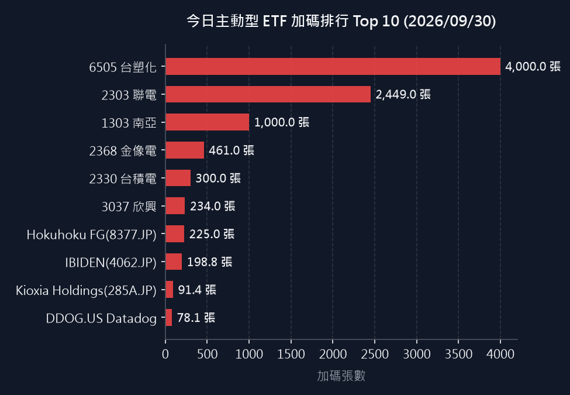
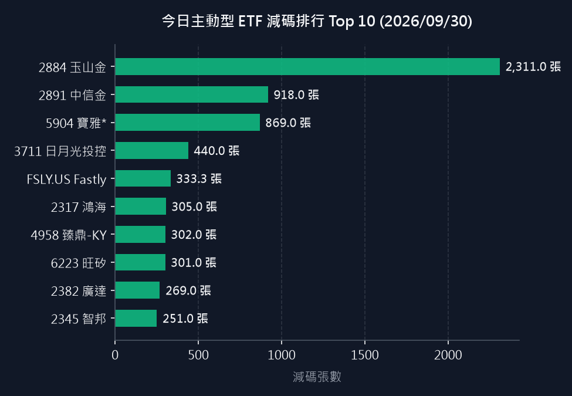

# 主動型 ETF 持股變動

資料來源：`主動型ETF持股明細.xlsx` 最近兩個日期分頁。

比較區間：`20260930` → `20261001`

## 今日加減碼視覺化排行

| 今日加碼 Top 10 | 今日減碼 Top 10 |
| :---: | :---: |
|  |  |

| ETF | 新增 | 刪除 | 比例變動 |
| :-- | --: | --: | --: |
| 00400A | 0 | 2 | 40 |
| 00401A | 0 | 0 | 48 |
| 00402A | 0 | 0 | 43 |
| 00403A | 0 | 0 | 30 |
| 00404A | 2 | 3 | 39 |
| 00405A | 2 | 1 | 27 |
| 00406A | 1 | 0 | 60 |
| 00407A | 0 | 0 | 40 |
| 00408A | 3 | 3 | 43 |
| 00980A | 0 | 0 | 45 |
| 00980D | 5 | 0 | 29 |
| 00981A | 0 | 0 | 30 |
| 00982A | 0 | 0 | 44 |
| 00983A | 0 | 0 | 28 |
| 00983D | 0 | 0 | 38 |
| 00984A | 20 | 22 | 67 |
| 00985A | 2 | 2 | 44 |
| 00986A | 0 | 0 | 31 |
| 00987A | 0 | 0 | 26 |
| 00988A | 2 | 1 | 40 |
| 00989A | 0 | 0 | 60 |
| 00990A | 2 | 1 | 38 |
| 00991A | 0 | 0 | 21 |
| 00992A | 0 | 0 | 35 |
| 00993A | 0 | 2 | 41 |
| 00994A | 4 | 0 | 35 |
| 00995A | 2 | 0 | 45 |
| 00996A | 0 | 0 | 40 |
| 00997A | 0 | 0 | 37 |
| 00998A | 2 | 2 | 41 |
| 00999A | 0 | 0 | 48 |

## 00400A

### 新增持股

- 無

### 刪除持股

- 2345 智邦（1.43%，227 張）
- 6442 光聖（0.30%，58 張）

### 投資比例變動

- 1303 南亞：3.12% → 3.65%（+0.53）
- 2059 川湖：5.19% → 5.02%（-0.17）
- 2303 聯電：1.12% → 1.17%（+0.05）
- 2308 台達電：3.82% → 4.39%（+0.57）
- 2313 華通：0.87% → 0.86%（-0.01）
- 2330 台積電：8.91% → 8.95%（+0.04）
- 2360 致茂：3.57% → 3.37%（-0.20）
- 2368 金像電：1.47% → 1.43%（-0.04）
- 2383 台光電：3.89% → 4.84%（+0.95）
- 2454 聯發科：7.06% → 7.09%（+0.03）
- 2603 長榮：0.97% → 0.96%（-0.01）
- 2637 慧洋-KY：0.28% → 0.27%（-0.01）
- 2881 富邦金：1.64% → 1.61%（-0.03）
- 3008 大立光：0.82% → 0.83%（+0.01）
- 3017 奇鋐：4.46% → 4.56%（+0.10）
- 3026 禾伸堂：1.12% → 1.19%（+0.07）
- 3036 文曄：1.59% → 1.62%（+0.03）
- 3037 欣興：4.90% → 5.07%（+0.17）
- 3044 健鼎：1.87% → 1.89%（+0.02）
- 3081 聯亞：0.76% → 0.75%（-0.01）
- 3090 日電貿：0.33% → 0.34%（+0.01）
- 3167 大量：0.36% → 0.39%（+0.03）
- 3293 鈊象：0.36% → 0.37%（+0.01）
- 3374 精材：0.54% → 0.53%（-0.01）
- 3443 創意：4.27% → 4.22%（-0.05）
- 3529 力旺：1.52% → 1.48%（-0.04）
- 3653 健策：5.30% → 5.24%（-0.06）
- 3665 貿聯-KY：2.05% → 2.60%（+0.55）
- 3711 日月光投控：1.11% → 1.14%（+0.03）
- 5274 信驊：3.20% → 3.11%（-0.09）
- 5434 崇越：0.38% → 0.39%（+0.01）
- 6121 新普：0.24% → 0.23%（-0.01）
- 6187 萬潤：2.72% → 2.62%（-0.10）
- 6223 旺矽：4.29% → 3.14%（-1.15）
- 6488 環球晶：2.05% → 3.31%（+1.26）
- 6505 台塑化：2.02% → 2.00%（-0.02）
- 6669 緯穎：3.20% → 3.19%（-0.01）
- 7750 新代：0.83% → 0.80%（-0.03）
- 7769 鴻勁：0.14% → 0.13%（-0.01）
- 台指選擇權 2026/10：0.05% → 0.00%（-0.05）

## 00401A

### 新增持股

- 無

### 刪除持股

- 無

### 投資比例變動

- 1303 南亞：1.00% → 0.99%（-0.01）
- 1477 聚陽：0.83% → 0.82%（-0.01）
- 2059 川湖：0.96% → 0.93%（-0.03）
- 2303 聯電：2.51% → 2.61%（+0.10）
- 2308 台達電：2.54% → 2.55%（+0.01）
- 2313 華通：1.35% → 1.33%（-0.02）
- 2327 國巨*：0.59% → 0.64%（+0.05）
- 2330 台積電：20.09% → 20.22%（+0.13）
- 2345 智邦：0.50% → 0.53%（+0.03）
- 2360 致茂：1.33% → 1.29%（-0.04）
- 2382 廣達：2.09% → 2.08%（-0.01）
- 2412 中華電：0.78% → 0.79%（+0.01）
- 2454 聯發科：6.70% → 6.75%（+0.05）
- 2455 全新：2.27% → 2.24%（-0.03）
- 2603 長榮：1.00% → 0.99%（-0.01）
- 2881 富邦金：1.93% → 1.92%（-0.01）
- 2882 國泰金：1.00% → 0.99%（-0.01）
- 2883 凱基金：1.63% → 1.54%（-0.09）
- 2884 玉山金：1.85% → 1.86%（+0.01）
- 2886 兆豐金：1.27% → 1.26%（-0.01）
- 2887 台新新光金：1.05% → 1.02%（-0.03）
- 2890 永豐金：0.29% → 0.28%（-0.01）
- 2891 中信金：1.47% → 1.46%（-0.01）
- 3008 大立光：2.10% → 2.18%（+0.08）
- 3034 聯詠：0.21% → 0.20%（-0.01）
- 3037 欣興：2.34% → 2.41%（+0.07）
- 3131 弘塑：0.73% → 0.69%（-0.04）
- 3231 緯創：1.61% → 1.65%（+0.04）
- 3491 昇達科：1.68% → 1.66%（-0.02）
- 3711 日月光投控：2.55% → 2.57%（+0.02）
- 4904 遠傳：0.71% → 0.72%（+0.01）
- 4991 環宇-KY：0.96% → 0.95%（-0.01）
- 5274 信驊：2.00% → 2.02%（+0.02）
- 5347 世界：1.35% → 1.37%（+0.02）
- 5904 寶雅*：0.51% → 0.50%（-0.01）
- 6147 頎邦：1.31% → 1.40%（+0.09）
- 6187 萬潤：0.67% → 0.65%（-0.02）
- 6223 旺矽：1.53% → 1.50%（-0.03）
- 6285 啟碁：1.30% → 1.29%（-0.01）
- 6515 穎崴：1.71% → 1.66%（-0.05）
- 6669 緯穎：1.80% → 1.81%（+0.01）
- 7769 鴻勁：1.27% → 1.26%（-0.01）
- 7828 創新服務：1.74% → 1.72%（-0.02）
- 8464 億豐：0.97% → 0.95%（-0.02）
- 台股期貨10/26(FITXN*1.TF)：0.34% → 0.39%（+0.05）
- 臺指選擇權10/26 46000 買權：-0.07% → -0.08%（-0.01）
- 臺指選擇權10/26 46400 買權：-0.96% → -1.06%（-0.10）
- 臺指選擇權10/26 46800 買權：-0.05% → -0.06%（-0.01）

## 00402A

### 新增持股

- 無

### 刪除持股

- 無

### 投資比例變動

- AAPL.US Apple：7.53% → 7.54%（+0.01）
- ADI.US Analog Devices：1.68% → 1.70%（+0.02）
- AMD.US AMD：6.22% → 6.10%（-0.12）
- AMZN.US Amazon：4.02% → 3.79%（-0.23）
- ANET.US Arista Networks：0.86% → 0.87%（+0.01）
- ASML.US ASML Holding：1.31% → 1.12%（-0.19）
- AVGO.US Broadcom：2.35% → 2.36%（+0.01）
- AXON.US Axon Enterprise：0.51% → 0.52%（+0.01）
- BABA.US Alibaba Group：0.57% → 0.43%（-0.14）
- BKNG.US Booking Holdings：0.46% → 0.47%（+0.01）
- CDNS.US Cadence Design Systems：1.49% → 1.54%（+0.05）
- CIEN.US Ciena：1.17% → 1.18%（+0.01）
- CRWD.US CrowdStrike Holdings：1.71% → 1.75%（+0.04）
- FSLY.US Fastly：0.43% → 0.44%（+0.01）
- GOOG.US Alphabet - Class C Capital Stock：2.94% → 3.01%（+0.07）
- GOOGL.US Alphabet - Class A Common Stock：3.28% → 3.36%（+0.08）
- INTC.US Intel：1.55% → 1.63%（+0.08）
- IOT.US Samsara：0.55% → 0.56%（+0.01）
- KLAC.US KLA：1.63% → 1.64%（+0.01）
- LITE.US Lumentum：1.69% → 1.71%（+0.02）
- LRCX.US Lam Research：2.92% → 2.80%（-0.12）
- MDB.US MongoDB：0.43% → 0.32%（-0.11）
- META.US Meta：3.95% → 3.94%（-0.01）
- MRVL.US Marvell：1.56% → 1.58%（+0.02）
- MSFT.US Microsoft：5.23% → 4.96%（-0.27）
- MU.US Micron：6.72% → 6.61%（-0.11）
- NFLX.US Netflix：0.86% → 0.87%（+0.01）
- NOW.US ServiceNow：0.85% → 0.89%（+0.04）
- NVDA.US NVIDIA：8.75% → 8.56%（-0.19）
- PANW.US Palo Alto：2.73% → 2.83%（+0.10）
- PLTR.US Palantir Technologies：1.89% → 1.91%（+0.02）
- SHOP.US Shopify：0.89% → 0.90%（+0.01）
- SIMO.US Silicon Motion：0.63% → 0.55%（-0.08）
- SNOW.US Snowflake：1.06% → 1.11%（+0.05）
- SPCX.US SpaceX：0.65% → 0.66%（+0.01）
- SPOT.US Spotify：0.53% → 0.40%（-0.13）
- STX.US Seagate：1.58% → 1.62%（+0.04）
- TER.US Teradyne：0.88% → 0.89%（+0.01）
- TSM.US TSMC(ADR)：1.51% → 1.53%（+0.02）
- TTWO.US Take-Two：0.60% → 0.62%（+0.02）
- TXN.US Texas Instruments：2.38% → 2.24%（-0.14）
- V.US Visa：1.12% → 0.97%（-0.15）
- WDC.US Western Digital：2.45% → 2.49%（+0.04）

## 00403A

### 新增持股

- 無

### 刪除持股

- 無

### 投資比例變動

- 1303 南亞：1.75% → 1.72%（-0.03）
- 1717 長興：0.05% → 0.04%（-0.01）
- 2059 川湖：0.62% → 0.60%（-0.02）
- 2303 聯電：5.51% → 5.69%（+0.18）
- 2308 台達電：3.76% → 3.75%（-0.01）
- 2327 國巨*：3.00% → 3.26%（+0.26）
- 2330 台積電：13.09% → 13.10%（+0.01）
- 2345 智邦：2.07% → 2.06%（-0.01）
- 2360 致茂：0.14% → 0.13%（-0.01）
- 2383 台光電：4.73% → 4.72%（-0.01）
- 2408 南亞科：1.00% → 0.99%（-0.01）
- 2449 京元電子：0.81% → 0.80%（-0.01）
- 2454 聯發科：7.45% → 7.46%（+0.01）
- 2455 全新：0.15% → 0.11%（-0.04）
- 2481 強茂：0.35% → 0.36%（+0.01）
- 3008 大立光：0.81% → 0.84%（+0.03）
- 3017 奇鋐：5.88% → 5.95%（+0.07）
- 3037 欣興：6.81% → 6.97%（+0.16）
- 3189 景碩：2.86% → 2.95%（+0.09）
- 3211 順達：0.55% → 0.53%（-0.02）
- 3443 創意：3.36% → 3.05%（-0.31）
- 3450 聯鈞：0.54% → 0.52%（-0.02）
- 3583 辛耘：0.39% → 0.38%（-0.01）
- 3665 貿聯-KY：2.49% → 2.53%（+0.04）
- 6223 旺矽：3.51% → 3.17%（-0.34）
- 6442 光聖：0.36% → 0.35%（-0.01）
- 6488 環球晶：1.99% → 2.06%（+0.07）
- 6805 富世達：1.18% → 0.86%（-0.32）
- 8046 南電：2.66% → 2.90%（+0.24）
- 8996 高力：1.98% → 1.91%（-0.07）

## 00404A

### 新增持股

- 台指選擇權10/26 49100 買權（-0.34%，-0.421 張）
- 台指選擇權11/26 50300 買權（-0.03%，-0.022 張）

### 刪除持股

- 3135 凌航（0.05%，13.733 張）
- 台指選擇權10/26 49500 買權（-0.16%，-0.353 張）
- 台指選擇權11/26 50400 買權（-0.02%，-0.018 張）

### 投資比例變動

- 1303 南亞：0.80% → 0.81%（+0.01）
- 2027 大成鋼：1.58% → 1.59%（+0.01）
- 2059 川湖：1.14% → 1.10%（-0.04）
- 2303 聯電：2.11% → 2.19%（+0.08）
- 2308 台達電：1.81% → 1.86%（+0.05）
- 2330 台積電：23.07% → 23.10%（+0.03）
- 2345 智邦：0.81% → 0.84%（+0.03）
- 2347 聯強：1.92% → 1.91%（-0.01）
- 2351 順德：0.37% → 0.36%（-0.01）
- 2357 華碩：0.91% → 0.90%（-0.01）
- 2360 致茂：0.67% → 0.63%（-0.04）
- 2379 瑞昱：1.11% → 1.10%（-0.01）
- 2382 廣達：2.11% → 2.07%（-0.04）
- 2395 研華：1.32% → 1.29%（-0.03）
- 2436 偉詮電：1.23% → 1.19%（-0.04）
- 2454 聯發科：6.65% → 6.66%（+0.01）
- 2542 興富發：1.52% → 1.49%（-0.03）
- 2637 慧洋-KY：1.10% → 1.09%（-0.01）
- 2883 凱基金：1.19% → 1.11%（-0.08）
- 2885 元大金：2.44% → 2.36%（-0.08）
- 2887 台新新光金：1.39% → 1.35%（-0.04）
- 2890 永豐金：1.43% → 1.41%（-0.02）
- 2892 第一金：1.85% → 1.84%（-0.01）
- 3017 奇鋐：1.36% → 1.39%（+0.03）
- 3037 欣興：0.27% → 0.28%（+0.01）
- 3293 鈊象：0.51% → 0.53%（+0.02）
- 3443 創意：0.75% → 0.73%（-0.02）
- 3711 日月光投控：3.49% → 3.56%（+0.07）
- 4763 材料*-KY：1.63% → 1.61%（-0.02）
- 5274 信驊：2.48% → 2.41%（-0.07）
- 5434 崇越：1.81% → 1.87%（+0.06）
- 6196 帆宣：1.88% → 2.06%（+0.18）
- 6206 飛捷：1.06% → 1.01%（-0.05）
- 6223 旺矽：1.16% → 1.11%（-0.05）
- 6257 矽格：1.70% → 1.82%（+0.12）
- 7769 鴻勁：1.18% → 1.15%（-0.03）
- 8081 致新：0.84% → 0.82%（-0.02）
- 8299 群聯：1.15% → 1.13%（-0.02）
- 台股期貨10/26(FITXN*1.TF)：15.52% → 16.53%（+1.01）

## 00405A

### 新增持股

- 1303 南亞（0.68%，700 張）
- 3189 景碩（0.19%，50 張）

### 刪除持股

- 6831 邁科（0.18%，100 張）

### 投資比例變動

- 2059 川湖：1.95% → 1.91%（-0.04）
- 2303 聯電：1.06% → 1.11%（+0.05）
- 2330 台積電：1.71% → 1.73%（+0.02）
- 2345 智邦：3.62% → 3.87%（+0.25）
- 2368 金像電：4.87% → 4.75%（-0.12）
- 2383 台光電：4.04% → 4.06%（+0.02）
- 2454 聯發科：6.53% → 6.60%（+0.07）
- 3017 奇鋐：3.68% → 3.76%（+0.08）
- 3037 欣興：7.80% → 8.98%（+1.18）
- 3443 創意：6.61% → 6.48%（-0.13）
- 3450 聯鈞：1.31% → 0.50%（-0.81）
- 3653 健策：6.82% → 6.88%（+0.06）
- 3665 貿聯-KY：6.66% → 6.54%（-0.12）
- 5274 信驊：3.93% → 3.98%（+0.05）
- 6187 萬潤：0.75% → 0.73%（-0.02）
- 6223 旺矽：6.39% → 6.26%（-0.13）
- 6274 台燿：1.79% → 1.81%（+0.02）
- 6278 台表科：1.18% → 1.17%（-0.01）
- 6510 精測：2.90% → 1.79%（-1.11）
- 6515 穎崴：0.53% → 0.51%（-0.02）
- 6531 愛普*：3.68% → 3.70%（+0.02）
- 6669 緯穎：0.80% → 0.81%（+0.01）
- 6805 富世達：4.18% → 4.06%（-0.12）
- 7734 印能科技：0.82% → 0.32%（-0.50）
- 7769 鴻勁：2.55% → 2.54%（-0.01）
- 8046 南電：3.82% → 4.70%（+0.88）
- 8996 高力：1.75% → 1.70%（-0.05）

## 00406A

### 新增持股

- 3529 力旺（0.27%，50 張）

### 刪除持股

- 無

### 投資比例變動

- 1303 南亞：0.17% → 0.16%（-0.01）
- 1326 台化：0.30% → 0.28%（-0.02）
- 1560 中砂：0.71% → 0.70%（-0.01）
- 2059 川湖：1.67% → 1.55%（-0.12）
- 2303 聯電：2.02% → 2.40%（+0.38）
- 2308 台達電：3.52% → 3.50%（-0.02）
- 2317 鴻海：0.61% → 0.58%（-0.03）
- 2327 國巨*：1.56% → 1.61%（+0.05）
- 2330 台積電：9.39% → 9.41%（+0.02）
- 2344 華邦電：0.36% → 0.35%（-0.01）
- 2345 智邦：3.16% → 3.20%（+0.04）
- 2360 致茂：0.64% → 0.69%（+0.05）
- 2368 金像電：0.35% → 0.56%（+0.21）
- 2383 台光電：5.26% → 5.27%（+0.01）
- 2395 研華：0.15% → 0.14%（-0.01）
- 2449 京元電子：0.67% → 0.63%（-0.04）
- 2454 聯發科：5.77% → 6.09%（+0.32）
- 2455 全新：0.15% → 0.14%（-0.01）
- 2481 強茂：0.32% → 0.31%（-0.01）
- 2486 一詮：0.35% → 0.34%（-0.01）
- 2885 元大金：1.02% → 0.95%（-0.07）
- 2886 兆豐金：0.21% → 0.20%（-0.01）
- 3017 奇鋐：5.54% → 5.72%（+0.18）
- 3037 欣興：5.24% → 5.44%（+0.20）
- 3081 聯亞：0.46% → 0.43%（-0.03）
- 3105 穩懋：0.20% → 0.19%（-0.01）
- 3131 弘塑：0.11% → 0.09%（-0.02）
- 3167 大量：0.69% → 0.72%（+0.03）
- 3189 景碩：0.93% → 1.13%（+0.20）
- 3260 威剛：0.12% → 0.11%（-0.01）
- 3264 欣銓：0.25% → 0.24%（-0.01）
- 3363 上詮：0.44% → 0.41%（-0.03）
- 3443 創意：1.90% → 1.76%（-0.14）
- 3450 聯鈞：0.29% → 0.27%（-0.02）
- 3491 昇達科：0.86% → 0.80%（-0.06）
- 3583 辛耘：0.10% → 0.09%（-0.01）
- 3653 健策：3.72% → 3.89%（+0.17）
- 3665 貿聯-KY：3.38% → 3.22%（-0.16）
- 3711 日月光投控：2.21% → 2.46%（+0.25）
- 4958 臻鼎-KY：0.51% → 0.48%（-0.03）
- 5274 信驊：3.02% → 2.90%（-0.12）
- 6147 頎邦：0.38% → 0.49%（+0.11）
- 6187 萬潤：0.36% → 0.33%（-0.03）
- 6213 聯茂：0.54% → 0.53%（-0.01）
- 6223 旺矽：3.56% → 3.30%（-0.26）
- 6274 台燿：1.34% → 1.28%（-0.06）
- 6285 啟碁：0.13% → 0.12%（-0.01）
- 6488 環球晶：0.67% → 0.66%（-0.01）
- 6510 精測：1.17% → 1.20%（+0.03）
- 6515 穎崴：0.56% → 0.51%（-0.05）
- 6531 愛普*：0.27% → 0.25%（-0.02）
- 6669 緯穎：2.58% → 2.46%（-0.12）
- 6805 富世達：0.19% → 0.17%（-0.02）
- 7769 鴻勁：0.39% → 0.37%（-0.02）
- 8046 南電：2.51% → 2.52%（+0.01）
- 8358 金居：0.20% → 0.19%（-0.01）
- 8996 高力：0.42% → 0.39%（-0.03）
- 臺指選擇權第一週週三到期契約：-2.10% → -4.44%（-2.34）
- 臺指選擇權第一週週五到期契約：-11.14% → -17.81%（-6.67）
- 臺股期貨 202610(FITXN*1.TF)：23.46% → 23.92%（+0.46）

## 00407A

### 新增持股

- 無

### 刪除持股

- 無

### 投資比例變動

- 1303 南亞：0.77% → 0.79%（+0.02）
- 1560 中砂：1.04% → 1.08%（+0.04）
- 2059 川湖：2.68% → 2.61%（-0.07）
- 2301 光寶科：1.45% → 1.47%（+0.02）
- 2303 聯電：0.60% → 0.63%（+0.03）
- 2308 台達電：2.65% → 2.74%（+0.09）
- 2327 國巨*：2.19% → 2.40%（+0.21）
- 2330 台積電：9.16% → 9.26%（+0.10）
- 2345 智邦：2.48% → 2.03%（-0.45）
- 2360 致茂：1.77% → 0.97%（-0.80）
- 2368 金像電：0.57% → 0.55%（-0.02）
- 2383 台光電：4.94% → 4.98%（+0.04）
- 2408 南亞科：0.96% → 0.98%（+0.02）
- 2454 聯發科：5.89% → 5.96%（+0.07）
- 2615 萬海：0.67% → 0.68%（+0.01）
- 3008 大立光：1.41% → 1.45%（+0.04）
- 3017 奇鋐：5.69% → 5.85%（+0.16）
- 3034 聯詠：0.73% → 0.74%（+0.01）
- 3037 欣興：5.70% → 5.93%（+0.23）
- 3131 弘塑：0.88% → 0.85%（-0.03）
- 3231 緯創：0.73% → 0.74%（+0.01）
- 3293 鈊象：0.59% → 0.62%（+0.03）
- 3443 創意：4.82% → 4.79%（-0.03）
- 3491 昇達科：0.91% → 0.90%（-0.01）
- 3529 力旺：0.70% → 0.69%（-0.01）
- 3653 健策：3.58% → 3.56%（-0.02）
- 3665 貿聯-KY：2.35% → 3.15%（+0.80）
- 3711 日月光投控：2.92% → 3.01%（+0.09）
- 4958 臻鼎-KY：0.93% → 0.95%（+0.02）
- 5274 信驊：2.55% → 1.85%（-0.70）
- 5434 崇越：0.20% → 0.21%（+0.01）
- 6187 萬潤：1.49% → 1.44%（-0.05）
- 6223 旺矽：2.65% → 2.56%（-0.09）
- 6274 台燿：3.57% → 3.68%（+0.11）
- 6446 藥華藥：0.32% → 0.31%（-0.01）
- 6510 精測：1.34% → 1.27%（-0.07）
- 6669 緯穎：3.74% → 3.75%（+0.01）
- 6805 富世達：2.22% → 1.19%（-1.03）
- 8046 南電：1.92% → 3.05%（+1.13）
- 8996 高力：2.19% → 2.15%（-0.04）

## 00408A

### 新增持股

- 2327 國巨*（0.61%，15 張）
- 3105 穩懋（0.51%，14 張）
- 6691 洋基工程（0.35%，7 張）

### 刪除持股

- 2891 中信金（1.12%，240 張）
- 3045 台灣大（1.03%，125 張）
- 9941 裕融（0.28%，53.2 張）

### 投資比例變動

- 1303 南亞：1.36% → 2.42%（+1.06）
- 1560 中砂：0.39% → 0.41%（+0.02）
- 2059 川湖：0.41% → 0.40%（-0.01）
- 2303 聯電：3.38% → 3.52%（+0.14）
- 2308 台達電：2.87% → 3.33%（+0.46）
- 2330 台積電：5.74% → 5.76%（+0.02）
- 2344 華邦電：0.47% → 0.49%（+0.02）
- 2345 智邦：0.74% → 0.77%（+0.03）
- 2357 華碩：1.97% → 1.96%（-0.01）
- 2360 致茂：1.19% → 1.12%（-0.07）
- 2368 金像電：3.51% → 3.40%（-0.11）
- 2376 技嘉：1.36% → 1.37%（+0.01）
- 2395 研華：1.69% → 1.66%（-0.03）
- 2408 南亞科：2.28% → 2.31%（+0.03）
- 2449 京元電子：1.51% → 1.50%（-0.01）
- 2454 聯發科：6.21% → 4.88%（-1.33）
- 2542 興富發：3.56% → 3.50%（-0.06）
- 2801 彰銀：2.19% → 2.17%（-0.02）
- 3008 大立光：0.82% → 0.84%（+0.02）
- 3017 奇鋐：3.48% → 3.56%（+0.08）
- 3026 禾伸堂：0.33% → 0.35%（+0.02）
- 3037 欣興：4.21% → 4.35%（+0.14）
- 3081 聯亞：1.27% → 1.17%（-0.10）
- 3189 景碩：2.22% → 2.32%（+0.10）
- 3231 緯創：0.38% → 0.39%（+0.01）
- 3264 欣銓：0.72% → 0.73%（+0.01）
- 3443 創意：0.54% → 0.53%（-0.01）
- 3491 昇達科：1.03% → 1.01%（-0.02）
- 3653 健策：2.82% → 2.79%（-0.03）
- 3665 貿聯-KY：0.67% → 1.38%（+0.71）
- 3711 日月光投控：1.55% → 1.58%（+0.03）
- 5434 崇越：2.14% → 2.22%（+0.08）
- 6187 萬潤：0.98% → 0.60%（-0.38）
- 6223 旺矽：2.05% → 1.97%（-0.08）
- 6239 力成：1.28% → 1.32%（+0.04）
- 6274 台燿：2.84% → 2.90%（+0.06）
- 6488 環球晶：0.45% → 1.03%（+0.58）
- 6669 緯穎：3.84% → 3.82%（-0.02）
- 6805 富世達：1.54% → 1.45%（-0.09）
- 7769 鴻勁：0.57% → 0.56%（-0.01）
- 8046 南電：1.82% → 2.01%（+0.19）
- 8996 高力：1.95% → 1.90%（-0.05）
- 9802 鈺齊-KY：1.11% → 0.84%（-0.27）

## 00980A

### 新增持股

- 無

### 刪除持股

- 無

### 投資比例變動

- 1303 南亞：3.09% → 3.06%（-0.03）
- 2059 川湖：4.04% → 3.95%（-0.09）
- 2303 聯電：0.72% → 0.75%（+0.03）
- 2308 台達電：3.82% → 3.83%（+0.01）
- 2317 鴻海：2.04% → 2.05%（+0.01）
- 2327 國巨*：1.33% → 1.45%（+0.12）
- 2330 台積電：9.35% → 9.42%（+0.07）
- 2345 智邦：1.55% → 1.65%（+0.10）
- 2360 致茂：1.58% → 1.53%（-0.05）
- 2368 金像電：2.20% → 2.14%（-0.06）
- 2376 技嘉：0.87% → 0.89%（+0.02）
- 2382 廣達：1.20% → 1.19%（-0.01）
- 2383 台光電：3.85% → 3.87%（+0.02）
- 2408 南亞科：2.85% → 2.83%（-0.02）
- 2454 聯發科：6.13% → 6.18%（+0.05）
- 2884 玉山金：0.90% → 0.91%（+0.01）
- 2891 中信金：0.95% → 0.94%（-0.01）
- 3008 大立光：0.77% → 0.80%（+0.03）
- 3017 奇鋐：2.30% → 2.34%（+0.04）
- 3026 禾伸堂：1.13% → 1.21%（+0.08）
- 3036 文曄：1.18% → 1.21%（+0.03）
- 3037 欣興：3.68% → 3.78%（+0.10）
- 3081 聯亞：2.18% → 2.14%（-0.04）
- 3189 景碩：1.29% → 1.34%（+0.05）
- 3231 緯創：1.20% → 1.23%（+0.03）
- 3264 欣銓：0.79% → 0.80%（+0.01）
- 3293 鈊象：0.99% → 1.02%（+0.03）
- 3443 創意：2.38% → 2.32%（-0.06）
- 3529 力旺：0.73% → 0.71%（-0.02）
- 3653 健策：3.10% → 3.12%（+0.02）
- 3665 貿聯-KY：0.63% → 0.62%（-0.01）
- 3711 日月光投控：2.19% → 2.20%（+0.01）
- 5274 信驊：1.91% → 1.93%（+0.02）
- 5904 寶雅*：0.79% → 0.78%（-0.01）
- 6213 聯茂：1.03% → 1.06%（+0.03）
- 6223 旺矽：1.90% → 1.85%（-0.05）
- 6274 台燿：1.37% → 1.38%（+0.01）
- 6515 穎崴：1.81% → 1.75%（-0.06）
- 6669 緯穎：1.62% → 1.63%（+0.01）
- 6805 富世達：0.66% → 0.64%（-0.02）
- 7769 鴻勁：2.51% → 2.49%（-0.02）
- 8046 南電：1.68% → 1.78%（+0.10）
- 8299 群聯：1.81% → 1.77%（-0.04）
- 8996 高力：0.77% → 0.75%（-0.02）
- 台灣證交所加權股價指數(FITXN*1.TF)：3.00% → 3.01%（+0.01）

## 00980D

### 新增持股

- ASURION LLC/ASURION CO 8.375% 01FEB2034（0.46%，N/A 張）
- CHARTER COMM OPT LLC/CAP (REG) 7.85% 15AUG2056（0.24%，N/A 張）
- COREWEAVE INC SER REGS (REG) (REG S) 9.625% 15JUL2032（0.49%，N/A 張）
- FMC CORP SER REGS (REG) (REG S) 8% 01JUN2031（0.03%，N/A 張）
- ORACLE CORP 5.500000 % 27SEP2064（0.22%，N/A 張）

### 刪除持股

- 無

### 投資比例變動

- ARCELORMITTAL SA 6.55% 29NOV2027：0.55% → 0.56%（+0.01）
- AVIANCA MIDCO 2 PLC SER REGS 10.25 % 07-JAN-2032：0.29% → 0.28%（-0.01）
- BLACKSTONE PRIVATE CRE 7.300000 % 27NOV2028：0.47% → 0.48%（+0.01）
- BRIGHTHOUSE FINANCIAL IN (REG) 4.7% 22JUN2047：0.47% → 0.48%（+0.01）
- CALDERYS FINANCING LLC SER REGS (REG S) 11.25% 01JUN2028：0.33% → 0.34%（+0.01）
- CHS/COMMUNITY HEALTH SYS SER REGS 10.875000 % 15JAN2032：0.43% → 0.50%（+0.07）
- CIVITAS RESOURCES INC SER REGS (REG) (REG S) 9.625% 15JUN2033：0.55% → 0.56%（+0.01）
- COX COMMUNICATIONS INC SER REGS 5.800000 % 15DEC2053：0.38% → 0.49%（+0.11）
- DEUTSCHE BANK NY VAR 10FEB2034：0.33% → 0.34%（+0.01）
- DOW CHEMICAL CO/THE 6.9% 15MAY2053：0.60% → 0.59%（-0.01）
- DOW CHEMICAL CO/THE 7.375% 01NOV2029：0.61% → 0.62%（+0.01）
- FMC CORP (REG) 6.375000 % 18MAY2053：0.44% → 0.43%（-0.01）
- FORD MOTOR COMPANY 5.291% 08DEC2046：0.28% → 0.27%（-0.01）
- GLOBAL ATLANTIC FIN CO SER REGS 7.950000 % 15JUN2033：0.66% → 0.65%（-0.01）
- GLOBAL AUTO HO/AAG FH UK SER REGS (REG S) 11.5% 15AUG2029：0.37% → 0.38%（+0.01）
- JBS USA/FOOD/FINANCE (REG) 6.5% 01DEC2052：0.45% → 0.44%（-0.01）
- LBM ACQUISITION LLC SER REGS 9.500000 % 15JUN2031：0.43% → 0.44%（+0.01）
- M&T BANK CORPORATION (REG) VAR 30OCT2029：0.54% → 0.55%（+0.01）
- MACQUARIE BANK LTD SER REGS (REG S) 6.798% 18JAN2033：0.34% → 0.33%（-0.01）
- NAVIENT CORP (REG) 11.5% 15MAR2031：0.32% → 0.43%（+0.11）
- OPEN TEXT CORP SER REGS (REG) (REG S) 6.9% 01DEC2027：0.67% → 0.68%（+0.01）
- ORACLE CORP 6.100000 % 26-SEP-2065：0.46% → 0.51%（+0.05）
- SOCIETE GENERALE SER REGS (REG) (REG S) 7.367% 10JAN2053：0.32% → 0.31%（-0.01）
- STAPLES INC SER REGS (REG S) 10.75% 01SEP2029：0.50% → 0.49%（-0.01）
- SYMETRA LIFE INSURANCE SER REGS 6.550000 % 01OCT2055：0.31% → 0.30%（-0.01）
- US 10YR NOTE (CBT)DEC26 21-DEC-2026：17.74% → 17.71%（-0.03）
- US 5YR NOTE (CBT) DEC26 31-DEC-2026：-13.68% → -13.67%（+0.01）
- US LONG BOND(CBT) DEC26 21-DEC-2026：5.23% → 5.20%（-0.03）
- VAR ENERGI ASA SER REGS (REG S) 8% 15NOV2032：0.35% → 0.36%（+0.01）

## 00981A

### 新增持股

- 無

### 刪除持股

- 無

### 投資比例變動

- 2303 聯電：4.72% → 4.84%（+0.12）
- 2308 台達電：4.90% → 4.84%（-0.06）
- 2327 國巨*：4.76% → 5.13%（+0.37）
- 2330 台積電：9.97% → 9.90%（-0.07）
- 2345 智邦：3.90% → 4.09%（+0.19）
- 2368 金像電：0.97% → 0.94%（-0.03）
- 2383 台光電：8.04% → 7.96%（-0.08）
- 2449 京元電子：1.34% → 1.32%（-0.02）
- 2454 聯發科：8.77% → 8.71%（-0.06）
- 3017 奇鋐：7.09% → 7.11%（+0.02）
- 3037 欣興：8.28% → 8.40%（+0.12）
- 3264 欣銓：0.43% → 0.42%（-0.01）
- 3376 新日興：0.11% → 0.10%（-0.01）
- 3443 創意：1.09% → 1.05%（-0.04）
- 3653 健策：5.96% → 5.92%（-0.04）
- 3665 貿聯-KY：3.53% → 3.41%（-0.12）
- 3711 日月光投控：3.09% → 3.06%（-0.03）
- 4958 臻鼎-KY：0.62% → 0.61%（-0.01）
- 6187 萬潤：0.06% → 0.05%（-0.01）
- 6191 精成科：0.12% → 0.11%（-0.01）
- 6223 旺矽：4.49% → 4.32%（-0.17）
- 6274 台燿：3.28% → 3.25%（-0.03）
- 6510 精測：0.27% → 0.26%（-0.01）
- 6515 穎崴：0.19% → 0.18%（-0.01）
- 6669 緯穎：3.53% → 3.38%（-0.15）
- 6805 富世達：1.44% → 1.38%（-0.06）
- 8046 南電：4.20% → 4.37%（+0.17）
- 8210 勤誠：0.33% → 0.30%（-0.03）
- 8996 高力：0.27% → 0.26%（-0.01）
- 台指期貨 2026/10(FITXN*1.TF)：2.30% → 2.27%（-0.03）

## 00982A

### 新增持股

- 無

### 刪除持股

- 無

### 投資比例變動

- 2059 川湖：4.37% → 4.18%（-0.19）
- 2301 光寶科：1.82% → 1.81%（-0.01）
- 2303 聯電：1.58% → 1.63%（+0.05）
- 2330 台積電：8.94% → 8.89%（-0.05）
- 2345 智邦：1.48% → 0.83%（-0.65）
- 2360 致茂：3.59% → 3.35%（-0.24）
- 2376 技嘉：1.27% → 1.26%（-0.01）
- 2377 微星：1.02% → 1.01%（-0.01）
- 2383 台光電：3.06% → 3.04%（-0.02）
- 2395 研華：1.42% → 1.38%（-0.04）
- 2428 興勤：1.15% → 1.17%（+0.02）
- 2454 聯發科：7.28% → 7.24%（-0.04）
- 2455 全新：1.67% → 1.65%（-0.02）
- 2467 志聖：1.10% → 1.07%（-0.03）
- 2476 鉅祥：0.32% → 0.31%（-0.01）
- 2478 大毅：1.03% → 1.06%（+0.03）
- 2486 一詮：0.77% → 0.79%（+0.02）
- 2885 元大金：0.31% → 0.29%（-0.02）
- 3008 大立光：3.04% → 3.08%（+0.04）
- 3017 奇鋐：2.55% → 2.58%（+0.03）
- 3090 日電貿：1.06% → 1.09%（+0.03）
- 3105 穩懋：5.67% → 6.06%（+0.39）
- 3231 緯創：1.36% → 1.37%（+0.01）
- 3491 昇達科：3.59% → 3.47%（-0.12）
- 3529 力旺：0.62% → 0.60%（-0.02）
- 3583 辛耘：1.13% → 1.10%（-0.03）
- 3711 日月光投控：1.21% → 1.23%（+0.02）
- 4958 臻鼎-KY：3.17% → 3.18%（+0.01）
- 5274 信驊：1.40% → 1.35%（-0.05）
- 5483 中美晶：1.30% → 1.43%（+0.13）
- 5536 聖暉*：0.83% → 0.86%（+0.03）
- 6139 亞翔：5.45% → 5.54%（+0.09）
- 6196 帆宣：0.33% → 0.36%（+0.03）
- 6213 聯茂：0.47% → 1.19%（+0.72）
- 6214 精誠：1.31% → 1.28%（-0.03）
- 6223 旺矽：3.14% → 2.99%（-0.15）
- 6239 力成：1.08% → 1.10%（+0.02）
- 6274 台燿：1.25% → 1.27%（+0.02）
- 6488 環球晶：2.06% → 2.32%（+0.26）
- 6531 愛普*：3.82% → 3.76%（-0.06）
- 6640 均華：0.30% → 0.31%（+0.01）
- 6669 緯穎：4.30% → 4.23%（-0.07）
- 6672 騰輝電子-KY：0.36% → 0.42%（+0.06）
- 8996 高力：1.22% → 1.18%（-0.04）

## 00983A

### 新增持股

- 無

### 刪除持股

- 無

### 投資比例變動

- ACHR.US Archer：0.67% → 0.66%（-0.01）
- AMD.US AMD：3.33% → 3.36%（+0.03）
- AMZN.US Amazon：2.49% → 2.52%（+0.03）
- BLSH.US Bullish：2.25% → 2.20%（-0.05）
- BMNR.US BitMine：2.38% → 2.36%（-0.02）
- CBRS.US Cerebras：1.05% → 0.96%（-0.09）
- COIN.US Coinbase：4.58% → 4.50%（-0.08）
- CRCL.US Circle：4.74% → 4.67%（-0.07）
- CRSP.US CRISPR Therapeutics：3.97% → 3.93%（-0.04）
- CRWV.US CoreWeave：1.23% → 1.25%（+0.02）
- GOOG.US Alphabet - Class C Capital Stock：1.45% → 1.47%（+0.02）
- HOOD.US Robinhood Markets：4.50% → 4.37%（-0.13）
- ILMN.US Illumina：1.89% → 1.91%（+0.02）
- LLY.US Eli Lilly：0.83% → 0.81%（-0.02）
- META.US Meta：0.77% → 0.76%（-0.01）
- NET.US Cloudflare：1.29% → 1.27%（-0.02）
- NTLA.US Intellia Therapeutics：0.56% → 0.57%（+0.01）
- NVDA.US NVIDIA：2.43% → 2.45%（+0.02）
- PLTR.US Palantir Technologies：3.23% → 3.24%（+0.01）
- RXRX.US Recursion Pharmaceuticals：0.86% → 0.89%（+0.03）
- SHOP.US Shopify：3.98% → 4.00%（+0.02）
- SNOW.US Snowflake：0.51% → 0.53%（+0.02）
- SPCX.US SpaceX：6.16% → 6.25%（+0.09）
- TEM.US Tempus：6.21% → 6.17%（-0.04）
- TSLA.US Tesla：8.51% → 8.56%（+0.05）
- TWST.US Twist Bioscience：5.19% → 5.40%（+0.21）
- TXG.US 10x Genomics：4.76% → 4.79%（+0.03）
- WGS.US GeneDx：1.04% → 1.00%（-0.04）

## 00983D

### 新增持股

- 無

### 刪除持股

- 無

### 投資比例變動

- AMCX 10 1/2 07/15/32：1.62% → 1.63%（+0.01）
- ATH 6 5/8 05/19/55：0.98% → 0.96%（-0.02）
- BACR 7.437 11/02/33：1.25% → 1.26%（+0.01）
- BATSLN 7.081 08/02/53：1.30% → 1.28%（-0.02）
- BHCCN 11 09/30/28：1.90% → 1.91%（+0.01）
- BNCN 7 3/8 03/01/33：1.08% → 1.09%（+0.01）
- C 8 1/8 07/15/39：1.89% → 1.88%（-0.01）
- CEG 6 1/2 10/01/53：0.76% → 0.75%（-0.01）
- CRWV 9 02/01/31：1.24% → 1.25%（+0.01）
- CYH 10 7/8 01/15/32：1.49% → 1.50%（+0.01）
- DELL 8.35 07/15/46：1.38% → 1.37%（-0.01）
- DOW 6.9 05/15/53：0.74% → 0.73%（-0.01）
- DOW 9.4 05/15/39：1.91% → 1.90%（-0.01）
- DT 9 1/4 06/01/32：0.92% → 0.93%（+0.01）
- DUK 7 3/4 03/01/31：1.54% → 1.55%（+0.01）
- ENBCN 6.7 11/15/53：1.11% → 1.09%（-0.02）
- FFHCN 6.35 03/22/54：0.69% → 0.68%（-0.01）
- GM 6 3/4 04/01/46：1.16% → 1.14%（-0.02）
- GTN 10 1/2 07/15/29：0.58% → 0.59%（+0.01）
- HPE 6.35 10/15/45：0.98% → 0.97%（-0.01）
- HSBC 6.332 03/09/44：1.04% → 1.03%（-0.01）
- IEP 10 11/15/29：1.53% → 1.51%（-0.02）
- LQDW.US iShares Investment Grade Corpora：7.25% → 7.26%（+0.01）
- MBGGR 8 1/2 01/18/31：1.29% → 1.30%（+0.01）
- MS 7 1/4 04/01/32：1.61% → 1.62%（+0.01）
- OKE 6 5/8 09/01/53：0.70% → 0.69%（-0.01）
- ORCL 6.9 11/09/52：0.83% → 0.81%（-0.02）
- PCG 6 3/4 01/15/53：1.11% → 1.09%（-0.02）
- PCG 6.7 04/01/53：1.07% → 1.05%（-0.02）
- RAKUTN 11 1/4 02/15/27：1.81% → 1.82%（+0.01）
- S 8 3/4 03/15/32：0.93% → 0.94%（+0.01）
- SABHLD 10 3/4 11/15/29：0.63% → 0.10%（-0.53）
- SPCX 6.6 07/15/46：1.11% → 1.12%（+0.01）
- SVC 8 7/8 06/15/32：0.48% → 0.47%（-0.01）
- TLTW.US iShares 20+ Year Treasury Bond B：7.84% → 7.77%（-0.07）
- TRGP 6 1/2 02/15/53：0.16% → 0.15%（-0.01）
- VENLNG 9 1/2 02/01/29：1.41% → 1.42%（+0.01）
- VZ 7 3/4 12/01/30：1.13% → 1.14%（+0.01）

## 00984A

### 新增持股

- 1216 統一（0.25%，329 張）
- 2313 華通（0.11%，49 張）
- 2404 漢唐（0.35%，26 張）
- 2409 友達（1.02%，2628 張）
- 2634 漢翔（0.25%，382 張）
- 2637 慧洋-KY（0.25%，253 張）
- 2801 彰銀（0.25%，888 張）
- 2880 華南金（1.21%，2618 張）
- 2884 玉山金（1.76%，3812 張）
- 2886 兆豐金（1.59%，3194 張）
- 2892 第一金（0.98%，2488 張）
- 3034 聯詠（0.24%，44 張）
- 3231 緯創（0.52%，269 張）
- 3605 宏致（0.55%，301 張）
- 3714 富采（0.50%，712 張）
- 5434 崇越（0.25%，43 張）
- 6197 佳必琪（0.51%，151 張）
- 6505 台塑化（2.33%，2435 張）
- 6531 愛普*（0.03%，3 張）
- 6691 洋基工程（0.51%，68 張）

### 刪除持股

- 1102 亞泥（1.73%，4789 張）
- 1402 遠東新（1.89%，6658 張）
- 1808 潤隆（0.33%，1033 張）
- 2467 志聖（1.23%，221 張）
- 2542 興富發（1.41%，3571 張）
- 2546 根基（0.02%，19.56 張）
- 2850 新產（0.37%，224 張）
- 2891 中信金（0.68%，973 張）
- 2897 王道銀行（0.31%，2785 張）
- 3044 健鼎（0.72%，135 張）
- 3260 威剛（0.64%，165 張）
- 3532 台勝科（0.72%，155 張）
- 4123 晟德（0.01%，30.841 張）
- 4763 材料*-KY（0.94%，1972 張）
- 4967 十銓（0.69%，249 張）
- 6139 亞翔（2.17%，290 張）
- 6173 信昌電（1.09%，359 張）
- 6177 達麗（0.35%，748 張）
- 6426 統新（0.43%，118 張）
- 6548 長科*（1.36%，1855 張）
- 6584 南俊國際（0.34%，62 張）
- 8415 大國鋼（0.04%，125 張）

### 投資比例變動

- 1229 聯華：0.62% → 0.32%（-0.30）
- 1303 南亞：2.68% → 2.56%（-0.12）
- 1326 台化：0.64% → 0.88%（+0.24）
- 1409 新纖：0.68% → 0.64%（-0.04）
- 1560 中砂：0.54% → 1.21%（+0.67）
- 1907 永豐餘：0.34% → 0.17%（-0.17）
- 2006 東和鋼鐵：1.28% → 0.32%（-0.96）
- 2059 川湖：2.47% → 2.41%（-0.06）
- 2301 光寶科：1.28% → 0.66%（-0.62）
- 2303 聯電：0.88% → 0.93%（+0.05）
- 2330 台積電：3.59% → 4.24%（+0.65）
- 2344 華邦電：1.42% → 0.77%（-0.65）
- 2351 順德：0.61% → 0.65%（+0.04）
- 2379 瑞昱：2.81% → 0.33%（-2.48）
- 2383 台光電：1.81% → 1.32%（-0.49）
- 2395 研華：1.48% → 2.42%（+0.94）
- 2408 南亞科：2.28% → 2.33%（+0.05）
- 2454 聯發科：0.20% → 0.76%（+0.56）
- 2464 盟立：1.12% → 1.28%（+0.16）
- 2520 冠德：0.37% → 0.18%（-0.19）
- 2603 長榮：3.76% → 1.76%（-2.00）
- 2615 萬海：0.67% → 0.89%（+0.22）
- 2618 長榮航：2.28% → 0.32%（-1.96）
- 2633 台灣高鐵：0.79% → 0.40%（-0.39）
- 2845 遠東銀：1.36% → 0.68%（-0.68）
- 2851 中再保：1.07% → 0.66%（-0.41）
- 2855 統一證：0.78% → 0.67%（-0.11）
- 2881 富邦金：0.73% → 3.39%（+2.66）
- 2882 國泰金：0.99% → 2.74%（+1.75）
- 2883 凱基金：0.80% → 0.76%（-0.04）
- 2885 元大金：1.54% → 2.86%（+1.32）
- 2887 台新新光金：0.76% → 2.84%（+2.08）
- 2890 永豐金：0.74% → 1.99%（+1.25）
- 2903 遠百：0.36% → 0.18%（-0.18）
- 3006 晶豪科：0.68% → 0.67%（-0.01）
- 3008 大立光：1.48% → 1.58%（+0.10）
- 3017 奇鋐：1.53% → 3.96%（+2.43）
- 3037 欣興：1.95% → 1.85%（-0.10）
- 3045 台灣大：2.71% → 1.67%（-1.04）
- 3189 景碩：1.61% → 1.60%（-0.01）
- 3264 欣銓：1.06% → 1.65%（+0.59）
- 3450 聯鈞：1.37% → 0.75%（-0.62）
- 3653 健策：1.34% → 1.75%（+0.41）
- 3661 世芯-KY：0.19% → 0.23%（+0.04）
- 3665 貿聯-KY：0.62% → 0.73%（+0.11）
- 3711 日月光投控：0.51% → 0.61%（+0.10）
- 4958 臻鼎-KY：0.47% → 0.56%（+0.09）
- 5274 信驊：0.24% → 0.81%（+0.57）
- 5306 桂盟：0.10% → 0.05%（-0.05）
- 5534 長虹：0.38% → 0.19%（-0.19）
- 5871 中租-KY：2.09% → 0.32%（-1.77）
- 5876 上海商銀：2.48% → 0.32%（-2.16）
- 5904 寶雅*：0.63% → 0.89%（+0.26）
- 6187 萬潤：2.21% → 2.14%（-0.07）
- 6213 聯茂：1.57% → 1.37%（-0.20）
- 6274 台燿：0.03% → 0.06%（+0.03）
- 6446 藥華藥：2.20% → 1.52%（-0.68）
- 6592 和潤企業：0.21% → 0.10%（-0.11）
- 6669 緯穎：1.52% → 0.87%（-0.65）
- 6670 復盛應用：0.36% → 0.32%（-0.04）
- 7780 大研生醫*：0.11% → 0.05%（-0.06）
- 8021 尖點：0.76% → 0.79%（+0.03）
- 8039 台虹：0.59% → 0.62%（+0.03）
- 8046 南電：0.78% → 0.69%（-0.09）
- 9802 鈺齊-KY：0.27% → 0.14%（-0.13）
- 9933 中鼎：0.35% → 0.01%（-0.34）
- 9941 裕融：0.88% → 0.44%（-0.44）

## 00985A

### 新增持股

- 1101 台泥（1.09%，4878 張）
- 1605 華新（1.23%，3636 張）

### 刪除持股

- 2360 致茂（0.89%，43 張）
- 3131 弘塑（0.28%，12 張）

### 投資比例變動

- 1216 統一：1.16% → 1.07%（-0.09）
- 1301 台塑：0.68% → 0.93%（+0.25）
- 1504 東元：1.41% → 1.32%（-0.09）
- 2027 大成鋼：0.94% → 0.88%（-0.06）
- 2059 川湖：0.11% → 0.10%（-0.01）
- 2303 聯電：1.11% → 1.54%（+0.43）
- 2308 台達電：2.09% → 2.00%（-0.09）
- 2317 鴻海：2.03% → 2.02%（-0.01）
- 2327 國巨*：1.70% → 1.72%（+0.02）
- 2344 華邦電：0.40% → 0.38%（-0.02）
- 2345 智邦：1.37% → 1.33%（-0.04）
- 2376 技嘉：3.54% → 3.51%（-0.03）
- 2383 台光電：2.89% → 2.70%（-0.19）
- 2395 研華：3.34% → 3.27%（-0.07）
- 2408 南亞科：0.38% → 1.41%（+1.03）
- 2412 中華電：4.07% → 4.08%（+0.01）
- 2454 聯發科：3.12% → 2.92%（-0.20）
- 2610 華航：1.67% → 1.56%（-0.11）
- 2881 富邦金：0.20% → 0.18%（-0.02）
- 3008 大立光：0.97% → 0.92%（-0.05）
- 3017 奇鋐：2.29% → 2.18%（-0.11）
- 3037 欣興：1.69% → 1.63%（-0.06）
- 3081 聯亞：0.95% → 1.26%（+0.31）
- 3105 穩懋：1.01% → 1.02%（+0.01）
- 3189 景碩：1.07% → 1.04%（-0.03）
- 3324 雙鴻：0.28% → 0.24%（-0.04）
- 3491 昇達科：3.01% → 2.31%（-0.70）
- 3653 健策：0.85% → 0.78%（-0.07）
- 3661 世芯-KY：1.01% → 0.96%（-0.05）
- 3665 貿聯-KY：1.72% → 1.66%（-0.06）
- 3711 日月光投控：4.60% → 4.39%（-0.21）
- 4904 遠傳：3.92% → 4.07%（+0.15）
- 6187 萬潤：0.75% → 0.67%（-0.08）
- 6442 光聖：0.95% → 0.87%（-0.08）
- 6446 藥華藥：1.56% → 1.41%（-0.15）
- 6488 環球晶：1.28% → 1.78%（+0.50）
- 6526 達發：0.79% → 0.74%（-0.05）
- 6531 愛普*：0.67% → 0.62%（-0.05）
- 6669 緯穎：2.27% → 2.11%（-0.16）
- 7750 新代：1.49% → 0.90%（-0.59）
- 7769 鴻勁：0.95% → 0.87%（-0.08）
- 8046 南電：1.54% → 1.59%（+0.05）
- 8996 高力：0.83% → 0.75%（-0.08）
- 台積電期貨(FICDFN*1.TF)：2.60% → 2.44%（-0.16）

## 00986A

### 新增持股

- 無

### 刪除持股

- 無

### 投資比例變動

- 2330 台積電：7.61% → 7.66%（+0.05）
- 2454 聯發科：1.68% → 1.69%（+0.01）
- AAPL.US Apple：1.80% → 1.82%（+0.02）
- AMD.US AMD：4.64% → 4.68%（+0.04）
- AMZN.US Amazon：3.77% → 3.81%（+0.04）
- AVGO.US Broadcom：3.49% → 3.45%（-0.04）
- COHR.US Coherent：2.07% → 2.04%（-0.03）
- CRWD.US CrowdStrike Holdings：4.30% → 4.34%（+0.04）
- DDOG.US Datadog：1.03% → 1.05%（+0.02）
- ETN.US Eaton：2.36% → 2.35%（-0.01）
- GEV.US GE Vernova：2.63% → 2.60%（-0.03）
- GOOGL.US Alphabet - Class A Common Stock：5.58% → 5.64%（+0.06）
- GS.US Goldman Sachs：2.75% → 2.71%（-0.04）
- HOOD.US Robinhood Markets：0.63% → 0.61%（-0.02）
- HWM.US Howmet Aerospace：2.02% → 1.98%（-0.04）
- JPM.US JPMorgan Chase：2.01% → 1.99%（-0.02）
- LLY.US Eli Lilly：2.91% → 2.84%（-0.07）
- MA.US Mastercard：1.08% → 1.05%（-0.03）
- MSFT.US Microsoft：2.78% → 2.80%（+0.02）
- MUFG(8306.JP)：1.00% → 1.03%（+0.03）
- Murata Mfg.(6981.JP)：1.96% → 1.91%（-0.05）
- NET.US Cloudflare：2.31% → 2.28%（-0.03）
- NVDA.US NVIDIA：6.20% → 6.24%（+0.04）
- SNDK.US Sandisk：1.89% → 1.90%（+0.01）
- SNOW.US Snowflake：1.98% → 2.04%（+0.06）
- Siemens Energy AG：1.99% → 1.95%（-0.04）
- TSEM.US Tower Semiconductor：1.09% → 1.06%（-0.03）
- 嘉能可公司：1.59% → 1.61%（+0.02）
- 尼比厄斯集團公眾有限公司：0.75% → 0.74%（-0.01）
- 施奈德電機公司：1.65% → 1.63%（-0.02）
- 英飛凌科技股份有限公司：2.94% → 2.95%（+0.01）

## 00987A

### 新增持股

- 無

### 刪除持股

- 無

### 投資比例變動

- 2330 台積電：8.78% → 8.89%（+0.11）
- 2345 智邦：1.96% → 2.09%（+0.13）
- 2383 台光電：5.63% → 5.68%（+0.05）
- 2454 聯發科：6.20% → 6.27%（+0.07）
- 2455 全新：4.45% → 4.40%（-0.05）
- 3017 奇鋐：7.03% → 7.18%（+0.15）
- 3037 欣興：7.68% → 7.94%（+0.26）
- 3081 聯亞：3.16% → 3.12%（-0.04）
- 3363 上詮：2.37% → 2.34%（-0.03）
- 3443 創意：4.75% → 4.04%（-0.71）
- 3491 昇達科：3.07% → 3.05%（-0.02）
- 3529 力旺：2.08% → 2.04%（-0.04）
- 3653 健策：4.82% → 4.87%（+0.05）
- 3665 貿聯-KY：4.49% → 4.42%（-0.07）
- 4958 臻鼎-KY：2.00% → 2.01%（+0.01）
- 6187 萬潤：2.42% → 2.36%（-0.06）
- 6223 旺矽：1.01% → 0.99%（-0.02）
- 6274 台燿：4.49% → 4.53%（+0.04）
- 6510 精測：2.65% → 2.60%（-0.05）
- 6515 穎崴：1.87% → 1.82%（-0.05）
- 6683 雍智科技：1.63% → 1.61%（-0.02）
- 6739 竹陞科技：2.23% → 2.17%（-0.06）
- 6805 富世達：3.48% → 3.39%（-0.09）
- 8046 南電：2.43% → 2.57%（+0.14）
- 8358 金居：2.61% → 2.66%（+0.05）
- 8996 高力：2.21% → 2.16%（-0.05）

## 00988A

### 新增持股

- 1303 南亞（0.24%，500 張）
- MRVL.US Marvell（0.96%，60 張）

### 刪除持股

- 中際旭創(3308.HK)（1.97%，220 張）

### 投資比例變動

- 2303 聯電：2.81% → 2.85%（+0.04）
- 2330 台積電：0.93% → 0.94%（+0.01）
- 2383 台光電：2.37% → 2.35%（-0.02）
- 2454 聯發科：3.77% → 3.55%（-0.22）
- 3017 奇鋐：3.41% → 3.33%（-0.08）
- 3037 欣興：5.79% → 5.81%（+0.02）
- 3081 聯亞：0.76% → 0.77%（+0.01）
- AMD.US AMD：1.88% → 1.85%（-0.03）
- Appier(4180.JP)：0.53% → 0.51%（-0.02）
- BE.US Bloom Energy：6.22% → 6.54%（+0.32）
- COIN.US Coinbase：0.83% → 0.79%（-0.04）
- CRWD.US CrowdStrike Holdings：2.03% → 2.09%（+0.06）
- Furukawa Electric(5801.JP)：0.72% → 0.74%（+0.02）
- HOOD.US Robinhood Markets：2.89% → 2.72%（-0.17）
- INFINEON TECHNOLOGIES AG：1.15% → 1.23%（+0.08）
- INTC.US Intel：4.19% → 4.00%（-0.19）
- IREN.US IREN：0.90% → 0.80%（-0.10）
- Kioxia Holdings(285A.JP)：0.76% → 0.77%（+0.01）
- LENOVO GROUP LTD：1.65% → 1.60%（-0.05）
- LITE.US Lumentum：6.50% → 6.88%（+0.38）
- MSFT.US Microsoft：1.19% → 1.24%（+0.05）
- MU.US Micron：3.36% → 3.35%（-0.01）
- Murata Mfg.(6981.JP)：3.99% → 4.09%（+0.10）
- NET.US Cloudflare：1.76% → 1.72%（-0.04）
- NOW.US ServiceNow：1.90% → 1.86%（-0.04）
- NTRA.US Natera：0.61% → 0.63%（+0.02）
- NVDA.US NVIDIA：2.35% → 2.42%（+0.07）
- Nippon Chemi-Con(6997.JP)：0.99% → 0.40%（-0.59）
- OKTA.US Okta：1.48% → 2.02%（+0.54）
- PANW.US Palo Alto：3.50% → 3.61%（+0.11）
- PLTR.US Palantir Technologies：3.17% → 3.11%（-0.06）
- ROBOTECHNIK INTELLIGENT TE-A：1.69% → 1.61%（-0.08）
- SK hynix(000660.KS)：2.03% → 1.98%（-0.05）
- SNDK.US Sandisk：0.73% → 0.74%（+0.01）
- SNOW.US Snowflake：2.60% → 2.67%（+0.07）
- SPCX.US SpaceX：4.87% → 5.02%（+0.15）
- STX.US Seagate：1.08% → 1.12%（+0.04）
- Samsung Elec Mech(009150.KS)：4.61% → 4.73%（+0.12）
- TER.US Teradyne：1.62% → 1.70%（+0.08）
- TWLO.US Twilio：1.79% → 2.12%（+0.33）

## 00989A

### 新增持股

- 無

### 刪除持股

- 無

### 投資比例變動

- ADBE.US Adobe：1.17% → 1.19%（+0.02）
- ADI.US Analog Devices：1.04% → 1.09%（+0.05）
- ALGM.US Allegro MicroSystems：0.48% → 0.51%（+0.03）
- AMD.US AMD：3.17% → 3.11%（-0.06）
- AMZN.US Amazon：1.00% → 1.01%（+0.01）
- ASML.US ASML Holding：2.16% → 2.29%（+0.13）
- AVGO.US Broadcom：3.46% → 3.50%（+0.04）
- BE.US Bloom Energy：1.19% → 1.25%（+0.06）
- CBRS.US Cerebras：0.17% → 0.15%（-0.02）
- CDNS.US Cadence Design Systems：0.86% → 0.89%（+0.03）
- CIEN.US Ciena：1.00% → 0.99%（-0.01）
- CRM.US Salesforce：3.06% → 2.97%（-0.09）
- CRWD.US CrowdStrike Holdings：3.56% → 3.65%（+0.09）
- CRWV.US CoreWeave：0.77% → 0.75%（-0.02）
- DOCN.US DigitalOcean：1.60% → 1.52%（-0.08）
- ENTG.US Entegris：0.67% → 0.70%（+0.03）
- ESTC.US Elastic：0.73% → 0.74%（+0.01）
- FIGR.US Figure：0.74% → 0.32%（-0.42）
- GENB.US Generate Biomedicines：0.10% → 0.09%（-0.01）
- GLW.US Corning：1.02% → 1.03%（+0.01）
- GOOG.US Alphabet - Class C Capital Stock：2.23% → 2.26%（+0.03）
- HOOD.US Robinhood Markets：2.00% → 1.88%（-0.12）
- HUBS.US HubSpot：1.68% → 1.57%（-0.11）
- INTC.US Intel：3.46% → 3.29%（-0.17）
- LITE.US Lumentum：1.63% → 1.72%（+0.09）
- LRCX.US Lam Research：2.34% → 2.52%（+0.18）
- MDB.US MongoDB：0.77% → 0.64%（-0.13）
- META.US Meta：3.65% → 4.18%（+0.53）
- MPWR.US Monolithic Power Systems：0.97% → 0.99%（+0.02）
- MSFT.US Microsoft：2.60% → 2.70%（+0.10）
- MTSI.US MACOM Technology Solutions：0.76% → 0.77%（+0.01）
- MU.US Micron：1.22% → 1.21%（-0.01）
- NET.US Cloudflare：2.84% → 2.77%（-0.07）
- NOW.US ServiceNow：1.80% → 1.76%（-0.04）
- NU.US Nu：0.55% → 0.52%（-0.03）
- NVDA.US NVIDIA：4.42% → 4.53%（+0.11）
- OKTA.US Okta：0.60% → 0.61%（+0.01）
- PANW.US Palo Alto：3.42% → 3.51%（+0.09）
- PLTR.US Palantir Technologies：1.08% → 1.06%（-0.02）
- RIVN.US Rivian：1.26% → 1.24%（-0.02）
- ROK.US Rockwell Automation：0.80% → 0.81%（+0.01）
- SHOP.US Shopify：2.46% → 2.53%（+0.07）
- SNOW.US Snowflake：2.81% → 2.88%（+0.07）
- SPCX.US SpaceX：0.81% → 0.83%（+0.02）
- SYM.US Symbotic：0.47% → 0.46%（-0.01）
- TEAM.US Atlassian：1.23% → 1.15%（-0.08）
- TEM.US Tempus：1.26% → 1.27%（+0.01）
- TSLA.US Tesla：2.85% → 2.69%（-0.16）
- TSM.US TSMC(ADR)：1.05% → 1.07%（+0.02）
- TTMI.US TTM Technologies：0.53% → 0.51%（-0.02）
- TTWO.US Take-Two：2.73% → 2.81%（+0.08）
- TWLO.US Twilio：2.49% → 2.45%（-0.04）
- TWST.US Twist Bioscience：0.26% → 0.28%（+0.02）
- TXG.US 10x Genomics：0.52% → 0.56%（+0.04）
- TXN.US Texas Instruments：1.37% → 1.43%（+0.06）
- VEEV.US Veeva Systems：0.70% → 0.73%（+0.03）
- VICR.US Vicor Corporation：0.55% → 0.58%（+0.03）
- WRBY.US Warby Parker：0.67% → 0.71%（+0.04）
- XYZ.US Block：0.69% → 0.66%（-0.03）
- ZM.US Zoom：1.50% → 1.51%（+0.01）

## 00990A

### 新增持股

- CLS.US Celestica（0.89%，29.04 張）
- MRNA.US Moderna（0.95%，58.1 張）

### 刪除持股

- FSLY.US Fastly（0.92%，428.1 張）

### 投資比例變動

- 2308 台達電：3.08% → 3.18%（+0.10）
- 2330 台積電：2.66% → 2.68%（+0.02）
- 2360 致茂：0.75% → 0.74%（-0.01）
- 2383 台光電：1.75% → 1.76%（+0.01）
- 2454 聯發科：3.16% → 3.18%（+0.02）
- 3017 奇鋐：1.42% → 1.44%（+0.02）
- 3037 欣興：1.60% → 1.62%（+0.02）
- 8046 南電：1.17% → 1.24%（+0.07）
- AEHR.US Aehr Test Systems：0.99% → 0.98%（-0.01）
- AMD.US AMD：4.18% → 4.21%（+0.03）
- Advantest(6857.JP)：1.61% → 1.63%（+0.02）
- BE.US Bloom Energy：5.14% → 5.84%（+0.70）
- CRWD.US CrowdStrike Holdings：1.65% → 1.66%（+0.01）
- DDOG.US Datadog：1.50% → 1.53%（+0.03）
- DELL.US Dell：3.00% → 1.50%（-1.50）
- FORM.US FormFactor：1.08% → 1.18%（+0.10）
- GOOGL.US Alphabet - Class A Common Stock：0.71% → 0.72%（+0.01）
- HOOD.US Robinhood Markets：1.85% → 1.79%（-0.06）
- IBIDEN(4062.JP)：0.98% → 0.99%（+0.01）
- INTC.US Intel：3.13% → 2.21%（-0.92）
- Kioxia Holdings(285A.JP)：1.05% → 1.07%（+0.02）
- LITE.US Lumentum：6.71% → 7.19%（+0.48）
- LRCX.US Lam Research：2.12% → 2.15%（+0.03）
- Lasertec Corporation(6920.JP)：1.00% → 1.01%（+0.01）
- META.US Meta：4.57% → 4.49%（-0.08）
- MRVL.US Marvell：3.25% → 3.26%（+0.01）
- MSFT.US Microsoft：1.09% → 1.10%（+0.01）
- Murata Mfg.(6981.JP)：1.53% → 1.49%（-0.04）
- NET.US Cloudflare：2.17% → 2.14%（-0.03）
- NVDA.US NVIDIA：3.99% → 4.01%（+0.02）
- OKTA.US Okta：1.00% → 1.02%（+0.02）
- PANW.US Palo Alto：1.58% → 1.61%（+0.03）
- PLTR.US Palantir Technologies：2.96% → 2.97%（+0.01）
- SMTC.US Semtech：2.17% → 2.15%（-0.02）
- SNDK.US Sandisk：2.68% → 2.70%（+0.02）
- SNOW.US Snowflake：3.07% → 2.13%（-0.94）
- SPCX.US SpaceX：2.47% → 2.50%（+0.03）
- TWST.US Twist Bioscience：1.12% → 1.58%（+0.46）

## 00991A

### 新增持股

- 無

### 刪除持股

- 無

### 投資比例變動

- 1303 南亞：2.62% → 2.56%（-0.06）
- 2059 川湖：7.42% → 7.15%（-0.27）
- 2303 聯電：2.06% → 2.12%（+0.06）
- 2308 台達電：2.11% → 2.09%（-0.02）
- 2327 國巨*：4.21% → 4.55%（+0.34）
- 2330 台積電：13.35% → 13.27%（-0.08）
- 2345 智邦：0.46% → 0.48%（+0.02）
- 2383 台光電：8.54% → 8.46%（-0.08）
- 2408 南亞科：8.65% → 8.50%（-0.15）
- 2454 聯發科：7.13% → 7.09%（-0.04）
- 3017 奇鋐：5.50% → 5.52%（+0.02）
- 3026 禾伸堂：2.74% → 2.90%（+0.16）
- 3037 欣興：7.83% → 7.96%（+0.13）
- 3081 聯亞：3.11% → 2.68%（-0.43）
- 3189 景碩：5.59% → 5.72%（+0.13）
- 3653 健策：2.53% → 2.51%（-0.02）
- 3711 日月光投控：1.83% → 1.82%（-0.01）
- 5274 信驊：3.38% → 3.37%（-0.01）
- 6505 台塑化：0.50% → 1.01%（+0.51）
- 6669 緯穎：3.08% → 3.06%（-0.02）
- 8046 南電：5.84% → 6.08%（+0.24）

## 00992A

### 新增持股

- 無

### 刪除持股

- 無

### 投資比例變動

- 1303 南亞：2.16% → 2.18%（+0.02）
- 1815 富喬：3.18% → 3.13%（-0.05）
- 2059 川湖：5.97% → 5.72%（-0.25）
- 2301 光寶科：0.45% → 0.44%（-0.01）
- 2308 台達電：0.88% → 0.90%（+0.02）
- 2330 台積電：6.64% → 6.61%（-0.03）
- 2345 智邦：4.80% → 4.95%（+0.15）
- 2360 致茂：0.40% → 0.37%（-0.03）
- 2383 台光電：5.50% → 5.46%（-0.04）
- 2404 漢唐：0.45% → 0.48%（+0.03）
- 2454 聯發科：2.11% → 2.10%（-0.01）
- 2455 全新：2.22% → 2.19%（-0.03）
- 3008 大立光：4.24% → 4.29%（+0.05）
- 3017 奇鋐：8.18% → 7.21%（-0.97）
- 3026 禾伸堂：0.50% → 0.52%（+0.02）
- 3037 欣興：6.95% → 7.11%（+0.16）
- 3189 景碩：1.94% → 2.01%（+0.07）
- 3231 緯創：3.23% → 3.26%（+0.03）
- 3443 創意：3.12% → 3.06%（-0.06）
- 3653 健策：0.55% → 0.54%（-0.01）
- 3665 貿聯-KY：6.82% → 7.00%（+0.18）
- 3711 日月光投控：0.41% → 0.42%（+0.01）
- 5274 信驊：0.51% → 0.49%（-0.02）
- 5289 宜鼎：0.31% → 0.30%（-0.01）
- 6139 亞翔：0.44% → 0.45%（+0.01）
- 6187 萬潤：0.42% → 0.40%（-0.02）
- 6223 旺矽：4.29% → 4.08%（-0.21）
- 6274 台燿：0.40% → 0.41%（+0.01）
- 6515 穎崴：0.70% → 0.69%（-0.01）
- 6584 南俊國際：2.89% → 2.77%（-0.12）
- 6669 緯穎：2.17% → 2.14%（-0.03）
- 8021 尖點：3.09% → 3.18%（+0.09）
- 8046 南電：2.96% → 3.24%（+0.28）
- 8150 南茂：0.49% → 0.53%（+0.04）
- 8996 高力：6.21% → 6.02%（-0.19）

## 00993A

### 新增持股

- 無

### 刪除持股

- 2885 元大金（0.07%，105.36 張）
- 8358 金居（0.59%，121 張）

### 投資比例變動

- 1303 南亞：1.43% → 1.36%（-0.07）
- 1560 中砂：1.00% → 1.07%（+0.07）
- 2006 東和鋼鐵：0.59% → 0.57%（-0.02）
- 2059 川湖：2.37% → 2.29%（-0.08）
- 2301 光寶科：0.24% → 0.25%（+0.01）
- 2303 聯電：2.94% → 3.03%（+0.09）
- 2308 台達電：2.00% → 1.99%（-0.01）
- 2327 國巨*：2.09% → 2.26%（+0.17）
- 2330 台積電：8.49% → 8.51%（+0.02）
- 2344 華邦電：2.18% → 2.12%（-0.06）
- 2345 智邦：2.25% → 2.37%（+0.12）
- 2360 致茂：0.31% → 0.30%（-0.01）
- 2383 台光電：4.89% → 4.86%（-0.03）
- 2395 研華：0.60% → 0.63%（+0.03）
- 2408 南亞科：3.21% → 3.15%（-0.06）
- 2455 全新：1.88% → 1.84%（-0.04）
- 2603 長榮：0.32% → 0.31%（-0.01）
- 2606 裕民：0.36% → 0.35%（-0.01）
- 3008 大立光：1.52% → 1.56%（+0.04）
- 3017 奇鋐：5.53% → 5.74%（+0.21）
- 3037 欣興：5.98% → 6.25%（+0.27）
- 3081 聯亞：0.50% → 0.49%（-0.01）
- 3189 景碩：4.10% → 4.30%（+0.20）
- 3324 雙鴻：0.57% → 0.61%（+0.04）
- 3406 玉晶光：0.29% → 0.30%（+0.01）
- 3443 創意：5.21% → 5.05%（-0.16）
- 3653 健策：2.27% → 2.73%（+0.46）
- 3665 貿聯-KY：2.11% → 2.05%（-0.06）
- 3711 日月光投控：0.59% → 0.62%（+0.03）
- 4958 臻鼎-KY：1.27% → 1.21%（-0.06）
- 5274 信驊：3.79% → 3.80%（+0.01）
- 5289 宜鼎：0.04% → 0.02%（-0.02）
- 6147 頎邦：0.23% → 0.25%（+0.02）
- 6213 聯茂：0.58% → 0.65%（+0.07）
- 6223 旺矽：4.12% → 3.99%（-0.13）
- 6274 台燿：2.37% → 2.36%（-0.01）
- 6505 台塑化：0.36% → 0.34%（-0.02）
- 6669 緯穎：4.41% → 3.99%（-0.42）
- 6805 富世達：0.53% → 0.51%（-0.02）
- 8046 南電：3.34% → 3.49%（+0.15）
- 8299 群聯：0.21% → 0.20%（-0.01）

## 00994A

### 新增持股

- 2327 國巨*（0.53%，40 張）
- 3105 穩懋（0.47%，40 張）
- 6488 環球晶（0.36%，15 張）
- 6691 洋基工程（0.32%，20 張）

### 刪除持股

- 無

### 投資比例變動

- 1303 南亞：0.52% → 1.36%（+0.84）
- 1560 中砂：0.34% → 0.35%（+0.01）
- 2059 川湖：3.87% → 3.75%（-0.12）
- 2303 聯電：2.70% → 2.82%（+0.12）
- 2308 台達電：1.88% → 2.43%（+0.55）
- 2330 台積電：14.50% → 14.55%（+0.05）
- 2345 智邦：1.24% → 1.29%（+0.05）
- 2360 致茂：1.20% → 1.14%（-0.06）
- 2368 金像電：0.39% → 0.38%（-0.01）
- 2383 台光電：4.98% → 5.00%（+0.02）
- 2408 南亞科：1.89% → 1.93%（+0.04）
- 2449 京元電子：1.17% → 1.16%（-0.01）
- 2454 聯發科：7.58% → 6.54%（-1.04）
- 3008 大立光：0.40% → 0.41%（+0.01）
- 3017 奇鋐：6.25% → 6.40%（+0.15）
- 3026 禾伸堂：0.30% → 0.32%（+0.02）
- 3037 欣興：6.31% → 6.53%（+0.22）
- 3081 聯亞：1.63% → 1.28%（-0.35）
- 3189 景碩：2.15% → 2.25%（+0.10）
- 3264 欣銓：0.48% → 0.49%（+0.01）
- 3443 創意：3.85% → 3.80%（-0.05）
- 3491 昇達科：1.00% → 0.98%（-0.02）
- 3653 健策：3.80% → 3.75%（-0.05）
- 3665 貿聯-KY：1.02% → 1.62%（+0.60）
- 3711 日月光投控：2.21% → 2.26%（+0.05）
- 5274 信驊：2.74% → 2.67%（-0.07）
- 6187 萬潤：0.78% → 0.45%（-0.33）
- 6223 旺矽：3.64% → 3.50%（-0.14）
- 6239 力成：1.08% → 1.12%（+0.04）
- 6274 台燿：4.51% → 4.63%（+0.12）
- 6669 緯穎：2.57% → 2.56%（-0.01）
- 6805 富世達：2.05% → 1.93%（-0.12）
- 7769 鴻勁：0.49% → 0.48%（-0.01）
- 8046 南電：3.50% → 3.88%（+0.38）
- 8996 高力：1.29% → 1.26%（-0.03）

## 00995A

### 新增持股

- 3529 力旺（0.33%，5 張）
- 6488 環球晶（0.49%，22 張）

### 刪除持股

- 無

### 投資比例變動

- 1326 台化：0.57% → 0.56%（-0.01）
- 1560 中砂：0.30% → 0.31%（+0.01）
- 2059 川湖：0.51% → 0.49%（-0.02）
- 2303 聯電：1.03% → 1.07%（+0.04）
- 2308 台達電：4.25% → 4.32%（+0.07）
- 2327 國巨*：2.07% → 2.24%（+0.17）
- 2330 台積電：9.08% → 9.00%（-0.08）
- 2344 華邦電：1.22% → 1.23%（+0.01）
- 2345 智邦：3.24% → 3.33%（+0.09）
- 2360 致茂：1.19% → 1.42%（+0.23）
- 2368 金像電：0.90% → 0.86%（-0.04）
- 2383 台光電：7.45% → 7.39%（-0.06）
- 2449 京元電子：1.06% → 1.04%（-0.02）
- 2454 聯發科：7.64% → 7.60%（-0.04）
- 2455 全新：1.15% → 1.14%（-0.01）
- 2467 志聖：0.31% → 0.30%（-0.01）
- 2486 一詮：0.75% → 0.77%（+0.02）
- 3017 奇鋐：5.72% → 5.79%（+0.07）
- 3023 信邦：0.18% → 0.01%（-0.17）
- 3037 欣興：2.70% → 2.76%（+0.06）
- 3131 弘塑：0.47% → 0.44%（-0.03）
- 3189 景碩：0.62% → 0.65%（+0.03）
- 3211 順達：0.24% → 0.01%（-0.23）
- 3443 創意：1.33% → 1.30%（-0.03）
- 3450 聯鈞：0.44% → 0.43%（-0.01）
- 3653 健策：4.79% → 4.68%（-0.11）
- 3665 貿聯-KY：4.17% → 4.27%（+0.10）
- 3711 日月光投控：2.99% → 3.18%（+0.19）
- 5274 信驊：3.59% → 3.46%（-0.13）
- 6147 頎邦：0.41% → 0.44%（+0.03）
- 6187 萬潤：0.55% → 0.53%（-0.02）
- 6213 聯茂：0.65% → 0.66%（+0.01）
- 6223 旺矽：4.14% → 3.94%（-0.20）
- 6274 台燿：2.12% → 2.15%（+0.03）
- 6510 精測：1.32% → 1.24%（-0.08）
- 6531 愛普*：0.25% → 0.02%（-0.23）
- 6669 緯穎：5.66% → 5.58%（-0.08）
- 6805 富世達：0.48% → 0.44%（-0.04）
- 7750 新代：0.49% → 0.04%（-0.45）
- 7769 鴻勁：1.29% → 1.25%（-0.04）
- 8046 南電：4.54% → 4.98%（+0.44）
- 8150 南茂：0.62% → 0.71%（+0.09）
- 8210 勤誠：0.79% → 0.05%（-0.74）
- 8358 金居：0.37% → 0.36%（-0.01）
- 8996 高力：0.67% → 0.65%（-0.02）

## 00996A

### 新增持股

- 無

### 刪除持股

- 無

### 投資比例變動

- 1303 南亞：0.54% → 0.55%（+0.01）
- 2303 聯電：2.37% → 2.74%（+0.37）
- 2308 台達電：5.32% → 5.43%（+0.11）
- 2327 國巨*：4.87% → 5.26%（+0.39）
- 2330 台積電：9.49% → 9.15%（-0.34）
- 2344 華邦電：1.00% → 1.02%（+0.02）
- 2360 致茂：0.33% → 0.31%（-0.02）
- 2368 金像電：0.40% → 0.38%（-0.02）
- 2383 台光電：3.97% → 3.95%（-0.02）
- 2454 聯發科：6.94% → 6.92%（-0.02）
- 2472 立隆電：2.28% → 2.38%（+0.10）
- 2881 富邦金：0.08% → 0.07%（-0.01）
- 3017 奇鋐：2.49% → 2.53%（+0.04）
- 3037 欣興：2.23% → 2.29%（+0.06）
- 3042 晶技：0.42% → 0.43%（+0.01）
- 3131 弘塑：0.31% → 0.29%（-0.02）
- 3189 景碩：2.55% → 2.66%（+0.11）
- 3363 上詮：1.69% → 1.64%（-0.05）
- 3443 創意：4.40% → 4.31%（-0.09）
- 3533 嘉澤：0.17% → 0.18%（+0.01）
- 3653 健策：3.48% → 3.41%（-0.07）
- 3693 營邦：1.66% → 1.02%（-0.64）
- 4749 新應材：0.10% → 0.09%（-0.01）
- 4958 臻鼎-KY：5.81% → 5.85%（+0.04）
- 5269 祥碩：0.82% → 0.80%（-0.02）
- 6213 聯茂：0.09% → 0.10%（+0.01）
- 6223 旺矽：2.49% → 2.37%（-0.12）
- 6239 力成：0.39% → 0.40%（+0.01）
- 6274 台燿：1.39% → 1.41%（+0.02）
- 6278 台表科：3.62% → 3.57%（-0.05）
- 6415 矽力*-KY：1.28% → 0.94%（-0.34）
- 6510 精測：4.44% → 4.47%（+0.03）
- 6683 雍智科技：3.27% → 3.44%（+0.17）
- 6830 汎銓：1.06% → 1.04%（-0.02）
- 6831 邁科：2.12% → 2.01%（-0.11）
- 7751 竑騰：2.08% → 2.43%（+0.35）
- 8021 尖點：1.74% → 1.80%（+0.06）
- 8046 南電：1.73% → 1.90%（+0.17）
- 8210 勤誠：1.44% → 1.36%（-0.08）
- 8996 高力：2.52% → 2.14%（-0.38）

## 00997A

### 新增持股

- 無

### 刪除持股

- 無

### 投資比例變動

- 2330 台積電：2.55% → 2.56%（+0.01）
- 2383 台光電：1.57% → 1.58%（+0.01）
- 3037 欣興：3.27% → 3.31%（+0.04）
- AAPL.US Apple：2.09% → 2.12%（+0.03）
- AMD.US AMD：3.20% → 3.22%（+0.02）
- ANET.US Arista Networks：1.50% → 1.51%（+0.01）
- ARM.US Arm：1.20% → 1.18%（-0.02）
- AVGO.US Broadcom：0.97% → 0.96%（-0.01）
- BE.US Bloom Energy：1.50% → 1.43%（-0.07）
- CRWD.US CrowdStrike Holdings：4.16% → 4.19%（+0.03）
- CSCO.US Cisco：0.85% → 0.86%（+0.01）
- DDOG.US Datadog：0.79% → 0.81%（+0.02）
- DE.US Deere：1.20% → 1.18%（-0.02）
- DT.US Dynatrace：2.49% → 2.50%（+0.01）
- FTNT.US Fortinet：2.13% → 2.17%（+0.04）
- GE.US GE Aerospace：0.87% → 0.85%（-0.02）
- GOOGL.US Alphabet - Class A Common Stock：1.73% → 1.75%（+0.02）
- HOOD.US Robinhood Markets：0.80% → 0.77%（-0.03）
- HWM.US Howmet Aerospace：0.87% → 0.85%（-0.02）
- IBIDEN(4062.JP)：4.03% → 4.06%（+0.03）
- INTC.US Intel：2.89% → 3.00%（+0.11）
- Kioxia Holdings(285A.JP)：0.78% → 0.79%（+0.01）
- LRCX.US Lam Research：2.17% → 2.20%（+0.03）
- MRK.US Merck：2.45% → 2.39%（-0.06）
- MRVL.US Marvell：3.70% → 3.71%（+0.01）
- MSFT.US Microsoft：1.34% → 1.35%（+0.01）
- NOW.US ServiceNow：0.88% → 0.91%（+0.03）
- NVDA.US NVIDIA：3.31% → 3.33%（+0.02）
- OKTA.US Okta：1.88% → 1.92%（+0.04）
- PANW.US Palo Alto：2.48% → 2.54%（+0.06）
- SNDK.US Sandisk：4.20% → 4.23%（+0.03）
- SNOW.US Snowflake：1.50% → 1.54%（+0.04）
- SPCX.US SpaceX：0.78% → 0.79%（+0.01）
- STX.US Seagate：3.39% → 3.42%（+0.03）
- Samsung Elec Mech(009150.KS)：2.58% → 2.57%（-0.01）
- TXN.US Texas Instruments：0.70% → 0.69%（-0.01）
- VRT.US Vertiv：0.75% → 0.73%（-0.02）

## 00998A

### 新增持股

- KB Financial Group(105560.KS)（1.02%，14 張）
- 三星火災海上保險有限公司（1.01%，3.7 張）

### 刪除持股

- 法國興業銀行股份有限公司（0.93%，20 張）
- 韓國國民銀行金融集團公司（1.03%，14 張）

### 投資比例變動

- ASR荷蘭公眾有限公司：2.16% → 2.14%（-0.02）
- Admiral集團公開有限公司：2.91% → 2.51%（-0.40）
- BLK.US BlackRock：1.85% → 1.84%（-0.01）
- BNY.US Bank of New York Mellon：0.77% → 0.76%（-0.01）
- BPM銀行股份公司：2.13% → 2.10%（-0.03）
- C.US Citigroup：1.29% → 1.28%（-0.01）
- CHYM.US Chime：1.38% → 1.39%（+0.01）
- Chiba Bank(8331.JP)：1.27% → 1.32%（+0.05）
- EQH.US Equitable Holdings：1.96% → 1.94%（-0.02）
- GPN.US Global Payments：1.93% → 1.90%（-0.03）
- HOOD.US Robinhood Markets：1.14% → 1.57%（+0.43）
- Hokuhoku FG(8377.JP)：0.77% → 0.85%（+0.08）
- IBKR.US Interactive Brokers：0.95% → 0.94%（-0.01）
- JPM.US JPMorgan Chase：2.13% → 1.54%（-0.59）
- M&G公開有限公司：2.48% → 2.47%（-0.01）
- MRX.US Marex：1.38% → 1.34%（-0.04）
- Mebuki Financial Group(7167.JP)：1.85% → 1.91%（+0.06）
- Mizuho Financial(8411.JP)：1.87% → 1.97%（+0.10）
- Piraeus Bank SA：3.33% → 3.43%（+0.10）
- Resona(8308.JP)：1.28% → 1.32%（+0.04）
- SHINHAN FINANCIAL GROUP(055550.KS)：1.88% → 1.82%（-0.06）
- Sumitomo Mitsui Trust Group(8309.JP)：0.71% → 0.73%（+0.02）
- UBS.US UBS Group：0.99% → 0.98%（-0.01）
- Unipol保險股份公司：1.52% → 1.50%（-0.02）
- V.US Visa：1.48% → 1.46%（-0.02）
- 國民西敏集團公開有限公司：2.84% → 2.86%（+0.02）
- 安盛有限責任公司：1.08% → 1.07%（-0.01）
- 希臘國家銀行：1.39% → 1.41%（+0.02）
- 德意志銀行：2.71% → 2.73%（+0.02）
- 忠意保險股份公司：1.86% → 1.83%（-0.03）
- 標準人壽公開有限公司：4.44% → 4.43%（-0.01）
- 法國巴黎銀行股份有限公司：1.53% → 1.50%（-0.03）
- 法通保險集團公開有限公司：1.58% → 1.57%（-0.01）
- 渣打集團有限公司：2.14% → 2.12%（-0.02）
- 義大利西恩那銀行股份公司：1.95% → 1.94%（-0.01）
- 英傑華保險：3.35% → 3.33%（-0.02）
- 荷蘭保險公司：3.47% → 3.46%（-0.01）
- 荷蘭銀行公眾有限公司：4.02% → 3.98%（-0.04）
- 裕信銀行：2.53% → 2.51%（-0.02）
- 西班牙洲際銀行有限責任公司：0.99% → 0.98%（-0.01）
- 賽普勒斯銀行控股公開有限公司：3.87% → 3.91%（+0.04）

## 00999A

### 新增持股

- 無

### 刪除持股

- 無

### 投資比例變動

- 2059 川湖：4.09% → 3.99%（-0.10）
- 2308 台達電：3.04% → 3.05%（+0.01）
- 2330 台積電：6.02% → 6.05%（+0.03）
- 2345 智邦：1.56% → 1.66%（+0.10）
- 2360 致茂：1.30% → 1.26%（-0.04）
- 2368 金像電：2.28% → 2.22%（-0.06）
- 2382 廣達：2.04% → 2.03%（-0.01）
- 2383 台光電：3.99% → 4.00%（+0.01）
- 2395 研華：0.20% → 0.19%（-0.01）
- 2408 南亞科：2.16% → 2.15%（-0.01）
- 2441 超豐：0.97% → 0.96%（-0.01）
- 2454 聯發科：4.41% → 4.43%（+0.02）
- 2618 長榮航：1.23% → 1.21%（-0.02）
- 2880 華南金：1.16% → 1.15%（-0.01）
- 2884 玉山金：1.24% → 1.25%（+0.01）
- 2885 元大金：1.17% → 1.14%（-0.03）
- 2886 兆豐金：1.15% → 1.14%（-0.01）
- 2887 台新新光金：1.34% → 1.31%（-0.03）
- 2890 永豐金：1.05% → 1.03%（-0.02）
- 2892 第一金：1.23% → 1.22%（-0.01）
- 3008 大立光：1.60% → 1.66%（+0.06）
- 3017 奇鋐：2.00% → 2.03%（+0.03）
- 3026 禾伸堂：1.69% → 1.81%（+0.12）
- 3037 欣興：3.41% → 3.51%（+0.10）
- 3081 聯亞：2.38% → 2.34%（-0.04）
- 3090 日電貿：0.84% → 0.88%（+0.04）
- 3227 原相：0.97% → 0.96%（-0.01）
- 3293 鈊象：1.41% → 1.45%（+0.04）
- 3529 力旺：1.41% → 1.37%（-0.04）
- 3653 健策：4.55% → 4.58%（+0.03）
- 3665 貿聯-KY：1.47% → 1.44%（-0.03）
- 3702 大聯大：1.48% → 1.54%（+0.06）
- 3706 神達：1.28% → 1.32%（+0.04）
- 4551 智伸科：0.61% → 0.60%（-0.01）
- 4904 遠傳：0.91% → 0.92%（+0.01）
- 5274 信驊：1.47% → 1.48%（+0.01）
- 5434 崇越：0.77% → 0.78%（+0.01）
- 5439 高技：0.80% → 0.79%（-0.01）
- 5904 寶雅*：0.91% → 0.90%（-0.01）
- 6138 茂達：0.84% → 0.86%（+0.02）
- 6223 旺矽：2.14% → 2.09%（-0.05）
- 6274 台燿：1.37% → 1.38%（+0.01）
- 6515 穎崴：2.11% → 2.05%（-0.06）
- 6669 緯穎：3.44% → 3.45%（+0.01）
- 6805 富世達：0.90% → 0.87%（-0.03）
- 7769 鴻勁：3.06% → 3.04%（-0.02）
- 9958 世紀鋼：0.87% → 0.85%（-0.02）
- 台灣證交所加權股價指數(FITXN*1.TF)：2.52% → 2.53%（+0.01）
