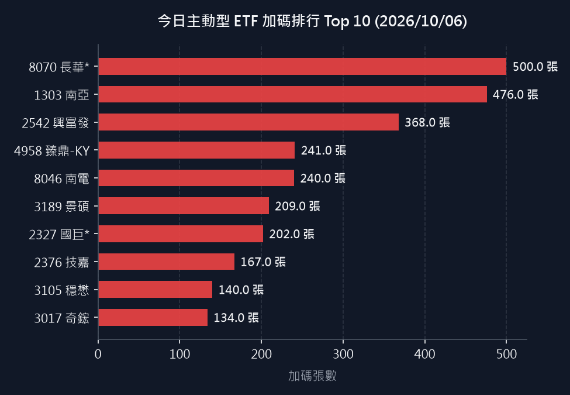
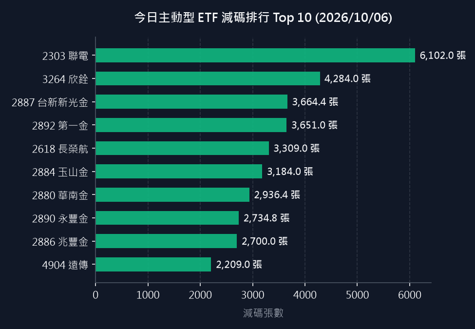

# 主動型 ETF 持股變動

資料來源：`主動型ETF持股明細.xlsx` 最近兩個日期分頁。

比較區間：`20261005` → `20261006`

## 今日加減碼視覺化排行

| 今日加碼 Top 10 | 今日減碼 Top 10 |
| :---: | :---: |
|  |  |

| ETF | 新增 | 刪除 | 比例變動 |
| :-- | --: | --: | --: |
| 00400A | 3 | 1 | 39 |
| 00401A | 0 | 0 | 0 |
| 00402A | 0 | 0 | 0 |
| 00403A | 0 | 0 | 0 |
| 00404A | 0 | 1 | 47 |
| 00405A | 3 | 0 | 28 |
| 00406A | 0 | 0 | 0 |
| 00407A | 0 | 0 | 0 |
| 00408A | 0 | 0 | 0 |
| 00980A | 0 | 0 | 47 |
| 00980D | 0 | 0 | 0 |
| 00981A | 0 | 0 | 24 |
| 00982A | 0 | 0 | 42 |
| 00983A | 0 | 0 | 0 |
| 00983D | 0 | 0 | 13 |
| 00984A | 0 | 10 | 68 |
| 00985A | 0 | 0 | 50 |
| 00986A | 0 | 0 | 31 |
| 00987A | 0 | 2 | 25 |
| 00988A | 0 | 0 | 0 |
| 00989A | 0 | 0 | 58 |
| 00990A | 2 | 2 | 37 |
| 00991A | 0 | 0 | 21 |
| 00992A | 0 | 0 | 36 |
| 00993A | 0 | 0 | 48 |
| 00994A | 0 | 0 | 0 |
| 00995A | 1 | 1 | 40 |
| 00996A | 0 | 0 | 43 |
| 00997A | 0 | 0 | 47 |
| 00998A | 0 | 0 | 52 |
| 00999A | 0 | 53 | 0 |

## 00400A

### 新增持股

- 3661 世芯-KY（0.46%，36 張）
- 6278 台表科（0.48%，669 張）
- ＸＡＧＸ金兌(3533.HK)（0.47%，77 張）

### 刪除持股

- 3026 禾伸堂（1.15%，404 張）

### 投資比例變動

- 1303 南亞：3.68% → 3.88%（+0.20）
- 2059 川湖：5.07% → 5.35%（+0.28）
- 2303 聯電：1.15% → 1.04%（-0.11）
- 2308 台達電：4.28% → 4.37%（+0.09）
- 2313 華通：0.85% → 0.90%（+0.05）
- 2317 鴻海：0.82% → 0.79%（-0.03）
- 2330 台積電：8.78% → 8.67%（-0.11）
- 2360 致茂：3.50% → 3.56%（+0.06）
- 2368 金像電：1.42% → 1.50%（+0.08）
- 2383 台光電：4.97% → 5.23%（+0.26）
- 2449 京元電子：1.00% → 0.96%（-0.04）
- 2454 聯發科：6.94% → 6.95%（+0.01）
- 2603 長榮：0.95% → 0.89%（-0.06）
- 2637 慧洋-KY：0.28% → 0.27%（-0.01）
- 2881 富邦金：1.59% → 1.54%（-0.05）
- 3008 大立光：0.83% → 0.85%（+0.02）
- 3036 文曄：1.60% → 1.53%（-0.07）
- 3037 欣興：5.36% → 5.22%（-0.14）
- 3044 健鼎：1.90% → 1.88%（-0.02）
- 3081 聯亞：0.81% → 0.80%（-0.01）
- 3090 日電貿：0.35% → 0.33%（-0.02）
- 3167 大量：0.38% → 0.37%（-0.01）
- 3293 鈊象：0.36% → 0.34%（-0.02）
- 3374 精材：0.54% → 0.55%（+0.01）
- 3443 創意：4.16% → 4.34%（+0.18）
- 3529 力旺：1.42% → 1.36%（-0.06）
- 3653 健策：5.10% → 5.18%（+0.08）
- 3665 貿聯-KY：2.54% → 2.39%（-0.15）
- 5274 信驊：3.03% → 3.01%（-0.02）
- 6121 新普：0.23% → 0.22%（-0.01）
- 6187 萬潤：2.74% → 2.89%（+0.15）
- 6223 旺矽：3.26% → 3.25%（-0.01）
- 6271 同欣電：0.27% → 0.26%（-0.01）
- 6488 環球晶：3.57% → 3.40%（-0.17）
- 6505 台塑化：2.09% → 1.97%（-0.12）
- 6669 緯穎：3.10% → 3.07%（-0.03）
- 7750 新代：0.78% → 0.82%（+0.04）
- 9939 宏全：0.08% → 0.07%（-0.01）
- 台指選擇權 2026/10：0.00% → 0.10%（+0.10）

## 00401A

### 新增持股

- 無

### 刪除持股

- 無

### 投資比例變動

- 無

## 00402A

### 新增持股

- 無

### 刪除持股

- 無

### 投資比例變動

- 無

## 00403A

### 新增持股

- 無

### 刪除持股

- 無

### 投資比例變動

- 無

## 00404A

### 新增持股

- 無

### 刪除持股

- 2845 遠東銀（0.02%，52.173 張）

### 投資比例變動

- 1303 南亞：0.83% → 0.76%（-0.07）
- 2027 大成鋼：1.58% → 1.59%（+0.01）
- 2059 川湖：1.13% → 0.93%（-0.20）
- 2301 光寶科：0.25% → 0.27%（+0.02）
- 2303 聯電：2.18% → 2.07%（-0.11）
- 2308 台達電：1.84% → 1.96%（+0.12）
- 2317 鴻海：0.66% → 0.67%（+0.01）
- 2330 台積電：22.95% → 22.73%（-0.22）
- 2345 智邦：0.87% → 0.92%（+0.05）
- 2347 聯強：1.94% → 1.80%（-0.14）
- 2351 順德：0.36% → 0.38%（+0.02）
- 2357 華碩：0.89% → 0.93%（+0.04）
- 2360 致茂：0.66% → 0.70%（+0.04）
- 2379 瑞昱：1.08% → 1.09%（+0.01）
- 2383 台光電：3.12% → 2.92%（-0.20）
- 2395 研華：1.28% → 1.33%（+0.05）
- 2436 偉詮電：1.22% → 1.18%（-0.04）
- 2454 聯發科：6.60% → 7.16%（+0.56）
- 2542 興富發：1.50% → 1.81%（+0.31）
- 2637 慧洋-KY：1.12% → 1.11%（-0.01）
- 2883 凱基金：1.12% → 1.13%（+0.01）
- 2885 元大金：2.33% → 2.39%（+0.06）
- 2887 台新新光金：1.33% → 1.34%（+0.01）
- 2892 第一金：1.82% → 1.81%（-0.01）
- 3017 奇鋐：1.36% → 1.42%（+0.06）
- 3034 聯詠：1.99% → 2.02%（+0.03）
- 3037 欣興：0.30% → 0.31%（+0.01）
- 3260 威剛：1.22% → 1.21%（-0.01）
- 3293 鈊象：0.51% → 0.52%（+0.01）
- 3374 精材：0.11% → 0.12%（+0.01）
- 3443 創意：0.73% → 0.60%（-0.13）
- 3680 家登：0.49% → 0.50%（+0.01）
- 3711 日月光投控：3.57% → 3.49%（-0.08）
- 4763 材料*-KY：1.62% → 1.60%（-0.02）
- 5274 信驊：2.38% → 2.93%（+0.55）
- 5434 崇越：1.92% → 1.82%（-0.10）
- 5904 寶雅*：0.44% → 0.45%（+0.01）
- 6196 帆宣：2.11% → 1.80%（-0.31）
- 6206 飛捷：1.00% → 1.01%（+0.01）
- 6223 旺矽：1.17% → 1.22%（+0.05）
- 6257 矽格：1.83% → 1.85%（+0.02）
- 7769 鴻勁：1.16% → 1.22%（+0.06）
- 8016 矽創：1.21% → 1.22%（+0.01）
- 8081 致新：0.83% → 0.84%（+0.01）
- 台指選擇權10/26 49100 買權：-0.31% → -0.66%（-0.35）
- 台指選擇權11/26 50300 買權：-0.02% → -0.04%（-0.02）
- 台股期貨10/26(FITXN*1.TF)：16.47% → 16.98%（+0.51）

## 00405A

### 新增持股

- 3008 大立光（0.03%，1 張）
- 6446 藥華藥（0.01%，2 張）
- 8150 南茂（0.00%，10 張）

### 刪除持股

- 無

### 投資比例變動

- 1303 南亞：0.70% → 0.76%（+0.06）
- 2059 川湖：1.97% → 2.13%（+0.16）
- 2303 聯電：1.11% → 0.02%（-1.09）
- 2308 台達電：0.68% → 0.72%（+0.04）
- 2330 台積電：1.73% → 1.75%（+0.02）
- 2345 智邦：4.01% → 4.18%（+0.17）
- 2368 金像電：4.81% → 5.21%（+0.40）
- 2383 台光電：4.25% → 4.60%（+0.35）
- 2454 聯發科：6.58% → 6.76%（+0.18）
- 3017 奇鋐：3.69% → 3.79%（+0.10）
- 3037 欣興：10.18% → 7.71%（-2.47）
- 3189 景碩：0.20% → 0.21%（+0.01）
- 3443 創意：6.50% → 6.97%（+0.47）
- 3450 聯鈞：0.52% → 0.01%（-0.51）
- 3653 健策：6.83% → 7.13%（+0.30）
- 3661 世芯-KY：0.01% → 0.02%（+0.01）
- 3665 貿聯-KY：6.52% → 6.29%（-0.23）
- 5274 信驊：3.95% → 4.03%（+0.08）
- 6187 萬潤：0.77% → 0.84%（+0.07）
- 6223 旺矽：6.62% → 6.78%（+0.16）
- 6274 台燿：1.91% → 2.07%（+0.16）
- 6510 精測：1.19% → 0.59%（-0.60）
- 6531 愛普*：3.98% → 4.13%（+0.15）
- 6669 緯穎：0.80% → 0.81%（+0.01）
- 6805 富世達：3.93% → 3.46%（-0.47）
- 7769 鴻勁：2.59% → 2.65%（+0.06）
- 8046 南電：5.97% → 7.39%（+1.42）
- 8996 高力：1.64% → 1.71%（+0.07）

## 00406A

### 新增持股

- 無

### 刪除持股

- 無

### 投資比例變動

- 無

## 00407A

### 新增持股

- 無

### 刪除持股

- 無

### 投資比例變動

- 無

## 00408A

### 新增持股

- 無

### 刪除持股

- 無

### 投資比例變動

- 無

## 00980A

### 新增持股

- 無

### 刪除持股

- 無

### 投資比例變動

- 1303 南亞：3.11% → 3.30%（+0.19）
- 2059 川湖：4.75% → 5.04%（+0.29）
- 2303 聯電：1.18% → 1.07%（-0.11）
- 2308 台達電：3.77% → 3.87%（+0.10）
- 2317 鴻海：2.01% → 1.96%（-0.05）
- 2327 國巨*：1.50% → 1.45%（-0.05）
- 2330 台積電：9.31% → 9.26%（-0.05）
- 2344 華邦電：2.03% → 1.98%（-0.05）
- 2345 智邦：1.38% → 1.41%（+0.03）
- 2360 致茂：1.60% → 1.64%（+0.04）
- 2368 金像電：1.84% → 1.96%（+0.12）
- 2376 技嘉：0.89% → 0.90%（+0.01）
- 2382 廣達：1.18% → 1.13%（-0.05）
- 2383 台光電：4.26% → 4.52%（+0.26）
- 2408 南亞科：2.85% → 2.77%（-0.08）
- 2454 聯發科：6.10% → 6.14%（+0.04）
- 2884 玉山金：0.66% → 0.63%（-0.03）
- 2891 中信金：0.93% → 0.90%（-0.03）
- 3008 大立光：1.18% → 1.22%（+0.04）
- 3017 奇鋐：2.28% → 2.29%（+0.01）
- 3026 禾伸堂：1.18% → 1.12%（-0.06）
- 3036 文曄：0.96% → 0.92%（-0.04）
- 3037 欣興：4.04% → 3.95%（-0.09）
- 3081 聯亞：2.34% → 2.32%（-0.02）
- 3189 景碩：1.38% → 1.39%（+0.01）
- 3231 緯創：0.87% → 0.86%（-0.01）
- 3264 欣銓：0.79% → 0.75%（-0.04）
- 3293 鈊象：0.80% → 0.77%（-0.03）
- 3443 創意：2.31% → 2.42%（+0.11）
- 3529 力旺：0.69% → 0.66%（-0.03）
- 3653 健策：3.50% → 3.58%（+0.08）
- 3665 貿聯-KY：0.61% → 0.57%（-0.04）
- 3711 日月光投控：2.19% → 2.20%（+0.01）
- 5904 寶雅*：0.76% → 0.74%（-0.02）
- 6213 聯茂：0.85% → 0.90%（+0.05）
- 6223 旺矽：1.94% → 1.95%（+0.01）
- 6274 台燿：1.15% → 1.22%（+0.07）
- 6515 穎崴：1.83% → 1.81%（-0.02）
- 6669 緯穎：1.60% → 1.59%（-0.01）
- 6805 富世達：0.62% → 0.63%（+0.01）
- 6831 邁科：0.43% → 0.42%（-0.01）
- 7751 竑騰：0.72% → 0.70%（-0.02）
- 7769 鴻勁：2.84% → 2.86%（+0.02）
- 8046 南電：1.81% → 1.79%（-0.02）
- 8299 群聯：1.74% → 1.68%（-0.06）
- 8996 高力：0.43% → 0.44%（+0.01）
- 台灣證交所加權股價指數(FITXN*1.TF)：2.99% → 2.96%（-0.03）

## 00980D

### 新增持股

- 無

### 刪除持股

- 無

### 投資比例變動

- 無

## 00981A

### 新增持股

- 無

### 刪除持股

- 無

### 投資比例變動

- 2303 聯電：4.80% → 4.30%（-0.50）
- 2308 台達電：4.76% → 4.93%（+0.17）
- 2327 國巨*：5.29% → 5.16%（-0.13）
- 2330 台積電：9.79% → 9.83%（+0.04）
- 2345 智邦：4.20% → 4.33%（+0.13）
- 2368 金像電：0.94% → 1.00%（+0.06）
- 2383 台光電：8.23% → 8.82%（+0.59）
- 2449 京元電子：1.31% → 1.27%（-0.04）
- 2454 聯發科：8.60% → 8.75%（+0.15）
- 3017 奇鋐：6.92% → 7.24%（+0.32）
- 3037 欣興：8.96% → 8.87%（-0.09）
- 3264 欣銓：0.42% → 0.06%（-0.36）
- 3443 創意：1.05% → 1.11%（+0.06）
- 3653 健策：5.81% → 6.00%（+0.19）
- 3665 貿聯-KY：3.36% → 3.21%（-0.15）
- 3711 日月光投控：2.50% → 2.29%（-0.21）
- 5274 信驊：1.09% → 1.10%（+0.01）
- 6223 旺矽：4.53% → 4.59%（+0.06）
- 6274 台燿：3.40% → 3.65%（+0.25）
- 6278 台表科：0.20% → 0.03%（-0.17）
- 6669 緯穎：3.07% → 3.09%（+0.02）
- 6805 富世達：1.32% → 0.98%（-0.34）
- 8046 南電：4.46% → 4.45%（-0.01）
- 8210 勤誠：0.27% → 0.20%（-0.07）

## 00982A

### 新增持股

- 無

### 刪除持股

- 無

### 投資比例變動

- 2059 川湖：4.20% → 4.46%（+0.26）
- 2301 光寶科：1.75% → 1.79%（+0.04）
- 2303 聯電：1.59% → 1.45%（-0.14）
- 2330 台積電：8.66% → 8.61%（-0.05）
- 2345 智邦：0.84% → 0.43%（-0.41）
- 2360 致茂：3.57% → 3.66%（+0.09）
- 2376 技嘉：1.25% → 1.26%（+0.01）
- 2377 微星：1.00% → 0.97%（-0.03）
- 2383 台光電：3.09% → 3.28%（+0.19）
- 2428 興勤：1.15% → 1.11%（-0.04）
- 2454 聯發科：7.03% → 7.09%（+0.06）
- 2455 全新：1.71% → 1.73%（+0.02）
- 2467 志聖：1.07% → 1.08%（+0.01）
- 2478 大毅：1.06% → 1.02%（-0.04）
- 2486 一詮：0.76% → 0.74%（-0.02）
- 2885 元大金：0.29% → 0.28%（-0.01）
- 3008 大立光：3.05% → 3.15%（+0.10）
- 3017 奇鋐：2.47% → 2.49%（+0.02）
- 3090 日電貿：1.10% → 1.06%（-0.04）
- 3105 穩懋：6.51% → 6.55%（+0.04）
- 3231 緯創：1.31% → 1.29%（-0.02）
- 3265 台星科：1.21% → 1.17%（-0.04）
- 3491 昇達科：3.38% → 3.59%（+0.21）
- 3529 力旺：0.57% → 0.55%（-0.02）
- 3617 碩天：0.29% → 0.28%（-0.01）
- 4958 臻鼎-KY：3.42% → 3.39%（-0.03）
- 5483 中美晶：1.46% → 1.37%（-0.09）
- 5536 聖暉*：0.84% → 0.81%（-0.03）
- 6139 亞翔：5.56% → 5.52%（-0.04）
- 6196 帆宣：0.36% → 0.38%（+0.02）
- 6213 聯茂：1.24% → 1.32%（+0.08）
- 6214 精誠：1.25% → 1.21%（-0.04）
- 6223 旺矽：3.08% → 3.10%（+0.02）
- 6239 力成：1.14% → 1.06%（-0.08）
- 6274 台燿：1.31% → 1.39%（+0.08）
- 6472 保瑞：0.84% → 0.81%（-0.03）
- 6488 環球晶：2.49% → 2.38%（-0.11）
- 6531 愛普*：3.94% → 4.01%（+0.07）
- 6669 緯穎：4.09% → 4.07%（-0.02）
- 6672 騰輝電子-KY：0.45% → 0.44%（-0.01）
- 8070 長華*：0.31% → 0.36%（+0.05）
- 8996 高力：1.11% → 1.14%（+0.03）

## 00983A

### 新增持股

- 無

### 刪除持股

- 無

### 投資比例變動

- 無

## 00983D

### 新增持股

- 無

### 刪除持股

- 無

### 投資比例變動

- AMCX 10 1/2 07/15/32：1.62% → 1.61%（-0.01）
- BATSLN 7.081 08/02/53：1.29% → 1.28%（-0.01）
- BRITEL 9 5/8 12/15/30：1.34% → 1.35%（+0.01）
- DT 9 1/4 06/01/32：1.48% → 1.49%（+0.01）
- GT 8 7/8 07/15/32：0.91% → 0.90%（-0.01）
- KHC 6 7/8 01/26/39：0.99% → 0.98%（-0.01）
- LQDW.US iShares Investment Grade Corpora：7.14% → 7.15%（+0.01）
- MOHEGN 11 7/8 04/15/31：1.36% → 1.37%（+0.01）
- NVDA 5.55 06/15/46：1.14% → 1.13%（-0.01）
- OXY 6.6 03/15/46：0.73% → 0.72%（-0.01）
- PFE 7.2 03/15/39：1.40% → 1.39%（-0.01）
- RAKUTN 11 1/4 02/15/27：1.82% → 1.83%（+0.01）
- TLTW.US iShares 20+ Year Treasury Bond B：7.66% → 7.63%（-0.03）

## 00984A

### 新增持股

- 無

### 刪除持股

- 1229 聯華（0.00%，0.5 張）
- 2633 台灣高鐵（0.00%，0.5 張）
- 2845 遠東銀（0.00%，0.547 張）
- 2903 遠百（0.00%，0.5 張）
- 5289 宜鼎（0.02%，1.354 張）
- 5306 桂盟（0.00%，0.5 張）
- 5534 長虹（0.00%，0.5 張）
- 6592 和潤企業（0.00%，0.5 張）
- 7780 大研生醫*（0.00%，0.5 張）
- 9941 裕融（0.00%，0.5 張）

### 投資比例變動

- 1303 南亞：2.60% → 2.80%（+0.20）
- 1326 台化：0.98% → 0.96%（-0.02）
- 1409 新纖：0.65% → 0.64%（-0.01）
- 1560 中砂：1.39% → 1.40%（+0.01）
- 2006 東和鋼鐵：0.32% → 0.31%（-0.01）
- 2059 川湖：2.45% → 2.64%（+0.19）
- 2301 光寶科：0.65% → 0.67%（+0.02）
- 2303 聯電：0.92% → 0.85%（-0.07）
- 2313 華通：0.14% → 0.15%（+0.01）
- 2330 台積電：4.21% → 4.48%（+0.27）
- 2344 華邦電：0.76% → 0.75%（-0.01）
- 2351 順德：0.64% → 0.66%（+0.02）
- 2357 華碩：0.66% → 0.67%（+0.01）
- 2379 瑞昱：0.32% → 0.31%（-0.01）
- 2383 台光電：1.36% → 1.46%（+0.10）
- 2395 研華：2.60% → 2.64%（+0.04）
- 2404 漢唐：0.41% → 0.44%（+0.03）
- 2408 南亞科：2.34% → 2.31%（-0.03）
- 2409 友達：1.35% → 1.28%（-0.07）
- 2454 聯發科：0.85% → 0.97%（+0.12）
- 2464 盟立：1.28% → 1.23%（-0.05）
- 2603 長榮：1.76% → 1.68%（-0.08）
- 2615 萬海：0.94% → 0.90%（-0.04）
- 2618 長榮航：0.31% → 0.30%（-0.01）
- 2634 漢翔：0.32% → 0.31%（-0.01）
- 2637 慧洋-KY：0.32% → 0.31%（-0.01）
- 2801 彰銀：0.31% → 0.30%（-0.01）
- 2851 中再保：0.65% → 0.63%（-0.02）
- 2855 統一證：0.68% → 0.67%（-0.01）
- 2880 華南金：1.49% → 1.46%（-0.03）
- 2881 富邦金：4.05% → 4.01%（-0.04）
- 2882 國泰金：3.20% → 3.14%（-0.06）
- 2883 凱基金：2.35% → 2.31%（-0.04）
- 2884 玉山金：2.20% → 2.13%（-0.07）
- 2885 元大金：3.14% → 3.15%（+0.01）
- 2886 兆豐金：1.99% → 1.94%（-0.05）
- 2887 台新新光金：3.30% → 3.26%（-0.04）
- 2890 永豐金：2.32% → 2.27%（-0.05）
- 2892 第一金：1.22% → 1.18%（-0.04）
- 3006 晶豪科：0.68% → 0.66%（-0.02）
- 3008 大立光：1.58% → 1.66%（+0.08）
- 3017 奇鋐：4.46% → 4.60%（+0.14）
- 3034 聯詠：0.30% → 0.31%（+0.01）
- 3037 欣興：1.97% → 2.02%（+0.05）
- 3045 台灣大：1.66% → 1.63%（-0.03）
- 3189 景碩：1.65% → 1.69%（+0.04）
- 3264 欣銓：1.77% → 1.71%（-0.06）
- 3443 創意：1.11% → 1.19%（+0.08）
- 3450 聯鈞：0.79% → 0.78%（-0.01）
- 3605 宏致：0.65% → 0.67%（+0.02）
- 3653 健策：1.78% → 1.92%（+0.14）
- 3665 貿聯-KY：0.72% → 0.69%（-0.03）
- 3711 日月光投控：0.61% → 0.62%（+0.01）
- 3714 富采：0.64% → 0.61%（-0.03）
- 4958 臻鼎-KY：0.60% → 0.61%（+0.01）
- 5274 信驊：0.99% → 1.00%（+0.01）
- 5351 鈺創：0.68% → 0.66%（-0.02）
- 5434 崇越：0.32% → 0.33%（+0.01）
- 5876 上海商銀：0.32% → 0.31%（-0.01）
- 5904 寶雅*：0.93% → 0.92%（-0.01）
- 6187 萬潤：2.14% → 2.31%（+0.17）
- 6213 聯茂：1.44% → 1.55%（+0.11）
- 6214 精誠：0.66% → 0.65%（-0.01）
- 6505 台塑化：3.10% → 3.00%（-0.10）
- 6669 緯穎：0.86% → 0.87%（+0.01）
- 6670 復盛應用：0.32% → 0.31%（-0.01）
- 6691 洋基工程：0.64% → 0.68%（+0.04）
- 7750 新代：0.61% → 0.65%（+0.04）

## 00985A

### 新增持股

- 無

### 刪除持股

- 無

### 投資比例變動

- 1101 台泥：0.93% → 0.82%（-0.11）
- 1216 統一：0.91% → 0.81%（-0.10）
- 1301 台塑：0.82% → 0.74%（-0.08）
- 1504 東元：1.15% → 1.02%（-0.13）
- 1605 華新：1.06% → 0.94%（-0.12）
- 2027 大成鋼：0.76% → 0.68%（-0.08）
- 2059 川湖：0.09% → 1.17%（+1.08）
- 2303 聯電：2.01% → 2.25%（+0.24）
- 2308 台達電：1.71% → 1.63%（-0.08）
- 2317 鴻海：1.73% → 1.56%（-0.17）
- 2327 國巨*：2.33% → 2.94%（+0.61）
- 2330 台積電：12.84% → 16.01%（+3.17）
- 2344 華邦電：0.33% → 0.30%（-0.03）
- 2345 智邦：1.19% → 4.57%（+3.38）
- 2376 技嘉：3.99% → 4.15%（+0.16）
- 2377 微星：1.52% → 1.36%（-0.16）
- 2383 台光電：2.43% → 2.39%（-0.04）
- 2395 研華：2.80% → 2.99%（+0.19）
- 2408 南亞科：1.23% → 1.11%（-0.12）
- 2412 中華電：4.12% → 1.86%（-2.26）
- 2454 聯發科：2.50% → 2.34%（-0.16）
- 2603 長榮：1.43% → 1.25%（-0.18）
- 2610 華航：1.35% → 1.19%（-0.16）
- 2881 富邦金：0.16% → 0.14%（-0.02）
- 3008 大立光：1.62% → 2.27%（+0.65）
- 3017 奇鋐：1.84% → 2.40%（+0.56）
- 3037 欣興：1.51% → 2.40%（+0.89）
- 3081 聯亞：1.19% → 1.09%（-0.10）
- 3105 穩懋：0.97% → 1.48%（+0.51）
- 3189 景碩：0.94% → 1.40%（+0.46）
- 3324 雙鴻：0.20% → 0.19%（-0.01）
- 3491 昇達科：1.99% → 3.32%（+1.33）
- 3653 健策：1.75% → 2.73%（+0.98）
- 3661 世芯-KY：0.83% → 0.77%（-0.06）
- 3665 貿聯-KY：1.42% → 1.24%（-0.18）
- 3711 日月光投控：3.80% → 3.68%（-0.12）
- 4904 遠傳：4.10% → 2.80%（-1.30）
- 6147 頎邦：0.24% → 0.21%（-0.03）
- 6187 萬潤：0.61% → 0.60%（-0.01）
- 6442 光聖：1.66% → 1.56%（-0.10）
- 6446 藥華藥：1.21% → 1.11%（-0.10）
- 6488 環球晶：1.68% → 1.49%（-0.19）
- 6526 達發：0.64% → 0.58%（-0.06）
- 6531 愛普*：1.82% → 2.40%（+0.58）
- 6669 緯穎：1.80% → 1.66%（-0.14）
- 7750 新代：0.77% → 1.36%（+0.59）
- 7769 鴻勁：0.76% → 0.98%（+0.22）
- 8046 南電：1.41% → 1.29%（-0.12）
- 8996 高力：0.63% → 0.59%（-0.04）
- 台積電期貨(FICDFN*1.TF)：2.09% → 1.93%（-0.16）

## 00986A

### 新增持股

- 無

### 刪除持股

- 無

### 投資比例變動

- 2330 台積電：7.65% → 7.64%（-0.01）
- 2454 聯發科：1.69% → 1.68%（-0.01）
- AAPL.US Apple：1.79% → 1.81%（+0.02）
- AMAT.US Applied Materials：2.00% → 2.05%（+0.05）
- AMD.US AMD：4.66% → 4.80%（+0.14）
- AMZN.US Amazon：3.76% → 3.81%（+0.05）
- AVGO.US Broadcom：3.34% → 3.46%（+0.12）
- COHR.US Coherent：2.24% → 2.37%（+0.13）
- CRWD.US CrowdStrike Holdings：4.31% → 4.39%（+0.08）
- GEV.US GE Vernova：2.67% → 2.68%（+0.01）
- GOOGL.US Alphabet - Class A Common Stock：5.48% → 5.58%（+0.10）
- GS.US Goldman Sachs：2.67% → 2.69%（+0.02）
- HOOD.US Robinhood Markets：0.60% → 0.61%（+0.01）
- HWM.US Howmet Aerospace：1.97% → 2.00%（+0.03）
- LITE.US Lumentum：4.41% → 4.58%（+0.17）
- LLY.US Eli Lilly：2.80% → 2.78%（-0.02）
- MA.US Mastercard：1.04% → 1.05%（+0.01）
- MSFT.US Microsoft：2.77% → 2.80%（+0.03）
- MU.US Micron：4.74% → 4.65%（-0.09）
- MUFG(8306.JP)：0.98% → 0.97%（-0.01）
- Murata Mfg.(6981.JP)：2.04% → 2.03%（-0.01）
- NET.US Cloudflare：2.28% → 2.27%（-0.01）
- NVDA.US NVIDIA：6.24% → 6.33%（+0.09）
- SNDK.US Sandisk：1.93% → 1.86%（-0.07）
- Siemens Energy AG：1.92% → 1.95%（+0.03）
- 伊魯米納公司：0.52% → 0.54%（+0.02）
- 嘉能可公司：1.56% → 1.61%（+0.05）
- 尼比厄斯集團公眾有限公司：0.72% → 0.76%（+0.04）
- 施奈德電機公司：1.61% → 1.66%（+0.05）
- 艾司摩爾控股公司：1.17% → 1.21%（+0.04）
- 英飛凌科技股份有限公司：2.91% → 3.15%（+0.24）

## 00987A

### 新增持股

- 無

### 刪除持股

- 6683 雍智科技（1.49%，26 張）
- 6739 竹陞科技（2.26%，50 張）

### 投資比例變動

- 2330 台積電：8.67% → 8.75%（+0.08）
- 2345 智邦：2.12% → 2.19%（+0.07）
- 2383 台光電：5.79% → 6.24%（+0.45）
- 2408 南亞科：2.03% → 2.00%（-0.03）
- 2454 聯發科：6.10% → 6.24%（+0.14）
- 2455 全新：4.58% → 3.66%（-0.92）
- 3017 奇鋐：6.89% → 7.04%（+0.15）
- 3037 欣興：8.34% → 8.30%（-0.04）
- 3081 聯亞：3.36% → 3.37%（+0.01）
- 3363 上詮：2.40% → 2.32%（-0.08）
- 3443 創意：3.96% → 4.22%（+0.26）
- 3455 由田：1.46% → 1.96%（+0.50）
- 3491 昇達科：2.97% → 3.20%（+0.23）
- 3529 力旺：1.95% → 1.91%（-0.04）
- 3653 健策：4.71% → 4.90%（+0.19）
- 3665 貿聯-KY：4.30% → 4.13%（-0.17）
- 4958 臻鼎-KY：2.16% → 2.17%（+0.01）
- 4991 環宇-KY：1.89% → 2.41%（+0.52）
- 6223 旺矽：1.02% → 1.04%（+0.02）
- 6274 台燿：4.68% → 5.04%（+0.36）
- 6510 精測：2.60% → 2.58%（-0.02）
- 6805 富世達：3.20% → 3.33%（+0.13）
- 8046 南電：2.59% → 2.60%（+0.01）
- 8358 金居：2.68% → 2.88%（+0.20）
- 8996 高力：2.04% → 2.11%（+0.07）

## 00988A

### 新增持股

- 無

### 刪除持股

- 無

### 投資比例變動

- 無

## 00989A

### 新增持股

- 無

### 刪除持股

- 無

### 投資比例變動

- ADBE.US Adobe：1.18% → 1.15%（-0.03）
- ADI.US Analog Devices：1.10% → 1.12%（+0.02）
- ALAB.US Astera Labs：0.77% → 0.75%（-0.02）
- ALGM.US Allegro MicroSystems：0.50% → 0.54%（+0.04）
- AMD.US AMD：3.09% → 3.15%（+0.06）
- ASML.US ASML Holding：2.26% → 2.31%（+0.05）
- AVGO.US Broadcom：3.39% → 3.46%（+0.07）
- BE.US Bloom Energy：1.24% → 1.28%（+0.04）
- CIEN.US Ciena：1.06% → 1.08%（+0.02）
- CRDO.US Credo：0.95% → 0.98%（+0.03）
- CRM.US Salesforce：3.02% → 2.97%（-0.05）
- CRWD.US CrowdStrike Holdings：3.63% → 3.64%（+0.01）
- DOCN.US DigitalOcean：1.58% → 1.56%（-0.02）
- ENTG.US Entegris：0.71% → 0.74%（+0.03）
- FIGR.US Figure：0.32% → 0.31%（-0.01）
- GENB.US Generate Biomedicines：0.09% → 0.08%（-0.01）
- GLW.US Corning：1.06% → 1.07%（+0.01）
- GOOG.US Alphabet - Class C Capital Stock：2.20% → 2.21%（+0.01）
- HOOD.US Robinhood Markets：1.83% → 1.84%（+0.01）
- HUBS.US HubSpot：1.64% → 1.60%（-0.04）
- ILMN.US Illumina：0.48% → 0.49%（+0.01）
- INTC.US Intel：3.24% → 3.19%（-0.05）
- LITE.US Lumentum：1.83% → 1.88%（+0.05）
- LMND.US Lemonade：0.68% → 0.67%（-0.01）
- LRCX.US Lam Research：2.58% → 2.60%（+0.02）
- MDB.US MongoDB：0.64% → 0.65%（+0.01）
- META.US Meta：4.14% → 4.11%（-0.03）
- MPWR.US Monolithic Power Systems：0.99% → 1.03%（+0.04）
- MTSI.US MACOM Technology Solutions：0.80% → 0.85%（+0.05）
- MU.US Micron：1.23% → 1.19%（-0.04）
- NET.US Cloudflare：2.77% → 2.72%（-0.05）
- NOW.US ServiceNow：1.79% → 1.73%（-0.06）
- NVDA.US NVIDIA：4.53% → 4.54%（+0.01）
- OKTA.US Okta：0.62% → 0.61%（-0.01）
- PANW.US Palo Alto：3.46% → 3.48%（+0.02）
- PLTR.US Palantir Technologies：1.07% → 1.05%（-0.02）
- RIVN.US Rivian：1.21% → 1.16%（-0.05）
- ROK.US Rockwell Automation：0.81% → 0.82%（+0.01）
- SHOP.US Shopify：2.51% → 2.52%（+0.01）
- SMCI.US Super Micro Computer：0.47% → 0.49%（+0.02）
- SNDK.US Sandisk：0.96% → 0.92%（-0.04）
- SNOW.US Snowflake：2.87% → 2.83%（-0.04）
- SPCX.US SpaceX：0.80% → 0.85%（+0.05）
- TEAM.US Atlassian：1.21% → 1.18%（-0.03）
- TEM.US Tempus：1.17% → 1.16%（-0.01）
- TSLA.US Tesla：2.66% → 2.75%（+0.09）
- TSM.US TSMC(ADR)：1.07% → 1.08%（+0.01）
- TTMI.US TTM Technologies：0.52% → 0.54%（+0.02）
- TTWO.US Take-Two：2.73% → 2.68%（-0.05）
- TWLO.US Twilio：2.49% → 2.41%（-0.08）
- TXG.US 10x Genomics：0.55% → 0.57%（+0.02）
- TXN.US Texas Instruments：1.42% → 1.46%（+0.04）
- U.US Unity Software：0.90% → 0.89%（-0.01）
- VEEV.US Veeva Systems：0.72% → 0.69%（-0.03）
- VICR.US Vicor Corporation：0.61% → 0.60%（-0.01）
- WRBY.US Warby Parker：0.70% → 0.68%（-0.02）
- XYZ.US Block：0.66% → 0.65%（-0.01）
- ZM.US Zoom：1.55% → 1.51%（-0.04）

## 00990A

### 新增持股

- 4958 臻鼎-KY（0.25%，170 張）
- WOLF.US Wolfspeed（0.17%，58.724 張）

### 刪除持股

- 3529 力旺（0.90%，106 張）
- GOOGL.US Alphabet - Class A Common Stock（0.70%，24.76 張）

### 投資比例變動

- 2308 台達電：3.14% → 3.08%（-0.06）
- 2330 台積電：2.66% → 2.62%（-0.04）
- 2345 智邦：0.96% → 0.98%（+0.02）
- 2360 致茂：0.70% → 0.74%（+0.04）
- 2383 台光電：1.74% → 1.79%（+0.05）
- 2449 京元電子：1.28% → 1.27%（-0.01）
- 2454 聯發科：2.14% → 2.11%（-0.03）
- 3017 奇鋐：1.45% → 1.40%（-0.05）
- 3037 欣興：1.64% → 2.25%（+0.61）
- 8046 南電：1.29% → 1.31%（+0.02）
- AEHR.US Aehr Test Systems：0.99% → 1.03%（+0.04）
- AMD.US AMD：4.18% → 4.24%（+0.06）
- Advantest(6857.JP)：2.04% → 2.08%（+0.04）
- BE.US Bloom Energy：5.77% → 5.93%（+0.16）
- CLS.US Celestica：0.90% → 1.44%（+0.54）
- DDOG.US Datadog：1.53% → 1.51%（-0.02）
- DELL.US Dell：1.49% → 1.01%（-0.48）
- FORM.US FormFactor：0.87% → 0.86%（-0.01）
- HPE.US HP Enterprise：0.99% → 1.58%（+0.59）
- INTC.US Intel：2.18% → 2.13%（-0.05）
- LITE.US Lumentum：7.63% → 7.81%（+0.18）
- LRCX.US Lam Research：3.21% → 3.23%（+0.02）
- Lasertec Corporation(6920.JP)：1.49% → 1.50%（+0.01）
- META.US Meta：4.43% → 4.38%（-0.05）
- MRNA.US Moderna：0.92% → 0.91%（-0.01）
- MU.US Micron：4.04% → 3.90%（-0.14）
- Murata Mfg.(6981.JP)：1.88% → 1.85%（-0.03）
- NET.US Cloudflare：2.13% → 2.09%（-0.04）
- NTRA.US Natera：1.17% → 1.15%（-0.02）
- OKTA.US Okta：1.02% → 1.00%（-0.02）
- PLTR.US Palantir Technologies：2.97% → 2.91%（-0.06）
- SMTC.US Semtech：2.22% → 2.29%（+0.07）
- SNDK.US Sandisk：2.03% → 1.93%（-0.10）
- SNOW.US Snowflake：2.11% → 2.08%（-0.03）
- SPCX.US SpaceX：2.41% → 2.56%（+0.15）
- Samsung Elec Mech(009150.KS)：0.69% → 0.70%（+0.01）
- TWST.US Twist Bioscience：1.52% → 1.50%（-0.02）

## 00991A

### 新增持股

- 無

### 刪除持股

- 無

### 投資比例變動

- 1303 南亞：2.58% → 2.95%（+0.37）
- 2059 川湖：7.24% → 7.78%（+0.54）
- 2303 聯電：2.08% → 1.48%（-0.60）
- 2308 台達電：2.04% → 1.58%（-0.46）
- 2327 國巨*：4.66% → 4.56%（-0.10）
- 2330 台積電：13.03% → 13.12%（+0.09）
- 2345 智邦：0.49% → 0.00%（-0.49）
- 2383 台光電：8.69% → 9.33%（+0.64）
- 2408 南亞科：8.49% → 7.71%（-0.78）
- 2454 聯發科：6.94% → 7.08%（+0.14）
- 3017 奇鋐：5.34% → 5.44%（+0.10）
- 3026 禾伸堂：2.80% → 2.68%（-0.12）
- 3037 欣興：8.42% → 8.49%（+0.07）
- 3081 聯亞：2.90% → 2.91%（+0.01）
- 3189 景碩：5.86% → 6.14%（+0.28）
- 3653 健策：2.45% → 2.53%（+0.08）
- 3711 日月光投控：1.50% → 1.53%（+0.03）
- 5274 信驊：3.29% → 3.33%（+0.04）
- 6505 台塑化：1.06% → 1.02%（-0.04）
- 6669 緯穎：2.98% → 3.00%（+0.02）
- 8046 南電：6.16% → 6.17%（+0.01）

## 00992A

### 新增持股

- 無

### 刪除持股

- 無

### 投資比例變動

- 1303 南亞：2.19% → 2.32%（+0.13）
- 1815 富喬：3.20% → 3.26%（+0.06）
- 2059 川湖：4.78% → 5.04%（+0.26）
- 2301 光寶科：0.43% → 0.44%（+0.01）
- 2308 台達電：0.87% → 0.89%（+0.02）
- 2330 台積電：6.46% → 6.38%（-0.08）
- 2345 智邦：5.47% → 5.55%（+0.08）
- 2357 華碩：0.44% → 0.43%（-0.01）
- 2360 致茂：0.39% → 1.42%（+1.03）
- 2383 台光電：5.58% → 5.89%（+0.31）
- 2404 漢唐：0.46% → 0.45%（-0.01）
- 2455 全新：1.34% → 1.35%（+0.01）
- 3008 大立光：4.26% → 4.38%（+0.12）
- 3017 奇鋐：6.93% → 6.94%（+0.01）
- 3026 禾伸堂：0.50% → 0.47%（-0.03）
- 3037 欣興：7.50% → 7.30%（-0.20）
- 3081 聯亞：0.43% → 0.42%（-0.01）
- 3231 緯創：3.13% → 3.05%（-0.08）
- 3443 創意：3.00% → 3.13%（+0.13）
- 3653 健策：0.52% → 0.53%（+0.01）
- 3665 貿聯-KY：6.82% → 6.41%（-0.41）
- 4958 臻鼎-KY：1.30% → 1.28%（-0.02）
- 5289 宜鼎：0.30% → 0.29%（-0.01）
- 5347 世界：0.27% → 0.26%（-0.01）
- 6139 亞翔：0.45% → 0.44%（-0.01）
- 6187 萬潤：0.42% → 0.44%（+0.02）
- 6213 聯茂：0.59% → 0.62%（+0.03）
- 6223 旺矽：4.23% → 4.22%（-0.01）
- 6274 台燿：0.42% → 0.45%（+0.03）
- 6515 穎崴：0.72% → 0.70%（-0.02）
- 6584 南俊國際：2.60% → 2.29%（-0.31）
- 6669 緯穎：2.07% → 2.05%（-0.02）
- 8021 尖點：3.43% → 3.34%（-0.09）
- 8046 南電：3.27% → 3.21%（-0.06）
- 8150 南茂：0.58% → 0.54%（-0.04）
- 8996 高力：5.70% → 5.77%（+0.07）

## 00993A

### 新增持股

- 無

### 刪除持股

- 無

### 投資比例變動

- 1303 南亞：1.37% → 1.47%（+0.10）
- 1560 中砂：1.08% → 1.07%（-0.01）
- 2006 東和鋼鐵：0.58% → 0.56%（-0.02）
- 2027 大成鋼：0.21% → 0.20%（-0.01）
- 2059 川湖：2.32% → 2.48%（+0.16）
- 2301 光寶科：0.24% → 0.25%（+0.01）
- 2303 聯電：2.99% → 2.74%（-0.25）
- 2308 台達電：1.94% → 2.01%（+0.07）
- 2313 華通：0.24% → 0.25%（+0.01）
- 2327 國巨*：2.32% → 2.25%（-0.07）
- 2330 台積電：8.32% → 8.34%（+0.02）
- 2344 華邦電：2.07% → 2.04%（-0.03）
- 2345 智邦：2.42% → 2.48%（+0.06）
- 2347 聯強：0.44% → 0.43%（-0.01）
- 2360 致茂：0.31% → 0.32%（+0.01）
- 2383 台光電：5.00% → 5.34%（+0.34）
- 2395 研華：0.61% → 0.62%（+0.01）
- 2408 南亞科：3.14% → 3.08%（-0.06）
- 2412 中華電：0.50% → 0.48%（-0.02）
- 2454 聯發科：6.19% → 6.27%（+0.08）
- 2455 全新：1.93% → 1.96%（+0.03）
- 2603 長榮：0.31% → 0.29%（-0.02）
- 2606 裕民：0.36% → 0.34%（-0.02）
- 2618 長榮航：0.20% → 0.19%（-0.01）
- 3008 大立光：1.56% → 1.62%（+0.06）
- 3017 奇鋐：5.55% → 5.62%（+0.07）
- 3037 欣興：6.61% → 6.52%（-0.09）
- 3189 景碩：4.41% → 4.47%（+0.06）
- 3406 玉晶光：0.30% → 0.32%（+0.02）
- 3443 創意：4.98% → 5.26%（+0.28）
- 3491 昇達科：0.16% → 0.17%（+0.01）
- 3532 台勝科：0.36% → 0.35%（-0.01）
- 3653 健策：2.66% → 2.74%（+0.08）
- 3665 貿聯-KY：2.01% → 1.91%（-0.10）
- 3711 日月光投控：0.61% → 0.62%（+0.01）
- 4904 遠傳：0.27% → 0.26%（-0.01）
- 4958 臻鼎-KY：1.32% → 1.31%（-0.01）
- 5274 信驊：3.70% → 3.73%（+0.03）
- 6147 頎邦：0.24% → 0.23%（-0.01）
- 6213 聯茂：0.68% → 0.73%（+0.05）
- 6223 旺矽：4.16% → 4.20%（+0.04）
- 6274 台燿：2.46% → 2.62%（+0.16）
- 6505 台塑化：0.36% → 0.35%（-0.01）
- 6669 緯穎：3.88% → 3.89%（+0.01）
- 6805 富世達：0.48% → 0.50%（+0.02）
- 8046 南電：3.54% → 3.52%（-0.02）
- 8299 群聯：0.20% → 0.19%（-0.01）
- 台指期貨 2026/10(FITXN*1.TF)：1.71% → 1.70%（-0.01）

## 00994A

### 新增持股

- 無

### 刪除持股

- 無

### 投資比例變動

- 無

## 00995A

### 新增持股

- 6715 嘉基（0.57%，60 張）

### 刪除持股

- 7750 新代（0.04%，1 張）

### 投資比例變動

- 1326 台化：0.59% → 0.56%（-0.03）
- 2059 川湖：0.50% → 0.52%（+0.02）
- 2303 聯電：1.06% → 0.99%（-0.07）
- 2308 台達電：4.23% → 4.33%（+0.10）
- 2327 國巨*：2.30% → 2.21%（-0.09）
- 2330 台積電：8.90% → 8.80%（-0.10）
- 2344 華邦電：0.37% → 0.00%（-0.37）
- 2345 智邦：3.41% → 3.47%（+0.06）
- 2360 致茂：2.10% → 2.24%（+0.14）
- 2368 金像電：0.86% → 0.91%（+0.05）
- 2383 台光電：7.62% → 8.07%（+0.45）
- 2449 京元電子：1.03% → 0.99%（-0.04）
- 2454 聯發科：7.48% → 7.51%（+0.03）
- 2467 志聖：0.30% → 0.31%（+0.01）
- 2486 一詮：0.75% → 0.05%（-0.70）
- 3017 奇鋐：5.62% → 5.64%（+0.02）
- 3037 欣興：3.28% → 3.59%（+0.31）
- 3189 景碩：0.66% → 0.67%（+0.01）
- 3264 欣銓：0.76% → 0.72%（-0.04）
- 3443 創意：1.29% → 1.35%（+0.06）
- 3450 聯鈞：0.44% → 0.43%（-0.01）
- 3529 力旺：0.32% → 0.31%（-0.01）
- 3653 健策：4.58% → 4.67%（+0.09）
- 3665 貿聯-KY：4.20% → 3.96%（-0.24）
- 4958 臻鼎-KY：0.68% → 1.47%（+0.79）
- 5274 信驊：3.39% → 3.38%（-0.01）
- 6147 頎邦：0.43% → 0.40%（-0.03）
- 6187 萬潤：0.55% → 0.59%（+0.04）
- 6213 聯茂：0.70% → 0.74%（+0.04）
- 6274 台燿：2.25% → 2.38%（+0.13）
- 6488 環球晶：0.53% → 1.16%（+0.63）
- 6510 精測：1.25% → 1.22%（-0.03）
- 6515 穎崴：1.74% → 1.71%（-0.03）
- 6669 緯穎：5.07% → 3.60%（-1.47）
- 6805 富世達：0.42% → 0.43%（+0.01）
- 7769 鴻勁：1.25% → 1.26%（+0.01）
- 8046 南電：5.07% → 4.99%（-0.08）
- 8150 南茂：0.78% → 0.73%（-0.05）
- 8358 金居：0.37% → 0.39%（+0.02）
- 8996 高力：0.62% → 0.63%（+0.01）

## 00996A

### 新增持股

- 無

### 刪除持股

- 無

### 投資比例變動

- 1303 南亞：0.21% → 0.23%（+0.02）
- 2303 聯電：2.68% → 2.46%（-0.22）
- 2308 台達電：5.26% → 5.44%（+0.18）
- 2317 鴻海：0.06% → 0.05%（-0.01）
- 2327 國巨*：5.34% → 5.20%（-0.14）
- 2330 台積電：8.91% → 8.93%（+0.02）
- 2344 華邦電：0.99% → 0.97%（-0.02）
- 2360 致茂：0.32% → 0.11%（-0.21）
- 2368 金像電：0.38% → 0.40%（+0.02）
- 2383 台光電：4.02% → 4.30%（+0.28）
- 2408 南亞科：0.80% → 0.79%（-0.01）
- 2449 京元電子：0.05% → 0.04%（-0.01）
- 2454 聯發科：6.72% → 6.82%（+0.10）
- 2467 志聖：0.33% → 0.34%（+0.01）
- 2472 立隆電：2.36% → 2.28%（-0.08）
- 3017 奇鋐：2.42% → 2.45%（+0.03）
- 3037 欣興：2.41% → 2.38%（-0.03）
- 3042 晶技：0.91% → 0.85%（-0.06）
- 3131 弘塑：0.29% → 0.30%（+0.01）
- 3189 景碩：2.70% → 3.20%（+0.50）
- 3363 上詮：1.68% → 1.61%（-0.07）
- 3443 創意：4.22% → 4.46%（+0.24）
- 3653 健策：3.30% → 3.40%（+0.10）
- 3665 貿聯-KY：0.19% → 0.18%（-0.01）
- 3693 營邦：1.00% → 1.01%（+0.01）
- 4958 臻鼎-KY：6.29% → 6.28%（-0.01）
- 5269 祥碩：0.78% → 0.77%（-0.01）
- 6213 聯茂：0.10% → 0.11%（+0.01）
- 6223 旺矽：2.45% → 2.47%（+0.02）
- 6239 力成：0.18% → 0.17%（-0.01）
- 6274 台燿：1.45% → 1.55%（+0.10）
- 6278 台表科：3.50% → 3.45%（-0.05）
- 6415 矽力*-KY：0.39% → 0.17%（-0.22）
- 6510 精測：4.47% → 4.40%（-0.07）
- 6683 雍智科技：3.18% → 2.99%（-0.19）
- 6770 力積電：0.69% → 0.67%（-0.02）
- 6830 汎銓：1.05% → 1.11%（+0.06）
- 6831 邁科：2.00% → 1.97%（-0.03）
- 7751 竑騰：2.31% → 2.27%（-0.04）
- 8021 尖點：3.39% → 3.79%（+0.40）
- 8046 南電：1.91% → 1.90%（-0.01）
- 8210 勤誠：1.33% → 1.36%（+0.03）
- 8996 高力：2.01% → 2.07%（+0.06）

## 00997A

### 新增持股

- 無

### 刪除持股

- 無

### 投資比例變動

- 2330 台積電：2.55% → 2.54%（-0.01）
- 2383 台光電：1.57% → 1.64%（+0.07）
- 2454 聯發科：0.96% → 0.95%（-0.01）
- 3037 欣興：3.36% → 3.61%（+0.25）
- AAPL.US Apple：2.07% → 2.09%（+0.02）
- ADI.US Analog Devices：0.87% → 0.90%（+0.03）
- AMAT.US Applied Materials：2.29% → 2.34%（+0.05）
- AMD.US AMD：3.19% → 3.29%（+0.10）
- ANET.US Arista Networks：1.49% → 1.51%（+0.02）
- APH.US Amphenol：1.10% → 1.12%（+0.02）
- ARM.US Arm：1.17% → 1.23%（+0.06）
- AVGO.US Broadcom：0.93% → 0.96%（+0.03）
- BE.US Bloom Energy：1.41% → 1.47%（+0.06）
- CRWD.US CrowdStrike Holdings：4.15% → 4.21%（+0.06）
- CSCO.US Cisco：0.85% → 0.88%（+0.03）
- DE.US Deere：1.16% → 0.31%（-0.85）
- DELL.US Dell：2.26% → 2.35%（+0.09）
- FTNT.US Fortinet：2.13% → 2.16%（+0.03）
- GE.US GE Aerospace：0.84% → 0.83%（-0.01）
- GOOGL.US Alphabet - Class A Common Stock：1.69% → 1.72%（+0.03）
- HOOD.US Robinhood Markets：0.75% → 0.76%（+0.01）
- HWM.US Howmet Aerospace：0.85% → 0.86%（+0.01）
- IBIDEN(4062.JP)：4.31% → 4.35%（+0.04）
- INTC.US Intel：2.95% → 2.93%（-0.02）
- KLAC.US KLA：0.55% → 0.57%（+0.02）
- Kioxia Holdings(285A.JP)：0.82% → 0.83%（+0.01）
- LITE.US Lumentum：3.79% → 3.93%（+0.14）
- LRCX.US Lam Research：2.25% → 2.30%（+0.05）
- MRK.US Merck：2.33% → 1.79%（-0.54）
- MRVL.US Marvell：3.71% → 3.77%（+0.06）
- MSFT.US Microsoft：1.33% → 1.34%（+0.01）
- MU.US Micron：4.82% → 4.72%（-0.10）
- NOW.US ServiceNow：0.92% → 0.90%（-0.02）
- NTRA.US Natera：0.90% → 0.91%（+0.01）
- NVDA.US NVIDIA：3.32% → 3.36%（+0.04）
- OKTA.US Okta：1.92% → 1.91%（-0.01）
- PANW.US Palo Alto：2.50% → 2.54%（+0.04）
- PLTR.US Palantir Technologies：1.10% → 1.09%（-0.01）
- SNDK.US Sandisk：4.28% → 4.12%（-0.16）
- SNOW.US Snowflake：1.53% → 1.52%（-0.01）
- SPCX.US SpaceX：0.77% → 0.82%（+0.05）
- STX.US Seagate：3.45% → 3.10%（-0.35）
- Samsung Elec Mech(009150.KS)：2.60% → 2.65%（+0.05）
- TXN.US Texas Instruments：0.69% → 0.72%（+0.03）
- VRT.US Vertiv：0.73% → 0.75%（+0.02）
- WDC.US Western Digital：2.16% → 1.94%（-0.22）
- 懷克爾公司：0.57% → 0.99%（+0.42）

## 00998A

### 新增持股

- 無

### 刪除持股

- 無

### 投資比例變動

- ASR荷蘭公眾有限公司：2.13% → 2.10%（-0.03）
- Admiral集團公開有限公司：2.52% → 2.47%（-0.05）
- BLK.US BlackRock：1.89% → 1.84%（-0.05）
- BNY.US Bank of New York Mellon：0.77% → 0.76%（-0.01）
- BPM銀行股份公司：2.05% → 1.99%（-0.06）
- C.US Citigroup：1.28% → 1.27%（-0.01）
- CHYM.US Chime：1.43% → 1.42%（-0.01）
- Chiba Bank(8331.JP)：1.32% → 1.27%（-0.05）
- EQH.US Equitable Holdings：2.00% → 1.98%（-0.02）
- GPN.US Global Payments：1.90% → 1.82%（-0.08）
- HOOD.US Robinhood Markets：1.58% → 1.57%（-0.01）
- Hokuhoku FG(8377.JP)：0.82% → 0.81%（-0.01）
- IBKR.US Interactive Brokers：0.96% → 0.97%（+0.01）
- JPM.US JPMorgan Chase：1.58% → 1.54%（-0.04）
- M&G公開有限公司：2.43% → 2.40%（-0.03）
- MRX.US Marex：1.38% → 2.11%（+0.73）
- MS&AD Insurance Group Holdings(8725.JP)：0.51% → 0.49%（-0.02）
- Mebuki Financial Group(7167.JP)：1.90% → 1.83%（-0.07）
- Mizuho Financial(8411.JP)：2.57% → 2.49%（-0.08）
- Piraeus Bank SA：3.38% → 3.16%（-0.22）
- Resona(8308.JP)：1.29% → 1.27%（-0.02）
- SHINHAN FINANCIAL GROUP(055550.KS)：1.80% → 1.81%（+0.01）
- Samsung Fire & Marine Insurance(000810.KS)：1.01% → 1.00%（-0.01）
- Sumitomo Mitsui Trust Group(8309.JP)：0.73% → 0.71%（-0.02）
- UBS.US UBS Group：0.98% → 0.97%（-0.01）
- Unipol保險股份公司：1.48% → 1.43%（-0.05）
- V.US Visa：1.49% → 2.09%（+0.60）
- WFC.US Wells Fargo：0.71% → 0.70%（-0.01）
- 凱克薩銀行有限責任公司：1.61% → 1.57%（-0.04）
- 勞埃德銀行集團：2.40% → 2.39%（-0.01）
- 匯豐控股有限公司：1.24% → 1.22%（-0.02）
- 國民西敏集團公開有限公司：2.75% → 2.74%（-0.01）
- 安盛有限責任公司：1.06% → 1.04%（-0.02）
- 希臘國家銀行：1.37% → 1.32%（-0.05）
- 德意志證交所：1.02% → 1.50%（+0.48）
- 德意志銀行：2.69% → 2.63%（-0.06）
- 忠意保險股份公司：1.82% → 1.76%（-0.06）
- 東方匯理資產管理有限責任公司：1.47% → 1.45%（-0.02）
- 標準人壽公開有限公司：4.38% → 4.32%（-0.06）
- 比利時聯合金融集團：1.01% → 0.98%（-0.03）
- 法國巴黎銀行股份有限公司：1.47% → 1.44%（-0.03）
- 法通保險集團公開有限公司：1.56% → 1.54%（-0.02）
- 泛歐交易所：1.06% → 1.57%（+0.51）
- 渣打集團有限公司：2.08% → 2.01%（-0.07）
- 義大利西恩那銀行股份公司：1.89% → 1.84%（-0.05）
- 英傑華保險：3.31% → 3.27%（-0.04）
- 荷蘭保險公司：3.42% → 3.36%（-0.06）
- 荷蘭國際集團：1.82% → 1.80%（-0.02）
- 荷蘭銀行公眾有限公司：3.88% → 3.83%（-0.05）
- 裕信銀行：2.44% → 2.37%（-0.07）
- 西班牙洲際銀行有限責任公司：0.97% → 0.95%（-0.02）
- 賽普勒斯銀行控股公開有限公司：3.93% → 3.74%（-0.19）

## 00999A

### 新增持股

- 無

### 刪除持股

- 2059 川湖（5.48%，49 張）
- 2308 台達電（3.11%，185 張）
- 2330 台積電（6.22%，288 張）
- 2345 智邦（1.76%，101 張）
- 2357 華碩（1.98%，238 張）
- 2360 致茂（1.36%，70 張）
- 2368 金像電（2.38%，234 張）
- 2382 廣達（1.95%，702.5 張）
- 2383 台光電（4.44%，93 張）
- 2408 南亞科（2.13%，479 張）
- 2441 超豐（0.92%，890 張）
- 2451 創見（1.10%，454 張）
- 2454 聯發科（4.81%，111 張）
- 2618 長榮航（1.16%，3309 張）
- 2880 華南金（1.10%，2936.388 張）
- 2884 玉山金（1.20%，3184 張）
- 2885 元大金（1.12%，1958.04 張）
- 2886 兆豐金（1.10%，2700 張）
- 2887 台新新光金（1.25%，3664.36 張）
- 2890 永豐金（1.01%，2734.78 張）
- 2892 第一金（1.16%，3651 張）
- 3008 大立光（1.75%，31 張）
- 3017 奇鋐（2.01%，67 張）
- 3026 禾伸堂（1.68%，246 張）
- 3037 欣興（3.71%，334 張）
- 3081 聯亞（2.56%，101.7 張）
- 3090 日電貿（0.87%，599 張）
- 3227 原相（0.95%，600 張）
- 3293 鈊象（1.37%，206 張）
- 3529 力旺（1.30%，49 張）
- 3653 健策（4.65%，77 張）
- 3665 貿聯-KY（1.35%，65 張）
- 3702 大聯大（1.49%，1497 張）
- 3706 神達（1.25%，1853.4 張）
- 4551 智伸科（0.63%，405 張）
- 4746 台耀（0.60%，1518 張）
- 4904 遠傳（0.89%，1008 張）
- 5274 信驊（1.47%，9 張）
- 5434 崇越（0.83%，160 張）
- 5439 高技（0.80%，364 張）
- 5534 長虹（0.91%，1516 張）
- 5904 寶雅*（0.95%，1646 張）
- 6121 新普（1.01%，316 張）
- 6138 茂達（0.85%，351 張）
- 6223 旺矽（2.22%，48 張）
- 6274 台燿（1.55%，104 張）
- 6515 穎崴（2.13%，41 張）
- 6669 緯穎（3.41%，189.225 張）
- 6805 富世達（0.86%，42 張）
- 7769 鴻勁（3.12%，64 張）
- 9941 裕融（0.79%，1238.48 張）
- 9958 世紀鋼（0.81%，1070 張）
- 台灣證交所加權股價指數(FITXN*1.TF)（2.51%，0.03 張）

### 投資比例變動

- 無
