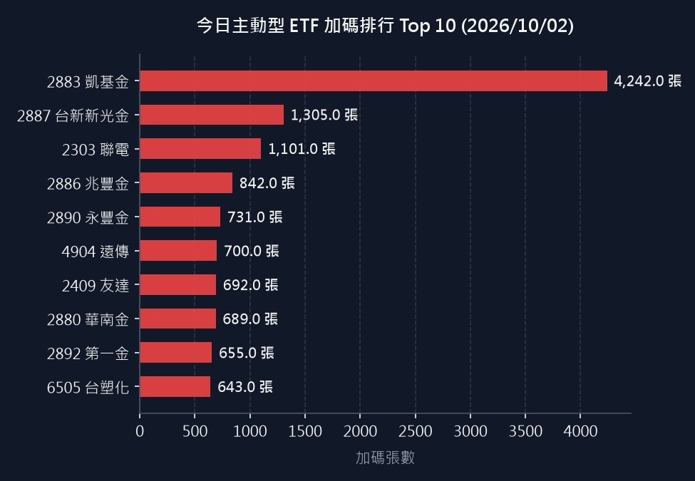
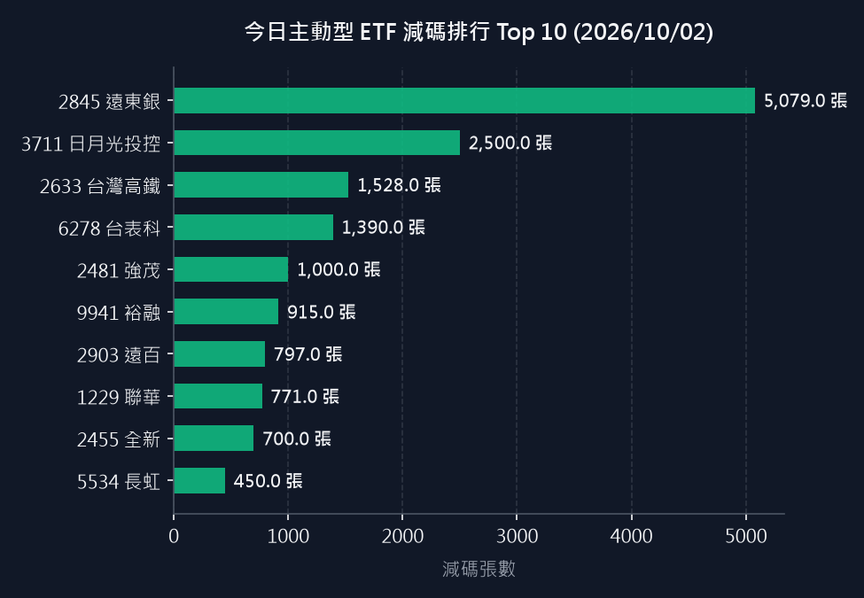

# 主動型 ETF 持股變動

資料來源：`主動型ETF持股明細.xlsx` 最近兩個日期分頁。

比較區間：`20261001` → `20261002`

## 今日加減碼視覺化排行

| 今日加碼 Top 10 | 今日減碼 Top 10 |
| :---: | :---: |
|  |  |

| ETF | 新增 | 刪除 | 比例變動 |
| :-- | --: | --: | --: |
| 00400A | 0 | 0 | 39 |
| 00401A | 0 | 0 | 48 |
| 00402A | 0 | 0 | 42 |
| 00403A | 0 | 0 | 33 |
| 00404A | 0 | 0 | 46 |
| 00405A | 0 | 2 | 29 |
| 00406A | 1 | 1 | 51 |
| 00407A | 0 | 0 | 39 |
| 00408A | 0 | 0 | 43 |
| 00980A | 0 | 0 | 48 |
| 00980D | 2 | 2 | 32 |
| 00981A | 0 | 0 | 25 |
| 00982A | 0 | 0 | 43 |
| 00983A | 0 | 0 | 35 |
| 00983D | 0 | 0 | 14 |
| 00984A | 0 | 4 | 77 |
| 00985A | 0 | 0 | 50 |
| 00986A | 0 | 0 | 32 |
| 00987A | 1 | 1 | 26 |
| 00988A | 0 | 1 | 34 |
| 00989A | 0 | 0 | 55 |
| 00990A | 2 | 1 | 40 |
| 00991A | 0 | 0 | 21 |
| 00992A | 0 | 0 | 37 |
| 00993A | 0 | 0 | 38 |
| 00994A | 0 | 0 | 35 |
| 00995A | 0 | 0 | 43 |
| 00996A | 0 | 0 | 38 |
| 00997A | 0 | 0 | 40 |
| 00998A | 2 | 1 | 46 |
| 00999A | 0 | 1 | 49 |

## 00400A

### 新增持股

- 無

### 刪除持股

- 無

### 投資比例變動

- 1303 南亞：3.65% → 3.68%（+0.03）
- 2059 川湖：5.02% → 5.07%（+0.05）
- 2303 聯電：1.17% → 1.15%（-0.02）
- 2308 台達電：4.39% → 4.28%（-0.11）
- 2313 華通：0.86% → 0.85%（-0.01）
- 2317 鴻海：0.84% → 0.82%（-0.02）
- 2330 台積電：8.95% → 8.78%（-0.17）
- 2360 致茂：3.37% → 3.50%（+0.13）
- 2368 金像電：1.43% → 1.42%（-0.01）
- 2383 台光電：4.84% → 4.97%（+0.13）
- 2449 京元電子：1.02% → 1.00%（-0.02）
- 2454 聯發科：7.09% → 6.94%（-0.15）
- 2603 長榮：0.96% → 0.95%（-0.01）
- 2637 慧洋-KY：0.27% → 0.28%（+0.01）
- 2881 富邦金：1.61% → 1.59%（-0.02）
- 2885 元大金：0.06% → 0.05%（-0.01）
- 3017 奇鋐：4.56% → 4.40%（-0.16）
- 3026 禾伸堂：1.19% → 1.15%（-0.04）
- 3036 文曄：1.62% → 1.60%（-0.02）
- 3037 欣興：5.07% → 5.36%（+0.29）
- 3044 健鼎：1.89% → 1.90%（+0.01）
- 3081 聯亞：0.75% → 0.81%（+0.06）
- 3090 日電貿：0.34% → 0.35%（+0.01）
- 3167 大量：0.39% → 0.38%（-0.01）
- 3293 鈊象：0.37% → 0.36%（-0.01）
- 3374 精材：0.53% → 0.54%（+0.01）
- 3443 創意：4.22% → 4.16%（-0.06）
- 3529 力旺：1.48% → 1.42%（-0.06）
- 3653 健策：5.24% → 5.10%（-0.14）
- 3665 貿聯-KY：2.60% → 2.54%（-0.06）
- 3711 日月光投控：1.14% → 1.12%（-0.02）
- 5274 信驊：3.11% → 3.03%（-0.08）
- 5434 崇越：0.39% → 0.40%（+0.01）
- 6187 萬潤：2.62% → 2.74%（+0.12）
- 6223 旺矽：3.14% → 3.26%（+0.12）
- 6488 環球晶：3.31% → 3.57%（+0.26）
- 6505 台塑化：2.00% → 2.09%（+0.09）
- 6669 緯穎：3.19% → 3.10%（-0.09）
- 7750 新代：0.80% → 0.78%（-0.02）

## 00401A

### 新增持股

- 無

### 刪除持股

- 無

### 投資比例變動

- 1216 統一：0.26% → 0.25%（-0.01）
- 1303 南亞：0.99% → 1.01%（+0.02）
- 2059 川湖：0.93% → 0.95%（+0.02）
- 2303 聯電：2.61% → 2.59%（-0.02）
- 2308 台達電：2.55% → 2.50%（-0.05）
- 2317 鴻海：0.56% → 0.55%（-0.01）
- 2327 國巨*：0.64% → 0.66%（+0.02）
- 2330 台積電：20.22% → 19.96%（-0.26）
- 2345 智邦：0.53% → 0.33%（-0.20）
- 2357 華碩：1.76% → 1.74%（-0.02）
- 2360 致茂：1.29% → 1.34%（+0.05）
- 2379 瑞昱：1.04% → 1.02%（-0.02）
- 2382 廣達：2.08% → 2.05%（-0.03）
- 2383 台光電：0.73% → 1.03%（+0.30）
- 2412 中華電：0.79% → 0.78%（-0.01）
- 2454 聯發科：6.75% → 6.65%（-0.10）
- 2455 全新：2.24% → 2.35%（+0.11）
- 2881 富邦金：1.92% → 1.90%（-0.02）
- 2883 凱基金：1.54% → 1.55%（+0.01）
- 2884 玉山金：1.86% → 1.85%（-0.01）
- 2886 兆豐金：1.26% → 1.25%（-0.01）
- 2887 台新新光金：1.02% → 1.00%（-0.02）
- 2891 中信金：1.46% → 1.43%（-0.03）
- 2912 統一超：0.24% → 0.23%（-0.01）
- 3008 大立光：2.18% → 2.19%（+0.01）
- 3037 欣興：2.41% → 2.56%（+0.15）
- 3231 緯創：1.65% → 1.60%（-0.05）
- 3491 昇達科：1.66% → 1.64%（-0.02）
- 3711 日月光投控：2.57% → 2.55%（-0.02）
- 4938 和碩：0.29% → 0.28%（-0.01）
- 4958 臻鼎-KY：1.28% → 1.40%（+0.12）
- 4991 環宇-KY：0.95% → 1.03%（+0.08）
- 5274 信驊：2.02% → 1.98%（-0.04）
- 5347 世界：1.37% → 1.38%（+0.01）
- 5904 寶雅*：0.50% → 0.49%（-0.01）
- 6147 頎邦：1.40% → 1.37%（-0.03）
- 6187 萬潤：0.65% → 0.69%（+0.04）
- 6223 旺矽：1.50% → 1.57%（+0.07）
- 6515 穎崴：1.66% → 1.44%（-0.22）
- 6531 愛普*：1.60% → 1.70%（+0.10）
- 6669 緯穎：1.81% → 1.77%（-0.04）
- 7769 鴻勁：1.26% → 1.27%（+0.01）
- 7828 創新服務：1.72% → 1.69%（-0.03）
- 7856 漢測：0.69% → 0.85%（+0.16）
- 8464 億豐：0.95% → 0.94%（-0.01）
- 台股期貨10/26(FITXN*1.TF)：0.39% → 0.38%（-0.01）
- 臺指選擇權10/26 46000 買權：-0.08% → -0.07%（+0.01）
- 臺指選擇權10/26 46400 買權：-1.06% → -1.03%（+0.03）

## 00402A

### 新增持股

- 無

### 刪除持股

- 無

### 投資比例變動

- AAPL.US Apple：7.54% → 7.55%（+0.01）
- ADI.US Analog Devices：1.70% → 1.75%（+0.05）
- AMD.US AMD：6.10% → 6.20%（+0.10）
- AMZN.US Amazon：3.79% → 3.81%（+0.02）
- ANET.US Arista Networks：0.87% → 0.89%（+0.02）
- ARM.US Arm：0.90% → 0.92%（+0.02）
- ASML.US ASML Holding：1.12% → 1.13%（+0.01）
- AVGO.US Broadcom：2.36% → 2.33%（-0.03）
- AXON.US Axon Enterprise：0.52% → 0.53%（+0.01）
- CIEN.US Ciena：1.18% → 1.29%（+0.11）
- CLS.US Celestica：1.14% → 1.19%（+0.05）
- COHR.US Coherent：1.32% → 1.37%（+0.05）
- CRWD.US CrowdStrike Holdings：1.75% → 1.65%（-0.10）
- FSLY.US Fastly：0.44% → 0.46%（+0.02）
- GOOG.US Alphabet - Class C Capital Stock：3.01% → 2.99%（-0.02）
- GOOGL.US Alphabet - Class A Common Stock：3.36% → 3.34%（-0.02）
- INTC.US Intel：1.63% → 1.64%（+0.01）
- IOT.US Samsara：0.56% → 0.47%（-0.09）
- KLAC.US KLA：1.64% → 1.60%（-0.04）
- LITE.US Lumentum：1.71% → 1.86%（+0.15）
- LRCX.US Lam Research：2.80% → 2.82%（+0.02）
- MCHP.US Microchip Technology：1.33% → 1.36%（+0.03）
- MDB.US MongoDB：0.32% → 0.33%（+0.01）
- META.US Meta：3.94% → 3.67%（-0.27）
- MRVL.US Marvell：1.58% → 1.62%（+0.04）
- MSFT.US Microsoft：4.96% → 5.00%（+0.04）
- MU.US Micron：6.61% → 6.53%（-0.08）
- NFLX.US Netflix：0.87% → 0.85%（-0.02）
- NOW.US ServiceNow：0.89% → 0.93%（+0.04）
- NVDA.US NVIDIA：8.56% → 8.65%（+0.09）
- PANW.US Palo Alto：2.83% → 2.73%（-0.10）
- PLTR.US Palantir Technologies：1.91% → 1.96%（+0.05）
- SHOP.US Shopify：0.90% → 0.92%（+0.02）
- SKHY.US SK hynix：1.22% → 1.29%（+0.07）
- SNOW.US Snowflake：1.11% → 1.12%（+0.01）
- SPOT.US Spotify：0.40% → 0.31%（-0.09）
- STX.US Seagate：1.62% → 1.68%（+0.06）
- TER.US Teradyne：0.89% → 0.82%（-0.07）
- TSM.US TSMC(ADR)：1.53% → 1.44%（-0.09）
- TXN.US Texas Instruments：2.24% → 2.28%（+0.04）
- V.US Visa：0.97% → 0.98%（+0.01）
- WDC.US Western Digital：2.49% → 2.32%（-0.17）

## 00403A

### 新增持股

- 無

### 刪除持股

- 無

### 投資比例變動

- 1303 南亞：1.72% → 1.78%（+0.06）
- 1717 長興：0.04% → 0.05%（+0.01）
- 2059 川湖：0.60% → 0.62%（+0.02）
- 2303 聯電：5.69% → 5.74%（+0.05）
- 2308 台達電：3.75% → 3.74%（-0.01）
- 2327 國巨*：3.26% → 3.42%（+0.16）
- 2330 台積電：13.10% → 13.16%（+0.06）
- 2345 智邦：2.06% → 2.15%（+0.09）
- 2360 致茂：0.13% → 0.02%（-0.11）
- 2383 台光電：4.72% → 4.96%（+0.24）
- 2408 南亞科：0.99% → 1.01%（+0.02）
- 2449 京元電子：0.80% → 0.81%（+0.01）
- 2454 聯發科：7.46% → 7.48%（+0.02）
- 2455 全新：0.11% → 0.12%（+0.01）
- 2481 強茂：0.36% → 0.24%（-0.12）
- 3008 大立光：0.84% → 0.86%（+0.02）
- 3017 奇鋐：5.95% → 4.94%（-1.01）
- 3037 欣興：6.97% → 7.55%（+0.58）
- 3189 景碩：2.95% → 3.09%（+0.14）
- 3211 順達：0.53% → 0.54%（+0.01）
- 3443 創意：3.05% → 3.08%（+0.03）
- 3450 聯鈞：0.52% → 0.56%（+0.04）
- 3583 辛耘：0.38% → 0.39%（+0.01）
- 3653 健策：5.20% → 5.18%（-0.02）
- 6223 旺矽：3.17% → 3.38%（+0.21）
- 6274 台燿：1.98% → 2.10%（+0.12）
- 6442 光聖：0.35% → 0.39%（+0.04）
- 6488 環球晶：2.06% → 2.30%（+0.24）
- 6669 緯穎：2.53% → 2.42%（-0.11）
- 6805 富世達：0.86% → 0.55%（-0.31）
- 8046 南電：2.90% → 3.00%（+0.10）
- 8358 金居：0.03% → 0.02%（-0.01）
- 8996 高力：1.91% → 1.86%（-0.05）

## 00404A

### 新增持股

- 無

### 刪除持股

- 無

### 投資比例變動

- 1303 南亞：0.81% → 0.83%（+0.02）
- 2027 大成鋼：1.59% → 1.58%（-0.01）
- 2059 川湖：1.10% → 1.13%（+0.03）
- 2301 光寶科：0.26% → 0.25%（-0.01）
- 2303 聯電：2.19% → 2.18%（-0.01）
- 2308 台達電：1.86% → 1.84%（-0.02）
- 2317 鴻海：0.67% → 0.66%（-0.01）
- 2330 台積電：23.10% → 22.95%（-0.15）
- 2345 智邦：0.84% → 0.87%（+0.03）
- 2347 聯強：1.91% → 1.94%（+0.03）
- 2357 華碩：0.90% → 0.89%（-0.01）
- 2360 致茂：0.63% → 0.66%（+0.03）
- 2379 瑞昱：1.10% → 1.08%（-0.02）
- 2382 廣達：2.07% → 2.05%（-0.02）
- 2383 台光電：3.01% → 3.12%（+0.11）
- 2395 研華：1.29% → 1.28%（-0.01）
- 2436 偉詮電：1.19% → 1.22%（+0.03）
- 2454 聯發科：6.66% → 6.60%（-0.06）
- 2542 興富發：1.49% → 1.50%（+0.01）
- 2637 慧洋-KY：1.09% → 1.12%（+0.03）
- 2883 凱基金：1.11% → 1.12%（+0.01）
- 2885 元大金：2.36% → 2.33%（-0.03）
- 2887 台新新光金：1.35% → 1.33%（-0.02）
- 2890 永豐金：1.41% → 1.42%（+0.01）
- 2892 第一金：1.84% → 1.82%（-0.02）
- 3017 奇鋐：1.39% → 1.36%（-0.03）
- 3034 聯詠：2.03% → 1.99%（-0.04）
- 3037 欣興：0.28% → 0.30%（+0.02）
- 3293 鈊象：0.53% → 0.51%（-0.02）
- 3711 日月光投控：3.56% → 3.57%（+0.01）
- 4763 材料*-KY：1.61% → 1.62%（+0.01）
- 5274 信驊：2.41% → 2.38%（-0.03）
- 5434 崇越：1.87% → 1.92%（+0.05）
- 5904 寶雅*：0.45% → 0.44%（-0.01）
- 6196 帆宣：2.06% → 2.11%（+0.05）
- 6206 飛捷：1.01% → 1.00%（-0.01）
- 6223 旺矽：1.11% → 1.17%（+0.06）
- 6257 矽格：1.82% → 1.83%（+0.01）
- 6515 穎崴：0.13% → 0.14%（+0.01）
- 7769 鴻勁：1.15% → 1.16%（+0.01）
- 8016 矽創：1.20% → 1.21%（+0.01）
- 8081 致新：0.82% → 0.83%（+0.01）
- 8299 群聯：1.13% → 1.12%（-0.01）
- 台指選擇權10/26 49100 買權：-0.34% → -0.31%（+0.03）
- 台指選擇權11/26 50300 買權：-0.03% → -0.02%（+0.01）
- 台股期貨10/26(FITXN*1.TF)：16.53% → 16.47%（-0.06）

## 00405A

### 新增持股

- 無

### 刪除持股

- 4749 新應材（0.28%，95 張）
- 7734 印能科技（0.32%，30 張）

### 投資比例變動

- 1303 南亞：0.68% → 0.70%（+0.02）
- 2059 川湖：1.91% → 1.97%（+0.06）
- 2308 台達電：0.69% → 0.68%（-0.01）
- 2345 智邦：3.87% → 4.01%（+0.14）
- 2368 金像電：4.75% → 4.81%（+0.06）
- 2383 台光電：4.06% → 4.25%（+0.19）
- 2454 聯發科：6.60% → 6.58%（-0.02）
- 3017 奇鋐：3.76% → 3.69%（-0.07）
- 3037 欣興：8.98% → 10.18%（+1.20）
- 3189 景碩：0.19% → 0.20%（+0.01）
- 3443 創意：6.48% → 6.50%（+0.02）
- 3450 聯鈞：0.50% → 0.52%（+0.02）
- 3653 健策：6.88% → 6.83%（-0.05）
- 3665 貿聯-KY：6.54% → 6.52%（-0.02）
- 4576 大銀微系統：0.07% → 0.00%（-0.07）
- 5274 信驊：3.98% → 3.95%（-0.03）
- 6187 萬潤：0.73% → 0.77%（+0.04）
- 6223 旺矽：6.26% → 6.62%（+0.36）
- 6274 台燿：1.81% → 1.91%（+0.10）
- 6278 台表科：1.17% → 0.01%（-1.16）
- 6285 啟碁：0.36% → 0.09%（-0.27）
- 6510 精測：1.79% → 1.19%（-0.60）
- 6515 穎崴：0.51% → 0.54%（+0.03）
- 6531 愛普*：3.70% → 3.98%（+0.28）
- 6669 緯穎：0.81% → 0.80%（-0.01）
- 6805 富世達：4.06% → 3.93%（-0.13）
- 7769 鴻勁：2.54% → 2.59%（+0.05）
- 8046 南電：4.70% → 5.97%（+1.27）
- 8996 高力：1.70% → 1.64%（-0.06）

## 00406A

### 新增持股

- 臺指選擇權第二週週五到期契約（-1.03%，-0.323 張）

### 刪除持股

- 臺指選擇權第一週週五到期契約（-17.81%，-5.25 張）

### 投資比例變動

- 1560 中砂：0.70% → 0.68%（-0.02）
- 2059 川湖：1.55% → 1.54%（-0.01）
- 2303 聯電：2.40% → 2.32%（-0.08）
- 2308 台達電：3.50% → 3.36%（-0.14）
- 2317 鴻海：0.58% → 0.56%（-0.02）
- 2327 國巨*：1.61% → 1.63%（+0.02）
- 2330 台積電：9.41% → 9.44%（+0.03）
- 2344 華邦電：0.35% → 0.33%（-0.02）
- 2360 致茂：0.69% → 0.71%（+0.02）
- 2368 金像電：0.56% → 0.54%（-0.02）
- 2383 台光電：5.27% → 5.57%（+0.30）
- 2449 京元電子：0.63% → 0.61%（-0.02）
- 2454 聯發科：6.09% → 6.26%（+0.17）
- 2481 強茂：0.31% → 0.29%（-0.02）
- 2486 一詮：0.34% → 0.33%（-0.01）
- 2885 元大金：0.95% → 0.91%（-0.04）
- 2886 兆豐金：0.20% → 0.19%（-0.01）
- 3008 大立光：0.41% → 0.40%（-0.01）
- 3017 奇鋐：5.72% → 5.71%（-0.01）
- 3037 欣興：5.44% → 5.78%（+0.34）
- 3081 聯亞：0.43% → 0.45%（+0.02）
- 3105 穩懋：0.19% → 0.20%（+0.01）
- 3167 大量：0.72% → 0.70%（-0.02）
- 3189 景碩：1.13% → 1.36%（+0.23）
- 3264 欣銓：0.24% → 0.23%（-0.01）
- 3443 創意：1.76% → 1.70%（-0.06）
- 3491 昇達科：0.80% → 0.78%（-0.02）
- 3529 力旺：0.27% → 0.38%（+0.11）
- 3653 健策：3.89% → 3.86%（-0.03）
- 3665 貿聯-KY：3.22% → 3.11%（-0.11）
- 3711 日月光投控：2.46% → 2.48%（+0.02）
- 4958 臻鼎-KY：0.48% → 0.52%（+0.04）
- 5274 信驊：2.90% → 2.78%（-0.12）
- 5289 宜鼎：0.06% → 0.05%（-0.01）
- 6147 頎邦：0.49% → 0.65%（+0.16）
- 6187 萬潤：0.33% → 0.34%（+0.01）
- 6213 聯茂：0.53% → 0.54%（+0.01）
- 6223 旺矽：3.30% → 3.38%（+0.08）
- 6274 台燿：1.28% → 1.77%（+0.49）
- 6488 環球晶：0.66% → 0.70%（+0.04）
- 6510 精測：1.20% → 1.19%（-0.01）
- 6515 穎崴：0.51% → 0.52%（+0.01）
- 6531 愛普*：0.25% → 0.26%（+0.01）
- 6669 緯穎：2.46% → 2.35%（-0.11）
- 6805 富世達：0.17% → 0.16%（-0.01）
- 7769 鴻勁：0.37% → 0.36%（-0.01）
- 8046 南電：2.52% → 2.51%（-0.01）
- 8210 勤誠：0.10% → 0.09%（-0.01）
- 8996 高力：0.39% → 0.36%（-0.03）
- 臺指選擇權第一週週三到期契約：-4.44% → -12.89%（-8.45）
- 臺股期貨 202610(FITXN*1.TF)：23.92% → 23.16%（-0.76）

## 00407A

### 新增持股

- 無

### 刪除持股

- 無

### 投資比例變動

- 1303 南亞：0.79% → 0.81%（+0.02）
- 1560 中砂：1.08% → 1.10%（+0.02）
- 2059 川湖：2.61% → 2.69%（+0.08）
- 2301 光寶科：1.47% → 1.46%（-0.01）
- 2308 台達電：2.74% → 2.73%（-0.01）
- 2327 國巨*：2.40% → 2.51%（+0.11）
- 2330 台積電：9.26% → 9.28%（+0.02）
- 2345 智邦：2.03% → 2.11%（+0.08）
- 2360 致茂：0.97% → 1.03%（+0.06）
- 2368 金像電：0.55% → 0.56%（+0.01）
- 2383 台光電：4.98% → 5.22%（+0.24）
- 2408 南亞科：0.98% → 1.00%（+0.02）
- 2451 創見：0.32% → 0.33%（+0.01）
- 2454 聯發科：5.96% → 5.95%（-0.01）
- 3008 大立光：1.45% → 1.48%（+0.03）
- 3017 奇鋐：5.85% → 5.77%（-0.08）
- 3034 聯詠：0.74% → 0.73%（-0.01）
- 3037 欣興：5.93% → 6.40%（+0.47）
- 3081 聯亞：1.34% → 1.48%（+0.14）
- 3131 弘塑：0.85% → 0.87%（+0.02）
- 3231 緯創：0.74% → 0.73%（-0.01）
- 3260 威剛：0.28% → 0.29%（+0.01）
- 3293 鈊象：0.62% → 0.60%（-0.02）
- 3443 創意：4.79% → 4.82%（+0.03）
- 3529 力旺：0.69% → 0.68%（-0.01）
- 3653 健策：3.56% → 3.54%（-0.02）
- 3711 日月光投控：3.01% → 3.04%（+0.03）
- 4958 臻鼎-KY：0.95% → 1.05%（+0.10）
- 5274 信驊：1.85% → 1.84%（-0.01）
- 5434 崇越：0.21% → 0.22%（+0.01）
- 6187 萬潤：1.44% → 1.54%（+0.10）
- 6223 旺矽：2.56% → 2.72%（+0.16）
- 6274 台燿：3.68% → 3.90%（+0.22）
- 6510 精測：1.27% → 1.31%（+0.04）
- 6531 愛普*：0.32% → 0.35%（+0.03）
- 6669 緯穎：3.75% → 3.72%（-0.03）
- 6805 富世達：1.19% → 1.15%（-0.04）
- 8046 南電：3.05% → 3.15%（+0.10）
- 8996 高力：2.15% → 2.09%（-0.06）

## 00408A

### 新增持股

- 無

### 刪除持股

- 無

### 投資比例變動

- 1303 南亞：2.42% → 2.45%（+0.03）
- 2059 川湖：0.40% → 0.41%（+0.01）
- 2303 聯電：3.52% → 3.48%（-0.04）
- 2308 台達電：3.33% → 3.26%（-0.07）
- 2327 國巨*：0.61% → 1.55%（+0.94）
- 2330 台積電：5.76% → 5.65%（-0.11）
- 2344 華邦電：0.49% → 0.48%（-0.01）
- 2345 智邦：0.77% → 0.79%（+0.02）
- 2357 華碩：1.96% → 1.93%（-0.03）
- 2360 致茂：1.12% → 1.17%（+0.05）
- 2368 金像電：3.40% → 3.39%（-0.01）
- 2382 廣達：0.23% → 0.22%（-0.01）
- 2383 台光電：2.52% → 3.64%（+1.12）
- 2395 研華：1.66% → 1.63%（-0.03）
- 2408 南亞科：2.31% → 2.32%（+0.01）
- 2449 京元電子：1.50% → 1.48%（-0.02）
- 2454 聯發科：4.88% → 4.79%（-0.09）
- 2481 強茂：1.15% → 1.12%（-0.03）
- 2542 興富發：3.50% → 3.49%（-0.01）
- 2801 彰銀：2.17% → 2.15%（-0.02）
- 3017 奇鋐：3.56% → 3.42%（-0.14）
- 3026 禾伸堂：0.35% → 0.33%（-0.02）
- 3037 欣興：4.35% → 4.62%（+0.27）
- 3081 聯亞：1.17% → 1.27%（+0.10）
- 3105 穩懋：0.51% → 0.55%（+0.04）
- 3189 景碩：2.32% → 2.88%（+0.56）
- 3231 緯創：0.39% → 0.37%（-0.02）
- 3264 欣銓：0.73% → 0.72%（-0.01）
- 3491 昇達科：1.01% → 0.99%（-0.02）
- 3653 健策：2.79% → 2.72%（-0.07）
- 3665 貿聯-KY：1.38% → 1.36%（-0.02）
- 3711 日月光投控：1.58% → 1.57%（-0.01）
- 5434 崇越：2.22% → 2.26%（+0.04）
- 6187 萬潤：0.60% → 0.63%（+0.03）
- 6223 旺矽：1.97% → 2.05%（+0.08）
- 6239 力成：1.32% → 1.38%（+0.06）
- 6274 台燿：2.90% → 3.03%（+0.13）
- 6488 環球晶：1.03% → 1.11%（+0.08）
- 6669 緯穎：3.82% → 3.73%（-0.09）
- 6805 富世達：1.45% → 1.39%（-0.06）
- 8046 南電：2.01% → 2.05%（+0.04）
- 8996 高力：1.90% → 1.82%（-0.08）
- 9802 鈺齊-KY：0.84% → 0.83%（-0.01）

## 00980A

### 新增持股

- 無

### 刪除持股

- 無

### 投資比例變動

- 1303 南亞：3.06% → 3.11%（+0.05）
- 2059 川湖：3.95% → 4.75%（+0.80）
- 2303 聯電：0.75% → 1.18%（+0.43）
- 2308 台達電：3.83% → 3.77%（-0.06）
- 2317 鴻海：2.05% → 2.01%（-0.04）
- 2327 國巨*：1.45% → 1.50%（+0.05）
- 2330 台積電：9.42% → 9.31%（-0.11）
- 2344 華邦電：2.06% → 2.03%（-0.03）
- 2345 智邦：1.65% → 1.38%（-0.27）
- 2360 致茂：1.53% → 1.60%（+0.07）
- 2368 金像電：2.14% → 1.84%（-0.30）
- 2382 廣達：1.19% → 1.18%（-0.01）
- 2383 台光電：3.87% → 4.26%（+0.39）
- 2408 南亞科：2.83% → 2.85%（+0.02）
- 2454 聯發科：6.18% → 6.10%（-0.08）
- 2884 玉山金：0.91% → 0.66%（-0.25）
- 2891 中信金：0.94% → 0.93%（-0.01）
- 3008 大立光：0.80% → 1.18%（+0.38）
- 3017 奇鋐：2.34% → 2.28%（-0.06）
- 3026 禾伸堂：1.21% → 1.18%（-0.03）
- 3036 文曄：1.21% → 0.96%（-0.25）
- 3037 欣興：3.78% → 4.04%（+0.26）
- 3044 健鼎：0.51% → 0.52%（+0.01）
- 3081 聯亞：2.14% → 2.34%（+0.20）
- 3189 景碩：1.34% → 1.38%（+0.04）
- 3231 緯創：1.23% → 0.87%（-0.36）
- 3264 欣銓：0.80% → 0.79%（-0.01）
- 3293 鈊象：1.02% → 0.80%（-0.22）
- 3443 創意：2.32% → 2.31%（-0.01）
- 3529 力旺：0.71% → 0.69%（-0.02）
- 3653 健策：3.12% → 3.50%（+0.38）
- 3665 貿聯-KY：0.62% → 0.61%（-0.01）
- 3711 日月光投控：2.20% → 2.19%（-0.01）
- 5274 信驊：1.93% → 1.89%（-0.04）
- 5904 寶雅*：0.78% → 0.76%（-0.02）
- 6213 聯茂：1.06% → 0.85%（-0.21）
- 6223 旺矽：1.85% → 1.94%（+0.09）
- 6274 台燿：1.38% → 1.15%（-0.23）
- 6442 光聖：0.28% → 0.31%（+0.03）
- 6515 穎崴：1.75% → 1.83%（+0.08）
- 6669 緯穎：1.63% → 1.60%（-0.03）
- 6805 富世達：0.64% → 0.62%（-0.02）
- 7751 竑騰：0.47% → 0.72%（+0.25）
- 7769 鴻勁：2.49% → 2.84%（+0.35）
- 8046 南電：1.78% → 1.81%（+0.03）
- 8299 群聯：1.77% → 1.74%（-0.03）
- 8996 高力：0.75% → 0.43%（-0.32）
- 台灣證交所加權股價指數(FITXN*1.TF)：3.01% → 2.99%（-0.02）

## 00980D

### 新增持股

- AP CORE HOLDINGS II LLC SER REGS (REG S) 11% 15MAY2031（0.39%，N/A 張）
- KYNDRYL HOLDINGS INC 7.8 % 28-SEP-2029（0.41%，N/A 張）

### 刪除持股

- FREEDOM MORTGAGE CORP SER REGS (REG S) 12.25% 01OCT2030（0.48%，N/A 張）
- ORACLE CORP 5.500000 % 27SEP2064（0.22%，N/A 張）

### 投資比例變動

- ARSENAL AIC PARENT LLC SER REGS 11.5 % 01-OCT-2031：0.32% → 0.33%（+0.01）
- BRIGHTHOUSE FINANCIAL IN (REG) 4.7% 22JUN2047：0.48% → 0.47%（-0.01）
- BRITISH TELECOMMUNICATIO (BR) 9.625% 15DEC2030：0.57% → 0.58%（+0.01）
- CAPITAL ONE FINANCIAL CO SER . (REG) VAR 30OCT2031：0.58% → 0.59%（+0.01）
- CHARTER COMM OPT LLC/CAP (REG) 5.5% 01APR2063：0.47% → 0.46%（-0.01）
- CHC GROUP LLC SER REGS 11.750000 % 01-SEP-2030：0.45% → 0.44%（-0.01）
- CONCENTRIX CORP (REG) 6.6% 02AUG2028：0.52% → 0.53%（+0.01）
- DAIMLER FINANCE NA LLC REG 8.5% 18JAN2031：0.63% → 0.64%（+0.01）
- DELL INT LLC / EMC CORP (REG) 8.35% 15JUL2046：0.54% → 0.55%（+0.01）
- ENERGY TRANSFER LP (REG) 7.5% 01JUL2038：0.32% → 0.33%（+0.01）
- FORD MOTOR COMPANY 5.291% 08DEC2046：0.27% → 0.28%（+0.01）
- FORD MOTOR CREDIT CO LLC (REG) 7.2% 10JUN2030：0.33% → 0.34%（+0.01）
- FORD MOTOR CREDIT CO LLC 7.122% 07NOV2033：0.33% → 0.34%（+0.01）
- GLOBAL ATLANTIC FIN CO SER REGS 7.950000 % 15JUN2033：0.65% → 0.66%（+0.01）
- HERTZ CORP/THE SER REGS (REG S) 12.625% 15JUL2029：0.31% → 0.30%（-0.01）
- KINDER MORGAN INC/DELAWA SER GMTN (REG) 7.8% 01AUG2031：0.31% → 0.32%（+0.01）
- KONINKLIJKE KPN NV (REG) 8.375% 01OCT2030：0.43% → 0.44%（+0.01）
- LBM ACQUISITION LLC SER REGS 9.500000 % 15JUN2031：0.44% → 0.43%（-0.01）
- ORACLE CORP (REG) 5.500000 % 27SEP2064：0.19% → 0.41%（+0.22）
- ORACLE CORP 6.100000 % 26-SEP-2065：0.51% → 0.50%（-0.01）
- PHOTO HOLDINGS LLC SER REGS (REG) (REG S) 12% 01JUL2031：0.52% → 0.51%（-0.01）
- SABRE GLBL INC SER REGS 10.75 % 15-MAR-2030：0.18% → 0.17%（-0.01）
- SUNCOR ENERGY INC (REG) 6.8% 15MAY2038：0.41% → 0.42%（+0.01）
- TELEFONICA EUROPE BV (REG) 8.25% 15SEP2030：0.41% → 0.42%（+0.01）
- US 10YR NOTE (CBT)DEC26 21-DEC-2026：17.71% → 17.79%（+0.08）
- US 5YR NOTE (CBT) DEC26 31-DEC-2026：-13.67% → -13.56%（+0.11）
- US LONG BOND(CBT) DEC26 21-DEC-2026：5.20% → 5.22%（+0.02）
- US ULTRA BOND CBT DEC26 21-DEC-2026：-0.34% → -0.51%（-0.17）
- VAR ENERGI ASA SER REGS (REG S) 7.5% 15JAN2028：0.33% → 0.34%（+0.01）
- VIACOM INC (REG) 5.85% 01SEP2043：0.53% → 0.51%（-0.02）
- VIACOMCBS INC (REG) 4.95% 19MAY2050：0.47% → 0.44%（-0.03）
- VIACOMCBS INC 6.875% 30APR2036：0.27% → 0.26%（-0.01）

## 00981A

### 新增持股

- 無

### 刪除持股

- 無

### 投資比例變動

- 2303 聯電：4.84% → 4.80%（-0.04）
- 2308 台達電：4.84% → 4.76%（-0.08）
- 2327 國巨*：5.13% → 5.29%（+0.16）
- 2330 台積電：9.90% → 9.79%（-0.11）
- 2345 智邦：4.09% → 4.20%（+0.11）
- 2383 台光電：7.96% → 8.23%（+0.27）
- 2449 京元電子：1.32% → 1.31%（-0.01）
- 2454 聯發科：8.71% → 8.60%（-0.11）
- 3017 奇鋐：7.11% → 6.92%（-0.19）
- 3037 欣興：8.40% → 8.96%（+0.56）
- 3653 健策：5.92% → 5.81%（-0.11）
- 3665 貿聯-KY：3.41% → 3.36%（-0.05）
- 3711 日月光投控：3.06% → 2.50%（-0.56）
- 4958 臻鼎-KY：0.61% → 0.67%（+0.06）
- 5274 信驊：1.11% → 1.09%（-0.02）
- 6187 萬潤：0.05% → 0.06%（+0.01）
- 6223 旺矽：4.32% → 4.53%（+0.21）
- 6274 台燿：3.25% → 3.40%（+0.15）
- 6515 穎崴：0.18% → 0.19%（+0.01）
- 6669 緯穎：3.38% → 3.07%（-0.31）
- 6805 富世達：1.38% → 1.32%（-0.06）
- 8046 南電：4.37% → 4.46%（+0.09）
- 8210 勤誠：0.30% → 0.27%（-0.03）
- 8996 高力：0.26% → 0.25%（-0.01）
- 台指期貨 2026/10(FITXN*1.TF)：2.27% → 2.26%（-0.01）

## 00982A

### 新增持股

- 無

### 刪除持股

- 無

### 投資比例變動

- 2059 川湖：4.18% → 4.20%（+0.02）
- 2301 光寶科：1.81% → 1.75%（-0.06）
- 2303 聯電：1.63% → 1.59%（-0.04）
- 2330 台積電：8.89% → 8.66%（-0.23）
- 2345 智邦：0.83% → 0.84%（+0.01）
- 2360 致茂：3.35% → 3.57%（+0.22）
- 2376 技嘉：1.26% → 1.25%（-0.01）
- 2377 微星：1.01% → 1.00%（-0.01）
- 2383 台光電：3.04% → 3.09%（+0.05）
- 2395 研華：1.38% → 1.33%（-0.05）
- 2428 興勤：1.17% → 1.15%（-0.02）
- 2454 聯發科：7.24% → 7.03%（-0.21）
- 2455 全新：1.65% → 1.71%（+0.06）
- 2486 一詮：0.79% → 0.76%（-0.03）
- 3008 大立光：3.08% → 3.05%（-0.03）
- 3017 奇鋐：2.58% → 2.47%（-0.11）
- 3090 日電貿：1.09% → 1.10%（+0.01）
- 3105 穩懋：6.06% → 6.51%（+0.45）
- 3231 緯創：1.37% → 1.31%（-0.06）
- 3265 台星科：1.22% → 1.21%（-0.01）
- 3491 昇達科：3.47% → 3.38%（-0.09）
- 3529 力旺：0.60% → 0.57%（-0.03）
- 3617 碩天：0.30% → 0.29%（-0.01）
- 3711 日月光投控：1.23% → 1.21%（-0.02）
- 4958 臻鼎-KY：3.18% → 3.42%（+0.24）
- 5274 信驊：1.35% → 1.31%（-0.04）
- 5425 台半：1.23% → 1.26%（+0.03）
- 5483 中美晶：1.43% → 1.46%（+0.03）
- 5536 聖暉*：0.86% → 0.84%（-0.02）
- 6139 亞翔：5.54% → 5.56%（+0.02）
- 6213 聯茂：1.19% → 1.24%（+0.05）
- 6214 精誠：1.28% → 1.25%（-0.03）
- 6223 旺矽：2.99% → 3.08%（+0.09）
- 6239 力成：1.10% → 1.14%（+0.04）
- 6274 台燿：1.27% → 1.31%（+0.04）
- 6446 藥華藥：0.10% → 0.09%（-0.01）
- 6472 保瑞：0.88% → 0.84%（-0.04）
- 6488 環球晶：2.32% → 2.49%（+0.17）
- 6531 愛普*：3.76% → 3.94%（+0.18）
- 6669 緯穎：4.23% → 4.09%（-0.14）
- 6672 騰輝電子-KY：0.42% → 0.45%（+0.03）
- 8070 長華*：0.32% → 0.31%（-0.01）
- 8996 高力：1.18% → 1.11%（-0.07）

## 00983A

### 新增持股

- 無

### 刪除持股

- 無

### 投資比例變動

- ACHR.US Archer：0.66% → 0.68%（+0.02）
- AMD.US AMD：3.36% → 3.43%（+0.07）
- AMZN.US Amazon：2.52% → 2.54%（+0.02）
- AVGO.US Broadcom：0.93% → 0.92%（-0.01）
- BEAM.US Beam Therapeutics：1.45% → 1.46%（+0.01）
- BLSH.US Bullish：2.20% → 2.23%（+0.03）
- BMNR.US BitMine：2.36% → 2.42%（+0.06）
- CBRS.US Cerebras：0.96% → 0.93%（-0.03）
- COIN.US Coinbase：4.50% → 4.63%（+0.13）
- CRCL.US Circle：4.67% → 4.77%（+0.10）
- CRSP.US CRISPR Therapeutics：3.93% → 4.00%（+0.07）
- CRWV.US CoreWeave：1.25% → 1.29%（+0.04）
- HOOD.US Robinhood Markets：4.37% → 4.38%（+0.01）
- ILMN.US Illumina：1.91% → 1.88%（-0.03）
- KTOS.US Kratos Defense & Security：0.68% → 0.69%（+0.01）
- LLY.US Eli Lilly：0.81% → 0.82%（+0.01）
- META.US Meta：0.76% → 0.77%（+0.01）
- NET.US Cloudflare：1.27% → 1.30%（+0.03）
- NTLA.US Intellia Therapeutics：0.57% → 0.58%（+0.01）
- NTRA.US Natera：1.79% → 1.80%（+0.01）
- NVDA.US NVIDIA：2.45% → 2.51%（+0.06）
- PLTR.US Palantir Technologies：3.24% → 3.34%（+0.10）
- RKLB.US Rocket Lab：0.55% → 0.56%（+0.01）
- SHOP.US Shopify：4.00% → 4.07%（+0.07）
- SNOW.US Snowflake：0.53% → 0.54%（+0.01）
- SOFI.US SoFi Technologies：0.42% → 0.43%（+0.01）
- SPCX.US SpaceX：6.25% → 6.22%（-0.03）
- TEM.US Tempus：6.17% → 5.85%（-0.32）
- TER.US Teradyne：0.64% → 0.68%（+0.04）
- TSLA.US Tesla：8.56% → 8.66%（+0.10）
- TSM.US TSMC(ADR)：2.63% → 2.68%（+0.05）
- TWST.US Twist Bioscience：5.40% → 5.33%（-0.07）
- TXG.US 10x Genomics：4.79% → 4.77%（-0.02）
- WGS.US GeneDx：1.00% → 0.99%（-0.01）
- XYZ.US Block：1.25% → 1.27%（+0.02）

## 00983D

### 新增持股

- 無

### 刪除持股

- 無

### 投資比例變動

- ABXCN 7 1/2 09/15/38：0.52% → 0.53%（+0.01）
- AMCX 10 1/2 07/15/32：1.63% → 1.61%（-0.02）
- BHCCN 11 09/30/28：1.91% → 1.90%（-0.01）
- BRKHEC 6 3/4 07/01/37：0.79% → 0.80%（+0.01）
- DT 9 1/4 06/01/32：0.93% → 1.49%（+0.56）
- GT 8 7/8 07/15/32：0.91% → 0.90%（-0.01）
- GTN 10 1/2 07/15/29：0.59% → 0.58%（-0.01）
- LQDW.US iShares Investment Grade Corpora：7.26% → 7.27%（+0.01）
- PCG 6.7 04/01/53：1.05% → 1.06%（+0.01）
- PFE 7.2 03/15/39：1.39% → 1.40%（+0.01）
- S 8 3/4 03/15/32：0.94% → 1.48%（+0.54）
- SPCX 6.6 07/15/46：1.12% → 1.11%（-0.01）
- TLTW.US iShares 20+ Year Treasury Bond B：7.77% → 7.78%（+0.01）
- VENLNG 9 1/2 02/01/29：1.42% → 1.41%（-0.01）

## 00984A

### 新增持股

- 無

### 刪除持股

- 1907 永豐餘（0.17%，589 張）
- 2520 冠德（0.18%，488 張）
- 8021 尖點（0.79%，155 張）
- 9802 鈺齊-KY（0.14%，205 張）

### 投資比例變動

- 1216 統一：0.25% → 0.30%（+0.05）
- 1229 聯華：0.32% → 0.00%（-0.32）
- 1303 南亞：2.56% → 2.60%（+0.04）
- 1326 台化：0.88% → 0.98%（+0.10）
- 1409 新纖：0.64% → 0.65%（+0.01）
- 1560 中砂：1.21% → 1.39%（+0.18）
- 2059 川湖：2.41% → 2.45%（+0.04）
- 2301 光寶科：0.66% → 0.65%（-0.01）
- 2303 聯電：0.93% → 0.92%（-0.01）
- 2313 華通：0.11% → 0.14%（+0.03）
- 2330 台積電：4.24% → 4.21%（-0.03）
- 2344 華邦電：0.77% → 0.76%（-0.01）
- 2351 順德：0.65% → 0.64%（-0.01）
- 2357 華碩：0.67% → 0.66%（-0.01）
- 2379 瑞昱：0.33% → 0.32%（-0.01）
- 2383 台光電：1.32% → 1.36%（+0.04）
- 2395 研華：2.42% → 2.60%（+0.18）
- 2404 漢唐：0.35% → 0.41%（+0.06）
- 2408 南亞科：2.33% → 2.34%（+0.01）
- 2409 友達：1.02% → 1.35%（+0.33）
- 2454 聯發科：0.76% → 0.85%（+0.09）
- 2615 萬海：0.89% → 0.94%（+0.05）
- 2618 長榮航：0.32% → 0.31%（-0.01）
- 2633 台灣高鐵：0.40% → 0.00%（-0.40）
- 2634 漢翔：0.25% → 0.32%（+0.07）
- 2637 慧洋-KY：0.25% → 0.32%（+0.07）
- 2801 彰銀：0.25% → 0.31%（+0.06）
- 2845 遠東銀：0.68% → 0.00%（-0.68）
- 2851 中再保：0.66% → 0.65%（-0.01）
- 2855 統一證：0.67% → 0.68%（+0.01）
- 2880 華南金：1.21% → 1.49%（+0.28）
- 2881 富邦金：3.39% → 4.05%（+0.66）
- 2882 國泰金：2.74% → 3.20%（+0.46）
- 2883 凱基金：0.76% → 2.35%（+1.59）
- 2884 玉山金：1.76% → 2.20%（+0.44）
- 2885 元大金：2.86% → 3.14%（+0.28）
- 2886 兆豐金：1.59% → 1.99%（+0.40）
- 2887 台新新光金：2.84% → 3.30%（+0.46）
- 2890 永豐金：1.99% → 2.32%（+0.33）
- 2892 第一金：0.98% → 1.22%（+0.24）
- 2903 遠百：0.18% → 0.00%（-0.18）
- 3006 晶豪科：0.67% → 0.68%（+0.01）
- 3017 奇鋐：3.96% → 4.46%（+0.50）
- 3034 聯詠：0.24% → 0.30%（+0.06）
- 3037 欣興：1.85% → 1.97%（+0.12）
- 3045 台灣大：1.67% → 1.66%（-0.01）
- 3189 景碩：1.60% → 1.65%（+0.05）
- 3231 緯創：0.52% → 0.64%（+0.12）
- 3264 欣銓：1.65% → 1.77%（+0.12）
- 3443 創意：1.13% → 1.11%（-0.02）
- 3450 聯鈞：0.75% → 0.79%（+0.04）
- 3605 宏致：0.55% → 0.65%（+0.10）
- 3653 健策：1.75% → 1.78%（+0.03）
- 3665 貿聯-KY：0.73% → 0.72%（-0.01）
- 3714 富采：0.50% → 0.64%（+0.14）
- 4958 臻鼎-KY：0.56% → 0.60%（+0.04）
- 5274 信驊：0.81% → 0.99%（+0.18）
- 5306 桂盟：0.05% → 0.00%（-0.05）
- 5351 鈺創：0.65% → 0.68%（+0.03）
- 5434 崇越：0.25% → 0.32%（+0.07）
- 5534 長虹：0.19% → 0.00%（-0.19）
- 5871 中租-KY：0.32% → 0.31%（-0.01）
- 5904 寶雅*：0.89% → 0.93%（+0.04）
- 6197 佳必琪：0.51% → 0.65%（+0.14）
- 6213 聯茂：1.37% → 1.44%（+0.07）
- 6214 精誠：0.67% → 0.66%（-0.01）
- 6274 台燿：0.06% → 0.07%（+0.01）
- 6446 藥華藥：1.52% → 1.50%（-0.02）
- 6505 台塑化：2.33% → 3.10%（+0.77）
- 6592 和潤企業：0.10% → 0.00%（-0.10）
- 6669 緯穎：0.87% → 0.86%（-0.01）
- 6691 洋基工程：0.51% → 0.64%（+0.13）
- 7750 新代：0.62% → 0.61%（-0.01）
- 7780 大研生醫*：0.05% → 0.00%（-0.05）
- 8039 台虹：0.62% → 0.63%（+0.01）
- 8046 南電：0.69% → 0.71%（+0.02）
- 9941 裕融：0.44% → 0.00%（-0.44）

## 00985A

### 新增持股

- 無

### 刪除持股

- 無

### 投資比例變動

- 1101 台泥：1.09% → 0.93%（-0.16）
- 1216 統一：1.07% → 0.91%（-0.16）
- 1301 台塑：0.93% → 0.82%（-0.11）
- 1504 東元：1.32% → 1.15%（-0.17）
- 1605 華新：1.23% → 1.06%（-0.17）
- 2027 大成鋼：0.88% → 0.76%（-0.12）
- 2059 川湖：0.10% → 0.09%（-0.01）
- 2303 聯電：1.54% → 2.01%（+0.47）
- 2308 台達電：2.00% → 1.71%（-0.29）
- 2317 鴻海：2.02% → 1.73%（-0.29）
- 2327 國巨*：1.72% → 2.33%（+0.61）
- 2330 台積電：14.95% → 12.84%（-2.11）
- 2344 華邦電：0.38% → 0.33%（-0.05）
- 2345 智邦：1.33% → 1.19%（-0.14）
- 2376 技嘉：3.51% → 3.99%（+0.48）
- 2377 微星：1.74% → 1.52%（-0.22）
- 2383 台光電：2.70% → 2.43%（-0.27）
- 2395 研華：3.27% → 2.80%（-0.47）
- 2408 南亞科：1.41% → 1.23%（-0.18）
- 2412 中華電：4.08% → 4.12%（+0.04）
- 2454 聯發科：2.92% → 2.50%（-0.42）
- 2603 長榮：1.64% → 1.43%（-0.21）
- 2610 華航：1.56% → 1.35%（-0.21）
- 2881 富邦金：0.18% → 0.16%（-0.02）
- 3008 大立光：0.92% → 1.62%（+0.70）
- 3017 奇鋐：2.18% → 1.84%（-0.34）
- 3037 欣興：1.63% → 1.51%（-0.12）
- 3081 聯亞：1.26% → 1.19%（-0.07）
- 3105 穩懋：1.02% → 0.97%（-0.05）
- 3189 景碩：1.04% → 0.94%（-0.10）
- 3324 雙鴻：0.24% → 0.20%（-0.04）
- 3491 昇達科：2.31% → 1.99%（-0.32）
- 3653 健策：0.78% → 1.75%（+0.97）
- 3661 世芯-KY：0.96% → 0.83%（-0.13）
- 3665 貿聯-KY：1.66% → 1.42%（-0.24）
- 3711 日月光投控：4.39% → 3.80%（-0.59）
- 4904 遠傳：4.07% → 4.10%（+0.03）
- 6147 頎邦：0.28% → 0.24%（-0.04）
- 6187 萬潤：0.67% → 0.61%（-0.06）
- 6442 光聖：0.87% → 1.66%（+0.79）
- 6446 藥華藥：1.41% → 1.21%（-0.20）
- 6488 環球晶：1.78% → 1.68%（-0.10）
- 6526 達發：0.74% → 0.64%（-0.10）
- 6531 愛普*：0.62% → 1.82%（+1.20）
- 6669 緯穎：2.11% → 1.80%（-0.31）
- 7750 新代：0.90% → 0.77%（-0.13）
- 7769 鴻勁：0.87% → 0.76%（-0.11）
- 8046 南電：1.59% → 1.41%（-0.18）
- 8996 高力：0.75% → 0.63%（-0.12）
- 台積電期貨(FICDFN*1.TF)：2.44% → 2.09%（-0.35）

## 00986A

### 新增持股

- 無

### 刪除持股

- 無

### 投資比例變動

- 2330 台積電：7.66% → 7.65%（-0.01）
- AAPL.US Apple：1.82% → 1.79%（-0.03）
- AMAT.US Applied Materials：1.96% → 2.00%（+0.04）
- AMD.US AMD：4.68% → 4.66%（-0.02）
- AMZN.US Amazon：3.81% → 3.76%（-0.05）
- AVGO.US Broadcom：3.45% → 3.34%（-0.11）
- COHR.US Coherent：2.04% → 2.24%（+0.20）
- CRWD.US CrowdStrike Holdings：4.34% → 4.31%（-0.03）
- ETN.US Eaton：2.35% → 2.36%（+0.01）
- GEV.US GE Vernova：2.60% → 2.67%（+0.07）
- GOOGL.US Alphabet - Class A Common Stock：5.64% → 5.48%（-0.16）
- GS.US Goldman Sachs：2.71% → 2.67%（-0.04）
- HOOD.US Robinhood Markets：0.61% → 0.60%（-0.01）
- HWM.US Howmet Aerospace：1.98% → 1.97%（-0.01）
- JPM.US JPMorgan Chase：1.99% → 1.98%（-0.01）
- LITE.US Lumentum：4.14% → 4.41%（+0.27）
- LLY.US Eli Lilly：2.84% → 2.80%（-0.04）
- MA.US Mastercard：1.05% → 1.04%（-0.01）
- MSFT.US Microsoft：2.80% → 2.77%（-0.03）
- MU.US Micron：4.65% → 4.74%（+0.09）
- MUFG(8306.JP)：1.03% → 0.98%（-0.05）
- Murata Mfg.(6981.JP)：1.91% → 2.04%（+0.13）
- SNDK.US Sandisk：1.90% → 1.93%（+0.03）
- SNOW.US Snowflake：2.04% → 2.03%（-0.01）
- Siemens Energy AG：1.95% → 1.92%（-0.03）
- TSEM.US Tower Semiconductor：1.06% → 1.11%（+0.05）
- 伊魯米納公司：0.54% → 0.52%（-0.02）
- 嘉能可公司：1.61% → 1.56%（-0.05）
- 尼比厄斯集團公眾有限公司：0.74% → 0.72%（-0.02）
- 施奈德電機公司：1.63% → 1.61%（-0.02）
- 艾司摩爾控股公司：1.19% → 1.17%（-0.02）
- 英飛凌科技股份有限公司：2.95% → 2.91%（-0.04）

## 00987A

### 新增持股

- 3455 由田（1.46%，135 張）

### 刪除持股

- 6187 萬潤（2.36%，47 張）

### 投資比例變動

- 2330 台積電：8.89% → 8.67%（-0.22）
- 2345 智邦：2.09% → 2.12%（+0.03）
- 2383 台光電：5.68% → 5.79%（+0.11）
- 2408 南亞科：2.04% → 2.03%（-0.01）
- 2454 聯發科：6.27% → 6.10%（-0.17）
- 2455 全新：4.40% → 4.58%（+0.18）
- 3017 奇鋐：7.18% → 6.89%（-0.29）
- 3037 欣興：7.94% → 8.34%（+0.40）
- 3081 聯亞：3.12% → 3.36%（+0.24）
- 3363 上詮：2.34% → 2.40%（+0.06）
- 3443 創意：4.04% → 3.96%（-0.08）
- 3491 昇達科：3.05% → 2.97%（-0.08）
- 3529 力旺：2.04% → 1.95%（-0.09）
- 3653 健策：4.87% → 4.71%（-0.16）
- 3665 貿聯-KY：4.42% → 4.30%（-0.12）
- 4958 臻鼎-KY：2.01% → 2.16%（+0.15）
- 4991 環宇-KY：1.36% → 1.89%（+0.53）
- 6223 旺矽：0.99% → 1.02%（+0.03）
- 6274 台燿：4.53% → 4.68%（+0.15）
- 6515 穎崴：1.82% → 1.87%（+0.05）
- 6683 雍智科技：1.61% → 1.49%（-0.12）
- 6739 竹陞科技：2.17% → 2.26%（+0.09）
- 6805 富世達：3.39% → 3.20%（-0.19）
- 8046 南電：2.57% → 2.59%（+0.02）
- 8358 金居：2.66% → 2.68%（+0.02）
- 8996 高力：2.16% → 2.04%（-0.12）

## 00988A

### 新增持股

- 無

### 刪除持股

- NTRA.US Natera（0.63%，25 張）

### 投資比例變動

- 2303 聯電：2.85% → 2.92%（+0.07）
- 2383 台光電：2.35% → 2.32%（-0.03）
- 2454 聯發科：3.55% → 3.53%（-0.02）
- 3017 奇鋐：3.33% → 3.34%（+0.01）
- 3037 欣興：5.81% → 5.90%（+0.09）
- 3081 聯亞：0.77% → 0.74%（-0.03）
- AMD.US AMD：1.85% → 1.83%（-0.02）
- BE.US Bloom Energy：6.54% → 6.44%（-0.10）
- CRWD.US CrowdStrike Holdings：2.09% → 2.07%（-0.02）
- Furukawa Electric(5801.JP)：0.74% → 0.77%（+0.03）
- HOOD.US Robinhood Markets：2.72% → 2.65%（-0.07）
- INFINEON TECHNOLOGIES AG：1.23% → 1.20%（-0.03）
- INTC.US Intel：4.00% → 3.93%（-0.07）
- IREN.US IREN：0.80% → 0.79%（-0.01）
- Kioxia Holdings(285A.JP)：0.77% → 0.80%（+0.03）
- LENOVO GROUP LTD：1.60% → 1.57%（-0.03）
- LITE.US Lumentum：6.88% → 7.28%（+0.40）
- MSFT.US Microsoft：1.24% → 1.22%（-0.02）
- MU.US Micron：3.35% → 3.40%（+0.05）
- Murata Mfg.(6981.JP)：4.09% → 4.33%（+0.24）
- NET.US Cloudflare：1.72% → 1.71%（-0.01）
- NOW.US ServiceNow：1.86% → 1.89%（+0.03）
- NVDA.US NVIDIA：2.42% → 2.41%（-0.01）
- Nippon Chemi-Con(6997.JP)：0.40% → 0.39%（-0.01）
- OKTA.US Okta：2.02% → 2.03%（+0.01）
- PANW.US Palo Alto：3.61% → 3.54%（-0.07）
- ROBOTECHNIK INTELLIGENT TE-A：1.61% → 1.58%（-0.03）
- SK hynix(000660.KS)：1.98% → 2.01%（+0.03）
- SNOW.US Snowflake：2.67% → 2.65%（-0.02）
- SPCX.US SpaceX：5.02% → 4.85%（-0.17）
- STX.US Seagate：1.12% → 1.13%（+0.01）
- Samsung Elec Mech(009150.KS)：4.73% → 4.79%（+0.06）
- TER.US Teradyne：1.70% → 1.73%（+0.03）
- TWLO.US Twilio：2.12% → 2.15%（+0.03）

## 00989A

### 新增持股

- 無

### 刪除持股

- 無

### 投資比例變動

- ADBE.US Adobe：1.19% → 1.18%（-0.01）
- ADI.US Analog Devices：1.09% → 1.10%（+0.01）
- ALAB.US Astera Labs：0.58% → 0.77%（+0.19）
- ALGM.US Allegro MicroSystems：0.51% → 0.50%（-0.01）
- AMD.US AMD：3.11% → 3.09%（-0.02）
- AMZN.US Amazon：1.01% → 0.99%（-0.02）
- ASML.US ASML Holding：2.29% → 2.26%（-0.03）
- AVGO.US Broadcom：3.50% → 3.39%（-0.11）
- BE.US Bloom Energy：1.25% → 1.24%（-0.01）
- CBRS.US Cerebras：0.15% → 0.14%（-0.01）
- CDNS.US Cadence Design Systems：0.89% → 0.93%（+0.04）
- CIEN.US Ciena：0.99% → 1.06%（+0.07）
- CRDO.US Credo：0.89% → 0.95%（+0.06）
- CRM.US Salesforce：2.97% → 3.02%（+0.05）
- CRWD.US CrowdStrike Holdings：3.65% → 3.63%（-0.02）
- CRWV.US CoreWeave：0.75% → 0.76%（+0.01）
- DOCN.US DigitalOcean：1.52% → 1.58%（+0.06）
- ENTG.US Entegris：0.70% → 0.71%（+0.01）
- GLW.US Corning：1.03% → 1.06%（+0.03）
- GOOG.US Alphabet - Class C Capital Stock：2.26% → 2.20%（-0.06）
- HOOD.US Robinhood Markets：1.88% → 1.83%（-0.05）
- HUBS.US HubSpot：1.57% → 1.64%（+0.07）
- ILMN.US Illumina：0.50% → 0.48%（-0.02）
- INTC.US Intel：3.29% → 3.24%（-0.05）
- LITE.US Lumentum：1.72% → 1.83%（+0.11）
- LMND.US Lemonade：0.66% → 0.68%（+0.02）
- LRCX.US Lam Research：2.52% → 2.58%（+0.06）
- META.US Meta：4.18% → 4.14%（-0.04）
- MSFT.US Microsoft：2.70% → 2.67%（-0.03）
- MTSI.US MACOM Technology Solutions：0.77% → 0.80%（+0.03）
- MU.US Micron：1.21% → 1.23%（+0.02）
- NOW.US ServiceNow：1.76% → 1.79%（+0.03）
- NU.US Nu：0.52% → 0.28%（-0.24）
- OKTA.US Okta：0.61% → 0.62%（+0.01）
- PANW.US Palo Alto：3.51% → 3.46%（-0.05）
- PLTR.US Palantir Technologies：1.06% → 1.07%（+0.01）
- RIVN.US Rivian：1.24% → 1.21%（-0.03）
- SHOP.US Shopify：2.53% → 2.51%（-0.02）
- SNDK.US Sandisk：0.95% → 0.96%（+0.01）
- SNOW.US Snowflake：2.88% → 2.87%（-0.01）
- SPCX.US SpaceX：0.83% → 0.80%（-0.03）
- TEAM.US Atlassian：1.15% → 1.21%（+0.06）
- TEM.US Tempus：1.27% → 1.17%（-0.10）
- TSLA.US Tesla：2.69% → 2.66%（-0.03）
- TTMI.US TTM Technologies：0.51% → 0.52%（+0.01）
- TTWO.US Take-Two：2.81% → 2.73%（-0.08）
- TWLO.US Twilio：2.45% → 2.49%（+0.04）
- TWST.US Twist Bioscience：0.28% → 0.27%（-0.01）
- TXG.US 10x Genomics：0.56% → 0.55%（-0.01）
- TXN.US Texas Instruments：1.43% → 1.42%（-0.01）
- U.US Unity Software：0.86% → 0.90%（+0.04）
- VEEV.US Veeva Systems：0.73% → 0.72%（-0.01）
- VICR.US Vicor Corporation：0.58% → 0.61%（+0.03）
- WRBY.US Warby Parker：0.71% → 0.70%（-0.01）
- ZM.US Zoom：1.51% → 1.55%（+0.04）

## 00990A

### 新增持股

- 2345 智邦（0.96%，193 張）
- HPE.US HP Enterprise（0.99%，183.9 張）

### 刪除持股

- HOOD.US Robinhood Markets（1.79%，187.755 張）

### 投資比例變動

- 2308 台達電：3.18% → 3.14%（-0.04）
- 2330 台積電：2.68% → 2.66%（-0.02）
- 2360 致茂：0.74% → 0.70%（-0.04）
- 2383 台光電：1.76% → 1.74%（-0.02）
- 2449 京元電子：1.30% → 1.28%（-0.02）
- 2454 聯發科：3.18% → 2.14%（-1.04）
- 3017 奇鋐：1.44% → 1.45%（+0.01）
- 3037 欣興：1.62% → 1.64%（+0.02）
- 3529 力旺：0.93% → 0.90%（-0.03）
- 8046 南電：1.24% → 1.29%（+0.05）
- AEHR.US Aehr Test Systems：0.98% → 0.99%（+0.01）
- AMD.US AMD：4.21% → 4.18%（-0.03）
- Advantest(6857.JP)：1.63% → 2.04%（+0.41）
- BE.US Bloom Energy：5.84% → 5.77%（-0.07）
- CLS.US Celestica：0.89% → 0.90%（+0.01）
- CRWD.US CrowdStrike Holdings：1.66% → 1.65%（-0.01）
- DELL.US Dell：1.50% → 1.49%（-0.01）
- FORM.US FormFactor：1.18% → 0.87%（-0.31）
- GOOGL.US Alphabet - Class A Common Stock：0.72% → 0.70%（-0.02）
- IBIDEN(4062.JP)：0.99% → 1.49%（+0.50）
- INTC.US Intel：2.21% → 2.18%（-0.03）
- Kioxia Holdings(285A.JP)：1.07% → 1.10%（+0.03）
- LITE.US Lumentum：7.19% → 7.63%（+0.44）
- LRCX.US Lam Research：2.15% → 3.21%（+1.06）
- Lasertec Corporation(6920.JP)：1.01% → 1.49%（+0.48）
- META.US Meta：4.49% → 4.43%（-0.06）
- MRNA.US Moderna：0.95% → 0.92%（-0.03）
- MSFT.US Microsoft：1.10% → 1.08%（-0.02）
- MU.US Micron：4.67% → 4.04%（-0.63）
- Murata Mfg.(6981.JP)：1.49% → 1.88%（+0.39）
- NET.US Cloudflare：2.14% → 2.13%（-0.01）
- NTRA.US Natera：1.20% → 1.17%（-0.03）
- NVDA.US NVIDIA：4.01% → 3.99%（-0.02）
- PANW.US Palo Alto：1.61% → 1.59%（-0.02）
- SHOP.US Shopify：1.17% → 1.16%（-0.01）
- SMTC.US Semtech：2.15% → 2.22%（+0.07）
- SNDK.US Sandisk：2.70% → 2.03%（-0.67）
- SNOW.US Snowflake：2.13% → 2.11%（-0.02）
- SPCX.US SpaceX：2.50% → 2.41%（-0.09）
- TWST.US Twist Bioscience：1.58% → 1.52%（-0.06）

## 00991A

### 新增持股

- 無

### 刪除持股

- 無

### 投資比例變動

- 1303 南亞：2.56% → 2.58%（+0.02）
- 2059 川湖：7.15% → 7.24%（+0.09）
- 2303 聯電：2.12% → 2.08%（-0.04）
- 2308 台達電：2.09% → 2.04%（-0.05）
- 2327 國巨*：4.55% → 4.66%（+0.11）
- 2330 台積電：13.27% → 13.03%（-0.24）
- 2345 智邦：0.48% → 0.49%（+0.01）
- 2383 台光電：8.46% → 8.69%（+0.23）
- 2408 南亞科：8.50% → 8.49%（-0.01）
- 2454 聯發科：7.09% → 6.94%（-0.15）
- 3017 奇鋐：5.52% → 5.34%（-0.18）
- 3026 禾伸堂：2.90% → 2.80%（-0.10）
- 3037 欣興：7.96% → 8.42%（+0.46）
- 3081 聯亞：2.68% → 2.90%（+0.22）
- 3189 景碩：5.72% → 5.86%（+0.14）
- 3653 健策：2.51% → 2.45%（-0.06）
- 3711 日月光投控：1.82% → 1.50%（-0.32）
- 5274 信驊：3.37% → 3.29%（-0.08）
- 6505 台塑化：1.01% → 1.06%（+0.05）
- 6669 緯穎：3.06% → 2.98%（-0.08）
- 8046 南電：6.08% → 6.16%（+0.08）

## 00992A

### 新增持股

- 無

### 刪除持股

- 無

### 投資比例變動

- 1303 南亞：2.18% → 2.19%（+0.01）
- 1815 富喬：3.13% → 3.20%（+0.07）
- 2059 川湖：5.72% → 4.78%（-0.94）
- 2301 光寶科：0.44% → 0.43%（-0.01）
- 2308 台達電：0.90% → 0.87%（-0.03）
- 2330 台積電：6.61% → 6.46%（-0.15）
- 2345 智邦：4.95% → 5.47%（+0.52）
- 2357 華碩：0.45% → 0.44%（-0.01）
- 2360 致茂：0.37% → 0.39%（+0.02）
- 2383 台光電：5.46% → 5.58%（+0.12）
- 2404 漢唐：0.48% → 0.46%（-0.02）
- 2454 聯發科：2.10% → 2.05%（-0.05）
- 2455 全新：2.19% → 1.34%（-0.85）
- 3008 大立光：4.29% → 4.26%（-0.03）
- 3017 奇鋐：7.21% → 6.93%（-0.28）
- 3026 禾伸堂：0.52% → 0.50%（-0.02）
- 3037 欣興：7.11% → 7.50%（+0.39）
- 3081 聯亞：0.40% → 0.43%（+0.03）
- 3189 景碩：2.01% → 2.05%（+0.04）
- 3231 緯創：3.26% → 3.13%（-0.13）
- 3443 創意：3.06% → 3.00%（-0.06）
- 3653 健策：0.54% → 0.52%（-0.02）
- 3665 貿聯-KY：7.00% → 6.82%（-0.18）
- 3711 日月光投控：0.42% → 0.41%（-0.01）
- 4958 臻鼎-KY：1.20% → 1.30%（+0.10）
- 5274 信驊：0.49% → 0.48%（-0.01）
- 6187 萬潤：0.40% → 0.42%（+0.02）
- 6213 聯茂：0.56% → 0.59%（+0.03）
- 6223 旺矽：4.08% → 4.23%（+0.15）
- 6274 台燿：0.41% → 0.42%（+0.01）
- 6515 穎崴：0.69% → 0.72%（+0.03）
- 6584 南俊國際：2.77% → 2.60%（-0.17）
- 6669 緯穎：2.14% → 2.07%（-0.07）
- 8021 尖點：3.18% → 3.43%（+0.25）
- 8046 南電：3.24% → 3.27%（+0.03）
- 8150 南茂：0.53% → 0.58%（+0.05）
- 8996 高力：6.02% → 5.70%（-0.32）

## 00993A

### 新增持股

- 無

### 刪除持股

- 無

### 投資比例變動

- 1303 南亞：1.36% → 1.37%（+0.01）
- 1560 中砂：1.07% → 1.08%（+0.01）
- 2006 東和鋼鐵：0.57% → 0.58%（+0.01）
- 2059 川湖：2.29% → 2.32%（+0.03）
- 2301 光寶科：0.25% → 0.24%（-0.01）
- 2303 聯電：3.03% → 2.99%（-0.04）
- 2308 台達電：1.99% → 1.94%（-0.05）
- 2327 國巨*：2.26% → 2.32%（+0.06）
- 2330 台積電：8.51% → 8.32%（-0.19）
- 2344 華邦電：2.12% → 2.07%（-0.05）
- 2345 智邦：2.37% → 2.42%（+0.05）
- 2360 致茂：0.30% → 0.31%（+0.01）
- 2383 台光電：4.86% → 5.00%（+0.14）
- 2395 研華：0.63% → 0.61%（-0.02）
- 2408 南亞科：3.15% → 3.14%（-0.01）
- 2454 聯發科：6.32% → 6.19%（-0.13）
- 2455 全新：1.84% → 1.93%（+0.09）
- 2606 裕民：0.35% → 0.36%（+0.01）
- 3017 奇鋐：5.74% → 5.55%（-0.19）
- 3037 欣興：6.25% → 6.61%（+0.36）
- 3081 聯亞：0.49% → 0.53%（+0.04）
- 3189 景碩：4.30% → 4.41%（+0.11）
- 3324 雙鴻：0.61% → 0.59%（-0.02）
- 3443 創意：5.05% → 4.98%（-0.07）
- 3532 台勝科：0.37% → 0.36%（-0.01）
- 3653 健策：2.73% → 2.66%（-0.07）
- 3665 貿聯-KY：2.05% → 2.01%（-0.04）
- 3711 日月光投控：0.62% → 0.61%（-0.01）
- 4958 臻鼎-KY：1.21% → 1.32%（+0.11）
- 5274 信驊：3.80% → 3.70%（-0.10）
- 6147 頎邦：0.25% → 0.24%（-0.01）
- 6213 聯茂：0.65% → 0.68%（+0.03）
- 6223 旺矽：3.99% → 4.16%（+0.17）
- 6274 台燿：2.36% → 2.46%（+0.10）
- 6505 台塑化：0.34% → 0.36%（+0.02）
- 6669 緯穎：3.99% → 3.88%（-0.11）
- 6805 富世達：0.51% → 0.48%（-0.03）
- 8046 南電：3.49% → 3.54%（+0.05）

## 00994A

### 新增持股

- 無

### 刪除持股

- 無

### 投資比例變動

- 1303 南亞：1.36% → 1.38%（+0.02）
- 2059 川湖：3.75% → 3.81%（+0.06）
- 2303 聯電：2.82% → 2.80%（-0.02）
- 2308 台達電：2.43% → 2.39%（-0.04）
- 2327 國巨*：0.53% → 1.15%（+0.62）
- 2330 台積電：14.55% → 13.80%（-0.75）
- 2345 智邦：1.29% → 1.32%（+0.03）
- 2360 致茂：1.14% → 1.19%（+0.05）
- 2383 台光電：5.00% → 5.28%（+0.28）
- 2408 南亞科：1.93% → 1.94%（+0.01）
- 2449 京元電子：1.16% → 1.15%（-0.01）
- 2454 聯發科：6.54% → 6.12%（-0.42）
- 2481 強茂：1.12% → 1.10%（-0.02）
- 3017 奇鋐：6.40% → 6.00%（-0.40）
- 3026 禾伸堂：0.32% → 0.31%（-0.01）
- 3037 欣興：6.53% → 6.95%（+0.42）
- 3081 聯亞：1.28% → 1.39%（+0.11）
- 3105 穩懋：0.47% → 0.51%（+0.04）
- 3189 景碩：2.25% → 2.39%（+0.14）
- 3264 欣銓：0.49% → 0.48%（-0.01）
- 3443 創意：3.80% → 3.77%（-0.03）
- 3491 昇達科：0.98% → 0.96%（-0.02）
- 3653 健策：3.75% → 3.68%（-0.07）
- 3665 貿聯-KY：1.62% → 1.59%（-0.03）
- 3711 日月光投控：2.26% → 2.25%（-0.01）
- 5274 信驊：2.67% → 2.62%（-0.05）
- 6187 萬潤：0.45% → 0.47%（+0.02）
- 6223 旺矽：3.50% → 3.67%（+0.17）
- 6239 力成：1.12% → 1.17%（+0.05）
- 6274 台燿：4.63% → 4.84%（+0.21）
- 6488 環球晶：0.36% → 0.39%（+0.03）
- 6669 緯穎：2.56% → 2.51%（-0.05）
- 6805 富世達：1.93% → 1.85%（-0.08）
- 8046 南電：3.88% → 3.95%（+0.07）
- 8996 高力：1.26% → 1.21%（-0.05）

## 00995A

### 新增持股

- 無

### 刪除持股

- 無

### 投資比例變動

- 1326 台化：0.56% → 0.59%（+0.03）
- 2059 川湖：0.49% → 0.50%（+0.01）
- 2303 聯電：1.07% → 1.06%（-0.01）
- 2308 台達電：4.32% → 4.23%（-0.09）
- 2327 國巨*：2.24% → 2.30%（+0.06）
- 2330 台積電：9.00% → 8.90%（-0.10）
- 2344 華邦電：1.23% → 0.37%（-0.86）
- 2345 智邦：3.33% → 3.41%（+0.08）
- 2360 致茂：1.42% → 2.10%（+0.68）
- 2383 台光電：7.39% → 7.62%（+0.23）
- 2449 京元電子：1.04% → 1.03%（-0.01）
- 2454 聯發科：7.60% → 7.48%（-0.12）
- 2455 全新：1.14% → 1.20%（+0.06）
- 2486 一詮：0.77% → 0.75%（-0.02）
- 2885 元大金：0.16% → 0.15%（-0.01）
- 3017 奇鋐：5.79% → 5.62%（-0.17）
- 3037 欣興：2.76% → 3.28%（+0.52）
- 3131 弘塑：0.44% → 0.45%（+0.01）
- 3189 景碩：0.65% → 0.66%（+0.01）
- 3264 欣銓：0.77% → 0.76%（-0.01）
- 3443 創意：1.30% → 1.29%（-0.01）
- 3450 聯鈞：0.43% → 0.44%（+0.01）
- 3529 力旺：0.33% → 0.32%（-0.01）
- 3653 健策：4.68% → 4.58%（-0.10）
- 3665 貿聯-KY：4.27% → 4.20%（-0.07）
- 3711 日月光投控：3.18% → 3.16%（-0.02）
- 4958 臻鼎-KY：0.62% → 0.68%（+0.06）
- 5274 信驊：3.46% → 3.39%（-0.07）
- 5289 宜鼎：0.60% → 0.01%（-0.59）
- 6147 頎邦：0.44% → 0.43%（-0.01）
- 6187 萬潤：0.53% → 0.55%（+0.02）
- 6213 聯茂：0.66% → 0.70%（+0.04）
- 6223 旺矽：3.94% → 4.12%（+0.18）
- 6274 台燿：2.15% → 2.25%（+0.10）
- 6488 環球晶：0.49% → 0.53%（+0.04）
- 6510 精測：1.24% → 1.25%（+0.01）
- 6515 穎崴：1.67% → 1.74%（+0.07）
- 6669 緯穎：5.58% → 5.07%（-0.51）
- 6805 富世達：0.44% → 0.42%（-0.02）
- 8046 南電：4.98% → 5.07%（+0.09）
- 8150 南茂：0.71% → 0.78%（+0.07）
- 8358 金居：0.36% → 0.37%（+0.01）
- 8996 高力：0.65% → 0.62%（-0.03）

## 00996A

### 新增持股

- 無

### 刪除持股

- 無

### 投資比例變動

- 1303 南亞：0.55% → 0.21%（-0.34）
- 2303 聯電：2.74% → 2.68%（-0.06）
- 2308 台達電：5.43% → 5.26%（-0.17）
- 2327 國巨*：5.26% → 5.34%（+0.08）
- 2330 台積電：9.15% → 8.91%（-0.24）
- 2344 華邦電：1.02% → 0.99%（-0.03）
- 2360 致茂：0.31% → 0.32%（+0.01）
- 2383 台光電：3.95% → 4.02%（+0.07）
- 2408 南亞科：0.81% → 0.80%（-0.01）
- 2454 聯發科：6.92% → 6.72%（-0.20）
- 2467 志聖：0.34% → 0.33%（-0.01）
- 2472 立隆電：2.38% → 2.36%（-0.02）
- 3017 奇鋐：2.53% → 2.42%（-0.11）
- 3037 欣興：2.29% → 2.41%（+0.12）
- 3042 晶技：0.43% → 0.91%（+0.48）
- 3189 景碩：2.66% → 2.70%（+0.04）
- 3363 上詮：1.64% → 1.68%（+0.04）
- 3443 創意：4.31% → 4.22%（-0.09）
- 3653 健策：3.41% → 3.30%（-0.11）
- 3693 營邦：1.02% → 1.00%（-0.02）
- 4749 新應材：0.09% → 0.10%（+0.01）
- 4958 臻鼎-KY：5.85% → 6.29%（+0.44）
- 5269 祥碩：0.80% → 0.78%（-0.02）
- 6223 旺矽：2.37% → 2.45%（+0.08）
- 6239 力成：0.40% → 0.18%（-0.22）
- 6274 台燿：1.41% → 1.45%（+0.04）
- 6278 台表科：3.57% → 3.50%（-0.07）
- 6415 矽力*-KY：0.94% → 0.39%（-0.55）
- 6526 達發：0.25% → 0.24%（-0.01）
- 6683 雍智科技：3.44% → 3.18%（-0.26）
- 6770 力積電：0.23% → 0.69%（+0.46）
- 6830 汎銓：1.04% → 1.05%（+0.01）
- 6831 邁科：2.01% → 2.00%（-0.01）
- 7751 竑騰：2.43% → 2.31%（-0.12）
- 8021 尖點：1.80% → 3.39%（+1.59）
- 8046 南電：1.90% → 1.91%（+0.01）
- 8210 勤誠：1.36% → 1.33%（-0.03）
- 8996 高力：2.14% → 2.01%（-0.13）

## 00997A

### 新增持股

- 無

### 刪除持股

- 無

### 投資比例變動

- 2330 台積電：2.56% → 2.55%（-0.01）
- 2383 台光電：1.58% → 1.57%（-0.01）
- 3037 欣興：3.31% → 3.36%（+0.05）
- AAPL.US Apple：2.12% → 2.07%（-0.05）
- AMAT.US Applied Materials：2.25% → 2.29%（+0.04）
- AMD.US AMD：3.22% → 3.19%（-0.03）
- ANET.US Arista Networks：1.51% → 1.49%（-0.02）
- ARM.US Arm：1.18% → 1.17%（-0.01）
- AVGO.US Broadcom：0.96% → 0.93%（-0.03）
- BE.US Bloom Energy：1.43% → 1.41%（-0.02）
- CDNS.US Cadence Design Systems：0.36% → 0.38%（+0.02）
- CRWD.US CrowdStrike Holdings：4.19% → 4.15%（-0.04）
- CSCO.US Cisco：0.86% → 0.85%（-0.01）
- DE.US Deere：1.18% → 1.16%（-0.02）
- DELL.US Dell：2.28% → 2.26%（-0.02）
- DT.US Dynatrace：2.50% → 2.53%（+0.03）
- FTNT.US Fortinet：2.17% → 2.13%（-0.04）
- GE.US GE Aerospace：0.85% → 0.84%（-0.01）
- GOOGL.US Alphabet - Class A Common Stock：1.75% → 1.69%（-0.06）
- HOOD.US Robinhood Markets：0.77% → 0.75%（-0.02）
- IBIDEN(4062.JP)：4.06% → 4.31%（+0.25）
- INTC.US Intel：3.00% → 2.95%（-0.05）
- Kioxia Holdings(285A.JP)：0.79% → 0.82%（+0.03）
- LITE.US Lumentum：3.58% → 3.79%（+0.21）
- LMT.US Lockheed Martin：0.62% → 0.60%（-0.02）
- LRCX.US Lam Research：2.20% → 2.25%（+0.05）
- MRK.US Merck：2.39% → 2.33%（-0.06）
- MSFT.US Microsoft：1.35% → 1.33%（-0.02）
- MU.US Micron：4.75% → 4.82%（+0.07）
- NOW.US ServiceNow：0.91% → 0.92%（+0.01）
- NTRA.US Natera：0.93% → 0.90%（-0.03）
- NVDA.US NVIDIA：3.33% → 3.32%（-0.01）
- PANW.US Palo Alto：2.54% → 2.50%（-0.04）
- SNDK.US Sandisk：4.23% → 4.28%（+0.05）
- SNOW.US Snowflake：1.54% → 1.53%（-0.01）
- SPCX.US SpaceX：0.79% → 0.77%（-0.02）
- STX.US Seagate：3.42% → 3.45%（+0.03）
- Samsung Elec Mech(009150.KS)：2.57% → 2.60%（+0.03）
- WDC.US Western Digital：2.15% → 2.16%（+0.01）
- 懷克爾公司：0.54% → 0.57%（+0.03）

## 00998A

### 新增持股

- MS&AD Insurance Group Holdings(8725.JP)（0.51%，28 張）
- Samsung Fire & Marine Insurance(000810.KS)（1.01%，3.7 張）

### 刪除持股

- 三星火災海上保險有限公司（1.01%，3.7 張）

### 投資比例變動

- ASR荷蘭公眾有限公司：2.14% → 2.13%（-0.01）
- Admiral集團公開有限公司：2.51% → 2.52%（+0.01）
- BLK.US BlackRock：1.84% → 1.89%（+0.05）
- BNY.US Bank of New York Mellon：0.76% → 0.77%（+0.01）
- BPM銀行股份公司：2.10% → 2.05%（-0.05）
- CHYM.US Chime：1.39% → 1.43%（+0.04）
- EQH.US Equitable Holdings：1.94% → 2.00%（+0.06）
- HOOD.US Robinhood Markets：1.57% → 1.58%（+0.01）
- Hokuhoku FG(8377.JP)：0.85% → 0.82%（-0.03）
- IBKR.US Interactive Brokers：0.94% → 0.96%（+0.02）
- JPM.US JPMorgan Chase：1.54% → 1.58%（+0.04）
- KB Financial Group(105560.KS)：1.02% → 1.01%（-0.01）
- M&G公開有限公司：2.47% → 2.43%（-0.04）
- MRX.US Marex：1.34% → 1.38%（+0.04）
- Mebuki Financial Group(7167.JP)：1.91% → 1.90%（-0.01）
- Mizuho Financial(8411.JP)：1.97% → 2.57%（+0.60）
- Piraeus Bank SA：3.43% → 3.38%（-0.05）
- Resona(8308.JP)：1.32% → 1.29%（-0.03）
- SHINHAN FINANCIAL GROUP(055550.KS)：1.82% → 1.80%（-0.02）
- Unipol保險股份公司：1.50% → 1.48%（-0.02）
- V.US Visa：1.46% → 1.49%（+0.03）
- WFC.US Wells Fargo：1.16% → 0.71%（-0.45）
- 凱克薩銀行有限責任公司：1.66% → 1.61%（-0.05）
- 勞埃德銀行集團：2.47% → 2.40%（-0.07）
- 匯豐控股有限公司：1.27% → 1.24%（-0.03）
- 國民西敏集團公開有限公司：2.86% → 2.75%（-0.11）
- 安盛有限責任公司：1.07% → 1.06%（-0.01）
- 希臘國家銀行：1.41% → 1.37%（-0.04）
- 德意志證交所：1.00% → 1.02%（+0.02）
- 德意志銀行：2.73% → 2.69%（-0.04）
- 忠意保險股份公司：1.83% → 1.82%（-0.01）
- 東方匯理資產管理有限責任公司：1.50% → 1.47%（-0.03）
- 標準人壽公開有限公司：4.43% → 4.38%（-0.05）
- 比利時聯合金融集團：1.03% → 1.01%（-0.02）
- 法國巴黎銀行股份有限公司：1.50% → 1.47%（-0.03）
- 法通保險集團公開有限公司：1.57% → 1.56%（-0.01）
- 泛歐交易所：1.05% → 1.06%（+0.01）
- 渣打集團有限公司：2.12% → 2.08%（-0.04）
- 義大利西恩那銀行股份公司：1.94% → 1.89%（-0.05）
- 英傑華保險：3.33% → 3.31%（-0.02）
- 荷蘭保險公司：3.46% → 3.42%（-0.04）
- 荷蘭國際集團：1.87% → 1.82%（-0.05）
- 荷蘭銀行公眾有限公司：3.98% → 3.88%（-0.10）
- 裕信銀行：2.51% → 2.44%（-0.07）
- 西班牙洲際銀行有限責任公司：0.98% → 0.97%（-0.01）
- 賽普勒斯銀行控股公開有限公司：3.91% → 3.93%（+0.02）

## 00999A

### 新增持股

- 無

### 刪除持股

- 2395 研華（0.19%，31 張）

### 投資比例變動

- 2059 川湖：3.99% → 5.11%（+1.12）
- 2308 台達電：3.05% → 2.99%（-0.06）
- 2330 台積電：6.05% → 6.18%（+0.13）
- 2345 智邦：1.66% → 1.70%（+0.04）
- 2357 華碩：1.99% → 1.96%（-0.03）
- 2360 致茂：1.26% → 1.32%（+0.06）
- 2382 廣達：2.03% → 2.00%（-0.03）
- 2383 台光電：4.00% → 4.14%（+0.14）
- 2393 億光：0.29% → 0.14%（-0.15）
- 2408 南亞科：2.15% → 2.16%（+0.01）
- 2441 超豐：0.96% → 0.97%（+0.01）
- 2451 創見：1.14% → 1.13%（-0.01）
- 2454 聯發科：4.43% → 4.71%（+0.28）
- 2618 長榮航：1.21% → 1.20%（-0.01）
- 2727 王品：0.20% → 0.10%（-0.10）
- 2880 華南金：1.15% → 1.13%（-0.02）
- 2884 玉山金：1.25% → 1.24%（-0.01）
- 2885 元大金：1.14% → 1.12%（-0.02）
- 2886 兆豐金：1.14% → 1.13%（-0.01）
- 2887 台新新光金：1.31% → 1.28%（-0.03）
- 2892 第一金：1.22% → 1.21%（-0.01）
- 3008 大立光：1.66% → 1.67%（+0.01）
- 3017 奇鋐：2.03% → 1.98%（-0.05）
- 3026 禾伸堂：1.81% → 1.76%（-0.05）
- 3037 欣興：3.51% → 3.74%（+0.23）
- 3081 聯亞：2.34% → 2.55%（+0.21）
- 3090 日電貿：0.88% → 0.89%（+0.01）
- 3227 原相：0.96% → 0.97%（+0.01）
- 3293 鈊象：1.45% → 1.40%（-0.05）
- 3529 力旺：1.37% → 1.33%（-0.04）
- 3653 健策：4.58% → 4.49%（-0.09）
- 3665 貿聯-KY：1.44% → 1.42%（-0.02）
- 3702 大聯大：1.54% → 1.53%（-0.01）
- 3706 神達：1.32% → 1.29%（-0.03）
- 4551 智伸科：0.60% → 0.65%（+0.05）
- 4746 台耀：0.76% → 0.70%（-0.06）
- 5274 信驊：1.48% → 1.46%（-0.02）
- 5434 崇越：0.78% → 0.80%（+0.02）
- 5534 長虹：1.26% → 1.12%（-0.14）
- 5904 寶雅*：0.90% → 0.97%（+0.07）
- 6223 旺矽：2.09% → 2.19%（+0.10）
- 6274 台燿：1.38% → 1.45%（+0.07）
- 6515 穎崴：2.05% → 2.14%（+0.09）
- 6669 緯穎：3.45% → 3.39%（-0.06）
- 6805 富世達：0.87% → 0.83%（-0.04）
- 7769 鴻勁：3.04% → 3.06%（+0.02）
- 9941 裕融：1.36% → 1.09%（-0.27）
- 9958 世紀鋼：0.85% → 0.84%（-0.01）
- 台灣證交所加權股價指數(FITXN*1.TF)：2.53% → 2.51%（-0.02）
